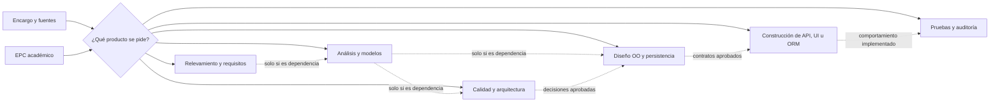

# Guía de rutas y productos para Sistemas de Información

## Propósito

Esta guía ayuda a elegir skills del repositorio según el **producto solicitado**, las
fuentes disponibles y el nivel de avance. No describe una cadena obligatoria ni exige
ejecutar las 22 skills: una tarea pequeña puede requerir una sola y un proyecto amplio
puede combinar varias con entregas intermedias aprobadas.

Cada skill debe conservar su responsabilidad. Una skill downstream consume artefactos
aprobados; no reconstruye silenciosamente requisitos, dominio o arquitectura para
completar su salida.

Las tablas muestran el `name` invocable. Los enlaces pueden apuntar a carpetas legacy
en camelCase que se conservan por compatibilidad de ruta.

## Selección mínima

Antes de activar una skill:

1. definir el artefacto o decisión que se necesita;
2. identificar la fuente autoritativa y los IDs que deben preservarse;
3. comprobar que existen las entradas mínimas;
4. elegir una skill primaria y agregar dependencias solo si aportan al producto;
5. marcar datos faltantes como pendientes en lugar de inventarlos;
6. ejecutar únicamente validaciones proporcionales al cambio.

Las flechas punteadas muestran precedencias posibles, no pasos automáticos. Por
ejemplo, una auditoría de API existente puede usar `api-design` directamente y un EPC
de arquitectura puede seleccionar `microservice-decomposer` sin generar una interfaz.

## Catálogo por producto

### Orquestación académica

| Skill | Usar cuando | Entrada principal | Producto |
|---|---|---|---|
| [`epc-flow-gen`](epcFlowGen/SKILL.md) | se aporta un Ejercicio Práctico Complementario de ASI/DSI | consigna, dominio, versión y criterios disponibles | matriz ítem → artefacto → evidencia → skill → estado y resolución ensamblada |

En este repositorio, EPC significa **Ejercicio Práctico Complementario**. Es un modo
transversal guiado por la consigna, no una notación de interfaz. La carpeta heredada
`epcFlowGen` se conserva por compatibilidad y la skill selecciona solo lo requerido.

### Relevamiento, requisitos y análisis

| Skill | Usar cuando | Entrada principal | Producto |
|---|---|---|---|
| [`system-classifier`](systemClassifier/SKILL.md) | se pide clasificar el sistema, encuadrar alcance/viabilidad o planificar PUD | información organizacional y restricciones | diagnóstico o estudio solicitado, con supuestos y pendientes |
| [`requirements-extractor`](requirementsExtractor/SKILL.md) | hay entrevistas, minutas o narrativa sin estructurar, o se pide un backlog de historias | fuentes de stakeholders | registro/ERS trazable o historias con conversación y confirmación |
| [`bpmn-extractor`](bpmnExtractor/SKILL.md) | se necesita modelar un proceso de negocio | narrativa y participantes del proceso | ficha y especificación trazable; BPD gráfico solo si hay una herramienta BPMN disponible |
| [`use-case-extractor`](useCaseExtractor/SKILL.md) | se necesitan el modelo o las descripciones de casos de uso | requisitos y reglas aprobados | inventario/diagrama o descripción institucional de CU |
| [`domain-model-gen`](domainModelGen/SKILL.md) | se necesita un modelo conceptual o DCA | requisitos, CU y glosario | clases conceptuales, relaciones y diccionario |
| [`crud-validator`](crudValidator/SKILL.md) | se quiere revisar cobertura de operaciones sobre entidades | CU/requisitos y modelo de dominio | matriz CRUD diagnóstica, excepciones y brechas propuestas |

### Calidad, arquitectura y estados

| Skill | Usar cuando | Entrada principal | Producto |
|---|---|---|---|
| [`quality-scenario-specifier`](qualityScenarioSpecifier/SKILL.md) | un atributo de calidad debe quedar observable y medible | RNF y evidencia de contexto | escenario de calidad; tácticas solo si corresponden al encargo |
| [`microservice-decomposer`](microserviceDecomposer/SKILL.md) | se evalúan límites, topología o una posible descomposición | dominio, drivers y restricciones | decisión arquitectónica y modelo de límites; puede concluir no descomponer |
| [`mermaid-diagram-gen`](mermaidDiagramGen/SKILL.md) | se pide renderizar/validar Mermaid o modelar un DTE/MTE | modelo semántico o ciclo de vida sustentado | diagrama solicitado y resultado de validación |

### Diseño orientado a objetos y persistencia

| Skill | Usar cuando | Entrada principal | Producto |
|---|---|---|---|
| [`grasp-sequence-realizer`](graspSequenceRealizer/SKILL.md) | se pide una RCU de análisis, un DSD o asignación de responsabilidades | CU descrito y modelo de análisis; DCD además para diseño | realización de análisis o diseño y justificaciones GRASP aplicables |
| [`domain-design`](domainDesign/SKILL.md) | se pide DCD o estructura de clases de diseño | modelo/RCU de análisis, reglas e invariantes aprobadas | DCD; código o arquitectura solo si forman parte del pedido |
| [`gof-adviser`](gofAdviser/SKILL.md) | existe una consideración, smell o variación que podría justificar un patrón | modelo/código y evidencia del problema | decisión GoF, alternativa y cambio solicitado |
| [`relational-object-map`](relationalObjectMap/SKILL.md) | se debe derivar un modelo relacional o DDL | DCD y reglas de persistencia | mapeo/DDL para el dialecto pedido |
| [`uml-consistency`](umlConsistency/SKILL.md) | ya existen varios artefactos que deben coincidir | DCD, DSD, DTE y/o código | informe cruzado; correcciones solo con fuente autoritativa explícita |

### Construcción y verificación downstream

| Skill | Usar cuando | Entrada principal | Producto |
|---|---|---|---|
| [`api-design`](apiDesign/SKILL.md) | se pide diseñar o auditar un contrato HTTP/REST | operaciones, consumidores y requisitos aprobados | OpenAPI/decisiones HTTP; código solo si se solicita |
| [`orm-master`](ormMaster/SKILL.md) | se audita o implementa un mapeo ORM concreto | modelo/esquema, stack y evidencia SQL | diagnóstico o cambio ORM verificado |
| [`design-ux-ui`](designUxUi/SKILL.md) | se pide UX, UI, prototipo o implementación frontend | tareas, contenido, marca y stack disponibles | artefacto UX/UI proporcional al pedido |
| [`backend-testing`](backendTesting/SKILL.md) | se pide estrategia, auditoría o implementación de tests | comportamiento, riesgos, contratos y código | matriz de cobertura y/o pruebas en el stack existente |

Estas cuatro skills no deben elegir por sí mismas framework, base, estilo visual ni
distribución de pruebas. Los artefactos de implementación aparecen solo cuando el
usuario pidió cambios y existe un proyecto objetivo.

### Soporte opcional fuera del núcleo ASI/DSI

| Skill | Usar cuando | Producto |
|---|---|---|
| [`notebooklmSourceNaming`](notebooklmSourceNaming/SKILL.md) | se preparan fuentes para NotebookLM | propuesta de nomenclatura |
| [`notebooklm`](notebooklm/SKILL.md) | se consulta una libreta NotebookLM ya autorizada | respuesta grounded con citas |
| [`oratoriaPnl`](pnlOratoria/SKILL.md) | se prepara una exposición oral | guion o plan de presentación |

Estas skills no son prerrequisitos de requisitos, análisis ni diseño. Activarlas solo
cuando el usuario solicita su producto específico.

## Rutas frecuentes

Las siguientes rutas son ejemplos configurables. Omitir cualquier paso cuyo producto
ya exista o no sea necesario.

### Resolver un EPC académico

1. `epc-flow-gen` descompone literalmente la consigna y crea la matriz de cobertura.
2. Selecciona una skill primaria por cada artefacto exigido.
3. Cada artefacto conserva el número de ítem y cita la evidencia del mismo EPC.
4. `epc-flow-gen` ensambla, registra pendientes y comprueba la cobertura.

Un EPC de Líneas Aéreas puede pedir RCU, DCA, DTE, DSD, DCD y un patrón; uno de
arquitectura puede pedir subdominios y vistas de microservicios. Ninguno habilita por
sí solo un rediseño de UI ni la ejecución del catálogo completo.

### Formalizar requisitos y análisis

`requirements-extractor` → `use-case-extractor` → `domain-model-gen`

- Usar `bpmn-extractor` solo si el proceso de negocio es parte del producto.
- Si se pide una realización, `use-case-extractor` entrega el CU descrito y
  `grasp-sequence-realizer` es su único propietario; no producirla en ambas skills.
- Usar `crud-validator` como control diagnóstico cuando exista suficiente modelo; no
  generar automáticamente CU para lograr una matriz “completa”.
- Mantener una fuente autoritativa para IDs, reglas y vocabulario.

### Pasar de análisis a diseño OO

`grasp-sequence-realizer (analysis-rcu, si se pide)` → `domain-design` →
`grasp-sequence-realizer (design-rcu, si se pide)`

La realización de análisis puede alimentar el DCD. La realización de diseño requiere
el DCD y sirve para comprobarlo o refinarlo; no ejecutar ambos modos por ceremonia.

- Invocar `gof-adviser` solo ante una consideración o problema que justifique patrón.
- Invocar `relational-object-map` solo cuando se pida persistencia relacional.
- Usar `uml-consistency` al comparar artefactos existentes, no para fabricar los que
  faltan.

### Evaluar arquitectura

`quality-scenario-specifier` → `microservice-decomposer`

Esta precedencia aplica cuando los escenarios de calidad son drivers de la decisión.
La salida puede ser mantener un monolito modular. No agregar microservicios, sagas,
brokers o tácticas por aparecer en una checklist.

### Construir y verificar

Elegir de forma independiente `api-design`, `orm-master` o `design-ux-ui` según la
superficie a construir. Ejecutar `backend-testing` después solo para el comportamiento
y riesgo afectados. No exigir frontend, API y ORM en todo sistema.

## Contrato de handoff entre skills

Cuando una salida alimenta otra:

- indicar archivo/sección y versión o estado de aprobación;
- preservar IDs de requisitos, reglas, CU, clases y escenarios;
- enumerar supuestos y pendientes sin convertirlos en hechos downstream;
- no regenerar el artefacto upstream salvo pedido explícito;
- registrar cualquier contradicción antes de continuar con la parte afectada;
- elegir una sola notación de diagrama, salvo necesidad expresa de interoperabilidad.

## Compuertas de calidad proporcionales

Aplicar solo las que correspondan al producto:

| Compuerta | Pregunta de cierre |
|---|---|
| evidencia | ¿cada dato no trivial proviene de una fuente o está marcado como supuesto? |
| cobertura | ¿cada ítem/requisito del alcance tiene respuesta o pendiente explícito? |
| nivel | ¿análisis y diseño conservan sus responsabilidades? |
| consistencia | ¿IDs, nombres, estados, mensajes y reglas coinciden entre artefactos? |
| contrato | ¿la implementación respeta el contrato aprobado sin ampliarlo? |
| verificación | ¿se ejecutaron controles relevantes y se reportó su resultado real? |

Finalizar cuando el producto solicitado supera sus compuertas aplicables. No añadir
documentación, código, diagramas, servidores o pruebas que no cambien ese resultado.
