# 📘 Instructivo Operativo Lineal: Implementación Exitosa de Sistemas de Información
### Pipeline Secuencial Skill por Skill: Del Contacto Inicial (Paso 1) al Producto Terminado (Paso 22)

---

## 🎯 1. Propósito y Visión del Pipeline

Este instructivo define la **cadena de valor secuencial y determinística** para implementar un Sistema de Información de punta a punta. Cada uno de los **22 pasos** corresponde a la ejecución individual de una **Agent Skill** del repositorio, donde la salida de cada paso constituye la entrada formal y validada del siguiente.

```mermaid
flowchart TD
    classDef pnl fill:#f3e8ff,stroke:#7e22ce,stroke-width:2px;
    classDef doc fill:#ede9fe,stroke:#6d28d9,stroke-width:2px;
    classDef req fill:#e0f2fe,stroke:#0284c7,stroke-width:2px;
    classDef asi fill:#e0e7ff,stroke:#4338ca,stroke-width:2px;
    classDef arq fill:#fef3c7,stroke:#d97706,stroke-width:2px;
    classDef dsi fill:#dcfce7,stroke:#15803d,stroke-width:2px;
    classDef api fill:#fce7f3,stroke:#be185d,stroke-width:2px;
    classDef test fill:#ffedd5,stroke:#c2410c,stroke-width:2px;

    P1["Paso 01: pnlOratoria<br/><i>Alineación y Diagnóstico de Stakeholders</i>"]:::pnl
    P2["Paso 02: notebooklmSourceNaming<br/><i>Taxonomía y Normalización de Fuentes</i>"]:::doc
    P3["Paso 03: notebooklm<br/><i>Base de Conocimiento Grounded & Citas</i>"]:::doc
    P4["Paso 04: systemClassifier<br/><i>TGS, Taxonomía SI & Prefactibilidad 5D</i>"]:::req
    P5["Paso 05: requirementsExtractor<br/><i>Especificación FURPS+ & Planguage</i>"]:::req
    P6["Paso 06: bpmnExtractor<br/><i>Modelado BPMN 2.0 & Fichas de Proceso</i>"]:::req
    P7["Paso 07: useCaseExtractor<br/><i>Casos de Uso Cockburn & Robustez BCE</i>"]:::asi
    P8["Paso 08: domainModelGen<br/><i>Modelo de Dominio Conceptual UML</i>"]:::asi
    P9["Paso 09: crudValidator<br/><i>Auditoría de Matriz CRUD & Brechas</i>"]:::asi
    P10["Paso 10: epcFlowGen<br/><i>Diseño de Flujos de Diálogo EPC</i>"]:::asi
    P11["Paso 11: qualityScenarioSpecifier<br/><i>Escenarios ISO 25010 & Tácticas SEI</i>"]:::arq
    P12["Paso 12: microserviceDecomposer<br/><i>Strategic DDD & Contenedores C4</i>"]:::arq
    P13["Paso 13: mermaidDiagramGen<br/><i>Máquinas de Estado UML & MTE</i>"]:::arq
    P14["Paso 14: graspSequenceRealizer<br/><i>DSD con 9 Patrones GRASP</i>"]:::dsi
    P15["Paso 15: domainDesign<br/><i>DCD, Dominio Rico & Hexagonal</i>"]:::dsi
    P16["Paso 16: gofAdviser<br/><i>Auditoría SOLID & Refactoring GoF</i>"]:::dsi
    P17["Paso 17: relationalObjectMap<br/><i>Mapeo Objeto-Relacional & DDL SQL</i>"]:::dsi
    P18["Paso 18: ormMaster<br/><i>Optimización ORM & Mitigación N+1</i>"]:::dsi
    P19["Paso 19: umlConsistency<br/><i>Linter Cruzado UML ↔ Código</i>"]:::dsi
    P20["Paso 20: apiDesign<br/><i>Contratos OpenAPI 3.x & RFC 9457</i>"]:::api
    P21["Paso 21: designUxUi<br/><i>Frontend DESIGN.md & Tokens Tailwind</i>"]:::api
    P22["Paso 22: backendTesting<br/><i>Pirámide de Tests, AAA & Doubles</i>"]:::test

    P1 --> P2 --> P3 --> P4 --> P5 --> P6 --> P7 --> P8 --> P9 --> P10 --> P11 --> P12 --> P13 --> P14 --> P15 --> P16 --> P17 --> P18 --> P19 --> P20 --> P21 --> P22
```

---

## 📋 2. Tabla Maestra de Secuencia de Skills

| Paso | Skill | Disciplina | Objetivo Principal | Entrada | Entregable Clave |
| :---: | :--- | :--- | :--- | :--- | :--- |
| **01** | [`pnlOratoria`](file:///c:/Git/skills/pnlOratoria/SKILL.md) | Comunicación | Calibrar stakeholders, analizar audiencia 5Q y detectar canales VAK. | Primer contacto con el cliente. | Matriz 5Q y perfil de interlocutores. |
| **02** | [`notebooklmSourceNaming`](file:///c:/Git/skills/notebooklmSourceNaming/SKILL.md) | Gestión Documental | Normalizar nombres de archivos con taxonomía de prefijos institucionales. | Audios, minutas y documentos crudos. | Archivos estandarizados (`ENT_`, `DOC_`, etc.). |
| **03** | [`notebooklm`](file:///c:/Git/skills/notebooklm/SKILL.md) | Gestión del Conocimiento | Crear libreta centralizada e ingestar fuentes para *grounded Q&A*. | Fuentes normalizadas del cliente. | Libreta del proyecto con citas automáticas. |
| **04** | [`systemClassifier`](file:///c:/Git/skills/systemClassifier/SKILL.md) | Viabilidad & TGS | Diagnóstico organizacional TGS, tipo de SI y prefactibilidad 5D (ROI/VAN). | Relevamiento inicial del negocio. | Informe de Prefactibilidad y alcance LCO. |
| **05** | [`requirementsExtractor`](file:///c:/Git/skills/requirementsExtractor/SKILL.md) | Requerimientos | Extraer y formalizar RF, RNF (FURPS+/ISO 25010), RN y Planguage. | Minutas, transcripciones de reuniones. | ERS/SRS formal con reglas de negocio. |
| **06** | [`bpmnExtractor`](file:///c:/Git/skills/bpmnExtractor/SKILL.md) | Procesos de Negocio | Modelar procesos en BPMN 2.0 y redactar Fichas de Proceso sin anti-patrones. | Narrativas operativas de negocio. | Diagramas BPMN 2.0 y Fichas de Proceso. |
| **07** | [`useCaseExtractor`](file:///c:/Git/skills/useCaseExtractor/SKILL.md) | Análisis Funcional (ASI) | Especificar Casos de Uso Cockburn Sea-Level con diálogo y análisis BCE. | ERS, Fichas de Proceso BPMN. | Especificación CU-XX y escenarios Gherkin. |
| **08** | [`domainModelGen`](file:///c:/Git/skills/domainModelGen/SKILL.md) | Modelado Conceptual (ASI) | Generar Modelo de Dominio UML con patrones canónicos de ASI. | Casos de Uso y reglas de negocio. | Diagrama de Clases Conceptual y Diccionario. |
| **09** | [`crudValidator`](file:///c:/Git/skills/crudValidator/SKILL.md) | Verificación Funcional | Auditar matriz CRUD (Entidades x CUs), detectar brechas y plan de remediación. | Lista de CUs y Modelo de Dominio. | Matriz CRUD auditada (cero huérfanas). |
| **10** | [`epcFlowGen`](file:///c:/Git/skills/epcFlowGen/SKILL.md) | Interfaz Conceptual | Diseñar flujos de diálogo EPC (Entrada - Proceso - Consulta) trazados con CUs. | Casos de Uso y Modelo de Dominio. | Flujos de diálogo de interfaz de usuario. |
| **11** | [`qualityScenarioSpecifier`](file:///c:/Git/skills/qualityScenarioSpecifier/SKILL.md) | Calidad de Software | Transformar RNFs en Escenarios de Calidad ISO 25010 de 6 partes y tácticas SEI. | RNF de la ERS y métricas de carga. | Escenarios de Calidad y tácticas de diseño. |
| **12** | [`microserviceDecomposer`](file:///c:/Git/skills/microserviceDecomposer/SKILL.md) | Arquitectura de Software | Definir Bounded Contexts (DDD), Context Map y diagrama C4 Contenedores. | Modelo de Dominio y Escenarios. | Arquitectura C4 y evaluación de modularidad. |
| **13** | [`mermaidDiagramGen`](file:///c:/Git/skills/mermaidDiagramGen/SKILL.md) | Modelado de Estados | Modelar Máquinas de Estado UML 2.5 (`stateDiagram-v2`) y validar MTE anti-deadlocks. | Ciclo de vida de entidades clave. | Diagramas de Estado y matrices MTE. |
| **14** | [`graspSequenceRealizer`](file:///c:/Git/skills/graspSequenceRealizer/SKILL.md) | Diseño Orientado a Objetos | Construir Diagramas de Secuencia (DSD) asignando responsabilidades con GRASP. | Casos de Uso y Modelo de Dominio. | Diagramas de Secuencia de Diseño (DSD). |
| **15** | [`domainDesign`](file:///c:/Git/skills/domainDesign/SKILL.md) | Arquitectura Limpia | Elaborar DCD de Dominio Rico (Value Objects, Tell Don't Ask, Hexagonal). | DSDs y reglas de negocio. | Diagrama de Clases de Diseño (DCD). |
| **16** | [`gofAdviser`](file:///c:/Git/skills/gofAdviser/SKILL.md) | Patrones de Diseño | Auditar principios SOLID y refactorizar code smells hacia patrones GoF. | DCD preliminar y lógica de negocio. | DCD refactorizado con patrones GoF. |
| **17** | [`relationalObjectMap`](file:///c:/Git/skills/relationalObjectMap/SKILL.md) | Persistencia Relacional | Mapear DCD a modelo relacional normalizado (1FN a BCNF) y generar DDL SQL. | DCD de dominio validado. | Script DDL SQL con PKs, FKs e índices. |
| **18** | [`ormMaster`](file:///c:/Git/skills/ormMaster/SKILL.md) | Optimización de Datos | Configurar ORM, erradicar consultas N+1 y habilitar concurrencia optimista. | Esquema DDL y DCD. | Configuración de mapeo ORM optimizada. |
| **19** | [`umlConsistency`](file:///c:/Git/skills/umlConsistency/SKILL.md) | Linter de Consistencia | Auditar consistencia estática cruzada entre DCD, DSD, DTE y DDL. | Todos los artefactos UML y BD. | Reporte de auditoría sin discrepancias. |
| **20** | [`apiDesign`](file:///c:/Git/skills/apiDesign/SKILL.md) | Contratos de Integración | Especificar contratos RESTful OpenAPI 3.x, idempotencia y errores RFC 9457. | Servicios de Aplicación del DCD. | Especificación formal OpenAPI 3.x. |
| **21** | [`designUxUi`](file:///c:/Git/skills/designUxUi/SKILL.md) | Frontend & Accesibilidad | Diseñar UI anti-slop con `DESIGN.md`, Design Tokens y Tailwind WCAG AA. | Flujos EPC y contratos OpenAPI. | Componentes UI interactivos accesibles. |
| **22** | [`backendTesting`](file:///c:/Git/skills/backendTesting/SKILL.md) | Calidad & Construcción | Implementar pirámide de pruebas automatizadas (AAA, Test Doubles Meszaros). | Código, Contratos API y Gherkin BDD. | Suite de pruebas en verde y pase a producción. |

---

## 🛠️ 3. Ejecución Detallada Skill por Skill: Qué se busca lograr en cada paso

---

### 🔹 Paso 01: Alineación, Calibración y Diagnóstico de Stakeholders
* **Skill a Ejecutar**: [`pnlOratoria`](file:///c:/Git/skills/pnlOratoria/SKILL.md)
* **🎯 Qué se busca lograr**:
  Establecer empatía inmediata (*rapport*) con los líderes del cliente en la primera reunión, identificando su mapa mental mediante la matriz 5Q (*Quiénes son, Qué saben, Qué necesitan, Qué objeciones tienen y Llamada a la acción*). Detectar su sistema representacional preferente (Visual, Auditivo o Kinestésico) para hablar en sus mismos términos y neutralizar temores a costos o interrupciones operativas antes de solicitar información técnica.
* **📥 Entrada**: Solicitud de reunión inicial, notas preliminares y perfiles de los directivos.
* **⚙️ Acción**: Aplicar técnicas de escucha activa, calibración no verbal y estructuración del discurso inicial con los 4 encuadres PNL (Objetivo, Evidencia, Relevancia y Como-Si).
* **📤 Salida**: Ficha de Perfil de Stakeholders 5Q con canal sensorial dominante y matriz de objeciones resueltas.
* **💬 Prompt sugerido**:
  > *"Activa `pnlOratoria`. Voy a tener la reunión de arranque con el Directorio y el Gerente de Operaciones para un nuevo sistema de gestión. Guíame para definir la matriz 5Q, detectar su canal VAK y establecer los encuadres para asegurar su compromiso con el proyecto."*

---

### 🔹 Paso 02: Taxonomía y Normalización de Fuentes del Cliente
* **Skill a Ejecutar**: [`notebooklmSourceNaming`](file:///c:/Git/skills/notebooklmSourceNaming/SKILL.md)
* **🎯 Qué se busca lograr**:
  Estandarizar y catalogar de forma inequívoca todo el material recibido del cliente (audios de entrevistas, minutas de relevamiento, manuales de sistemas legados, reglamentos de AFIP o leyes del sector) aplicando la convención formal de prefijos (`ENT_`, `DOC_`, `MAN_`, `AUD_`, `NOR_`). Esto evita duplicidades, confusión cronológica y asegura que cualquier cita futura sea rastreable al documento original.
* **📥 Entrada**: Carpeta con archivos dispares y nombres caóticos entregados por el cliente.
* **⚙️ Acción**: Analizar metadatos, fecha, emisor y contenido de cada fuente; renombrar aplicando la sintaxis `[PREFIJO]_[YYYY-MM-DD]_[Emisor]_[Tema].[ext]`.
* **📤 Salida**: Conjunto de fuentes normalizadas y catálogo estructurado de archivos listos para ingesta.
* **💬 Prompt sugerido**:
  > *"Activa `notebooklmSourceNaming`. Tengo estos 12 archivos con minutas, grabaciones y manuales viejos del cliente. Clasifícalos y renómbralos siguiendo la taxonomía oficial de prefijos."*

---

### 🔹 Paso 03: Base de Conocimiento Centralizada y Grounded Q&A
* **Skill a Ejecutar**: [`notebooklm`](file:///c:/Git/skills/notebooklm/SKILL.md)
* **🎯 Qué se busca lograr**:
  Crear una libreta centralizada del proyecto en NotebookLM e ingerir las fuentes normalizadas. Con esto se logra un motor de consulta con *grounded Q&A* (preguntas y respuestas ancladas estrictamente a los documentos cargados) que emitirá citas automáticas, impidiendo que el equipo o los agentes inventen reglas de negocio o supuestos falsos durante el desarrollo.
* **📥 Entrada**: Archivos normalizados en el Paso 02.
* **⚙️ Acción**: Conectar mediante el servidor MCP, registrar la libreta del proyecto, cargar fuentes y verificar indexación.
* **📤 Salida**: Libreta compartida del proyecto activa con panel de citas disponible.
* **💬 Prompt sugerido**:
  > *"Activa `notebooklm`. Crea la libreta 'Proyecto-SI-EmpresaX', carga todas las fuentes catalogadas y confírmame que podemos realizar consultas con citas grounded."*

---

### 🔹 Paso 04: Diagnóstico Organizacional, Taxonomía de SI y Prefactibilidad 5D
* **Skill a Ejecutar**: [`systemClassifier`](file:///c:/Git/skills/systemClassifier/SKILL.md)
* **🎯 Qué se busca lograr**:
  Analizar a la empresa bajo la Teoría General de Sistemas (TGS: límites, subsistemas, retroalimentación y entropía), clasificar el sistema a construir (TPS, MIS, DSS, ERP) y evaluar formalmente la viabilidad antes de gastar recursos. Calcular el $\text{ROI}$, $\text{Payback}$, $\text{VAN}$ y $\text{TIR}$ en la dimensión económica, y evaluar las dimensiones Técnica, Operativa, Legal y Temporal para cerrar el Hito LCO (*Life Cycle Objectives*) del PUD.
* **📥 Entrada**: Base de conocimiento del proyecto y notas de relevamiento inicial.
* **⚙️ Acción**: Aplicar la plantilla `prefeasibility_and_pud_report_template.md`, calcular métricas financieras y justificar la arquitectura general.
* **📤 Salida**: Informe de Diagnóstico TGS y Prefactibilidad Multidimensional (Hito LCO).
* **💬 Prompt sugerido**:
  > *"Activa `systemClassifier`. Basándote en las fuentes del relevamiento, clasifica el sistema según la TGS y la taxonomía de sistemas, y elabora el informe de prefactibilidad en las 5 dimensiones con cálculo de ROI y Payback."*

---

### 🔹 Paso 05: Extracción y Especificación Formal de Requerimientos
* **Skill a Ejecutar**: [`requirementsExtractor`](file:///c:/Git/skills/requirementsExtractor/SKILL.md)
* **🎯 Qué se busca lograr**:
  Transformar el lenguaje informal, vago o contradictorio de los usuarios en una Especificación de Requerimientos de Software (ERS / SRS) formal bajo estándares IEEE 830 / ISO 29148. Separar Requerimientos Funcionales (RF), Atributos de Calidad (RNF bajo FURPS+), Reglas de Negocio invariantes (RN), Restricciones (RES) y Supuestos (SUP), cuantificando la ambigüedad con Planguage (Tom Gilb).
* **📥 Entrada**: Transcripciones de entrevistas y notas del cliente alojadas en la libreta.
* **⚙️ Acción**: Ejecutar el pipeline de extracción taxonómica, aplicar reglas de calidad sintáctica y generar preguntas de clarificación para el cliente si hay vacíos.
* **📤 Salida**: Documento ERS formal (`requirements_specification.md`) y esquema JSON estructurado.
* **💬 Prompt sugerido**:
  > *"Activa `requirementsExtractor`. Procesa las transcripciones de entrevistas del relevamiento y redacta la ERS formal categorizando RF, RNF (FURPS+), RN y aplicando Planguage para eliminar términos vagos."*

---

### 🔹 Paso 06: Modelado de Procesos de Negocio en BPMN 2.0
* **Skill a Ejecutar**: [`bpmnExtractor`](file:///c:/Git/skills/bpmnExtractor/SKILL.md)
* **🎯 Qué se busca lograr**:
  Formalizar cómo opera el negocio actualmente (AS-IS) y cómo operará con el nuevo sistema (TO-BE) mediante diagramas BPMN 2.0 rigurosos. Representar áreas organizacionales con *Pools* y *Lanes*, compuertas lógicas explícitas (XOR, AND, OR), eventos de inicio/temporizador/fin y emitir la **Ficha de Proceso Institucional** auditada contra los anti-patrones AP-01 a AP-12.
* **📥 Entrada**: ERS formal y descripciones narrativas del flujo operativo.
* **⚙️ Acción**: Diseñar el modelo canónico JSON `BPMN-IR`, validar con `bpmn_ir_transformer.py` y generar el diagrama Mermaid/XML y la Ficha de Proceso.
* **📤 Salida**: Diagramas BPMN 2.0 y Fichas de Proceso Institucionales aprobadas.
* **💬 Prompt sugerido**:
  > *"Activa `bpmnExtractor`. Convierte la narrativa de los procesos de compras, inventario y facturación en especificaciones BPMN 2.0 con Pools/Lanes y emite la Ficha de Proceso sin anti-patrones."*

---

### 🔹 Paso 07: Especificación de Casos de Uso y Análisis de Robustez BCE
* **Skill a Ejecutar**: [`useCaseExtractor`](file:///c:/Git/skills/useCaseExtractor/SKILL.md)
* **🎯 Qué se busca lograr**:
  Descomponer los requerimientos funcionales en Casos de Uso del Sistema (CU-XX) a nivel de usuario (*Sea Level* de Alistair Cockburn). Redactar el diálogo paso a paso entre Actor y Sistema en dos columnas, detallar cursos alternativos/excepciones, asociar reglas de negocio (RN-XX) y definir escenarios de prueba de aceptación en formato BDD Gherkin (`Given-When-Then`), validando la viabilidad mediante análisis de robustez BCE (Boundary-Control-Entity).
* **📥 Entrada**: ERS y Fichas de Proceso BPMN.
* **⚙️ Acción**: Redactar la especificación formal del CU, validar pre/postcondiciones y trazar arquetipos BCE (Frontera, Control, Entidad).
* **📤 Salida**: Especificación formal de Casos de Uso (CU-XX) con contratos Gherkin y diagramas de robustez.
* **💬 Prompt sugerido**:
  > *"Activa `useCaseExtractor`. Especifica formalmente los Casos de Uso del módulo de ventas al nivel Sea Level en 2 columnas, incluyendo reglas de negocio, análisis de robustez BCE y criterios BDD Gherkin."*

---

### 🔹 Paso 08: Modelado de Dominio Conceptual en UML
* **Skill a Ejecutar**: [`domainModelGen`](file:///c:/Git/skills/domainModelGen/SKILL.md)
* **🎯 Qué se busca lograr**:
  Construir el Modelo de Dominio Conceptual del sistema aplicando estrictamente los **Patrones Canónicos de Análisis (ASI)**: *Ítem-Descriptor* (separar catálogo de existencias físicas), *Encabezado-Detalle* (transacciones compuestas), *Historial de Estados con vigencia temporal (`fechaHoraDesde`, `fechaHoraHasta`)* y *Rol/Tipo de Rol*. Elaborar el Diccionario de Datos formal para unificar el lenguaje del negocio.
* **📥 Entrada**: Casos de Uso, entidades identificadas en el análisis BCE y Reglas de Negocio.
* **⚙️ Acción**: Modelar clases conceptuales, atributos tipados, multiplicidades exactas (sin ambigüedades $0..*$ vs. $1..*$) y relaciones estructurales en Mermaid.
* **📤 Salida**: Diagrama de Clases del Dominio Conceptual (UML) y Diccionario de Datos del Dominio.
* **💬 Prompt sugerido**:
  > *"Activa `domainModelGen`. Genera el Diagrama de Clases del Dominio Conceptual en Mermaid aplicando los patrones Ítem-Descriptor, Encabezado-Detalle e Historial de Estados con vigencia temporal, junto a su Diccionario de Datos."*

---

### 🔹 Paso 09: Auditoría de Matriz CRUD y Cobertura del Dominio
* **Skill a Ejecutar**: [`crudValidator`](file:///c:/Git/skills/crudValidator/SKILL.md)
* **🎯 Qué se busca lograr**:
  Cruzar de manera exhaustiva las Entidades del Dominio contra los Casos de Uso en una **Matriz CRUD** (Create, Read, Update, Delete) para detectar brechas de completitud. Identificar **Entidades Fantasma** (se leen o modifican pero nadie las crea), **Datos Agujero Negro** (se registran pero ningún proceso los consulta) y **Entidades Huérfanas**, generando automáticamente el plan de remediación con los casos de uso faltantes.
* **📥 Entrada**: Lista completa de Casos de Uso (Paso 07) y Clases del Dominio (Paso 08).
* **⚙️ Acción**: Generar la matriz cruzada, ejecutar el algoritmo de detección de brechas y emitir el dictamen de completitud.
* **📤 Salida**: Informe de Matriz CRUD auditada y especificaciones de CUs correctivos integradas.
* **💬 Prompt sugerido**:
  > *"Activa `crudValidator`. Cruza todos los Casos de Uso contra las clases del Modelo de Dominio, audita si hay entidades fantasma o agujeros negros y entrégame la matriz validada al 100%."*

---

### 🔹 Paso 10: Diseño de Flujos de Diálogo de Interfaz (EPC)
* **Skill a Ejecutar**: [`epcFlowGen`](file:///c:/Git/skills/epcFlowGen/SKILL.md)
* **🎯 Qué se busca lograr**:
  Diseñar la experiencia e interacción del usuario bajo el paradigma **EPC (Entrada - Proceso - Consulta)**. Asegurar que cada formulario o pantalla tenga trazabilidad directa con los controladores de casos de uso y que los datos ingresados o consultados correspondan exactamente con los atributos definidos en el modelo de dominio.
* **📥 Entrada**: Casos de Uso aprobados y Modelo de Dominio.
* **⚙️ Acción**: Mapear flujos de navegación, definir campos de entrada, botones de disparo de procesos y paneles de consulta y validación.
* **📤 Salida**: Diagramas de Flujo de Diálogo EPC y especificación preliminar de interfaces de usuario.
* **💬 Prompt sugerido**:
  > *"Activa `epcFlowGen`. Diseña los flujos de diálogo de pantalla bajo el modelo Entrada-Proceso-Consulta para el flujo de emisión de facturas y gestión de cobros."*

---

### 🔹 Paso 11: Formalización de Escenarios de Calidad y Tácticas Arquitectónicas
* **Skill a Ejecutar**: [`qualityScenarioSpecifier`](file:///c:/Git/skills/qualityScenarioSpecifier/SKILL.md)
* **🎯 Qué se busca lograr**:
  Transformar los requerimientos no funcionales (rendimiento, seguridad, disponibilidad, modificabilidad) en **Escenarios de Calidad de 6 Partes** (SEI / ISO 25010) medibles objetivamente (*Fuente, Estímulo, Artefacto, Entorno, Respuesta y Medida de Respuesta*). Asociar a cada escenario las **Tácticas de Arquitectura** concretas para mitigarlo (ej. réplicas de lectura, tokens JWT con rotación, rate limiting, circuit breaker).
* **📥 Entrada**: RNF de la ERS y métricas de carga del negocio.
* **⚙️ Acción**: Formalizar los escenarios de 6 partes y seleccionar el catálogo de tácticas de Bass, Clements y Kazman.
* **📤 Salida**: Especificación formal de Escenarios de Calidad ISO 25010 y matriz de tácticas arquitectónicas.
* **💬 Prompt sugerido**:
  > *"Activa `qualityScenarioSpecifier`. Convierte los RNF de alta concurrencia y seguridad en escenarios de calidad de 6 partes ISO 25010 y define las tácticas arquitectónicas necesarias."*

---

### 🔹 Paso 12: Arquitectura Estratégica DDD y Contenedores C4
* **Skill a Ejecutar**: [`microserviceDecomposer`](file:///c:/Git/skills/microserviceDecomposer/SKILL.md)
* **🎯 Qué se busca lograr**:
  Definir la modularidad y fronteras del sistema mediante **Strategic Domain-Driven Design (DDD)**. Delimitar los *Bounded Contexts*, construir el *Context Map* (estableciendo patrones *Shared Kernel*, *Anti-Corruption Layer* o *Open Host Service*) y diagramar la arquitectura en **C4 Nivel 2 (Contenedores)**, fundamentando técnica y económicamente si el sistema inicia como un *Monolito Modular* o como *Microservicios*.
* **📥 Entrada**: Modelo de Dominio, Escenarios de Calidad y Fichas de Proceso.
* **⚙️ Acción**: Aplicar los criterios de cohesión de Richardson y Newman, trazar los límites contextuales y redactar el documento C4.
* **📤 Salida**: Diagramas C4 (Contexto y Contenedores) y Context Map formal de Bounded Contexts.
* **💬 Prompt sugerido**:
  > *"Activa `microserviceDecomposer`. Evalúa los límites de Bounded Contexts entre Ventas, Facturación y Stock; define el Context Map y genera el diagrama C4 de Contenedores justificando el trade-off arquitectónico."*

---

### 🔹 Paso 13: Modelado de Estados y Dinámica de Ciclo de Vida
* **Skill a Ejecutar**: [`mermaidDiagramGen`](file:///c:/Git/skills/mermaidDiagramGen/SKILL.md)
* **🎯 Qué se busca lograr**:
  Modelar las **Máquinas de Estado UML 2.5 (`stateDiagram-v2`)** para todas las entidades del dominio cuyo comportamiento varíe según su estado (`Orden`, `Factura`, `Envío`). Generar la **Matriz de Transición de Estados (MTE)** y verificar matemáticamente la ausencia de *deadlocks* (estados ciegos que no permiten finalizar la transacción) o estados inalcanzables.
* **📥 Entrada**: Ciclos de vida definidos en las Reglas de Negocio y Casos de Uso.
* **⚙️ Acción**: Redactar diagramas de estado Mermaid formales, tabular eventos disparadores, guardas de transición y construir la matriz MTE.
* **📤 Salida**: Diagramas de Máquinas de Estado UML y Matrices de Transición de Estados validadas.
* **💬 Prompt sugerido**:
  > *"Activa `mermaidDiagramGen`. Modela la máquina de estados UML para el ciclo de vida de un 'Pedido' desde su creación hasta su entrega o cancelación, y genera su matriz MTE verificando que no existan deadlocks."*

---

### 🔹 Paso 14: Realización de Casos de Uso con Patrones GRASP
* **Skill a Ejecutar**: [`graspSequenceRealizer`](file:///c:/Git/skills/graspSequenceRealizer/SKILL.md)
* **🎯 Qué se busca lograr**:
  Traducir la especificación de los Casos de Uso en **Diagramas de Secuencia de Diseño (DSD)** asignando responsabilidades entre objetos con los **9 Patrones GRASP de Craig Larman**: *Experto en Información* (cálculo de totales), *Creador* (instanciación responsable), *Controlador/Gestor* (recepción de eventos de UI), *Bajo Acoplamiento*, *Alta Cohesión*, *Polimorfismo*, *Fabricación Pura*, *Indirección* y *Variaciones Protegidas*.
* **📥 Entrada**: Casos de Uso (Paso 07) y Modelo de Dominio (Paso 08).
* **⚙️ Acción**: Trazar las líneas de vida, llamadas síncronas/asíncronas, creación de objetos y retornos en Mermaid Sequence.
* **📤 Salida**: Diagramas de Secuencia de Diseño (DSD) trazados formalmente con patrones GRASP.
* **💬 Prompt sugerido**:
  > *"Activa `graspSequenceRealizer`. Genera el Diagrama de Secuencia de Diseño para el caso de uso 'Confirmar Pedido', justificando explícitamente la aplicación de los patrones Experto, Creador y Controlador."*

---

### 🔹 Paso 15: Diseño de Dominio Rico y Arquitectura Hexagonal
* **Skill a Ejecutar**: [`domainDesign`](file:///c:/Git/skills/domainDesign/SKILL.md)
* **🎯 Qué se busca lograr**:
  Elaborar el **Diagrama de Clases de Diseño (DCD)** formal bajo los principios del **Dominio Rico** (erradicando modelos anémicos sin lógica) y **Arquitectura Hexagonal (Ports & Adapters)**. Encapsular invariantes en Entidades y Value Objects inmutables (`Dinero`, `CUIT`, `Dirección`), aplicar el principio *"Tell, Don't Ask"* y definir puertos (interfaces de repositorio y mensajería) en el centro de la aplicación.
* **📥 Entrada**: Diagramas de Secuencia (DSD) y reglas de negocio del dominio.
* **⚙️ Acción**: Especificar clases con tipado estricto, modificadores de acceso, métodos de negocio, Value Objects y puertos de infraestructura.
* **📤 Salida**: Diagrama de Clases de Diseño (DCD) formal en Arquitectura Limpia/Hexagonal.
* **💬 Prompt sugerido**:
  > *"Activa `domainDesign`. Modela el DCD para el módulo de facturación con Dominio Rico y Arquitectura Hexagonal, encapsulando las reglas en entidades y Value Objects bajo 'Tell, Don't Ask'."*

---

### 🔹 Paso 16: Auditoría SOLID y Refactorización con Patrones GoF
* **Skill a Ejecutar**: [`gofAdviser`](file:///c:/Git/skills/gofAdviser/SKILL.md)
* **🎯 Qué se busca lograr**:
  Auditar el DCD preliminar en búsqueda de violaciones a los principios SOLID y *code smells* (clases Dios, condicionales gigantescos por tipo o estado). Refactorizar el diseño incorporando **Patrones de Diseño GoF** adecuados: patrón *Strategy* para algoritmos de cálculo variables, *State* para comportamiento según estado, *Factory Method* para instanciación compleja y *Observer* para notificaciones desacopladas.
* **📥 Entrada**: DCD generado en el Paso 15.
* **⚙️ Acción**: Identificar puntos de fragilidad en el modelo de objetos y emitir la refactorización formal con patrones GoF.
* **📤 Salida**: DCD refinado, libre de olores de diseño y documentado con las decisiones GoF/SOLID.
* **💬 Prompt sugerido**:
  > *"Activa `gofAdviser`. Audita el DCD de liquidación de sueldos; detecta violaciones al principio Abierto/Cerrado en los cálculos y refactorízalo aplicando el patrón Strategy."*

---

### 🔹 Paso 17: Mapeo Objeto-Relacional y Generación de DDL SQL
* **Skill a Ejecutar**: [`relationalObjectMap`](file:///c:/Git/skills/relationalObjectMap/SKILL.md)
* **🎯 Qué se busca lograr**:
  Transformar las clases del dominio en un modelo relacional normalizado (1FN a BCNF). Definir la estrategia de persistencia para jerarquías de herencia (*Single Table*, *Joined Table* o *Table per Class*), establecer claves foráneas, restricciones de unicidad (`UNIQUE`), comprobación (`CHECK`) e índices de rendimiento, generando el script **DDL SQL** ejecutable.
* **📥 Entrada**: DCD aprobado en el Paso 16.
* **⚙️ Acción**: Aplicar las reglas de transformación objeto-relacional y emitir los scripts DDL optimizados.
* **📤 Salida**: Esquema relacional normalizado y script `schema.sql` con integridad referencial completa.
* **💬 Prompt sugerido**:
  > *"Activa `relationalObjectMap`. Realiza el mapeo relacional del DCD hacia una base de datos PostgreSQL en BCNF, seleccionando la estrategia Joined Table para la herencia y generando el script DDL con índices."*

---

### 🔹 Paso 18: Optimización de Persistencia ORM y Prevención N+1
* **Skill a Ejecutar**: [`ormMaster`](file:///c:/Git/skills/ormMaster/SKILL.md)
* **🎯 Qué se busca lograr**:
  Configurar la capa de persistencia en ORMs modernos (JPA/Hibernate o Entity Framework Core) para garantizar operaciones transaccionales eficientes. Erradicar el problema de rendimiento de consultas $N+1$ mediante *Fetch Joins*, *Entity Graphs* o *Query Splitting*, configurar el ciclo de vida de entidades (*detached*, *managed*) y habilitar el control de concurrencia optimista (`@Version` / `RowVersion`) para evitar sobreescrituras en accesos concurrentes.
* **📥 Entrada**: DCD y esquema DDL SQL.
* **⚙️ Acción**: Diseñar las anotaciones/mapeos fluidos del ORM, optimizar consultas de carga de detalles y parametrizar transacciones ACID.
* **📤 Salida**: Configuraciones de mapeo ORM optimizadas y libres de consultas $N+1$.
* **💬 Prompt sugerido**:
  > *"Activa `ormMaster`. Configura los mapeos de EF Core / Hibernate para Orden y Detalle, implementa Fetch Joins para evitar el antipatrón N+1 y añade control de concurrencia optimista con @Version."*

---

### 🔹 Paso 19: Linter y Verificación de Consistencia Cruzada UML
* **Skill a Ejecutar**: [`umlConsistency`](file:///c:/Git/skills/umlConsistency/SKILL.md)
* **🎯 Qué se busca lograr**:
  Ejecutar una auditoría estática automatizada para comprobar la **consistencia cruzada bidireccional** entre todos los modelos construidos: validar que cada mensaje del DSD exista como método en el DCD con la misma signatura y visibilidad, que las transiciones respeten la Máquina de Estados (DTE) y que todas las clases persistentes tengan sus tablas y columnas correspondientes en el DDL SQL.
* **📥 Entrada**: DCD, DSDs, DTE y scripts SQL DDL.
* **⚙️ Acción**: Parsear modelos y código, cruzar llamadas vs. declaraciones y reportar discrepancias.
* **📤 Salida**: Dictamen de Consistencia UML sin errores sintácticos ni divergencias de firma.
* **💬 Prompt sugerido**:
  > *"Activa `umlConsistency`. Audita la consistencia cruzada entre el Diagrama de Clases (DCD), el Diagrama de Secuencia (DSD) y la Máquina de Estados, verificando que no existan métodos huérfanos ni discrepancias."*

---

### 🔹 Paso 20: Diseño de Contratos de API RESTful
* **Skill a Ejecutar**: [`apiDesign`](file:///c:/Git/skills/apiDesign/SKILL.md)
* **🎯 Qué se busca lograr**:
  Exponer y formalizar las operaciones del sistema a través de APIs RESTful idiomáticas alcanzando el Nivel 2 y 3 de madurez de Richardson. Especificar el contrato en **OpenAPI 3.x (Swagger)**, definir esquemas de petición y respuesta, aplicar semántica e idempotencia HTTP (incluyendo la cabecera `Idempotency-Key` en operaciones críticas de creación) y estandarizar el manejo de errores bajo **RFC 7807 / RFC 9457 (*Problem Details*)**.
* **📥 Entrada**: Puertos de entrada y Servicios de Aplicación del DCD.
* **⚙️ Acción**: Redactar el archivo `openapi.yaml`, diseñar endpoints canónicos, códigos de estado y esquemas RFC 9457.
* **📤 Salida**: Contrato OpenAPI 3.x validado y congelado para el desarrollo de frontend y backend.
* **💬 Prompt sugerido**:
  > *"Activa `apiDesign`. Diseña el contrato OpenAPI 3.x para el módulo de facturación, incorporando idempotencia en pagos y estandarizando las respuestas de error bajo RFC 9457 Problem Details."*

---

### 🔹 Paso 21: Diseño de Frontend, Tokens UI y Prototipado Accesible
* **Skill a Ejecutar**: [`designUxUi`](file:///c:/Git/skills/designUxUi/SKILL.md)
* **🎯 Qué se busca lograr**:
  Diseñar e implementar la interfaz de usuario web con enfoque profesional y estético *"anti-slop"*. Generar el archivo institucional `DESIGN.md` con tokens de diseño (DTCG) para colores funcionales, tipografías y espaciados; maquetar componentes modulares e interactivos con **Tailwind CSS v3/v4** y validar el cumplimiento estricto de **Accesibilidad WCAG 2.1 AA** (contrastes de color $> 4.5:1$, soporte de lectores de pantalla y navegación por teclado).
* **📥 Entrada**: Flujos EPC (Paso 10) y contratos OpenAPI (Paso 20).
* **⚙️ Acción**: Generar tokens, redactar `DESIGN.md`, implementar vistas web accesibles y levantar el preview en vivo con `scripts/serve_preview.py`.
* **📤 Salida**: Especificación `DESIGN.md`, tokens exportados y prototipo frontend interactivo accesible.
* **💬 Prompt sugerido**:
  > *"Activa `designUxUi`. Genera la especificación DESIGN.md y crea la pantalla de checkout e historial de facturas en Tailwind CSS cumpliendo WCAG 2.1 AA, y levanta el servidor de preview."*

---

### 🔹 Paso 22: Batería de Pruebas Automatizadas y Aseguramiento de Calidad
* **Skill a Ejecutar**: [`backendTesting`](file:///c:/Git/skills/backendTesting/SKILL.md)
* **🎯 Qué se busca lograr**:
  Construir la red de seguridad automatizada del sistema implementando la **Pirámide de Pruebas**: 70% Pruebas Unitarias veloces y aisladas para el dominio, 20% Pruebas de Integración sobre repositorios y endpoints API (con bases efímeras o testcontainers) y 10% Pruebas de Aceptación End-to-End basadas en los contratos Gherkin del Paso 07. Aplicar el patrón **Arrange-Act-Assert (AAA)** y la taxonomía de Test Doubles de Gerard Meszaros (evitando el sobre-mockeo de entidades de dominio) para certificar el producto para su despliegue productivo final.
* **📥 Entrada**: Código de backend, controladores, entidades de dominio y escenarios BDD Gherkin.
* **⚙️ Acción**: Programar las suites de prueba, configurar aserciones estrictas, ejecutar la suite completa en verde y medir cobertura.
* **📤 Salida**: Batería de tests automatizados 100% en verde y reporte de certificación de calidad.
* **💬 Prompt sugerido**:
  > *"Activa `backendTesting`. Diseña la suite de pruebas unitarias y de integración para el servicio de órdenes bajo el patrón AAA, automatizando los escenarios Gherkin redactados en el Paso 07 sin caer en mockeo excesivo."*

---

## 🏁 4. Hito Final: Pase a Producción y Demostración al Cliente

Al concluir el **Paso 22**:
1. **Despliegue a Producción**: Se ejecutan las migraciones de base de datos (`schema.sql` del Paso 17) y se corren los *smoke tests*.
2. **Demostración Ejecutiva**: Se reactiva [`pnlOratoria`](file:///c:/Git/skills/pnlOratoria/SKILL.md) para estructurar la demo final ante el cliente integrando estímulos Visuales (interfaz `designUxUi`), Auditivos (ROI y métricas de rendimiento) y Kinestésicos (operación directa del sistema por parte del cliente).
3. **Entrega de Base de Conocimiento**: Se entrega la libreta del sistema en [`notebooklm`](file:///c:/Git/skills/notebooklm/SKILL.md) a los usuarios clave y equipo de soporte como manual interactivo asistido por IA.
4. **Firma del Hito IOC**: Culminación exitosa del proyecto con aceptación formal del cliente.
