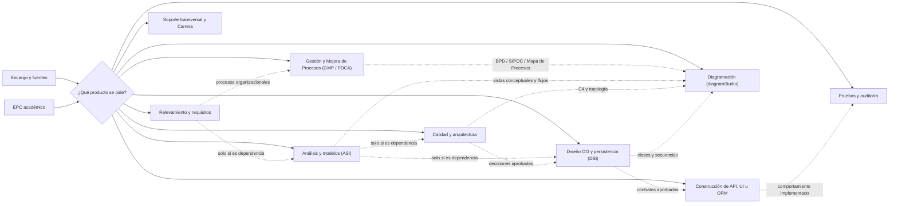

# Guía de rutas y productos para Sistemas de Información

## Propósito

Esta guía ayuda a elegir skills del repositorio según el **producto solicitado**, las
fuentes disponibles y el nivel de avance. No describe una cadena obligatoria ni exige
ejecutar las 27 skills: una tarea pequeña puede requerir una sola y un proyecto amplio
puede combinar varias con entregas intermedias aprobadas.

Cada skill debe conservar su responsabilidad. Una skill downstream consume artefactos
aprobados; no reconstruye silenciosamente requisitos, dominio o arquitectura para
completar su salida.

Las tablas muestran el `name` invocable. Los enlaces pueden apuntar a carpetas legacy
en camelCase que se conservan por compatibilidad de ruta.

## Compatibilidad entre agentes y nombres históricos

El despacho debe basarse en el `name` de frontmatter. Si una petición o artefacto usa
un nombre camelCase anterior o `design-md`, consultar el registro canónico
[`skill-aliases.json`](skill-aliases.json) y cargar sólo la skill destino. No adivinar
alias por similitud ni ejecutar dos paquetes para una misma identidad.

Esta guía describe productos, no una herramienta de orquestación específica:

- con invocación nativa, pasar a la skill elegida sólo las fuentes, IDs, supuestos y
  pendientes pertinentes;
- sin invocación nativa, leer el `SKILL.md` del paquete disponible y aplicar su
  contrato en la tarea actual;
- si el paquete no está disponible, dejar un handoff verificable y no sustituirlo con
  conocimiento general.

Los comandos auxiliares siguen la misma regla de portabilidad: detectar el runtime
disponible, ejecutar la validación real y declarar `no ejecutada` cuando el host no
pueda hacerlo.

## Selección mínima

Antes de activar una skill:

1. definir el artefacto o decisión que se necesita;
2. identificar la fuente autoritativa y los IDs que deben preservarse;
3. comprobar que existen las entradas mínimas;
4. elegir una skill primaria y agregar dependencias solo si aportan al producto;
5. marcar datos faltantes como pendientes en lugar de inventarlos;
6. ejecutar únicamente validaciones proporcionales al cambio.

Las flechas punteadas muestran precedencias posibles, no pasos automáticos. Por
ejemplo, una auditoría de API existente puede usar `api-design` directamente y un EPC
de arquitectura puede seleccionar `microservice-decomposer` sin generar una interfaz.

## Catálogo por producto

### Orquestación académica

| Skill | Usar cuando | Entrada principal | Producto |
|---|---|---|---|
| [`epc-flow-gen`](epcFlowGen/SKILL.md) | se aporta un Ejercicio Práctico Complementario de ASI/DSI | consigna, dominio, versión y criterios disponibles | matriz ítem → artefacto → evidencia → skill → estado y resolución ensamblada |

En este repositorio, EPC significa **Ejercicio Práctico Complementario**. Es un modo
transversal guiado por la consigna, no una notación de interfaz. La carpeta heredada
`epcFlowGen` se conserva por compatibilidad y la skill selecciona solo lo requerido.

### Relevamiento, requisitos y análisis

| Skill | Usar cuando | Entrada principal | Producto |
|---|---|---|---|
| [`system-classifier`](systemClassifier/SKILL.md) | se pide clasificar el sistema, encuadrar alcance/viabilidad o planificar PUD | información organizacional y restricciones | diagnóstico o estudio solicitado, con supuestos y pendientes |
| [`requirements-extractor`](requirementsExtractor/SKILL.md) | hay entrevistas, minutas o narrativa sin estructurar, o se pide un backlog de historias | fuentes de stakeholders | registro/ERS trazable o historias con conversación y confirmación |
| [`bpmn-extractor`](bpmnExtractor/SKILL.md) | se necesita modelar un proceso de negocio, validar concordancia SIPOC ↔ BPD (`sipoc-sync`) o comparar impacto operacional AS-IS vs TO-BE (`diff-as-is-to-be`) | narrativa, matriz SIPOC o modelos de proceso | ficha y especificación BPD trazable, matriz SIPOC-sync, reporte comparativo diff y JSON BPMN-IR exportable a Mermaid/Draw.io |
| [`use-case-extractor`](useCaseExtractor/SKILL.md) | se necesitan el modelo o las descripciones de casos de uso | requisitos y reglas aprobados | inventario/diagrama o descripción institucional de CU |
| [`domain-model-gen`](domainModelGen/SKILL.md) | se necesita un modelo conceptual o DCA | requisitos, CU y glosario | clases conceptuales, relaciones y diccionario |
| [`crud-validator`](crudValidator/SKILL.md) | se quiere revisar cobertura de operaciones sobre entidades | CU/requisitos y modelo de dominio | matriz CRUD diagnóstica, excepciones y brechas propuestas |

### Calidad, arquitectura y diagramación

| Skill | Usar cuando | Entrada principal | Producto |
|---|---|---|---|
| [`quality-scenario-specifier`](qualityScenarioSpecifier/SKILL.md) | un atributo de calidad debe quedar observable y medible | RNF y evidencia de contexto | escenario de calidad; tácticas solo si corresponden al encargo |
| [`microservice-decomposer`](microserviceDecomposer/SKILL.md) | se evalúan límites, topología o una posible descomposición | dominio, drivers y restricciones | decisión arquitectónica y modelo de límites; puede concluir no descomponer |
| [`diagramStudio`](diagramStudio/SKILL.md) | se pide cualquier diagrama (flujo, secuencia, clases, ERD, estados, C4, mapa de procesos institucional de 3 niveles, SIPOC visual, gantt) o se infiere necesidad visual (activación automática) | especificación, código, modelo IR o solicitud textual | bloque Mermaid in-line, archivo `.drawio` editable o modo dual simultáneo con autolayout y sincronización incremental |

### Gestión y Mejora de Procesos (GMP / Ciclo PDCA)

| Skill | Usar cuando | Entrada principal | Producto |
|---|---|---|---|
| [`process-workbench`](processWorkbench/SKILL.md) | se encuadra el negocio, coordinan metodológicamente las Etapas 1 a 3 y orquesta la interacción entre las skills atómicas especializadas | caso de negocio, relevamiento institucional y diagnóstico operativo | gobernanza integral de Etapas 1 a 3, compilación analítica y articulación metodológica |
| [`virtual-value-chain`](virtualValueChain/SKILL.md) | se analiza y estructura la Cadena de Valor Virtual (Rayport & Sviokla) en Etapa 1, mapeando la transformación de datos en 5 procesos canónicos y 3 fases de madurez digital | narrativa operativa, flujo de datos brutos y modelo de negocio | matriz canónica en 'cadena_valor_virtual.md' con Encuadre Matriz 1, cruce físico-virtual y diagnóstico SDL |
| [`process-critical-selector`](processCriticalSelector/SKILL.md) | se evalúa y prioriza matemáticamente el proceso crítico de negocio a intervenir en Etapa 1 aplicando la matriz multicriterio de los 5 factores de cátedra | lista de candidatos a procesos, objetivos estratégicos y dolores operativos | matriz de decisión multicriterio ponderada, ranking y justificación en 'seleccion_proceso.md' |
| [`organizational-motivations`](organizationalMotivations/SKILL.md) | se relevan las motivaciones estratégicas de la organización, cruzando el negocio con los 10 macro-sectores del Mapa de Tendencias SDLI (3 dimensiones) bajo Lógica Dominante del Servicio (SDL) | perfil institucional, objetivos SMART, contexto de mercado y clientes | matriz canónica en 'motivaciones.md' con tendencias del entorno, demandas del cliente e impulsores de mejora |
| [`sipoc-builder`](sipocBuilder/SKILL.md) | se delimita el alcance y fronteras del proceso, definen 4 a 7 macroetapas y especifican requisitos técnicos de entrada/salida exportables a diagramStudio | narrativa, relevamiento de proceso o ficha preliminar | matriz canónica en 'sipoc.md', bloque Mermaid oficial y especificaciones de calidad para bpmnExtractor sipoc-sync |
| [`process-auditor`](processAuditor/SKILL.md) | se audita el proceso actual AS-IS bajo los 4 ejes obligatorios de GUI_U2 | entrevistas, minutas y evidencias de campo | RCM de control interno (COSO), matriz SoD, diagnóstico de ruta documental, ergonomía/factores humanos y silos TI |
| [`stakeholder-matrix`](stakeholderMatrix/SKILL.md) | se relevan, categorizan y analizan partes interesadas internas (operativos, supervisores, gerencia) y externas (clientes, proveedores, reguladores) | narrativas, entrevistas, minutas de campo o auditoría | matriz canónica de triple columna (Resultados, Expectativas, Obstáculos) persistida en `stakeholders.md` con mapa de tensiones e insumos para FODA/CAME |
| [`foda-process`](fodaProcess/SKILL.md) | se estructura y valida la Matriz FODA del proceso operativo en Etapa 2 con estricta delimitación de frontera interna/externa (controlabilidad) | evidencias forenses de processAuditor, stakeholderMatrix y encuadre | matriz canónica de 4 cuadrantes persistida en `foda.md` con cardinalidad 4-6 y trazabilidad obligatoria |
| [`came-strategizer`](cameStrategizer/SKILL.md) | se construyen y auditan los cruces estratégicos de la Matriz CAME (FO, FA, DO, DA) a partir del diagnóstico FODA | matriz FODA del proceso validada y objetivos estratégicos | matriz formal de cruces estratégicos CAME en 'came.md' |
| [`value-actions-builder`](valueActionsBuilder/SKILL.md) | se formula el inventario de Acciones de Valor EERR (Eliminar, Reducir, Incrementar, Crear) y evalúa mediante el Filtro de Restricciones Operativas en Etapa 3 | cruces estratégicos CAME (FO, FA, DO, DA) | inventario de acciones y matriz de restricciones en 'acciones_valor.md' |
| [`bpmn-extractor`](bpmnExtractor/SKILL.md) | se modela BPD descriptivo u operacional, audita consistencia SIPOC ↔ BPD (`sipoc-sync`) o compara AS-IS vs TO-BE (`diff-as-is-to-be`) | narrativa, matriz SIPOC o modelos de proceso | ficha institucional, especificación BPD, matriz SIPOC normalizada y reporte comparativo diff con métricas de racionalización |
| [`kpi-designer`](kpiDesigner/SKILL.md) | se diseñan o auditan métricas, indicadores y tableros en Operaciones (O1 vs O2), Negocio (BSC, OKRs), DevOps/Software (DORA, SRE/SLO) o Producto (HEART) | objetivos SMART, acciones de valor o acuerdos de nivel de servicio | fichas técnicas de KPIs con validación sintáctica SMART en español, fórmulas dimensionales y procedencia exacta del dato |
| [`process-improvement-planner`](processImprovementPlanner/SKILL.md) | se orquesta el ciclo PDCA completo en 4 etapas y se requiere informe consolidado sin Excel | artefactos de Etapas 1 a 4 | informe técnico maestro en Markdown (.md), cronograma Gantt en Mermaid y matriz de trazabilidad integral E1➔E4 |

### Diseño orientado a objetos y persistencia

| Skill | Usar cuando | Entrada principal | Producto |
|---|---|---|---|
| [`grasp-sequence-realizer`](graspSequenceRealizer/SKILL.md) | se pide una RCU de análisis, un DSD o asignación de responsabilidades | CU descrito y modelo de análisis; DCD además para diseño | realización de análisis o diseño y justificaciones GRASP aplicables |
| [`domain-design`](domainDesign/SKILL.md) | se pide DCD o estructura de clases de diseño | modelo/RCU de análisis, reglas e invariantes aprobadas | DCD; código o arquitectura solo si forman parte del pedido |
| [`gof-adviser`](gofAdviser/SKILL.md) | existe una consideración, smell o variación que podría justificar un patrón | modelo/código y evidencia del problema | decisión GoF, alternativa y cambio solicitado |
| [`relational-object-map`](relationalObjectMap/SKILL.md) | se debe derivar un modelo relacional o DDL | DCD y reglas de persistencia | mapeo/DDL para el dialecto pedido |
| [`uml-consistency`](umlConsistency/SKILL.md) | ya existen varios artefactos que deben coincidir | DCD, DSD, DTE y/o código | informe cruzado; correcciones solo con fuente autoritativa explícita |

### Construcción y verificación downstream

| Skill | Usar cuando | Entrada principal | Producto |
|---|---|---|---|
| [`api-design`](apiDesign/SKILL.md) | se pide diseñar o auditar un contrato HTTP/REST | operaciones, consumidores y requisitos aprobados | OpenAPI/decisiones HTTP; código solo si se solicita |
| [`orm-master`](ormMaster/SKILL.md) | se audita o implementa un mapeo ORM concreto | modelo/esquema, stack y evidencia SQL | diagnóstico o cambio ORM verificado |
| [`design-ux-ui`](designUxUi/SKILL.md) | se pide UX, UI, prototipo o implementación frontend | tareas, contenido, marca y stack disponibles | artefacto UX/UI proporcional al pedido |
| [`backend-testing`](backendTesting/SKILL.md) | se pide estrategia, auditoría o implementación de tests | comportamiento, riesgos, contratos y código | matriz de cobertura y/o pruebas en el stack existente |

Estas cuatro skills no deben elegir por sí mismas framework, base, estilo visual ni
distribución de pruebas. Los artefactos de implementación aparecen solo cuando el
usuario pidió cambios y existe un proyecto objetivo.

### Soporte opcional fuera del núcleo ASI/DSI

| Skill | Usar cuando | Producto |
|---|---|---|
| [`notebooklmSourceNaming`](notebooklmSourceNaming/SKILL.md) | se preparan fuentes para NotebookLM | propuesta de nomenclatura |
| [`notebooklm`](notebooklm/SKILL.md) | se consulta una libreta NotebookLM ya autorizada | respuesta grounded con citas |
| [`oratoriaPnl`](pnlOratoria/SKILL.md) | se prepara una exposición oral | guion o plan de presentación con técnicas de PNL |
| [`humanizer`](humanizer/SKILL.md) | se busca desintoxicar textos de patrones y clichés de IA | texto con cadencia rítmica (burstiness), perplejidad y tono adaptado |
| [`cvOptimizer`](cvOptimizer/SKILL.md) | se requiere crear o modernizar un CV para postulaciones de alto impacto | CV ATS en LaTeX (Awesome-CV / fórmula Google X-Y-Z), PDF compilado y paquete multicanal |

Estas skills no son prerrequisitos de requisitos, análisis ni diseño. Activarlas solo
cuando el usuario solicita su producto específico.

## Rutas frecuentes

Las siguientes rutas son ejemplos configurables. Omitir cualquier paso cuyo producto
ya exista o no sea necesario.

### Resolver un EPC académico

1. `epc-flow-gen` descompone literalmente la consigna y crea la matriz de cobertura.
2. Selecciona una skill primaria por cada artefacto exigido.
3. Cada artefacto conserva el número de ítem y cita la evidencia del mismo EPC.
4. `epc-flow-gen` ensambla, registra pendientes y comprueba la cobertura.

Un EPC de Líneas Aéreas puede pedir RCU, DCA, DTE, DSD, DCD y un patrón; uno de
arquitectura puede pedir subdominios y vistas de microservicios. Ninguno habilita por
sí solo un rediseño de UI ni la ejecución del catálogo completo.

### Formalizar requisitos y análisis

`requirements-extractor` → `use-case-extractor` → `domain-model-gen`

- Usar `bpmn-extractor` solo si el proceso de negocio es parte del producto.
- Si se pide una realización, `use-case-extractor` entrega el CU descrito y
  `grasp-sequence-realizer` es su único propietario; no producirla en ambas skills.
- Usar `crud-validator` como control diagnóstico cuando exista suficiente modelo; no
  generar automáticamente CU para lograr una matriz “completa”.
- Mantener una fuente autoritativa para IDs, reglas y vocabulario.

### Pasar de análisis a diseño OO

`grasp-sequence-realizer (analysis-rcu, si se pide)` → `domain-design` →
`grasp-sequence-realizer (design-rcu, si se pide)`

La realización de análisis puede alimentar el DCD. La realización de diseño requiere
el DCD y sirve para comprobarlo o refinarlo; no ejecutar ambos modos por ceremonia.

- Invocar `gof-adviser` solo ante una consideración o problema que justifique patrón.
- Invocar `relational-object-map` solo cuando se pida persistencia relacional.
- Usar `uml-consistency` al comparar artefactos existentes, no para fabricar los que
  faltan.

### Evaluar arquitectura

`quality-scenario-specifier` → `microservice-decomposer`

Esta precedencia aplica cuando los escenarios de calidad son drivers de la decisión.
La salida puede ser mantener un monolito modular. No agregar microservicios, sagas,
brokers o tácticas por aparecer en una checklist.

### Construir y verificar

Elegir de forma independiente `api-design`, `orm-master` o `design-ux-ui` según la
superficie a construir. Ejecutar `backend-testing` después solo para el comportamiento
y riesgo afectados. No exigir frontend, API y ORM en todo sistema.

### Ejecutar el ciclo de Gestión y Mejora de Procesos (GMP / PDCA)

`process-workbench` (E1) → `bpmn-extractor` + `process-auditor` + `process-workbench` (E2) → `process-workbench` (E3) → `bpmn-extractor` + `kpi-designer` + `process-improvement-planner` (E4)

1. **Etapa 1 — Situación Actual y Selección Ponderada del Proceso Crítico:**
   - `process-workbench`: orquesta el encuadre institucional y metodológico de la Etapa 1, articulando las salidas de las skills atómicas.
   - `virtualValueChain`: modela la Cadena de Valor Virtual de 5 etapas (Recopilar, Organizar, Seleccionar, Sintetizar, Distribuir) cruzada con la cadena física de Porter (La Matriz del Valor) y clasifica la madurez digital en 3 fases de cátedra (Visibilidad, Proyección de la Capacidad / Reflejo, La Matriz del Valor / Nuevas Relaciones), guardando deterministamente `cadena_valor_virtual.md`.
   - `processCriticalSelector`: evalúa de forma atómica y multicriterio la selección del proceso crítico aplicando el vector ponderado de los 5 factores de cátedra ($\sum w_i = 1.00$) con escala discreta [1..5], regla de desempate y ranking justificado en `seleccion_proceso.md`.
   - `organizationalMotivations`: cruza el negocio con los 10 macro-sectores del Mapa de Tendencias SDLI y sus 3 dimensiones (Sociedad-Cultura, Tecnología-Ciencia, Economía-Mercado) bajo Lógica Dominante del Servicio (SDL), relevando necesidades del cliente e impulsores de mejora en `motivaciones.md`.
   - `diagramStudio`: genera el Mapa de Procesos Institucional (3 niveles canónicos: Estratégicos, Clave/Operativos, Soporte) con flechas de requisitos y satisfacción del cliente.
2. **Etapa 2 — Diagnóstico AS-IS, Auditoría Forense y Modelado:**
   - `sipocBuilder`: delimita las fronteras de inicio/fin del proceso crítico, fija las 4 a 7 macroetapas operativas, formula las especificaciones técnicas y requisitos de calidad de entradas y salidas, genera el diagrama Mermaid y persiste deterministamente el entregable canónico `sipoc.md`.
   - `bpmn-extractor`: modela el BPD AS-IS descriptivo u operacional y ejecuta el modo `sipoc-sync` para validar la concordancia matemática bidireccional entre la tabla `sipoc.md` y los nodos/flujos del BPD.
   - `process-auditor`: audita exhaustivamente los 4 ejes de `GUI_U2`: 1) Control Interno COSO (matriz RCM, salvaguarda de activos/mercaderías, matriz de segregación de funciones SoD, autorizaciones y doble registro), 2) Formularios y Ruta Documental (diseño, copias, archivo), 3) Factores Humanos y Condiciones Laborales (ergonomía, tiempos muertos, clima laboral), 4) Soporte Informático y Silos TI (integración ERP, recaptura manual, fallas de interfaz).
   - `stakeholderMatrix`: releva, clasifica y diagnostica a las partes interesadas internas y externas bajo el principio de bidireccionalidad, generando la matriz de triple columna (Resultados, Expectativas, Obstáculos) en `stakeholders.md`.
   - `fodaProcess`: construye y valida la Matriz FODA del proceso operativo con delimitación rigurosa de frontera interna/externa (controlabilidad), cardinalidad de 4-6 factores por cuadrante y trazabilidad forense de debilidades en `foda.md`.
3. **Etapa 3 — Propuesta de Mejora y Alineación Estratégica:**
   - `process-workbench`: coordina metodológicamente la Etapa 3 y articula los cruces estratégicos y acciones de valor.
   - `cameStrategizer`: construye, audita y valida de forma atómica la Matriz CAME en sus 4 cuadrantes canónicos (FO Ofensiva, FA Defensiva, DO Reorientación, DA Supervivencia) con citación explícita de factores ($F_i \times O_j$), doble formulación (enunciado táctico + acción operativa tangible) y persistencia determinista en `came.md`. Valida la conformidad de cátedra con `python scripts/validate_came.py`.
   - `valueActionsBuilder`: formula de forma atómica el inventario de Acciones de Valor bajo el esquema EERR (Eliminar, Reducir, Incrementar, Crear), somete cada iniciativa al Filtro de Restricciones Operativas (Plazos, Presupuesto, Dependencia TI, Resistencia al Cambio), documenta las medidas de mitigación requeridas y mapea los procesos afectados en el entregable canónico `acciones_valor.md`. Valida la gobernanza con `scripts/validate_value_actions.py`.
4. **Etapa 4 — Rediseño TO-BE, Medición Cuantitativa y Planificación:**
   - `bpmn-extractor`: modela el BPD TO-BE y ejecuta `diff-as-is-to-be` para cuantificar la optimización operativa (reducción de actividades, tareas manuales automatizadas, eliminación de handoffs).
   - `kpi-designer`: diseña el sistema de medición formalizando objetivos SMART (`[Verbo] + [Variable] + [Base -> Meta] + [Plazo]`), clasificando Indicadores de Resultado (O1 / Eficacia) vs Indicadores de Proceso (O2 / Eficiencia), validando fórmulas dimensionales y fijando la Fuente Primaria del Dato (evento exacto de captura en el BPD TO-BE). Ejecutar el validador CLI `python scripts/validate_kpi.py` para asegurar consistencia determinista.
   - `process-improvement-planner`: orquesta y ensambla la entrega consolidada en un Informe Técnico Maestro en Markdown (`.md`), diagrama de Gantt en Mermaid (`gantt`) con fases (Diseño, Piloto, Despliegue, Evaluación) e hitos, y la Matriz de Trazabilidad Integral de Extremo a Extremo (E1 ➔ E2 ➔ E3 ➔ E4) sin dependencia de Excel.
   - `diagramStudio`: exporta los diagramas del proceso a formato editable `.drawio` y/o bloques Mermaid in-line.

### Diagramación técnica y visual con diagramStudio

`diagramStudio` se activa de forma automática e implícita siempre que se solicita un diagrama en texto o se infiere necesidad visual:
1. **Selección de modo:**
   - `mode: "mermaid"`: bloque in-line para lectura inmediata en chat, PRs o documentación Markdown.
   - `mode: "drawio"`: archivo XML editable `.drawio` con estilos, formas nativas y autolayout determinista para diagrams.net.
   - `mode: "dual"`: previsualización Mermaid en chat y persistencia editable `.drawio` en una sola acción.
2. **Presets de alto nivel:**
   - *Procesos:* Mapa de Procesos Institucional (3 niveles), Diagrama SIPOC Visual, BPMN Pools/Lanes.
   - *Arquitectura y Software:* C4 (Contexto, Contenedores, Componentes), ERD, Secuencia, Clases, Estados, SysML, Cloud (AWS, Azure, GCP, K8s).
3. **Mantenimiento incremental:**
   - Usar `diagramctl.py sync` para actualizar diagramas generados a partir de cambios en código, infraestructura o modelos sin perder las coordenadas y diagramación manual previa.

### Diseño y auditoría universal de métricas con kpiDesigner

`kpi-designer` formaliza y audita sistemas de medición métrica en cualquier dominio:
1. **Seleccionar marco según dominio:**
   - *Operaciones y Procesos:* Eficacia (O1) vs Eficiencia (O2), Lead Time, Cycle Time, Scrap, OEE, First Pass Yield.
   - *Estrategia y Negocio:* Balanced Scorecard (Kaplan & Norton: Financiera, Cliente, Procesos Internos, Aprendizaje/Crecimiento), OKRs, ROI, EBITDA.
   - *Ingeniería de Software & DevOps:* Métricas DORA (Deployment Frequency, Lead Time for Changes, MTTR, Change Failure Rate), SRE (SLAs, SLOs, SLIs, Error Budgets).
   - *Producto y UX:* Framework HEART (Happiness, Engagement, Adoption, Retention, Task Success), North Star Metric, Churn, LTV, CAC.
2. **Formalizar contrato métrico:**
   - Redactar objetivo SMART: `[Verbo infinitivo] + [Variable] + [de Valor Inicial a Valor Meta] + [Plazo o Fecha]`.
   - Especificar fórmula matemática dimensional ($\frac{\text{Numerador}}{\text{Denominador}} \times 100$) con unidades explícitas.
   - Definir polaridad (mayor mejor / menor mejor), periodicidad y la Fuente Primaria del Dato (evento/transacción de origen).
3. **Validar deterministamente:**
   - Ejecutar el script `python scripts/validate_kpi.py <archivo.json>` para verificar automáticamente conformidad de regex SMART en español y consistencia matemática de fórmulas.

## Contrato de handoff entre skills

Cuando una salida alimenta otra:

- indicar archivo/sección y versión o estado de aprobación;
- preservar IDs de requisitos, reglas, CU, clases y escenarios;
- enumerar supuestos y pendientes sin convertirlos en hechos downstream;
- no regenerar el artefacto upstream salvo pedido explícito;
- registrar cualquier contradicción antes de continuar con la parte afectada;
- elegir una sola notación de diagrama, salvo necesidad expresa de interoperabilidad; con `diagramStudio` es posible emitir simultáneamente Mermaid (chat/Markdown) y `.drawio` (editable).

## Compuertas de calidad proporcionales

Aplicar solo las que correspondan al producto:

| Compuerta | Pregunta de cierre |
|---|---|
| evidencia | ¿cada dato no trivial proviene de una fuente o está marcado como supuesto? |
| cobertura | ¿cada ítem/requisito del alcance tiene respuesta o pendiente explícito? |
| nivel | ¿análisis y diseño conservan sus responsabilidades? |
| consistencia | ¿IDs, nombres, estados, mensajes y reglas coinciden entre artefactos? |
| contrato | ¿la implementación respeta el contrato aprobado sin ampliarlo? |
| verificación | ¿se ejecutaron controles relevantes y se reportó su resultado real? |

Finalizar cuando el producto solicitado supera sus compuertas aplicables. No añadir
documentación, código, diagramas, servidores o pruebas que no cambien ese resultado.
