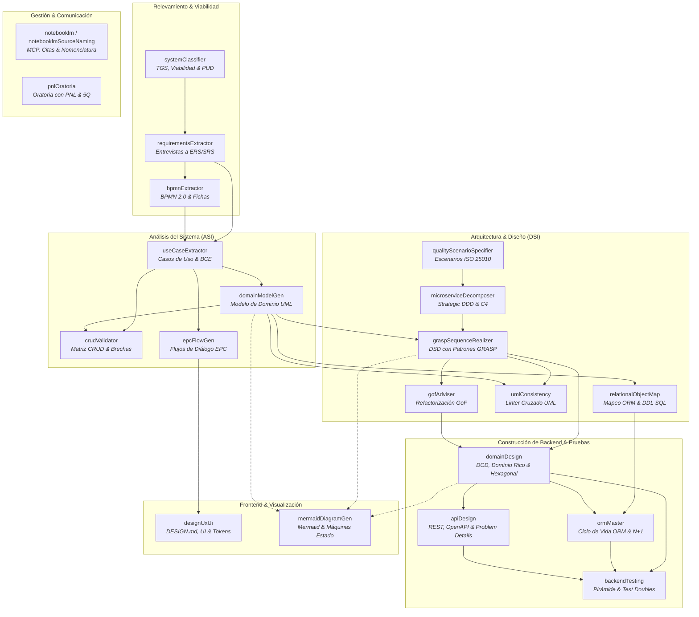

# 🎯 Agent Skills Repository

Repositorio centralizado de **Agent Skills** modulares, especializadas y basadas en estándares de ingeniería de software, arquitectura de sistemas, modelado formal, diseño UX/UI, gestión de conocimiento y comunicación profesional.

Estas habilidades están diseñadas para ser consumidas y ejecutadas por agentes de Inteligencia Artificial (compatibles con **Google Antigravity**, **Claude Code**, **Cursor**, **Windsurf**, agentes basados en OpenAI y frameworks agénticos avanzados) conforme al estándar de carpetas `SKILL.md`.

> 📘 **Playbook Maestro**: Consultá el [**Instructivo de Implementación Exitosa de Sistemas de Información (Paso 0 a Producción)**](GUIA_IMPLEMENTACION_SISTEMAS.md), que orquesta el ciclo de vida completo integrando las 22 skills del repositorio con compuertas de calidad (*Quality Gates*).

---

## 📌 Contenido

- [Instructivo Operativo End-to-End](GUIA_IMPLEMENTACION_SISTEMAS.md)
- [Visión General y Propósito](#-visión-general-y-propósito)
- [Mapa del Ciclo de Vida de Software](#-mapa-del-ciclo-de-vida-de-software)
- [Catálogo de Skills](#-catálogo-de-skills)
  - [1. Requerimientos, Viabilidad y Procesos de Negocio](#1-requerimientos-viabilidad-y-procesos-de-negocio)
  - [2. Análisis Funcional y Especificación del Sistema](#2-análisis-funcional-y-especificación-del-sistema)
  - [3. Calidad y Arquitectura de Software](#3-calidad-y-arquitectura-de-software)
  - [4. Diseño Orientado a Objetos, Patrones y Persistencia](#4-diseño-orientado-a-objetos-patrones-y-persistencia)
  - [5. Modelado Visual y Diagramación Universal](#5-modelado-visual-y-diagramación-universal)
  - [6. Experiencia de Usuario, UI y Diseño Generativo](#6-experiencia-de-usuario-ui-y-diseño-generativo)
  - [7. Productividad y Gestión del Conocimiento](#7-productividad-y-gestión-del-conocimiento)
  - [8. Comunicación y Oratoria Profesional](#8-comunicación-y-oratoria-profesional)
  - [9. Construcción de Backend, Arquitectura Limpia y Pruebas](#9-construcción-de-backend-arquitectura-limpia-y-pruebas)
- [Anatomía de una Skill](#-anatomía-de-una-skill)
- [Guía de Integración y Uso](#-guía-de-integración-y-uso)
- [Estándares y Fundamentos Académicos](#-estándares-y-fundamentos-académicos)
- [Buenas Prácticas de Contribución](#-buenas-prácticas-de-contribución)

---

## 🚀 Visión General y Propósito

A diferencia de simples prompts aislados, las **Agent Skills** de este repositorio son unidades autónomas de especialización técnica que combinan:
1. **Directrices de razonamiento paso a paso** en sus respectivos `SKILL.md`.
2. **Gramáticas formales y referencias teóricas** (`references/`) para evitar alucinaciones.
3. **Plantillas institucionales validadas** (`templates/`) en formatos Markdown, JSON Schema y XML.
4. **Scripts de validación y automatización determinística** (`scripts/`) en Python y PowerShell.
5. **Casos de estudio y ejemplos canónicos** (`examples/`) para asegurar calidad constante.

El núcleo principal del repositorio provee un soporte exhaustivo para el ciclo completo de **Análisis de Sistemas de Información (ASI)** y **Diseño de Sistemas de Información (DSI)**, integrando el **Proceso Unificado de Desarrollo (PUD / RUP)**, **Domain-Driven Design (DDD)**, patrones **GRASP / GoF**, normas **ISO/IEC 25010** e **IEEE 29148**, y herramientas visuales modernas.

---

## 🗺️ Mapa del Ciclo de Vida de Software

El siguiente diagrama ilustra cómo interactúan las distintas skills a lo largo de las disciplinas de ingeniería y entrega de valor:



---

## 📚 Catálogo de Skills

El repositorio cuenta actualmente con **22 skills especializadas**, distribuidas en las siguientes áreas de competencia:

### 1. Requerimientos, Viabilidad y Procesos de Negocio

| Skill | Descripción | Estándares y Técnicas Clave | Artefactos |
| :--- | :--- | :--- | :--- |
| [**systemClassifier**](systemClassifier/SKILL.md) | Diagnóstico organizacional y de sistemas de información, evaluación multidimensional de viabilidad y encuadre en el PUD/RUP. | Teoría General de Sistemas (TGS), TPS/MIS/DSS/EIS/ERP, ROI, Payback, VAN/TIR, Fases PUD. | `templates/prefeasibility_and_pud_report_template.md`, `references/tgs_and_pud_handbook.md` |
| [**requirementsExtractor**](requirementsExtractor/SKILL.md) | Extracción, desambiguación y formalización de requerimientos desde entrevistas, minutas y discursos no estructurados. | IEEE 830, ISO/IEC/IEEE 29148, INCOSE, taxonomía FURPS+, RF/RNF/RN. | `templates/requirements_specification.template.md`, `templates/extracted_requirements.schema.json`, `examples/` |
| [**bpmnExtractor**](bpmnExtractor/SKILL.md) | Transformación de narrativas en procesos BPMN 2.0 rigurosos, Fichas de Proceso institucionales y modelos canónicos JSON. | BPMN 2.0 (OMG), Pools/Lanes, eventos tipados, gateways XOR/AND/OR, BPMN-IR. | `scripts/bpmn_ir_transformer.py`, `templates/ficha_proceso_template.md`, `templates/bpmn_json_schema.json` |

---

### 2. Análisis Funcional y Especificación del Sistema

| Skill | Descripción | Estándares y Técnicas Clave | Artefactos |
| :--- | :--- | :--- | :--- |
| [**useCaseExtractor**](useCaseExtractor/SKILL.md) | Elicitación, especificación formal y realización de Casos de Uso (CU-XX) con análisis de robustez. | Estándares Alistair Cockburn (Sea Level, 2 columnas), Boundary-Control-Entity (BCE / ECB), BDD Gherkin, reglas de negocio (RN-XX). | `SKILL.md` |
| [**crudValidator**](crudValidator/SKILL.md) | Construcción y auditoría de matrices CRUD (Entidades x Casos de Uso), detectando brechas de consistencia del dominio. | Detección de entidades fantasma, datos agujero negro, entidades huérfanas, planes de remediación automatizados. | `templates/crud-matrix-report-template.md`, `references/ieee29148-quality-rules.md` |
| [**domainModelGen**](domainModelGen/SKILL.md) | Generación de Modelos de Dominio conceptuales en UML aplicando patrones estructurales canónicos de ASI. | Patrones Ítem-Descriptor, Encabezado-Detalle / Maestro-Detalle, Historial de Estados con vigencia temporal, Rol/Tipo de Rol. | `SKILL.md` |
| [**epcFlowGen**](epcFlowGen/SKILL.md) | Diseño y formalización de interfaces de usuario y flujos de diálogo bajo el paradigma EPC (Entrada - Proceso - Consulta). | Trazabilidad con controladores de Casos de Uso, heurísticas de usabilidad, diagramas de flujo de diálogo. | `SKILL.md` |

---

### 3. Calidad y Arquitectura de Software

| Skill | Descripción | Estándares y Técnicas Clave | Artefactos |
| :--- | :--- | :--- | :--- |
| [**qualityScenarioSpecifier**](qualityScenarioSpecifier/SKILL.md) | Transformación de requerimientos no funcionales en Escenarios de Calidad cuantificables de 6 partes y tácticas de diseño. | ISO/IEC 25000 (SQuaRE / ISO 25010), Escenarios SEI (Bass, Clements, Kazman), Richards & Ford, Tácticas de disponibilidad, rendimiento, seguridad, modificabilidad. | `SKILL.md` |
| [**microserviceDecomposer**](microserviceDecomposer/SKILL.md) | Descomposición arquitectónica desde monolitos hacia microservicios y diseño greenfield distribuido. | Strategic Domain-Driven Design (DDD), Bounded Contexts, Context Mapping, Modelo C4 (Nivel 2: Contenedores), patrones de Chris Richardson y Sam Newman. | `SKILL.md` |

---

### 4. Diseño Orientado a Objetos, Patrones y Persistencia

| Skill | Descripción | Estándares y Técnicas Clave | Artefactos |
| :--- | :--- | :--- | :--- |
| [**graspSequenceRealizer**](graspSequenceRealizer/SKILL.md) | Derivación de Casos de Uso a Diagramas de Secuencia de Diseño (DSD) aplicando patrones de asignación de responsabilidades. | 9 Patrones GRASP de Craig Larman (Experto, Creador, Controlador, Bajo Acoplamiento, Alta Cohesión, etc.) y Patrones GoF asociados. | `SKILL.md` |
| [**gofAdviser**](gofAdviser/SKILL.md) | Detección de code smells y violaciones SOLID en modelos de clases y código fuente, asesorando refactorizaciones con patrones GoF. | Patrones Gang of Four (GoF Creacionales, Estructurales y de Comportamiento), Principios SOLID, refactoring de modelos orientados a objetos. | `SKILL.md` |
| [**umlConsistency**](umlConsistency/SKILL.md) | Linter estático y auditoría de consistencia semántica y sintáctica cruzada entre modelos UML y código fuente. | Consistencia cruzada DCD ↔ DSD ↔ DTE/DSE ↔ Código Fuente (C# / .NET / Java), verificación de firmas, navegabilidad y transiciones de estado. | `SKILL.md` |
| [**relationalObjectMap**](relationalObjectMap/SKILL.md) | Mapeo Objeto-Relacional formal desde Diagramas de Clases de Diseño hacia esquemas SQL DDL normalizados y capas DAO. | Normalización relacional (1FN a BCNF), C# .NET con patrón DAO/Repository, helper transaccional `BDHelper`. | `SKILL.md` |

---

### 5. Modelado Visual y Diagramación Universal

| Skill | Descripción | Estándares y Técnicas Clave | Artefactos |
| :--- | :--- | :--- | :--- |
| [**mermaidDiagramGen**](mermaidDiagramGen/SKILL.md) | Generación, depuración y validación sintáctica de todo el catálogo de diagramas Mermaid.js y síntesis de Máquinas de Estado UML 2.5. | Flowcharts, Sequence, C4 Architecture, Class, ERD, StateDiagram-v2, GitGraph, Gantt, Mindmap, Matrices de Transición de Estados (MTE). | `references/` (29 guías de sintaxis Mermaid especializadas: C4, secuencia, estados, arquitectura, etc.) |

---

### 6. Experiencia de Usuario, UI y Diseño Generativo

| Skill | Descripción | Estándares y Técnicas Clave | Artefactos |
| :--- | :--- | :--- | :--- |
| [**designUxUi**](designUxUi/SKILL.md) | Diseño, auditoría y prototipado frontend profesional, componentes web interactivos y sistemas de diseño con especificación DESIGN.md. | Taste-design anti-slop, Design Tokens (DTCG), Tailwind CSS v3/v4, accesibilidad WCAG 2.1 AA, servidor de preview en vivo. | `scripts/` (extracción y exportación de tokens, serve preview, validate design), `resources/templates/`, `references/` |

---

### 7. Productividad y Gestión del Conocimiento

| Skill | Descripción | Estándares y Técnicas Clave | Artefactos |
| :--- | :--- | :--- | :--- |
| [**notebooklm**](notebooklm/SKILL.md) | Integración con el servidor MCP de NotebookLM para registro de libretas compartidas, consultas fundamentadas con citas y carga de fuentes. | Protocolo MCP, grounded Q&A con citas automáticas, gestión de notebooks colaborativas. | `manual_notebooklm_mcp.md` |
| [**notebooklmSourceNaming**](notebooklmSourceNaming/SKILL.md) | Taxonomía y convención estandarizada de prefijos para ordenar, catalogar y normalizar fuentes antes de su ingesta en NotebookLM. | Prefijos estructurados (`PLN_`, `LIB_`, `NOR_`, `SLI_`, `APU_`, `GUI_`, `VID_`) para trazabilidad rigurosa en paneles de citas. | `SKILL.md` |

---

### 8. Comunicación y Oratoria Profesional

| Skill | Descripción | Estándares y Técnicas Clave | Artefactos |
| :--- | :--- | :--- | :--- |
| [**pnlOratoria**](pnlOratoria/SKILL.md) | Estructuración y preparación de presentaciones orales de alto impacto basadas en Programación Neurolingüística y retórica persuasiva. | Análisis de audiencia 5Q, sistemas representacionales VAK (Visual, Auditivo, Kinestésico), metaprogramas, encuadres, calibración y feedback. | `references/` (01 a 05: el presentador PNL, diseño 5Q, audiencia, voz/cuerpo, feedback) |

---

### 9. Construcción de Backend, Arquitectura Limpia y Pruebas

| Skill | Descripción | Estándares y Técnicas Clave | Artefactos |
| :--- | :--- | :--- | :--- |
| [**domainDesign**](domainDesign/SKILL.md) | Modelado de Dominio Rico, Arquitectura Limpia/Hexagonal (Ports & Adapters) y Diagramas de Clases de Diseño (DCD). | Domain-Driven Design (DDD Táctico), Value Objects inmutables, Tell Don't Ask, DCD UML, DTOs y Mappers desacoplados. | `SKILL.md` |
| [**ormMaster**](ormMaster/SKILL.md) | Persistencia objeto-relacional avanzada, gestión del ciclo de vida de entidades y optimización transaccional. | JPA/Hibernate, EF Core, mitigación de consultas $N+1$ (Fetch Joins, Entity Graphs), concurrencia optimista (`@Version`), transacciones ACID. | `SKILL.md` |
| [**apiDesign**](apiDesign/SKILL.md) | Diseño y especificación de contratos de APIs RESTful idiomáticas, seguras y robustas. | Modelo de Madurez de Richardson, semántica e idempotencia HTTP, OpenAPI 3.x, respuestas canónicas RFC 7807/9457 (*Problem Details*). | `SKILL.md` |
| [**backendTesting**](backendTesting/SKILL.md) | Estrategia de pruebas automatizadas y artesanía de testing orientada a objetos. | Pirámide de Pruebas, patrón AAA (Arrange-Act-Assert), taxonomía de Test Doubles (Meszaros: Stubs, Mocks, Fakes), diseño para testabilidad. | `SKILL.md` |

---

## 🧩 Anatomía de una Skill

Cada skill dentro del repositorio implementa una estructura estandarizada y predecible:

```
nombre-de-la-skill/
├── SKILL.md                 # Archivo principal (YAML Frontmatter + Metodología + Prompts del sistema)
├── references/              # [Opcional] Documentación técnica de soporte, gramáticas y marcos conceptuales
├── templates/               # [Opcional] Plantillas institucionales (Markdown, JSON Schema, XML, DDL)
├── scripts/                 # [Opcional] Scripts auxiliares ejecutables (Python, PowerShell, CLI)
└── examples/                # [Opcional] Ejemplos reales y casos de estudio de referencia
```

### Encabezado Estándar (`SKILL.md`)
Todo archivo `SKILL.md` define en su bloque superior los metadatos YAML que permiten a los motores de agentes identificar su propósito e invocarla dinámicamente cuando el contexto lo requiere:

```yaml
---
name: nombreDeLaSkill
description: >-
  Descripción precisa de las capacidades de la skill, condiciones de activación,
  estándares aplicados y salidas esperadas para que el planificador del agente la seleccione.
---
```

---

## 🛠️ Guía de Integración y Uso

### 1. Uso en Google Antigravity
Si estás utilizando Antigravity, este repositorio puede vincularse directamente como workspace de skills o copiarse en la ruta de configuración del agente:
- **Global:** `~/.gemini/antigravity/skills/`
- **Por proyecto:** Copiar o clonar las carpetas de las skills dentro de `.agent/skills/` o `.gemini/skills/` en la raíz de tu proyecto.

### 2. Uso en Claude Code, Cursor y Windsurf
- **Claude Code:** Coloca las skills deseadas dentro del directorio `.claude/skills/` o referencia el archivo `SKILL.md` dentro de tu archivo `CLAUDE.md`.
- **Cursor / Windsurf:** Añade la regla en `.cursorrules` o en los agentes de proyecto indicando la ubicación del directorio de skills y solicitando la lectura del `SKILL.md` correspondiente al abordar tareas afines.

### 3. Ejecución Directa de Scripts
Varias skills disponen de utilidades determinísticas de soporte listas para ejecutarse localmente:
- **Transformador BPMN a JSON-IR:**
  ```bash
  python bpmnExtractor/scripts/bpmn_ir_transformer.py
  ```
- **Auditoría y Validación de Tokens UX/UI:**
  ```powershell
  pwsh designUxUi/scripts/validate_design.ps1
  ```
- **Servidor de Previsualización Local:**
  ```bash
  python designUxUi/scripts/serve_preview.py
  ```

---

## 🏛️ Estándares y Fundamentos Académicos

Las directrices metodológicas implementadas en este repositorio se basan en literatura y normas de referencia internacional en la Ingeniería de Software:

- **Ingeniería de Requerimientos:** ISO/IEC/IEEE 29148:2018, IEEE Std 830, Guía INCOSE para la Elicitación de Requisitos.
- **Modelado y Especificación:** Alistair Cockburn (*Writing Effective Use Cases*), Ivar Jacobson (*Object-Oriented Software Engineering - BCE*).
- **Modelado de Procesos:** BPMN 2.0 (Object Management Group - OMG).
- **Diseño Orientado a Objetos:** Craig Larman (*Applying UML and Patterns - GRASP*), Erich Gamma et al. (*Design Patterns - GoF*).
- **Arquitectura de Software y Backend:** Bass, Clements & Kazman (*Software Architecture in Practice*), Mark Richards & Neal Ford (*Fundamentals of Software Architecture*), Eric Evans (*Domain-Driven Design*), Simon Brown (*The C4 Model for Visualising Software Architecture*), Robert C. Martin (*Clean Architecture*), Alistair Cockburn (*Hexagonal Architecture / Ports & Adapters*).
- **Persistencia y ORM:** Martin Fowler (*Patterns of Enterprise Application Architecture - Unit of Work, Identity Map*), Vlad Mihalcea (*High-Performance Java Persistence*).
- **Diseño de APIs Web:** Leonard Richardson (*REST Maturity Model*), RFC 7807 / RFC 9457 (*Problem Details for HTTP APIs*), OpenAPI Specification 3.x.
- **Artesanía de Testing Automatizado:** Gerard Meszaros (*xUnit Test Patterns - Test Doubles Taxonomy*), Kent Beck (*Test-Driven Development by Example*).
- **Calidad de Software:** ISO/IEC 25010 / 25000 (SQuaRE - System and Software Quality Requirements and Evaluation).
- **Diseño de Interfaz y Accesibilidad:** Jakob Nielsen (10 Heurísticas de Usabilidad), W3C WCAG 2.1 Nivel AA, Google Labs DESIGN.md.
- **Comunicación Persuasiva:** Programación Neurolingüística (PNL) aplicada a oratoria técnica.

---

## 🤝 Buenas Prácticas de Contribución

1. **Idempotencia y Determinismo:** Al proponer cambios o nuevas skills, prioriza artefactos reproducibles (plantillas, esquemas y checklists verificables).
2. **Documentación Complementaria en `references/`:** No sobrecargues `SKILL.md` con tablas extensas si pueden residir en archivos dedicados dentro de `references/`.
3. **Validación Sintáctica:** Verifica que los bloques Mermaid, scripts Python y JSON Schemas sean formalmente válidos antes de hacer commit.
4. **Respeto a los Estándares:** Conserva la nomenclatura y las reglas de trazabilidad definidas para los artefactos de análisis y diseño.

---

<div align="center">
  <sub>Desarrollado para potenciar el flujo de trabajo de agentes inteligentes y desarrolladores de software.</sub>
</div>