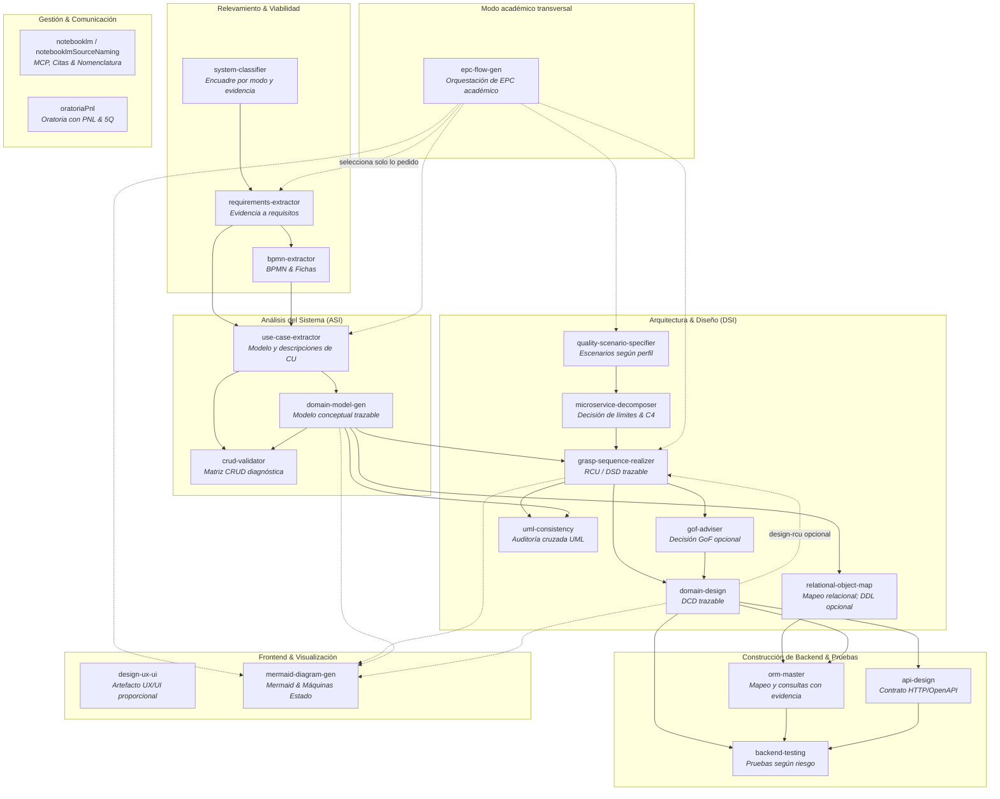

# 🎯 Agent Skills Repository

Repositorio centralizado de **Agent Skills** modulares, especializadas y basadas en estándares de ingeniería de software, arquitectura de sistemas, modelado formal, diseño UX/UI, gestión de conocimiento y comunicación profesional.

Estas habilidades están diseñadas para ser consumidas y ejecutadas por agentes de Inteligencia Artificial (compatibles con **Google Antigravity**, **Claude Code**, **Cursor**, **Windsurf**, agentes basados en OpenAI y frameworks agénticos avanzados) conforme al estándar de carpetas `SKILL.md`.

> 📘 **Playbook de rutas**: Consultá la [**Guía de aplicación de skills para Sistemas de Información**](GUIA.md), que ayuda a seleccionar únicamente las skills y compuertas necesarias para cada producto. No es obligatorio ejecutar las 22.

> 🧾 **Registro de auditoría**: el [prompt, alcance y resultado de la auditoría ASI/DSI del 2026-09-04](audits/2026-09-04-auditoria-skills-asi-dsi.md) quedan versionados junto con las skills.

---

## 📌 Contenido

- [Guía de rutas y productos](GUIA.md)
- [Visión General y Propósito](#-visión-general-y-propósito)
- [Mapa del Ciclo de Vida de Software](#-mapa-del-ciclo-de-vida-de-software)
- [Catálogo de Skills](#-catálogo-de-skills)
  - [1. Requerimientos, Viabilidad y Procesos de Negocio](#1-requerimientos-viabilidad-y-procesos-de-negocio)
  - [2. Análisis Funcional y Especificación del Sistema](#2-análisis-funcional-y-especificación-del-sistema)
  - [3. Calidad y Arquitectura de Software](#3-calidad-y-arquitectura-de-software)
  - [4. Diseño Orientado a Objetos, Patrones y Persistencia](#4-diseño-orientado-a-objetos-patrones-y-persistencia)
  - [5. Modelado Visual y Diagramación Universal](#5-modelado-visual-y-diagramación-universal)
  - [6. Experiencia de Usuario, UI y Diseño Generativo](#6-experiencia-de-usuario-ui-y-diseño-generativo)
  - [7. Productividad y Gestión del Conocimiento](#7-productividad-y-gestión-del-conocimiento)
  - [8. Comunicación y Oratoria Profesional](#8-comunicación-y-oratoria-profesional)
  - [9. Construcción de Backend y Pruebas](#9-construcción-de-backend-y-pruebas)
- [Anatomía de una Skill](#-anatomía-de-una-skill)
- [Guía de Integración y Uso](#-guía-de-integración-y-uso)
- [Estándares y Fundamentos Académicos](#-estándares-y-fundamentos-académicos)
- [Buenas Prácticas de Contribución](#-buenas-prácticas-de-contribución)

---

## 🚀 Visión General y Propósito

A diferencia de prompts aislados, las **Agent Skills** de este repositorio definen un producto, sus entradas, límites, decisiones y criterios de cierre. Cada paquete incluye solo los recursos que necesita:

1. un `SKILL.md` conciso para alcance, flujo y contrato de salida;
2. `references/` para detalle condicional que cambia decisiones;
3. `templates/` cuando una estructura reutilizable mejora consistencia;
4. `scripts/` cuando una transformación o validación realmente puede automatizarse;
5. `examples/` breves cuando enseñan un comportamiento que las reglas no dejan claro.

El catálogo cubre productos de **Análisis de Sistemas de Información (ASI)**, **Diseño de Sistemas de Información (DSI)** y construcción downstream. Los marcos PUD/RUP, DDD, GRASP/GoF, ISO/IEC 25010 e IEEE 29148 se aplican únicamente donde aportan al artefacto solicitado.

---

## 🗺️ Mapa del Ciclo de Vida de Software

El siguiente diagrama muestra relaciones posibles entre productos. Las rutas se seleccionan según el encargo y los artefactos disponibles; las flechas no convierten el catálogo en un pipeline obligatorio.



`epc-flow-gen` es un orquestador para un **Ejercicio Práctico Complementario** de ASI/DSI. Lee la consigna y deriva solo los ítems solicitados a las skills especialistas; no representa una etapa de interfaz ni obliga a recorrer las ramas ilustradas.

---

## 📚 Catálogo de Skills

El repositorio cuenta actualmente con **22 skills especializadas**, distribuidas en las siguientes áreas de competencia:

Las skills migradas muestran en la etiqueta su `name` invocable en hyphen-case.
Algunos paquetes y enlaces conservan nombres o carpetas históricas en camelCase para
no romper compatibilidad; ante cualquier diferencia, prevalece el frontmatter.

### 1. Requerimientos, Viabilidad y Procesos de Negocio

| Skill | Descripción | Estándares y Técnicas Clave | Artefactos |
| :--- | :--- | :--- | :--- |
| [**system-classifier**](systemClassifier/SKILL.md) | Responde una pregunta concreta de diagnóstico, clasificación de SI, prefactibilidad o contexto PUD. | TGS, taxonomía TPS/MIS/DSS/ESS/KMS/AI, evidencia y análisis por modo. | Dictamen breve o informe formal; plantilla/referencia solo en el modo correspondiente. |
| [**requirements-extractor**](requirementsExtractor/SKILL.md) | Extrae y normaliza requisitos trazables sin diseñar la solución. | RF, RNF, reglas, restricciones, historias opcionales, fuentes y preguntas abiertas. | Registro Markdown por defecto; ERS, historias o JSON solo si se solicitan. |
| [**bpmn-extractor**](bpmnExtractor/SKILL.md) | Modela o audita procesos de negocio desde evidencia narrativa. | Perfil BPMN de ASI, ficha institucional y semántica de flujo. | Ficha y especificación del BPD; BPD gráfico solo con herramienta BPMN, o IR/Mermaid/XML no ejecutable en el perfil compatible. |

---

### 2. Análisis Funcional y Especificación del Sistema

| Skill | Descripción | Estándares y Técnicas Clave | Artefactos |
| :--- | :--- | :--- | :--- |
| [**use-case-extractor**](useCaseExtractor/SKILL.md) | Descubre el modelo o describe CU trazables; deriva las realizaciones a su skill especialista. | Objetivos de actor, relaciones CU, flujos y evidencia; Gherkin solo cuando se pide. | Inventario/diagrama o descripción institucional según el modo seleccionado. |
| [**crud-validator**](crudValidator/SKILL.md) | Contrasta entidades con CU o requisitos sin exigir CRUD completo para cada clase. | Evidencia de C/R/U/D, excepciones justificadas y nivel de cobertura. | Matriz diagnóstica y propuestas; no genera requisitos o CU automáticamente. |
| [**domain-model-gen**](domainModelGen/SKILL.md) | Genera un modelo conceptual trazable sin introducir tablas, servicios ni arquitectura. | Clases, atributos, responsabilidades y relaciones derivadas del dominio; patrones ASI solo cuando aplican. | Diagrama conceptual y registro breve de evidencia. |
| [**epc-flow-gen**](epcFlowGen/SKILL.md) | Resolución trazable de Ejercicios Prácticos Complementarios de ASI/DSI mediante selección de artefactos y skills según la consigna. | Matriz ítem → artefacto → evidencia → skill → estado, control de cobertura y no invención. | Resolución ensamblada en el formato pedido, con pendientes justificados. |

---

### 3. Calidad y Arquitectura de Software

| Skill | Descripción | Estándares y Técnicas Clave | Artefactos |
| :--- | :--- | :--- | :--- |
| [**quality-scenario-specifier**](qualityScenarioSpecifier/SKILL.md) | Convierte RNF en escenarios verificables sin inventar umbrales. | Perfil de cátedra atributo–estímulo–respuesta; seis partes y tácticas como modos condicionales. | Escenario del perfil pedido, pendientes y criterios de verificación. |
| [**microservice-decomposer**](microserviceDecomposer/SKILL.md) | Evalúa monolito modular frente a microservicios y define límites solo si se justifican. | Drivers de negocio/calidad, bounded contexts, dependencias y capacidad operativa. | Decisión arquitectónica y vistas solicitadas; “no descomponer” es válido. |

---

### 4. Diseño Orientado a Objetos, Patrones y Persistencia

| Skill | Descripción | Estándares y Técnicas Clave | Artefactos |
| :--- | :--- | :--- | :--- |
| [**grasp-sequence-realizer**](graspSequenceRealizer/SKILL.md) | Única propietaria de la realización de análisis o diseño para un escenario concreto. | BCE/GRASP aplicables, mensajes y responsabilidades trazables; GoF no es obligatorio. | RCU/DSD en una notación elegida y decisiones justificadas. |
| [**domain-design**](domainDesign/SKILL.md) | Transforma modelos de análisis y realizaciones en un DCD trazable. | Clases, responsabilidades, interfaces y relaciones de diseño justificadas; arquitectura/código son modos explícitos. | DCD por defecto; detalle técnico adicional solo si se solicita. |
| [**gof-adviser**](gofAdviser/SKILL.md) | Evalúa si una fuerza de diseño justifica un patrón y compara alternativas. | Problema, contexto, consecuencias y evidencia; “ningún patrón” es una salida válida. | Decisión o refactor solicitado con verificación. |
| [**uml-consistency**](umlConsistency/SKILL.md) | Audita dos o más artefactos existentes con evidencia y confianza. | DCD/DSD/DTE/código, normalización y fuente autoritativa. | Informe de inconsistencias; no inventa modelos ni corrige sin permiso. |
| [**relational-object-map**](relationalObjectMap/SKILL.md) | Traduce un DCD a decisiones de mapeo relacional trazables. | Identidad, atributos, asociaciones, herencia y restricciones del motor cuando exista. | Modelo lógico por defecto; esquema/DDL solo si se solicita, sin capa DAO. |

---

### 5. Modelado Visual y Diagramación Universal

| Skill | Descripción | Estándares y Técnicas Clave | Artefactos |
| :--- | :--- | :--- | :--- |
| [**mermaid-diagram-gen**](mermaidDiagramGen/SKILL.md) | Generación o validación de un diagrama Mermaid y, cuando se pide, síntesis trazable de DTE/MTE. | Selección por tipo entre 30 guías disponibles; se carga únicamente la referencia aplicable. | Código Mermaid solicitado y resultado de validación disponible. |

---

### 6. Experiencia de Usuario, UI y Diseño Generativo

| Skill | Descripción | Estándares y Técnicas Clave | Artefactos |
| :--- | :--- | :--- | :--- |
| [**design-ux-ui**](designUxUi/SKILL.md) | Diseño, auditoría o implementación de UX/UI con un artefacto proporcional al pedido y al sistema existente. | Flujos y estados, reutilización de componentes/tokens, accesibilidad WCAG 2.2 AA y verificación condicional. | Especificación, prototipo, código o informe según el modo; `references/` y `scripts/` se cargan solo cuando aplican. |

---

### 7. Productividad y Gestión del Conocimiento

| Skill | Descripción | Estándares y Técnicas Clave | Artefactos |
| :--- | :--- | :--- | :--- |
| [**notebooklm**](notebooklm/SKILL.md) | Integración con el servidor MCP de NotebookLM para registro de libretas compartidas, consultas fundamentadas con citas y carga de fuentes. | Protocolo MCP, grounded Q&A con citas automáticas, gestión de notebooks colaborativas. | `manual_notebooklm_mcp.md` |
| [**notebooklmSourceNaming**](notebooklmSourceNaming/SKILL.md) | Taxonomía y convención estandarizada de prefijos para ordenar, catalogar y normalizar fuentes antes de su ingesta en NotebookLM. | Prefijos estructurados (`PLN_`, `LIB_`, `NOR_`, `SLI_`, `APU_`, `GUI_`, `VID_`) para trazabilidad rigurosa en paneles de citas. | `SKILL.md` |

---

### 8. Comunicación y Oratoria Profesional

| Skill | Descripción | Estándares y Técnicas Clave | Artefactos |
| :--- | :--- | :--- | :--- |
| [**oratoriaPnl**](pnlOratoria/SKILL.md) | Estructuración y preparación de presentaciones orales de alto impacto basadas en Programación Neurolingüística y retórica persuasiva. | Análisis de audiencia 5Q, sistemas representacionales VAK (Visual, Auditivo, Kinestésico), metaprogramas, encuadres, calibración y feedback. | `references/` (01 a 05: el presentador PNL, diseño 5Q, audiencia, voz/cuerpo, feedback) |

---

### 9. Construcción de Backend y Pruebas

| Skill | Descripción | Estándares y Técnicas Clave | Artefactos |
| :--- | :--- | :--- | :--- |
| [**orm-master**](ormMaster/SKILL.md) | Auditoría, diseño u optimización de un mapeo ORM concreto sin redefinir dominio ni esquema. | Estrategias de carga basadas en evidencia, límites transaccionales y concurrencia según el ORM/base existentes. | Diagnóstico o cambio en el stack solicitado. |
| [**api-design**](apiDesign/SKILL.md) | Diseño o auditoría de contratos HTTP/REST a partir de operaciones y requisitos aprobados. | Semántica HTTP, OpenAPI 3.x, compatibilidad y, cuando aplican, Problem Details e idempotencia. | Contrato y decisiones; implementación solo si se solicita. |
| [**backend-testing**](backendTesting/SKILL.md) | Estrategia, auditoría o implementación de pruebas downstream guiada por comportamiento y riesgo. | Niveles unitario/integración/contrato/E2E, AAA/GWT y dobles de Meszaros según el caso. | Matriz de cobertura y/o pruebas en el stack existente. |

---

## 🧩 Anatomía de una Skill

Cada skill dentro del repositorio implementa una estructura estandarizada y predecible:

```
nombre-de-la-skill/
├── SKILL.md                 # Archivo principal (YAML Frontmatter + Metodología + Prompts del sistema)
├── references/              # [Opcional] Documentación técnica de soporte, gramáticas y marcos conceptuales
├── templates/               # [Opcional] Plantillas institucionales (Markdown, JSON Schema, XML, DDL)
├── scripts/                 # [Opcional] Scripts auxiliares ejecutables (Python, PowerShell, CLI)
└── examples/                # [Opcional] Ejemplos reales y casos de estudio de referencia
```

### Encabezado Estándar (`SKILL.md`)
Todo archivo `SKILL.md` define en su bloque superior los metadatos YAML que permiten a los motores de agentes identificar su propósito e invocarla dinámicamente cuando el contexto lo requiere:

```yaml
---
name: nombre-de-la-skill
description: >-
  Producto que genera, cuándo debe activarse y el límite que evita confundirla con
  skills cercanas.
---
```

---

## 🛠️ Guía de Integración y Uso

### 1. Uso en Google Antigravity
Si estás utilizando Antigravity, este repositorio puede vincularse directamente como workspace de skills o copiarse en la ruta de configuración del agente:
- **Global:** `~/.gemini/antigravity/skills/`
- **Por proyecto:** Copiar o clonar las carpetas de las skills dentro de `.agent/skills/` o `.gemini/skills/` en la raíz de tu proyecto.

### 2. Uso en Claude Code, Cursor y Windsurf
- **Claude Code:** Coloca las skills deseadas dentro del directorio `.claude/skills/` o referencia el archivo `SKILL.md` dentro de tu archivo `CLAUDE.md`.
- **Cursor / Windsurf:** Añade la regla en `.cursorrules` o en los agentes de proyecto indicando la ubicación del directorio de skills y solicitando la lectura del `SKILL.md` correspondiente al abordar tareas afines.

### 3. Ejecución Directa de Scripts
Algunas skills incluyen utilidades de soporte. Leer primero el modo correspondiente y ejecutar cada script solo si coincide con el producto y el entorno:
- **Validación y render de BPMN-IR:**
  ```bash
  python bpmnExtractor/scripts/bpmn_ir_transformer.py bpmnExtractor/templates/bpmn_process_ir_example.json --format mermaid
  ```
- **Integridad semántica de un registro de requisitos JSON:**
  ```bash
  python requirementsExtractor/scripts/validate_requirements_semantics.py path/to/registro.json
  ```
- **Auditoría y Validación de Tokens UX/UI:**
  ```powershell
  pwsh -NoProfile -File designUxUi/scripts/validate_design.ps1 -Path .\mi-proyecto\DESIGN.md
  ```
- **Servidor de Previsualización Local:**
  ```bash
  python designUxUi/scripts/serve_preview.py --root path/to/frontend --port 0
  ```

Sustituí las rutas de ejemplo por artefactos existentes. El validador de diseño puede
requerir que `npx` obtenga `@google/design.md`; el servidor exige un directorio que
contenga `index.html` y elige un puerto libre con `--port 0`.

---

## 🏛️ Estándares y Fundamentos Académicos

Las directrices metodológicas implementadas en este repositorio se basan en literatura y normas de referencia internacional en la Ingeniería de Software:

- **Ingeniería de Requerimientos:** ISO/IEC/IEEE 29148:2018, IEEE Std 830, Guía INCOSE para la Elicitación de Requisitos.
- **Modelado y Especificación:** Alistair Cockburn (*Writing Effective Use Cases*), Ivar Jacobson (*Object-Oriented Software Engineering - BCE*).
- **Modelado de Procesos:** BPMN 2.0 (Object Management Group - OMG).
- **Diseño Orientado a Objetos:** Craig Larman (*Applying UML and Patterns - GRASP*), Erich Gamma et al. (*Design Patterns - GoF*).
- **Arquitectura de Software y Backend:** Bass, Clements & Kazman (*Software Architecture in Practice*), Mark Richards & Neal Ford (*Fundamentals of Software Architecture*), Eric Evans (*Domain-Driven Design*), Simon Brown (*The C4 Model for Visualising Software Architecture*), Robert C. Martin (*Clean Architecture*), Alistair Cockburn (*Hexagonal Architecture / Ports & Adapters*).
- **Persistencia y ORM:** Martin Fowler (*Patterns of Enterprise Application Architecture - Unit of Work, Identity Map*), Vlad Mihalcea (*High-Performance Java Persistence*).
- **Diseño de APIs Web:** Leonard Richardson (*REST Maturity Model*), RFC 7807 / RFC 9457 (*Problem Details for HTTP APIs*), OpenAPI Specification 3.x.
- **Artesanía de Testing Automatizado:** Gerard Meszaros (*xUnit Test Patterns - Test Doubles Taxonomy*), Kent Beck (*Test-Driven Development by Example*).
- **Calidad de Software:** ISO/IEC 25010 / 25000 (SQuaRE - System and Software Quality Requirements and Evaluation).
- **Diseño de Interfaz y Accesibilidad:** Jakob Nielsen (10 Heurísticas de Usabilidad), W3C WCAG 2.2 Nivel AA y sistemas de tokens cuando el producto los requiere.
- **Comunicación Persuasiva:** Programación Neurolingüística (PNL) aplicada a oratoria técnica.

---

## 🤝 Buenas Prácticas de Contribución

1. **Idempotencia y Determinismo:** Al proponer cambios o nuevas skills, prioriza artefactos reproducibles (plantillas, esquemas y checklists verificables).
2. **Documentación Complementaria en `references/`:** No sobrecargues `SKILL.md` con tablas extensas si pueden residir en archivos dedicados dentro de `references/`.
3. **Validación Sintáctica:** Verifica que los bloques Mermaid, scripts Python y JSON Schemas sean formalmente válidos antes de hacer commit.
4. **Respeto a los Estándares:** Conserva la nomenclatura y las reglas de trazabilidad definidas para los artefactos de análisis y diseño.

---

<div align="center">
  <sub>Desarrollado para potenciar el flujo de trabajo de agentes inteligentes y desarrolladores de software.</sub>
</div>
