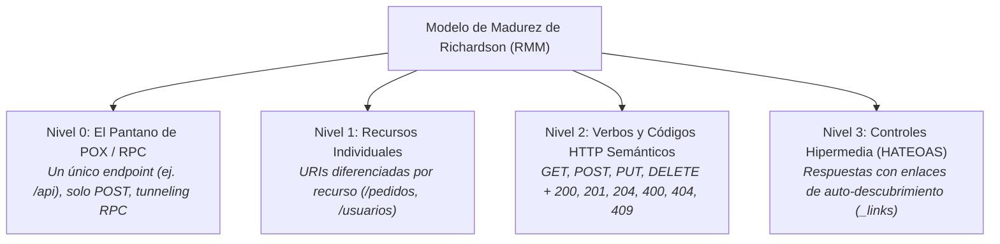
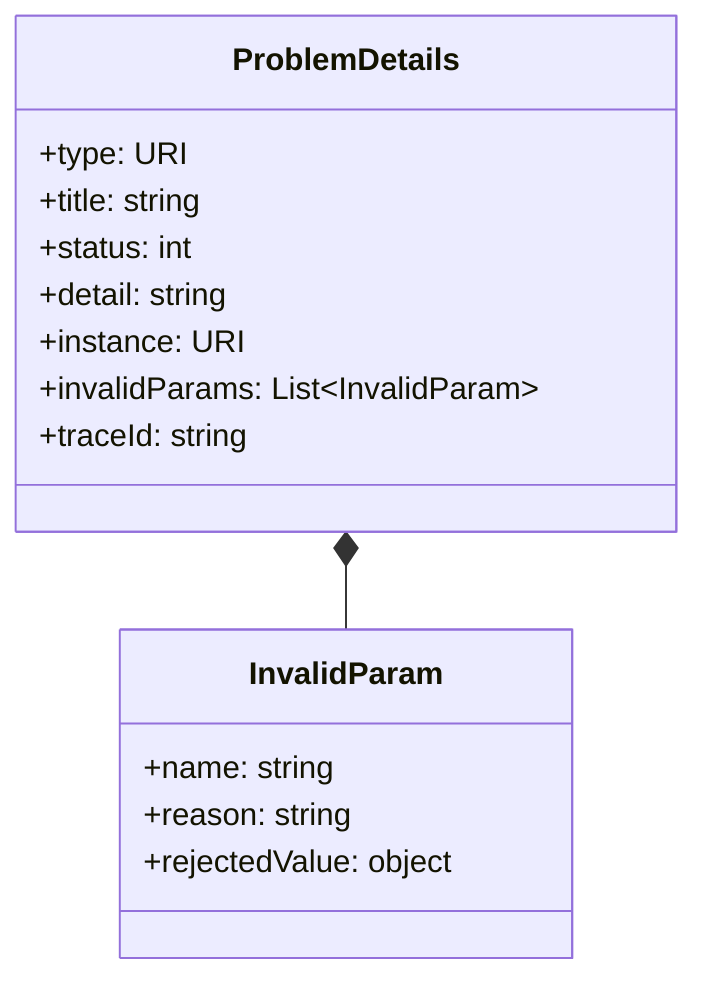

# apiDesign: Guía Maestra de Diseño de Contratos de API RESTful y Estándares HTTP

Esta skill establece las directrices formales, arquitectónicas y prácticas para diseñar, documentar, versionar y validar **Interfaces de Programación de Aplicaciones (APIs) RESTful** de nivel empresarial, asegurando cumplimiento riguroso de la semántica HTTP, contratos **OpenAPI 3.x**, manejo estandarizado de errores bajo **RFC 7807 / RFC 9457 (*Problem Details*)** y patrones de **idempotencia**.

---

## 1. Fundamentos y Modelo de Madurez de Richardson (RMM)

Toda API desarrollada bajo esta skill debe aspirar como mínimo al **Nivel 2** del Modelo de Madurez de Richardson, incorporando elementos de hipermedia del **Nivel 3** cuando la navegabilidad de flujos complejos lo amerite:



---

## 2. Semántica, Seguridad e Idempotencia de Verbos HTTP

La selección del verbo HTTP debe respetar estrictamente sus propiedades matemáticas y semánticas según los estándares RFC 7231 / RFC 9110:

| Verbo HTTP | Seguro (*Safe*) | Idempotente | Semántica Operacional | Código de Éxito Típico | Código de Recurso No Existente |
| :--- | :--- | :--- | :--- | :--- | :--- |
| **`GET`** | **Sí** | **Sí** | Recuperar la representación de un recurso sin mutar el servidor. | `200 OK` | `404 Not Found` |
| **`POST`** | **No** | **No** | Crear un recurso subordinado, procesar un comando o disparar una acción de negocio. | `201 Created` (con header `Location`) | N/A |
| **`PUT`** | **No** | **Sí** | **Sustitución completa** del recurso destino en la URI especificada (o creación con URI conocida). | `200 OK` / `204 No Content` | `404 Not Found` (en reemplazo) |
| **`PATCH`** | **No** | **No** *(por spec)* | **Modificación parcial** del recurso (solo los campos incluidos en el payload). | `200 OK` / `204 No Content` | `404 Not Found` |
| **`DELETE`** | **No** | **Sí** | Eliminar el recurso identificado por la URI. | `204 No Content` / `200 OK` | `404 Not Found` / `204` |
| **`HEAD`** | **Sí** | **Sí** | Idéntico a `GET` pero retorna únicamente encabezados sin cuerpo de respuesta. | `200 OK` | `404 Not Found` |

### 2.1. Patrón de Clave de Idempotencia (*Idempotency-Key*) para Operaciones `POST`
En operaciones no idempotentes que involucren transacciones financieras, débitos, reservas o cobros con pasarelas externas, la API debe exigir y verificar un encabezado HTTP de idempotencia:

```http
POST /api/v1/pagos HTTP/1.1
Host: api.empresa.com
Idempotency-Key: 7b34e2a1-9c84-48f5-a3d8-58017c6b9d31
Content-Type: application/json

{
  "pedidoId": "e3b0c442-98fc-1c14-9afb-4c8996fb9242",
  "monto": 1500.50,
  "moneda": "ARS"
}
```

- **Mecanismo**: El backend almacena la clave en una caché atómica distribuida (Redis / BD) durante una ventana de tiempo (ej. 24 horas). Si se recibe una petición duplicada con la misma clave, el servidor no re-ejecuta la lógica de negocio y responde con la misma respuesta almacenada originalmente.

---

## 3. Nomenclatura y Convenciones de URIs Limpias

### 3.1. Reglas de Nomenclatura
1. **Sustantivos en Plural**: Las colecciones se identifican mediante sustantivos en plural en minúsculas (*kebab-case* si son palabras compuestas):
   - ✅ `/api/v1/pedidos`
   - ✅ `/api/v1/cuentas-bancarias`
   - ❌ `/api/v1/crearPedido` *(Anti-patrón: verbos en la URI)*
   - ❌ `/api/v1/pedido` *(Anti-patrón: sustantivo en singular)*
2. **Jerarquías Naturales Sub-recurso**: Cuando un recurso pertenece estrictamente al ciclo de vida de otro:
   - `/api/v1/pedidos/{pedidoId}/items`
   - `/api/v1/pedidos/{pedidoId}/items/{itemId}`
   - *Límite*: Evitar anidamientos con más de 2 niveles de profundidad (`/a/{id}/b/{id}/c/{id}/d` es un olor de diseño; aplanar a `/api/v1/recurso/{id}`).
3. **Filtros, Paginación y Ordenamiento mediante *Query Parameters***:
   - Jamás embeber parámetros de filtrado en el path.
   - Paginación estándar: `?page=0&size=25` o `?offset=0&limit=25`.
   - Ordenamiento: `?sort=fechaCreacion,desc&sort=clienteId,asc`.
   - Búsqueda / Filtros: `?estado=PENDIENTE&fechaDesde=2025-01-01`.

---

## 4. Manejo Canónico de Errores: RFC 7807 / RFC 9457 (*Problem Details*)

Toda respuesta de error (códigos `4xx` y `5xx`) debe servirse con el encabezado `Content-Type: application/problem+json` y respetar el esquema canónico definido por el IETF:



### 4.1. Ejemplo Canónico de Error de Validación (`422 Unprocessable Entity`)

```json
{
  "type": "https://api.empresa.com/errors/validation-error",
  "title": "Error de Validación en la Solicitud",
  "status": 422,
  "detail": "Uno o más campos de la solicitud no satisfacen las reglas de validación.",
  "instance": "/api/v1/pedidos",
  "traceId": "00-4bf92f3577b34da6a3ce929d0e0e4736-00f067aa0ba902b7-01",
  "invalidParams": [
    {
      "name": "clienteId",
      "reason": "El identificador de cliente es obligatorio y debe ser un UUID válido.",
      "rejectedValue": ""
    },
    {
      "name": "items[0].cantidad",
      "reason": "La cantidad mínima permitida es 1.",
      "rejectedValue": 0
    }
  ]
}
```

### 4.2. Ejemplo Canónico de Conflicto de Negocio (`409 Conflict`)

```json
{
  "type": "https://api.empresa.com/errors/limite-credito-excedido",
  "title": "Límite de Crédito Excedido",
  "status": 409,
  "detail": "El cliente no dispone de saldo suficiente para confirmar el pedido de $ 150,000.00 ARS. Saldo disponible: $ 12,500.00 ARS.",
  "instance": "/api/v1/pedidos/8e4b85cf-52a1-42e8-9bc9-04185795b503/confirmacion",
  "traceId": "00-7c2a1104e4c9472ba1880491a92e1045-873bce99a09142f1-01"
}
```

---

## 5. Especificación OpenAPI 3.x (Swagger) y Contratos Fuertemente Tipados

### 5.1. Estructura Estándar de Contrato OpenAPI

```yaml
openapi: 3.0.3
info:
  title: API de Gestión de Pedidos Corporativos
  description: Contrato de servicios backend para procesamiento de pedidos e integración con pasarelas.
  version: 1.0.0
paths:
  /api/v1/pedidos:
    post:
      summary: Crear y confirmar un nuevo pedido
      operationId: crearPedido
      parameters:
        - in: header
          name: Idempotency-Key
          required: false
          schema:
            type: string
            format: uuid
      requestBody:
        required: true
        content:
          application/json:
            schema:
              $ref: '#/components/schemas/CrearPedidoRequest'
      responses:
        '201':
          description: Pedido creado exitosamente
          headers:
            Location:
              schema:
                type: string
              description: URI del recurso recién creado
          content:
            application/json:
              schema:
                $ref: '#/components/schemas/PedidoResponseDto'
        '400':
          description: Solicitud malformada
          content:
            application/problem+json:
              schema:
                $ref: '#/components/schemas/ProblemDetails'
        '409':
          description: Conflicto de reglas de negocio o concurrencia
          content:
            application/problem+json:
              schema:
                $ref: '#/components/schemas/ProblemDetails'
        '422':
          description: Errores de validación de campos
          content:
            application/problem+json:
              schema:
                $ref: '#/components/schemas/ProblemDetails'

components:
  schemas:
    CrearPedidoRequest:
      type: object
      required:
        - clienteId
        - items
      properties:
        clienteId:
          type: string
          format: uuid
        items:
          type: array
          minItems: 1
          items:
            $ref: '#/components/schemas/ItemPedidoRequest'
    ItemPedidoRequest:
      type: object
      required:
        - sku
        - cantidad
        - precioUnitario
      properties:
        sku:
          type: string
          minLength: 3
        cantidad:
          type: integer
          minimum: 1
        precioUnitario:
          type: number
          format: double
          minimum: 0.01
    PedidoResponseDto:
      type: object
      properties:
        id:
          type: string
          format: uuid
        estado:
          type: string
          enum: [Borrador, Confirmado, Pagado, Cancelado]
        total:
          type: number
          format: double
        moneda:
          type: string
          example: ARS
    ProblemDetails:
      type: object
      required:
        - type
        - title
        - status
      properties:
        type:
          type: string
          format: uri
        title:
          type: string
        status:
          type: integer
        detail:
          type: string
        instance:
          type: string
        traceId:
          type: string
```

---

## 6. Implementación de Manejo Global de Errores (Global Exception Handler)

### 6.1. Ejemplo en Spring Boot (`@RestControllerAdvice`)

```java
package com.backend.api.errores;

import org.springframework.http.*;
import org.springframework.web.bind.MethodArgumentNotValidException;
import org.springframework.web.bind.annotation.*;
import org.springframework.web.context.request.WebRequest;
import java.net.URI;
import java.util.*;

@RestControllerAdvice
public class GlobalExceptionHandler {

    @ExceptionHandler(MethodArgumentNotValidException.class)
    public ResponseEntity<ProblemDetail> handleValidationErrors(MethodArgumentNotValidException ex, WebRequest request) {
        ProblemDetail problem = ProblemDetail.forStatus(HttpStatus.UNPROCESSABLE_ENTITY);
        problem.setType(URI.create("https://api.empresa.com/errors/validation-error"));
        problem.setTitle("Error de Validación en la Solicitud");
        problem.setDetail("Se encontraron errores de formato o campos requeridos faltantes.");

        List<Map<String, Object>> errors = ex.getBindingResult().getFieldErrors().stream()
            .map(err -> Map.of(
                "name", err.getField(),
                "reason", Optional.ofNullable(err.getDefaultMessage()).orElse("Valor inválido"),
                "rejectedValue", Optional.ofNullable(err.getRejectedValue()).orElse("null")
            ))
            .toList();

        problem.setProperty("invalidParams", errors);
        return ResponseEntity.status(HttpStatus.UNPROCESSABLE_ENTITY).body(problem);
    }

    @ExceptionHandler(IllegalStateException.class)
    public ResponseEntity<ProblemDetail> handleConflictException(IllegalStateException ex) {
        ProblemDetail problem = ProblemDetail.forStatus(HttpStatus.CONFLICT);
        problem.setType(URI.create("https://api.empresa.com/errors/business-conflict"));
        problem.setTitle("Conflicto de Estado de Negocio");
        problem.setDetail(ex.getMessage());
        return ResponseEntity.status(HttpStatus.CONFLICT).body(problem);
    }
}
```

---

## 7. Checklist de Calidad para Diseño de APIs

- [ ] ¿Los URIs usan sustantivos en plural en minúsculas sin verbos?
- [ ] ¿Las operaciones de consulta (`GET`) son estrictamente seguras e idempotentes (sin mutar estado en BD)?
- [ ] ¿Las operaciones de creación (`POST`) retornan código `201 Created` con encabezado `Location`?
- [ ] ¿Las respuestas de error adoptan el formato RFC 7807 / RFC 9457 con `application/problem+json`?
- [ ] ¿Se utiliza `401 Unauthorized` para autenticación fallida y `403 Forbidden` para permisos insuficientes?
- [ ] ¿Se requiere encabezado `Idempotency-Key` en operaciones críticas que no admitan duplicación accidental?
- [ ] ¿Está documentado el contrato en OpenAPI 3.x con esquemas, tipos y códigos de respuesta explícitos?
