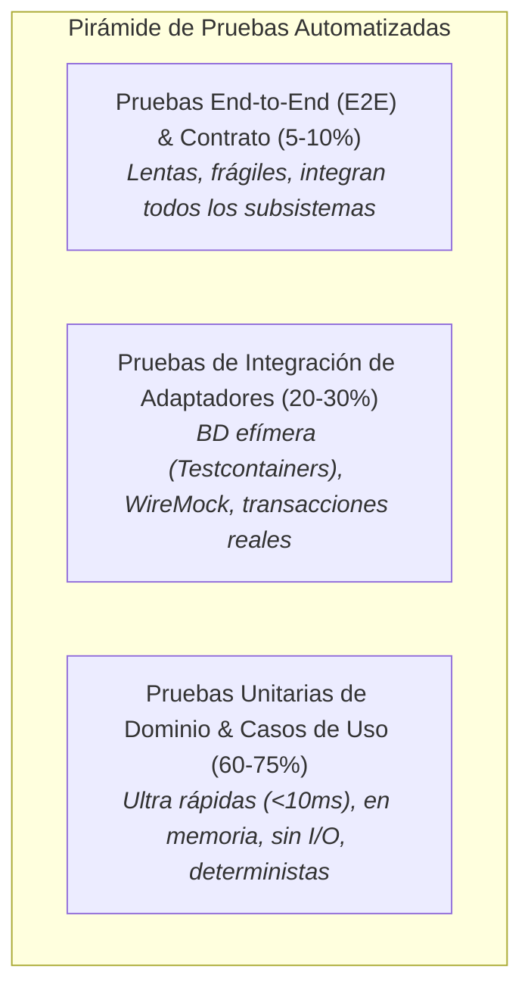
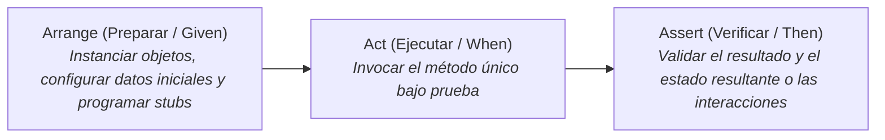
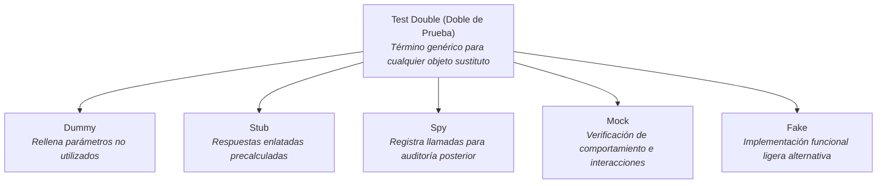

# backendTesting: Guía Maestra de Pruebas Automatizadas y Artesanía de Testing en Backend

Esta skill establece la metodología, patrones y buenas prácticas de ingeniería para diseñar, implementar y auditar **estrategias de pruebas automatizadas en aplicaciones backend orientadas a objetos**, fundamentada en la **Pirámide de Pruebas**, la **taxonomía de Dobles de Prueba de Gerard Meszaros** y los principios de **Diseño para la Testabilidad**.

---

## 1. La Pirámide de Pruebas en Backend

Una estrategia de pruebas sostenible minimiza la fragilidad y el tiempo de retroalimentación concentrando la mayor cantidad de validaciones en pruebas rápidas e independientes:



### 1.1. Distribución de Responsabilidades por Capa

| Tipo de Prueba | Qué Valida | Dependencias Externas | Velocidad de Ejecución | Fragilidad |
| :--- | :--- | :--- | :--- | :--- |
| **Prueba Unitaria de Dominio** | Invariantes de Entidades, cálculos en Value Objects y reglas de negocio puras. | Ninguna (código en memoria puro). | < 5 ms por test. | Nula (inmune a cambios de red o BD). |
| **Prueba Unitaria de Caso de Uso** | Orquestación del flujo, validación de condiciones de contorno y delegación a puertos. | Puertos secundarios simulados con *Mocks*, *Stubs* o *Fakes*. | < 20 ms por test. | Baja (acoplada solo al contrato del puerto). |
| **Prueba de Integración (Persistencia)** | Mapeos ORM, consultas SQL complejas, restricciones de BD, cascadas y bloqueos optimistas. | Base de datos real en contenedor (Docker / Testcontainers). | 200 ms - 2 s por test. | Media (requiere levantar el contenedor). |
| **Prueba de Integración (Clientes HTTP)** | Deserialización de payloads externos, reintentos, timeouts y mapeo hacia el dominio (ACL). | Servidor mock HTTP local (*WireMock* / *nock*). | 50 - 200 ms por test. | Media. |
| **Prueba de API / Controladores** | Serialización JSON, códigos de estado HTTP, Problem Details y validación declarativa. | Contexto web ligero (*MockMvc* / *TestServer*). | 50 - 300 ms por test. | Baja a Media. |

---

## 2. Anatomía de una Prueba Unitaria Limpia: El Patrón AAA

Toda prueba automatizada debe estructurarse en 3 bloques claramente delimitados y legibles:



### 2.1. Reglas de Calidad FIRST
- **Fast (Rápida)**: Cientos de pruebas unitarias deben ejecutarse en pocos segundos para permitir TDD y retroalimentación inmediata en cada guardado.
- **Isolated / Independent (Aislada)**: Las pruebas no deben compartir estado mutable en memoria ni depender del orden de ejecución.
- **Repeatable (Repetible)**: Debe arrojar el mismo resultado en cualquier máquina, sistema operativo o pipeline de CI sin acceso a internet.
- **Self-validating (Auto-verificable)**: Pasa (verde) o falla (rojo) sin necesidad de inspección manual de logs por consola.
- **Timely (Oportuna)**: Escrita antes o inmediatamente después de escribir el código de producción.

### 2.2. Convención de Nomenclatura de Métodos de Test
Adoptar un estándar unificado y expresivo:
`NombreMetodo_EscenarioOCondicion_ResultadoEsperado`
- `Confirmar_ConSaldoInsuficiente_DebeLanzarReglaDominioException()`
- `CalcularTotal_ConTresItemsValidos_RetornaSumaCorrectaEnMismaMoneda()`
- `ObtenerPorId_CuandoNoExiste_RetornaOptionalVacio()`

---

## 3. Taxonomía Formal de Test Doubles (Gerard Meszaros)

No todo sustituto de prueba es un "Mock". Confundir los tipos de dobles de prueba lleva al sobre-acoplamiento y a tests frágiles:



### 3.1. Cuadro Comparativo de Dobles de Prueba

| Tipo de Doble | Propósito Principal | Ejemplo Concreto | Cuándo Utilizarlo |
| :--- | :--- | :--- | :--- |
| **Dummy** | Satisfacer la firma de un constructor o método sin que sea invocado jamás. | `new LoggerDummy()`, `null` en parámetro no accedido. | Parámetros obligatorios irrelevantes para el escenario probado. |
| **Stub** | Proporcionar datos indirectos de entrada al sistema bajo prueba (respuestas prefabricadas). | `when(repo.buscar(1)).thenReturn(cliente);` | Proveer datos para que el caso de uso tome un camino de ejecución específico. |
| **Spy** | Envolver un objeto real o capturar métricas/argumentos pasados a una dependencia. | `ArgumentCaptor` para inspeccionar el evento publicado. | Verificar qué payload exacto se envió a un servicio externo. |
| **Mock** | Verificar que una interacción esperada ocurrió exactamente una vez con ciertos parámetros. | `verify(emailService, times(1)).enviar(destinatario);` | Operaciones con efectos secundarios externos (envío de emails, llamadas a pasarelas de pago). |
| **Fake** | Implementar la lógica del contrato usando almacenamiento en memoria en lugar de BD real. | `InMemoryClienteRepository` utilizando un `ConcurrentHashMap`. | Pruebas de casos de uso sin incurrir en la lentitud de bases de datos reales. |

---

## 4. Principios de Diseño para la Testabilidad en POO

El código que resulta difícil de probar revela defectos intrínsecos de diseño orientado a objetos. Para lograr alta testabilidad:

1. **Inyección de Dependencias por Constructor Obligatoria**:
   - ❌ Anti-patrón: `private EmailService _service = new EmailService();` dentro del caso de uso.
   - ✅ Correcto: `public RegistrarUsuario(IEmailService service) { _service = service; }`
2. **Abstracción de Fuentes No Deterministas**:
   - **Tiempo / Fechas**: Nunca invocar directamente `DateTime.Now`, `new Date()`, `Instant.now()` o `datetime.now()` en la lógica de dominio. Inyectar un proveedor de tiempo abstracto (`Clock` en Java, `TimeProvider` en .NET o un `Protocol` / `Callable[[], datetime]` en Python).
   - **Identificadores Aleatorios**: Si se generan UUIDs en el caso de uso, inyectar un generador de IDs para permitir aserciones deterministas.
3. **Favorecer Fakes Ligeros sobre Cadenas Monstruosas de Mocks**:
   - Si un test requiere 15 líneas de `when(...).thenReturn(...)` para configurar mocks, la clase bajo prueba viola el Principio de Responsabilidad Única (SRP).
   - Utilizar implementaciones *Fake* en memoria para los repositorios.

---

## 5. Matriz de Anti-Patrones de Testing

| Anti-Patrón | Síntoma y Causa Raíz | Peligro en Producción | Solución Canónica |
| :--- | :--- | :--- | :--- |
| **Over-Mocking de Objetos de Dominio** | Crear mocks de Entidades o Value Objects (`mock(Pedido.class)` o `mock(Dinero.class)`). | Pruebas desconectadas de las reglas reales; si cambia la entidad, el test sigue pasando en verde (*Falso Positivo*). | **Regla de Oro**: Jamás mockear Entidades, Value Objects o DTOs. Usar siempre instancias reales del dominio. |
| **Testing Implementation Details** | Hacer aserciones sobre métodos privados, variables internas o el orden exacto de llamadas auxiliares. | Pruebas ultra frágiles que fallan ante cualquier refactorización de código sin que haya cambiado el comportamiento externo. | Probar solo la API pública del objeto y sus efectos observables (*Black-Box Unit Testing*). |
| **Flaky Tests (Tests Intermitentes)** | Pruebas que fallan ocasionalmente por depender de `Thread.sleep()`, tiempos de CPU o puertos de red compartidos. | Pérdida de confianza del equipo en la suite de CI; los desarrolladores ignoran los fallos rojos. | Erradicar sleeps fijos; usar mecanismos de espera reactiva (*Awaitility*) o tiempo simulado (*Virtual Time*). |
| **Assert-Free Tests (Tests sin Aserciones)** | Pruebas que solo invocan el método para aumentar la métrica de cobertura de código sin validar nada. | Falsa sensación de seguridad (*Coverage Vanity Metric*). Errores graves pasan desapercibidos a producción. | Exigir aserciones semánticas explícitas sobre el retorno o el estado final en cada test. |
| **Shared Mutable State entre Tests** | Variables estáticas mutadas por un test que alteran el resultado de tests subsiguientes. | Pruebas que pasan aisladas pero fallan al ejecutarse en suite completa o en paralelo. | Reinicializar el estado antes de cada test (`@BeforeEach` o constructores limpios); evitar variables estáticas mutables. |

---

## 6. Casos de Estudio Prácticos

### 6.1. Prueba Unitaria Pura de Dominio (C# / xUnit + FluentAssertions)

```csharp
namespace Backend.Tests.Dominio;

using Backend.Dominio;
using FluentAssertions;
using Xunit;

public class PedidoTests
{
    [Fact]
    public void Confirmar_CuandoElTotalSuperaElLimiteDeCredito_DebeLanzarExcepcionYPermanecerEnBorrador()
    {
        // 1. Arrange (Preparar)
        var pedido = new Pedido(Guid.NewGuid(), Guid.NewGuid(), new DireccionEntrega("Av. Colón 123", "Córdoba", "5000"));
        var item = new ItemPedido("SKU-001", "Notebook Gamer", 1, new Dinero(150_000m, "ARS"));
        pedido.AgregarItem(item);

        var limiteCreditoInsuficiente = new Dinero(50_000m, "ARS");

        // 2. Act (Ejecutar)
        Action accionConfirmar = () => pedido.Confirmar(limiteCreditoInsuficiente);

        // 3. Assert (Verificar)
        accionConfirmar.Should().Throw<InvalidOperationException>()
            .WithMessage("*excede el límite de crédito*");

        pedido.Estado.Should().Be(EstadoPedido.Borrador); // Invariante: no cambia a Confirmado
    }

    [Fact]
    public void CalcularTotal_ConMultiplesItems_DebeSumarSubtotalesConPrecisionExacta()
    {
        // 1. Arrange
        var pedido = new Pedido(Guid.NewGuid(), Guid.NewGuid(), new DireccionEntrega("San Martín 456", "Rosario", "2000"));
        pedido.AgregarItem(new ItemPedido("SKU-1", "Mouse", 2, new Dinero(10.50m, "USD")));
        pedido.AgregarItem(new ItemPedido("SKU-2", "Teclado", 1, new Dinero(50.25m, "USD")));

        // 2. Act
        var total = pedido.CalcularTotal();

        // 3. Assert
        total.Monto.Should().Be(71.25m);
        total.Moneda.Should().Be("USD");
    }
}
```

---

### 6.2. Prueba de Caso de Uso con Fakes y Mocks Aislados (Java / JUnit 5 + Mockito)

```java
package com.backend.tests.aplicacion;

import com.backend.aplicacion.*;
import com.backend.dominio.*;
import org.junit.jupiter.api.BeforeEach;
import org.junit.jupiter.api.DisplayName;
import org.junit.jupiter.api.Test;
import org.junit.jupiter.api.extension.ExtendWith;
import org.mockito.ArgumentCaptor;
import org.mockito.Mock;
import org.mockito.junit.jupiter.MockitoExtension;

import java.math.BigDecimal;
import java.util.Optional;
import java.util.UUID;

import static org.assertj.core.api.Assertions.*;
import static org.mockito.Mockito.*;

@ExtendWith(MockitoExtension.class)
class ConfirmarPedidoInteractorTest {

    @Mock
    private PedidoRepositoryPort pedidoRepository;

    @Mock
    private ServicioCreditoPort servicioCredito;

    private ConfirmarPedidoInteractor interactor;

    @BeforeEach
    void setUp() {
        interactor = new ConfirmarPedidoInteractor(pedidoRepository, servicioCredito);
    }

    @Test
    @DisplayName("Dado un pedido válido y crédito suficiente, debe confirmar el pedido y persistirlo")
    void confirmarPedido_ConCreditoSuficiente_DebeConfirmarYGuardar() {
        // Arrange
        UUID clienteId = UUID.randomUUID();
        UUID pedidoId = UUID.randomUUID();

        // Usamos la entidad REAL del dominio, NO un mock de Pedido
        Pedido pedidoReal = new Pedido(pedidoId, clienteId, new DireccionEntrega("Av. Siempre Viva 742", "Springfield", "1234"));
        pedidoReal.agregarItem(new ItemPedido("SKU-A", "Monitor", 1, new Dinero(BigDecimal.valueOf(300), "USD")));

        when(pedidoRepository.obtenerPorId(pedidoId)).thenReturn(Optional.of(pedidoReal));
        when(servicioCredito.consultarLimiteCredito(clienteId)).thenReturn(new Dinero(BigDecimal.valueOf(1000), "USD"));

        ConfirmarPedidoCommand command = new ConfirmarPedidoCommand(pedidoId, clienteId);

        // Act
        PedidoDetalleDto resultado = interactor.ejecutar(command);

        // Assert
        assertThat(resultado).isNotNull();
        assertThat(resultado.estado()).isEqualTo("Confirmado");
        assertThat(resultado.total()).isEqualByComparingTo(BigDecimal.valueOf(300));

        // Verificamos que el repositorio persistió el pedido con el estado modificado
        ArgumentCaptor<Pedido> pedidoCaptor = ArgumentCaptor.forClass(Pedido.class);
        verify(pedidoRepository, times(1)).guardar(pedidoCaptor.capture());

        Pedido pedidoGuardado = pedidoCaptor.getValue();
        assertThat(pedidoGuardado.getEstado()).isEqualTo(EstadoPedido.Confirmado);
    }
}
```

---

### 6.3. Prueba Unitaria Pura de Dominio (Python >3.10 / pytest)

```python
"""Pruebas unitarias de dominio puro (Python >3.10 + pytest)."""

from decimal import Decimal
from uuid import uuid4
import pytest

from backend.dominio.entidades import DireccionEntrega, EstadoPedido, ItemPedido, Pedido
from backend.dominio.excepciones import ReglaNegocioError
from backend.dominio.value_objects import Dinero


class TestPedidoDominio:

    def test_confirmar_cuando_total_supera_limite_credito_debe_lanzar_excepcion_y_mantener_borrador(self) -> None:
        # 1. Arrange (Preparar)
        pedido = Pedido(
            id=uuid4(),
            cliente_id=uuid4(),
            direccion_entrega=DireccionEntrega(calle="Av. Colón 123", ciudad="Córdoba", codigo_postal="5000"),
        )
        item = ItemPedido(sku="SKU-001", descripcion="Notebook Gamer", cantidad=1, precio_unitario=Dinero(Decimal("150000.00"), "ARS"))
        pedido.agregar_item(item)

        limite_credito_insuficiente = Dinero(Decimal("50000.00"), "ARS")

        # 2. Act & 3. Assert (Ejecutar y Verificar)
        with pytest.raises(ReglaNegocioError, match=r"excede el límite de crédito"):
            pedido.confirmar(limite_credito=limite_credito_insuficiente)

        # Invariante: el estado no debe haber transitado a CONFIRMADO
        assert pedido.estado == EstadoPedido.BORRADOR

    def test_calcular_total_con_multiples_items_debe_sumar_subtotales_con_precision_exacta(self) -> None:
        # 1. Arrange
        pedido = Pedido(
            id=uuid4(),
            cliente_id=uuid4(),
            direccion_entrega=DireccionEntrega(calle="San Martín 456", ciudad="Rosario", codigo_postal="2000"),
        )
        pedido.agregar_item(ItemPedido(sku="SKU-1", descripcion="Mouse", cantidad=2, precio_unitario=Dinero(Decimal("10.50"), "USD")))
        pedido.agregar_item(ItemPedido(sku="SKU-2", descripcion="Teclado", cantidad=1, precio_unitario=Dinero(Decimal("50.25"), "USD")))

        # 2. Act
        total = pedido.calcular_total()

        # 3. Assert
        assert total.monto == Decimal("71.25")
        assert total.moneda == "USD"
```

---

### 6.4. Prueba de Caso de Uso con Protocolos y Mocks Aislados (Python >3.10 / pytest + unittest.mock)

```python
"""Prueba de orquestación de caso de uso con puertos desacoplados (Python >3.10)."""

from dataclasses import dataclass
from decimal import Decimal
from typing import Protocol
from unittest.mock import create_autospec
from uuid import UUID, uuid4
import pytest

from backend.dominio.entidades import DireccionEntrega, EstadoPedido, ItemPedido, Pedido
from backend.dominio.value_objects import Dinero


# --- Puertos Secundarios (typing.Protocol para Arquitectura Limpia/Hexagonal) ---
class PedidoRepositoryPort(Protocol):
    def obtener_por_id(self, pedido_id: UUID) -> Pedido | None: ...
    def guardar(self, pedido: Pedido) -> None: ...


class ServicioCreditoPort(Protocol):
    def consultar_limite_credito(self, cliente_id: UUID) -> Dinero: ...


# --- DTOs de Entrada y Salida ---
@dataclass(frozen=True, slots=True)
class ConfirmarPedidoCommand:
    pedido_id: UUID
    cliente_id: UUID


@dataclass(frozen=True, slots=True)
class PedidoDetalleDto:
    pedido_id: UUID
    estado: str
    total: Decimal
    moneda: str


# --- Caso de Uso / Interactor Bajo Prueba ---
class ConfirmarPedidoInteractor:
    def __init__(self, pedido_repo: PedidoRepositoryPort, servicio_credito: ServicioCreditoPort) -> None:
        self._pedido_repo = pedido_repo
        self._servicio_credito = servicio_credito

    def ejecutar(self, command: ConfirmarPedidoCommand) -> PedidoDetalleDto:
        pedido = self._pedido_repo.obtener_por_id(command.pedido_id)
        if pedido is None:
            raise ValueError(f"Pedido {command.pedido_id} no encontrado")

        limite = self._servicio_credito.consultar_limite_credito(command.cliente_id)
        pedido.confirmar(limite)
        self._pedido_repo.guardar(pedido)

        total = pedido.calcular_total()
        return PedidoDetalleDto(
            pedido_id=pedido.id,
            estado=pedido.estado.value,
            total=total.monto,
            moneda=total.moneda,
        )


# --- Suite de Pruebas ---
class TestConfirmarPedidoInteractor:

    @pytest.fixture
    def mock_repo(self) -> PedidoRepositoryPort:
        # create_autospec previene 'mock drift' garantizando que sólo se invoquen métodos del Protocol
        return create_autospec(PedidoRepositoryPort, instance=True)

    @pytest.fixture
    def mock_servicio_credito(self) -> ServicioCreditoPort:
        return create_autospec(ServicioCreditoPort, instance=True)

    @pytest.fixture
    def interactor(self, mock_repo: PedidoRepositoryPort, mock_servicio_credito: ServicioCreditoPort) -> ConfirmarPedidoInteractor:
        return ConfirmarPedidoInteractor(pedido_repo=mock_repo, servicio_credito=mock_servicio_credito)

    def test_confirmar_pedido_con_credito_suficiente_debe_confirmar_y_guardar(
        self,
        interactor: ConfirmarPedidoInteractor,
        mock_repo: PedidoRepositoryPort,
        mock_servicio_credito: ServicioCreditoPort,
    ) -> None:
        # 1. Arrange
        cliente_id = uuid4()
        pedido_id = uuid4()

        # Usamos la entidad REAL del dominio, NUNCA un mock de Pedido
        pedido_real = Pedido(
            id=pedido_id,
            cliente_id=cliente_id,
            direccion_entrega=DireccionEntrega(calle="Av. Siempre Viva 742", ciudad="Springfield", codigo_postal="1234"),
        )
        pedido_real.agregar_item(ItemPedido(sku="SKU-A", descripcion="Monitor", cantidad=1, precio_unitario=Dinero(Decimal("300.00"), "USD")))

        # Programamos los Stubs sobre los puertos secundarios
        mock_repo.obtener_por_id.return_value = pedido_real
        mock_servicio_credito.consultar_limite_credito.return_value = Dinero(Decimal("1000.00"), "USD")

        command = ConfirmarPedidoCommand(pedido_id=pedido_id, cliente_id=cliente_id)

        # 2. Act
        resultado = interactor.ejecutar(command)

        # 3. Assert
        assert resultado is not None
        assert resultado.estado == "Confirmado"
        assert resultado.total == Decimal("300.00")
        assert resultado.moneda == "USD"

        # Verificamos que el repositorio persistió el pedido con el nuevo estado
        mock_repo.guardar.assert_called_once()
        pedido_guardado: Pedido = mock_repo.guardar.call_args[0][0]
        assert pedido_guardado.estado == EstadoPedido.CONFIRMADO
```

---

## 7. Checklist de Calidad para Suites de Testing

- [ ] ¿Las pruebas unitarias corren en menos de 10 milisegundos y no hacen llamadas a red, disco o BD?
- [ ] ¿Se utiliza siempre el patrón AAA (Arrange - Act - Assert) con nomenclatura explícita?
- [ ] ¿Las entidades de dominio y Value Objects se instancian de forma real en lugar de mockearse?
- [ ] ¿Se aíslan las fechas y horas inyectando abstracciones de reloj (`TimeProvider` / `Clock` / `Protocol`)?
- [ ] ¿Los tests son deterministas e independientes entre sí, sin depender de variables globales o estáticas mutables?
- [ ] ¿Las pruebas de integración de persistencia se ejecutan contra bases de datos reales o contenedores efímeros?
