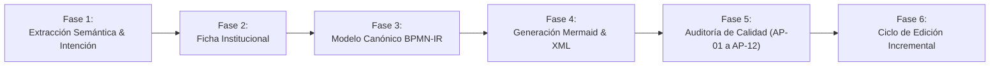
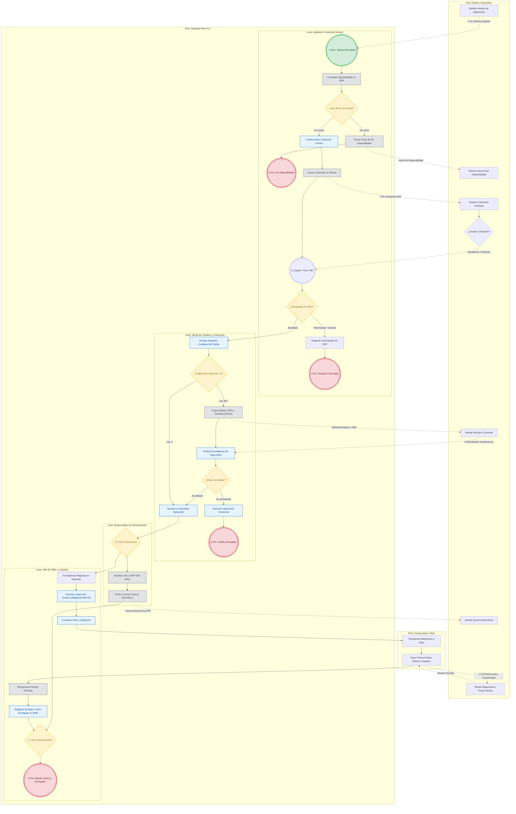

# narrativeToBpmnModeler: Modelado Profesional BPMN 2.0, Ficha Institucional y Motor de Procesos

Esta skill proporciona las directrices metodológicas, heurísticas de modelado, estándares de notación BPMN 2.0 (OMG), la representación canónica en árbol **BPMN-IR (JSON)**, el **Motor de Edición y Refactorización Incremental (BPMN Change Engine)** y las plantillas institucionales para convertir cualquier descripción textual, transcripción de entrevista o caso de negocio no estructurado en un **Modelo Operativo de Procesos de Negocio BPMN 2.0** formal, trazable y ejecutable.

---

## 1. Fundamentos Teóricos y Marco de Referencia

La skill se sustenta en la integración sinérgica de cuatro marcos conceptuales:
1. **Estándar OMG BPMN 2.0 (Business Process Model and Notation)**: Especificación semántica y gráfica internacional para modelar secuencia de actividades, flujos de mensajes entre participantes independientes, eventos temporales/mensajes/errores y decisiones lógicas.
2. **Gestión de Procesos (Juan Bravo Carrasco)**: Enfoque sistémico donde el proceso de negocio es una cadena coordinada de actividades transversales a las áreas funcionales (visión horizontal vs. silos verticales), transformando insumos en productos/servicios que entregan valor concreto al cliente.
3. **Cátedra de Análisis de Sistemas de Información (ASI / UTN FRC)**: Estándar documental institucional compuesto por el Mapa de Procesos, la Ficha de Proceso normalizada (Objetivo, Cliente, Producto, Proveedores/Insumos, Recursos, Formularios/Registros/Información, Reglas de Negocio formalizadas RN-XX, Restricciones Legales, Indicadores KPIs) y el Diagrama de Procesos (BPD).
4. **Arquitectura de Intermediación y Edición Estructurada (BPMN Assistant Engine)**: Representación de procesos mediante un árbol canónico abstracto (BPMN-IR en JSON) desacoplado de la visualización, permitiendo transformaciones deterministas hacia XML estándar o diagramas Mermaid, validaciones sintácticas estrictas y mutaciones incrementales atómicas (Change Engine).

---

## 2. Heurísticas y Reglas de Oro de Modelado BPMN 2.0

Para garantizar corrección semántica, legibilidad y compatibilidad con motores BPMN (Camunda, Bizagi, Signavio, jBPM):

### 2.1. Participantes, Piscinas (Pools) y Carriles (Lanes)
* **Pool (Piscina / Participante)**:
  - Representa un participante independiente, entidad jurídica u organización delimitada (ej. `Empresa Principal`, `Cliente Externo`, `Proveedor Logístico`, `AFIP / ARCA`, `Pasarela de Pagos`).
  - Cada Pool posee su propio control de ejecución y espacio de proceso.
  - La organización bajo estudio se modela como una Pool abierta (White Box) con Lanes internos. Los actores externos se modelan como Pools cerradas (Black Box) o externas.
* **Lane (Carril)**:
  - Representa una partición interna dentro de una Pool para segregar responsabilidades por rol, área funcional, departamento o sistema informático (ej. `Asistente Comercial`, `Oficial de Créditos`, `Responsable de Administración`, `Jefe de Taller`).
  - **Prohibición crítica**: Los Lanes NO representan organizaciones independientes. Si dos entidades no comparten gobierno operacional ni jerarquía directa, deben ser Pools separadas.

### 2.2. Conectores: Flujos de Secuencia vs. Flujos de Mensaje
* **Sequence Flow (Flujo de Secuencia - Flecha Sólida `──►`)**:
  - Expresa el orden temporal de ejecución de actividades y eventos dentro de una **misma Pool**.
  - Puede atravesar libremente los límites entre distintos Lanes de una misma Pool.
  - **REGLA DE ORO INQUEBRANTABLE**: Un Flujo de Secuencia **JAMÁS** puede cruzar los límites exteriores de una Pool hacia otra Pool (violación directa AP-01).
* **Message Flow (Flujo de Mensaje - Flecha Discontinua `---○──►`)**:
  - Expresa la comunicación asíncrona, intercambio de mensajes o envío de documentos/datos entre **dos Pools distintas**.
  - Conecta una actividad/evento de una Pool con otra Pool (o actividad/evento de otra Pool).
  - **REGLA DE ORO**: Un Flujo de Mensaje **JAMÁS** puede conectar elementos dentro de la misma Pool o entre Lanes de la misma Pool (violación directa AP-02).
* **Data Association (Asociación de Datos - Flecha Punteada `····►`)**:
  - Conecta Data Objects o Data Stores con Actividades (entradas y salidas de datos).

### 2.3. Taxonomía Exhaustiva de Actividades y Tareas (Tasks)
Toda tarea debe ser **atómica** (representar una única unidad de trabajo) y nombrarse con la fórmula imperativa: `[Verbo en Infinitivo] + [Sustantivo / Objeto Directo] + [Calificador / Contexto]`. Se clasifica rigurosamente según su nivel de automatización:

| Tipo (`type`) | Semántica y Uso Obligatorio | Ejemplo |
| :--- | :--- | :--- |
| `userTask` | Tarea ejecutada por un ser humano asistido por una aplicación o ERP (ingreso de datos, aprobación, revisión en pantalla). | `Confeccionar Cotización Formal`, `Aprobar Operación` |
| `serviceTask` | Tarea 100% automatizada ejecutada por un servicio web, microservicio, API, base de datos o daemon sin presencia humana. | `Consultar Disponibilidad en ERP`, `Solicitar CAE a AFIP` |
| `sendTask` | Tarea automatizada encargada de despachar un mensaje, correo o notificación asíncrona hacia un participante externo. | `Enviar Cotización al Cliente`, `Publicar Evento en Bus` |
| `receiveTask` | Tarea que suspende la ejecución esperando la recepción de un mensaje, webhook o archivo externo para reanudar el flujo. | `Recepcionar Remito Conformado`, `Recibir Webhook de Pago` |
| `businessRuleTask` | Tarea que delega una evaluación compleja o decisión tabular a un motor de reglas de negocio (DMN / Drools). | `Evaluar Matriz de Riesgo Crediticio`, `Calcular Descuento` |
| `manualTask` | Tarea física / analógica ejecutada por un humano sin ninguna interacción de sistemas de software. | `Acondicionar Maquinaria en Depósito`, `Cargar Bultos` |
| `scriptTask` | Tarea que ejecuta un script de transformación, cálculo local o rutina interpretada directamente por el motor de procesos. | `Calcular Total con Impuestos`, `Generar Token Hash` |
| `task` | Tarea genérica. Emplear únicamente cuando no se disponga de suficiente información sobre el método de ejecución. | `Gestionar Trámite` |

### 2.4. Taxonomía de Eventos y Disparadores (Events)
* **Start Events (Eventos de Inicio - Círculo Simple `○`)**:
  - `startEvent` (Genérico / None): Disparo manual o sin trigger específico.
  - `startEvent` + `messageEventDefinition`: Se activa al recibir un mensaje/solicitud externa.
  - `startEvent` + `timerEventDefinition`: Se activa según cronograma periódico o fecha/hora fija.
* **Intermediate Events (Eventos Intermedios - Círculo Doble `◎`)**:
  - `intermediateCatchEvent` + `timerEventDefinition`: Pausa el flujo durante un lapso (ej. "Esperar 48 hs").
  - `intermediateCatchEvent` + `messageEventDefinition`: Espera pasivamente un mensaje específico.
  - `intermediateThrowEvent` + `messageEventDefinition`: Emite activamente un mensaje y continúa.
* **End Events (Eventos de Fin - Círculo Grueso `●`)**:
  - `endEvent` (Genérico): Cierre natural de la ruta de ejecución.
  - `endEvent` + `messageEventDefinition`: Finaliza emitiendo una notificación o comprobante de cierre.
  - `endEvent` (Error / Cancel): Finaliza en estado de error o cancelación de negocio.

### 2.5. Compuertas de Decisión (Gateways - Rombo `◇`)
* **Exclusive Gateway (XOR - `exclusiveGateway`)**:
  - Bifurcación exclusiva: Evalúa condiciones de datos y toma **exactamente un único camino**. Cada flujo saliente debe poseer una condición excluyente clara (ej. `[Con stock]`, `[Sin stock]`).
  - Convergencia XOR (`has_join: true`): Une caminos alternativos sin esperar a las demás ramas.
  - Redirecciones / Bucles: Permite asociar una salida hacia un nodo previo mediante `next: "task_id"`.
* **Parallel Gateway (AND - `parallelGateway`)**:
  - Bifurcación paralela: Divide el flujo en dos o más ramas concurrentes (todas se ejecutan incondicionalmente). No lleva condiciones en las salidas.
  - Sincronización AND (`join`): Espera obligatoriamente la llegada de todas las ramas concurrentes antes de habilitar el flujo siguiente.
  - **Regla estricta**: Ninguna rama paralela puede estar vacía (evita AP-08).
* **Inclusive Gateway (OR - `inclusiveGateway`)**:
  - Bifurcación inclusiva: Activa una, varias o todas las ramas cuyas condiciones se cumplan. Permite una rama por defecto (`is_default: true`) tomada cuando ninguna condición aplica (evita AP-11).
  - Convergencia OR: Sincroniza únicamente las ramas activas que fueron disparadas.
* **Event-Based Gateway (Basada en Eventos)**:
  - La decisión depende de qué evento externo ocurre primero (ej. llegada de pago vs. timeout de 72 hs).

### 2.6. Artefactos y Datos
* **Data Object (`📄`)**: Documentos o planillas que fluyen entre actividades con estado explícito entre corchetes (ej. `Cotización [Enviada]`, `Remito [Conformado]`).
* **Data Store (`🛢`)**: Repositorios persistentes o bases de datos consultadas/actualizadas (ej. `ERP IndustrialRent`, `Padrón AFIP`).

---

## 3. Matriz Ampliada de Anti-Patrones de Calidad BPMN

| Código | Anti-Patrón | Descripción del Error | Corrección Obligatoria |
| :---: | :--- | :--- | :--- |
| **AP-01** | *Sequence Flow entre Pools* | Flecha sólida cruzando de una Pool a otra. | Reemplazar por **Message Flow** (`-.->`). |
| **AP-02** | *Message Flow intra-Pool* | Flecha discontinua conectando elementos de la misma Pool o entre Lanes. | Reemplazar por **Sequence Flow** (`-->`). |
| **AP-03** | *Compuerta Huérfana / Asimétrica* | Abrir una compuerta y no sincronizarla antes de finalizar o viceversa. | Garantizar balanceo estructural o convergencias explícitas (`has_join: true`). |
| **AP-04** | *Nombres Ambiguos en Actividades* | Actividades etiquetadas como "Procesar", "Gestión", "Datos". | Renombrar como `Verbo Infinitivo + Objeto Directo` (ej. `Registrar Pago`). |
| **AP-05** | *Condiciones Ocultas en XOR* | Salidas de compuerta XOR sin etiquetas booleanas o de condición. | Etiquetar cada rama saliente con su condición excluyente (ej. `[Aprobado]`, `[Rechazado]`). |
| **AP-06** | *Sumidero Negro (Deadlock)* | Flujo que ingresa a una rama sin evento de fin ni salida. | Todo camino debe converger o culminar en un End Event específico. |
| **AP-07** | *Confusión Rol vs Organización* | Crear una Pool para cada empleado o puesto de trabajo. | La organización es una única Pool; los puestos son **Lanes** internos. |
| **AP-08** | *Rama Paralela Vacía* | Definir una rama en `parallelGateway` sin tareas ni eventos ejecutables. | Todo camino paralelo debe contener al menos un elemento ejecutable. |
| **AP-09** | *Redirección / Bucle Colgante* | Un atributo `next` en una rama apunta a un ID de elemento que no existe. | Verificar que el ID de destino exista previamente en el modelo. |
| **AP-10** | *Ambigüedad Tarea Manual vs Servicio* | Modelar tareas de software como manuales o tareas físicas como servicios. | Validar contra la matriz de automatización de la Sección 2.3. |
| **AP-11** | *Compuerta Inclusiva sin Default* | Compuerta OR sin rama predeterminada (`is_default: true`) arriesgando bloqueo. | Definir una ruta default de contingencia sin condición. |
| **AP-12** | *Omisión de End Event en Excepción* | Rama de rechazo o error en XOR que no finaliza formalmente en un `endEvent`. | Agregar un `endEvent` etiquetado (ej. `Fin: Operación Cancelada`). |

---

## 4. Estándar Institucional: Ficha de Proceso de Negocio

Toda especificación debe incluir la **Ficha de Proceso** compilada con exhaustividad técnica:

```markdown
# FICHA DE PROCESO DE NEGOCIO: [Nombre en Verbo Infinitivo + Objeto]

## 1. Identificación y Alcance
| Atributo | Especificación |
| :--- | :--- |
| **Nombre del Proceso** | [Verbo Infinitivo + Objeto Directo, ej. "Alquilar y Despachar Maquinaria Pesada"] |
| **Dueño del Proceso (Owner)** | [Rol directivo/gerencial responsable del rendimiento de punta a punta] |
| **Tipo de Proceso** | [Clave / Operativo / De Negocio | Estratégico | De Apoyo / Soporte] |
| **Objetivo** | [Propósito concreto del proceso: qué transforma, para quién y qué valor entrega] |
| **Disparador (Trigger)** | [Evento exacto de inicio: temporal, solicitud de cliente, evento de sistema] |
| **Límite Inicial** | [Primer evento/actividad con que arranca el proceso] |
| **Límite Final** | [Condición/evento con que concluye exitosamente o de forma anómala el proceso] |
| **Cliente(s) del Proceso** | [Persona, organización o proceso receptor del producto/servicio final] |
| **Productos / Salidas** | [Bien tangible, servicio prestado o información generada con valor de negocio] |

---

## 2. Matriz de Proveedores e Insumos (SIPOC Adaptado)
| Proceso / Entidad Proveedora | Insumo / Información Suministrada | Propósito en el Proceso |
| :--- | :--- | :--- |
| `[Proceso Proveedor 1 / Actor]` | `[Insumo / Datos / Materia Prima]` | `[Uso que se le da en el flujo actual]` |
| `[Proceso Proveedor 2 / Actor]` | `[Insumo / Datos / Documentos]` | `[Uso que se le da en el flujo actual]` |

---

## 3. Recursos del Proceso
* **Recursos Humanos (Roles / Lanes)**:
  - `[Rol 1]`: Responsable de [actividades X, Y].
  - `[Rol 2]`: Responsable de [actividades Z, W].
* **Recursos Tecnológicos / Sistemas de Soporte**:
  - `[Sistema 1 / ERP / CRM]`: Módulos utilizados para registro, validación y persistencia.
* **Recursos Físicos / Materiales**:
  - `[Maquinaria / Flota de transporte / Instalaciones / Depósito]`.

---

## 4. Formularios, Registros e Información
* **Formularios Estructurados** (Documentos físicos o electrónicos con campos definidos):
  - `[Formulario 1, ej. Nota de Pedido, Solicitud de Crédito, Remito Oficial]`.
* **Registros de Datos** (Datos que se capturan y persisten conceptualmente):
  - `[Datos del Cliente, Datos del Pedido, Registro de Cobro, Registro de Entrega]`.
* **Información Consumida / Emitida**:
  - Consumida: `[Catálogo de Precios y Condiciones, Historial Crediticio, Estado de Cuenta]`.
  - Emitida: `[Factura Electrónica AFIP, Certificado de Entrega, Comprobante de Operación]`.

---

## 5. Reglas de Negocio (RN)
*Las reglas de negocio se redactan en modo imperativo formal: `[Acción / Restricción obligatoria]` + `[Condición evaluada]`.*

| Código | Denominación | Enunciado Formal de la Regla |
| :---: | :--- | :--- |
| **RN-01** | [Nombre Regla 1] | [Para [Acción], es obligatorio que [Condición]. En caso contrario, [Consecuencia]]. |
| **RN-02** | [Nombre Regla 2] | [No se autoriza [Acción] si [Condición].] |
| **RN-03** | [Nombre Regla 3] | [El cálculo de [Variable] se determina mediante [Criterio/Fórmula].] |

---

## 6. Restricciones Normativas y Legales
* `[Restricción 1, ej. Resolución General AFIP N° 4291/2018 para Facturación Electrónica]`.
* `[Restricción 2, ej. Ley de Protección de Datos Personales N° 25.326]`.

---

## 7. Indicadores de Desempeño del Proceso (KPIs)
| Identificador | Nombre del Indicador | Fórmula de Cálculo / Métrica | Frecuencia | Meta / Umbral Esperado |
| :---: | :--- | :--- | :---: | :---: |
| **KPI-01** | [Nombre KPI 1] | `(Total Pedidos Despachados a Tiempo / Total Pedidos) * 100` | Mensual | `≥ 95%` |
| **KPI-02** | [Nombre KPI 2] | `Tiempo Promedio desde Recepción de Órden hasta Facturación (horas)` | Semanal | `≤ 4 horas` |
| **KPI-03** | [Nombre KPI 3] | `(Monto Cobros Rechazados / Monto Total Facturado) * 100` | Quincenal | `< 2%` |
```

---

## 5. Representación Intermedia Canónica BPMN-IR (JSON Tree Model)

Para desacoplar el análisis conceptual de la sintaxis gráfica y posibilitar transformaciones automatizadas y validación rigurosa, se adopta el formato **BPMN-IR (Intermediate Representation)**:

```json
{
  "process": [
    {
      "type": "startEvent",
      "id": "start_id",
      "label": "Solicitud recibida",
      "eventDefinition": "messageEventDefinition",
      "lane": "Lane_Ventas"
    },
    {
      "type": "userTask",
      "id": "task_1",
      "label": "Registrar solicitud",
      "lane": "Lane_Ventas"
    },
    {
      "type": "exclusiveGateway",
      "id": "gw_1",
      "label": "¿Datos válidos?",
      "has_join": true,
      "lane": "Lane_Ventas",
      "branches": [
        {
          "condition": "Válido",
          "path": [
            {
              "type": "serviceTask",
              "id": "task_2",
              "label": "Procesar solicitud",
              "lane": "Lane_Admin"
            }
          ]
        },
        {
          "condition": "Inválido (Reintentar)",
          "path": [],
          "next": "task_1"
        }
      ]
    },
    {
      "type": "parallelGateway",
      "id": "gw_and_1",
      "label": "Fork concurrente",
      "lane": "Lane_Admin",
      "branches": [
        [
          {
            "type": "sendTask",
            "id": "task_notif",
            "label": "Enviar notificación",
            "lane": "Lane_Admin"
          }
        ],
        [
          {
            "type": "manualTask",
            "id": "task_prep",
            "label": "Preparar paquete",
            "lane": "Lane_Taller"
          }
        ]
      ]
    },
    {
      "type": "endEvent",
      "id": "end_1",
      "label": "Fin: Proceso completado",
      "lane": "Lane_Admin"
    }
  ]
}
```

### Reglas Estructurales de BPMN-IR:
1. **Array `process` secuencial**: Los elementos se ejecutan en orden de aparición en el array de nivel superior salvo bifurcaciones explícitas.
2. **`exclusiveGateway` e `inclusiveGateway`**:
   - `has_join`: Indica si se debe sintetizar automáticamente una compuerta de unión (`id_join`).
   - `branches`: Lista de objetos `{ condition, path: [...], next: optional_id, is_default: optional_bool }`.
   - `path` vacío: Si no tiene elementos, el flujo avanza al siguiente elemento del proceso o al nodo referenciado en `next`.
   - `next`: Permite saltar hacia un nodo anterior (bucle) o posterior, anulando el flujo secuencial por defecto.
3. **`parallelGateway`**:
   - `branches`: Array de arrays de elementos ejecutados concurrentemente. La convergencia (Join) se genera automáticamente.

---

## 6. Motor de Edición y Refactorización Incremental (BPMN Change Engine)

Cuando un usuario interactúa con un proceso existente, el agente debe:
1. **Determinar la intención**:
   - `intent: "modify"`: La instrucción requiere mutar la estructura del proceso.
   - `intent: "talk"`: El usuario pide explicaciones, consultas conceptuales o aclaraciones sobre el proceso sin modificarlo.
2. **Ejecutar mutaciones mediante las 5 funciones atómicas**:

```
add_element(element, before_id=None, after_id=None)
delete_element(element_id)
update_element(new_element)
move_element(element_id, before_id=None, after_id=None)
redirect_branch(branch_condition, next_id)
```

### Protocolo de Mutación Atómica:
* **`add_element`**: Inserta un elemento atómico o compuerta completa especificando exactamente `before_id` o `after_id`.
* **`delete_element`**: Elimina un nodo por su ID. Si se elimina una compuerta, se borran automáticamente en cascada todos los elementos internos de sus ramas.
* **`update_element`**: Actualiza el tipo, label, lane o eventDefinition de un elemento preservando su ID y conexiones.
* **`move_element`**: Reubica un elemento sin alterar sus propiedades internas.
* **`redirect_branch`**: Redirige la salida condicional de una rama hacia otro elemento del proceso (`next_id`) para modelar reintentos o saltos.

---

## 7. Directrices de Generación en Mermaid.js

Para renderizar diagramas visualmente impecables:
1. **Orientación**: `flowchart TB` (Top-Down recomendado para piscinas y carriles).
2. **Subgrafos para Piscinas y Carriles**:
   - Agrupar la Pool Principal (`subgraph Pool_Empresa ["Pool: Nombre Empresa"]`) y anidar cada Lane (`subgraph Lane_Ventas ["Lane: Ventas"]`).
   - Terceros externos en Pools independientes (`subgraph Pool_Cliente ["Pool: Cliente"]`).
3. **Formas y Tipos de Nodos**:
   - Inicio: `((Inicio: Motivo))`
   - Fin: `(((Fin: Resultado)))`
   - Compuerta XOR: `{"¿Condición?"}`
   - Compuerta AND: `{"(+) Sincronizar"}`
   - Tareas: `[Verbo + Objeto]`
   - Esperas intermedias: `((◎ Espera: Motivo))`
4. **Flujos**:
   - Secuencia intra-Pool: `A --> B` o `A -->|Condición| B`
   - Mensaje inter-Pool: `A -.->|Documento / Mensaje| B`
5. **Estilos CSS**:
   - Aplicar `classDef startEvent`, `classDef endEvent`, `classDef gateway`, `classDef userTask`, `classDef autoTask`.

---

## 8. Directrices de Especificación BPMN 2.0 XML Estándar

El XML generado debe ser 100% interoperable con motores OMG (Camunda, Bizagi, Signavio):
- Elemento raíz `<bpmn:definitions>` con namespaces `bpmn:`, `bpmndi:`, `dc:`, `di:`, `xsi:`.
- `<bpmn:collaboration>` con `<bpmn:participant>` (Pools) y `<bpmn:messageFlow>`.
- `<bpmn:process>` con `<bpmn:laneSet>` conteniendo `<bpmn:lane>` y sus `<bpmn:flowNodeRef>`.
- Elementos semánticos: `<bpmn:startEvent>`, `<bpmn:userTask>`, `<bpmn:serviceTask>`, `<bpmn:sendTask>`, `<bpmn:receiveTask>`, `<bpmn:exclusiveGateway>`, `<bpmn:parallelGateway>`, `<bpmn:intermediateCatchEvent>`, `<bpmn:endEvent>`, `<bpmn:sequenceFlow>`.
- Preservación de atributos `incoming`, `outgoing`, `default` y definiciones de eventos (`<bpmn:timerEventDefinition>`, `<bpmn:messageEventDefinition>`).

---

## 9. Metodología de Transformación en 6 Fases



1. **Fase 1: Extracción Semántica y Clasificación de Intención**:
   - Identificar Límites, Actores, Pools, Lanes, Disparador y Tareas.
   - Evaluar si la entrada es una creación completa o una solicitud de edición sobre un proceso existente.
2. **Fase 2: Compilación de la Ficha Institucional**:
   - Redactar formalmente la Ficha de Proceso (SIPOC, Recursos, Formularios, Reglas RN-XX, Restricciones y KPIs).
3. **Fase 3: Construcción del Modelo Canónico BPMN-IR**:
   - Sintetizar el árbol JSON estructurado (`process`) tipando cada tarea, compuerta y evento.
4. **Fase 4: Generación Visual y Técnica**:
   - Generar el diagrama `flowchart TB` en Mermaid.js con subgrafos y clases CSS.
   - Generar el bloque interoperable OMG BPMN 2.0 XML.
5. **Fase 5: Auditoría de Calidad y Anti-Patrones**:
   - Validar exhaustivamente contra la matriz AP-01 a AP-12 (sin flujos cruzados, sin compuertas huérfanas, sin ramas paralelas vacías).
6. **Fase 6: Ciclo de Refactorización y Mutación Incremental**:
   - Aplicar el BPMN Change Engine cuando el usuario solicite iteraciones o ajustes específicos.

---

## 10. Ejemplo Práctico Integral de Punta a Punta

### 10.1. Narrativa del Caso de Estudio

> *"La empresa 'Industrial Rent S.A.' se dedica al alquiler de maquinaria pesada para construcción. El proceso comienza cuando un cliente corporativo envía una solicitud de cotización y alquiler a través del portal web o por correo electrónico, especificando el tipo de máquina, la cantidad de días y la ubicación de la obra.
> Al recibir la solicitud, el Asistente Comercial consulta el inventario en el sistema ERP. Si no hay disponibilidad de las máquinas para las fechas solicitadas, se le envía un correo al cliente informando la falta de disponibilidad y ofreciendo fechas alternativas, finalizando allí el trámite.
> Si hay disponibilidad de máquinas, el Asistente Comercial elabora la cotización y la envía al cliente por correo electrónico. El cliente dispone de 48 horas para responder; si no responde en ese plazo, la cotización caduca y se cancela la solicitud. Si el cliente rechaza la cotización, se registra el motivo de rechazo y finaliza el proceso.
> Si el cliente aprueba la cotización, el Oficial de Créditos y Cobranzas evalúa la situación crediticia y antecedentes comerciales del cliente. Si el cliente posee deudas pendientes o calificación crediticia negativa, el Oficial exige el pago del 100% por adelantado y un depósito en garantía; si el cliente no acepta estas condiciones en 24 horas, se rechaza la operación. Si la calificación es apta, se autoriza el pago a 30 días mediante factura crédito.
> Una vez aprobada la condición comercial y confirmado el pago/garantía, se ejecutan dos acciones en paralelo: por un lado, el Responsable de Administración emite la Factura Electrónica fiscal (cumpliendo con la RG 4291 de AFIP) y envía el comprobante digital al cliente; por otro lado, el Jefe de Taller y Logística prepara la maquinaria en el depósito, realiza la inspección técnica de seguridad obligatoria y coordina el flete hacia la obra del cliente.
> Cuando el flete entrega la maquinaria en la obra, el cliente firma el Remito de Entrega y la Planilla de Conformidad Técnica. El transportista entrega los remitos firmados al Jefe de Taller, quien registra en el sistema ERP la entrega efectiva y el inicio del período de alquiler, dándose por concluido exitosamente el proceso de entrega."*

---

### 10.2. Ficha de Proceso Institucional

# FICHA DE PROCESO DE NEGOCIO: Alquilar y Despachar Maquinaria Pesada

## 1. Identificación y Alcance
| Atributo | Especificación |
| :--- | :--- |
| **Nombre del Proceso** | Alquilar y Despachar Maquinaria Pesada |
| **Dueño del Proceso (Owner)** | Gerente de Operaciones y Comercial |
| **Tipo de Proceso** | Clave / Operativo (Core Business) |
| **Objetivo** | Gestionar el alquiler de maquinaria pesada desde la solicitud del cliente hasta la entrega física en obra y activación del contrato, garantizando solvencia de cobro y cumplimiento de normas técnicas y fiscales. |
| **Disparador (Trigger)** | Recepción de Solicitud de Cotización y Alquiler enviada por el cliente. |
| **Límite Inicial** | Recepción de la solicitud de alquiler por canal digital/email. |
| **Límite Final** | Registro de entrega efectiva en obra con remito conformado e inicio de vigencia de alquiler. |
| **Cliente(s) del Proceso** | Cliente Corporativo (Empresas constructoras, contratistas viales, mineras). |
| **Productos / Salidas** | 1. Maquinaria pesada entregada e instalada en obra.<br>2. Contrato de alquiler activado y Factura Electrónica emitida.<br>3. Remito oficial de entrega conformado. |

---

## 2. Matriz de Proveedores e Insumos
| Proceso / Entidad Proveedora | Insumo / Información Suministrada | Propósito en el Proceso |
| :--- | :--- | :--- |
| `Cliente Corporativo` | Solicitud de cotización (tipo máquina, fechas, ubicación de obra). | Disparar el proceso y parametrizar la cotización. |
| `Proceso: Gestionar Mantenimiento de Flota` | Certificado de aptitud técnica y disponibilidad de máquinas. | Verificar disponibilidad y condiciones mecánicas. |
| `Agencia de Calificación Crediticia / BCRA` | Informe de antecedentes crediticios y deudas del cliente. | Evaluar riesgo financiero de la cuenta. |
| `AFIP / ARCA` | CAE (Código de Autorización Electrónico) y validación fiscal. | Habilitar emisión de factura electrónica legal. |
| `Empresa de Transporte / Flete` | Servicio de traslado pesado y remito firmado en destino. | Realizar la logística física y acreditar recepción. |

---

## 3. Recursos del Proceso
* **Recursos Humanos (Roles / Lanes)**:
  - `Asistente Comercial`: Recepción de solicitudes, verificación de stock y confección de cotizaciones.
  - `Oficial de Créditos y Cobranzas`: Análisis de riesgo crediticio, definición de condiciones de pago y validación de cobros/garantías.
  - `Responsable de Administración`: Facturación electrónica, gestión impositiva y envío de comprobantes.
  - `Jefe de Taller y Logística`: Puesta a punto de equipos, inspección técnica previa, despacho y registro de remitos.
* **Recursos Tecnológicos / Sistemas de Soporte**:
  - `Sistema ERP IndustrialRent` (Módulos Inventario, Ventas, Finanzas y Alquileres).
  - `Servicio Web de Facturación Electrónica AFIP (WSFEv1)`.
* **Recursos Físicos**:
  - Depósito y taller de mantenimiento mecánico; instrumental de inspección técnica; carretones de transporte pesado.

---

## 4. Formularios, Registros e Información
* **Formularios Estructurados**:
  - `Formulario F-01: Solicitud de Alquiler de Maquinaria`.
  - `Formulario F-02: Cotización de Alquiler con Términos Comerciales`.
  - `Formulario F-03: Ficha de Evaluación Crediticia`.
  - `Formulario F-04: Lista de Chequeo de Inspección Técnica Pre-Entrega`.
  - `Formulario F-05: Remito Oficial de Entrega (Original y Duplicado)`.
* **Registros de Datos**:
  - `Datos del Cliente`, `Datos de la Maquinaria Solicitada`, `Registro de Cotización`, `Registro de Calificación Crediticia`, `Registro de Cobro / Garantía`, `Registro de Inspección Técnica`, `Registro de Entrega Efectiva en Obra`.
* **Información Consumida / Emitida**:
  - Consumida: Tarifario oficial de alquiler, historial de mantenimiento del equipo, informe Veraz/BCRA.
  - Emitida: Cotización formal en PDF, Factura Electrónica Tipo A/B con CAE, Remito conformado digitalizado.

---

## 5. Reglas de Negocio (RN)
| Código | Denominación | Enunciado Formal de la Regla |
| :---: | :--- | :--- |
| **RN-01** | Validez de la Cotización | Las cotizaciones emitidas poseen una validez improrrogable de 48 horas corridas; cumplido dicho plazo sin respuesta, el sistema cancela automáticamente la reserva temporal. |
| **RN-02** | Política Crediticia y Garantías | Para acceder a facturación con pago a 30 días, el cliente debe registrar calificación crediticia Categoría A. Si registra Categoría B o C, es condición excluyente abonar el 100% por adelantado más un depósito en garantía del 20%. |
| **RN-03** | Inspección Técnica Previa Obligatoria | Ninguna máquina puede ser cargada en el transporte sin la firma de la Lista de Chequeo Técnico con 100% de ítems aprobados por el Jefe de Taller. |
| **RN-04** | Acreditación de Entrega | El período de alquiler computable se inicia formalmente en la fecha y hora asentadas en el Remito Oficial firmado por el responsable autorizado en la obra receptora. |

---

## 6. Restricciones Normativas y Legales
* **Resolución General AFIP N° 4291/2018**: Régimen especial de emisión y almacenamiento electrónico de comprobantes originales y obtención obligatoria de CAE.
* **Ley Nacional de Tránsito N° 24.449 y Regulación de Cargas Especiales**: Permisos especiales de vialidad para transporte de maquinaria con exceso de dimensiones y pesos.
* **Norma IRAM 3920 / Seguridad e Higiene Laboral**: Exigencia de manuales de uso, matafuegos reglamentarios y certificación técnica vigente.

---

## 7. Indicadores de Desempeño (KPIs)
| Identificador | Nombre del Indicador | Fórmula de Cálculo / Métrica | Frecuencia | Meta Esperada |
| :---: | :--- | :--- | :---: | :---: |
| **KPI-01** | Tasa de Conversión de Cotizaciones | `(Cotizaciones Aceptadas / Cotizaciones Emitidas) * 100` | Mensual | `≥ 40%` |
| **KPI-02** | Tiempo de Ciclo de Entrega (Lead Time) | `Horas transcurridas desde Aceptación de Cotización hasta Firma de Remito en Obra` | Semanal | `≤ 24 horas` |
| **KPI-03** | Índice de Entregas Sin Reclamos Técnicos (OTIF) | `(Entregas con Inspección Aprobada sin Observaciones / Total Entregas) * 100` | Mensual | `≥ 98%` |
| **KPI-04** | Índice de Morosidad en Cobranzas | `(Facturas de Alquiler Vencidas > 30 días / Total Facturado) * 100` | Quincenal | `< 3%` |

---

### 10.3. Representación Canónica BPMN-IR (JSON)

```json
{
  "process": [
    {
      "type": "startEvent",
      "id": "start_solicitud",
      "label": "Solicitud de alquiler recibida",
      "eventDefinition": "messageEventDefinition",
      "lane": "Lane_Ventas"
    },
    {
      "type": "serviceTask",
      "id": "task_check_stock",
      "label": "Consultar disponibilidad en ERP",
      "lane": "Lane_Ventas"
    },
    {
      "type": "exclusiveGateway",
      "id": "gw_check_stock",
      "label": "¿Hay stock en fechas?",
      "has_join": false,
      "lane": "Lane_Ventas",
      "branches": [
        {
          "condition": "Sin stock",
          "path": [
            {
              "type": "sendTask",
              "id": "task_send_nostock",
              "label": "Enviar aviso de no disponibilidad",
              "lane": "Lane_Ventas"
            },
            {
              "type": "endEvent",
              "id": "end_nostock",
              "label": "Fin: Rechazado por falta de stock",
              "lane": "Lane_Ventas"
            }
          ]
        },
        {
          "condition": "Con stock",
          "path": []
        }
      ]
    },
    {
      "type": "userTask",
      "id": "task_draft_quote",
      "label": "Confeccionar cotización formal",
      "lane": "Lane_Ventas"
    },
    {
      "type": "sendTask",
      "id": "task_send_quote",
      "label": "Enviar cotización al cliente",
      "lane": "Lane_Ventas"
    },
    {
      "type": "intermediateCatchEvent",
      "id": "wait_quote_response",
      "label": "Esperar respuesta cliente (48h)",
      "eventDefinition": "timerEventDefinition",
      "lane": "Lane_Ventas"
    },
    {
      "type": "exclusiveGateway",
      "id": "gw_quote_response",
      "label": "¿Respuesta en plazo?",
      "has_join": false,
      "lane": "Lane_Ventas",
      "branches": [
        {
          "condition": "Rechazada o vencida",
          "path": [
            {
              "type": "userTask",
              "id": "task_cancel_quote",
              "label": "Registrar cancelación en ERP",
              "lane": "Lane_Ventas"
            },
            {
              "type": "endEvent",
              "id": "end_cancelled",
              "label": "Fin: Solicitud cancelada",
              "lane": "Lane_Ventas"
            }
          ]
        },
        {
          "condition": "Aprobada",
          "path": []
        }
      ]
    },
    {
      "type": "userTask",
      "id": "task_eval_credit",
      "label": "Evaluar situación crediticia del cliente",
      "lane": "Lane_Creditos"
    },
    {
      "type": "exclusiveGateway",
      "id": "gw_credit_check",
      "label": "¿Calificación crediticia apta?",
      "has_join": true,
      "lane": "Lane_Creditos",
      "branches": [
        {
          "condition": "Calificación B/C (Requiere anticipo)",
          "path": [
            {
              "type": "sendTask",
              "id": "task_req_advance",
              "label": "Exigir anticipo 100% y garantía",
              "lane": "Lane_Creditos"
            },
            {
              "type": "userTask",
              "id": "task_check_advance",
              "label": "Verificar acreditación de pago (24h)",
              "lane": "Lane_Creditos"
            },
            {
              "type": "exclusiveGateway",
              "id": "gw_advance_paid",
              "label": "¿Pago acreditado?",
              "has_join": false,
              "lane": "Lane_Creditos",
              "branches": [
                {
                  "condition": "No acreditado",
                  "path": [
                    {
                      "type": "userTask",
                      "id": "task_reject_credit",
                      "label": "Rechazar operación comercial",
                      "lane": "Lane_Creditos"
                    },
                    {
                      "type": "endEvent",
                      "id": "end_credit_rejected",
                      "label": "Fin: Crédito rechazado",
                      "lane": "Lane_Creditos"
                    }
                  ]
                },
                {
                  "condition": "Acreditado",
                  "path": []
                }
              ]
            }
          ]
        },
        {
          "condition": "Calificación A (Apta 30 días)",
          "path": []
        }
      ]
    },
    {
      "type": "userTask",
      "id": "task_approve_deal",
      "label": "Aprobar y consolidar operación",
      "lane": "Lane_Creditos"
    },
    {
      "type": "parallelGateway",
      "id": "gw_parallel_exec",
      "label": "Fork concurrente facturación y taller",
      "lane": "Lane_Admin",
      "branches": [
        [
          {
            "type": "serviceTask",
            "id": "task_gen_invoice",
            "label": "Solicitar CAE a AFIP (RG 4291)",
            "lane": "Lane_Admin"
          },
          {
            "type": "sendTask",
            "id": "task_send_invoice",
            "label": "Emitir y enviar factura electrónica",
            "lane": "Lane_Admin"
          }
        ],
        [
          {
            "type": "manualTask",
            "id": "task_prep_machine",
            "label": "Acondicionar máquina en depósito",
            "lane": "Lane_Taller"
          },
          {
            "type": "userTask",
            "id": "task_inspect_machine",
            "label": "Ejecutar inspección técnica obligatoria",
            "lane": "Lane_Taller"
          },
          {
            "type": "userTask",
            "id": "task_coord_freight",
            "label": "Coordinar flete y despacho",
            "lane": "Lane_Taller"
          },
          {
            "type": "receiveTask",
            "id": "task_receive_remito",
            "label": "Recepcionar remito firmado",
            "lane": "Lane_Taller"
          },
          {
            "type": "userTask",
            "id": "task_register_delivery",
            "label": "Registrar entrega efectiva en ERP",
            "lane": "Lane_Taller"
          }
        ]
      ]
    },
    {
      "type": "endEvent",
      "id": "end_success",
      "label": "Fin: Alquiler activo y entregado",
      "lane": "Lane_Taller"
    }
  ]
}
```

---

### 10.4. Modelo Operativo en Mermaid.js



---

### 10.5. Fragmento Estándar OMG BPMN 2.0 XML

```xml
<?xml version="1.0" encoding="UTF-8"?>
<bpmn:definitions xmlns:bpmn="http://www.omg.org/spec/BPMN/20100524/MODEL"
                  xmlns:bpmndi="http://www.omg.org/spec/BPMN/20100524/DI"
                  xmlns:dc="http://www.omg.org/spec/DD/20100524/DC"
                  xmlns:di="http://www.omg.org/spec/DD/20100524/DI"
                  xmlns:xsi="http://www.w3.org/2001/XMLSchema-instance"
                  id="Definitions_IndustrialRent"
                  targetNamespace="http://bpmn.io/schema/bpmn"
                  exporter="Antigravity BPMN-IR Engine"
                  exporterVersion="2.1">

  <bpmn:collaboration id="Collab_AlquilerMaquinaria">
    <bpmn:participant id="Participant_Cliente" name="Cliente Corporativo" processRef="Process_Cliente" />
    <bpmn:participant id="Participant_IndustrialRent" name="Industrial Rent S.A." processRef="Process_AlquilerMaquinaria" />
    <bpmn:participant id="Participant_Transporte" name="Transportista / Flete" processRef="Process_Transporte" />

    <bpmn:messageFlow id="MsgFlow_Solicitud" name="F-01 Solicitud Alquiler" sourceRef="Participant_Cliente" targetRef="StartEvent_Solicitud" />
    <bpmn:messageFlow id="MsgFlow_Cotizacion" name="F-02 Cotización PDF" sourceRef="Task_SendQuote" targetRef="Participant_Cliente" />
    <bpmn:messageFlow id="MsgFlow_RespuestaCotiz" name="Aceptación / Rechazo" sourceRef="Participant_Cliente" targetRef="Wait_QuoteResponse" />
    <bpmn:messageFlow id="MsgFlow_Factura" name="Factura Electrónica AFIP" sourceRef="Task_SendInvoice" targetRef="Participant_Cliente" />
    <bpmn:messageFlow id="MsgFlow_RemitoFirmado" name="F-05 Remito Firmado" sourceRef="Participant_Cliente" targetRef="Task_ReceiveRemito" />
  </bpmn:collaboration>

  <bpmn:process id="Process_AlquilerMaquinaria" name="Proceso de Alquiler y Despacho de Maquinaria" isExecutable="true">
    <bpmn:laneSet id="LaneSet_IndustrialRent">
      <bpmn:lane id="Lane_Ventas" name="Asistente Comercial (Ventas)">
        <bpmn:flowNodeRef>StartEvent_Solicitud</bpmn:flowNodeRef>
        <bpmn:flowNodeRef>Task_CheckStock</bpmn:flowNodeRef>
        <bpmn:flowNodeRef>Gateway_Stock</bpmn:flowNodeRef>
        <bpmn:flowNodeRef>Task_SendNoStock</bpmn:flowNodeRef>
        <bpmn:flowNodeRef>EndEvent_NoStock</bpmn:flowNodeRef>
        <bpmn:flowNodeRef>Task_DraftQuote</bpmn:flowNodeRef>
        <bpmn:flowNodeRef>Task_SendQuote</bpmn:flowNodeRef>
        <bpmn:flowNodeRef>Wait_QuoteResponse</bpmn:flowNodeRef>
        <bpmn:flowNodeRef>Gateway_QuoteResponse</bpmn:flowNodeRef>
        <bpmn:flowNodeRef>Task_CancelQuote</bpmn:flowNodeRef>
        <bpmn:flowNodeRef>EndEvent_Cancelled</bpmn:flowNodeRef>
      </bpmn:lane>

      <bpmn:lane id="Lane_Creditos" name="Oficial de Créditos y Cobranzas">
        <bpmn:flowNodeRef>Task_EvalCredit</bpmn:flowNodeRef>
        <bpmn:flowNodeRef>Gateway_Credit</bpmn:flowNodeRef>
        <bpmn:flowNodeRef>Task_ReqAdvance</bpmn:flowNodeRef>
        <bpmn:flowNodeRef>Task_CheckAdvance</bpmn:flowNodeRef>
        <bpmn:flowNodeRef>Gateway_AdvancePaid</bpmn:flowNodeRef>
        <bpmn:flowNodeRef>Task_RejectCredit</bpmn:flowNodeRef>
        <bpmn:flowNodeRef>EndEvent_CreditRejected</bpmn:flowNodeRef>
        <bpmn:flowNodeRef>Task_ApproveDeal</bpmn:flowNodeRef>
      </bpmn:lane>

      <bpmn:lane id="Lane_Admin" name="Responsable de Administración">
        <bpmn:flowNodeRef>Gateway_ForkParallel</bpmn:flowNodeRef>
        <bpmn:flowNodeRef>Task_GenInvoice</bpmn:flowNodeRef>
        <bpmn:flowNodeRef>Task_SendInvoice</bpmn:flowNodeRef>
      </bpmn:lane>

      <bpmn:lane id="Lane_Taller" name="Jefe de Taller y Logística">
        <bpmn:flowNodeRef>Task_PrepMachine</bpmn:flowNodeRef>
        <bpmn:flowNodeRef>Task_InspectMachine</bpmn:flowNodeRef>
        <bpmn:flowNodeRef>Task_CoordFreight</bpmn:flowNodeRef>
        <bpmn:flowNodeRef>Task_ReceiveRemito</bpmn:flowNodeRef>
        <bpmn:flowNodeRef>Task_RegisterDelivery</bpmn:flowNodeRef>
        <bpmn:flowNodeRef>Gateway_JoinParallel</bpmn:flowNodeRef>
        <bpmn:flowNodeRef>EndEvent_Success</bpmn:flowNodeRef>
      </bpmn:lane>
    </bpmn:laneSet>

    <!-- Flow Nodes -->
    <bpmn:startEvent id="StartEvent_Solicitud" name="Solicitud Recibida">
      <bpmn:outgoing>Flow_01</bpmn:outgoing>
      <bpmn:messageEventDefinition id="MsgEventDef_1" />
    </bpmn:startEvent>

    <bpmn:serviceTask id="Task_CheckStock" name="Consultar Disponibilidad en ERP">
      <bpmn:incoming>Flow_01</bpmn:incoming>
      <bpmn:outgoing>Flow_02</bpmn:outgoing>
    </bpmn:serviceTask>

    <bpmn:exclusiveGateway id="Gateway_Stock" name="¿Hay Stock en Fechas?">
      <bpmn:incoming>Flow_02</bpmn:incoming>
      <bpmn:outgoing>Flow_StockNo</bpmn:outgoing>
      <bpmn:outgoing>Flow_StockYes</bpmn:outgoing>
    </bpmn:exclusiveGateway>

    <bpmn:sendTask id="Task_SendNoStock" name="Enviar Aviso de No Disponibilidad">
      <bpmn:incoming>Flow_StockNo</bpmn:incoming>
      <bpmn:outgoing>Flow_03</bpmn:outgoing>
    </bpmn:sendTask>

    <bpmn:endEvent id="EndEvent_NoStock" name="Fin: Sin Disponibilidad">
      <bpmn:incoming>Flow_03</bpmn:incoming>
    </bpmn:endEvent>

    <bpmn:userTask id="Task_DraftQuote" name="Confeccionar Cotización Formal">
      <bpmn:incoming>Flow_StockYes</bpmn:incoming>
      <bpmn:outgoing>Flow_04</bpmn:outgoing>
    </bpmn:userTask>

    <bpmn:sendTask id="Task_SendQuote" name="Enviar Cotización al Cliente">
      <bpmn:incoming>Flow_04</bpmn:incoming>
      <bpmn:outgoing>Flow_05</bpmn:outgoing>
    </bpmn:sendTask>

    <bpmn:intermediateCatchEvent id="Wait_QuoteResponse" name="Esperar Respuesta (48h)">
      <bpmn:incoming>Flow_05</bpmn:incoming>
      <bpmn:outgoing>Flow_06</bpmn:outgoing>
      <bpmn:timerEventDefinition id="TimerDef_1" />
    </bpmn:intermediateCatchEvent>

    <bpmn:exclusiveGateway id="Gateway_QuoteResponse" name="¿Respuesta en Plazo?">
      <bpmn:incoming>Flow_06</bpmn:incoming>
      <bpmn:outgoing>Flow_QuoteRejected</bpmn:outgoing>
      <bpmn:outgoing>Flow_QuoteAccepted</bpmn:outgoing>
    </bpmn:exclusiveGateway>

    <bpmn:userTask id="Task_CancelQuote" name="Registrar Cancelación en ERP">
      <bpmn:incoming>Flow_QuoteRejected</bpmn:incoming>
      <bpmn:outgoing>Flow_07</bpmn:outgoing>
    </bpmn:userTask>

    <bpmn:endEvent id="EndEvent_Cancelled" name="Fin: Solicitud Cancelada">
      <bpmn:incoming>Flow_07</bpmn:incoming>
    </bpmn:endEvent>

    <bpmn:userTask id="Task_EvalCredit" name="Evaluar Situación Crediticia del Cliente">
      <bpmn:incoming>Flow_QuoteAccepted</bpmn:incoming>
      <bpmn:outgoing>Flow_08</bpmn:outgoing>
    </bpmn:userTask>

    <bpmn:exclusiveGateway id="Gateway_Credit" name="¿Calificación Apta?">
      <bpmn:incoming>Flow_08</bpmn:incoming>
      <bpmn:outgoing>Flow_CreditYes</bpmn:outgoing>
      <bpmn:outgoing>Flow_CreditNo</bpmn:outgoing>
    </bpmn:exclusiveGateway>

    <bpmn:sendTask id="Task_ReqAdvance" name="Exigir Anticipo 100% y Garantía">
      <bpmn:incoming>Flow_CreditNo</bpmn:incoming>
      <bpmn:outgoing>Flow_09</bpmn:outgoing>
    </bpmn:sendTask>

    <bpmn:userTask id="Task_CheckAdvance" name="Verificar Acreditación de Pago (24h)">
      <bpmn:incoming>Flow_09</bpmn:incoming>
      <bpmn:outgoing>Flow_10</bpmn:outgoing>
    </bpmn:userTask>

    <bpmn:exclusiveGateway id="Gateway_AdvancePaid" name="¿Pago Acreditado?">
      <bpmn:incoming>Flow_10</bpmn:incoming>
      <bpmn:outgoing>Flow_PayYes</bpmn:outgoing>
      <bpmn:outgoing>Flow_PayNo</bpmn:outgoing>
    </bpmn:exclusiveGateway>

    <bpmn:userTask id="Task_RejectCredit" name="Rechazar Operación Comercial">
      <bpmn:incoming>Flow_PayNo</bpmn:incoming>
      <bpmn:outgoing>Flow_11</bpmn:outgoing>
    </bpmn:userTask>

    <bpmn:endEvent id="EndEvent_CreditRejected" name="Fin: Crédito Rechazado">
      <bpmn:incoming>Flow_11</bpmn:incoming>
    </bpmn:endEvent>

    <bpmn:userTask id="Task_ApproveDeal" name="Aprobar y Consolidar Operación">
      <bpmn:incoming>Flow_CreditYes</bpmn:incoming>
      <bpmn:incoming>Flow_PayYes</bpmn:incoming>
      <bpmn:outgoing>Flow_12</bpmn:outgoing>
    </bpmn:userTask>

    <bpmn:parallelGateway id="Gateway_ForkParallel" name="Fork Concurrente">
      <bpmn:incoming>Flow_12</bpmn:incoming>
      <bpmn:outgoing>Flow_ParallelAdmin</bpmn:outgoing>
      <bpmn:outgoing>Flow_ParallelTaller</bpmn:outgoing>
    </bpmn:parallelGateway>

    <bpmn:serviceTask id="Task_GenInvoice" name="Solicitar CAE a AFIP (RG 4291)">
      <bpmn:incoming>Flow_ParallelAdmin</bpmn:incoming>
      <bpmn:outgoing>Flow_13</bpmn:outgoing>
    </bpmn:serviceTask>

    <bpmn:sendTask id="Task_SendInvoice" name="Emitir y Enviar Factura Electrónica">
      <bpmn:incoming>Flow_13</bpmn:incoming>
      <bpmn:outgoing>Flow_Join1</bpmn:outgoing>
    </bpmn:sendTask>

    <bpmn:manualTask id="Task_PrepMachine" name="Acondicionar Máquina en Depósito">
      <bpmn:incoming>Flow_ParallelTaller</bpmn:incoming>
      <bpmn:outgoing>Flow_14</bpmn:outgoing>
    </bpmn:manualTask>

    <bpmn:userTask id="Task_InspectMachine" name="Ejecutar Inspección Técnica Obligatoria (RN-03)">
      <bpmn:incoming>Flow_14</bpmn:incoming>
      <bpmn:outgoing>Flow_15</bpmn:outgoing>
    </bpmn:userTask>

    <bpmn:userTask id="Task_CoordFreight" name="Coordinar Flete y Despacho">
      <bpmn:incoming>Flow_15</bpmn:incoming>
      <bpmn:outgoing>Flow_16</bpmn:outgoing>
    </bpmn:userTask>

    <bpmn:receiveTask id="Task_ReceiveRemito" name="Recepcionar Remito Firmado">
      <bpmn:incoming>Flow_16</bpmn:incoming>
      <bpmn:outgoing>Flow_17</bpmn:outgoing>
    </bpmn:receiveTask>

    <bpmn:userTask id="Task_RegisterDelivery" name="Registrar Entrega Efectiva en ERP">
      <bpmn:incoming>Flow_17</bpmn:incoming>
      <bpmn:outgoing>Flow_Join2</bpmn:outgoing>
    </bpmn:userTask>

    <bpmn:parallelGateway id="Gateway_JoinParallel" name="Join Sincronización">
      <bpmn:incoming>Flow_Join1</bpmn:incoming>
      <bpmn:incoming>Flow_Join2</bpmn:incoming>
      <bpmn:outgoing>Flow_18</bpmn:outgoing>
    </bpmn:parallelGateway>

    <bpmn:endEvent id="EndEvent_Success" name="Fin: Alquiler Activo y Entregado">
      <bpmn:incoming>Flow_18</bpmn:incoming>
    </bpmn:endEvent>

    <!-- Sequence Flows -->
    <bpmn:sequenceFlow id="Flow_01" sourceRef="StartEvent_Solicitud" targetRef="Task_CheckStock" />
    <bpmn:sequenceFlow id="Flow_02" sourceRef="Task_CheckStock" targetRef="Gateway_Stock" />
    <bpmn:sequenceFlow id="Flow_StockNo" name="Sin Stock" sourceRef="Gateway_Stock" targetRef="Task_SendNoStock" />
    <bpmn:sequenceFlow id="Flow_StockYes" name="Con Stock" sourceRef="Gateway_Stock" targetRef="Task_DraftQuote" />
    <bpmn:sequenceFlow id="Flow_03" sourceRef="Task_SendNoStock" targetRef="EndEvent_NoStock" />
    <bpmn:sequenceFlow id="Flow_04" sourceRef="Task_DraftQuote" targetRef="Task_SendQuote" />
    <bpmn:sequenceFlow id="Flow_05" sourceRef="Task_SendQuote" targetRef="Wait_QuoteResponse" />
    <bpmn:sequenceFlow id="Flow_06" sourceRef="Wait_QuoteResponse" targetRef="Gateway_QuoteResponse" />
    <bpmn:sequenceFlow id="Flow_QuoteRejected" name="Rechazada o Vencida" sourceRef="Gateway_QuoteResponse" targetRef="Task_CancelQuote" />
    <bpmn:sequenceFlow id="Flow_QuoteAccepted" name="Aprobada" sourceRef="Gateway_QuoteResponse" targetRef="Task_EvalCredit" />
    <bpmn:sequenceFlow id="Flow_07" sourceRef="Task_CancelQuote" targetRef="EndEvent_Cancelled" />
    <bpmn:sequenceFlow id="Flow_08" sourceRef="Task_EvalCredit" targetRef="Gateway_Credit" />
    <bpmn:sequenceFlow id="Flow_CreditYes" name="Cat. A" sourceRef="Gateway_Credit" targetRef="Task_ApproveDeal" />
    <bpmn:sequenceFlow id="Flow_CreditNo" name="Cat. B/C" sourceRef="Gateway_Credit" targetRef="Task_ReqAdvance" />
    <bpmn:sequenceFlow id="Flow_09" sourceRef="Task_ReqAdvance" targetRef="Task_CheckAdvance" />
    <bpmn:sequenceFlow id="Flow_10" sourceRef="Task_CheckAdvance" targetRef="Gateway_AdvancePaid" />
    <bpmn:sequenceFlow id="Flow_PayYes" name="Acreditado" sourceRef="Gateway_AdvancePaid" targetRef="Task_ApproveDeal" />
    <bpmn:sequenceFlow id="Flow_PayNo" name="No Acreditado" sourceRef="Gateway_AdvancePaid" targetRef="Task_RejectCredit" />
    <bpmn:sequenceFlow id="Flow_11" sourceRef="Task_RejectCredit" targetRef="EndEvent_CreditRejected" />
    <bpmn:sequenceFlow id="Flow_12" sourceRef="Task_ApproveDeal" targetRef="Gateway_ForkParallel" />
    <bpmn:sequenceFlow id="Flow_ParallelAdmin" sourceRef="Gateway_ForkParallel" targetRef="Task_GenInvoice" />
    <bpmn:sequenceFlow id="Flow_ParallelTaller" sourceRef="Gateway_ForkParallel" targetRef="Task_PrepMachine" />
    <bpmn:sequenceFlow id="Flow_13" sourceRef="Task_GenInvoice" targetRef="Task_SendInvoice" />
    <bpmn:sequenceFlow id="Flow_Join1" sourceRef="Task_SendInvoice" targetRef="Gateway_JoinParallel" />
    <bpmn:sequenceFlow id="Flow_14" sourceRef="Task_PrepMachine" targetRef="Task_InspectMachine" />
    <bpmn:sequenceFlow id="Flow_15" sourceRef="Task_InspectMachine" targetRef="Task_CoordFreight" />
    <bpmn:sequenceFlow id="Flow_16" sourceRef="Task_CoordFreight" targetRef="Task_ReceiveRemito" />
    <bpmn:sequenceFlow id="Flow_17" sourceRef="Task_ReceiveRemito" targetRef="Task_RegisterDelivery" />
    <bpmn:sequenceFlow id="Flow_Join2" sourceRef="Task_RegisterDelivery" targetRef="Gateway_JoinParallel" />
    <bpmn:sequenceFlow id="Flow_18" sourceRef="Gateway_JoinParallel" targetRef="EndEvent_Success" />
  </bpmn:process>

  <bpmn:process id="Process_Cliente" isExecutable="false" />
  <bpmn:process id="Process_Transporte" isExecutable="false" />

</bpmn:definitions>
```

---

### 10.6. Ejemplo de Edición Incremental con el BPMN Change Engine

Si el usuario solicita: *"Si el cliente rechaza la cotización, antes de cancelar la solicitud queremos que el Asistente Comercial intente ofrecer un descuento del 10% por única vez; si el cliente vuelve a rechazar, se cancela."*

El analista aplica las siguientes llamadas a funciones atómicas sobre el modelo BPMN-IR:

1. **`add_element`**:
```json
{
  "function": "add_element",
  "arguments": {
    "element": {
      "type": "userTask",
      "id": "task_offer_discount",
      "label": "Ofrecer descuento promocional del 10%",
      "lane": "Lane_Ventas"
    },
    "before_id": "task_cancel_quote"
  }
}
```

2. **`add_element`**:
```json
{
  "function": "add_element",
  "arguments": {
    "element": {
      "type": "exclusiveGateway",
      "id": "gw_discount_accepted",
      "label": "¿Cliente acepta descuento?",
      "has_join": false,
      "lane": "Lane_Ventas",
      "branches": [
        {
          "condition": "Acepta descuento",
          "path": [],
          "next": "task_eval_credit"
        },
        {
          "condition": "Rechaza descuento",
          "path": []
        }
      ]
    },
    "after_id": "task_offer_discount"
  }
}
```

---

## 11. Checklist de Verificación y Calidad para el Agente

Antes de dar por finalizada la especificación o modificación de un proceso, el agente debe verificar:

- [ ] **Nombre Normalizado**: ¿El nombre del proceso inicia con un verbo en infinitivo y denota creación de valor de punta a punta?
- [ ] **Límites Claros**: ¿Se definieron con exactitud el disparador inicial y los eventos finales de éxito y excepción?
- [ ] **Alineación de Pools y Lanes**: ¿La organización principal es una Pool única con Lanes para sus áreas y los terceros son Pools externas?
- [ ] **Integridad de Flujos**: ¿Todos los Flujos de Secuencia ocurren dentro de la Pool y todos los intercambios con el Cliente o Terceros son Flujos de Mensaje (`Message Flows`)?
- [ ] **Taxonomía Semántica de Tareas**: ¿Se tiparon correctamente `userTask`, `serviceTask`, `sendTask`, `receiveTask`, `businessRuleTask`, `manualTask` y `scriptTask`?
- [ ] **Validación Estructural BPMN-IR**: ¿Se cumple el esquema canónico JSON con exactamente 1 Start Event, End Events alcanzables y compuertas balanceadas?
- [ ] **Ausencia de Anti-patrones (AP-01 a AP-12)**: ¿Se auditó exhaustivamente la ausencia de ramas paralelas vacías (AP-08), bucles rotos (AP-09) y deadlocks (AP-06)?
- [ ] **Ficha de Proceso Completa**: ¿Incluye Objetivo, Cliente, Productos, Proveedores/Insumos, Recursos, Formularios/Registros, Reglas de Negocio (RN-XX), Restricciones e Indicadores (KPIs)?
- [ ] **Sintaxis Mermaid.js Válida**: ¿El bloque de código mermaid compila sin errores y utiliza subgrafos para segregar piscinas y carriles?
- [ ] **Especificación XML Estándar**: ¿El XML generado contiene los tags estándar OMG BPMN 2.0 y mapea fielmente los identificadores del proceso?
