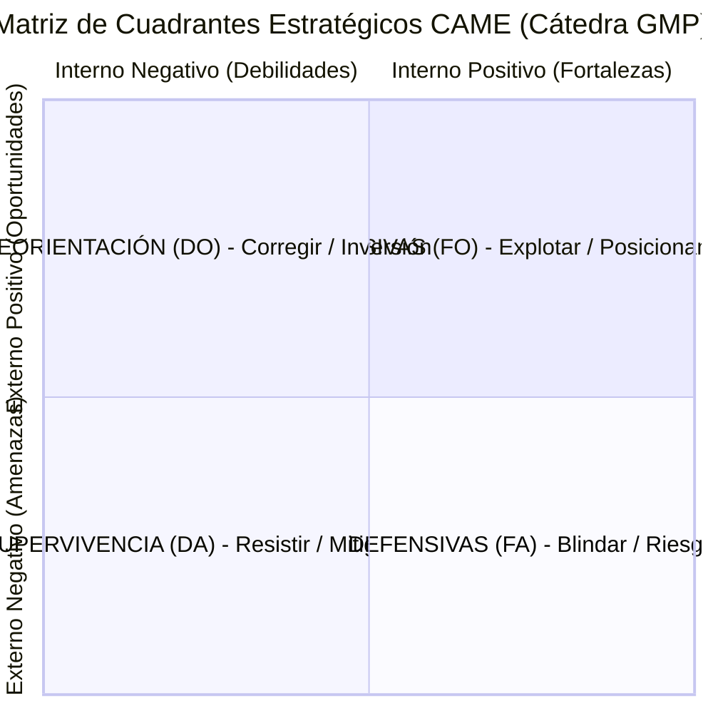

# Matriz CAME Estratégica (GMP Etapa 3 - Cruces FO, FA, DO, DA)

Skill atómica especialista para la formulación, estructuración y validación de la **Matriz CAME** (Corregir debilidades, Afrontar amenazas, Mantener fortalezas, Explotar oportunidades) en la Etapa 3 de Gestión y Mejora de Procesos (GMP).

Basada en los materiales oficiales de cátedra (*SLI_U3_C04_Matriz_CAME* y *PlanillaMATRICES-TPI 2026 con ejemplo - Etapa 3 Matriz 1*), transforma el diagnóstico analítico de la Etapa 2 (Matriz FODA y auditoría operativa de procesos) en una hoja de ruta de intervención concreta, asegurando consistencia matemática, citación explícita de factores y trazabilidad hacia el inventario de Acciones de Valor EERR (`valueActionsBuilder`).

---

## Límites de Autoridad y Reglas Invariables

1. **Persistencia Determinista Obligatoria:**
   - El resultado debe persistirse obligatoriamente en el archivo Markdown `came.md` en el directorio de trabajo donde se invoque la skill.
2. **Trazabilidad Estricta y Citación Explícita de Factores (Regla de Oro de Cátedra):**
   - Todo cruce estratégico DEBE citar obligatoriamente los identificadores unívocos de los factores FODA que relaciona (ej. `F1 x O2`, `D2 x O1`, `F2 x A1`, `D1 x A2`).
   - Queda estrictamente prohibida la formulación de cruces abstractos o huérfanos sin respaldo en los IDs del FODA.
3. **Población Exhaustiva de los Cuatro Cuadrantes Canónicos:**
   - Toda matriz CAME debe poblar sin excepción los 4 cuadrantes formales de cátedra:
     - **FO (Ofensiva / Mantener-Explotar):** Fortalezas $\times$ Oportunidades ($F_i \times O_j$).
     - **FA (Defensiva / Mantener-Afrontar):** Fortalezas $\times$ Amenazas ($F_i \times A_k$).
     - **DO (Reorientación / Corregir-Explotar):** Debilidades $\times$ Oportunidades ($D_m \times O_j$).
     - **DA (Supervivencia / Corregir-Afrontar):** Debilidades $\times$ Amenazas ($D_m \times A_k$).
4. **Doble Formulación Obligatoria por Fila:**
   - Cada cruce debe declarar:
     - *Enunciado Estratégico de Intervención:* La directriz conceptual de alto nivel que orienta la decisión.
     - *Acción de Mejora Concreta Derivada / Propuesta de Valor:* La iniciativa operativa, tangible y ejecutable a nivel del proceso de negocio (con indicación de procesos involucrados y alineación con metas de stakeholders).
5. **No Invención de Factores:**
   - Los factores cruzados deben provenir directamente del análisis FODA documentado (`foda.md` o matriz de diagnóstico de Etapa 2). Si el insumo carece de IDs unívocos, se deben normalizar (`F1..Fn`, `D1..Dn`, `O1..On`, `A1..An`) antes de efectuar los cruces.

---

## Las Reglas de Oro de Cátedra para los Cruces CAME

De acuerdo a la cátedra oficial de GMP (*SLI_U3_C04* y *PlanillaMATRICES-TPI*), la Matriz CAME responde a la pregunta **¿Qué vamos a hacer?** a partir del diagnóstico **¿Dónde estamos?** del FODA:

- **F [Fortalezas] ➔ M [MANTENER]:** Acciones para reforzar los puntos fuertes que dan ventaja competitiva y asegurar que perduren en el tiempo.
- **O [Oportunidades] ➔ E [EXPLOTAR]:** Iniciativas para aprovechar condiciones favorables del entorno y capturar nuevas demandas.
- **D [Debilidades] ➔ C [CORREGIR]:** Estrategias para minimizar o eliminar deficiencias internas, reingeniería de cuellos de botella y fallas de control interno.
- **A [Amenazas] ➔ A [AFRONTAR]:** Planes de contingencia para minimizar o neutralizar el impacto de factores externos negativos y riesgos de mercado.



### 1. Estrategias Ofensivas (FO: Fortalezas x Oportunidades)
- **Fórmula Canónica:** $F_i \times O_j$ (ej. `F2 x O3`)
- **Propósito de Cátedra:** Estrategia ofensiva de posicionamiento. Potenciar y desarrollar ventajas competitivas. Utilizar fortalezas internas consolidadas (infraestructura, experiencia, capacidad operativa) para capturar oportunidades de crecimiento.
- **Ejemplo de Cátedra:** *F2 (Infraestructura adecuada) x O3 (Demanda creciente de educación) ➔ Ampliar la oferta académica desarrollando programas innovadores y atractivos adaptados a la demanda.*

### 2. Estrategias Defensivas (FA: Fortalezas x Amenazas)
- **Fórmula Canónica:** $F_i \times A_k$ (ej. `F1 x A2`)
- **Propósito de Cátedra:** Estrategia defensiva. Evaluar el riesgo, defender y movilizar recursos. Utilizar fortalezas consolidadas para neutralizar o minimizar el impacto de amenazas externas.
- **Ejemplo de Cátedra:** *F1 (Base de datos histórica y experiencia) x A1 (Críticas en redes sociales) ➔ Establecer protocolos de respuesta proactiva y comunicación directa informando plazos y estados de avance técnicos.*

### 3. Estrategias de Reorientación (DO: Debilidades x Oportunidades)
- **Fórmula Canónica:** $D_m \times O_j$ (ej. `D1 x O2`)
- **Propósito de Cátedra:** Estrategia de reorientación. Tomar decisiones de inversión, asociaciones, modernización y adopción tecnológica. Cambiar y rediseñar para aprovechar oportunidades del entorno.
- **Ejemplo de Cátedra:** *D1 (Falta de trazabilidad y canales desconectados) x O2 (Fondos de modernización disponibles) ➔ Implementar plataforma única de gestión de trámites y reclamos con seguimiento digital en tiempo real.*

### 4. Estrategias de Supervivencia (DA: Debilidades x Amenazas)
- **Fórmula Canónica:** $D_m \times A_k$ (ej. `D2 x A2`)
- **Propósito de Cátedra:** Estrategia de supervivencia. Identificar limitaciones críticas, controlar posibles daños o impacto y resistir contingencias. Control de daños y blindaje operativo.
- **Ejemplo de Cátedra:** *D2 (Cuellos de botella burocráticos y demoras) x A2 (Plazos legales estrictos y recortes presupuestarios) ➔ Rediseñar y simplificar los flujos internos de aprobación para reducir tiempos de respuesta antes de restricciones financieras.*

---

## Criterios de Calidad de Cátedra (Implementar vs. Evitar)

| Aspecto | Prácticas Obligatorias (IMPLEMENTAR) | Errores Prohibidos (EVITAR) |
|---|---|---|
| **Especificidad** | Acción clara, directa y ejecutable a corto/mediano plazo. | Acciones vagas o estáticas (*"mejorar las ventas"*, *"capacitar más"*). |
| **Formulación** | Verbo de acción orientador (Automatizar, Eliminar, Rediseñar, Crear). | Redacción de deseos o intenciones en lugar de acciones operativas. |
| **Coherencia** | Neutraliza directamente la debilidad o apalanca la fortaleza/oportunidad. | Desconexión con el FODA: proponer acciones sin respaldo en la auditoría. |
| **Nivel de Decisión** | Factible dentro de la gobernanza del dueño del proceso. | Soluciones que dependen de decisiones corporativas fuera del alcance del proceso. |
| **Responsabilidad** | Declarar procesos primarios y de soporte involucrados. | Falta de responsables asignados o interfaces difusas entre áreas. |
| **Medición** | Conectable con un indicador de desempeño formal (hacia Etapa 4). | Omisión de indicadores o falta de criterios para verificar el éxito. |

---

## Estructura Canónica de la Matriz CAME

Cada registro de la matriz debe cumplir con el formato tabular estandarizado de 8 columnas:

| Columna | Campo | Descripción y Regla de Contenido |
|:---:|---|---|
| **1** | `ID Estrategia` | Identificador unívoco correlativo según cuadrante: `EST-FO-xx`, `EST-FA-xx`, `EST-DO-xx`, `EST-DA-xx`. |
| **2** | `Tipo CAME` | Cuadrante canónico: `FO (Ofensiva)`, `FA (Defensiva)`, `DO (Reorientación)`, `DA (Supervivencia)`. |
| **3** | `Cruce de Factores (IDs)` | Citación explícita obligatoria con formato `[Fi x Oj]`, `[Fi x Ak]`, `[Dm x Oj]` o `[Dm x Ak]`. |
| **4** | `Descripción de Factores` | Síntesis concisa de los factores intervinientes (ej. `Infraestructura x Demanda`). |
| **5** | `Enunciado Estratégico` | Directriz táctica metodológica de intervención. |
| **6** | `Acción de Mejora Concreta` | Iniciativa tangible para el proceso (Propuesta de Valor, palanca de cambio y efecto en el flujo). |
| **7** | `Procesos Involucrados` | Procesos directos o indirectos del mapa de procesos impactados. |
| **8** | `Alineación Estratégica / Stakeholder` | Meta organizacional que impulsa y expectativa del stakeholder a la que da respuesta. |

---

## Flujo de Trabajo Paso a Paso

1. **Fase 1: Ingestión y Normalización de Factores FODA:**
   - Leer el artefacto `foda.md` o los datos de relevamiento de la Etapa 2.
   - Verificar que cada factor posea un ID unívoco (`F1..Fn`, `D1..Dn`, `O1..On`, `A1..An`). Si faltan IDs, asignarlos de manera correlativa y documentarlos en la Sección 1.
2. **Fase 2: Identificación y Selección de Cruces de Alto Impacto:**
   - Evaluar sinergias y tensiones entre factores internos y externos.
   - Priorizar debilidades críticas provenientes de la auditoría de procesos (`processAuditor`: fallas SoD, ruta en papel, silos TI).
   - Asegurar representatividad en los 4 cuadrantes (mínimo 1-2 cruces por cuadrante, recomendados 2 o más).
3. **Fase 3: Redacción Estratégica y Derivación Operativa:**
   - Formular el *Enunciado Estratégico* iniciando con un verbo rector (Integrar, Apalancar, Blindar, Modernizar, Segregar).
   - Derivar la *Acción de Mejora Concreta / Propuesta de Valor* identificando la palanca (Automatizar/Digitalizar, Eliminar/Simplificar, Modificar/Rediseñar, Crear/Incorporar).
   - Mapear procesos afectados y expectativas de stakeholders.
4. **Fase 4: Persistencia Determinista:**
   - Instanciar la plantilla [templates/came_matrix_template.md](templates/came_matrix_template.md).
   - Guardar obligatoriamente el artefacto resultante en `came.md`.
5. **Fase 5: Verificación y Validación:**
   - Ejecutar el script determinista de validación:
     ```bash
     python scripts/validate_came.py came.md
     ```
   - Confirmar que no existan advertencias ni cruces mal formateados.

---

## Contrato de Entrada y Salida

### Insumos Requeridos (Inputs)
- Archivo `foda.md` o lista estructurada de factores FODA con identificadores (`F`, `D`, `O`, `A`).
- Opcional: Hallazgos de auditoría de `processAuditor` para enriquecer la justificación fáctica.

### Entregable Producido (Output)
- Archivo: `came.md` (nombre estricto y determinista).
- Estructura:
  1. Metadatos del proceso y analista.
  2. Registro normalizado de factores FODA de entrada con sus IDs.
  3. Matriz Conceptual CAME 2x2.
  4. Matriz CAME consolidada con los 4 cuadrantes y citación explícita `Fi x Oj`.
  5. Síntesis de cobertura y handoff hacia el inventario de Acciones de Valor EERR (`acciones_valor.md`).
