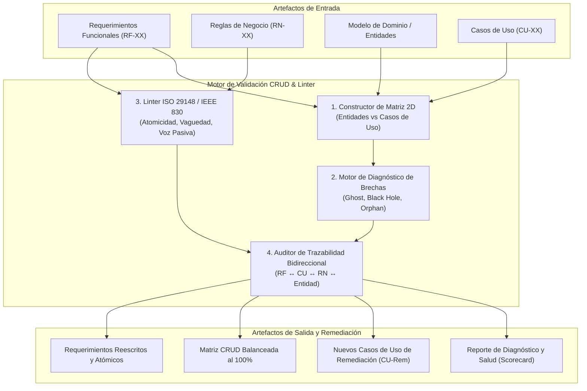
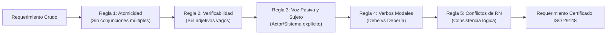
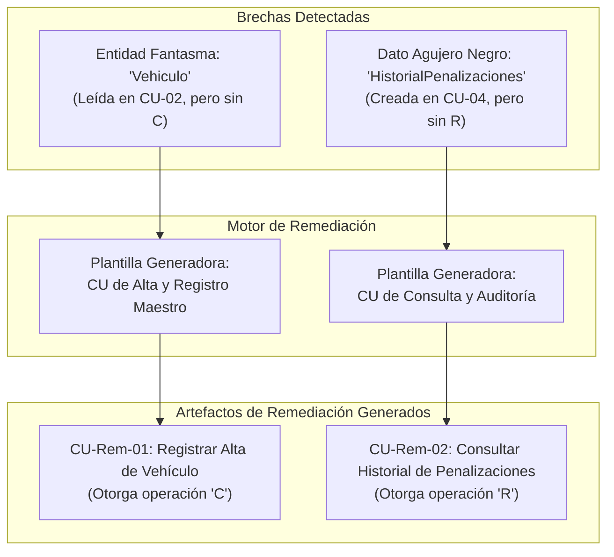
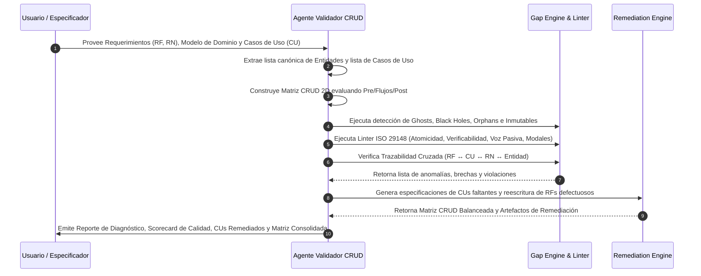

---
name: crudValidator
description: >-
  Construye y valida matrices CRUD (Entidades x Casos de Uso / Requerimientos), detecta brechas de completitud
  (entidades fantasma, datos agujero negro, entidades huérfanas), lintea la calidad de requerimientos (IEEE 830 / ISO 29148 / INCOSE)
  y genera planes de remediación automatizados con especificaciones formales de casos de uso correctivos.
---

# Validador de Requerimientos y Matriz CRUD (ASI / DSI)

Esta skill proporciona el marco metodológico, las reglas diagnósticas automatizadas y los motores de remediación para garantizar la **completitud, consistencia, verificabilidad y trazabilidad bidireccional** entre los Requerimientos del Sistema, los Casos de Uso y el Modelo de Dominio de Información, de acuerdo con los estándares internacionales **ISO/IEC/IEEE 29148:2018**, **IEEE 830**, la **Guía INCOSE para la Redacción de Requisitos** y las directrices del **Proceso Unificado de Desarrollo (PUD)** en la cátedra de Análisis de Sistemas de Información (ASI).

---

## 1. Fundamentos Teóricos y Marco Normativo

### 1.1. El Rol de la Validación en la Ingeniería de Requerimientos
En el ciclo de vida del software, más del 50% de los defectos críticos en producción tienen su origen en requerimientos ambiguos, incompletos o contradictorios. La validación asegura que el conjunto de artefactos satisfaga dos preguntas rectoras:
- **Validación:** ¿Estamos construyendo el sistema correcto? (Alineación con las necesidades reales del negocio y del usuario).
- **Verificación:** ¿Estamos construyendo el sistema correctamente? (Consistencia interna, completitud estructural, precisión sintáctica y ausencia de contradicciones).



### 1.2. Principio Cardinal del Ciclo de Vida de los Datos
> **"Toda entidad persistente del dominio debe poseer un ciclo de vida cerrado y justificado: debe existir al menos un caso de uso responsable de crearla (C), al menos un caso de uso que consuma o lea su información (R), mecanismos controlados para actualizar su estado cuando aplique (U), y una política explícita de baja lógica, archivo o destrucción (D)."**

---

## 2. Metodología de Construcción de la Matriz CRUD (2D)

La **Matriz CRUD** es una herramienta de trazabilidad y completitud bidimensional que cruza todas las **Entidades del Modelo de Dominio** (filas) con todos los **Casos de Uso / Procesos del Sistema** (columnas).

### 2.1. Semántica y Notación de Operaciones

| Operación | Símbolo | Significado Semántico | Acción en Base de Datos / Dominio |
| :--- | :---: | :--- | :--- |
| **Create** | **C** | **Creación / Alta / Instanciación:** El Caso de Uso instancia y persiste una nueva ocurrencia de la entidad en el repositorio. | `INSERT`, `new Entity()`, Registro inicial |
| **Read** | **R** | **Lectura / Consulta / Inspección:** El Caso de Uso consulta, visualiza, valida atributos o utiliza la entidad para cálculos o toma de decisiones. | `SELECT`, `FindById()`, Inspección de atributos |
| **Update** | **U** | **Actualización / Transición de Estado:** El Caso de Uso modifica los valores de los atributos o muta el estado del ciclo de vida de la entidad. | `UPDATE`, Transición en Máquina de Estados |
| **Delete** | **D** | **Baja / Inactivación / Eliminación:** El Caso de Uso da de baja la entidad (sea borrado lógico por cambio de estado a 'Inactivo/Baja' o borrado físico). | `DELETE`, `SetEstado(Baja)`, `Archivar()` |

### 2.2. Algoritmo de Inferencia de Operaciones desde la Especificación de CU

Para cada Caso de Uso (`CU-XX`), el agente analiza sus secciones formales e infiere las marcas CRUD según las siguientes reglas:

1. **Precondiciones:**
   - Si la precondición requiere que una entidad exista en cierto estado (ej. *"El Cliente debe estar habilitado"*), se infiere una operación **`R`** sobre `Cliente`.
2. **Disparador y Selección Inicial:**
   - Si el actor busca o selecciona una entidad para operar (ej. *"El Empleado busca el Producto por código"*), se infiere **`R`** sobre `Producto`.
3. **Flujo Principal - Validación de Reglas:**
   - Si el sistema consulta tablas maestras, límites, saldos o parámetros para validar una `RN`, se infiere **`R`** sobre dichas entidades.
4. **Flujo Principal - Generación de Transacciones:**
   - Si el sistema registra un nuevo comprobante, solicitud o expediente (ej. *"El sistema guarda la Factura con sus DetalleFactura"*), se infiere **`C`** sobre `Factura` y `DetalleFactura`.
5. **Flujo Principal - Actualizaciones Colaterales:**
   - Si se descuenta stock, se acumulan puntos o cambia el estado (ej. *"El sistema descuenta el stock de Artículo y cambia el estado del Pedido a 'Confirmado'"*), se infiere **`U`** sobre `Artículo` y `Pedido`.
6. **Flujos Alternativos / Excepción - Bajas o Cancelaciones:**
   - Si se cancela la operación o se anula un registro previo, se infiere **`U`** (si cambia a 'Anulado') o **`D`** (si se purga el registro).
7. **Postcondiciones:**
   - Todo objeto declarado como creado en la postcondición debe tener **`C`**; todo objeto modificado debe tener **`U`**.

### 2.3. Estructura Estándar de la Matriz CRUD

```markdown
| Entidad de Dominio \ Caso de Uso | CU-01: Reg. Cliente | CU-02: Emitir Pedido | CU-03: Facturar Pedido | CU-04: Consultar Saldo | Cobertura CRUD | Estado |
| :--- | :---: | :---: | :---: | :---: | :---: | :---: |
| **Cliente** | C | R | R, U | R | C, R, U | OK |
| **Pedido** | - | C | R, U | - | C, R, U | OK |
| **DetallePedido** | - | C | R | - | C, R | OK (Inmutable) |
| **Producto** | - | R, U | R | R | R, U | ⚠️ GHOST (Sin C) |
| **AuditoriaInterna** | C | C | C | - | C | ⚠️ BLACK HOLE (Sin R) |
| **CategoriaFiscal** | - | - | - | - | - | ❌ ORPHAN (Sin CRUD) |
```

---

## 3. Motor de Diagnóstico de Brechas y Anomalías Estructurales (Gap Engine)

El validador inspecciona la matriz resultante fila por fila y columna por columna aplicando algoritmos deterministas de detección de anomalías:

```mermaid
flowchart TD
    START([Inicio Auditoría Fila de Entidad]) --> CHECK_EXISTS{¿Tiene alguna<br/>operación?}
    
    CHECK_EXISTS -- No --> ANOM_ORPHAN["❌ ERROR CRÍTICO: Entidad Huérfana (Orphan Entity)<br/>Sin operaciones en ningún CU"]
    CHECK_EXISTS -- Sí --> CHECK_C{¿Posee operación<br/>Create (C)?}
    
    CHECK_C -- No --> CHECK_MASTER{¿Es catálogo externo /<br/>tabla maestra precargada?}
    CHECK_MASTER -- No --> ANOM_GHOST["🚨 ERROR BLOQUEANTE: Entidad Fantasma (Ghost Entity)<br/>Se lee/modifica pero nunca se crea"]
    CHECK_MASTER -- Sí --> FLAG_PARAM["ℹ️ NOTA: Parámetro de Configuración / Seed Data"]
    
    CHECK_C -- Sí --> CHECK_R{¿Posee operación<br/>Read (R)?}
    CHECK_R -- No --> ANOM_BLACKHOLE["⚠️ ADVERTENCIA MAYOR: Dato Agujero Negro (Black Hole)<br/>Se crea pero nadie lo consulta ni reporta"]
    CHECK_R -- Sí --> CHECK_UD{¿Posee Update (U)<br/>o Delete (D)?}
    
    CHECK_UD -- Sí --> OK_BALANCED["✅ ENTIDAD BALANCEADA (CRUD Completo)"]
    CHECK_UD -- No --> CHECK_IMMUTABLE{¿Es entidad histórica /<br/>log append-only?}
    CHECK_IMMUTABLE -- Sí --> OK_IMMUTABLE["✅ ENTIDAD BALANCEADA (Inmutable por diseño)"]
    CHECK_IMMUTABLE -- No --> WARN_LIFECYCLE["⚠️ ADVERTENCIA MENOR: Sin flujo de modificación ni baja"]
```

### 3.1. Taxonomía de Anomalías Estructurales

#### 1. Entidad Fantasma (Ghost Entity / Phantom Read-Update)
- **Definición:** Entidad que es consumida (`R`), modificada (`U`) o eliminada (`D`) por uno o varios Casos de Uso, pero **no existe ningún Caso de Uso en el sistema responsable de su creación (`C`)**.
- **Impacto en el Negocio:** Fallo de ejecución en producción. El sistema asume la existencia de datos que los usuarios no tienen cómo ingresar, bloqueando los flujos transaccionales.
- **Severidad:** `BLOQUEANTE (Critical / Blocker)`.
- **Regla de Remediación:**
  1. Si la entidad debe ser gestionada por los usuarios del sistema: Generar automáticamente el caso de uso `CU-Rem-XX: Registrar / Dar de Alta [Entidad]`.
  2. Si la entidad proviene de un sistema externo: Documentar la interfaz de integración asíncrona / webhook (`CU-Rem-XX: Sincronizar [Entidad] desde Sistema Externo`).
  3. Si es un catálogo estático del sistema (ej. Provincias, Tipos de IVA): Declararlo formalmente como *Seed Data / Parámetro Semilla*.

#### 2. Dato Agujero Negro (Black Hole Data / Write-Only Entity)
- **Definición:** Entidad que es creada (`C`) o actualizada (`U`) por el sistema, pero **nunca es leída (`R`), consultada, mostrada en pantallas, exportada en reportes ni evaluada en reglas de negocio**.
- **Impacto en el Negocio:** Sobrecosto de desarrollo ("Gold Plating"), consumo innecesario de almacenamiento, esfuerzo de captura de datos por parte del usuario sin ningún retorno de valor.
- **Severidad:** `MAYOR (Major Warning)`.
- **Regla de Remediación:**
  1. Identificar a los interesados (stakeholders) que requieren dicha información y generar el caso de uso `CU-Rem-YY: Consultar / Emitir Informe de [Entidad]`.
  2. Si el dato carece de justificación de negocio: Eliminar la entidad del modelo y simplificar los formularios de carga.

#### 3. Entidad Huérfana o Inerte (Orphan / Dormant Entity)
- **Definición:** Clase o entidad identificada en el Modelo de Dominio que tiene **cero operaciones asociadas** (matriz vacía `-` en todas las columnas de Casos de Uso).
- **Impacto en el Negocio:** Inconsistencia grave entre el modelo conceptual y el alcance funcional; artefactos desincronizados.
- **Severidad:** `CRÍTICA (Consistency Error)`.
- **Regla de Remediación:**
  1. Si representa un requerimiento omitido: Especificar el paquete de casos de uso faltantes para administrarla.
  2. Si es residuo de un análisis preliminar superado: Depurar y remover la clase del Diagrama de Clases del Dominio.

#### 4. Entidad Indestructible / Sin Mantenimiento (Never Deleted / Never Updated Nuance)
- **Definición:** Entidad transaccional de larga duración que posee `C` y `R`, pero carece por completo de mecanismos de actualización de estado (`U`) o de baja/archivo (`D`).
- **Distinción:**
  - *Válido:* Entidades de valor contable, comprobantes fiscales, transacciones de blockchain o logs de auditoría (patrón *Append-Only / Inmutable*).
  - *Inválido:* Entidades maestras como `Cliente`, `Usuario`, `Vehículo`, donde no poder corregir datos erróneos ni dar de baja cuentas inactivas viola regulaciones (ej. GDPR / Ley de Protección de Datos Personales).
- **Severidad:** `MEDIA (Moderate / Info)`.
- **Regla de Remediación:** Exigir la especificación de `CU: Modificar Datos de [Entidad]` y `CU: Inactivar / Dar de Baja [Entidad]`.

#### 5. Caso de Uso Inerte / Pasivo (Zero-CRUD Use Case)
- **Definición:** Caso de uso que no realiza ninguna operación de lectura, creación, actualización ni baja sobre ninguna entidad del dominio.
- **Diagnóstico:** Indica que el caso de uso es una función puramente de interfaz (ej. "Navegar al Menú"), está incompleto en su especificación o es redundante.
- **Severidad:** `MEDIA`.

---

## 4. Linter de Calidad de Requerimientos (ISO 29148 / IEEE 830 / INCOSE)

El linter audita el texto de cada Requerimiento Funcional (`RF-XX`), Requerimiento No Funcional (`RNF-XX`) y Regla de Negocio (`RN-XX`) aplicando reglas de análisis sintáctico y semántico formal:



### 4.1. Catálogo de Reglas del Linter

#### Regla LINT-01: Atomicidad (Atomicity & Single Responsibility)
- **Problema:** El requerimiento combina múltiples metas, funciones o flujos en una sola oración mediante conjunciones ("y", "además", "así como también", "junto con", "por otra parte").
- **Detección:** Presencia de más de una cláusula verbal principal coordinada en la misma declaración.
- **Ejemplo Violación:** *"El sistema debe permitir registrar clientes, emitirles una tarjeta de puntos y enviarles un correo electrónico de bienvenida con su clave temporal."*
- **Acción Correctiva:** Descomponer en tres requerimientos atómicos independientes:
  - `RF-01.1`: *"El sistema debe permitir registrar nuevos clientes capturando sus datos filiatorios."*
  - `RF-01.2`: *"El sistema debe generar y asignar una tarjeta de puntos al cliente registrado."*
  - `RF-01.3`: *"El sistema debe enviar un correo electrónico de bienvenida con las credenciales temporales de acceso."*

#### Regla LINT-02: Verificabilidad y Objetividad (Verifiability / Testability)
- **Problema:** Uso de adjetivos calificativos subjetivos, términos ambiguos o promesas no medibles que impiden a QA diseñar una prueba de pasa/no pasa.
- **Glosario Prohibido (Weak Words):**
  `rápido`, `fácil`, `intuitivo`, `amigable`, `eficiente`, `óptimo`, `adecuado`, `moderno`, `seguro`, `flexible`, `robusto`, `en tiempo real`, `según sea necesario`, `etc.`, `y/o`, `entre otros`, `incluyendo pero no limitado a`.
- **Ejemplo Violación:** *"El sistema debe responder de forma rápida y tener una interfaz intuitiva para que el usuario opere con facilidad."*
- **Acción Correctiva:** Reemplazar por métricas cuantificables y SLA objetivos:
  - `RNF-PERF-01`: *"El 95% de las consultas de catálogo deben responder en un tiempo inferior a 800 ms bajo una carga concurrente de 500 usuarios (SLA Tier-1)."*
  - `RNF-USAB-01`: *"Un operador novel sin capacitación previa debe ser capaz de completar la carga de un pedido en menos de 180 segundos con una tasa de error inferior al 2%."*

#### Regla LINT-03: Voz Pasiva y Falta de Sujeto Responsable (Passive Voice & Agency)
- **Problema:** Redacción en voz pasiva o impersonal ("se procesará", "serán validados los datos", "se emitirá un comprobante") que oculta quién ejecuta la acción (¿el usuario, el sistema principal, un microservicio batch, un operador externo?).
- **Ejemplo Violación:** *"Los comprobantes de pago serán validados y se generará una notificación."*
- **Acción Correctiva:** Redactar en voz activa con sujeto inequívoco:
  - `RF-08`: *"El Módulo de Tesorería debe validar la firma digital de los comprobantes de pago recibidos."*
  - `RF-09`: *"El Servicio de Mensajería debe enviar una notificación push al Actor Cliente tras la confirmación de la transacción."*

#### Regla LINT-04: Rigor Modal Normativo (Modal Precision - RFC 2119 / ISO 29148)
- **Problema:** Uso de tiempos verbales condicionales o de deseo ("debería", "podría", "sería deseable", "se planea", "puede ser que").
- **Estándar:**
  - **DEBE (`SHALL` / `MUST`):** Obligación estricta y vinculante para el cumplimiento del contrato.
  - **DEBERÍA (`SHOULD`):** Recomendación deseable pero no bloqueante.
  - **PUEDE (`MAY`):** Permiso o comportamiento opcional.
- **Ejemplo Violación:** *"El sistema debería solicitar confirmación antes de anular una reserva."*
- **Acción Correctiva:** *"El sistema debe solicitar confirmación explícita del operador antes de persistir la anulación de una reserva."*

#### Regla LINT-05: Coherencia y Detección de Conflictos en Reglas de Negocio (RN Consistency)
- **Problema:** Dos o más reglas de negocio establecen condiciones mutuamente excluyentes, solapamientos temporales o contradicciones directas sobre una misma entidad o estado.
- **Detección:** Tablas de decisión y validación de matrices booleanas.
- **Ejemplo Conflicto:**
  - `RN-12`: *"Los socios de categoría 'Platino' acceden a un 25% de descuento en todos los servicios sin restricciones de día."*
  - `RN-18`: *"Durante los fines de semana ningún socio podrá recibir descuentos superiores al 10%."*
- **Acción Correctiva:** Especificar jerarquía de precedencia o reformular la regla unificada:
  - `RN-12-Rev`: *"Los socios de categoría 'Platino' acceden a un 25% de descuento de lunes a viernes, y a un 10% los fines de semana y feriados (Precedencia RN-18 sobre RN-12)."*

---

## 5. Auditor de Trazabilidad Cruzada Bidireccional

El auditor verifica que no existan eslabones rotos en la cadena de desarrollo orientada a requerimientos:

```markdown
| Elemento de Origen | Requisito de Cobertura | Tipo de Brecha si falta | Severidad |
| :--- | :--- | :--- | :---: |
| **Requerimiento Funcional (RF)** | Debe estar materializado en al menos 1 Caso de Uso (`CU`). | RF Huérfano (No implementado) | `ALTA` |
| **Caso de Uso (CU)** | Debe satisfacer al menos 1 Requerimiento Funcional (`RF`). | CU sin Justificación (Gold Plating) | `MEDIA` |
| **Regla de Negocio (RN)** | Debe estar referenciada en el Flujo Principal o Excepción de al menos 1 `CU`. | Regla Inerte (No aplicada) | `ALTA` |
| **Entidad de Dominio** | Debe tener presencia CRUD en al menos 1 `CU`. | Entidad Muerta (Inconsistencia Dominio) | `CRÍTICA` |
```

---

## 6. Motor de Remediación Automática (Gap Remediation Engine)

Cuando el validador identifica brechas o violaciones, no se limita a reportar el error: **genera automáticamente el plan de remediación y los artefactos completos necesarios para subsanarlo**.

### 6.1. Patrones de Generación de Casos de Uso Correctivos



### 6.2. Algoritmo de Especificación del Caso de Uso Creador (`CU-Rem-Create`)
Para toda entidad fantasma `[Entidad]`:
1. Asignar Identificador secuencial: `CU-Rem-XX`.
2. Título: `Registrar Alta de [Entidad]`.
3. Actor Principal: Determinar según el módulo funcional (ej. `Administrador`, `Operador de Admisión`, `Supervisor`).
4. Precondición: `El usuario debe poseer el rol [Rol] y encontrarse autenticado en el sistema.`
5. Flujo Principal:
   - Paso 1: El Actor solicita el registro de un nuevo `[Entidad]`.
   - Paso 2: El Sistema presenta el formulario de carga con los campos requeridos del modelo de dominio.
   - Paso 3: El Actor ingresa los atributos y confirma la operación.
   - Paso 4: El Sistema valida formato y reglas de negocio (`RN-Rem-XX`).
   - Paso 5: El Sistema persiste la nueva instancia de `[Entidad]` (**Operación C**).
   - Paso 6: El Sistema emite mensaje de éxito y retorna al panel de gestión.
6. Postcondición: `La entidad [Entidad] queda persistida en estado 'Activo'.`

---

## 7. Flujo Operativo del Agente: Paso a Paso

Cuando se invoque esta skill para validar un paquete de requerimientos, el agente debe ejecutar estrictamente la siguiente secuencia:



---

## 8. Caso de Estudio Práctico Completo: "Sistema de Internación y Guardia Hospitalaria (MediCare)"

A continuación se presenta un caso integral de extremo a extremo que demuestra la aplicación práctica de toda la skill.

### 8.1. Entrada Inicial con Defectos (Especificación Cruda)

#### Requerimientos Funcionales y Reglas Iniciales:
- `RF-01`: *"El sistema debe ser rápido, intuitivo y permitir que se registren los pacientes cuando llegan a la guardia y además asignarles un médico de turno y mandar un aviso por email."* (⚠️ Viola Atomicidad, Verificabilidad y Voz Pasiva).
- `RF-02`: *"El médico debería poder consultar los estudios previos del paciente y solicitar nuevos análisis clínicos si fuera necesario."* (⚠️ Viola Rigor Modal y Atomicidad).
- `RF-03`: *"Se registrará el informe de alta médica cuando el paciente se retire del hospital."* (⚠️ Viola Voz Pasiva y Sujeto).
- `RN-01`: *"Ningún paciente puede ser atendido sin tener una FichaMédica activa."*
- `RN-02`: *"Si el paciente es derivado a Terapia Intensiva, su estado pasa a 'Crítico' y no se permite ninguna medicación ambulatoria."*

#### Entidades del Modelo de Dominio Identificadas:
1. `Paciente`
2. `FichaMedica`
3. `EstudioClinico`
4. `AltaMedica`
5. `RegistroAuditoriaSeguridad`
6. `ConvenioAseguradora`

#### Casos de Uso Iniciales:
- `CU-01: Registrar Ingreso de Paciente en Guardia`
- `CU-02: Solicitar Estudio Clínico`
- `CU-03: Registrar Alta de Internación`

---

### 8.2. Diagnóstico del Agente y Matriz CRUD Inicial (2D)

```markdown
### Matriz CRUD Inicial (Pre-Validación)

| Entidad de Dominio \ Caso de Uso | CU-01: Reg. Ingreso | CU-02: Sol. Estudio | CU-03: Reg. Alta | Cobertura CRUD Detectada | Diagnóstico Estructural |
| :--- | :---: | :---: | :---: | :---: | :--- |
| **Paciente** | C, R | R | R, U | **C, R, U** | ✅ Balanceada |
| **FichaMedica** | R | R, U | R, U | **R, U** | 🚨 **GHOST ENTITY** (Sin C) |
| **EstudioClinico** | - | C, R | - | **C, R** | ✅ Balanceada (Inmutable) |
| **AltaMedica** | - | - | C | **C** | ⚠️ **BLACK HOLE DATA** (Sin R) |
| **RegistroAuditoriaSeguridad** | C | C | C | **C** | ⚠️ **BLACK HOLE DATA** (Sin R) |
| **ConvenioAseguradora** | - | - | - | **-** | ❌ **ORPHAN ENTITY** (Sin CRUD) |
```

---

### 8.3. Reporte Formal del Linter de Requerimientos (ISO 29148)

| ID Requerimiento | Regla Violada | Fragmento Defectuoso | Severidad | Explicación del Defecto |
| :--- | :--- | :--- | :---: | :--- |
| **RF-01** | `LINT-01` (Atomicidad)<br/>`LINT-02` (Verificabilidad)<br/>`LINT-03` (Voz Pasiva) | *"ser rápido, intuitivo..."*<br/>*"y además asignarles..."*<br/>*"que se registren..."* | `CRÍTICA` | Combina 3 acciones funcionales en un único requisito; contiene adjetivos no medibles ("rápido", "intuitivo"); utiliza voz impersonal pasiva. |
| **RF-02** | `LINT-04` (Rigor Modal)<br/>`LINT-01` (Atomicidad) | *"El médico debería..."*<br/>*"y solicitar nuevos análisis..."* | `ALTA` | Utiliza verbo condicional ("debería") en lugar de obligatorio ("debe"); agrupa consulta y solicitud en un mismo RF. |
| **RF-03** | `LINT-03` (Voz Pasiva) | *"Se registrará el informe..."* | `MEDIA` | Oculta el actor responsable del registro (Médico Tratante / Jefe de Guardia). |

---

### 8.4. Plan de Remediación y Nuevos Casos de Uso Generados

Para resolver las 3 brechas estructurales y las violaciones del Linter, el motor genera:
1. **`CU-Rem-04: Registrar Apertura de Ficha Médica`** (Resuelve Ghost Entity sobre `FichaMedica`).
2. **`CU-Rem-05: Consultar Historial de Altas y Liquidación de Internación`** (Resuelve Black Hole sobre `AltaMedica`).
3. **`CU-Rem-06: Auditar Eventos de Seguridad y Accesos Clínicos`** (Resuelve Black Hole sobre `RegistroAuditoriaSeguridad`).
4. **`CU-Rem-07: Administrar Convenios de Aseguradoras`** (Resuelve Orphan Entity sobre `ConvenioAseguradora`).
5. **Reescritura atómica de `RF-01`, `RF-02` y `RF-03`**.

---

### 8.5. Especificación Formal del Caso de Uso Remediador (`CU-Rem-04`)

```markdown
# CU-Rem-04: Registrar Apertura de Ficha Médica

## 1. Ficha Técnica
| Atributo | Detalle |
| :--- | :--- |
| **Identificador** | CU-Rem-04 |
| **Nombre** | Registrar Apertura de Ficha Médica |
| **Módulo** | Módulo de Admisión e Historia Clínica |
| **Actor Principal** | Empleado de Admisión / Médico de Guardia |
| **Propósito** | Crear la ficha médica institucional inicial para un paciente nuevo o reactivar expediente. |
| **Trazabilidad** | Satisface `RF-01.1`, Resuelve Brecha Ghost `FichaMedica`, Aplica `RN-01`. |
| **Operación CRUD** | **`FichaMedica: C`**, **`Paciente: R`**, **`RegistroAuditoriaSeguridad: C`** |

## 2. Precondiciones
1. El Paciente debe estar previamente registrado en el sistema (`Paciente: R`).
2. No debe existir una Ficha Médica en estado 'Abierta' para el mismo paciente (`RN-01`).

## 3. Flujo Principal (Happy Path)
| Paso | Actor | Sistema |
| :---: | :--- | :--- |
| **1** | El Empleado de Admisión ingresa el DNI del paciente y solicita "Apertura de Ficha Médica". | |
| **2** | | El Sistema recupera los datos filiatorios del Paciente (`Paciente: R`) y valida que no posea ficha abierta (`RN-01`). |
| **3** | | El Sistema presenta el formulario de antecedentes médicos, grupo sanguíneo, alergias y cobertura. |
| **4** | El Actor completa los datos clínicos iniciales y confirma la creación. | |
| **5** | | El Sistema valida consistencia de datos, genera número de historia clínica irrepetible y persiste la nueva `FichaMedica` con estado 'Activa' (**`FichaMedica: C`**). |
| **6** | | El Sistema registra el evento en el log de auditoría (**`RegistroAuditoriaSeguridad: C`**) y emite confirmación visual en pantalla. |

## 4. Postcondiciones
- La entidad `FichaMedica` queda creada y persistida en estado 'Activa', habilitando la atención médica posterior.
```

---

### 8.6. Reescritura Normalizada de Requerimientos (Estándar ISO 29148)

```markdown
### Requerimientos Funcionales Reescritos

- **`RF-01.1 (Recepción de Pacientes)`:** 
  *"El Sistema de Admisión debe permitir al Empleado de Admisión registrar los datos filiatorios de un nuevo Paciente validando número de identificación oficial único."*
  
- **`RF-01.2 (Asignación de Guardia)`:** 
  *"El Sistema de Guardia debe asignar automáticamente un Médico de Turno disponible según la especialidad requerida por el triage del Paciente."*

- **`RF-01.3 (Notificación de Ingreso)`:** 
  *"El Servicio de Notificaciones debe enviar una alerta por correo electrónico y SMS al contacto de emergencia del Paciente confirmando su horario y sala de admisión."*

- **`RF-02.1 (Consulta de Historial Clínico)`:** 
  *"El Sistema Clínico debe permitir al Médico Tratante consultar el historial de estudios clínicos y diagnósticos previos asociados a la Ficha Médica del Paciente."*

- **`RF-02.2 (Solicitud de Exámenes Complementarios)`:** 
  *"El Sistema Clínico debe permitir al Médico Tratante prescribir órdenes electrónicas de estudios de laboratorio e imágenes médicas vinculadas al episodio actual."*

- **`RF-03.1 (Emisión de Alta Médica)`:** 
  *"El Sistema de Internación debe permitir al Médico Tratante generar y firmar digitalmente el Informe de Alta Médica registrando diagnóstico de egreso, epicrisis y prescripción post-hospitalaria."*

### Requerimientos No Funcionales Normalizados (Métricas Cuantificables)

- **`RNF-PERF-01 (Latencia de Consulta)`:** 
  *"El tiempo de respuesta del sistema para la consulta de antecedentes clínicos de un paciente no debe exceder los 1.2 segundos bajo una carga concurrente de 300 peticiones simultáneas."*

- **`RNF-SEC-01 (Inmutabilidad de Auditoría)`:** 
  *"Todo acceso, lectura y modificación de la Ficha Médica debe persistirse de forma inmutable en el Registro de Auditoría de Seguridad cumpliendo con el estándar HIPAA/HL7."*
```

---

### 8.7. Matriz CRUD Consolidada y Balanceada Final (100% Cobertura)

```markdown
| Entidad \ Caso de Uso | CU-01: Ingreso Paciente | CU-02: Sol. Estudio | CU-03: Alta Paciente | CU-Rem-04: Apertura Ficha | CU-Rem-05: Informes Alta | CU-Rem-06: Auditoria | CU-Rem-07: Conv. Seguro | Cobertura Final | Estado |
| :--- | :---: | :---: | :---: | :---: | :---: | :---: | :---: | :---: | :---: |
| **Paciente** | C, R | R | R, U | R | R | - | - | **C, R, U** | ✅ 100% OK |
| **FichaMedica** | R | R, U | R, U | **C** | R | - | - | **C, R, U** | ✅ 100% OK |
| **EstudioClinico** | - | C, R | - | - | R | - | - | **C, R** | ✅ Inmutable OK |
| **AltaMedica** | - | - | C | - | **R** | - | - | **C, R** | ✅ 100% OK |
| **RegistroAuditoriaSeguridad** | C | C | C | C | - | **R** | C | **C, R** | ✅ Log Inmutable OK |
| **ConvenioAseguradora** | R | - | R | R | - | - | **C, R, U, D** | **C, R, U, D** | ✅ 100% OK |
```

---

### 8.8. Scorecard de Salud y Calidad de Requerimientos (Métricas de Cierre)

```markdown
| Indicador de Calidad | Pre-Validación | Post-Validación (Remediado) | Estado |
| :--- | :---: | :---: | :---: |
| **Entidades Balanceadas (CRUD Cerrado)** | 33.3% (2/6) | **100.0% (6/6)** | 🟢 Aprobado |
| **Entidades Fantasma (Ghost Entities)** | 1 (`FichaMedica`) | **0** | 🟢 Resuelto |
| **Datos Agujero Negro (Black Holes)** | 2 (`AltaMedica`, `Auditoria`) | **0** | 🟢 Resuelto |
| **Entidades Huérfanas (Orphan Entities)** | 1 (`ConvenioAseguradora`)| **0** | 🟢 Resuelto |
| **Violaciones Linter ISO 29148** | 5 Críticas / Mayores | **0** | 🟢 Certificado |
| **Trazabilidad Bidireccional (RF ↔ CU ↔ RN)** | 58.0% | **100.0%** | 🟢 Total |
```

---

## 9. Plantillas y Artefactos Exportables

### 9.1. Plantilla de Reporte de Auditoría CRUD (Markdown)

```markdown
# Reporte de Auditoría CRUD y Calidad de Requerimientos: [Nombre del Sistema]

## 1. Resumen Ejecutivo de Diagnóstico
- **Total Entidades Analizadas:** [N]
- **Total Casos de Uso Auditados:** [M]
- **Entidades Fantasma Detectadas:** [Cantidad y Lista]
- **Datos Agujero Negro Detectados:** [Cantidad y Lista]
- **Entidades Huérfanas Detectadas:** [Cantidad y Lista]
- **Violaciones de Requerimientos (Linter ISO 29148):** [Cantidad]

---

## 2. Matriz CRUD Bidimensional (Entidades x Casos de Uso)
[Insertar Tabla de Matriz CRUD con marcas C, R, U, D]

---

## 3. Detalle de Brechas y Defectos Estructurales
### 3.1. Entidades Fantasma (Ghost Entities - Read/Update sin Create)
- **[Entidad]**: Leída en `[CU-A]`, modificada en `[CU-B]`. Carece de Caso de Uso Creador.
  - *Acción de Remediación Propuesta:* Crear `[CU-Rem-XX: Registrar Alta de ...]`.

### 3.2. Datos Agujero Negro (Black Hole Data - Create sin Read/Report)
- **[Entidad]**: Creada en `[CU-X]`. Nunca es consultada ni exportada.
  - *Acción de Remediación Propuesta:* Crear `[CU-Rem-YY: Consultar / Reportar ...]`.

---

## 4. Hallazgos del Linter de Requerimientos (ISO/IEC/IEEE 29148)
[Insertar Tabla con ID, Regla, Fragmento, Severidad y Corrección]

---

## 5. Especificación de Casos de Uso de Remediación
[Insertar Fichas Técnicas y Flujos de los Casos de Uso Generados]

---

## 6. Matriz CRUD Consolidada Final y Matriz de Trazabilidad
[Insertar Matriz CRUD Final Balanceada y Matriz RF <-> CU <-> RN <-> Entidad]
```

---

## 10. Checklist de Verificación Final (Quality Gate)

Antes de dar por aprobada la especificación de un sistema, verificar:

- [ ] **Sin Entidades Fantasma:** Cada entidad del modelo de datos cuenta con al menos un Caso de Uso que la crea (`C`) o está tipificada explícitamente como catálogo precargado (*Seed Data*).
- [ ] **Sin Agujeros Negros:** Cada dato persistido (`C`/`U`) tiene al menos un Caso de Uso que lo lee (`R`), lo expone en interfaces o lo utiliza en reglas de decisión.
- [ ] **Sin Entidades Huérfanas:** No existen clases en el Modelo de Dominio con cobertura CRUD nula (`-`).
- [ ] **Atomicidad en Requerimientos:** Ningún `RF` agrupa más de una meta funcional autónoma.
- [ ] **Verificabilidad Cuantificable:** Ningún `RNF` contiene palabras vagas o subjetivas; todos expresan umbrales numéricos, tiempos de respuesta o SLAs.
- [ ] **Voz Activa con Sujeto:** Todos los `RF` y pasos de Casos de Uso indican con precisión qué actor o subsistema ejecuta la acción.
- [ ] **Rigor Modal:** Todos los requerimientos mandatorios utilizan la forma imperativa *"El sistema debe..."* (RFC 2119 / ISO 29148).
- [ ] **Trazabilidad 100% Cerrada:** Todo `RF` mapea a al menos un `CU`; toda `RN` está vinculada a los pasos de flujo correspondientes; toda entidad está cubierta en la matriz.
