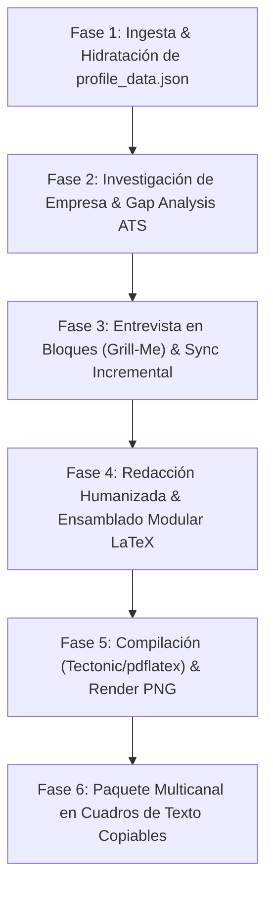

# cvOptimizer: Arquitectura y Optimización Curricular ATS en LaTeX

`cvOptimizer` es el estudio integral para la ingeniería, rediseño y adaptación algorítmica de Currículums Vitae de alto impacto técnico y ejecutivo. Transforma historiales laborales dispersos en proyectos modulares de LaTeX diseñados para superar con el 100% de éxito los parsers de los principales Applicant Tracking Systems (Workday, Greenhouse, Taleo, Lever, SAP SuccessFactors), alineando cada postulación con las necesidades específicas del rol y la empresa.

---

## Principios y Reglas de Oro Operativas

1. **Memoria Viva Incremental (`profile_data.json`):**
   Toda información profesional del usuario (experiencias, logros, métricas, certificaciones, tecnologías) se consolida y persiste en el archivo `profile_data.json` en la raíz del espacio de trabajo. En cada postulación o entrevista, este archivo se enriquece de forma acumulativa y nunca pierde datos previos.
2. **Anti-Alucinación Estricta:**
   Está terminantemente prohibido inventar métricas, roles, tecnologías o porcentajes de impacto. Se permite enaltecer ("darle color") y jerarquizar habilidades reales demostrables, pero si falta un número o dato cuantitativo, se debe interrogar al usuario o insertar el marcador explícito `\metric{[X%]}` para su posterior validación humana.
3. **Fórmula Google X-Y-Z Canónica:**
   Cada viñeta de experiencia laboral debe formularse bajo la estructura:
   $$\text{“Logró [X: resultado/impacto], medido por [Y: métrica/volumen], mediante [Z: acción técnica/herramienta]”}$$
4. **Desintoxicación de IA (`humanizer`):**
   Erradicar clichés sintéticos de LLMs (*spearheaded*, *pivotal*, *delve*, *vibrant*, *seamlessly*). Utilizar verbos de acción empíricos (*Desarrolló, Optimizó, Redujo, Coordinó, Diseñó*), variar la longitud de oraciones (*burstiness*) y mantener voz activa directa.
5. **Topología ATS y Paginación Balanceada (1 a 2 Páginas):**
   El cuerpo del CV debe mantener un orden de lectura lineal de una sola columna sin tablas complejas ni columnas paralelas. La extensión no debe forzarse artificialmente a una sola página si eso compromete la holgura visual o genera un aspecto apretado; se prioriza la prolijidad, legibilidad ejecutiva, interlineado cómodo y distribución balanceada (1 página para perfiles iniciales compactos, o 2 páginas bien distribuidas sin encabezados huérfanos para perfiles con experiencia técnica, liderazgo y formación continua).
6. **Entrega Multicanal en Cuadros de Texto Copiables:**
   Al finalizar, el agente debe proporcionar siempre el paquete de postulación (correo formal para RRHH, mensaje de LinkedIn y elevator pitch) en bloques de texto formateados para ser copiados con un solo clic.

---

## Flujo de Trabajo en 6 Fases



### Fase 1: Ingesta del Perfil y Consulta de Estado
1. Comprobar si existe `profile_data.json` en la raíz del espacio de trabajo:
   - **Si existe:** Leer su contenido como estado base de la trayectoria del usuario.
   - **Si no existe pero hay un CV previo:** Extraer la información desde el archivo indicado (`.pdf`, `.docx`, `.md`, `.tex`), generar `profile_data.json` inicializándolo mediante `scripts/update_profile.py` o escribiéndolo conforme a `templates/profile_data_schema.json`.
   - **Si no posee CV previo:** Preguntar al usuario si desea comenzar a construir su perfil desde cero y lanzar la entrevista diagnóstica.
2. Solicitar o verificar el **Puesto Objetivo** y la **Empresa o Institución** a la cual se postula.

### Fase 2: Investigación Institucional y Análisis de Brecha (Gap Analysis)
1. **Investigación Web:** Si se especificó la empresa, ejecutar `search_web` para investigar a qué se dedica, cuál es su misión, visión, cultura corporativa y stack tecnológico habitual.
2. **Matriz de Brecha ATS:** Comparar los requisitos del puesto contra las habilidades registradas en `profile_data.json` y presentar un diagnóstico visual:
   - **Alineación General (% estimado).**
   - **Habilidades Directas Cubiertas.**
   - **Brechas Críticas (Habilidades del aviso que no constan en el perfil).**

### Fase 3: Entrevista Dirigida en Bloques (Grill-Me) y Sincronización Incremental
Presentar la tabla diagnóstica y ejecutar un interrogatorio estructurado:
1. **Bloque A - Validación de Habilidades Omitidas:**
   Consultar si alguna de las tecnologías o requerimientos "faltantes" se domina en la práctica pero se había omitido en el CV anterior.
2. **Bloque B - Cuantificación de Métricas X-Y-Z:**
   Preguntar por órdenes de magnitud o estimaciones reales para los logros clave (ej. tiempos reducidos, volumen de transacciones, usuarios atendidos, presupuestos o personas coordinadas).
3. **Bloque C - Preferencias de Formato:**
   - Preguntar si desea incluir **Fotografía de Perfil** (`\showphototrue`/`\showphotofalse`).
   - Preguntar el **Idioma del CV** (Español formal o Inglés).
   - Confirmar si prefiere la plantilla por defecto (**Awesome-CV Executive Tech**) o alguna alternativa (**Jake's Resume FAANG** o **ModernCV Suizo**).
4. **Persistencia Inmediata:**
   Toda respuesta del usuario que aporte nuevas habilidades, datos o métricas debe actualizarse de inmediato en `profile_data.json` mediante `python cvOptimizer/scripts/update_profile.py`.

### Fase 4: Redacción Humanizada y Maquetación Modular LaTeX
1. **Organización de Carpetas:**
   - Si se postula por rol: crear carpeta `cv_<Rol>/` (ej. `cv_Analista_IT/`).
   - Si difiere por empresa: crear carpeta `cv_<Rol>_<Empresa>/` (ej. `cv_Analista_IT_Pertrak/`).
2. Copiar o generar los archivos modulares a partir de `templates/awesome-cv/` (o la plantilla elegida):
   - `config.sty`: Ajustar paleta de colores, márgenes y switches (`\showphototrue`/`\showphotofalse`).
   - `main.tex`: Orquestador principal con `\input{sections/...}`.
   - `sections/header.tex`: Datos de contacto del candidato, foto y enlaces limpios a LinkedIn y GitHub.
   - `sections/experience.tex`: Redactar los empleos y proyectos más afines al puesto objetivo aplicando la fórmula Google X-Y-Z y las pautas de `references/humanizer-cv-rules.md`.
   - `sections/education.tex`: Títulos universitarios/técnicos, título intermedio e integración de Capacitaciones Destacadas / Certificaciones como subsección formativa estructurada.
   - `sections/skills.tex`: Habilidades duras, blandas y herramientas clasificadas para máxima captura ATS.
   - `sections/activities.tex`: Liderazgo institucional, impacto social o vinculación comunitaria.
3. Asegurar un maquetado limpio y holgado: 1 página para perfiles compactos o 2 páginas balanceadas sin saltos accidentales ni encabezados huérfanos.

### Fase 5: Compilación Automatizada y Previsualización PNG
1. Ejecutar el script compilador desde la terminal:
   ```bash
   python cvOptimizer/scripts/build_cv.py --project-dir "<ruta_carpeta_proyecto>" --candidate-name "<Nombre Candidato>" --target-role "<Puesto>" --company "<Empresa>"
   ```
2. El script:
   - Auto-instala `pymupdf` si estuviera ausente.
   - Compila con `tectonic` o `pdflatex`.
   - Exporta el PDF final a la misma altura que la carpeta del proyecto con el nombre:
     `<Apellido Nombre>CV_<Puesto>.pdf` (o `<Apellido Nombre>CV_<Puesto>_<Empresa>.pdf`).
   - Genera la imagen `preview.png` en la carpeta del proyecto.
3. Informar la ruta absoluta del PDF al usuario y embeber la previsualización gráfica si corresponde.

### Fase 6: Paquete de Postulación Multicanal (Cuadros de Texto Copiables)
Generar y entregar al usuario en el chat tres cuadros de texto independientes (bloques de código Markdown formateados para copiar con 1 clic):

```text
[Cuadro 1: Correo Electrónico Formal para RRHH / Portal de Empleo]
Asunto: Postulación [Puesto] - [Nombre Candidato]
...
```

```text
[Cuadro 2: Mensaje Directo para Reclutador en LinkedIn (Conexión / InMail)]
Hola [Nombre], vi la búsqueda de [Puesto] en [Empresa]...
```

```text
[Cuadro 3: Elevator Pitch de 3 Líneas para Formularios Web]
[Texto sintético de alto impacto para campos abiertos de presentación]
```

---

## Gestión de Prerequisitos de Entorno

- **Compilador TeX:** El script detecta automáticamente `tectonic` o `pdflatex`. Si ninguno estuviera disponible, instruir al usuario para instalar Tectonic mediante:
  `winget install Tectonic.Tectonic` (en Windows) o `cargo install tectonic`.
- **Python:** Requiere Python 3.8+. La librería `pymupdf` es auto-instalada por `scripts/build_cv.py` si falta.

---

## Referencias y Plantillas Disponibles

- Directrices ATS: [references/ats-guidelines.md](references/ats-guidelines.md)
- Guía Google X-Y-Z: [references/google-xyz-formula.md](references/google-xyz-formula.md)
- Reglas Humanizer para CV: [references/humanizer-cv-rules.md](references/humanizer-cv-rules.md)
- Modelos de Comunicación: [references/outreach-templates.md](references/outreach-templates.md)
- Esquema de Datos de Perfil: [templates/profile_data_schema.json](templates/profile_data_schema.json)
- Plantilla Base Awesome-CV: [templates/awesome-cv/](templates/awesome-cv/)
