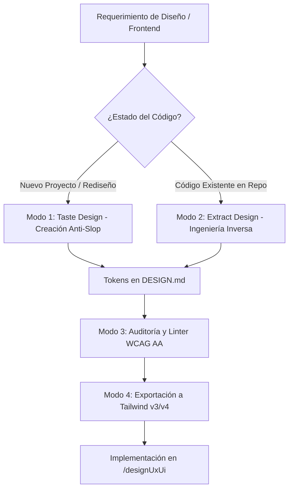

# Suite de Sistemas de Diseño con DESIGN.md

Esta skill proporciona todas las capacidades para crear, gobernar, auditar y transformar sistemas de diseño legibles tanto para agentes de programación como para humanos, garantizando consistencia visual absoluta en `/designUxUi`.

---

## 4 Modos Operativos



---

### Modo 1: Creación Anti-Slop (`taste-design`)
**Cuándo usar:** Al iniciar un nuevo proyecto web, crear un prototipo de alta calidad o definir una identidad visual desde cero.
- **Objetivo:** Evitar las interfaces genéricas y clunky que producen los modelos por defecto.
- **Directivas Clave:**
  - Consulta la guía completa en [references/taste-design-guide.md](references/taste-design-guide.md).
  - Veto estricto a fuentes de IA genéricas (`Inter` queda prohibida en marcas y portfolios; usa `Geist`, `Cabinet Grotesk`, `Outfit`, `Satoshi`).
  - Máximo 1 color de acento principal con saturación < 80%.
  - Cero negro absoluto (`#000000`); usa Zinc-950 (`#09090B`) o Charcoal.
  - Cero clichés de IA (sin emojis en UI, sin gradientes neón violetas, sin métricas falsas de uptime).
- **Plantilla base:** Usar [resources/templates/DESIGN-taste.template.md](resources/templates/DESIGN-taste.template.md).

---

### Modo 2: Extracción de Código Existente (`extract-design-md`)
**Cuándo usar:** Cuando el usuario te pida *"analiza el diseño de este proyecto"*, *"extrae los tokens de este repositorio"* o al recibir un repositorio frontend preexistente (React, Vue, Tailwind, CSS).
- **Objetivo:** Reverse-engineering del sistema visual para no inventar estilos incompatibles con la base existente.
- **Directivas Clave:**
  - Consulta la guía metodológica en [references/extract-code-guide.md](references/extract-code-guide.md).
  - Escanear `tailwind.config.*`, variables CSS (`globals.css`) y componentes en `/src`.
  - Desduplicar variantes de color casi idénticas consolidándolas bajo un único token semántico normativo.
  - Opcionalmente correr el script asistente:
    ```powershell
    python scripts/extract_tokens.py ./src
    ```

---

### Modo 3: Auditoría y Quality Gate (`designmd lint`)
**Cuándo usar:** Antes de aprobar un sistema de diseño o antes de cerrar el Gate 5 en `/designUxUi`.
- En Windows/PowerShell ejecutar:
  ```powershell
  npx.cmd -p @google/design.md designmd lint DESIGN.md
  # o vía script: powershell -ExecutionPolicy Bypass -File "./scripts/validate_design.ps1" -Path "./DESIGN.md"
  ```
- **Condición de éxito:** 0 errores en `broken-ref` y `contrast-ratio` (mínimo 4.5:1 WCAG AA).

---

### Modo 4: Exportación a Frameworks CSS (`export`)
**Cuándo usar:** Para sincronizar automáticamente los tokens con el build de frontend:
- **Tailwind v3 (`tailwind.config.js`):**
  ```powershell
  npx.cmd -p @google/design.md designmd export --format json-tailwind DESIGN.md > tailwind.theme.json
  ```
- **Tailwind v4 (`@theme` con variables CSS):**
  ```powershell
  npx.cmd -p @google/design.md designmd export --format css-tailwind DESIGN.md > theme.css
  ```
- **DTCG W3C (`tokens.json`):**
  ```powershell
  npx.cmd -p @google/design.md designmd export --format dtcg DESIGN.md > tokens.json
  ```

---

## Catálogo de Recursos Disponibles
- **Plantillas en `resources/templates/`:**
  - `DESIGN-taste.template.md`: Editorial, sobria y anti-slop (recomendada para nuevos desarrollos).
  - `DESIGN.template.md`: Equilibrada y completa para SaaS y aplicaciones técnicas.
  - `DESIGN-minimal.template.md`: Compacta para prototipos de una sola página o widgets inline.
  - `DESIGN-theme.template.md`: Paletas coordinadas para modo claro y oscuro.
- **Referencias:**
  - [Guía Taste Design (Principios y 19 Anti-Patrones)](references/taste-design-guide.md)
  - [Guía de Extracción desde Código](references/extract-code-guide.md)
  - [Especificación Técnica de Tokens DESIGN.md](design-tokens-spec.md)
  - [Referencia de CLI @google/design.md](designmd-cli.md)
