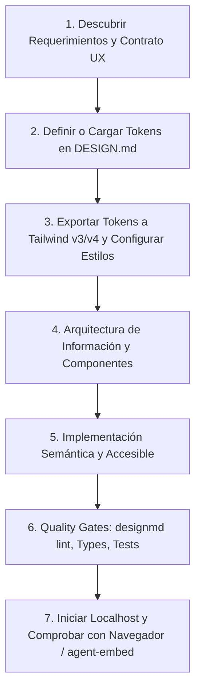

# Diseñar UX/UI y Componentes Generativos (`designUxUi`)

Esta skill proporciona las directivas para convertir requerimientos y contexto de producto en interfaces de usuario funcionales, consistentes y verificables, cubriendo tanto **aplicaciones web completas** (con servidor local y validación en navegador) como **componentes UI interactivos generativos** (widgets autocontenidos en HTML/Tailwind para incrustar en el entorno), gobernados por la especificación abierta de tokens de diseño **`DESIGN.md`**.

---

## 1. Autoridad y Principios de Diseño

- **Fidelidad al contexto**: Trata briefs, especificaciones y capturas como referencias funcionales. Sigue los requerimientos y el stack del proyecto.
- **Solución proporcional**:
  - Para páginas o prototipos rápidos: HTML5 semántico, Tailwind CSS y JavaScript vanilla autocontenido.
  - Para proyectos con toolchain (React, Vue, Angular, Svelte, etc.): respeta routing, design system, componentes y tokens existentes.
  - Para widgets embebidos en el chat: genera un artefacto HTML autocontenido e incrusta vía `<agent-embed src="file:///<path>/widget.html"></agent-embed>`.
- **Accesibilidad y honestidad**:
  - Cumplir base **WCAG 2.2 AA** (contraste mínimo 4.5:1 en texto regular, 3:1 en componentes/texto grande, foco por teclado, etiquetas semánticas).
  - Todas las acciones prometidas en la UI deben ser funcionales (no dejar botones decorativos ni estados rotos).

### 1.1. Capa de Sistema de Diseño y Tokens (`DESIGN.md`)
Todo proyecto frontend debe mantener una única fuente de verdad para su identidad visual en la raíz del repositorio (`DESIGN.md`), combinando especificación de máquina y contexto humano:
1. **Front-matter YAML (Normativo / Máquina):** Declara los valores exactos para `colors`, `typography`, `rounded`, `spacing` y `components`.
2. **Cuerpo Markdown (Razón de ser / Semántica):** Explica la personalidad de la interfaz, el rol de cada color y las pautas de interacción para guiar la toma de decisiones estéticas del agente.

#### Modos de Definición de Tokens:
- **Modo Creación con Buen Gusto (`taste-design`):** En nuevos proyectos, aplica la filosofía de [references/taste-design-guide.md](references/taste-design-guide.md):
  - Veto a la tipografía por defecto de IA (`Inter` prohibida para marcas/portfolios; usa `Geist`, `Outfit`, `Cabinet Grotesk` o `Satoshi`).
  - Máximo 1 acento (saturación < 80%) sobre bases neutras (Zinc/Slate/Charcoal). Cero negro absoluto (`#000000`).
  - Erradica los 19 anti-patrones de IA (sin emojis en UI, sin gradientes neón, sin métricas inventadas, sin 3 tarjetas simétricas).
  - Usar plantilla [resources/templates/DESIGN-taste.template.md](resources/templates/DESIGN-taste.template.md).
- **Modo Extracción desde Código (`extract-design-md`):** En proyectos existentes, no reinventes estilos:
  - Sigue la guía de ingeniería inversa en [references/extract-code-guide.md](references/extract-code-guide.md).
  - Escanea `tailwind.config.*`, variables CSS (`globals.css`) y componentes con `python scripts/extract_tokens.py ./src`.

#### Ciclo de Vida de Tokens y Herramientas (CLI `@google/design.md`):
> [!IMPORTANT]
> En Windows / PowerShell, ejecuta el comando mediante el alias `designmd` (`npx -p @google/design.md designmd ...`) para evitar que Windows colisione el nombre del binario `.md` con la asociación de archivos Markdown.

- **Validación y Quality Gate:**
  ```powershell
  npx -p @google/design.md designmd lint DESIGN.md
  # o vía script: powershell -ExecutionPolicy Bypass -File "./scripts/validate_design.ps1" -Path "./DESIGN.md"
  ```
  Audita referencias rotas (`broken-ref`), ratios de contraste WCAG AA (`contrast-ratio`) y tokens huérfanos.
- **Detección de Regresiones Visuales:**
  ```powershell
  npx -p @google/design.md designmd diff DESIGN.md DESIGN-v2.md
  ```
- **Exportación Automática a Tailwind CSS:**
  - *Tailwind v3 (JSON para `tailwind.config.js`):*
    ```powershell
    npx -p @google/design.md designmd export --format json-tailwind DESIGN.md > tailwind.theme.json
    ```
  - *Tailwind v4 (`@theme` con variables CSS):*
    ```powershell
    npx -p @google/design.md designmd export --format css-tailwind DESIGN.md > theme.css
    ```
  - *W3C Design Tokens (DTCG):*
    ```powershell
    npx -p @google/design.md designmd export --format dtcg DESIGN.md > tokens.json
    ```

---

## 2. UI Generativa y Widgets Interactivos (`generative_ui`)

### 2.1. Reglas y Restricciones de Entorno
* **Tailwind CSS Habilitado**: Utiliza el script allowlisted de Tailwind en la cabecera `<head>`:
  ```html
  <script src="https://www.gstatic.com/antigravity/web/dev/tailwindcss.min.js"></script>
  ```
* **Variables Semánticas de Tema**: Si el proyecto tiene un `DESIGN.md`, deriva las variables de los tokens; en widgets aislados usa las variables del design system del host para soportar modo claro y oscuro:
  - Superficies: `bg-[var(--background)]`, `bg-[var(--card)]`, `bg-[var(--content)]`, `bg-[var(--sidebar)]`
  - Bordes: `border-[var(--border)]`
  - Texto: `text-[var(--foreground)]`, `text-[var(--muted-foreground)]`, `text-[var(--placeholder)]`
  - Acentos: `bg-[var(--primary)] text-[var(--primary-foreground)]`, `bg-[var(--secondary)]`, `bg-[var(--accent)]`
* **Plantilla Base para Widgets**:
  ```html
  <!DOCTYPE html>
  <html lang="es">
  <head>
    <meta charset="UTF-8">
    <script src="https://www.gstatic.com/antigravity/web/dev/tailwindcss.min.js"></script>
  </head>
  <body class="bg-transparent text-[var(--foreground)] antialiased p-4">
    <div class="bg-[var(--card)] text-[var(--foreground)] border border-[var(--border)] rounded-xl p-5 shadow-sm space-y-4">
      <h2 class="text-lg font-semibold text-[var(--foreground)]">Título del Componente</h2>
      <p class="text-sm text-[var(--muted-foreground)]">Descripción o contenido interactivo.</p>
      <!-- Controles y lógica interactiva -->
    </div>
  </body>
  </html>
  ```

### 2.2. Incrustación Inline vs. Artefacto Completo
* **Inline (`<agent-embed>`)**: Para widgets compactos (<500px de alto), controles interactivos o demostraciones inmediatas. Usar siempre `<body class="bg-transparent ...">`.
* **Side-Pane / Standalone**: Para dashboards completos, flujos de múltiples pasos o aplicaciones complejas.

---

## 3. Flujo Operativo de Ingeniería Web (Aplicaciones y Páginas)



### 3.1. Referencias Técnicas
* Consultar [references/taste-design-guide.md](references/taste-design-guide.md) para principios estéticos anti-slop y catálogo de 19 anti-patrones.
* Consultar [references/extract-code-guide.md](references/extract-code-guide.md) para protocolos de ingeniería inversa desde código existente.
* Consultar [references/design-tokens-spec.md](references/design-tokens-spec.md) para el esquema de tokens `DESIGN.md`.
* Consultar [references/designmd-cli.md](references/designmd-cli.md) para uso detallado de `@google/design.md` en Windows.
* Consultar [references/ux-method.md](references/ux-method.md) para diseño de flujos, investigación y decisiones de UX.
* Consultar [references/interface-craft.md](references/interface-craft.md) para layout, responsive, contrastes y accesibilidad.
* Consultar [references/preview-and-runtime.md](references/preview-and-runtime.md) antes de ejecutar servidores o scripts de preview.
* Consultar [references/quality-gates.md](references/quality-gates.md) antes de dar por finalizada una pantalla.

### 3.2. Plantillas de Tokens Rápidas
Encontrarás plantillas listas en `resources/templates/`:
- `DESIGN-taste.template.md`: Plantilla curada anti-slop recomendada para nuevos productos y estética editorial.
- `DESIGN.template.md`: Plantilla completa recomendada para sistemas de diseño y SaaS técnico.
- `DESIGN-minimal.template.md`: Plantilla ligera para prototipos rápidos.
- `DESIGN-theme.template.md`: Plantilla estructurada para proyectos con soporte light/dark.

### 3.3. Servidor de Vista Previa Local
Para servir estáticos de forma rápida sin dependencias pesadas:
```powershell
python scripts/serve_preview.py --port 3000 --directory ./dist
```
Comprobar siempre la respuesta HTTP en loopback antes de confirmar la entrega.

---

## 4. Contrato de Entrega

Al presentar una interfaz o widget:
1. Resumen conciso de la experiencia implementada y ubicación de archivos.
2. Comprobaciones de sistema de diseño: resultado de `designmd lint DESIGN.md` (cero errores de contraste/tokens rotos).
3. Comprobaciones funcionales y UX: viewports responsive probados, navegación por teclado y contraste visual.
4. URL local comprobada o etiqueta `<agent-embed>` cuando corresponda.