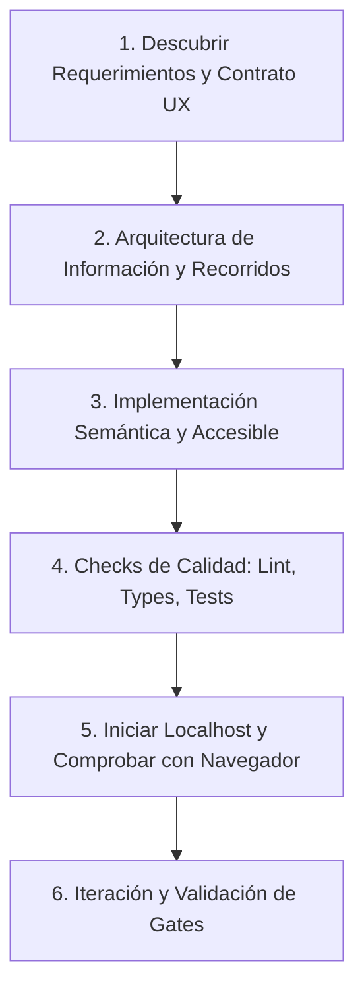

---
name: designUxUi
description: Diseña, implementa, refactoriza y valida interfaces frontend web profesionales y componentes UI generativos (HTML, Tailwind CSS, widgets interactivos inline con <agent-embed> o páginas completas en localhost). Aplica principios de UX/UI, accesibilidad WCAG 2.2 AA, heurísticas de usabilidad y quality gates de ingeniería.
---

# Diseñar UX/UI y Componentes Generativos (`designUxUi`)

Esta skill proporciona las directivas para convertir requerimientos y contexto de producto en interfaces de usuario funcionales, consistentes y verificables, cubriendo tanto **aplicaciones web completas** (con servidor local y validación en navegador) como **componentes UI interactivos generativos** (widgets autocontenidos en HTML/Tailwind para incrustar en el entorno).

---

## 1. Autoridad y Principios de Diseño

- **Fidelidad al contexto**: Trata briefs, especificaciones y capturas como referencias funcionales. Sigue los requerimientos y el stack del proyecto.
- **Solución proporcional**:
  - Para páginas o prototipos rápidos: HTML5 semántico, Tailwind CSS y JavaScript vanilla autocontenido.
  - Para proyectos con toolchain (React, Vue, Angular, Svelte, etc.): respeta routing, design system, componentes y tokens existentes.
  - Para widgets embebidos en el chat: genera un artefacto HTML autocontenido e incrusta vía `<agent-embed src="file:///<path>/widget.html"></agent-embed>`.
- **Accesibilidad y honestidad**:
  - Cumplir base **WCAG 2.2 AA** (contraste, foco por teclado, etiquetas semánticas).
  - Todas las acciones prometidas en la UI deben ser funcionales (no dejar botones decorativos ni estados rotos).

---

## 2. UI Generativa y Widgets Interactivos (`generative_ui`)

### 2.1. Reglas y Restricciones de Entorno
* **Tailwind CSS Habilitado**: Utiliza el script allowlisted de Tailwind en la cabecera `<head>`:
  ```html
  <script src="https://www.gstatic.com/antigravity/web/dev/tailwindcss.min.js"></script>
  ```
* **Variables Semánticas de Tema**: Usa las variables del design system del host en lugar de colores rígidos para soportar modo claro y oscuro:
  - Superficies: `bg-[var(--background)]`, `bg-[var(--card)]`, `bg-[var(--content)]`, `bg-[var(--sidebar)]`
  - Bordes: `border-[var(--border)]`
  - Texto: `text-[var(--foreground)]`, `text-[var(--muted-foreground)]`, `text-[var(--placeholder)]`
  - Acentos: `bg-[var(--primary)] text-[var(--primary-foreground)]`, `bg-[var(--secondary)]`, `bg-[var(--accent)]`
* **Plantilla Base para Widgets**:
  ```html
  <!DOCTYPE html>
  <html lang="es">
  <head>
    <meta charset="UTF-8">
    <script src="https://www.gstatic.com/antigravity/web/dev/tailwindcss.min.js"></script>
  </head>
  <body class="bg-transparent text-[var(--foreground)] antialiased p-4">
    <div class="bg-[var(--card)] text-[var(--foreground)] border border-[var(--border)] rounded-xl p-5 shadow-sm space-y-4">
      <h2 class="text-lg font-semibold text-[var(--foreground)]">Título del Componente</h2>
      <p class="text-sm text-[var(--muted-foreground)]">Descripción o contenido interactivo.</p>
      <!-- Controles y lógica interactiva -->
    </div>
  </body>
  </html>
  ```

### 2.2. Incrustación Inline vs. Artefacto Completo
* **Inline (`<agent-embed>`)**: Para widgets compactos (<500px de alto), controles interactivos o demostraciones inmediatas. Usar siempre `<body class="bg-transparent ...">`.
* **Side-Pane / Standalone**: Para dashboards completos, flujos de múltiples pasos o aplicaciones complejas.

---

## 3. Flujo Operativo de Ingeniería Web (Aplicaciones y Páginas)



### 3.1. Referencias Técnicas
* Consultar [references/ux-method.md](references/ux-method.md) para diseño de flujos, investigación y decisiones de UX.
* Consultar [references/interface-craft.md](references/interface-craft.md) para layout, responsive, contrastes y accesibilidad.
* Consultar [references/preview-and-runtime.md](references/preview-and-runtime.md) antes de ejecutar servidores o scripts de preview.
* Consultar [references/quality-gates.md](references/quality-gates.md) antes de dar por finalizada una pantalla.

### 3.2. Servidor de Vista Previa Local
Para servir estáticos de forma rápida sin dependencias pesadas:
```powershell
python scripts/serve_preview.py --port 3000 --directory ./dist
```
Comprobar siempre la respuesta HTTP en loopback antes de confirmar la entrega.

---

## 4. Contrato de Entrega

Al presentar una interfaz o widget:
1. Resumen conciso de la experiencia implementada y ubicación de archivos.
2. Comprobaciones realizadas (viewports responsive, navegación por teclado, contraste).
3. URL local comprobada o etiqueta `<agent-embed>` cuando corresponda.