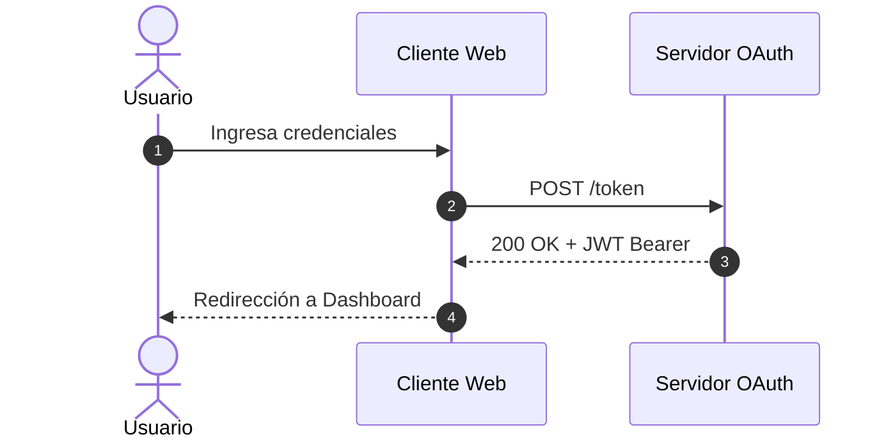

# diagramStudio

Motor integral y unificado de diagramación para el ecosistema de agentes y desarrolladores. Combina las capacidades de generación textual in-line (`Mermaid`) con la autoría, sincronización incremental y publicación visual de diagramas editables (`Draw.io` / `diagrams.net`).

---

## 1. Propósito General

`diagramStudio` resuelve la fragmentación entre diagramas ágiles de consola/chat y diagramas ejecutivos formales. Actúa como el motor gráfico universal del entorno de trabajo, ofreciendo:
- **Previsualización ágil in-line:** Renderizado inmediato en Markdown mediante bloques ```mermaid sin dependencias de software local.
- **Modelado visual editable:** Generación determinista de archivos `.drawio` (XML estándar de diagrams.net) con preservación de layout manual y coordenadas.
- **Sincronización bidireccional y multi-nivel (modo dual):** Entrega simultánea de vista previa rápida y archivo editable para persistencia y publicación formal.
- **Presets de procesos organizacionales:** Plantillas listas para Mapa de Procesos Institucional (3 niveles) y SIPOC Visual.

---

## 2. Arquitectura Interna

```
diagramStudio/
├── SKILL.md                  # Contrato operacional del agente con directivas de activación
├── README.md                 # Documentación técnica para desarrolladores humanos
├── scripts/                  # Herramientas CLI y compiladores geométricos
│   ├── diagramctl.py         # CLI unificada (build, sync, views, test, review, whatif)
│   ├── diagram_ir.py         # Diagram Intermediate Representation (IR) y serializador
│   ├── drawio2mermaid.py     # Conversor de modelos Draw.io a sintaxis Mermaid
│   ├── autolayout.py         # Algoritmos de ordenamiento geométrico automático
│   ├── validate.py           # Validador sintáctico y de conectividad de .drawio
│   └── ... (importers para Python, TS, Terraform, K8s, Docker, SQL, OpenAPI)
├── references/               # Base de conocimiento bajo progressive disclosure
│   ├── presets/              # Plantillas especializadas de procesos
│   │   ├── process-map.md    # Especificación de Mapa de Procesos Institucional
│   │   └── sipoc.md          # Especificación de Diagrama SIPOC Visual
│   ├── mermaid/              # 31 manuales de sintaxis Mermaid (flowchart, C4, sequence, etc.)
│   └── drawio/               # 20 manuales de autoría Draw.io (XML, formas, autolayout, estilos)
├── styles/                   # Presets visuales y paletas de color para Draw.io
└── data/                     # Catálogo de formas e iconos (AWS, Azure, GCP, K8s, etc.)
```

---

## 3. Prerequisitos de Entorno

- **Python:** Python 3.9 o superior (para ejecutar `diagramctl.py` y scripts auxiliares). La mayoría de los comandos centrales usan únicamente la librería estándar de Python (`stdlib`).
- **Draw.io Desktop / CLI (Opcional):** Si se requiere exportación directa a imágenes raster (`.png`) o vectores (`.svg`/`.pdf`) por línea de comandos, se requiere el ejecutable oficial de Diagrams.net (`drawio`). Si no está instalado, la skill genera directamente el archivo XML `.drawio` perfectamente compatible con [app.diagrams.net](https://app.diagrams.net).

---

## 4. Modos de Uso y Ejemplos

### 4.1 Modo Mermaid (`mode: "mermaid"`)
Invocación típica para respuestas conversacionales, PRs o documentación Markdown:
```markdown
### Diagrama de Secuencia de Autenticación

```

### 4.2 Modo Draw.io (`mode: "drawio"`)
Generación de un modelo formal de arquitectura o exportación desde código:
```bash
# Compilar un modelo IR a Draw.io
python3 scripts/diagramctl.py build model.ir.json -o arquitectura.drawio

# Sincronizar un diagrama existente con cambios de infraestructura en Terraform
python3 scripts/diagramctl.py sync arquitectura.drawio ./terraform -o arquitectura.drawio

# Validar integridad estructural
python3 scripts/validate.py arquitectura.drawio --score
```

### 4.3 Modo Dual (`mode: "dual"`)
Genera la respuesta con el bloque ```mermaid visible en la conversación y crea al mismo tiempo el archivo `entrega.drawio` en disco para que el usuario pueda abrirlo en app.diagrams.net.

---

## 5. Especificación de Artefactos de Entrada y Salida

### Entradas (Inputs)
- Solicitudes textuales de diagramas en lenguaje natural.
- Especificaciones de arquitectura de software o modelos de datos.
- Bloques de código fuente (Python, JS/TS, Go, Rust, SQL, Terraform, K8s).
- Fichas de procesos o matrices SIPOC generadas por skills upstream (`bpmnExtractor`, `processWorkbench`).

### Salidas (Outputs)
- **Mermaid:** Bloques ```mermaid formateados, validados y con marcado de clases semánticas.
- **Draw.io:** Archivo XML `.drawio` determinista con IDs únicos, geometrías relativas y paletas de color corporativas.
