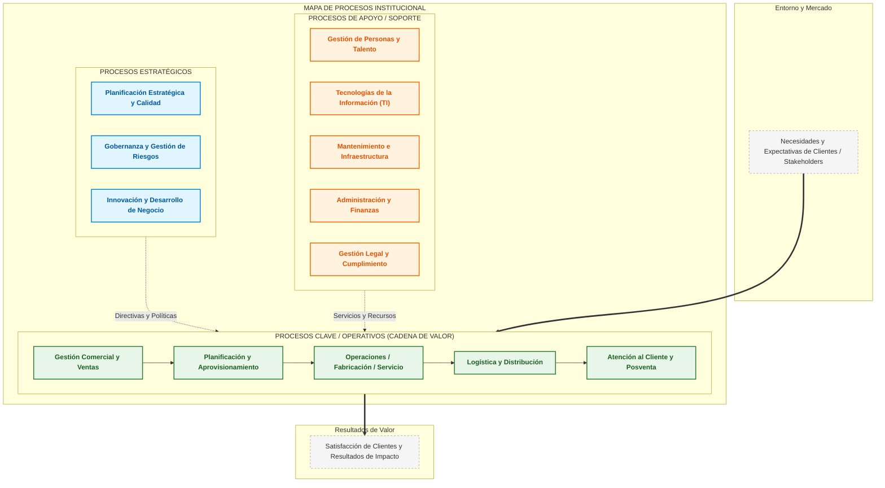

# Preset: Mapa de Procesos Institucional (Institutional Process Map)

El Mapa de Procesos Institucional representa la arquitectura global de procesos de una organización estructurada en los 3 niveles canónicos:
1. **Procesos Estratégicos:** Definen el rumbo, la gobernanza, las políticas, la innovación y el cumplimiento institucional.
2. **Procesos Clave / Operativos (Core):** Transforman insumos de clientes/mercado en productos o servicios entregables de valor añadido (cadena de valor directa).
3. **Procesos de Apoyo / Soporte:** Brindan los recursos y servicios internos (TI, RRHH, Infraestructura, Legal, Compras internas) requeridos por los procesos clave y estratégicos.

---

## 1. Representación en Mermaid (`mode: "mermaid"`)

En Mermaid se modela mediante `flowchart TB` o `flowchart LR` utilizando subgraphs anidados con estilos y clases diferenciadas por nivel.

---

## 2. Representación en Draw.io (`mode: "drawio"`)

En formato nativo `.drawio`, se implementa con:
- 3 swimlanes horizontales o contenedores rectangulares agrupadores:
  - Franja Superior: Estratégicos (estilo azul `fillColor=#E1F5FE;strokeColor=#0288D1`).
  - Franja Central: Operativos/Cadena de Valor con conectores secuenciales (estilo verde `fillColor=#E8F5E9;strokeColor=#2E7D32`).
  - Franja Inferior: Soporte (estilo ámbar/naranja `fillColor=#FFF3E0;strokeColor=#EF6C00`).
- Dos bloques laterales o corchetes:
  - Izquierda: "Requisitos / Expectativas de Clientes y Partes Interesadas".
  - Derecha: "Satisfacción de Clientes y Cumplimiento de Objetivos".
- Conexiones de influencia:
  - Flechas ortogonales punteadas desde Estratégicos hacia Operativos (`dashed=1;strokeColor=#0288D1`).
  - Flechas ortogonales punteadas desde Soporte hacia Operativos (`dashed=1;strokeColor=#EF6C00`).
- Metadatos semánticos en las celdas: `customProperties: { "tier": "strategic|core|support", "processId": "PE-01" }`.
