# Preset: Diagrama SIPOC Visual (Suppliers, Inputs, Process, Outputs, Customers)

El diagrama SIPOC es una herramienta de delimitación de alto nivel que identifica las fronteras, los insumos clave, los resultados y las partes interesadas antes de entrar al modelado detallado de actividades.

---

## 1. Representación en Mermaid (`mode: "mermaid"`)

En Mermaid, se modela preferentemente como un flujo de 5 columnas (`flowchart LR`) con agrupadores visuales o nodos tabulares.

```mermaid
flowchart LR
    %% Columnas SIPOC
    subgraph S ["1. PROVEEDORES (Suppliers)"]
        direction TB
        S1["S1: Proveedores de Materia Prima"]
        S2["S2: Clientes (Solicitantes)"]
        S3["S3: Sistema de Gestión ERP"]
    end

    subgraph I ["2. ENTRADAS (Inputs)"]
        direction TB
        I1["I1: Especificaciones Técnicas"]
        I2["I2: Orden de Compra / Pedido"]
        I3["I3: Lote de Materia Prima"]
    end

    subgraph P ["3. PROCESO (Process - 5 a 7 Macroetapas)"]
        direction TB
        P1["P1: Recepcionar e Inspeccionar"]
        P2["P2: Almacenar en Depósito"]
        P3["P3: Procesar y Acondicionar"]
        P4["P4: Empacar y Rotular"]
        P5["P5: Despachar a Distribución"]
        P1 --> P2 --> P3 --> P4 --> P5
    end

    subgraph O ["4. SALIDAS (Outputs)"]
        direction TB
        O1["O1: Producto Terminado Conforme"]
        O2["O2: Remito de Entrega Firmado"]
        O3["O3: Registro de Trazabilidad y Lote"]
    end

    subgraph C ["5. CLIENTES (Customers)"]
        direction TB
        C1["C1: Cliente Final / Consumidor"]
        C2["C2: Centros de Distribución"]
        C3["C3: Área de Facturación"]
    end

    %% Relaciones de Flujo
    S ==> I
    I ==> P
    P ==> O
    O ==> C

    %% Estilos de Columnas
    classDef sStyle fill:#ede7f6,stroke:#5e35b1,stroke-width:1.5px,color:#311b92;
    classDef iStyle fill:#e3f2fd,stroke:#1e88e5,stroke-width:1.5px,color:#0d47a1;
    classDef pStyle fill:#e8f5e9,stroke:#43a047,stroke-width:2px,color:#1b5e20,font-weight:bold;
    classDef oStyle fill:#fff8e1,stroke:#fbc02d,stroke-width:1.5px,color:#f57f17;
    classDef cStyle fill:#fce4ec,stroke:#d81b60,stroke-width:1.5px,color:#880e4f;

    class S1,S2,S3 sStyle;
    class I1,I2,I3 iStyle;
    class P1,P2,P3,P4,P5 pStyle;
    class O1,O2,O3 oStyle;
    class C1,C2,C3 cStyle;
```

---

## 2. Representación en Draw.io (`mode: "drawio"`)

En Draw.io se construye como:
- Una tabla de 5 columnas iguales distribuidas uniformemente a lo ancho de la página (ancho sugerido por columna: 220px, alto: 600px).
- Cabeceras coloreadas distintivas para cada letra de SIPOC.
- Tarjetas o cajas de texto individuales para cada ítem enumerado (`S1..Sn`, `I1..In`, etc.).
- Macroproceso central con conectores secuenciales dirigidos entre las actividades macro (máximo 5 a 7 bloques para mantener el nivel SIPOC).
- Flechas conectoras de bloque completo entre encabezados de columnas: $S \rightarrow I \rightarrow P \rightarrow O \rightarrow C$.
