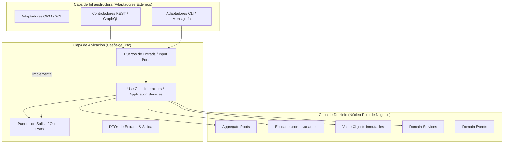
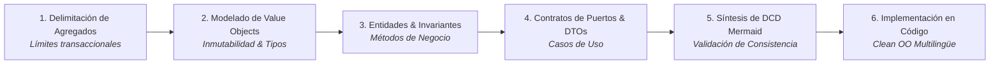
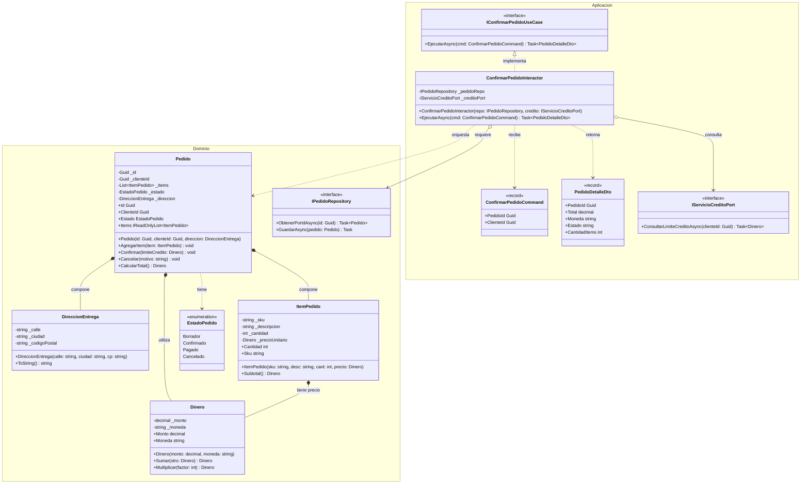

# domainDesign: Guía Maestra de Diseño de Dominio Rico, Arquitectura Limpia y Diagramas de Clases de Diseño (DCD)

Esta skill proporciona los fundamentos conceptuales, arquitectónicos y metodológicos para transformar requerimientos de negocio y Modelos de Dominio Conceptuales (MDD de ASI) en **Diagramas de Clases de Diseño (DCD)** rigurosos y en **código orientado a objetos de producción**, estructurado bajo los principios de **Domain-Driven Design (DDD Táctico)** y **Arquitectura Limpia / Hexagonal (Ports & Adapters)**.

---

## 1. Fundamentos y Reglas de Oro del Diseño de Dominio en POO

El diseño orientado a objetos en el backend debe garantizar que la lógica de negocio resida en el corazón del sistema, protegida de los detalles de infraestructura, bases de datos o frameworks web.



### Reglas de Oro:
1. **Regla de Dependencia Estricta (*The Dependency Rule*)**: Las dependencias en el código solo deben apuntar hacia adentro. La capa de Dominio no conoce a la capa de Aplicación ni a la de Infraestructura; la capa de Aplicación no conoce detalles de librerías web ni de persistencia concreta.
2. **Erradicación del Modelo Anémico (*Anemic Domain Model*)**: Las entidades no son simples bolsas de datos con `getters` y `setters` públicos. Toda entidad debe encapsular su estado, validar sus invariantes en el constructor y exponer métodos con significado de negocio en el lenguaje ubicuo (ej. `confirmarPago()`, `cancelarConReembolso()`, `aplicarDescuento()`).
3. **Inmutabilidad y Auto-validación en *Value Objects***: Cualquier concepto sin identidad conceptual propia cuyo significado dependa de sus atributos (ej. `Dinero`, `Email`, `CUIT`, `Direccion`, `RangoFechas`) debe modelarse como un objeto inmutable que valide sus restricciones en el momento de su instanciación.
4. **Desacoplamiento Mediante Puertos y DTOs**: La frontera de la aplicación se comunica exclusivamente mediante *Data Transfer Objects* (DTOs) inmutables y Puertos (interfaces). Jamás se debe exponer una entidad de dominio directamente a un endpoint HTTP o recibirla sin validación desde un payload JSON.
5. **Inyección de Dependencias por Constructor**: Todas las dependencias requeridas por servicios o casos de uso deben ser explícitas e inyectadas a través del constructor, evitando el uso de `new` para instanciar colaboradores de servicio y facilitando el testing unitario con dobles de prueba.

---

## 2. Anatomía de los Componentes de Dominio en POO

### 2.1. Entidades vs. Value Objects vs. Agregados

| Dimensión | Entidad (*Entity*) | Objeto de Valor (*Value Object*) | Raíz de Agregado (*Aggregate Root*) |
| :--- | :--- | :--- | :--- |
| **Identidad** | Posee un identificador único persistente (ID/UUID) que la distingue incluso si sus atributos cambian. | Carece de ID propio. Dos instancias con idénticos atributos son intercambiables y conceptualmente iguales. | Entidad principal que define el límite de consistencia transaccional del agregado. |
| **Mutabilidad** | Mutable de forma controlada a través de métodos de negocio explícitos. | **Estrictamente Inmutable**. Cualquier modificación genera una nueva instancia. | Controla y encapsula el acceso y mutación de todas las entidades internas del agregado. |
| **Igualdad** | Basada en su Identificador (`entityA.Id == entityB.Id`). | Basada en la comparación estructural de todos sus valores (`voA.Equals(voB)`). | Basada en su Identificador raíz. |
| **Ciclo de Vida** | Persiste a lo largo del tiempo, atravesando diversos estados de negocio. | Depende del ciclo de vida de la entidad que lo contiene o se crea efímeramente. | Punto único de entrada para la carga y persistencia en repositorios. |
| **Ejemplos** | `Cliente`, `Pedido`, `Factura`, `Turno`. | `Dinero(monto, moneda)`, `Email(valor)`, `Coordenada(lat, lon)`, `RangoFechas(desde, hasta)`. | `Pedido` (que encapsula sus `ItemPedido`), `Factura` (con sus `DetalleFactura`). |

---

### 2.2. Patrones de Diseño de Value Objects en Código Limpio

Un *Value Object* bien diseñado en POO debe cumplir tres propiedades invariantes:
1. **Inmutabilidad Absoluta**: Campos de solo lectura (`readonly` en C#, `final` en Java, propiedades sin setters en TS/Python).
2. **Auto-validación en Creación**: Lanza excepciones de dominio si los argumentos son inválidos.
3. **Operaciones Cerradas**: Operaciones que retornan un nuevo Value Object sin alterar el actual.

```csharp
// Ejemplo Canónico de Value Object en C# (.NET)
public sealed record Dinero
{
    public decimal Monto { get; }
    public string Moneda { get; }

    public Dinero(decimal monto, string moneda)
    {
        if (monto < 0)
            throw new ReglaDominioException("El monto no puede ser negativo.");
        if (string.IsNullOrWhiteSpace(moneda) || moneda.Trim().Length != 3)
            throw new ReglaDominioException("El código de moneda ISO debe contener exactamente 3 caracteres.");

        Monto = Math.Round(monto, 2);
        Moneda = moneda.Trim().ToUpperInvariant();
    }

    public static Dinero Cero(string moneda) => new(0m, moneda);

    public Dinero Sumar(Dinero otro)
    {
        ArgumentNullException.ThrowIfNull(otro);
        if (Moneda != otro.Moneda)
            throw new ReglaDominioException($"No se pueden sumar monedas disímiles: {Moneda} y {otro.Moneda}.");

        return new Dinero(Monto + otro.Monto, Moneda);
    }
}
```

```java
// Ejemplo Canónico de Value Object en Java
public record Dinero(BigDecimal monto, String moneda) {
    public Dinero {
        Objects.requireNonNull(monto, "El monto no puede ser nulo.");
        Objects.requireNonNull(moneda, "La moneda no puede ser nula.");
        if (monto.compareTo(BigDecimal.ZERO) < 0) {
            throw new ReglaDominioException("El monto no puede ser negativo.");
        }
        if (moneda.trim().length() != 3) {
            throw new ReglaDominioException("El código de moneda ISO debe contener 3 letras.");
        }
        monto = monto.setScale(2, RoundingMode.HALF_UP);
        moneda = moneda.trim().toUpperCase();
    }

    public Dinero sumar(Dinero otro) {
        Objects.requireNonNull(otro);
        if (!this.moneda.equals(otro.moneda())) {
            throw new ReglaDominioException("Incompatibilidad de monedas: " + this.moneda + " y " + otro.moneda());
        }
        return new Dinero(this.monto.add(otro.monto()), this.moneda);
    }
}
```

```typescript
// Ejemplo Canónico de Value Object en TypeScript
export class Dinero {
  private readonly _monto: number;
  private readonly _moneda: string;

  constructor(monto: number, moneda: string) {
    if (monto < 0) {
      throw new Error("El monto no puede ser negativo.");
    }
    if (!moneda || moneda.trim().length !== 3) {
      throw new Error("El código de moneda ISO debe tener 3 caracteres.");
    }
    this._monto = Math.round(monto * 100) / 100;
    this._moneda = moneda.trim().toUpperCase();
  }

  get monto(): number { return this._monto; }
  get moneda(): string { return this._moneda; }

  sumar(otro: Dinero): Dinero {
    if (this._moneda !== otro.moneda) {
      throw new Error(`Incompatibilidad de monedas: ${this._moneda} y ${otro.moneda}`);
    }
    return new Dinero(this._monto + otro.monto, this._moneda);
  }

  equals(otro: Dinero): boolean {
    return this._monto === otro.monto && this._moneda === otro.moneda;
  }
}
```

---

## 3. Del Modelo Conceptual al Diagrama de Clases de Diseño (DCD)

En el ciclo metodológico, el **Modelo de Dominio Conceptual (MDD)** de Análisis de Sistemas evoluciona hacia el **Diagrama de Clases de Diseño (DCD)** en Diseño de Sistemas:

```mermaid
flowchart LR
    MDD["Modelo de Dominio (MDD)<br/><i>Análisis - ASI</i><br/>• Entidades conceptuales<br/>• Sin visibilidad ni tipos técnicos<br/>• Sin métodos de infraestructura"] 
    -->|Enriquecimiento de Diseño| 
    DCD["Diagrama de Clases de Diseño (DCD)<br/><i>Diseño - DSI</i><br/>• Visibilidad (+, -, #)<br/>• Firmas tipadas completas<br/>• Value Objects & DTOs<br/>• Puertos, Casos de Uso & Repositorios"]
    -->|Implementación|
    SRC["Código Limpio Backend<br/><i>POO Producción</i><br/>• Inyección de dependencias<br/>• Encapsulamiento de invariantes<br/>• Clases desacopladas"]
```

### 3.1. Especificación Formal de Elementos en el DCD

1. **Visibilidad Explícita en Atributos y Métodos**:
   - `+` Público (*Public*): Interfaces de casos de uso, métodos de negocio del agregado, métodos de consulta.
   - `-` Privado (*Private*): Atributos de estado, colecciones internas mutables, métodos auxiliares de validación.
   - `#` Protegido (*Protected*): Constructores de entidades cuando se use el patrón Factory o persistencia ORM.
2. **Navegabilidad y Tipos de Relación**:
   - **Composición Fuerte (`*--`)**: Exclusiva para entidades internas de un agregado (ej. `Pedido *-- ItemPedido`). La eliminación de la raíz destruye sus partes.
   - **Agregación Débil (`o--`)**: Para vínculos entre agregados independientes referenciados por ID o puntero de interfaz.
   - **Dependencia de Uso (`..>`)**: Casos de uso interactuando con DTOs o fábricas.
   - **Realización / Implementación (`..|>`)**: Adaptadores de persistencia implementando puertos de repositorio.

---

## 4. Matriz de Diagnóstico: Olores de Dominio y Refactorización

| Code Smell / Síntoma en Código | Principio Violado | Patrón / Refactorización Recomendada | Resultado en Arquitectura |
| :--- | :--- | :--- | :--- |
| **Anemic Domain Model** (Clase con 15 getters y setters públicos sin lógica; los servicios externos alteran su estado libremente). | **Information Expert**, **Encapsulation**, **Tell Don't Ask** | **Rich Domain Entity**: Privar setters, crear constructores que exijan parámetros obligatorios y crear métodos de negocio con nombres del lenguaje ubicuo. | La entidad protege sus invariantes y no puede quedar en estado corrupto. |
| **Primitive Obsession** (`string email`, `decimal saldo`, `string cuit` pasados por todos lados sin control de formato). | **Single Responsibility (SRP)**, **Type Safety** | **Value Object**: Encapsular el dato en un objeto inmutable con auto-validación (`Email`, `Dinero`, `Cuit`). | Validación centralizada una sola vez en el constructor; erradicación de chequeos duplicados. |
| **Leaky Framework Coupling** (Anotaciones de Spring, Jackson, Entity Framework o Prisma en el núcleo de la entidad de negocio). | **Dependency Inversion (DIP)**, **Clean Architecture** | **Domain Isolation**: Mantener las clases del dominio libres de dependencias de infraestructura; usar DTOs y Mappers en los adaptadores. | El dominio se vuelve 100% testeable sin levantar bases de datos ni contenedores de framework. |
| **Fat Controller / Smart UI** (Los controladores web validan negocio, calculan totales, abren transacciones y ejecutan SQL). | **Separation of Concerns (SoC)**, **SRP** | **Application Service / Use Case Interactor**: El controlador solo parsea la petición, invoca el caso de uso y retorna el DTO resultado. | Controladores ultra delgados (*Skinny Controllers*), lógica reutilizable desde CLI o colas. |
| **Direct Entity Exposure** (Endpoints REST devuelven directamente entidades de base de datos / dominio serializadas a JSON). | **Information Hiding**, **Security** | **Data Transfer Object (DTO) & Mapper**: Proyectar solo los campos que la interfaz o cliente requiere. | Evita fugas de datos confidenciales (*over-fetching*) y ciclos de serialización infinita. |
| **Constructor Telescópico** (Constructores sobrecargados con 8+ parámetros opcionales difíciles de leer). | **Readability**, **KISS** | **Builder Pattern** o **Métodos de Fábrica Estáticos Semánticos** (`Pedido.crearNuevo(...)`). | Instanciación legible, inmutable y libre de ambigüedades temporales. |

---

## 5. Metodología de Diseño Paso a Paso (Protocolo de 6 Fases)



1. **Fase 1: Delimitación de Agregados y Raíces**:
   - Identificar los límites de consistencia transaccional. ¿Qué objetos deben modificarse juntos para garantizar la validez del negocio? Seleccionar la Raíz del Agregado (*Aggregate Root*).
2. **Fase 2: Identificación y Modelado de Value Objects**:
   - Sustituir tipos primitivos por *Value Objects* inmutables que encapsulen formato, reglas de rango y operaciones cerradas.
3. **Fase 3: Diseño de Entidades con Invariantes**:
   - Ocultar la estructura interna de las entidades. Asegurar que las mutaciones de estado se realicen a través de métodos de intención manifiesta (*Intention-Revealing Interfaces*).
4. **Fase 4: Diseño de Casos de Uso (Puertos de Entrada/Salida y DTOs)**:
   - Diseñar la interfaz del Caso de Uso (`IConfirmarPedidoUseCase`).
   - Diseñar los DTOs inmutables de entrada y salida (`ConfirmarPedidoRequest`, `PedidoResponseDto`).
   - Definir los Puertos Secundarios necesarios (ej. `IPedidoRepository`, `INotificadorCliente`).
5. **Fase 5: Síntesis del Diagrama de Clases de Diseño (DCD) en Mermaid**:
   - Generar el diagrama formal con visibilidad, tipos, multiplicidades y dependencias por capas.
6. **Fase 6: Implementación Limpia de Producción**:
   - Codificar las clases respetando la inyección de dependencias por constructor y verificando la ausencia de dependencias externas en el núcleo de dominio.

---

## 6. Caso de Estudio Práctico Exhaustivo: Sistema de Gestión de Pedidos y Envíos

### 6.1. Contexto del Problema
Una empresa de comercio electrónico requiere gestionar pedidos corporativos. Un `Pedido` contiene múltiples `ItemPedido`, un `ClienteId` y una `DireccionEntrega`. El pedido puede encontrarse en estados: *Borrador*, *Confirmado*, *Pagado* o *Cancelado*.
- **Invariante 1**: No se puede confirmar un pedido sin ítems o cuyo total supere el límite de crédito del cliente.
- **Invariante 2**: Una vez confirmado, no pueden alterarse sus productos.
- **Invariante 3**: Los cálculos de totales y descuentos deben operar mediante el Value Object `Dinero` para evitar errores de coma flotante.

---

### 6.2. Diagrama de Clases de Diseño (DCD) en Mermaid



---

### 6.3. Implementación Limpia de Producción (Ejemplo C# / .NET)

```csharp
namespace Backend.Dominio;

// =========================================================================
// 1. Value Objects
// =========================================================================
public sealed record Dinero(decimal Monto, string Moneda)
{
    public Dinero
    {
        if (Monto < 0)
            throw new ArgumentOutOfRangeException(nameof(Monto), "El monto no puede ser negativo.");
        if (string.IsNullOrWhiteSpace(Moneda) || Moneda.Trim().Length != 3)
            throw new ArgumentException("El código de moneda debe tener exactamente 3 caracteres.", nameof(Moneda));

        Monto = Math.Round(Monto, 2);
        Moneda = Moneda.Trim().ToUpperInvariant();
    }

    public static Dinero Cero(string moneda) => new(0m, moneda);

    public Dinero Sumar(Dinero otro)
    {
        ArgumentNullException.ThrowIfNull(otro);
        if (Moneda != otro.Moneda)
            throw new InvalidOperationException($"Incompatibilidad de monedas: {Moneda} vs {otro.Moneda}.");

        return new Dinero(Monto + otro.Monto, Moneda);
    }

    public Dinero Multiplicar(int factor)
    {
        if (factor < 0)
            throw new ArgumentOutOfRangeException(nameof(factor), "El factor no puede ser negativo.");
        return new Dinero(Monto * factor, Moneda);
    }

    public bool EsMayorQue(Dinero otro)
    {
        ArgumentNullException.ThrowIfNull(otro);
        if (Moneda != otro.Moneda)
            throw new InvalidOperationException("No se pueden comparar importes de monedas distintas.");
        return Monto > otro.Monto;
    }
}

public sealed record DireccionEntrega(string Calle, string Ciudad, string CodigoPostal);

public enum EstadoPedido
{
    Borrador,
    Confirmado,
    Pagado,
    Cancelado
}

// =========================================================================
// 2. Entidad Interna del Agregado
// =========================================================================
public sealed class ItemPedido
{
    public string Sku { get; }
    public string Descripcion { get; }
    public int Cantidad { get; }
    public Dinero PrecioUnitario { get; }

    public ItemPedido(string sku, string descripcion, int cantidad, Dinero precioUnitario)
    {
        if (string.IsNullOrWhiteSpace(sku))
            throw new ArgumentException("El SKU es obligatorio.", nameof(sku));
        if (string.IsNullOrWhiteSpace(descripcion))
            throw new ArgumentException("La descripción es obligatoria.", nameof(descripcion));
        if (cantidad <= 0)
            throw new ArgumentOutOfRangeException(nameof(cantidad), "La cantidad debe ser mayor a cero.");

        Sku = sku.Trim().ToUpperInvariant();
        Descripcion = descripcion.Trim();
        Cantidad = cantidad;
        PrecioUnitario = precioUnitario ?? throw new ArgumentNullException(nameof(precioUnitario));
    }

    public Dinero Subtotal() => PrecioUnitario.Multiplicar(Cantidad);
}

// =========================================================================
// 3. Raíz del Agregado (Aggregate Root)
// =========================================================================
public sealed class Pedido
{
    private readonly List<ItemPedido> _items = [];

    public Guid Id { get; }
    public Guid ClienteId { get; }
    public DireccionEntrega Direccion { get; }
    public EstadoPedido Estado { get; private set; }
    public IReadOnlyList<ItemPedido> Items => _items.AsReadOnly();

    public Pedido(Guid id, Guid clienteId, DireccionEntrega direccion)
    {
        if (id == Guid.Empty) throw new ArgumentException("Id de pedido inválido.", nameof(id));
        if (clienteId == Guid.Empty) throw new ArgumentException("Id de cliente inválido.", nameof(clienteId));

        Id = id;
        ClienteId = clienteId;
        Direccion = direccion ?? throw new ArgumentNullException(nameof(direccion));
        Estado = EstadoPedido.Borrador;
    }

    public void AgregarItem(ItemPedido item)
    {
        ArgumentNullException.ThrowIfNull(item);
        if (Estado != EstadoPedido.Borrador)
            throw new InvalidOperationException("Solo se pueden añadir ítems a un pedido en estado Borrador.");

        _items.Add(item);
    }

    public Dinero CalcularTotal()
    {
        if (_items.Count == 0)
            return Dinero.Cero("ARS");

        string monedaBase = _items[0].PrecioUnitario.Moneda;
        Dinero total = Dinero.Cero(monedaBase);

        foreach (var item in _items)
        {
            total = total.Sumar(item.Subtotal());
        }

        return total;
    }

    public void Confirmar(Dinero limiteCredito)
    {
        ArgumentNullException.ThrowIfNull(limiteCredito);
        if (Estado != EstadoPedido.Borrador)
            throw new InvalidOperationException($"No se puede confirmar un pedido en estado {Estado}.");
        if (_items.Count == 0)
            throw new InvalidOperationException("No se puede confirmar un pedido sin ítems.");

        var total = CalcularTotal();
        if (total.EsMayorQue(limiteCredito))
            throw new InvalidOperationException($"El importe total ({total.Monto} {total.Moneda}) excede el límite de crédito disponible ({limiteCredito.Monto} {limiteCredito.Moneda}).");

        Estado = EstadoPedido.Confirmado;
    }

    public void Cancelar(string motivo)
    {
        if (string.IsNullOrWhiteSpace(motivo))
            throw new ArgumentException("El motivo de cancelación es obligatorio.", nameof(motivo));
        if (Estado == EstadoPedido.Cancelado)
            throw new InvalidOperationException("El pedido ya se encuentra cancelado.");

        Estado = EstadoPedido.Cancelado;
    }
}

// =========================================================================
// 4. Puertos Secundarios (Outbound Ports)
// =========================================================================
public interface IPedidoRepository
{
    Task<Pedido?> ObtenerPorIdAsync(Guid id, CancellationToken ct = default);
    Task GuardarAsync(Pedido pedido, CancellationToken ct = default);
}

public interface IServicioCreditoPort
{
    Task<Dinero> ConsultarLimiteCreditoAsync(Guid clienteId, CancellationToken ct = default);
}

// =========================================================================
// 5. Casos de Uso (Application Layer)
// =========================================================================
namespace Backend.Aplicacion;

using Backend.Dominio;

public sealed record ConfirmarPedidoCommand(Guid PedidoId, Guid ClienteId);

public sealed record PedidoDetalleDto(
    Guid PedidoId,
    decimal Total,
    string Moneda,
    string Estado,
    int CantidadItems
);

public interface IConfirmarPedidoUseCase
{
    Task<PedidoDetalleDto> EjecutarAsync(ConfirmarPedidoCommand comando, CancellationToken ct = default);
}

public sealed class ConfirmarPedidoInteractor : IConfirmarPedidoUseCase
{
    private readonly IPedidoRepository _pedidoRepo;
    private readonly IServicioCreditoPort _creditoPort;

    public ConfirmarPedidoInteractor(IPedidoRepository pedidoRepo, IServicioCreditoPort creditoPort)
    {
        _pedidoRepo = pedidoRepo ?? throw new ArgumentNullException(nameof(pedidoRepo));
        _creditoPort = creditoPort ?? throw new ArgumentNullException(nameof(creditoPort));
    }

    public async Task<PedidoDetalleDto> EjecutarAsync(ConfirmarPedidoCommand comando, CancellationToken ct = default)
    {
        ArgumentNullException.ThrowIfNull(comando);

        var pedido = await _pedidoRepo.ObtenerPorIdAsync(comando.PedidoId, ct)
            ?? throw new KeyNotFoundException($"No existe un pedido con ID '{comando.PedidoId}'.");

        if (pedido.ClienteId != comando.ClienteId)
            throw new UnauthorizedAccessException("El pedido no pertenece al cliente especificado.");

        var limiteCredito = await _creditoPort.ConsultarLimiteCreditoAsync(comando.ClienteId, ct);

        // El caso de uso orquesta, la entidad ejecuta la lógica de negocio
        pedido.Confirmar(limiteCredito);

        await _pedidoRepo.GuardarAsync(pedido, ct);

        var total = pedido.CalcularTotal();
        return new PedidoDetalleDto(
            PedidoId: pedido.Id,
            Total: total.Monto,
            Moneda: total.Moneda,
            Estado: pedido.Estado.ToString(),
            CantidadItems: pedido.Items.Count
        );
    }
}
```

---

## 7. Verificación de Consistencia Cruzada con el Repositorio

Al diseñar con `domainDesign`:
1. **Consistencia con `graspSequenceRealizer`**: Los métodos invocados en los Diagramas de Secuencia (DSD) deben coincidir exactamente con las operaciones modeladas en el DCD.
2. **Consistencia con `umlConsistency`**: Las navegabilidades, firmas de métodos y multiplicidades deben satisfacer las 5 reglas canónicas del linter UML.
3. **Consistencia con `relationalObjectMap` / `ormMaster`**: Las raíces de agregado y entidades identificadas en `domainDesign` serán las unidades de mapeo hacia tablas relacionales o mapeos de ORM.
