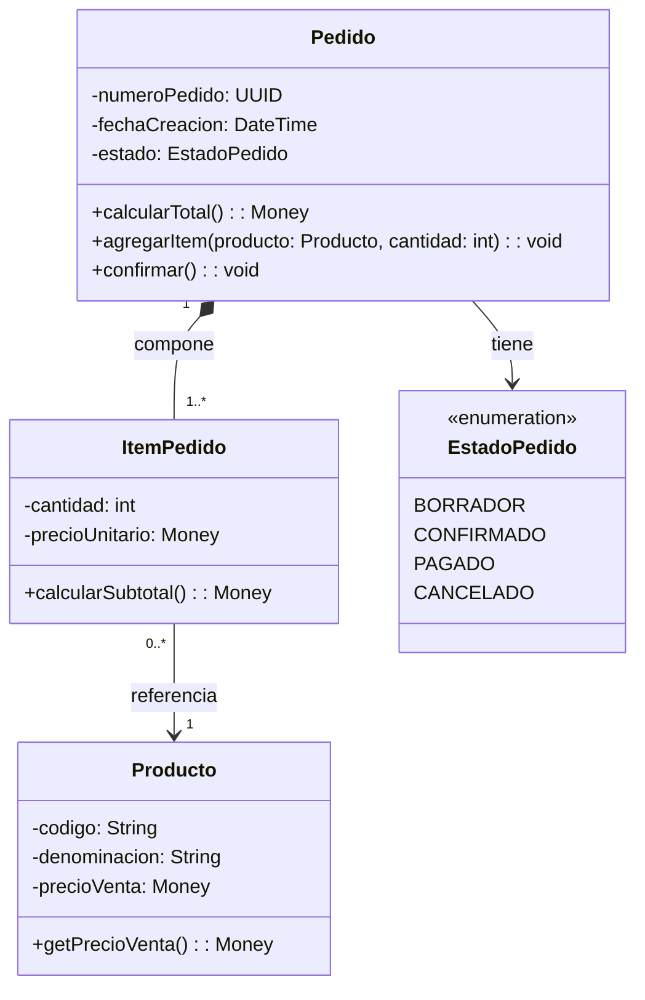

# Especificación del Diagrama de Clases de Diseño (DCD)

**Caso de Uso / Capacidad:** {{NOMBRE_CASO_USO_O_CAPACIDAD}}  
**Modo de Trabajo:** `course-dcd` (Cátedra DSI/PPAI) / `rich-domain` (DDD Táctico) / `implementation`  
**Artefactos Fuente Upstream:** {{RCU_O_CONTRATO_ORIGEN}}  
**Fecha:** {{FECHA}}  

---

## 1. Alcance, Supuestos y Decisiones Previas
- **Alcance Funcional:** {{Descripción de los límites del diseño abordado}}.
- **Supuestos Técnicos / Negocio:** {{Decisiones de diseño asumidas ante vacíos de especificación}}.
- **Decisiones Pendientes (TBD):** {{Aspectos pendientes de definición con el equipo o usuario}}.

---

## 2. Matriz de Trazabilidad RCU $\to$ DCD
| Paso RCU | Mensaje / Operación en Secuencia | Clase Receptora en DCD | Responsabilidad GRASP / GoF | Visibilidad |
|---|---|---|---|:---:|
| Paso 3 | `buscarProducto(codigo)` | `CatalogoProductos` | Experto en Información | `+` (Público) |
| Paso 5 | `calcularSubtotal()` | `ItemPedido` | Experto en Información | `+` (Público) |
| Paso 7 | `crearItem(producto, cant)` | `Pedido` | Creador | `+` (Público) |

---

## 3. Diagrama de Clases de Diseño (Mermaid)

---

## 4. Fichas Técnicas de Clases de Diseño (Design Cards)

### Ficha: `{{NombreClase}}`
- **Estereotipo / Capa:** `<<entity>>` / `<<control>>` / `<<boundary>>` / Dominio / Servicio
- **Propósito:** {{Descripción sucinta de la responsabilidad principal de la clase}}.
- **Atributos y Tipado:**
  - `- id: UUID`: Identificador único inmutable.
  - `- estado: EnumEstado`: Estado del ciclo de vida.
- **Operaciones y Firmas:**
  - `+ operar(parametro: Tipo): Retorno`: {{Descripción del algoritmo, validaciones e invariantes mantenidos}}.
- **Responsabilidades GRASP Asignadas:** {{Experto / Creador / Controlador / Fabricación Pura}}.
- **Precondiciones:** {{Condiciones necesarias para ejecutar sus métodos}}.
- **Postcondiciones:** {{Efectos observables y estado modificado}}.

---

## 5. Checklist de Verificación de Consistencia
- [ ] ¿Todo mensaje dirigido a esta clase en el DSD/RCU existe como método público con la misma firma en el DCD?
- [ ] ¿Toda relación de agregación o composición cuenta con multiplicidades coherentes en ambos extremos?
- [ ] ¿Los métodos mutadores garantizan la protección de invariantes del negocio (*Tell Don't Ask*)?
