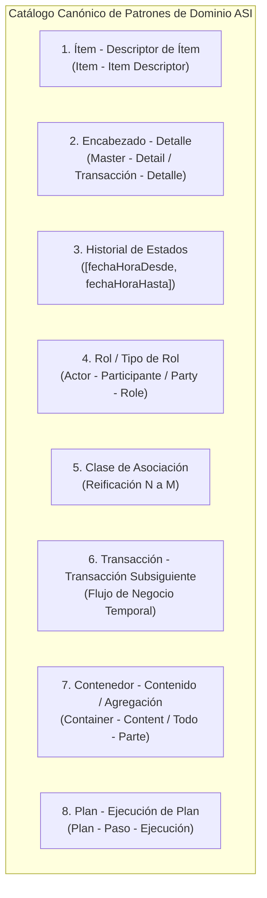
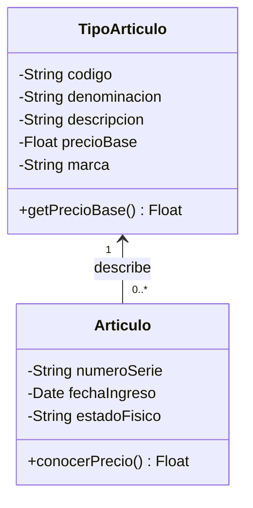
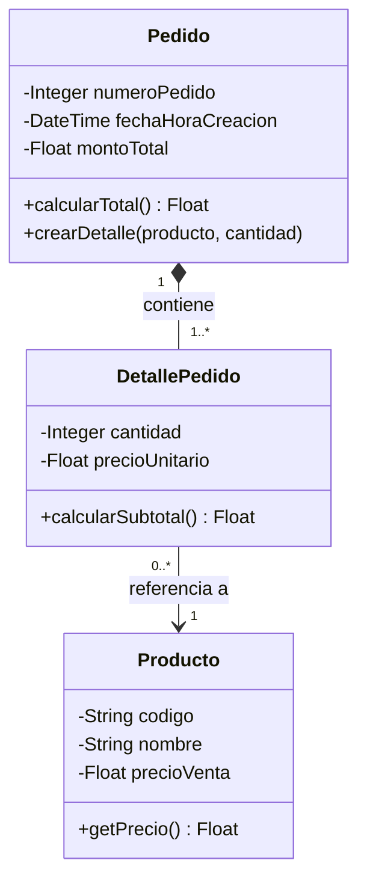
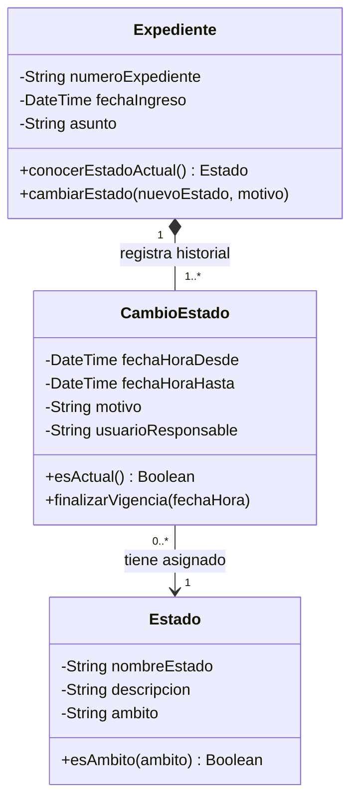
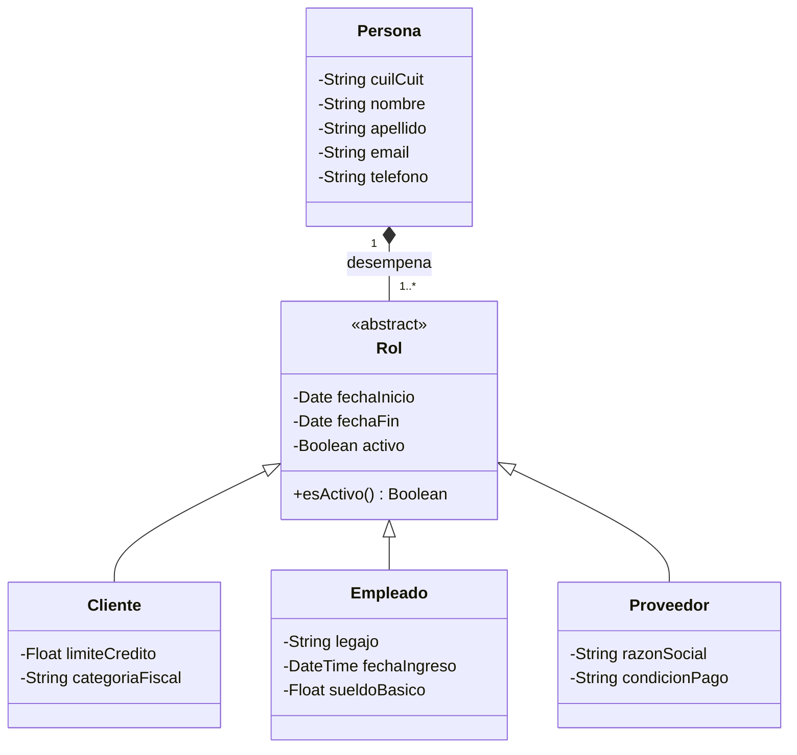
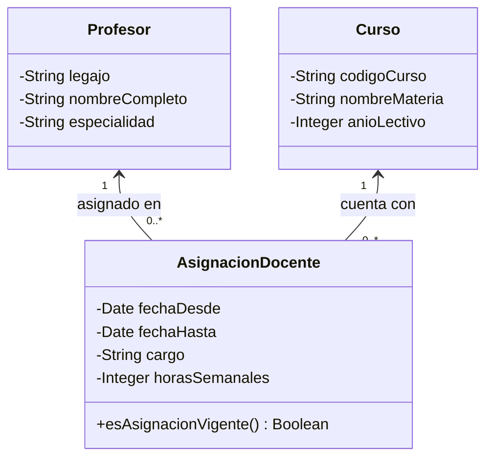
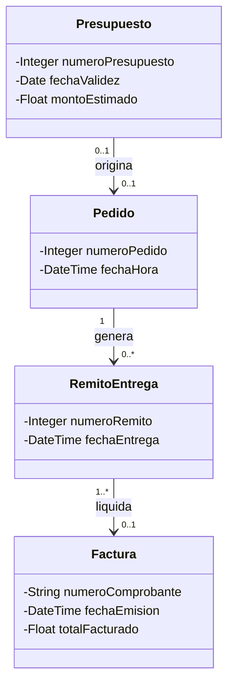
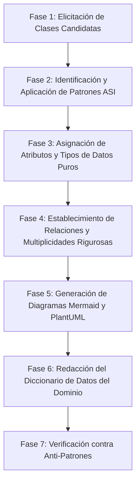
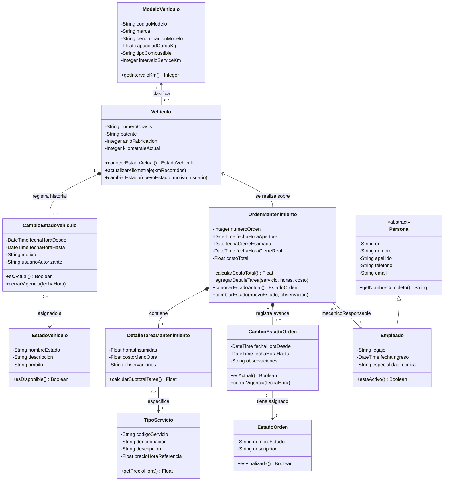
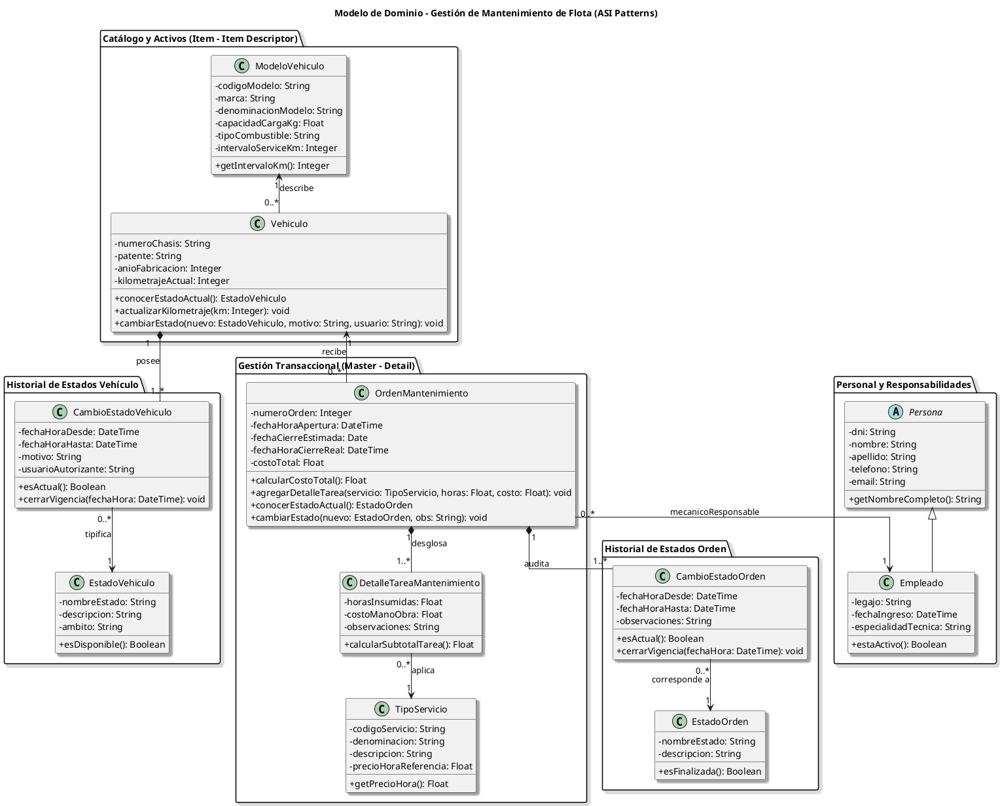

---
name: domainModelGen
description: >-
  Genera modelos de dominio conceptuales en UML (Mermaid classDiagram y PlantUML) aplicando rigurosamente
  los patrones canónicos de dominio de ASI (Ítem-Descriptor, Encabezado-Detalle / Maestro-Detalle,
  Historial de Estados con vigencia temporal [fechaHoraDesde, fechaHoraHasta], Rol / Tipo de Rol,
  Clases de Asociación, Agregaciones y Transacciones Subsiguientes). Incluye extracción sistemática de
  clases, atributos con tipos de datos, multiplicidades exactas, Diccionario de Datos del Dominio y validación de anti-patrones.
---

# domainModelGeneratorWithPatterns

Esta skill proporciona una metodología rigurosa, sistemática y formal para transformar requerimientos de negocio, narrativas de procesos, entrevistas o especificaciones funcionales en **Modelos de Dominio Conceptuales** de alta fidelidad, utilizando la notación estándar UML 2.0 y aplicando el catálogo canónico de **Patrones de Dominio de Análisis de Sistemas de Información (ASI)**.

---

## 1. Fundamentos y Reglas de Oro del Modelo de Dominio (MDD)

Un **Modelo de Dominio (MDD)** representa las clases conceptuales y objetos del mundo real significativos para el negocio, sus atributos esenciales y las relaciones que mantienen entre sí. No es un modelo de datos relacional (DER) ni un diseño de clases de software/arquitectura (UI, Controladores, DAOs, DTOs).

### Reglas de Oro:
1. **Nivel Conceptual Puro**: Solo incluir entidades del dominio del problema del negocio. Prohibido incluir clases de infraestructura (`DatabaseConnection`, `JwtService`), controladores (`OrderController`), vistas (`OrderViewForm`) o DTOs.
2. **Prohibición de Claves Foráneas como Atributos**: En el paradigma orientado a objetos, las relaciones entre clases se modelan mediante **asociaciones, agregaciones o composiciones**, **NUNCA** como atributos de tipo identificador foráneo (ej. `id_cliente: Integer` o `cod_producto: String` dentro de `Pedido` es un anti-patrón grave).
3. **Multiplicidades Explícitas y Precisas**: Todo extremo de asociación debe llevar su multiplicidad explícita: `1`, `0..1`, `1..*`, `*` (o `0..*`). Deben evaluarse y verificarse en ambos sentidos de la relación.
4. **Semántica de Relaciones Estricta**:
   - **Asociación Simple (`-->` / `--`)**: Conexión estructural o conocimiento entre objetos.
   - **Agregación (`o--`)**: Relación "todo-parte" débil o ensamblado donde las partes tienen ciclo de vida independiente del todo.
   - **Composición (`*--`)**: Relación "todo-parte" fuerte donde las partes no tienen sentido sin el todo y su ciclo de vida está subordinado a este (ej. `Transaccion` a `DetalleTransaccion`, `Entidad` a `CambioEstado`).
   - **Generalización / Herencia (`<|--`)**: Relación "es un tipo de" basada en polimorfismo y atributos compartidos.
   - **Clase de Asociación**: Relación $N:M$ (o $1:N$) que posee atributos propios inherentes al vínculo.
5. **Tipos de Datos Primitivos y Semánticos**: Atributos con nombres en *camelCase* y tipos claros (`String`, `Integer`, `Float`, `Decimal`, `DateTime`, `Date`, `Boolean`, `Money`).
6. **Responsabilidades y Métodos Conceptuales**: Identificar los métodos de negocio de alto nivel derivados de los patrones (ej. `calcularTotal()`, `conocerEstadoActual()`, `crearCambioEstado()`, `esEstadoActual()`).

---

## 2. Catálogo Canónico de Patrones de Dominio ASI

La cátedra de Análisis de Sistemas (ASI) define patrones estructurales y de comportamiento de dominio para resolver problemas recurrentes de modelado:



---

### Patrón 1: Ítem - Descriptor de Ítem (Item - Item Descriptor)

* **Problema:** Múltiples instancias físicas u objetos individuales comparten la misma información descriptiva, técnica, de precios o catálogo, generando redundancia masiva y riesgo de inconsistencia si se modelan en una sola clase.
* **Solución:** Separar la entidad en dos clases:
  1. **`Descriptor / Tipo / Modelo`**: Contiene los atributos estáticos o descriptivos compartidos (nombre, marca, descripción, precio sugerido, dimensiones, especificaciones).
  2. **`Item / Ejemplar / Instancia Concreta`**: Representa la unidad física individualizable (número de serie, código de inventario, estado de conservación, fecha de fabricación).
* **Multiplicidad:** `Descriptor (1) <--- (*) Item`
* **Ejemplos Canónicos:**
  - `TipoArticulo` (1) $\leftarrow$ (*) `Articulo`
  - `ModeloVehiculo` (1) $\leftarrow$ (*) `Vehiculo`
  - `TituloLibro` (1) $\leftarrow$ (*) `EjemplarLibro`
  - `TipoHabitacion` (1) $\leftarrow$ (*) `Habitacion`



---

### Patrón 2: Encabezado - Detalle / Transacción - Detalle de Transacción (Master - Detail)

* **Problema:** Una transacción de negocio (pedido, venta, factura, orden de compra, remito) involucra múltiples líneas o artículos distintos, cada uno con cantidades, precios unitarios pactados, descuentos y subtotales propios.
* **Solución:** Modelar la transacción como un encabezado compuesto (`*--`) por una colección de detalles de transacción. Cada detalle se asocia al ítem o descriptor de ítem correspondiente.
* **Multiplicidad:**
  - `Transaccion (1) *-- (1..*) DetalleTransaccion` (Composición fuerte: un detalle no existe sin su transacción).
  - `DetalleTransaccion (*) ---> (1) ItemDescriptor` (o `Item`).
* **Atributos de Detalle:** `cantidad: Integer`, `precioUnitario: Money`, `subtotal: Money`, `descuento: Float`.
* **Métodos Clave:** `Transaccion.calcularTotal()`, `DetalleTransaccion.calcularSubtotal()`.
* **Ejemplos Canónicos:**
  - `Pedido` (1) *-- (1..*) `DetallePedido` (*) $\rightarrow$ (1) `Producto`
  - `Factura` (1) *-- (1..*) `DetalleFactura` (*) $\rightarrow$ (1) `Articulo`
  - `OrdenCompra` (1) *-- (1..*) `DetalleOrdenCompra` (*) $\rightarrow$ (1) `Insumo`



---

### Patrón 3: Historial de Estados con Vigencia Temporal (State History Pattern)

* **Problema:** Las entidades transaccionales o de negocio clave sufren transiciones de estado a lo largo de su ciclo de vida. Se requiere auditar quién cambió el estado, cuándo, por qué motivo, y determinar de forma unívoca cuál es el estado **actualmente vigente** sin perder el registro histórico completo.
* **Solución Canónica ASI:**
  1. La entidad transaccional se compone (`*--`) de una colección de objetos `CambioEstado` (o `HistorialEstado`).
  2. Cada `CambioEstado` se asocia a un objeto de la clase maestra `Estado` (`* ---> 1`).
  3. **Vigencia Temporal:** Se modela explícitamente mediante el par de atributos `fechaHoraDesde: DateTime` y `fechaHoraHasta: DateTime` (donde `fechaHoraHasta = null` indica que es el estado **vigente actual**).
* **Multiplicidad:**
  - `EntidadTransaccional (1) *-- (1..*) CambioEstado`
  - `CambioEstado (*) ---> (1) Estado`
* **Atributos de CambioEstado:**
  - `fechaHoraDesde: DateTime`
  - `fechaHoraHasta: DateTime` *(opcional / null mientras esté vigente)*
  - `motivo: String` *(opcional)*
  - `responsable: String` *(o asociación a `Usuario` / `Empleado`)*
* **Atributos de Estado:**
  - `nombre: String`
  - `descripcion: String`
  - `ambito: String` *(ej. "Pedido", "Expediente", "Mantenimiento")*
* **Métodos Conceptuales Clave:**
  - `Entidad.conocerEstadoActual() Estado`
  - `Entidad.crearCambioEstado(nuevoEstado, motivo, usuario)`
  - `CambioEstado.esEstadoActual() Boolean` *(evalúa si `fechaHoraHasta == null`)*
  - `Estado.esAmbitoValido(ambito) Boolean`



---

### Patrón 4: Rol / Tipo de Rol (Actor - Participante / Party - Role)

* **Problema:** Una persona física u organización jurídica puede desempeñar diferentes roles dentro del sistema (ej. Cliente, Proveedor, Chofer, Garante, Empleado, Auditor) simultáneamente o en diferentes momentos, sin duplicar los datos personales básicos y evitando explosión combinatoria por herencia múltiple.
* **Solución:**
  - Separar la identidad nuclear (`Persona` / `Organizacion` / `Actor`) de los roles que desempeña (`Rol` o subclases concretas de `Rol`).
  - Opcionalmente conectar `Rol` con un catálogo `TipoRol`.
* **Multiplicidad:** `Persona (1) o-- (0..*) Rol` y `Rol (*) ---> (1) TipoRol` (o jerarquía de especialización de Roles).
* **Ejemplos Canónicos:**
  - `Persona` (1) o-- (1..*) `Rol` $\rightarrow$ `Cliente`, `Proveedor`, `Empleado`
  - `Vehiculo` (1) o-- (0..*) `AsignacionMision`



---

### Patrón 5: Clase de Asociación (Association Class / Reificación N a M)

* **Problema:** Una relación entre dos entidades independientes contiene atributos propios que no pertenecen lógicamente a ninguna de las dos por separado, sino al vínculo o interacción entre ambas.
* **Solución:** Reificar la asociación creando una clase intermedia que capture los atributos temporales, cuantitativos o cualitativos de la interacción.
* **Multiplicidad:**
  - `EntidadA (1) <--- (*) ClaseIntermedia (*) ---> (1) EntidadB`
* **Ejemplos Canónicos:**
  - `Profesor` (1) $\leftarrow$ (*) `AsignacionDocente` (*) $\rightarrow$ (1) `Curso` *(atributos: `cargo`, `dedicacionHoraria`, `fechaTomaPosesion`)*.
  - `Medico` (1) $\leftarrow$ (*) `GuardiaMedica` (*) $\rightarrow$ (1) `Hospital` *(atributos: `fechaGuardia`, `horasCumplidas`, `honorario`)*.



---

### Patrón 6: Transacción - Transacción Subsiguiente (Temporal Business Flow)

* **Problema:** En los procesos de negocio, las transacciones se encadenan cronológicamente a lo largo de un flujo operativo (ej. un Presupuesto da origen a un Pedido, el Pedido a un Remito de Entrega, y este a una Factura).
* **Solución:** Modelar asociaciones dirigidas respetando la secuencia temporal del negocio, con multiplicidades precisas para reflejar si una transacción previa puede originar cero, una o múltiples transacciones posteriores (ej. entregas parciales).
* **Multiplicidad:**
  - `Presupuesto (0..1) <---> (0..1) Pedido`
  - `Pedido (1) <---> (0..*) RemitoEntrega`
  - `RemitoEntrega (1) <---> (0..1) Factura`
  - `Factura (1) <---> (1..*) Cobro`



---

### Patrón 7: Contenedor - Contenido / Todo - Parte (Container - Content / Whole - Part)

* **Problema:** Representar agrupamientos físicos, geográficos, organizacionales o ensamblados de componentes técnicos.
* **Solución:** Utilizar agregaciones (`o--`) o composiciones (`*--`) según la dependencia de ciclo de vida.
* **Multiplicidad:** `Contenedor (1) o-- (*) Contenido` o `Todo (1) *-- (1..*) Parte`.
* **Ejemplos:**
  - `Almacen` (1) o-- (1..*) `Estanteria` (1) o-- (*) `Ubicacion` (1) o-- (*) `LoteStock`
  - `Vehiculo` (1) *-- (1) `Motor`

---

### Patrón 8: Plan - Ejecución de Plan / Plan - Paso (Plan - Plan Execution)

* **Problema:** Modelar una receta, protocolo médico, procedimiento estándar o plan de mantenimiento repetible (definición/plantilla abstracta) y sus ejecuciones reales en el tiempo (instancias de ejecución con fechas reales, resultados y desvíos).
* **Solución:**
  - `Plan` (1) *-- (1..*) `PasoPlan` (Definición teórica con duraciones estimadas y recursos requeridos).
  - `Plan` (1) $\leftarrow$ (*) `EjecucionPlan` (Instancia real de ejecución con `fechaInicioReal`, `fechaFinReal`, `resultado`).
  - `PasoPlan` (1) $\leftarrow$ (*) `EjecucionPaso` (*) $\rightarrow$ (1) `EjecucionPlan`.

---

## 3. Procedimiento Sistemático de Extracción y Modelado (Paso a Paso)

Cuando recibas un enunciado, transcripción de entrevista, historia de usuario o especificación de caso de uso, sigue este algoritmo de 6 fases:



### Fase 1: Elicitación de Clases Candidatas
1. Extraer los **sustantivos significativos** del dominio.
2. Descartar sustantivos que correspondan a atributos simples (ej. "precio", "fecha", "email").
3. Descartar elementos de interfaz de usuario o componentes técnicos (ej. "pantalla", "botón", "base de datos", "reporte PDF en pantalla").
4. Agrupar sinónimos en un único concepto canónico.

### Fase 2: Identificación y Aplicación de Patrones ASI
1. ¿Existen objetos físicos con datos descriptivos repetidos? $\rightarrow$ Aplicar **Ítem - Descriptor**.
2. ¿Existen transacciones con múltiples renglones/líneas de artículos? $\rightarrow$ Aplicar **Encabezado - Detalle**.
3. ¿Las entidades transaccionales o de negocio cambian de estado y requieren auditoría histórica? $\rightarrow$ Aplicar **Historial de Estados con Vigencia Temporal (`[fechaHoraDesde, fechaHoraHasta]`) y `Estado`**.
4. ¿Las personas u organizaciones juegan diferentes roles? $\rightarrow$ Aplicar **Rol / Tipo de Rol**.
5. ¿Hay asociaciones con atributos propios? $\rightarrow$ Aplicar **Clase de Asociación**.
6. ¿Hay encadenamiento temporal de transacciones? $\rightarrow$ Aplicar **Transacción - Transacción Subsiguiente**.

### Fase 3: Asignación de Atributos y Tipos de Datos Puros
1. Asignar atributos intrínsecos a cada clase con notación `[visibilidad] [nombre]: [TipoDato]`.
2. **PURGA OBLIGATORIA DE IDs FORÁNEOS**: Eliminar cualquier atributo como `idPedido`, `codCliente`, `fk_estado`. Las referencias se representan exclusivamente por líneas de asociación.

### Fase 4: Establecimiento de Relaciones y Multiplicidades Rigurosas
1. Definir el tipo exacto de cada relación (Asociación, Agregación `o--`, Composición `*--`, Herencia `<|--`).
2. Determinar multiplicidades exactas en ambos extremos (`1`, `0..1`, `1..*`, `*` / `0..*`).
3. Asignar verbos o nombres de rol en las asociaciones para clarificar la semántica.

### Fase 5: Generación de Diagramas (Mermaid y PlantUML)
1. Escribir el bloque `classDiagram` de Mermaid syntactically valid.
2. Escribir el bloque PlantUML `@startuml ... @enduml`.

### Fase 6: Redacción del Diccionario de Datos del Dominio
1. Para cada clase del modelo, confeccionar una ficha técnica estructurada en tabla markdown que detalle su propósito, patrón aplicado, atributos y relaciones.

### Fase 7: Validación de Calidad y Detección de Anti-Patrones
Verificar la lista de control de calidad:
- [ ] No existen Foreign Keys modeladas como atributos.
- [ ] Todas las multiplicidades están explícitas y no hay extremos huérfanos.
- [ ] El patrón de Historial de Estados incluye `fechaHoraDesde`, `fechaHoraHasta` y la relación `CambioEstado (*) --> (1) Estado`.
- [ ] Las líneas de detalle se relacionan por composición (`*--`) con la transacción y por asociación simple (`-->`) con el ítem/producto.
- [ ] No hay "Clases Dios" (God Classes) sobrecargadas con responsabilidades dispares.

---

## 4. Estructura y Formato del Entregable

Cada vez que apliques esta skill, la salida debe estructurarse con las siguientes secciones:

```markdown
# Modelo de Dominio: [Nombre del Sistema / Dominio]

## 1. Resumen Ejecutivo y Matriz de Patrones de Dominio Aplicados
| Patrón ASI Aplicado | Clases Participantes | Justificación de Negocio |
| :--- | :--- | :--- |
| **Ítem - Descriptor de Ítem** | `[Descriptor]` $\leftarrow$ `[Item]` | [Por qué se separó el catálogo del ejemplar físico] |
| **Encabezado - Detalle** | `[Transaccion]` *-- `[Detalle]` $\rightarrow$ `[Item]` | [Composición de líneas transaccionales y cálculo de subtotales] |
| **Historial de Estados** | `[Entidad]` *-- `[CambioEstado]` $\rightarrow$ `[Estado]` | [Trazabilidad temporal con vigencia fechaHoraDesde / fechaHoraHasta] |
| **Rol / Tipo de Rol** | `[Persona]` *-- `[Rol]` | [Polimorfismo de roles de actores del negocio] |
| **Clase de Asociación** | `[ClaseA]` $\leftarrow$ `[ClaseAsoc]` $\rightarrow$ `[ClaseB]` | [Atributos inherentes a la interacción N a M] |
| **Transacciones Subsiguientes**| `[Tx1]` $\rightarrow$ `[Tx2]` $\rightarrow$ `[Tx3]` | [Secuencia temporal del ciclo de vida del negocio] |

---

## 2. Diagrama de Clases de Dominio (Mermaid)
[Bloque de código mermaid classDiagram]

---

## 3. Diagrama de Clases de Dominio (PlantUML)
[Bloque de código plantuml]

---

## 4. Diccionario de Datos del Dominio (Data Dictionary)
[Fichas técnicas de cada clase con tablas de atributos y relaciones]

---

## 5. Trazabilidad y Reglas de Negocio Asociadas
[Vinculación con reglas de negocio del dominio RN-XX y eventos de cambio de estado]
```

---

## 5. Ejemplo Práctico de Referencia de Punta a Punta

### Enunciado de Entrada:
> *"La empresa 'Logística Express' gestiona el mantenimiento preventivo y correctivo de su flota de vehículos. Cada vehículo pertenece a un Modelo de Vehículo (marca, modelo, capacidad de carga, tipo de combustible, intervalo sugerido de service en km). Del vehículo concreto se conoce su número de chasis, patente, año de fabricación y kilometraje actual. Los vehículos sufren cambios de estado (Disponible, En Taller, En Viaje, Fuera de Servicio) y la empresa exige auditar cada cambio registrando la fecha/hora desde, fecha/hora hasta, el motivo y el usuario que autorizó el cambio. Cuando un vehículo ingresa a mantenimiento, se genera una Orden de Mantenimiento encabezada con un número correlativo, fecha de apertura y fecha de cierre estimada. La orden se compone de múltiples Tareas de Mantenimiento realizadas, donde cada tarea especifica la cantidad de horas insumidas, el costo de mano de obra y el Tipo de Servicio aplicado (ej. Cambio de Aceite, Alineación, Rectificación de Frenos) con su precio estandarizado. Además, a la orden se asigna un Mecánico Responsable (que es un Empleado con legajo y especialidad)."*

---

### Razonamiento del Agente:

1. **Patrón Ítem - Descriptor de Ítem**:
   - `ModeloVehiculo` actúa como descriptor (marca, modelo, capacidadCarga, tipoCombustible, intervaloServiceKm).
   - `Vehiculo` actúa como ítem concreto (numeroChasis, patente, anioFabricacion, kilometrajeActual).
   - Relación: `ModeloVehiculo "1" <-- "0..*" Vehiculo : describe`.

2. **Patrón Historial de Estados con Vigencia Temporal**:
   - `Vehiculo` (1) *-- (1..*) `CambioEstadoVehiculo` (fechaHoraDesde, fechaHoraHasta, motivo, usuarioAutorizante).
   - `CambioEstadoVehiculo` (0..*) --> (1) `EstadoVehiculo` (nombreEstado, descripcion, ambito="Vehiculo").

3. **Patrón Encabezado - Detalle**:
   - `OrdenMantenimiento` actúa como transacción maestra (numeroOrden, fechaHoraApertura, fechaCierreEstimada, costoTotal).
   - `DetalleTareaMantenimiento` actúa como línea de detalle (horasInsumidas, costoManoObra, observaciones).
   - `TipoServicio` actúa como catálogo de servicios (codigoServicio, denominacion, precioHoraReferencia).
   - Relación: `OrdenMantenimiento "1" *-- "1..*" DetalleTareaMantenimiento` y `DetalleTareaMantenimiento "0..*" --> "1" TipoServicio`.

4. **Patrón Historial de Estados en Transacción**:
   - `OrdenMantenimiento` también posee su ciclo de vida (Iniciada, En Progreso, En Espera de Repuestos, Finalizada, Cancelada).
   - `OrdenMantenimiento` (1) *-- (1..*) `CambioEstadoOrden` (fechaHoraDesde, fechaHoraHasta, observaciones).
   - `CambioEstadoOrden` (0..*) --> (1) `EstadoOrden`.

5. **Patrón Rol / Persona**:
   - `Persona` (dni, nombre, apellido, telefono, email).
   - `Empleado` hereda de `Persona` (legajo, fechaIngreso).
   - `Mecanico` especializa o desempeña el rol asignado a la orden (`OrdenMantenimiento "0..*" --> "1" Empleado : mecanicoResponsable`).

---

### Salida 1: Diagrama de Clases en Mermaid



---

### Salida 2: Diagrama de Clases en PlantUML



---

### Salida 3: Diccionario de Datos del Dominio (Data Dictionary)

#### 1. Ficha Técnica: `ModeloVehiculo`
* **Patrón ASI:** Descriptor de Ítem (Item Descriptor).
* **Propósito:** Almacena la ficha técnica estandarizada y compartida por todos los vehículos de un mismo modelo.
* **Atributos:**
  | Atributo | Tipo | Descripción | Restricciones / Reglas |
  | :--- | :--- | :--- | :--- |
  | `codigoModelo` | `String` | Identificador único del modelo de catálogo. | Único, No Nulo. |
  | `marca` | `String` | Fabricante del vehículo (ej. "Mercedes-Benz", "Scania"). | No Nulo. |
  | `denominacionModelo` | `String` | Nombre comercial del modelo (ej. "Actros 2645"). | No Nulo. |
  | `capacidadCargaKg` | `Float` | Capacidad máxima de carga homologada en kilogramos. | Mayor a 0. |
  | `tipoCombustible` | `String` | Tipo de carburante (Diesel, GNC, Eléctrico). | Valor de catálogo. |
  | `intervaloServiceKm` | `Integer` | Kilómetros recomendados entre mantenimientos preventivos. | Mayor a 0 (ej. 15000). |
* **Relaciones:**
  - `describe` $\rightarrow$ `Vehiculo` (1 a 0..*).

---

#### 2. Ficha Técnica: `Vehiculo`
* **Patrón ASI:** Ítem Específico / Entidad Transaccional Auditada.
* **Propósito:** Representa la unidad física individual de la flota sobre la cual se registran kilometrajes, servicios y viajes.
* **Atributos:**
  | Atributo | Tipo | Descripción | Restricciones / Reglas |
  | :--- | :--- | :--- | :--- |
  | `numeroChasis` | `String` | Código VIN único de chasis del vehículo. | Único, No Nulo. |
  | `patente` | `String` | Dominio registral nacional. | Formato válido, Único. |
  | `anioFabricacion` | `Integer` | Año de salida de fábrica. | Entre 1990 y año actual. |
  | `kilometrajeActual` | `Integer` | Odómetro acumulado al último registro. | Monótonamente creciente. |
* **Relaciones:**
  - `clasifica` $\leftarrow$ `ModeloVehiculo` (0..* a 1).
  - `registra historial` *-- `CambioEstadoVehiculo` (1 a 1..* - Composición).
  - `recibe` $\leftarrow$ `OrdenMantenimiento` (1 a 0..*).

---

#### 3. Ficha Técnica: `CambioEstadoVehiculo`
* **Patrón ASI:** Historial de Estados con Vigencia Temporal.
* **Propósito:** Registra un período temporal durante el cual el vehículo permaneció en un estado determinado.
* **Atributos:**
  | Atributo | Tipo | Descripción | Restricciones / Reglas |
  | :--- | :--- | :--- | :--- |
  | `fechaHoraDesde` | `DateTime` | Momento exacto en que inició la vigencia del estado. | No Nulo. |
  | `fechaHoraHasta` | `DateTime` | Momento exacto en que cesó la vigencia. | `null` si es el estado actual vigente. Si tiene valor, debe ser $\ge$ `fechaHoraDesde`. |
  | `motivo` | `String` | Causa que originó el cambio de estado. | Opcional / Requerido para "Fuera de Servicio". |
  | `usuarioAutorizante` | `String` | Nombre o identificador del usuario que realizó la operación. | No Nulo. |
* **Relaciones:**
  - `registra historial` $\leftarrow$ `Vehiculo` (1..* a 1 - Composición).
  - `asignado a` $\rightarrow$ `EstadoVehiculo` (0..* a 1).

---

#### 4. Ficha Técnica: `OrdenMantenimiento`
* **Patrón ASI:** Encabezado de Transacción (Master - Detail).
* **Propósito:** Representa el documento transaccional que agrupa las tareas de mantenimiento realizadas a un vehículo.
* **Atributos:**
  | Atributo | Tipo | Descripción | Restricciones / Reglas |
  | :--- | :--- | :--- | :--- |
  | `numeroOrden` | `Integer` | Número correlativo anual de la orden. | Único, Autoincremental. |
  | `fechaHoraApertura` | `DateTime` | Fecha y hora en que se ingresó la orden al sistema. | No Nulo. |
  | `fechaCierreEstimada` | `Date` | Fecha prevista para la finalización de los trabajos. | $\ge$ fecha de apertura. |
  | `fechaHoraCierreReal` | `DateTime` | Fecha y hora real de entrega y finalización. | Opcional hasta el cierre. |
  | `costoTotal` | `Float` | Sumatoria calculada de los subtotales de las tareas. | $\ge 0$. |
* **Relaciones:**
  - `se realiza sobre` $\rightarrow$ `Vehiculo` (0..* a 1).
  - `contiene` *-- `DetalleTareaMantenimiento` (1 a 1..* - Composición).
  - `registra avance` *-- `CambioEstadoOrden` (1 a 1..* - Composición).
  - `mecanicoResponsable` $\rightarrow$ `Empleado` (0..* a 1).

---

#### 5. Ficha Técnica: `DetalleTareaMantenimiento`
* **Patrón ASI:** Detalle de Transacción (Transaction Line Item).
* **Propósito:** Representa cada tarea individual realizada dentro de la orden con sus horas y costos imputados.
* **Atributos:**
  | Atributo | Tipo | Descripción | Restricciones / Reglas |
  | :--- | :--- | :--- | :--- |
  | `horasInsumidas` | `Float` | Tiempo efectivo dedicado a la tarea. | Mayor a 0. |
  | `costoManoObra` | `Float` | Costo liquidado por la mano de obra. | Mayor o igual a 0. |
  | `observaciones` | `String` | Detalle técnico del trabajo realizado. | Opcional. |
* **Relaciones:**
  - `contiene` $\leftarrow$ `OrdenMantenimiento` (1..* a 1 - Composición).
  - `especifica` $\rightarrow$ `TipoServicio` (0..* a 1).

---

## 6. Anti-Patrones Comunes y Reglas de Validación

Al auditar o generar un Modelo de Dominio, valida rigurosamente que no se incurra en:

| Anti-Patrón | Descripción del Error | Corrección Inmediata |
| :--- | :--- | :--- |
| ❌ **FK Relacional como Atributo** | Incluir `idVehiculo`, `codCliente` o `idEstado` como atributos simples de clase. | Reemplazar el atributo por una línea de **Asociación o Composición** hacia la clase de destino con multiplicidad explícita. |
| ❌ **Estado como Atributo de Texto Simple** | Declarar `estado: String` dentro de la clase `Vehiculo` o `Pedido`. | Aplicar el patrón **Historial de Estados** con la tríada `Entidad` *-- `CambioEstado` $\rightarrow$ `Estado` y vigencia temporal `[fechaHoraDesde, fechaHoraHasta]`. |
| ❌ **Detalle Transaccional Huérfano (Asociación Simple en lugar de Composición)** | Modelar `Pedido -- DetallePedido` con línea de asociación simple débil. | Utilizar **Composición fuerte (`*--`)**, garantizando que el ciclo de vida del detalle dependa de la transacción encabezado. |
| ❌ **Sobrecarga de la Entidad Ítem (Falta de Descriptor)** | Colocar `marca`, `capacidadCarga`, `precioSugerido` directamente en cada `Vehiculo` o `Articulo`. | Separar en la clase `Descriptor` (`ModeloVehiculo` / `TipoArticulo`) y asociarla con multiplicidad `1` a `0..*`. |
| ❌ **Clase Dios (God Class)** | Centralizar toda la lógica del negocio en una única clase `SistemaGestion` con 40 atributos. | Distribuir responsabilidades en clases de dominio cohesivas según el principio de **Alta Cohesión / Experto en Información (GRASP)**. |
| ❌ **Multiplicidades Incompletas o Ambiguas** | Omitir multiplicidades en uno de los extremos o usar símbolos no estándar como `n..m`. | Especificar con precisión estándar UML: `1`, `0..1`, `1..*`, `*` (o `0..*`) en **ambos** extremos. |
