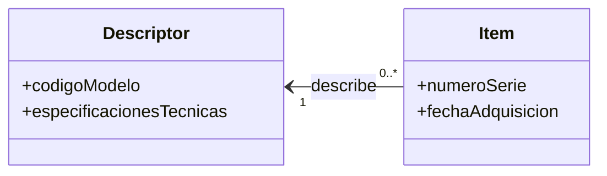
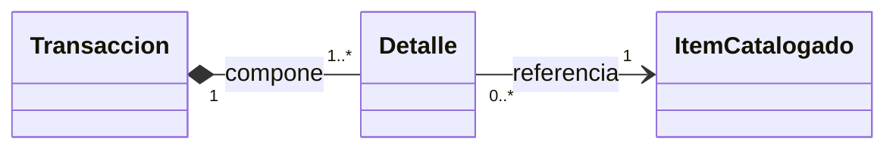
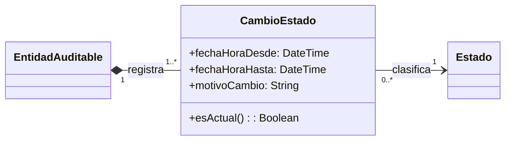
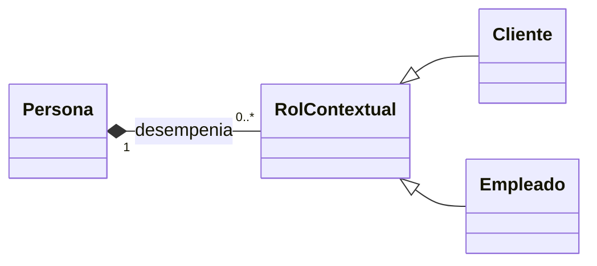
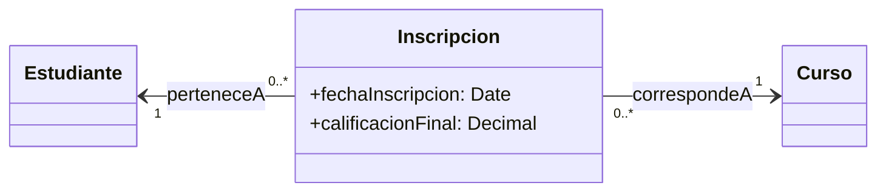

# Catálogo Canónico de Patrones de Dominio (Peter Coad / ASI)

Esta referencia proporciona la especificación estructural y multiplicidades canónicas para los patrones de modelado conceptual de sistemas de información.

---

## 1. Patrones Estructurales Fundamentales

### A. Ítem — Descriptor de Ítem (Item — Item Descriptor)
- **Problema:** Separar la especificación o catálogo general de los ejemplares o instancias físicas individuales para evitar duplicar información estática.
- **Estructura y Multiplicidades:**

### B. Transacción — Detalle de Transacción (Header — Detail)
- **Problema:** Registrar un evento comercial o transaccional compuesto por múltiples renglones dependientes.
- **Estructura y Multiplicidades:**

- **Regla:** La relación entre la transacción y el detalle es **composición fuerte (`*--`)**; los detalles no tienen ciclo de vida independiente.

### C. Historial de Estados con Vigencia Temporal
- **Problema:** Auditar la trayectoria de transiciones de una entidad registrando instantes exactos de validez sin recurrir a un string plano.
- **Estructura y Multiplicidades:**

- **Invariante:** `fechaHoraHasta == null` indica vigencia actual de la entidad.

### D. Actor — Participante (Party — Role)
- **Problema:** Una persona u organización física puede desempeñar múltiples roles contextuales (Cliente, Empleado, Proveedor) a lo largo del tiempo.
- **Estructura y Multiplicidades:**

### E. Reificación N a M (Clase de Asociación)
- **Problema:** Una asociación many-to-many posee atributos propios de la relación (ej. nota obtenida, fecha de inscripción).
- **Estructura y Multiplicidades:**

---

## 2. Catálogo Completo de Patrones Coad

### Patrón Fundamental
1. **Colección–Trabajador:** el objeto colección coordina o agrupa instancias trabajadoras.

### Patrones Transaccionales
2. **Actor–Participante:** la persona u organización real se desacopla del rol con el que interviene en la transacción.
3. **Lugar–Lugar de la transacción:** el sitio físico o virtual participa en la operación con reglas propias.
4. **Ítem–Ítem de la transacción:** el catálogo o bien físico se referencia en el detalle de la operación.
5. **Transacción específica–Línea de detalle:** desglose ordenado y dependiente de una transacción.
6. **Transacción compuesta–Línea de detalle compuesta:** agregación jerárquica de operaciones.
7. **Transacción–Transacción subsiguiente:** encadenamiento causal (ej. Pedido $\to$ Remito $\to$ Factura).
8. **Transacción–Transacción de control / seguimiento:** auditoría, aprobación o fiscalización.
9. **Transacción previa–Transacción:** trazabilidad inversa hacia el antecedente contractual.
10. **Transacción–Resultado:** emisión de comprobantes, certificados o registros derivados.
11. **Transacción–Registro / Evento:** captura de hechos inmutables de auditoría.
12. **Transacción–Historial de estados:** registro cronológico de estados vigentes e históricos.
13. **Participante de la transacción–Detalle:** vínculo directo entre un rol interviniente y un renglón.

### Patrones de Agregación y Estructura
14. **Ensamblado–Parte:** composición física de un producto manufacturado.
15. **Contenedor–Contenido:** ubicación lógica o física de bienes en recintos.
16. **Colección–Miembro:** pertenencia no jerárquica a un grupo o catálogo.
17. **Compuesto–Componente:** estructura recursiva tipo árbol.
18. **Compuesto de parte–Parte:** desglose por niveles de agregación.
19. **Tipo de relación–Relación:** metadatos sobre cómo se vinculan dos conceptos.

### Patrones de Plan y Ejecución
20. **Plan–Ejecución del plan:** la pauta planificada se contrasta contra la ejecución real.
21. **Plan–Paso del plan:** desglose ordenado de hitos o fases teóricas.
22. **Paso del plan–Paso de ejecución:** seguimiento y desvíos paso a paso.
23. **Ejecución del plan–Paso de ejecución:** actividades realmente consumidas.
24. **Plan–Recurso asignado:** reserva o disponibilidad de capacidad técnica o humana.
