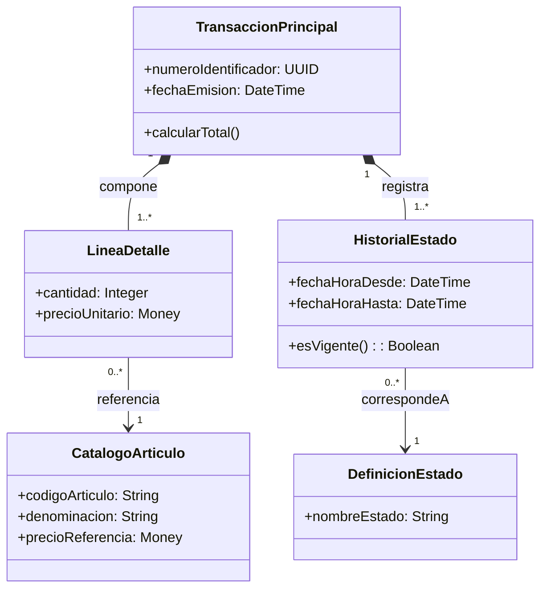

# Especificación del Modelo de Dominio Conceptual (MDD)

**Dominio / Proceso:** {{NOMBRE_DEL_DOMINIO}}  
**Fuentes de Elicitación:** {{FUENTES_ENTREVISTAS_FORMULARIOS}}  
**Fecha:** {{FECHA}}  

---

## 1. Alcance, Fuentes y Hechos Confirmados
- **Alcance Conceptual:** {{Delimitación del problema abordado}}.
- **Hechos Confirmados:** {{Reglas y premisas probadas con evidencia}}.
- **Dudas y Supuestos Pendientes (TBD):** {{Ambigüedades a resolver con stakeholders}}.

---

## 2. Catálogo de Clases de Dominio y Patrones Aplicados
| Clase Conceptual | Propósito en el Dominio | Atributos Semánticos Clave | Patrón Coad/ASI Aplicado |
|---|---|---|---|
| `{{NombreClase}}` | {{Descripción del concepto}} | `id`, `denominacion`, `estado` | Transacción - Detalle de Transacción |
| `{{NombreClase2}}` | {{Descripción del concepto}} | `codigo`, `descripcion`, `vigente` | Ítem - Descriptor de Ítem |

---

## 3. Diagrama de Clases Conceptual (Mermaid)

---

## 4. Matriz de Relaciones, Semántica y Multiplicidades
| Clase Origen | Multiplicidad | Tipo de Vínculo | Multiplicidad | Clase Destino | Semántica / Justificación |
|---|:---:|:---:|:---:|---|---|
| `TransaccionPrincipal` | `1` | Composición (`*--`) | `1..*` | `LineaDetalle` | Las líneas carecen de identidad sin la transacción. |
| `LineaDetalle` | `0..*` | Asociación (`-->`) | `1` | `CatalogoArticulo` | Cada línea referencia un artículo del catálogo. |
| `TransaccionPrincipal` | `1` | Composición (`*--`) | `1..*` | `HistorialEstado` | Registro inmutable de transiciones temporales. |

---

## 5. Diccionario de Datos Conceptual (Opcional por Entidad)
### Entidad: `{{NombreClase}}`
- **Atributos:**
  - `codigo`: Identificador de negocio legible por humanos.
  - `importeTotal`: Magnitud monetaria con moneda explícita.
- **Invariantes y Reglas Conceptuales:**
  - La fecha de emisión no puede ser posterior a la fecha actual.
  - El importe total debe coincidir con la sumatoria de sus detalles.
