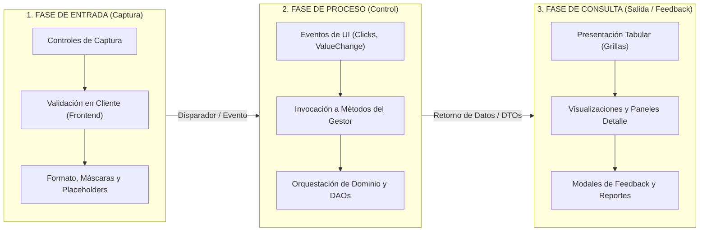
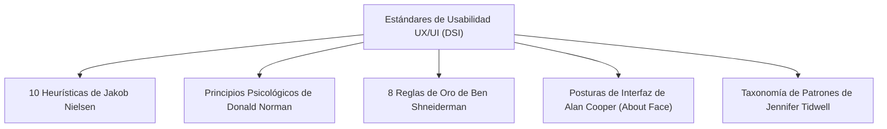

---
name: epcFlowGen
description: >-
  Diseña y formaliza interfaces de usuario y flujos de diálogo bajo el modelo EPC (Entrada - Proceso - Consulta),
  garantizando trazabilidad con los controladores de casos de uso y las heurísticas de usabilidad.
---

# Guía y Metodología de Diseño de Interfaces y Flujos de Diálogo EPC (DSI)

Esta skill proporciona el marco metodológico, los principios de interacción persona-ordenador (IPO), la **Matriz de Diálogo EPC**, los estándares de usabilidad y la plantilla institucional para diseñar, documentar, formalizar y sintetizar interfaces de usuario bajo el modelo **EPC (Entrada - Proceso - Consulta)** de la cátedra de **Diseño de Sistemas de Información (DSI)** de la Universidad Tecnológica Nacional (UTN - FRC).

---

## 1. Fundamentos del Modelo de Interacción EPC

El modelo **EPC** estructura la interacción persona-ordenador descomponiendo cada pantalla o flujo de diálogo en tres fases secuenciales y complementarias, garantizando el desacoplamiento arquitectónico (separación de la capa de presentación y el controlador del caso de uso / `Gestor`) y una experiencia de usuario óptima.



---

### 1.1. Fase de Entrada (Captura de Parámetros e Intenciones)
Comprende todos los controles visuales donde el usuario interactúa para proporcionar datos, aplicar filtros o delimitar criterios de operación:
- **Controles de Captura Estandarizados**:
  - `TextBox` / `InputField`: Entrada alfanumérica, numérica o formateada. Debe incluir `Placeholder`, etiqueta clara (`Label`) y máscara de formato (`Input Mask`).
  - `ComboBox` / `Dropdown` / `Select`: Selección de elemento único dentro de una lista predefinida o recuperada de la base de datos (evita errores tipográficos y reduce la sobrecarga cognitiva).
  - `DateTimePicker` / `DateRangePicker`: Selección de fechas y rangos temporales sin ambigüedad de formato (`DD/MM/AAAA`).
  - `CheckBox` / `RadioButton` / `Toggle Switch`: Opciones booleanas o selección excluyente de modos/estados.
  - `DataGridView` / `TableSelector`: Selección de una fila o múltiples filas de una colección previa para operar sobre ella.
- **Validaciones en Cliente (Pre-Proceso / Frontend)**:
  - Verificación de obligatoriedad (*Required fields*).
  - Validación de tipos de datos, rangos y coherencia lógica básica (ej. `FechaHasta >= FechaDesde`, montos `> 0`).
  - Validación sintáctica mediante expresiones regulares (Email, CUIT/CUIL, números de teléfono, códigos de barras).
  - **Patrón de Habilitación Progresiva (*Disabled State Pattern*)**: Los controles dependientes y los botones de confirmación permanecen deshabilitados visualmente hasta que las entradas previas satisfagan todas las condiciones de validación.

---

### 1.2. Fase de Proceso (Transferencia y Orquestación)
Define los puntos de enganche donde la capa de presentación delega la ejecución de la lógica de negocio al controlador del caso de uso (`Gestor`):
- **Eventos Disparadores (`Event Handlers`)**:
  - `Click` en botones de acción (`btnBuscar_Click`, `btnConfirmar_Click`, `btnGenerarReporte_Click`, `btnExportar_Click`).
  - `ValueChanged` / `SelectedIndexChanged` en selectores que alteran dinámicamente el estado de la pantalla (`dtpFecha_ValueChanged`, `cboTipoResenia_SelectedIndexChanged`).
  - `RowEnter` / `CellClick` / `SelectionChanged` en grillas para activar botones contextuales (`dgvLlamadas_SelectionChanged`).
- **Contrato con el Gestor (Controlador GRASP de DSI)**:
  - **Regla de Oro Arquitectónica**: La interfaz gráfica (`Pantalla` / `Form`) **nunca** contiene reglas de negocio, no ejecuta cálculos de dominio y no realiza consultas directas a la base de datos.
  - La pantalla invoca métodos públicos del `Gestor` enviando tipos de datos primitivos o DTOs (ej. `gestor.tomarFechaDesdeHasta(fechaDesde, fechaHasta)`).
  - El `Gestor` coordina las entidades del modelo de dominio (`Vino`, `Llamada`, `Reseña`, `Encuesta`), aplica las reglas de negocio (`RN-XX`) y delega la persistencia o consulta a los DAOs correspondientes (`VinoDAO`, `LlamadaDAO`).

---

### 1.3. Fase de Consulta y Salida (Presentación y Feedback)
Presenta los datos recuperados, calculados o generados, proveyendo retroalimentación inmediata sobre el estado del sistema:
- **Componentes de Salida y Visualización**:
  - `DataGridView` / `DataGrid`: Grillas paginadas, con ordenamiento por columnas, alineación adecuada (números a la derecha, texto a la izquierda) y formateo de moneda/porcentajes.
  - `Paneles de Detalle / Master-Detail`: Paneles laterales o inferiores que exponen los atributos completos del registro seleccionado en la grilla principal.
  - `Gráficos y Visualizaciones`: Histogramas, gráficos de barras o tortas para resúmenes estadísticos.
  - `Modales de Feedback / Diálogos de Confirmación`: Notificaciones modales para confirmaciones críticas o advertencias, toasters/snackbars para operaciones exitosas no disruptivas.
  - `Reportes Exportables`: Generación y descarga/apertura automática de archivos físicos (`.xlsx`, `.pdf`, `.csv`, comprobante fiscal impreso).

---

## 2. Marco Teórico y Heurísticas de Usabilidad y UX

El diseño de interfaces EPC en DSI integra los principios fundamentales de la Interacción Persona-Ordenador (IPO), el Diseño Centrado en el Usuario (DCU) y la ingeniería de usabilidad:



---

### 2.1. Las 10 Heurísticas de Usabilidad de Jakob Nielsen
| N° | Heurística | Aplicación Práctica en el Modelo EPC |
| :---: | :--- | :--- |
| **H1** | **Visibilidad del estado del sistema** | Informar continuamente al usuario mediante cursores de espera, barras de progreso, badges de estado y totales actualizados. |
| **H2** | **Correspondencia entre el sistema y el mundo real** | Utilizar terminología del negocio del cliente (ej. *Varietal*, *Bodega*, *Reseña Sommelier*, *Operador IVR*) en lugar de tecnicismos informáticos (`tbl_vinos`, `id_fk`). |
| **H3** | **Control y libertad del usuario** | Proveer siempre un botón "Cancelar", "Volver" o "Cerrar" accesible para abortar la operación sin impacto ni persistencia colateral. |
| **H4** | **Consistencia y estándares** | Mantener convenciones globales de la aplicación: botones de confirmación a la derecha en color primario, botones de cancelación a la izquierda, fechas en formato `DD/MM/AAAA`. |
| **H5** | **Prevención de errores** | Deshabilitar el botón de confirmación hasta validar todos los campos obligatorios; impedir selección de periodos inválidos (`FechaHasta < FechaDesde`). |
| **H6** | **Reconocimiento antes que recuerdo** | Desplegar opciones en comboboxes o grillas para que el usuario seleccione visualmente en lugar de exigir memorizar códigos o IDs. |
| **H7** | **Flexibilidad y eficiencia de uso** | Permitir atajos de teclado (`Enter` para ejecutar, `Esc` para cancelar), ordenamiento por columnas y filtros combinados para usuarios avanzados. |
| **H8** | **Diseño estético y minimalista** | Ocultar información innecesaria, organizar la pantalla en paneles secuenciales (*Two-Panel Selector*) y respetar espacios en blanco para evitar sobrecarga visual. |
| **H9** | **Ayudar a reconocer, diagnosticar y recuperarse de errores** | Mensajes de error en lenguaje natural, descriptivos y constructivos, indicando exactamente el campo fallido y la acción correctiva (ej. *"La fecha 'Hasta' no puede ser anterior a la fecha 'Desde'"*). |
| **H10** | **Ayuda y documentación** | Tooltips informativos en iconos, placeholders de ayuda y leyendas breves que clarifiquen el propósito de filtros avanzados. |

---

### 2.2. Principios Psicológicos de Donald Norman (*The Design of Everyday Things*)
1. **Affordance (Perceptibilidad de uso)**:
   - Los controles interactivos (botones, pestañas, selects) deben poseer indicios visuales (relieve, bordes, sombras, colores diferenciados) que comuniquen instantáneamente su capacidad de ser accionados.
2. **Signifiers (Significantes)**:
   - Iconos y leyendas explícitas que indican qué ocurrirá al interactuar (ej. icono de lupa para buscar, icono de Excel para exportar, flechas arriba/abajo en cabeceras de tabla).
3. **Mapeo Natural (*Natural Mapping*)**:
   - Disposición visual alineada con la secuencia de lectura y lógica del proceso: filtros de entrada arriba o a la izquierda; resultados en el centro; acciones de confirmación abajo a la derecha.
4. **Brechas de Interacción (*Interaction Gulfs*)**:
   - **Brecha de Ejecución (*Gulf of Execution*)**: Reducida cuando la interfaz hace autoevidente qué control operar para avanzar.
   - **Brecha de Evaluación (*Gulf of Evaluation*)**: Reducida cuando el sistema presenta una respuesta clara e inequívoca tras cada acción (grilla poblada, toast de confirmación).

---

### 2.3. Principios de Alan Cooper (*About Face: The Essentials of Interaction Design*)
1. **Postura de Interfaz Soberana (*Sovereign Posture*)**:
   - Aplicaciones de uso prolongado y continuo (sistemas de gestión, ERPs, pantallas de ventas/backoffice). Requieren uso eficiente del espacio de pantalla, colores neutros que eviten la fatiga visual y soporte intensivo de teclado y grillas densas.
2. **Postura Transitoria (*Transient Posture*)**:
   - Diálogos auxiliares, modales de confirmación o selectores emergentes (*Pop-ups*). Deben ser simples, autoexplicativos y fáciles de descartar.
3. **Erradicación de la Culpa (*Polite Software*)**:
   - El sistema es respetuoso y tolerante; nunca acusa al usuario de cometer un error ni genera ventanas de diálogo agresivas. La interfaz guía activamente al operador.

---

### 2.4. Taxonomía de Patrones de Diseño de Interfaz (Jennifer Tidwell)
- **Patrones de Estructura**:
  - `Two-Panel Selector`: Panel superior/izquierdo para captura de parámetros de búsqueda y panel inferior/derecho para visualización tabular de resultados.
  - `Master-Detail`: Grilla maestra de elementos resumidos vinculada a un panel subordinado con el detalle completo del registro activo.
  - `Wizard / Sequence Flow`: Flujo guiado por pasos secuenciales cuando el proceso requiere múltiples etapas de configuración.
- **Patrones de Layout**:
  - `Center Stage`: El objeto principal de trabajo (grilla de llamadas, tabla de vinos) ocupa el área central predominante.
  - `Left-to-Right / Top-to-Bottom Flow`: Estructuración acorde a los patrones de lectura en Z o en F.
- **Patrones de Acciones y Comandos**:
  - `Prominent Done Button`: El botón de confirmación o acción definitiva se resalta con tamaño, ubicación y color primario destacado.
  - `Cancelability`: Opción permanente de cancelar la operación y retornar al estado inicial seguro sin efectos secundarios.
  - `Preview`: Vista previa de los datos consolidados antes de disparar la exportación o persistencia definitiva.
- **Patrones de Entrada de Datos**:
  - `Input Prompt / Placeholder`: Texto guía dentro del campo que describe el formato esperado.
  - `Illustrated Choices`: Uso de iconografía o tarjetas visuales para opciones relevantes.
  - `Disabled State`: Bloqueo preventivo de controles para evitar interacciones fuera de secuencia.
- **Patrones de Navegación**:
  - `Modal Panel`: Cuadro de diálogo modal que concentra la atención del usuario para decisiones críticas o detalles puntuales.

---

## 3. La Matriz de Diálogo EPC

La **Matriz de Diálogo EPC** es la herramienta formal de especificación que establece la trazabilidad unívoca entre los pasos del flujo del Caso de Uso (`CU-XX`), los componentes visuales de la interfaz (`Pantalla`), los eventos disparadores de UI, los métodos invocados en el controlador (`Gestor`) y los componentes de salida/feedback.

### 3.1. Estructura y Columnas de la Matriz de Diálogo

| Columna | Significado y Contenido |
| :--- | :--- |
| **Paso CU** | Número secuencial del paso en el Flujo Principal (`FP-XX`) o Flujo Alternativo (`FA-XX`) de la especificación del Caso de Uso. |
| **Fase EPC** | Fase correspondiente del modelo: **E** (Entrada), **P** (Proceso) o **C** (Consulta / Salida). |
| **Control de Entrada / Captura** | Nombre técnico y tipo del control visual de UI donde el usuario interactúa (ej. `dtpFechaDesde: DateTimePicker`, `cboTipoResenia: ComboBox`). |
| **Evento UI Disparador** | Evento del control que captura la interacción (ej. `Click`, `ValueChanged`, `SelectedIndexChanged`, `SelectionChanged`). |
| **Método Invocado en Gestor** | Firma exacta del método de la clase `Gestor` que recibe la delegación de control (ej. `gestor.tomarFechaDesdeHasta(fechaDesde, fechaHasta)`). |
| **Control de Salida / Consulta** | Componente visual que recibe los datos retornados o refleja el nuevo estado (ej. `dgvLlamadas: DataGridView`, `lblTotal: Label`, `MessageBox`). |
| **Validaciones & Heurísticas Aplicadas** | Reglas de validación frontend, heurísticas de Nielsen (H1-H10) y patrones de Tidwell implementados en dicho paso. |

---

## 4. Plantilla Maestra de Especificación EPC de Pantallas

```markdown
# ESPECIFICACIÓN EPC DE PANTALLA: [UI-XX: Nombre de la Interfaz]

## 1. Ficha Técnica de la Interfaz

| Atributo | Detalle |
| :--- | :--- |
| **Identificador** | `UI-XX` |
| **Nombre de la Pantalla** | [Nombre descriptivo de la interfaz, ej. `PantallaRankingVinos`] |
| **Caso de Uso Vinculado** | `CU-XX: [Nombre del Caso de Uso en Infinitivo]` |
| **Actor Principal** | [Actor que opera la interfaz, ej. Sommelier / Encargado de Ventas / Operador de Calidad] |
| **Controlador Asociado** | `Gestor[NombreCU]` (Controlador GRASP del Caso de Uso) |
| **Postura de Interfaz** | Soberana (*Sovereign*) / Transitoria (*Transient*) |
| **Tecnología / Framework** | [C# .NET Windows Forms / WPF / React / Angular / Vue] |

---

## 2. Desglose de Fases EPC

### 2.1. Fase de Entrada (E)
| Control Visual (ID) | Tipo de Componente | Formato / Valores Permitidos | Obligatorio | Validación en Cliente (Frontend) |
| :--- | :--- | :--- | :---: | :--- |
| `[idControl]` | `TextBox / Dropdown / DatePicker` | [Rango, catálogo, máscara] | Sí / No | [Regla de validación local] |

### 2.2. Fase de Proceso (P)
| Evento de UI | Disparador | Método del Gestor Invocado | Parámetros Enviados | Lógica Orquestada por el Gestor |
| :--- | :--- | :--- | :--- | :--- |
| `[btnAccion_Click]` | Click del usuario | `gestor.[metodo]()` | `param1, param2` | [Consulta BD, filtrado de dominio, cálculos, ordenamiento] |

### 2.3. Fase de Consulta / Salida (C)
| Componente de Salida | Tipo de Visualización | Datos Presentados | Destino / Feedback al Usuario |
| :--- | :--- | :--- | :--- |
| `[dgvDatos]` | DataGridView / Tabla | [Lista de atributos retornados] | Renderizado en grilla con selección simple |
| `[modalExito]` | MessageBox / Toast | Mensaje confirmatorio | Notificación visual de operación exitosa |

---

## 3. Matriz de Diálogo EPC Formal

| Paso CU | Fase EPC | Control de Entrada | Evento UI Disparador | Método Invocado en Gestor | Control de Salida / Consulta | Validaciones & Heurísticas Aplicadas |
| :---: | :---: | :--- | :--- | :--- | :--- | :--- |
| **1** | **E** | `[Control 1]` | `[Evento 1]` | `gestor.[metodo1]()` | `[Salida 1]` | H[X]: [Nombre Heurística] - Patrón [Patrón] |
| **2** | **P** | `[Control 2]` | `[Evento 2]` | `gestor.[metodo2]()` | `[Salida 2]` | H[X]: [Nombre Heurística] - Patrón [Patrón] |
| **3** | **C** | `[Control 3]` | `[Evento 3]` | `gestor.[metodo3]()` | `[Salida 3]` | H[X]: [Nombre Heurística] - Patrón [Patrón] |

---

## 4. Evaluación Heurística y Matriz de Patrones

### 4.1. Evaluación Heurística (Nielsen & Norman)
- **H1. Visibilidad del estado**: [Detalle de feedback visual, spinners y badges].
- **H2. Correspondencia con el mundo real**: [Vocabulario del dominio de negocio aplicado].
- **H3. Control y libertad**: [Botones de cancelación y salidas de emergencia].
- **H5. Prevención de errores**: [Validaciones preventivas y estados inactivos].
- **H6. Reconocimiento antes que recuerdo**: [Uso de selectores y tablas].
- **H8. Minimalismo**: [Distribución limpia sin elementos superfluos].

### 4.2. Matriz de Patrones de Interfaz (Jennifer Tidwell)
| Clasificación | Patrón Aplicado | Motivación y Problema Resuelto |
| :--- | :--- | :--- |
| **Estructura** | `Two-Panel Selector` | Separa la parametrización de filtros de la visualización tabular. |
| **Layout** | `Center Stage` | Posiciona la grilla principal en el centro focal de la pantalla. |
| **Acciones** | `Prominent Done Button` | Destaca la acción principal de confirmación/exportación al final del flujo. |
| **Entrada** | `Input Prompt` & `Disabled State` | Guía al usuario y bloquea acciones inválidas preventivamente. |
| **Navegación** | `Modal Panel` | Aísla mensajes de alerta o detalles específicos en cuadros modales. |

---

## 5. Wireframe Estructural (Mermaid y Layout)
[Diagrama Mermaid o layout visual de cajas]

---

## 6. Prototipo / Mockup Interactivo (HTML5 / CSS3)
[Código HTML/CSS moderno, accesible y responsivo]
```

---

## 5. Casos de Estudio Reales de DSI

A continuación se desarrollan dos ejemplos exhaustivos y representativos de la cátedra DSI:
1. **Caso 1: PPAI BonVino - CU-01: Generar Ranking de Vinos** (Enfoque de filtros, cálculo de promedios, ordenamiento Top 10 y exportación a Excel).
2. **Caso 2: PPAI IVR - CU-02: Consultar Encuesta de Llamadas** (Enfoque de selección temporal, visualización tabular en DataGridView, selección de fila y apertura de diálogo modal de detalle).

---

### 5.1. Caso Real 1: PPAI BonVino - `CU-01: Generar Ranking de Vinos`

#### 1. Ficha Técnica de la Interfaz
| Atributo | Detalle |
| :--- | :--- |
| **Identificador** | `UI-01` |
| **Nombre de la Pantalla** | `PantallaRankingVinos` |
| **Caso de Uso** | `CU-01: Generar Ranking de Vinos` |
| **Actor Principal** | Sommelier / Encargado de Calidad |
| **Controlador Asociado** | `GestorRanking` |
| **Postura de Interfaz** | Soberana (*Sovereign Posture*) |
| **Tecnología** | C# .NET Windows Forms (MaterialSkin 2) |

#### 2. Matriz de Diálogo EPC Formal

| Paso CU | Fase EPC | Control de Entrada (Captura) | Evento UI Disparador | Método Invocado en Gestor | Control de Salida / Consulta | Validaciones & Heurísticas Aplicadas |
| :---: | :---: | :--- | :--- | :--- | :--- | :--- |
| **1** | **E** | Opción de menú `"Generar Ranking de Vinos"` | `mniGenerarRanking_Click` | `gestor.opcionGenerarRanking()` | `boxFechas.Enabled = true`, `dtpFechaDesde.Focus()` | **H1**: Visibilidad del estado. Inicializa el formulario y enfoca el selector de fecha inicial. |
| **2** | **E** | `dtpFechaDesde` y `dtpFechaHasta` (Pickers de fecha) | `FechaPicker_ValueChanged` | `gestor.TomarFechaDesdeHasta(desde, hasta)` | `boxTipoResenia.Enabled = true` (si válido) \| Alerta Modal (si error) | **H5**: Prevención de errores. Si `FechaHasta < FechaDesde`, deshabilita pasos siguientes y emite mensaje claro. |
| **3** | **E** | `cboTipoResenia` (Dropdown: "Reseñas de Sommeliers", "Reseñas Normales", "Reseñas de Amigos") | `cboTipoResenia_SelectedIndexChanged` | `gestor.TomarTipoResenia(tipo)` | `boxFormaVisualizacion.Enabled = true` | **H6**: Reconocimiento antes que recuerdo. Si selecciona "Amigos", alerta funcionalidad en desarrollo. |
| **4** | **E** | `cboFormaVisualizacion` (Dropdown: "Excel (.xlsx)", "PDF", "Pantalla") | `cboFormaVisualizacion_SelectedIndexChanged` | `gestor.TomarFormaVisualizacion(tipoArchivo)` | `btnConfirmarReporte.Enabled = true` | **Patrón Tidwell**: *Disabled State*. Botón de confirmación permanece bloqueado hasta elegir formato. |
| **5** | **P** | `btnConfirmarReporte` | `btnConfirmarReporte_Click` | `gestor.confirmarGeneracionReporte()` -> `gestor.generarRanking()` | Cursor de espera / Barra de progreso | **H1**: Visibilidad del estado. Gestor recupera vinos (`VinoDAO`), calcula promedios y ordena el Top 10. |
| **6** | **C** | - (Generación y Salida) | Retorno de `gestor.generarArchivoExcel()` | `gestor.generarArchivoExcel(datosTopDiez)` | `MessageBox.Show("Reporte generado con éxito...")` + Apertura automática del archivo | **H3**: Feedback explícito. Guarda archivo en Descargas y ejecuta `explorer.exe` con el archivo `.xlsx`. |
| **7** | **P / C** | `btnCancelar` / `btnCerrar` | `btnCancelar_Click` | `gestor.finCU()` | `this.Close()` | **H3 & H6**: Salida de emergencia sin efectos colaterales (*Cancelability*). |

#### 3. Wireframe Estructural de la Pantalla

```
+---------------------------------------------------------------------------------------------------+
| 🍷 BonVino - Generar Ranking de Vinos                                                    [_][口][X] |
+---------------------------------------------------------------------------------------------------+
|  1. Período de Evaluación de Reseñas                                                              |
|  +---------------------------------------------------------------------------------------------+  |
|  |  Fecha Desde: [ 01/01/2026 📅 ]            Fecha Hasta: [ 01/09/2026 📅 ]                   |  |
|  +---------------------------------------------------------------------------------------------+  |
|                                                                                                   |
|  2. Criterios de Selección y Formato de Salida                                                    |
|  +---------------------------------------------------------------------------------------------+  |
|  |  Tipo de Reseña a Considerar:                 Forma de Visualización:                       |  |
|  |  [ Reseñas de Sommeliers              ▼ ]     [ Archivo Excel (.xlsx)                  ▼ ]  |  |
|  +---------------------------------------------------------------------------------------------+  |
|                                                                                                   |
|  3. Vista Previa del Ranking (Top 10 Vinos Seleccionados)                                         |
|  +---------------------------------------------------------------------------------------------+  |
|  | Pos | Puntaje Promedio | Nombre del Vino        | Bodega        | Varietal       | Precio ARS |  |
|  |-----+------------------+------------------------+---------------+----------------+------------|  |
|  | 1   | 98.50 ⭐         | Catena Zapata Estiba   | Catena Zapata | Malbec         | $85.000,00 |  |
|  | 2   | 96.20 ⭐         | Cobos Chañares         | Viña Cobos    | Cabernet Sauv. | $92.000,00 |  |
|  | 3   | 95.80 ⭐         | Cheval des Andes       | Terrazas      | Blend          | $78.000,00 |  |
|  | 4   | 94.10 ⭐         | Zuccardi Piedra Negra  | Fam. Zuccardi | Malbec         | $64.000,00 |  |
|  +---------------------------------------------------------------------------------------------+  |
|                                                                                                   |
|  [ ✖ Cancelar Operación ]                           [ 📥 Confirmar y Generar Reporte Excel ]     |
+---------------------------------------------------------------------------------------------------+
```

#### 4. Mockup Interactivo en HTML5 / CSS3

```html
<!DOCTYPE html>
<html lang="es">
<head>
  <meta charset="UTF-8">
  <title>BonVino - Generar Ranking de Vinos</title>
  <style>
    :root {
      --primary: #581845;
      --primary-dark: #370d2b;
      --accent: #c70039;
      --bg: #f8f9fa;
      --surface: #ffffff;
      --border: #dee2e6;
      --text: #212529;
      --text-muted: #6c757d;
      --gold: #f39c12;
    }
    * { box-sizing: border-box; font-family: 'Segoe UI', Roboto, system-ui, sans-serif; }
    body { background: var(--bg); margin: 0; padding: 24px; color: var(--text); }
    .epc-card { max-width: 980px; margin: 0 auto; background: var(--surface); border-radius: 12px; box-shadow: 0 8px 24px rgba(0,0,0,0.08); overflow: hidden; border: 1px solid var(--border); }
    .epc-header { background: linear-gradient(135deg, var(--primary), var(--primary-dark)); color: white; padding: 20px 28px; }
    .epc-header h1 { margin: 0; font-size: 1.35rem; display: flex; align-items: center; gap: 10px; }
    .epc-header p { margin: 4px 0 0 0; opacity: 0.85; font-size: 0.85rem; }
    .epc-body { padding: 28px; display: flex; flex-direction: column; gap: 22px; }
    
    .epc-section { border: 1px solid var(--border); border-radius: 8px; padding: 18px 20px; position: relative; background: #fff; }
    .epc-section-title { font-size: 0.9rem; font-weight: 700; color: var(--primary); margin-top: -28px; background: white; width: fit-content; padding: 0 8px; margin-bottom: 12px; display: flex; align-items: center; gap: 6px; }
    
    .grid-2 { display: grid; grid-template-columns: 1fr 1fr; gap: 20px; }
    .form-group { display: flex; flex-direction: column; gap: 6px; }
    .form-group label { font-size: 0.85rem; font-weight: 600; color: #495057; }
    .form-control { padding: 10px 12px; border: 1px solid var(--border); border-radius: 6px; font-size: 0.9rem; transition: border-color 0.2s, box-shadow 0.2s; outline: none; }
    .form-control:focus { border-color: var(--primary); box-shadow: 0 0 0 3px rgba(88, 24, 69, 0.15); }
    .form-control:disabled { background: #e9ecef; cursor: not-allowed; opacity: 0.7; }
    
    .grid-table { width: 100%; border-collapse: collapse; font-size: 0.88rem; margin-top: 6px; }
    .grid-table th { background: #f1f3f5; color: #495057; text-align: left; padding: 10px 12px; border-bottom: 2px solid var(--border); font-weight: 600; }
    .grid-table td { padding: 10px 12px; border-bottom: 1px solid var(--border); }
    .grid-table tr:hover { background: #fdf2f4; }
    .badge-score { background: #fff3cd; color: #856404; font-weight: 700; padding: 3px 8px; border-radius: 12px; border: 1px solid #ffeeba; display: inline-flex; align-items: center; gap: 4px; }
    
    .epc-actions { display: flex; justify-content: flex-end; gap: 14px; padding-top: 12px; border-top: 1px solid var(--border); }
    .btn { padding: 10px 20px; border-radius: 6px; font-weight: 600; font-size: 0.9rem; cursor: pointer; border: none; transition: all 0.2s; display: inline-flex; align-items: center; gap: 8px; }
    .btn-secondary { background: #e9ecef; color: #495057; }
    .btn-secondary:hover { background: #dee2e6; }
    .btn-primary { background: var(--primary); color: white; }
    .btn-primary:hover { background: var(--primary-dark); box-shadow: 0 4px 12px rgba(88, 24, 69, 0.25); }
  </style>
</head>
<body>

  <div class="epc-card">
    <header class="epc-header">
      <h1>🍷 BonVino :: Gestión de Calidad Vitivinícola</h1>
      <p>CU-01: Generar Ranking de Vinos | Modelo EPC (Entrada - Proceso - Consulta)</p>
    </header>

    <div class="epc-body">
      <!-- FASE DE ENTRADA: 1. Período -->
      <section class="epc-section">
        <div class="epc-section-title">1. Entrada: Período de Evaluación de Reseñas</div>
        <div class="grid-2">
          <div class="form-group">
            <label for="dtpDesde">Fecha Desde (*):</label>
            <input type="date" id="dtpDesde" class="form-control" value="2026-01-01">
          </div>
          <div class="form-group">
            <label for="dtpHasta">Fecha Hasta (*):</label>
            <input type="date" id="dtpHasta" class="form-control" value="2026-09-01">
          </div>
        </div>
      </section>

      <!-- FASE DE ENTRADA: 2. Criterios -->
      <section class="epc-section">
        <div class="epc-section-title">2. Entrada: Criterios y Formato de Exportación</div>
        <div class="grid-2">
          <div class="form-group">
            <label for="cboResenia">Tipo de Reseña a Considerar (*):</label>
            <select id="cboResenia" class="form-control">
              <option value="sommeliers" selected>Reseñas de Sommeliers Calificados</option>
              <option value="general">Reseñas de Público General</option>
              <option value="amigos">Reseñas de Amigos (En Desarrollo)</option>
            </select>
          </div>
          <div class="form-group">
            <label for="cboFormato">Formato de Salida (*):</label>
            <select id="cboFormato" class="form-control">
              <option value="excel" selected>Archivo Excel (.xlsx con fórmulas)</option>
              <option value="pdf">Documento PDF Oficial</option>
              <option value="pantalla">Visualización Interactiva en Pantalla</option>
            </select>
          </div>
        </div>
      </section>

      <!-- FASE DE CONSULTA: 3. Vista Previa -->
      <section class="epc-section">
        <div class="epc-section-title">3. Consulta: Vista Previa del Top 10 Ranking</div>
        <table class="grid-table">
          <thead>
            <tr>
              <th>#</th>
              <th>Puntaje Promedio</th>
              <th>Nombre del Vino</th>
              <th>Bodega</th>
              <th>Varietal</th>
              <th>Región Vitivinícola</th>
              <th>Precio ARS</th>
            </tr>
          </thead>
          <tbody>
            <tr>
              <td><strong>1</strong></td>
              <td><span class="badge-score">98.50 ⭐</span></td>
              <td><strong>Estiba Reservada</strong></td>
              <td>Catena Zapata</td>
              <td>Malbec</td>
              <td>Valle de Uco, Mendoza</td>
              <td>$85.000,00</td>
            </tr>
            <tr>
              <td><strong>2</strong></td>
              <td><span class="badge-score">96.20 ⭐</span></td>
              <td><strong>Cobos Chañares Estate</strong></td>
              <td>Viña Cobos</td>
              <td>Cabernet Sauvignon</td>
              <td>Los Árboles, Mendoza</td>
              <td>$92.000,00</td>
            </tr>
            <tr>
              <td><strong>3</strong></td>
              <td><span class="badge-score">95.80 ⭐</span></td>
              <td><strong>Cheval des Andes</strong></td>
              <td>Terrazas de los Andes</td>
              <td>Blend</td>
              <td>Las Compuertas, Mendoza</td>
              <td>$78.000,00</td>
            </tr>
          </tbody>
        </table>
      </section>

      <!-- FASE DE PROCESO: Acciones -->
      <footer class="epc-actions">
        <button type="button" class="btn btn-secondary">✖ Cancelar</button>
        <button type="button" class="btn btn-primary">📥 Confirmar y Generar Reporte Excel</button>
      </footer>
    </div>
  </div>

</body>
</html>
```

---

### 5.2. Caso Real 2: PPAI IVR - `CU-02: Consultar Encuesta de Llamadas`

#### 1. Ficha Técnica de la Interfaz
| Atributo | Detalle |
| :--- | :--- |
| **Identificador** | `UI-02` |
| **Nombre de la Pantalla** | `PantallaConsultarEncuesta` |
| **Caso de Uso** | `CU-02: Consultar Encuesta de Llamadas` |
| **Actor Principal** | Responsable de Atención al Cliente / Supervisor |
| **Controlador Asociado** | `GestorEncuesta` |
| **Postura de Interfaz** | Soberana (Grilla Principal) con Modal Transitorio (`DetalleLlamada`) |
| **Tecnología** | C# .NET Windows Forms (MaterialSkin 2) |

#### 2. Matriz de Diálogo EPC Formal

| Paso CU | Fase EPC | Control de Entrada (Captura) | Evento UI Disparador | Método Invocado en Gestor | Control de Salida / Consulta | Validaciones & Heurísticas Aplicadas |
| :---: | :---: | :--- | :--- | :--- | :--- | :--- |
| **1** | **E** | Opción de menú `"Consultar Encuestas de Atención"` | `mniConsultarEncuesta_Click` | `gestor.opcionConsultarEncuesta()` | `dtpFechaDesde.Focus()`, `btnBuscar.Enabled = true` | **H1**: Visibilidad del estado inicial. |
| **2** | **E** | `dtpFechaDesde`, `dtpFechaHasta` | `btnBuscar_Click` | `gestor.tomarPeriodoLlamadas(desde, hasta)` | `dgvLlamadas` (Grilla poblada) \| Toast informativo si no hay llamadas | **H5 & H9**: Prevención y diagnóstico. Valida `FechaHasta >= FechaDesde`. Si no hay resultados, alerta sin bloquear. |
| **3** | **E** | `dgvLlamadas` (Selección de una llamada con encuesta completada) | `dgvLlamadas_CellClick` / `SelectionChanged` | - | `btnSeleccionarLlamada.Enabled = true` | **Patrón Tidwell**: *Enabled State on Selection*. Botón de detalle se habilita únicamente al seleccionar una fila. |
| **4** | **P** | `btnSeleccionarLlamada` | `btnSeleccionarLlamada_Click` | `gestor.tomarLlamada(llamadaSeleccionada)` -> `gestor.buscarDatosLlamada()` | Modal emergente: `DetalleLlamada.ShowDialog()` | **H6**: Reconocimiento antes que recuerdo. El Gestor recupera cliente, respuestas, preguntas y valoraciones. |
| **5** | **C** | `modalDetalleLlamada` | Evento `Load` del formulario modal | `gestor.buscarDatosLlamada()` | `lblCliente`, `lblOperador`, `lblDuracion`, `dgvRespuestas` | **H2 & H8**: Correspondencia y minimalismo. Muestra el estado del cliente y cada respuesta de la encuesta. |
| **6** | **P / C** | `btnImprimirEncuesta` / `btnExportarCSV` | `btnImprimir_Click` | `gestor.generarReporteEncuesta()` | Impresión física / Descarga de CSV + Mensaje Toast | **H1**: Feedback inmediato de confirmación de exportación. |
| **7** | **P / C** | `btnCerrarModal` / `btnVolver` | `btnCerrar_Click` | `gestor.finDetalle()` | Retorno a `PantallaConsultarEncuesta` | **H3**: Control y libertad del usuario para retomar la búsqueda previa. |

#### 3. Wireframe Estructural de la Pantalla (Master-Detail con Modal)

```
+---------------------------------------------------------------------------------------------------+
| 📞 IVR - Consulta de Encuestas de Satisfacción                                           [_][口][X] |
+---------------------------------------------------------------------------------------------------+
|  1. Criterio de Búsqueda Temporal                                                                 |
|  +---------------------------------------------------------------------------------------------+  |
|  |  Fecha Desde: [ 01/05/2026 📅 ]   Fecha Hasta: [ 31/05/2026 📅 ]   [ 🔍 Buscar Llamadas ]   |  |
|  +---------------------------------------------------------------------------------------------+  |
|                                                                                                   |
|  2. Llamadas con Encuestas Realizadas (Master Grid)                                               |
|  +---------------------------------------------------------------------------------------------+  |
|  | ID Llamada | Fecha y Hora       | Cliente              | Duración (min) | Estado Encuesta  |  |
|  |------------+--------------------+----------------------+----------------+------------------|  |
|  | 10482      | 15/05/2026 10:24   | Gómez, Mariana       | 04:15          | ✅ Completada    |  |
|  | 10495 ▶    | 15/05/2026 11:08   | Pérez, Juan Carlos   | 08:30          | ✅ Completada    |  |
|  | 10512      | 16/05/2026 09:12   | Rodríguez, Lucía     | 03:45          | ✅ Completada    |  |
|  +---------------------------------------------------------------------------------------------+  |
|                                                                                                   |
|  [ ✖ Cerrar Consulta ]                                             [ 📄 Ver Detalle de Encuesta ] |
+---------------------------------------------------------------------------------------------------+

     +-----------------------------------------------------------------------+
     | 📄 Detalle de Encuesta - Llamada #10495                        [_][X] |
     +-----------------------------------------------------------------------+
     |  Cliente: Juan Carlos Pérez  |  Tel: +54 9 351 456789                 |
     |  Operador: Ana Martínez      |  Duración: 08:30 min                   |
     |-----------------------------------------------------------------------|
     |  Preguntas de la Encuesta              | Respuesta Seleccionada       |
     |----------------------------------------+------------------------------|
     |  1. ¿Cómo califica la atención?        | ⭐⭐⭐⭐⭐ (5/5 - Excelente) |
     |  2. ¿Se resolvió su consulta?          | ✅ Sí                        |
     |  3. ¿Recomendaría nuestro servicio?    | ⭐⭐⭐⭐ (4/5 - Muy Bueno)  |
     |-----------------------------------------------------------------------|
     |  [ 🖨️ Imprimir ]        [ 📥 Exportar CSV ]              [ ✖ Volver ] |
     +-----------------------------------------------------------------------+
```

#### 4. Mockup Interactivo en HTML5 / CSS3

```html
<!DOCTYPE html>
<html lang="es">
<head>
  <meta charset="UTF-8">
  <title>IVR - Consultar Encuesta de Llamadas (Modelo EPC)</title>
  <style>
    :root {
      --primary: #1e3d59;
      --primary-light: #17b978;
      --bg: #f5f7fa;
      --surface: #ffffff;
      --border: #e1e8ed;
      --text: #2c3e50;
      --text-muted: #7f8c8d;
    }
    * { box-sizing: border-box; font-family: 'Segoe UI', Roboto, system-ui, sans-serif; }
    body { background: var(--bg); margin: 0; padding: 24px; color: var(--text); }
    .epc-container { max-width: 1020px; margin: 0 auto; background: var(--surface); border-radius: 12px; box-shadow: 0 8px 24px rgba(0,0,0,0.06); border: 1px solid var(--border); overflow: hidden; }
    .epc-header { background: var(--primary); color: white; padding: 18px 26px; }
    .epc-header h1 { margin: 0; font-size: 1.3rem; display: flex; align-items: center; gap: 10px; }
    .epc-header p { margin: 4px 0 0 0; opacity: 0.85; font-size: 0.85rem; }
    .epc-body { padding: 24px; display: flex; flex-direction: column; gap: 20px; }
    
    .filter-bar { display: flex; align-items: flex-end; gap: 16px; background: #f8fafc; padding: 16px; border-radius: 8px; border: 1px solid var(--border); }
    .form-group { display: flex; flex-direction: column; gap: 6px; }
    .form-group label { font-size: 0.85rem; font-weight: 600; color: #495057; }
    .form-control { padding: 9px 12px; border: 1px solid var(--border); border-radius: 6px; font-size: 0.9rem; outline: none; }
    .form-control:focus { border-color: var(--primary); box-shadow: 0 0 0 3px rgba(30, 61, 89, 0.15); }
    
    .data-table { width: 100%; border-collapse: collapse; font-size: 0.9rem; }
    .data-table th { background: #f1f5f9; color: #334155; text-align: left; padding: 11px 14px; border-bottom: 2px solid var(--border); font-weight: 600; }
    .data-table td { padding: 11px 14px; border-bottom: 1px solid var(--border); }
    .data-table tr.selected { background: #e0f2fe; border-left: 4px solid var(--primary); }
    .data-table tr:hover:not(.selected) { background: #f8fafc; cursor: pointer; }
    
    .badge-success { background: #dcfce7; color: #166534; font-weight: 600; padding: 3px 8px; border-radius: 12px; font-size: 0.8rem; }
    
    .epc-actions { display: flex; justify-content: flex-end; gap: 12px; padding-top: 10px; border-top: 1px solid var(--border); }
    .btn { padding: 9px 18px; border-radius: 6px; font-weight: 600; font-size: 0.88rem; cursor: pointer; border: none; transition: all 0.2s; display: inline-flex; align-items: center; gap: 8px; }
    .btn-primary { background: var(--primary); color: white; }
    .btn-primary:hover { background: #132738; }
    .btn-secondary { background: #e2e8f0; color: #334155; }
    .btn-secondary:hover { background: #cbd5e1; }
  </style>
</head>
<body>

  <div class="epc-container">
    <header class="epc-header">
      <h1>📞 IVR :: Consulta de Encuestas de Satisfacción</h1>
      <p>CU-02: Consultar Encuesta de Llamada | Modelo EPC (Entrada - Proceso - Consulta)</p>
    </header>

    <div class="epc-body">
      <!-- FASE DE ENTRADA: Filtro Temporal -->
      <div class="filter-bar">
        <div class="form-group">
          <label for="fDesde">Fecha Desde (*):</label>
          <input type="date" id="fDesde" class="form-control" value="2026-05-01">
        </div>
        <div class="form-group">
          <label for="fHasta">Fecha Hasta (*):</label>
          <input type="date" id="fHasta" class="form-control" value="2026-05-31">
        </div>
        <button type="button" class="btn btn-primary" style="margin-bottom: 1px;">🔍 Buscar Llamadas</button>
      </div>

      <!-- FASE DE CONSULTA: Grilla Maestra -->
      <table class="data-table">
        <thead>
          <tr>
            <th>ID Llamada</th>
            <th>Fecha y Hora</th>
            <th>Cliente</th>
            <th>Duración</th>
            <th>Estado Encuesta</th>
          </tr>
        </thead>
        <tbody>
          <tr>
            <td>#10482</td>
            <td>15/05/2026 10:24</td>
            <td>Mariana Gómez</td>
            <td>04:15 min</td>
            <td><span class="badge-success">✅ Completada</span></td>
          </tr>
          <tr class="selected">
            <td>#10495</td>
            <td>15/05/2026 11:08</td>
            <td><strong>Juan Carlos Pérez</strong></td>
            <td>08:30 min</td>
            <td><span class="badge-success">✅ Completada</span></td>
          </tr>
          <tr>
            <td>#10512</td>
            <td>16/05/2026 09:12</td>
            <td>Lucía Rodríguez</td>
            <td>03:45 min</td>
            <td><span class="badge-success">✅ Completada</span></td>
          </tr>
        </tbody>
      </table>

      <!-- FASE DE PROCESO: Acciones Finales -->
      <footer class="epc-actions">
        <button type="button" class="btn btn-secondary">✖ Cerrar</button>
        <button type="button" class="btn btn-primary">📄 Ver Detalle de Encuesta</button>
      </footer>
    </div>
  </div>

</body>
</html>
```

---

## 6. Directrices de Calidad para el Agente Especialista

Al diseñar, validar o auditar especificaciones de UI/UX bajo el modelo EPC:
1. **Desacoplamiento Estricto (Clean Architecture / GRASP Controller)**:
   - La capa de presentación (`Pantalla` / `Form`) debe limitarse a la captura visual, validación sintáctica básica en cliente y renderizado de resultados. Toda la orquestación, cómputo de reglas de negocio (`RN-XX`) y persistencia deben residir en el `Gestor`.
2. **Trazabilidad Bidireccional Total**:
   - Cada acción de la **Matriz de Diálogo EPC** debe corresponderse biunívocamente con un paso del Caso de Uso (`CU-XX`) y con un método del `Gestor`.
3. **Validación Preventiva y Respeto a las Heurísticas**:
   - Aplicar el patrón de habilitación progresiva (*Disabled State Pattern*) para evitar que el usuario dispare acciones inconsistentes (H5).
   - Utilizar vocabulario semántico del dominio y no tecnicismos de base de datos (H2).
   - Garantizar siempre un mecanismo de cancelación visible y seguro (H3).
