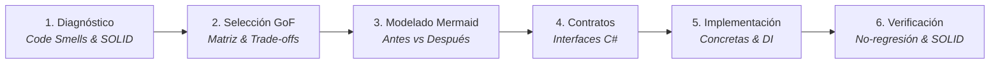
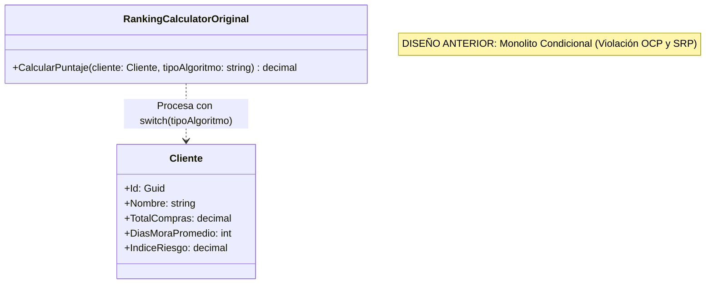
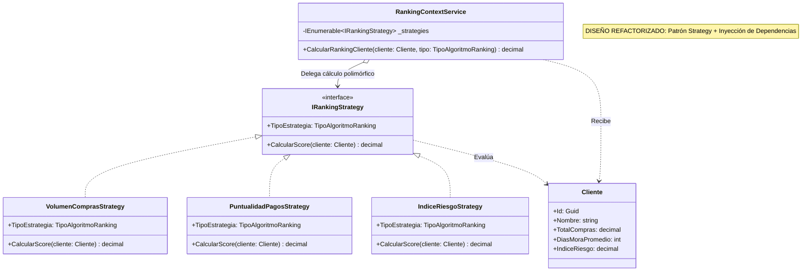
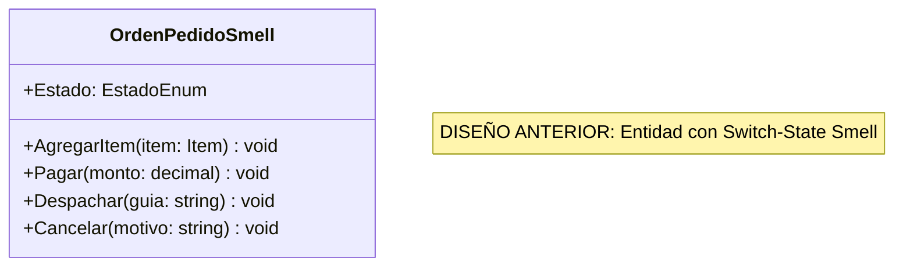
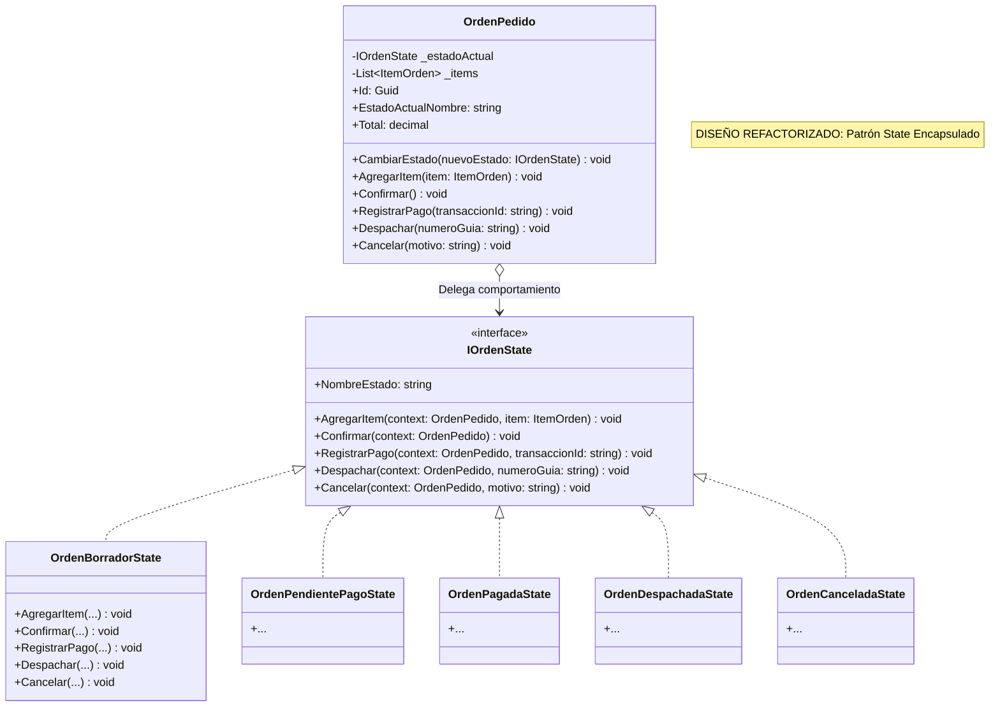
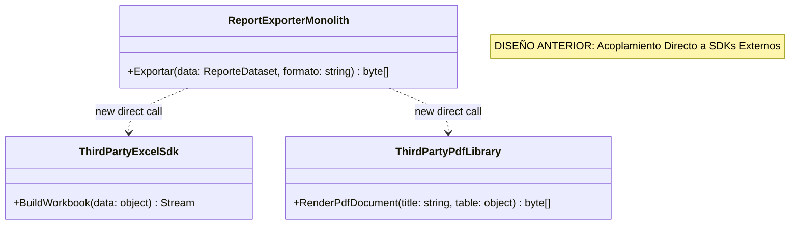
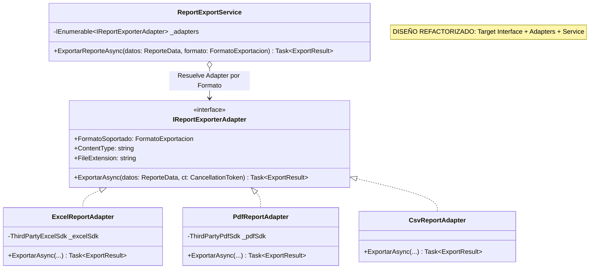
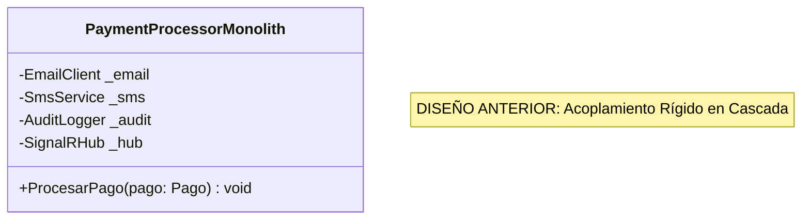
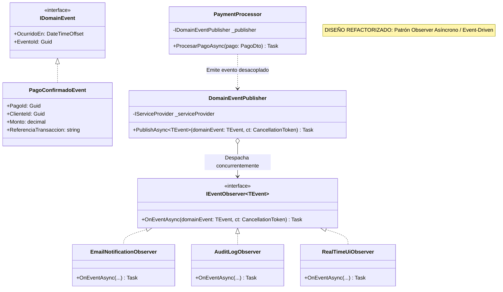

---
name: gofAdviser
description: >-
  Detecta olores de diseño y violaciones SOLID en modelos de clases y código fuente, recomendando
  y generando refactorizaciones con patrones GoF (Strategy, State, Observer, Factory, Composite, Adapter, etc.).
---

# Asesor de Refactorización de Patrones GoF y Principios de Diseño OO (DSI)

Esta skill proporciona las directrices teóricas, diagnósticas y metodológicas para identificar **olores de diseño (Code Smells)** y **violaciones a los principios SOLID / GRASP**, recomendando e implementando refactorizaciones robustas fundamentadas en el catálogo de **Patrones de Diseño GoF (Gang of Four)** con código limpio en C# moderno y diagramas UML/Mermaid.

---

## 1. Fundamentos y Principios Guía

Toda recomendación y refactorización debe basarse en los principios cardinales de Diseño de Sistemas de Información (DSI):

### 1.1. Principios Clave de Diseño OO
1. **Encapsular lo que varía:** Identificar los aspectos del sistema que cambian con frecuencia y separarlos de lo que permanece constante.
2. **Programar para una interfaz, no para una implementación:** Apoyarse en tipos abstractos (interfaces o clases base abstractas) para permitir la sustitución polimórfica.
3. **Favorecer la composición de objetos sobre la herencia de clases:** La herencia genera acoplamiento estático en tiempo de compilación; la composición permite variar el comportamiento dinámicamente en tiempo de ejecución.

### 1.2. Principios SOLID
- **SRP (Single Responsibility Principle):** Una clase debe tener una, y solo una, razón para cambiar.
- **OCP (Open/Closed Principle):** Las entidades de software deben estar abiertas a la extensión, pero cerradas a la modificación.
- **LSP (Liskov Substitution Principle):** Los subtipos deben ser sustituibles por sus tipos base sin alterar la corrección del programa.
- **ISP (Interface Segregation Principle):** Los clientes no deben verse forzados a depender de interfaces que no utilizan.
- **DIP (Dependency Inversion Principle):** Los módulos de alto nivel no deben depender de módulos de bajo nivel; ambos deben depender de abstracciones. Las abstracciones no deben depender de los detalles; los detalles deben depender de las abstracciones.

---

## 2. Taxonomía de Patrones GoF y Matriz de Clasificación

El catálogo GoF agrupa 23 patrones en tres categorías fundamentales según su propósito:

```mermaid
graph TD
    GOF["Patrones de Diseño GoF (23)"]
    
    GOF --> CREACIONALES["Patrones Creacionales (5)<br/><i>Abstraen el proceso de instanciación</i>"]
    GOF --> ESTRUCTURALES["Patrones Estructurales (7)<br/><i>Composición de clases y objetos</i>"]
    GOF --> COMPORTAMIENTO["Patrones de Comportamiento (11)<br/><i>Interacción y asignación de responsabilidades</i>"]
    
    CREACIONALES --> C1["Factory Method"]
    CREACIONALES --> C2["Abstract Factory"]
    CREACIONALES --> C3["Builder"]
    CREACIONALES --> C4["Prototype"]
    CREACIONALES --> C5["Singleton"]
    
    ESTRUCTURALES --> E1["Adapter"]
    ESTRUCTURALES --> E2["Composite"]
    ESTRUCTURALES --> E3["Decorator"]
    ESTRUCTURALES --> E4["Facade"]
    ESTRUCTURALES --> E5["Proxy"]
    ESTRUCTURALES --> E6["Bridge"]
    ESTRUCTURALES --> E7["Flyweight"]
    
    COMPORTAMIENTO --> B1["Strategy"]
    COMPORTAMIENTO --> B2["State"]
    COMPORTAMIENTO --> B3["Observer"]
    COMPORTAMIENTO --> B4["Command"]
    COMPORTAMIENTO --> B5["Template Method"]
    COMPORTAMIENTO --> B6["Chain of Responsibility"]
    COMPORTAMIENTO --> B7["Iterator"]
    COMPORTAMIENTO --> B8["Mediator"]
    COMPORTAMIENTO --> B9["Memento"]
    COMPORTAMIENTO --> B10["Visitor"]
    COMPORTAMIENTO --> B11["Interpreter"]
```



---

### 2.1. Patrones Creacionales

| Patrón | Propósito Fundamental | Cuándo Utilizarlo | Cuándo Evitarlo | Trade-offs (Pros / Contras) |
| :--- | :--- | :--- | :--- | :--- |
| **Factory Method** | Define una interfaz para crear un objeto, pero deja que las subclases decidan qué clase instanciar. | No se conocen de antemano los tipos exactos de objetos; se desea extender fácilmente bibliotecas o frameworks. | La jerarquía de productos es fija y nunca requerirá variaciones ni polimorfismo. | **+** Desacopla creador de productos concretos (OCP/SRP).<br>**-** Puede proliferar la cantidad de subclases. |
| **Abstract Factory** | Proporciona una interfaz para crear familias de objetos relacionados o dependientes sin especificar sus clases concretas. | El sistema debe ser independiente de cómo se crean, componen y representan sus productos (ej. temas UI, soporte multi-base de datos). | Se tienen productos individuales aislados que no pertenecen a familias coherentes. | **+** Garantiza compatibilidad entre productos de una misma familia.<br>**-** Complejo extender la interfaz para soportar nuevos tipos de productos. |
| **Builder** | Separa la construcción de un objeto complejo de su representación, permitiendo crear diferentes representaciones con el mismo proceso. | Construcción de objetos con múltiples partes, pasos secuenciales u opciones de configuración complejas. | Objetos simples con pocos parámetros en el constructor. | **+** Control fino paso a paso; código inmutable limpio.<br>**-** Incrementa la complejidad de clases auxiliares. |
| **Prototype** | Especifica los tipos de objetos a crear mediante una instancia prototípica y crea nuevos objetos clonando este prototipo. | El costo de instanciación mediante `new` o carga desde BD es prohibitivo; se requiere duplicar estados complejos. | Objetos sencillos con referencias circulares intrincadas o recursos no clonables (sockets, handles de archivos). | **+** Evita constructores pesados y subclases de fábricas.<br>**-** Clonar objetos complejos con grafos circulares puede ser propenso a errores (Deep Copy). |
| **Singleton** | Garantiza que una clase tenga una única instancia y proporciona un punto de acceso global a ella. | Control centralizado de recursos compartidos (ej. Hardware Driver, ThreadPool, Cache global). | Reemplazo encubierto de variables globales; dificulta unit testing e inyección de dependencias. | **+** Acceso controlado a instancia única.<br>**-** Viola SRP, oculta dependencias, complica pruebas unitarias en paralelo. |

---

### 2.2. Patrones Estructurales

| Patrón | Propósito Fundamental | Cuándo Utilizarlo | Cuándo Evitarlo | Trade-offs (Pros / Contras) |
| :--- | :--- | :--- | :--- | :--- |
| **Adapter** | Convierte la interfaz de una clase en otra interfaz que el cliente espera. Permite que clases con interfaces incompatibles colaboren. | Integración de librerías de terceros, APIs heredadas (Legacy) o componentes externos con contratos incompatibles. | Cuando se puede modificar directamente el código fuente de la clase destino. | **+** Aísla la conversión de datos y llamadas (SRP/OCP).<br>**-** Incrementa la cantidad de capas de indirección. |
| **Composite** | Compone objetos en estructuras de árbol para representar jerarquías parte-todo. Permite a los clientes tratar objetos individuales y composiciones de manera uniforme. | Estructuras jerárquicas recursivas (menús, sistemas de archivos, nodos gráficos, cálculo de precios por combos/ítems). | Modelos donde los elementos no comparten operaciones o comportamientos comunes en el árbol. | **+** Simplifica el código del cliente mediante polimorfismo recursivo (OCP).<br>**-** Difícil restringir los tipos de componentes en la jerarquía en tiempo de compilación. |
| **Decorator** | Añade responsabilidades adicionales a un objeto dinámicamente de forma transparente, como alternativa flexible a la herencia. | Adición de comportamientos ortogonales acumulativos (compresión, cifrado, logging, caching, validación en streams). | Comportamientos fijos donde la herencia simple o middlewares estándar son suficientes. | **+** Gran flexibilidad en tiempo de ejecución sin alterar la clase base (OCP/SRP).<br>**-** Difícil remover decoradores específicos del stack; código con muchos objetos envoltorio pequeños. |
| **Facade** | Proporciona una interfaz unificada y simplificada para un conjunto de interfaces de un subsistema complejo. | Simplificar el acceso a bibliotecas complejas, pipelines de procesamiento o frameworks con múltiples pasos internos. | Cuando el cliente necesita control de bajo nivel y acceso granular a cada componente del subsistema. | **+** Reduce el acoplamiento entre el cliente y el subsistema.<br>**-** Puede convertirse en un "God Object" si acumula demasiadas responsabilidades. |
| **Proxy** | Proporciona un sustituto o intermediario de otro objeto para controlar el acceso a él. | Acceso perezoso (Lazy Loading), control de permisos/seguridad (Protection Proxy), caché, invocación remota (Remote Proxy/gRPC). | Operaciones donde el acceso directo no presenta problemas de rendimiento, seguridad o distribución. | **+** Control transparente del ciclo de vida y acceso al objeto real (OCP/SRP).<br>**-** Añade latencia e indirección adicional. |
| **Bridge** | Desacopla una abstracción de su implementación, de modo que ambas puedan variar de forma independiente. | Se requiere evitar un producto cartesiano de clases al combinar múltiples dimensiones de variación (ej. Formas x Motores de Renderizado). | Sistemas con una única dimensión de variación sin necesidad de desacople en tiempo de ejecución. | **+** Independencia ortogonal entre abstracción e implementación (DIP/OCP).<br>**-** Aumenta la complejidad arquitectónica inicial. |
| **Flyweight** | Comparte eficientemente un gran número de objetos de granularidad fina para reducir el consumo de memoria. | Se deben manejar millones de objetos casi idénticos en memoria (árboles en un mapa, caracteres en un procesador de texto). | Escenarios donde la cantidad de instancias es reducida o la memoria no es un cuello de botella. | **+** Ahorro masivo de memoria RAM mediante estado intrínseco compartido.<br>**-** Complejidad en separar el estado intrínseco del extrínseco. |

---

### 2.3. Patrones de Comportamiento

| Patrón | Propósito Fundamental | Cuándo Utilizarlo | Cuándo Evitarlo | Trade-offs (Pros / Contras) |
| :--- | :--- | :--- | :--- | :--- |
| **Strategy** | Define una familia de algoritmos, encapsula cada uno y los hace intercambiables. Permite que el algoritmo varíe independientemente de los clientes. | Algoritmos de cálculo alternativos (descuentos, ranking, enrutamiento, validación, compresión, ordenamiento) o ramas condicionales `switch/case` extensas. | El algoritmo nunca cambia y solo existe una única variante predecible. | **+** Elimina condicionales masivos; habilita extensibilidad en caliente (OCP/SRP).<br>**-** El cliente debe conocer o resolver las diferentes estrategias. |
| **State** | Permite que un objeto altere su comportamiento cuando su estado interno cambia. El objeto parecerá cambiar de clase. | Máquinas de estado finito, ciclos de vida de entidades (Pedido, Factura, Turno, Expediente) donde las operaciones válidas dependen del estado actual. | Entidades con pocos estados (2 estados) sin variación sustancial en sus reglas de negocio. | **+** Elimina transiciones `switch(estado)` caóticas; encapsula reglas por estado (SRP/OCP).<br>**-** Sobrecarga de clases si los estados son triviales o casi no tienen lógica. |
| **Observer** | Define una dependencia uno-a-muchos entre objetos, de forma que cuando uno cambia de estado, todos sus dependientes son notificados automáticamente. | Sistemas orientados a eventos, desacople entre modelo de dominio y vistas UI, logging, métricas o emisión de notificaciones multi-canal. | Flujos estrictamente sincrónicos y lineales donde el emisor conoce con precisión al receptor único. | **+** Desacoplamiento total entre publicador y suscriptores (OCP/DIP).<br>**-** Orden de notificación no determinista; riesgo de fugas de memoria si no se desuscriben. |
| **Command** | Encapsula una petición como un objeto, permitiendo parametrizar clientes con diferentes peticiones, encolar, registrar y soportar operaciones de deshacer (Undo/Redo). | Colas de trabajo en segundo plano, barras de herramientas con atajos de teclado, macros transaccionales, soporte de Undo/Redo. | Invocaciones directas de métodos simples sin necesidad de diferir, encolar o revertir. | **+** Desacopla el emisor del receptor; soporte nativo de Undo/Redo y colas (SRP/OCP).<br>**-** Aumenta el número de clases comando. |
| **Template Method** | Define el esqueleto de un algoritmo en una operación, postergando algunos pasos a las subclases sin cambiar la estructura del algoritmo. | Flujos de trabajo estandarizados (ej. ETL, pipelines de renderizado, minería de datos) donde la secuencia es fija pero ciertos pasos varían. | Cuando la estructura del algoritmo no es fija o cambia en tiempo de ejecución (preferir *Strategy*). | **+** Reutilización de código esqueleto; control de puntos de extensión (Principio de Hollywood).<br>**-** Acoplamiento por herencia; viola el principio de composición. |
| **Chain of Responsibility** | Pasa la solicitud a lo largo de una cadena de manejadores potenciales hasta que uno de ellos la procese o se agote la cadena. | Pipelines de autorización, middlewares de validación, filtros de red, procesamiento de eventos jerárquicos UI. | Cada solicitud tiene un destino único e inequívoco conocido de antemano. | **+** Reduce el acoplamiento entre emisor y receptor; reconfiguración dinámica de la cadena.<br>**-** No garantiza que la solicitud sea atendida si ningún manejador la procesa. |
| **Iterator** | Proporciona una forma de acceder secuencialmente a los elementos de un objeto agregado sin exponer su representación subyacente. | Recorrer estructuras de datos complejas (árboles, grafos, listas) de múltiples maneras sin exponer su implementación interna. | Colecciones lineales estándar donde el lenguaje ya provee soporte nativo idiomático (`IEnumerable`/`IEnumerator`). | **+** Desacopla el algoritmo de recorrido de la estructura de datos.<br>**-** Puede resultar redundante si la colección es trivial. |
| **Mediator** | Define un objeto que encapsula cómo interactúa un conjunto de objetos, promoviendo el bajo acoplamiento al evitar que se comuniquen explícitamente entre sí. | Sistemas UI con controles interdependientes complejos (diálogos con campos reactivos), orquestación de servicios en arquitectura CQRS (MediatR). | Pocos componentes con relaciones estables y simples. | **+** Centraliza la lógica de interacción (SRP); reduce dependencias directas.<br>**-** El mediador puede transformarse en un "God Object" monolítico. |
| **Memento** | Sin violar el encapsulamiento, captura y externaliza el estado interno de un objeto para que pueda ser restaurado posteriormente. | Snapshots de auditoría, puntos de restauración (Checkpoints), transacciones reversibles en memoria. | Objetos masivos cuyo snapshot degrade severamente la memoria RAM. | **+** Preserva el encapsulamiento del originador sin exponer sus campos privados.<br>**-** Alto consumo de recursos si el estado cambia con mucha frecuencia y los mementos son grandes. |
| **Visitor** | Representa una operación a realizar sobre los elementos de una estructura de objetos. Permite definir una nueva operación sin cambiar las clases de los elementos. | Generadores de código, analizadores de AST (árboles de sintaxis), exportadores o reportes sobre jerarquías heterogéneas estables. | Jerarquías de clases donde frecuentemente se añaden nuevos tipos de nodos. | **+** Agrupa operaciones relacionadas (SRP/OCP para operaciones).<br>**-** Muy costoso añadir nuevas clases de elementos a la jerarquía (rompe la interfaz Visitor). |
| **Interpreter** | Dada una gramática, define una representación para su gramática junto con un intérprete que usa la representación para interpretar oraciones del lenguaje. | Motores de reglas de negocio en DSL simples, evaluadores de fórmulas booleanas o expresiones algebraicas en tiempo de ejecución. | Gramáticas complejas con cientos de reglas (usar ANTLR o generadores de parsers industriales). | **+** Fácil extender y cambiar la gramática implementando nuevas expresiones.<br>**-** Ineficiente y difícil de mantener para gramáticas complejas. |

---

## 3. Matriz de Diagnóstico: Code Smells / SOLID a Patrón GoF

Utiliza esta matriz para diagnosticar el diseño a partir de los síntomas encontrados en el código:

| Code Smell / Violación SOLID | Síntomas Clave en el Código | Principio Violado | Patrón GoF Recomendado | Patrones Alternativos | Justificación y Trade-off |
| :--- | :--- | :--- | :--- | :--- | :--- |
| **Long Conditional / Switch Statements** | Métodos con bloques `switch` o `if-else` encadenados que bifurcan el comportamiento según un código de tipo, algoritmo o formato. | **OCP**, **SRP** | **Strategy** | **Polymorphism**, **Factory Method** | **+** Permite incorporar nuevas variantes creando clases sin tocar el código existente.<br>**-** Aumenta el número de clases. |
| **State-Dependent Conditionals** | La entidad inspecciona un campo `estado` o `enum` en múltiples métodos (`if (estado == Pendiente) ... else if (estado == Pagado)`). | **OCP**, **SRP** | **State** | **Strategy**, **State Machine** | **+** Cada estado es una clase cohesiva con sus transiciones válidas.<br>**-** Indirección y mayor cantidad de clases para estados simples. |
| **Rigid Coupling to Third-Party SDKs** | El código de dominio invoca directamente métodos de librerías externas con tipos de datos o nombres no alineados al negocio. | **DIP**, **ISP** | **Adapter** | **Facade** | **+** Aísla el dominio de cambios o reemplazos en la librería externa.<br>**-** Capa adicional de mapeo. |
| **God Class / Bloated Orchestrator** | Una clase gestiona validación, procesamiento, llamadas a 5 servicios distintos, envío de emails y registro de auditoría. | **SRP**, **DIP** | **Observer** / **Mediator** | **Chain of Responsibility**, **Facade** | **+** Desacopla emisores de receptores; arquitectura basada en eventos.<br>**-** Dificultad para seguir el flujo de control secuencial. |
| **Complex Multi-Step Object Construction** | Constructores con 8+ parámetros opcionales (Telescoping Constructor) o inicializaciones con inconsistencias temporales. | **SRP**, **OCP** | **Builder** | **Factory Method** | **+** Construcción fluida, legible e inmutable paso a paso.<br>**-** Requiere escribir la clase Builder auxiliar. |
| **Subsystem Over-Complication** | Los clientes necesitan conocer e instanciar 6 clases internas de un subsistema en un orden estricto para realizar una tarea común. | **Low Coupling** (GRASP) | **Facade** | **Mediator** | **+** Proporciona un punto de entrada sencillo y estándar al subsistema.<br>**-** Riesgo de convertir la fachada en un cuello de botella si se le añade lógica de negocio. |
| **Recursive Tree Structure Duplication** | El código maneja por separado elementos simples de contenedores compuestos, usando chequeos manuales de tipo (`is Folder` vs `is File`). | **OCP**, **LSP** | **Composite** | **Decorator** | **+** Permite tratar hojas y ramas de forma idéntica y polimórfica.<br>**-** Difícil restringir operaciones específicas a solo ciertas hojas. |
| **Dynamic Feature Stacking / Class Explosion** | Subclases combinatorias como `CompressedEncryptedStream`, `EncryptedStream`, `BufferedCompressedStream`. | **OCP**, **SRP** | **Decorator** | **Composite**, **Strategy** | **+** Combina funcionalidades dinámicamente en tiempo de ejecución sin proliferación de subclases.<br>**-** Orden de envoltura sensible y depuración más compleja. |
| **Heavy Expensive Object Duplication** | Creación recurrente de objetos cuya instanciación requiere accesos lentos a red/BD o cálculos pesados idénticos. | **Performance** | **Prototype** / **Flyweight** | **Proxy** (Cache Proxy) | **+** Reutiliza estado o clona estructuras pre-calculadas en memoria.<br>**-** Gestión cuidadosa de estado mutable compartido. |
| **Fragile Hardcoded Concrete Instantiations** | Clases de negocio llenas de `new SqlServerConnection()`, `new PdfGenerator()`, impidiendo mocking y pruebas unitarias. | **DIP**, **OCP** | **Abstract Factory** / **Factory Method** | **Dependency Injection** | **+** Desacopla la lógica de las tecnologías concretas.<br>**-** Configuración adicional en el contenedor de DI. |

---

## 4. Metodología de Refactorización Paso a Paso

Cuando se solicite diagnosticar o refactorizar un diseño existente, seguir rigurosamente este protocolo de 6 fases:



1. **Fase 1: Diagnóstico Estructural**:
   - Identificar responsabilidades mezcladas, condicionales dependientes de tipo/estado, acoplamientos rígidos o constructores telescopio.
   - Listar explícitamente los principios SOLID / GRASP vulnerados.
2. **Fase 2: Selección y Justificación del Patrón GoF**:
   - Evaluar los candidatos según la taxonomía y documentar por qué el patrón elegido es superior a las alternativas.
   - Analizar pros, contras y posibles riesgos de sobre-ingeniería (KISS/YAGNI).
3. **Fase 3: Modelado Gráfico Antes vs Después (Mermaid)**:
   - Diagrama **Antes**: Visualizar la clase acoplada, la falta de abstracciones y el flujo monolítico.
   - Diagrama **Después**: Visualizar la interfaz objetivo, las clases concretas desacopladas, el contexto y la inyección de dependencias.
4. **Fase 4: Diseño de Contratos de Interfaces**:
   - Definir interfaces puras, cohesivas y segregadas (ISP) con métodos fuertemente tipados.
   - Diseñar DTOs o Records inmutables para la transferencia de datos.
5. **Fase 5: Implementación C# Limpio de Producción**:
   - Implementar las clases concretas aplicando las mejores prácticas de C# moderno (.NET 8/9, `readonly`, `nullability`, async/await, inyección de dependencias vía `Microsoft.Extensions.DependencyInjection`).
   - Implementar la clase de Contexto o Servicio Orquestador.
6. **Fase 6: Verificación de Principios**:
   - Demostrar cómo la solución final cumple con OCP (añadir una nueva variante sin tocar el código base), SRP (cada clase tiene una única responsabilidad) y DIP (el contexto depende únicamente de abstracciones).

---

## 5. Casos de Estudio Prácticos Exhaustivos

---

### Caso de Estudio 1: Variabilidad de Algoritmos de Cálculo y Clasificación -> *Pattern: Strategy*

#### 1. Contexto y Diagnóstico del Problema
Un sistema de gestión comercial calcula el ranking y scoring de clientes para determinar límites de crédito y promociones especiales. El cálculo varía según el tipo de auditoría: por volumen histórico de compras, por puntualidad de pagos o por índice de riesgo financiero.

**Code Smells identificados**:
- `Long Method` y `Switch Statements`: Método de 150+ líneas con bifurcaciones condicionales.
- Violación de **OCP**: Cada nuevo algoritmo de scoring exige modificar la clase central `RankingCalculator`.
- Violación de **SRP**: `RankingCalculator` conoce las fórmulas matemáticas de todas las variantes de negocio.

#### 2. Diagrama de Clases Mermaid: Antes vs Después





#### 3. Código C# Refactorizado

```csharp
namespace Dsi.Refactoring.StrategyCase;

// ==========================================
// 1. Modelo de Dominio y Enums
// ==========================================
public enum TipoAlgoritmoRanking
{
    PorVolumenCompras,
    PorPuntualidadPagos,
    PorIndiceRiesgoCrediticio
}

public sealed record Cliente(
    Guid Id,
    string RazonSocial,
    decimal TotalComprasAnuales,
    int DiasMoraPromedio,
    decimal IndiceRiesgoCentral
);

// ==========================================
// 2. Contrato de la Estrategia (Strategy Interface)
// ==========================================
public interface IRankingStrategy
{
    TipoAlgoritmoRanking TipoEstrategia { get; }
    decimal CalcularScore(Cliente cliente);
}

// ==========================================
// 3. Estrategias Concretas (Concrete Strategies)
// ==========================================
public sealed class VolumenComprasStrategy : IRankingStrategy
{
    public TipoAlgoritmoRanking TipoEstrategia => TipoAlgoritmoRanking.PorVolumenCompras;

    public decimal CalcularScore(Cliente cliente)
    {
        ArgumentNullException.ThrowIfNull(cliente);
        
        // Ponderación basada en facturación acumulada
        if (cliente.TotalComprasAnuales <= 0m)
            return 0m;

        decimal scoreBase = cliente.TotalComprasAnuales / 10_000m;
        return Math.Min(100m, Math.Round(scoreBase, 2));
    }
}

public sealed class PuntualidadPagosStrategy : IRankingStrategy
{
    public TipoAlgoritmoRanking TipoEstrategia => TipoAlgoritmoRanking.PorPuntualidadPagos;

    public decimal CalcularScore(Cliente cliente)
    {
        ArgumentNullException.ThrowIfNull(cliente);

        // Penalización progresiva por días de mora promedio
        if (cliente.DiasMoraPromedio == 0)
            return 100m;

        decimal penalizacion = cliente.DiasMoraPromedio * 3.5m;
        return Math.Max(0m, Math.Round(100m - penalizacion, 2));
    }
}

public sealed class IndiceRiesgoStrategy : IRankingStrategy
{
    public TipoAlgoritmoRanking TipoEstrategia => TipoAlgoritmoRanking.PorIndiceRiesgoCrediticio;

    public decimal CalcularScore(Cliente cliente)
    {
        ArgumentNullException.ThrowIfNull(cliente);

        // Algoritmo basado en índice crediticio invertido (0 = sin riesgo, 1 = máximo riesgo)
        decimal factorSeguridad = Math.Clamp(1.0m - cliente.IndiceRiesgoCentral, 0m, 1m);
        return Math.Round(factorSeguridad * 100m, 2);
    }
}

// ==========================================
// 4. Contexto / Servicio Orquestador
// ==========================================
public interface IRankingService
{
    decimal EvaluarCliente(Cliente cliente, TipoAlgoritmoRanking algoritmo);
}

public sealed class RankingService : IRankingService
{
    private readonly IReadOnlyDictionary<TipoAlgoritmoRanking, IRankingStrategy> _strategies;

    public RankingService(IEnumerable<IRankingStrategy> strategies)
    {
        ArgumentNullException.ThrowIfNull(strategies);
        _strategies = strategies.ToDictionary(s => s.TipoEstrategia);
    }

    public decimal EvaluarCliente(Cliente cliente, TipoAlgoritmoRanking algoritmo)
    {
        ArgumentNullException.ThrowIfNull(cliente);

        if (!_strategies.TryGetValue(algoritmo, out var strategy))
        {
            throw new NotSupportedException($"El algoritmo de ranking '{algoritmo}' no se encuentra registrado.");
        }

        return strategy.CalcularScore(cliente);
    }
}

// ==========================================
// 5. Configuración de Inyección de Dependencias
// ==========================================
public static class RankingServiceExtensions
{
    public static IServiceCollection AddRankingModule(this IServiceCollection services)
    {
        services.AddTransient<IRankingStrategy, VolumenComprasStrategy>();
        services.AddTransient<IRankingStrategy, PuntualidadPagosStrategy>();
        services.AddTransient<IRankingStrategy, IndiceRiesgoStrategy>();
        services.AddScoped<IRankingService, RankingService>();
        return services;
    }
}
```

---

### Caso de Estudio 2: Ciclo de Vida Transaccional con Comportamiento Variable -> *Pattern: State*

#### 1. Contexto y Diagnóstico del Problema
Una plataforma de e-commerce procesa pedidos corporativos (`OrdenPedido`). El pedido atraviesa estados: `Borrador`, `PendientePago`, `Pagado`, `Despachado`, `Entregado` y `Cancelado`. Según el estado actual, las operaciones como `AgregarItem()`, `Confirmar()`, `Pagar()`, `Despachar()` y `Cancelar()` tienen validaciones y efectos colaterales completamente disímiles.

**Code Smells identificados**:
- `Switch Statements` repetidos en 10 métodos de la entidad: `if (Estado == EstadoOrden.Pagado) ...`.
- Violación de **OCP** y **SRP**: Añadir un nuevo estado (ej. `EnAuditoriaFraude`) implica editar todos los métodos de la entidad `OrdenPedido`.
- Fragilidad en transiciones de estado ilegales (ej. cancelar una orden ya entregada).

#### 2. Diagrama de Clases Mermaid: Antes vs Después





#### 3. Código C# Refactorizado

```csharp
namespace Dsi.Refactoring.StateCase;

// ==========================================
// 1. DTOs y Modelos Inmutables
// ==========================================
public sealed record ItemOrden(string CodigoSku, string Descripcion, int Cantidad, decimal PrecioUnitario)
{
    public decimal Subtotal => Cantidad * PrecioUnitario;
}

// ==========================================
// 2. Interfaz del Estado (State Contract)
// ==========================================
public interface IOrdenState
{
    string NombreEstado { get; }
    void AgregarItem(OrdenPedido context, ItemOrden item);
    void Confirmar(OrdenPedido context);
    void RegistrarPago(OrdenPedido context, string transaccionId);
    void Despachar(OrdenPedido context, string numeroGuia);
    void Cancelar(OrdenPedido context, string motivo);
}

// ==========================================
// 3. Entidad de Contexto (Context)
// ==========================================
public sealed class OrdenPedido
{
    private readonly List<ItemOrden> _items = [];
    private IOrdenState _estadoActual;

    public Guid Id { get; }
    public IReadOnlyList<ItemOrden> Items => _items.AsReadOnly();
    public decimal Total => _items.Sum(i => i.Subtotal);
    public string EstadoNombre => _estadoActual.NombreEstado;
    public string? TransaccionPagoId { get; private set; }
    public string? NumeroGuiaDespacho { get; private set; }
    public string? MotivoCancelacion { get; private set; }

    public OrdenPedido(Guid id)
    {
        Id = id;
        _estadoActual = new OrdenBorradorState(); // Estado inicial
    }

    // Método interno para que los estados muten el contexto
    internal void CambiarEstado(IOrdenState nuevoEstado)
    {
        ArgumentNullException.ThrowIfNull(nuevoEstado);
        _estadoActual = nuevoEstado;
    }

    internal void AgregarItemInterno(ItemOrden item) => _items.Add(item);
    internal void SetPago(string transaccionId) => TransaccionPagoId = transaccionId;
    internal void SetDespacho(string guia) => NumeroGuiaDespacho = guia;
    internal void SetCancelacion(string motivo) => MotivoCancelacion = motivo;

    // Métodos públicos delegados al estado actual
    public void AgregarItem(ItemOrden item) => _estadoActual.AgregarItem(this, item);
    public void Confirmar() => _estadoActual.Confirmar(this);
    public void RegistrarPago(string transaccionId) => _estadoActual.RegistrarPago(this, transaccionId);
    public void Despachar(string numeroGuia) => _estadoActual.Despachar(this, numeroGuia);
    public void Cancelar(string motivo) => _estadoActual.Cancelar(this, motivo);
}

// ==========================================
// 4. Estados Concretos
// ==========================================
public sealed class OrdenBorradorState : IOrdenState
{
    public string NombreEstado => "Borrador";

    public void AgregarItem(OrdenPedido context, ItemOrden item)
    {
        ArgumentNullException.ThrowIfNull(item);
        context.AgregarItemInterno(item);
    }

    public void Confirmar(OrdenPedido context)
    {
        if (context.Items.Count == 0)
            throw new InvalidOperationException("No se puede confirmar un pedido sin ítems.");

        context.CambiarEstado(new OrdenPendientePagoState());
    }

    public void RegistrarPago(OrdenPedido context, string transaccionId) =>
        throw new InvalidOperationException("Debe confirmar el pedido antes de procesar el pago.");

    public void Despachar(OrdenPedido context, string numeroGuia) =>
        throw new InvalidOperationException("No se puede despachar un pedido en borrador.");

    public void Cancelar(OrdenPedido context, string motivo)
    {
        context.SetCancelacion(motivo);
        context.CambiarEstado(new OrdenCanceladaState());
    }
}

public sealed class OrdenPendientePagoState : IOrdenState
{
    public string NombreEstado => "PendienteDePago";

    public void AgregarItem(OrdenPedido context, ItemOrden item) =>
        throw new InvalidOperationException("No se pueden modificar ítems de un pedido confirmado.");

    public void Confirmar(OrdenPedido context) =>
        throw new InvalidOperationException("El pedido ya se encuentra confirmado.");

    public void RegistrarPago(OrdenPedido context, string transaccionId)
    {
        if (string.IsNullOrWhiteSpace(transaccionId))
            throw new ArgumentException("El identificador de transacción es obligatorio.", nameof(transaccionId));

        context.SetPago(transaccionId);
        context.CambiarEstado(new OrdenPagadaState());
    }

    public void Despachar(OrdenPedido context, string numeroGuia) =>
        throw new InvalidOperationException("No se puede despachar un pedido no pagado.");

    public void Cancelar(OrdenPedido context, string motivo)
    {
        context.SetCancelacion(motivo);
        context.CambiarEstado(new OrdenCanceladaState());
    }
}

public sealed class OrdenPagadaState : IOrdenState
{
    public string NombreEstado => "Pagado";

    public void AgregarItem(OrdenPedido context, ItemOrden item) =>
        throw new InvalidOperationException("No se pueden agregar ítems a una orden pagada.");

    public void Confirmar(OrdenPedido context) =>
        throw new InvalidOperationException("La orden ya fue pagada.");

    public void RegistrarPago(OrdenPedido context, string transaccionId) =>
        throw new InvalidOperationException("La orden ya se encuentra completamente saldada.");

    public void Despachar(OrdenPedido context, string numeroGuia)
    {
        if (string.IsNullOrWhiteSpace(numeroGuia))
            throw new ArgumentException("El número de guía de despacho es obligatorio.", nameof(numeroGuia));

        context.SetDespacho(numeroGuia);
        context.CambiarEstado(new OrdenDespachadaState());
    }

    public void Cancelar(OrdenPedido context, string motivo)
    {
        // En estado pagado, cancelar requiere disparar reembolso
        context.SetCancelacion($"Cancelado con Reembolso: {motivo}");
        context.CambiarEstado(new OrdenCanceladaState());
    }
}

public sealed class OrdenDespachadaState : IOrdenState
{
    public string NombreEstado => "Despachado";

    public void AgregarItem(OrdenPedido context, ItemOrden item) =>
        throw new InvalidOperationException("No se pueden alterar productos de una orden en tránsito.");

    public void Confirmar(OrdenPedido context) =>
        throw new InvalidOperationException("Operación inválida: la orden ya fue despachada.");

    public void RegistrarPago(OrdenPedido context, string transaccionId) =>
        throw new InvalidOperationException("Operación inválida: pago ya acreditado.");

    public void Despachar(OrdenPedido context, string numeroGuia) =>
        throw new InvalidOperationException("La orden ya se encuentra en camino con guía: " + context.NumeroGuiaDespacho);

    public void Cancelar(OrdenPedido context, string motivo) =>
        throw new InvalidOperationException("No es posible cancelar directamente una orden despachada. Debe iniciarse un proceso de devolución.");
}

public sealed class OrdenCanceladaState : IOrdenState
{
    public string NombreEstado => "Cancelado";

    public void AgregarItem(OrdenPedido context, ItemOrden item) =>
        throw new InvalidOperationException("La orden se encuentra cancelada.");

    public void Confirmar(OrdenPedido context) =>
        throw new InvalidOperationException("La orden cancelada no puede ser reconfirmada.");

    public void RegistrarPago(OrdenPedido context, string transaccionId) =>
        throw new InvalidOperationException("No se admiten pagos sobre órdenes canceladas.");

    public void Despachar(OrdenPedido context, string numeroGuia) =>
        throw new InvalidOperationException("No se puede despachar una orden cancelada.");

    public void Cancelar(OrdenPedido context, string motivo) =>
        throw new InvalidOperationException("La orden ya fue cancelada previamente.");
}
```

---

### Caso de Estudio 3: Exportación a Formatos Heterogéneos con Librerías Externas -> *Pattern: Adapter + Strategy*

#### 1. Contexto y Diagnóstico del Problema
Un módulo de reportes financieros debe exportar un conjunto de datos tabular a diferentes formatos: **Excel (.xlsx)** usando la librería `ClosedXML` o `EPPlus`, **PDF** usando `iText7` o `PdfSharp`, y **CSV** plano con delimitador dinámico. Cada SDK externo tiene sus propias clases propietarias, métodos incompatibles (`SaveToStream`, `WritePdfDocument`, `FlushCsvRecord`) y tipos de excepciones diferentes.

**Code Smells identificados**:
- Violación de **DIP**: El servicio de exportación instancia directamente las clases de terceros.
- Acoplamiento a interfaces externas incompatibles.
- Violación de **OCP**: Soporte a nuevos formatos o reemplazo de librerías comerciales exige modificar la lógica central del negocio.

#### 2. Diagrama de Clases Mermaid: Antes vs Después





#### 3. Código C# Refactorizado

```csharp
namespace Dsi.Refactoring.AdapterCase;

using System.Text;

// ==========================================
// 1. Dominio Canónico de Reportes
// ==========================================
public enum FormatoExportacion
{
    Excel,
    Pdf,
    Csv
}

public sealed record ReporteFila(IReadOnlyDictionary<string, object?> Valores);

public sealed record ReporteData(
    string Titulo,
    IReadOnlyList<string> Columnas,
    IReadOnlyList<ReporteFila> Filas
);

public sealed record ExportResult(
    byte[] ContenidoBytes,
    string ContentType,
    string NombreArchivoConExtension
);

// ==========================================
// 2. Interfaz Objetivo (Target Interface)
// ==========================================
public interface IReportExporterAdapter
{
    FormatoExportacion FormatoSoportado { get; }
    Task<ExportResult> ExportarAsync(ReporteData datos, CancellationToken cancellationToken = default);
}

// ==========================================
// 3. Adaptadores Concretos (Adapters)
// ==========================================

// Adaptador para CSV Plano
public sealed class CsvReportAdapter : IReportExporterAdapter
{
    public FormatoExportacion FormatoSoportado => FormatoExportacion.Csv;

    public Task<ExportResult> ExportarAsync(ReporteData datos, CancellationToken cancellationToken = default)
    {
        ArgumentNullException.ThrowIfNull(datos);
        
        var sb = new StringBuilder();
        
        // Encabezados
        sb.AppendLine(string.Join(";", datos.Columnas));

        // Filas
        foreach (var fila in datos.Filas)
        {
            var celdas = datos.Columnas.Select(col => fila.Valores.TryGetValue(col, out var val) ? val?.ToString() ?? "" : "");
            sb.AppendLine(string.Join(";", celdas));
        }

        byte[] bytes = Encoding.UTF8.GetPreamble().Concat(Encoding.UTF8.GetBytes(sb.ToString())).ToArray();
        string filename = $"{datos.Titulo.Replace(" ", "_")}_{DateTime.UtcNow:yyyyMMdd}.csv";

        return Task.FromResult(new ExportResult(bytes, "text/csv; charset=utf-8", filename));
    }
}

// Simulación de SDK de Terceros de Excel
public sealed class AdapteeThirdPartyExcelEngine
{
    public byte[] GenerateSpreadsheetBinary(string sheetName, string[] headers, object[][] matrix)
    {
        // En producción interactúa con ClosedXML / EPPlus
        var mockContent = $"[EXCEL_XLSX_BINARY_FOR::{sheetName}::ROWS::{matrix.Length}]";
        return Encoding.UTF8.GetBytes(mockContent);
    }
}

// Adaptador para Excel
public sealed class ExcelReportAdapter : IReportExporterAdapter
{
    private readonly AdapteeThirdPartyExcelEngine _excelEngine;

    public ExcelReportAdapter(AdapteeThirdPartyExcelEngine excelEngine)
    {
        _excelEngine = excelEngine ?? throw new ArgumentNullException(nameof(excelEngine));
    }

    public FormatoExportacion FormatoSoportado => FormatoExportacion.Excel;

    public Task<ExportResult> ExportarAsync(ReporteData datos, CancellationToken cancellationToken = default)
    {
        ArgumentNullException.ThrowIfNull(datos);

        // Mapeo de modelo de dominio al formato del Adaptee
        string[] headers = datos.Columnas.ToArray();
        object[][] matrix = datos.Filas.Select(f => 
            datos.Columnas.Select(c => f.Valores.TryGetValue(c, out var v) ? v : null).ToArray()
        ).ToArray();

        byte[] binary = _excelEngine.GenerateSpreadsheetBinary(datos.Titulo, headers, matrix);
        string filename = $"{datos.Titulo.Replace(" ", "_")}_{DateTime.UtcNow:yyyyMMdd}.xlsx";

        return Task.FromResult(new ExportResult(
            binary,
            "application/vnd.openxmlformats-officedocument.spreadsheetml.sheet",
            filename
        ));
    }
}

// Adaptador para PDF
public sealed class PdfReportAdapter : IReportExporterAdapter
{
    public FormatoExportacion FormatoSoportado => FormatoExportacion.Pdf;

    public Task<ExportResult> ExportarAsync(ReporteData datos, CancellationToken cancellationToken = default)
    {
        ArgumentNullException.ThrowIfNull(datos);

        // Simula generación con motor PDF externo encapsulado
        byte[] pdfBytes = Encoding.UTF8.GetBytes($"%PDF-1.7 Document: {datos.Titulo}");
        string filename = $"{datos.Titulo.Replace(" ", "_")}_{DateTime.UtcNow:yyyyMMdd}.pdf";

        return Task.FromResult(new ExportResult(pdfBytes, "application/pdf", filename));
    }
}

// ==========================================
// 4. Servicio de Aplicación (Client / Orchestrator)
// ==========================================
public interface IReportExportService
{
    Task<ExportResult> ExportarAsync(ReporteData datos, FormatoExportacion formato, CancellationToken ct = default);
}

public sealed class ReportExportService : IReportExportService
{
    private readonly IReadOnlyDictionary<FormatoExportacion, IReportExporterAdapter> _adapters;

    public ReportExportService(IEnumerable<IReportExporterAdapter> adapters)
    {
        ArgumentNullException.ThrowIfNull(adapters);
        _adapters = adapters.ToDictionary(a => a.FormatoSoportado);
    }

    public async Task<ExportResult> ExportarAsync(ReporteData datos, FormatoExportacion formato, CancellationToken ct = default)
    {
        ArgumentNullException.ThrowIfNull(datos);

        if (!_adapters.TryGetValue(formato, out var adapter))
        {
            throw new NotSupportedException($"El formato de exportación '{formato}' no posee un adaptador registrado.");
        }

        return await adapter.ExportarAsync(datos, ct);
    }
}
```

---

### Caso de Estudio 4: Notificación Desacoplada de Eventos de Dominio -> *Pattern: Observer*

#### 1. Contexto y Diagnóstico del Problema
Cuando se procesa el cobro exitoso de una matrícula o factura (`PagoRegistradoEvent`), múltiples subsistemas deben reaccionar:
1. Enviar comprobante fiscal por Email al cliente.
2. Enviar notificación push al teléfono móvil.
3. Notificar a la UI web en tiempo real vía WebSocket (SignalR).
4. Escribir en el log inmutable de auditoría de seguridad y antifraude.

**Code Smells identificados**:
- `Feature Envy` y `God Method` en `PaymentProcessor`: Invocación secuencial y sincrónica de `_emailClient.Send()`, `_smsClient.Send()`, `_auditRepo.Save()`, `_hubContext.SendAsync()`.
- Violación de **OCP**: Si se añade un suscriptor (ej. enviar mensaje a Slack del equipo de tesorería), hay que modificar el método transaccional de cobro.
- Acoplamiento temporal y falla en cascada: Si el servidor SMTP falla, la transacción de pago queda expuesta a inconsistencia.

#### 2. Diagrama de Clases Mermaid: Antes vs Después





#### 3. Código C# Refactorizado

```csharp
namespace Dsi.Refactoring.ObserverCase;

using Microsoft.Extensions.Logging;

// ==========================================
// 1. Contratos de Eventos y Observadores
// ==========================================
public interface IDomainEvent
{
    Guid EventoId { get; }
    DateTimeOffset OcurridoEn { get; }
}

public sealed record PagoConfirmadoEvent(
    Guid EventoId,
    DateTimeOffset OcurridoEn,
    Guid PagoId,
    Guid ClienteId,
    string EmailCliente,
    decimal MontoTotal,
    string ReferenciaBancaria
) : IDomainEvent;

public interface IEventObserver<in TEvent> where TEvent : IDomainEvent
{
    Task OnEventAsync(TEvent domainEvent, CancellationToken cancellationToken = default);
}

// ==========================================
// 2. Publicador / Sujeto (Subject / Publisher)
// ==========================================
public interface IDomainEventPublisher
{
    Task PublishAsync<TEvent>(TEvent domainEvent, CancellationToken cancellationToken = default) where TEvent : IDomainEvent;
}

public sealed class DomainEventPublisher : IDomainEventPublisher
{
    private readonly IServiceProvider _serviceProvider;
    private readonly ILogger<DomainEventPublisher> _logger;

    public DomainEventPublisher(IServiceProvider serviceProvider, ILogger<DomainEventPublisher> logger)
    {
        _serviceProvider = serviceProvider ?? throw new ArgumentNullException(nameof(serviceProvider));
        _logger = logger ?? throw new ArgumentNullException(nameof(logger));
    }

    public async Task PublishAsync<TEvent>(TEvent domainEvent, CancellationToken cancellationToken = default) 
        where TEvent : IDomainEvent
    {
        ArgumentNullException.ThrowIfNull(domainEvent);

        var observers = _serviceProvider.GetServices<IEventObserver<TEvent>>().ToList();
        
        _logger.LogInformation("Notificando {Count} observadores para el evento {EventType} (ID: {EventId})", 
            observers.Count, typeof(TEvent).Name, domainEvent.EventoId);

        // Notificación resiliente y concurrente
        var tasks = observers.Select(async observer =>
        {
            try
            {
                await observer.OnEventAsync(domainEvent, cancellationToken);
            }
            catch (Exception ex)
            {
                _logger.LogError(ex, "Error en observador {ObserverType} al procesar evento {EventId}", 
                    observer.GetType().Name, domainEvent.EventoId);
                // Resiliencia: La falla de un canal de notificación no cancela a los demás
            }
        });

        await Task.WhenAll(tasks);
    }
}

// ==========================================
// 3. Observadores Concretos (Observers)
// ==========================================

public sealed class EmailNotificationObserver : IEventObserver<PagoConfirmadoEvent>
{
    private readonly ILogger<EmailNotificationObserver> _logger;

    public EmailNotificationObserver(ILogger<EmailNotificationObserver> logger)
    {
        _logger = logger;
    }

    public Task OnEventAsync(PagoConfirmadoEvent domainEvent, CancellationToken cancellationToken = default)
    {
        _logger.LogInformation("Enviando comprobante fiscal a {Email} por monto de {Monto:C}", 
            domainEvent.EmailCliente, domainEvent.MontoTotal);
        return Task.CompletedTask;
    }
}

public sealed class AuditLogObserver : IEventObserver<PagoConfirmadoEvent>
{
    private readonly ILogger<AuditLogObserver> _logger;

    public AuditLogObserver(ILogger<AuditLogObserver> logger)
    {
        _logger = logger;
    }

    public Task OnEventAsync(PagoConfirmadoEvent domainEvent, CancellationToken cancellationToken = default)
    {
        _logger.LogInformation("[AUDITORIA_SEGURIDAD] Pago {PagoId} verificado. Ref: {Ref}, Timestamp: {Ts}", 
            domainEvent.PagoId, domainEvent.ReferenciaBancaria, domainEvent.OcurridoEn);
        return Task.CompletedTask;
    }
}

public sealed class RealTimeUiObserver : IEventObserver<PagoConfirmadoEvent>
{
    private readonly ILogger<RealTimeUiObserver> _logger;

    public RealTimeUiObserver(ILogger<RealTimeUiObserver> logger)
    {
        _logger = logger;
    }

    public Task OnEventAsync(PagoConfirmadoEvent domainEvent, CancellationToken cancellationToken = default)
    {
        _logger.LogInformation("Emitiendo evento SignalR/WebSocket para actualizar dashboard de tesorería.");
        return Task.CompletedTask;
    }
}

// ==========================================
// 4. Servicio Emisor de Dominio (Client)
// ==========================================
public sealed class PaymentProcessorService
{
    private readonly IDomainEventPublisher _publisher;
    private readonly ILogger<PaymentProcessorService> _logger;

    public PaymentProcessorService(IDomainEventPublisher publisher, ILogger<PaymentProcessorService> logger)
    {
        _publisher = publisher ?? throw new ArgumentNullException(nameof(publisher));
        _logger = logger ?? throw new ArgumentNullException(nameof(logger));
    }

    public async Task ConfirmarPagoExitosoAsync(Guid pagoId, Guid clienteId, string email, decimal monto, string transaccionRef)
    {
        _logger.LogInformation("Transacción de pago {PagoId} autorizada exitosamente en pasarela.", pagoId);

        var evento = new PagoConfirmadoEvent(
            EventoId: Guid.NewGuid(),
            OcurridoEn: DateTimeOffset.UtcNow,
            PagoId: pagoId,
            ClienteId: clienteId,
            EmailCliente: email,
            MontoTotal: monto,
            ReferenciaBancaria: transaccionRef
        );

        // Desacoplamiento total: El servicio emite el evento y no conoce a los observadores
        await _publisher.PublishAsync(evento);
    }
}
```

---

## 6. Buenas Prácticas de Arquitectura e Inyección de Dependencias (.NET 8/9)

1. **Evitar la "Pattern-itis" (Sobre-ingeniería)**:
   - Aplicar patrones GoF únicamente cuando existe un punto de variación real o un olor de diseño comprobado (principio YAGNI).
   - No sustituir métodos de 3 líneas con jerarquías completas de clases a menos que la variabilidad esté prevista en el dominio.

2. **Registro Limpio en el Contenedor de Inversión de Control (IoC)**:
   - Registrar las interfaces y estrategias usando métodos de extensión modulares:
     ```csharp
     services.AddScoped<IRankingService, RankingService>();
     services.Scan(scan => scan
         .FromAssemblyOf<IRankingStrategy>()
         .AddClasses(classes => classes.AssignableTo<IRankingStrategy>())
         .AsImplementedInterfaces()
         .WithTransientLifetime());
     ```

3. **Inmutabilidad y Thread Safety**:
   - Diseñar estrategias y adaptadores sin estado interno mutable (stateless) para permitir ciclos de vida `Singleton` o `Transient` seguros en entornos concurrentes.
   - Utilizar `records`, colecciones de solo lectura (`IReadOnlyList<T>`, `IReadOnlyDictionary<TKey, TValue>`) y `readonly struct` cuando corresponda.

4. **Tratamiento de Excepciones y Resiliencia**:
   - En observadores y cadenas de responsabilidad, aislar las fallas de los receptores no críticos mediante bloques controlados para no corromper la transacción principal del dominio.
