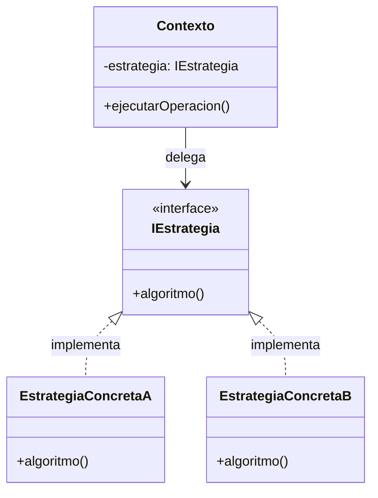

# Dictamen de Asesoría de Patrones de Diseño GoF

**Problema / Elemento Analizado:** {{NOMBRE_DEL_PROBLEMA_O_COMPONENTE}}  
**Punto de Variabilidad Detectado:** {{COMPORTAMIENTO_O_ESTRUCTURA_VARIABLE}}  
**Fecha:** {{FECHA}}  

---

## 1. Fuerzas en Conflicto y Diagnóstico
- **Contexto del Problema:** {{Descripción de la necesidad técnica o funcional}}.
- **Síntomas o Code Smells Observados:** {{ej. Switch statements dependientes de tipo, acoplamiento a SDK externo, etc.}}.
- **Fuerzas de Diseño:**
  - *Fuerza 1 (Flexibilidad requerida):* {{Capacidad de incorporar nuevas variantes sin modificar código existente}}.
  - *Fuerza 2 (Simplicidad y Coste):* {{Evitar la proliferación innecesaria de clases si no hay variación real}}.

---

## 2. Evaluación de Opciones Técnicas

| Opción Evaluada | Descripción Técnica | Pros | Contras / Coste de Indirección | Veredicto |
|---|---|---|---|:---:|
| **Opción 0: Refactor Simple** | Polimorfismo básico o método helper sin patrón | Cero clases extra; máxima simplicidad | No desacopla algoritmos complejos | Descartada / Elegida |
| **Candidato A: {{Patron1}}** | {{Cómo aplicaría el patrón 1}} | {{Ventajas específicas}} | {{Complejidad añadida}} | Descartada / Elegida |
| **Candidato B: {{Patron2}}** | {{Cómo aplicaría el patrón 2}} | {{Ventajas específicas}} | {{Complejidad añadida}} | Descartada / Elegida |

---

## 3. Decisión Justificada y Participantes
- **Patrón Seleccionado:** **{{NOMBRE_PATRON}}** (o *"Ningún patrón GoF"* si se prioriza simplicidad).
- **Justificación de la Elección:** {{Por qué esta solución equilibra mejor las fuerzas en conflicto}}.
- **Mapeo de Participantes Canónicos:**
  - `Contexto / Cliente:` {{Clase del dominio que consume la funcionalidad}}.
  - `Estrategia / Interfaz Abstraída:` `{{InterfaceName}}` con contrato `{{metodo()}}`.
  - `Implementaciones Concretas:` `{{ClaseConcretaA}}`, `{{ClaseConcretaB}}`.

---

## 4. Diagrama Estructural Antes vs. Después (Mermaid)

---

## 5. Consecuencias y Trade-offs Asumidos
- **Beneficios Obtenidos:** Cumplimiento de OCP (Open/Closed Principle), aislamiento de algoritmos.
- **Costes Residuales:** Indirección adicional, mayor cantidad de archivos y necesidad de inyección de dependencias.
