# Guía de Realización de Casos de Uso con Patrones GRASP y GoF (graspSequenceRealizer)

Esta skill define el estándar metodológico, conceptual y de modelado para transformar especificaciones de **Casos de Uso (CU-XX)** en **Realizaciones de Casos de Uso (RCU)** modeladas mediante **Diagramas de Secuencia UML 2.0** (Mermaid y PlantUML), aplicando con rigor los **9 Patrones GRASP** (General Responsibility Assignment Software Patterns) y los **Patrones de Diseño GoF** (Gang of Four) según el estándar de Diseño de Sistemas de Información (DSI - UTN FRC) y la bibliografía de referencia de Craig Larman y Erich Gamma et al.

---

## 1. Fundamentos y Arquitectura de una Realización de Caso de Uso (RCU)

En el Proceso Unificado de Desarrollo (PUD/RUP) y en la metodología de DSI, una **Realización de Caso de Uso** describe cómo un conjunto colaborativo de objetos del software satisface el comportamiento especificado en un caso de uso específico.

### 1.1. Arquitectura de Capas Dinámica (Boundary - Control - Entity + GoF Infrastructure)

Toda interacción en un diagrama de secuencia de DSI se estructura respetando la estricta separación de responsabilidades:

```
[ Actor ] <---> [ :Pantalla / Boundary ] <---> [ :Gestor / Controller ] <---> [ :Entidades / Dominio ]
                                                        |                               |
                                                        +---> [ :DAOs / Pure Fab. ]     +---> [ :Estado / State ]
                                                        +---> [ :Estrategia / Strategy ]+---> [ :Compuesto / Composite ]
                                                        +---> [ :Adaptador / Adapter ] ---> [ :SDK Externo / Adaptee ]
                                                        +---> [ :Publicador / EventBus ] ---> [ :Observadores / Observers ]
                                                        +---> [ :Fabrica / Factory ]
```

1. **Actor (Usuario / Rol de Negocio)**:
   - Dispara eventos de interfaz (clics, selecciones, ingreso de datos, confirmaciones).
   - Es el origen de las interacciones externas hacia la capa de interfaz.

2. **Boundary / Interfaz (`:PantallaX` / `:InterfazX`)**:
   - Representa la ventana, página web o componente visual con el que interactúa el actor.
   - **Responsabilidad única**: Recibir eventos de entrada, solicitar datos al usuario (`pedirX()`, `habilitarVentana()`) y renderizar información (`mostrarX()`, `actualizarGrilla()`).
   - **Regla de oro**: La pantalla **NUNCA** interactúa directamente con las entidades de dominio, con los DAOs ni con los servicios GoF. Toda acción se delega al `Gestor`.

3. **Control / Gestor (`:GestorX` - Patrón GRASP Controlador)**:
   - Es un objeto no visual que coordina y gobierna la ejecución del Caso de Uso específico (Controlador de Caso de Uso).
   - **Responsabilidades**:
     - Mantener el estado transitorio del caso de uso (parámetros seleccionados, listas temporales).
     - Coordinar el flujo de invocaciones según los pasos del Caso de Uso.
     - Solicitar colecciones de entidades a los DAOs o repositorios.
     - Iterar colecciones y delegar lógica de cálculo o filtrado a los **Expertos en Información** o a las **Estrategias GoF**.
     - Resolver dependencias dinámicas mediante **Fábricas GoF**.
     - Ordenar y transformar datos para presentarlos a la pantalla.
     - Comandar la creación de nuevas instancias (`Creator`) y la persistencia.
     - Publicar eventos de dominio hacia **Observadores GoF**.
     - Cerrar el caso de uso (`finCU()`).

4. **Entity / Dominio (`:EntidadX`, `e:EntidadX`)**:
   - Clases que representan conceptos del modelo de dominio del negocio (`Vino`, `Reseña`, `Bodega`, `Factura`, `Llamada`, `Cliente`, `CambioEstado`, `Estado`).
   - Contienen atributos, relaciones y la **lógica de negocio propia** (métodos de validación, cálculos, cambios de estado internos).
   - Aplican el patrón **Experto en Información**: responden preguntas sobre su propio estado y conocen sus relaciones inmediatas.
   - Aplican el patrón **State GoF** delegando el comportamiento variable a objetos de estado encapsulados.

5. **Fabricación Pura / Servicios Técnicos y Patrones GoF (`:VinoDAO`, `:AdaptadorAfip`, `:DomainEventPublisher`, `:FabricaEstrategias`)**:
   - Clases no pertenecientes al dominio creadas para mantener **Alta Cohesión** y **Bajo Acoplamiento** (persistencia, exportación, conectividad externa, despacho de eventos).

---

## 2. Los 9 Patrones GRASP Aplicados al Diagrama de Secuencia

| Patrón GRASP | Definición y Pregunta Clave | Aplicación en el Diagrama de Secuencia |
| :--- | :--- | :--- |
| **1. Experto en Información** *(Information Expert)* | ¿A quién asigno la responsabilidad? Al que posee la información necesaria para llevarla a cabo. | Si se debe calcular el total de una `Factura`, el mensaje `calcularTotal()` va a `Factura`. `Factura` a su vez envía `calcularSubtotal()` a cada `DetalleFactura`. |
| **2. Creador** *(Creator)* | ¿Quién debe crear una nueva instancia de la clase `A`? Quien contiene/agrega a `A`, registra a `A`, usa de cerca a `A` o tiene los datos de inicialización de `A`. | `Llamada` crea `CambioEstado` (`new CambioEstado(...)`). `Factura` crea `DetalleFactura`. El `Gestor` crea DTOs de salida o instancias transaccionales de alto nivel. |
| **3. Controlador / Gestor** *(Controller)* | ¿Quién recibe y orquesta los eventos del sistema? Un objeto que representa el sistema global, subsistema o el Caso de Uso (`GestorCU`). | La `Pantalla` envía `tomarSeleccionX(...)` o `confirmarOperacion()` al `GestorX`. El `Gestor` centraliza la secuencia y no posee interfaz visual. |
| **4. Bajo Acoplamiento** *(Low Coupling)* | ¿Cómo diseño para mantener baja la dependencia y maximizar la reutilización? | La `Pantalla` solo conoce al `Gestor`. El `Gestor` conoce interfaces o entidades raíz pero no detalles íntimos internos. Se evitan cadenas de llamadas (`trenes de mensajes`). |
| **5. Alta Cohesión** *(High Cohesion)* | ¿Cómo mantengo los objetos enfocados, comprensibles y manejables? | Las entidades solo calculan su negocio. Los DAOs solo acceden a datos. El Gestor solo coordina el flujo del CU sin asumir cálculos matemáticos ni renderizado UI. |
| **6. Polimorfismo** *(Polymorphism)* | ¿Cómo manejar comportamientos alternativos según el tipo sin estructuras condicionales explícitas (`switch`/`if`)? | Se envía un mensaje polimórfico a una interfaz o clase base (ej. `calcularDescuento()` sobre `IEstrategiaDescuento`, `procesarPago()` sobre `IPasarelaPago`). |
| **7. Fabricación Pura** *(Pure Fabrication)* | ¿Qué hacer cuando no hay un objeto de dominio apropiado para mantener alta cohesión y bajo acoplamiento? | Se introducen clases técnicas: DAOs (`VinoDAO`), Adaptadores (`AdaptadorMercadoPago`), Despachadores (`DomainEventPublisher`), Exportadores (`GeneradorExcel`). |
| **8. Indirección** *(Indirection)* | ¿Dónde asignar una responsabilidad para evitar acoplamiento directo entre dos componentes? | El `Gestor` intermedia entre la `Pantalla` y el modelo de dominio. Interfaces desacoplan adaptadores externos y publicadores de eventos. |
| **9. Variaciones Protegidas** *(Protected Variations)* | ¿Cómo diseñar objetos para que las variaciones o inestabilidades no impacten negativamente en otros? | Se definen interfaces estables alrededor de puntos de variación (ej. algoritmos de ranking, pasarelas de cobro, servicios de facturación fiscal, motores de exportación). |

---

## 3. Sinergia y Mapeo Conceptual: Patrones GRASP ⟷ Patrones GoF

Los patrones GoF proporcionan soluciones concretas de diseño que se apoyan y realizan directamente sobre los principios GRASP:

```
+--------------------------------------------------------------------------------------------------+
|                                    PRINCIPIOS GRASP FUNDAMENTALES                                |
+------------------------------------+------------------------------------+------------------------+
| • Polimorfismo                     | • Fabricación Pura                 | • Creador              |
| • Variaciones Protegidas           | • Indirección                      | • Experto en Inf.      |
| • Bajo Acoplamiento                | • Alta Cohesión                    | • Controlador          |
+------------------------------------+------------------------------------+------------------------+
                                                 |
                                                 v
+--------------------------------------------------------------------------------------------------+
|                                 PATRONES DE DISEÑO GoF EN SECUENCIA                              |
+-----------------------------+----------------------------------+---------------------------------+
|   Patrones de Comportamiento|      Patrones Estructurales      |       Patrones Creacionales     |
|   --------------------------+----------------------------------+---------------------------------+
|   • Strategy                |      • Adapter                   |       • Factory Method          |
|   • State                   |      • Composite                 |       • Abstract Factory        |
|   • Observer                |      • Decorator                 |       • Builder                 |
|   • Template Method         |      • Facade                    |                                 |
|   • Command                 |                                  |                                 |
+-----------------------------+----------------------------------+---------------------------------+
```

### 3.1. Matriz de Mapeo GRASP ⟷ GoF en Diagramas de Secuencia

| Patrón GoF | Patrones GRASP Subyacentes | Rol en la Secuencia UML | Mensaje Clave Típico en Secuencia |
| :--- | :--- | :--- | :--- |
| **Strategy** | Polimorfismo, Variaciones Protegidas, Alta Cohesión | El contexto/gestor delega un algoritmo variable a una interfaz de estrategia resuelta dinámicamente. | `gestor ->> estrategia: calcularScore(datos)` |
| **Observer** | Bajo Acoplamiento, Indirección, Fabricación Pura | Un sujeto o gestor notifica a una colección de suscriptores sin acoplarse a sus clases concretas. | `publisher ->> observador: onEvent(eventoDominio)` |
| **State** | Polimorfismo, Experto en Información, Variaciones Protegidas | La entidad delega la operación a su estado actual; el estado ejecuta la transición invocando `cambiarEstado()`. | `entidad ->> estadoActual: procesarOperacion(this)` |
| **Adapter** | Fabricación Pura, Indirección, Bajo Acoplamiento | El cliente invoca la interfaz estándar de dominio; el adaptador transforma llamadas hacia el SDK externo incompatible. | `gestor ->> adaptador: exportar(datos)`<br/>`adaptador ->> sdkExterno: generateFileBinary(raw)` |
| **Factory Method / Abstract Factory** | Creador, Polimorfismo, Variaciones Protegidas | Se encapsula la instanciación de familias o variantes de objetos desacoplando al cliente de clases concretas. | `gestor ->> fabrica: crearEstrategia(tipo)`<br/>`create participant estrategia` |
| **Composite** | Polimorfismo, Experto en Información | El invocador trata uniformemente hojas y nodos compuestos; el compuesto itera recursivamente a sus hijos. | `composite ->> hijo: calcularTotal()` |
| **Template Method** | Polimorfismo, Alta Cohesión | La clase base o flujo orquestador ejecuta el algoritmo esqueleto e invoca pasos primitivos que resuelven las subclases. | `this ->> this: pasoFijo()`<br/>`this ->> this: pasoVariablePolimorfico()` |
| **Command** | Indirección, Fabricación Pura, Bajo Acoplamiento | El emisor desacopla la ejecución encapsulando la acción en un objeto comando con método `ejecutar()`. | `invoker ->> comando: ejecutar()`<br/>`comando ->> receptor: realizarAccion()` |

---

## 4. Catálogo de Patrones GoF en Diagramas de Secuencia UML

A continuación se detalla la modelización exacta en **Mermaid** y **PlantUML** de cada patrón GoF aplicado en realizaciones de secuencia:

---

### 4.1. Patrón Strategy (Estrategia) en Secuencia
Se utiliza cuando existen múltiples algoritmos alternativos e intercambiables (ej. cálculo de recargos, scoring, comisiones, validación) evitando sentencias `switch/case` en el Gestor o en la Entidad.

#### Estructura de Interacción:
1. El `Gestor` resuelve la estrategia correspondiente (vía inyección de dependencias o mediante una Fábrica).
2. El `Gestor` invoca el método polimórfico en la interfaz `IEstrategia`.
3. La estrategia concreta evalúa los datos del cliente/entidad y devuelve el resultado.

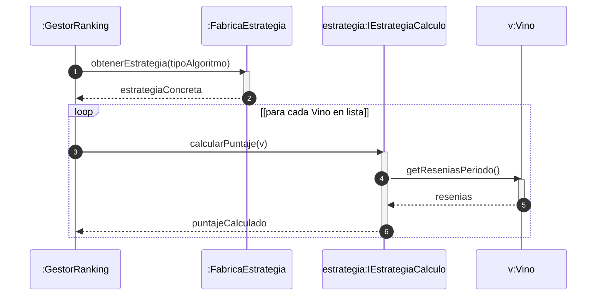

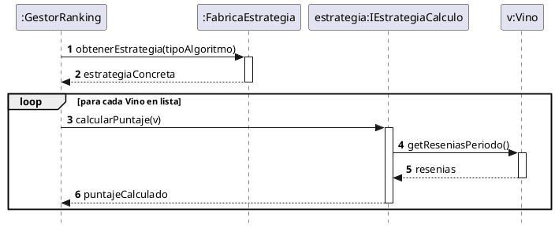

---

### 4.2. Patrón Observer (Publicador / Suscriptor de Eventos) en Secuencia
Se utiliza cuando la concreción de una transacción de negocio debe desencadenar múltiples efectos colaterales desacoplados (auditoría, emails, notificaciones push, refresco en tiempo real por WebSockets).

#### Estructura de Interacción:
1. El `Gestor` concreta la transacción de dominio (`pago.confirmar()`).
2. El `Gestor` crea el `DomainEvent` (`new PagoConfirmadoEvent(...)`).
3. El `Gestor` invoca a la Fabricación Pura `:DomainEventPublisher.publicar(evento)`.
4. El publicador itera su lista de observadores suscriptores (`loop [para cada IObservador]`) invocando `onEvent(evento)`.

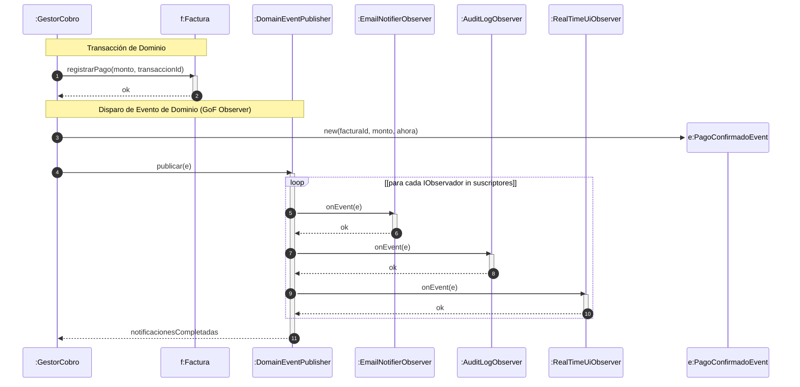

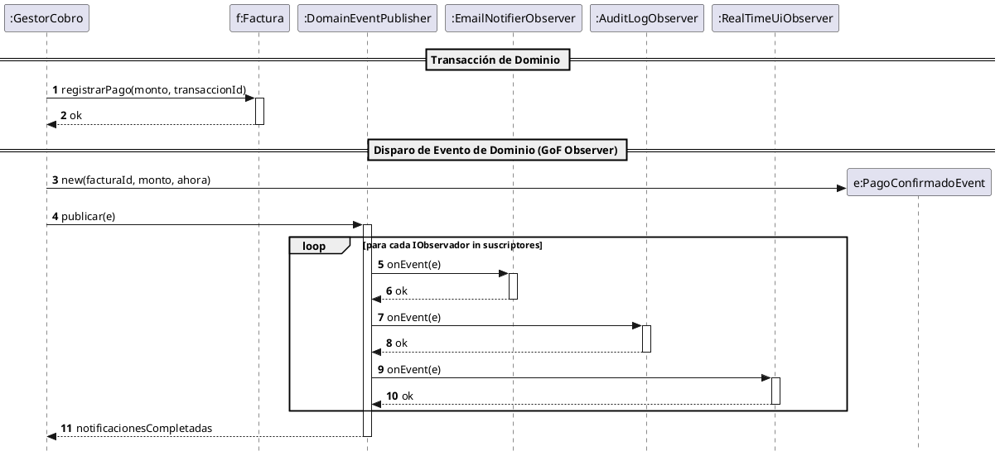

---

### 4.3. Patrón State (Estado Encapsulado) en Secuencia
Se utiliza cuando el comportamiento de una entidad cambia sustancialmente según su estado interno (ej. `OrdenPedido`, `Factura`, `Llamada`), encapsulando las transiciones y validaciones en clases de estado polimórficas.

#### Estructura de Interacción:
1. El `Gestor` solicita una operación a la entidad de contexto (`pedido.confirmar()`).
2. La entidad delega la operación a su instancia actual de estado (`estadoActual.confirmar(this)`).
3. El estado actual valida la operación, crea la nueva instancia del siguiente estado (`create participant estadoPendiente:OrdenPendientePagoState`) y actualiza el contexto (`this.cambiarEstado(nuevoEstado)`).

```mermaid
sequenceDiagram
    autonumber
    participant Gestor as :GestorPedidos
    participant Pedido as p:OrdenPedido
    participant EstadoBorrador as actual:OrdenBorradorState
    participant EstadoPendiente as nuevo:OrdenPendientePagoState

    Gestor ->> Pedido: confirmar()
    activate Pedido
    Pedido ->> EstadoBorrador: confirmar(this)
    activate EstadoBorrador
    EstadoBorrador ->> Pedido: getItemsCount()
    activate Pedido
    Pedido -->> EstadoBorrador: cantidadItems
    deactivate Pedido
    
    create participant EstadoPendiente
    EstadoBorrador ->> EstadoPendiente: new()
    EstadoBorrador ->> Pedido: cambiarEstado(nuevo)
    activate Pedido
    Pedido -->> EstadoBorrador: ok
    deactivate Pedido

    EstadoBorrador -->> Pedido: confirmacionExitosa
    deactivate EstadoBorrador
    Pedido -->> Gestor: pedidoConfirmadoOk
    deactivate Pedido
```

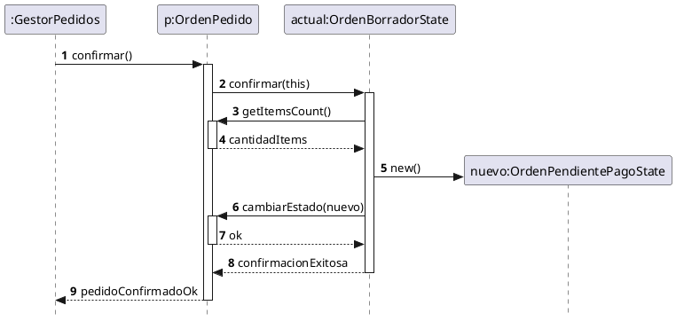

---

### 4.4. Patrón Adapter (Adaptador) en Secuencia
Se utiliza cuando el sistema de software debe interactuar con APIs externas, librerías de terceros (ClosedXML, iText7, SDKs de tarjetas, AFIP) cuyas interfaces no coinciden con las interfaces requeridas por el dominio.

#### Estructura de Interacción:
1. El `Gestor` invoca la interfaz objetivo de dominio (`IAdaptadorExportacion.exportar(datos)` o `IPasarelaPago.procesarPago(datos)`).
2. El `Adaptador` traduce los tipos y estructuras de datos canónicas al formato requerido por el `Adaptee` (SDK de terceros).
3. El `Adaptador` invoca los métodos propietarios del SDK externo y traduce el resultado de retorno o excepciones al formato de dominio.

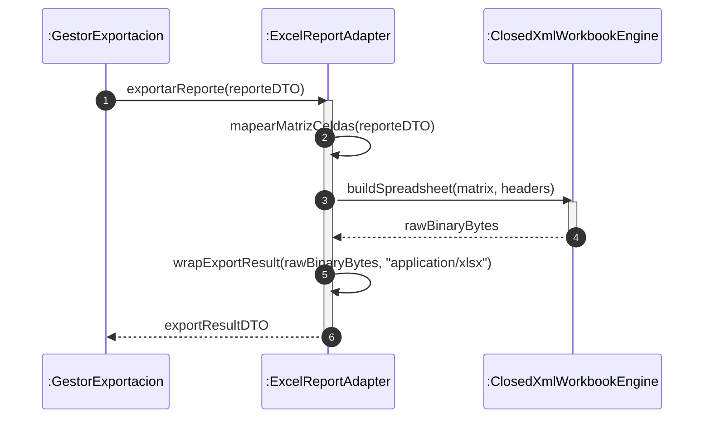

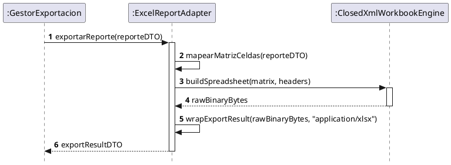

---

### 4.5. Patrón Factory Method / Abstract Factory en Secuencia
Se utiliza para encapsular la instanciación compleja o condicional de objetos polimórficos, protegiendo al Gestor de dependencias con clases concretas.

```mermaid
sequenceDiagram
    autonumber
    participant Gestor as :GestorFacturacion
    participant Fabrica as :ComprobanteFactory
    participant Factura as f:FacturaFiscal

    Gestor ->> Fabrica: crearComprobante(tipoComprobante, cliente, items)
    activate Fabrica
    create participant Factura
    Fabrica ->> Factura: new(numero, cliente, items)
    Fabrica -->> Gestor: f:IComprobante
    deactivate Fabrica
```

---

### 4.6. Patrón Composite, Template Method y Command en Secuencia

#### Composite (Jerarquías Parte-Todo):
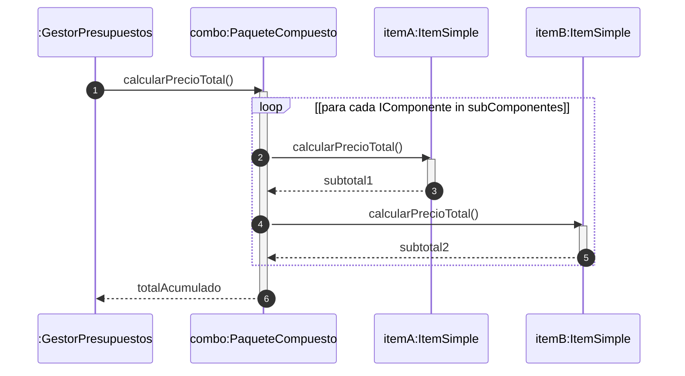

#### Command (Encapsulación de Peticiones y Undo):
```mermaid
sequenceDiagram
    autonumber
    participant UI as :BotonEjecutar
    participant Invocador as :GestorComandos
    participant Comando as cmd:GenerarReporteCommand
    participant Receptor as :ServicioReportes

    UI ->> Invocador: presionarBoton()
    activate Invocador
    create participant Comando
    Invocador ->> Comando: new(receptor, parametros)
    Invocador ->> Comando: ejecutar()
    activate Comando
    Comando ->> Receptor: generarReporteConsolidado(parametros)
    activate Receptor
    Receptor -->> Comando: resultado
    deactivate Receptor
    Comando -->> Invocador: ok
    deactivate Comando
    Invocador -->> UI: operacionCompletada
    deactivate Invocador
```

---

## 5. Protocolo Metodológico: Del Caso de Uso a la Realización de Secuencia

Para transformar una especificación de Caso de Uso (CU-XX) en un Diagrama de Secuencia formal con patrones GRASP y GoF, sigue estrictamente estos 7 pasos:

```
+-------------------------------------------------------------------------------+
| PASO 1: Identificar Disparador y Actores                                      |
| -> Actor ejecuta acción inicial (ej: Seleccionar opción en menú).             |
+-------------------------------------------------------------------------------+
                                      |
                                      v
+-------------------------------------------------------------------------------+
| PASO 2: Trazar Diálogo de Inicio (Pantalla <-> Gestor)                        |
| -> Pantalla invoca opcionCU() en Gestor.                                      |
| -> Gestor solicita a Pantalla pedir datos requeridos (pedirFiltros()).        |
+-------------------------------------------------------------------------------+
                                      |
                                      v
+-------------------------------------------------------------------------------+
| PASO 3: Modelar Entrada y Validación de Datos                                 |
| -> Actor ingresa datos -> Pantalla envía tomarDatos(...) al Gestor.           |
| -> Gestor valida o toma parámetros en memoria.                                |
+-------------------------------------------------------------------------------+
                                      |
                                      v
+-------------------------------------------------------------------------------+
| PASO 4: Orquestación de Búsqueda y Procesamiento de Dominio (GRASP + GoF)     |
| -> Gestor solicita colecciones al DAO/Repositorio (Pure Fabrication).         |
| -> Gestor resuelve Estrategias / Fábricas GoF si el algoritmo varía.          |
| -> Fragmento 'loop': Gestor itera colección e invoca al Experto en Inf.       |
| -> Entidad evalúa condiciones o delega a su Estado GoF (State pattern).       |
| -> Gestor recolecta, ordena y formatea los resultados válidos.               |
+-------------------------------------------------------------------------------+
                                      |
                                      v
+-------------------------------------------------------------------------------+
| PASO 5: Confirmación, Transacción y Creación de Objetos (GRASP Creator)       |
| -> Pantalla muestra resultados y solicita confirmación.                       |
| -> Actor confirma -> Gestor ejecuta transacción (new CambioEstado, etc.).    |
| -> Si interactúa con APIs externas, delega al Adaptador GoF (Adapter).       |
| -> Gestor persiste mediante DAO o actualiza entidades.                        |
+-------------------------------------------------------------------------------+
                                      |
                                      v
+-------------------------------------------------------------------------------+
| PASO 6: Emisión de Eventos Desacoplados (GoF Observer)                        |
| -> Gestor crea DomainEvent y solicita su publicación a DomainEventPublisher.  |
| -> Fragmento 'loop': Publicador notifica a cada suscriptor (Email, UI, Log).  |
+-------------------------------------------------------------------------------+
                                      |
                                      v
+-------------------------------------------------------------------------------+
| PASO 7: Cierre del Caso de Uso (Fin de CU)                                    |
| -> Gestor envía mensaje de éxito a Pantalla.                                  |
| -> Gestor ejecuta finCU() y cierra/libera la pantalla.                       |
+-------------------------------------------------------------------------------+
```

---

## 6. Reglas de Modelado y Asignación de Mensajes

### 6.1. Nomenclatura Estándar DSI para Mensajes

1. **Mensajes de Pantalla hacia Gestor**:
   - `opcionGenerarRanking()`: Disparo del CU.
   - `tomarFechaDesdeHasta(fechaDesde, fechaHasta)`: Ingreso de parámetros.
   - `tomarSeleccionTipoResenia(tipoResenia)`: Selección en combo/lista.
   - `confirmarGeneracionReporte()` / `confirmarOperacion()`: Confirmación final.

2. **Mensajes de Gestor hacia Pantalla**:
   - `pedirFechaDesdeHasta()`: Solicita inputs al usuario.
   - `pedirSeleccionTipoResenia()`: Habilita el control de selección.
   - `mostrarResultados(datos)` / `mostrarDatosLlamada(...)`: Renderiza información.
   - `pedirConfirmacion()`: Despliega diálogo de confirmación.

3. **Mensajes de Gestor hacia DAOs / Fabricaciones Puras**:
   - `obtenerVinos()` / `buscarLlamadasIniciadas()`: Recuperación de colecciones desde la BD.
   - `guardar(entidad)` / `actualizar(llamada)`: Persistencia del cambio.

4. **Mensajes hacia Componentes GoF**:
   - `estrategia.calcularPuntaje(entidad)`: Invocación polimórfica de estrategia (*Strategy*).
   - `entidad.cambiarEstado(nuevoEstado)`: Transición polimórfica de estado (*State*).
   - `adaptador.exportar(datos)` / `adaptador.autorizarPago(datos)`: Intermediación técnica (*Adapter*).
   - `publisher.publicar(evento)`: Emisión de eventos de dominio (*Observer*).
   - `fabrica.crear(tipo)`: Creación desacoplada (*Factory*).

5. **Regla contra la Violación de la Ley de Demeter**:
   - ❌ **Incorrecto**: `gestor.vino.getBodega().getRegionVitivinicola().getPais().getNombre()` (Acoplamiento extremo).
   - ✔️ **Correcto**: `gestor -> vino.getBodega()` -> `bodega -> getPais()` -> `pais.getNombre()` o empaquetado en `vino.getDatosRanking()`.

---

## 7. Sintaxis Formal de Fragmentos Combinados UML 2.0

### 7.1. Bucle de Iteración (`loop`)
Se utiliza para recorrer colecciones de objetos o listas recuperadas.
- **Sintaxis Mermaid**:
  ```mermaid
  loop [para cada Vino en listaVinos]
      gestor ->> vino: calcularPuntajePromedio(fechaDesde, fechaHasta, tipoResenia)
      activate vino
      loop [para cada Reseña en resenias]
          vino ->> resenia: estaEnPeriodo(fechaDesde, fechaHasta)
          resenia -->> vino: boolean
      end
      vino -->> gestor: puntajePromedio
      deactivate vino
  end
  ```

### 7.2. Bifurcación Alternativa (`alt` / `else`)
Se utiliza para flujos mutuamente excluyentes (ej. si el puntaje es mayor a 0 vs igual a 0).
- **Sintaxis Mermaid**:
  ```mermaid
  alt [puntajePromedio > 0]
      gestor ->> ranking: add(vino, puntajePromedio)
  else [puntajePromedio == 0]
      Note over gestor: Descartar vino del ranking
  end
  ```

### 7.3. Opción Condicional (`opt`)
Se utiliza para acciones opcionales sin rama alternativa obligatoria (ej. si el usuario seleccionó exportar a Excel).
- **Sintaxis Mermaid**:
  ```mermaid
  opt [tipoArchivo == "Excel"]
      gestor ->> exportador: generarArchivoExcel(datosTop10)
      exportador -->> gestor: confirmacion
  end
  ```

### 7.4. Ejecución Concurrente / Paralela (`par`)
Se utiliza para modelar notificaciones o procesos simultáneos e independientes.
- **Sintaxis Mermaid**:
  ```mermaid
  par [Notificar Email]
      publisher ->> emailObserver: onEvent(e)
  and [Auditar en BD]
      publisher ->> auditObserver: onEvent(e)
  end
  ```

### 7.5. Referencia a Otro Caso de Uso (`ref`)
Se utiliza para invocar o incluir otro Caso de Uso (ej. `<<include>> CU-XX`).
- **Sintaxis PlantUML**:
  ```plantuml
  ref over gestor, pantalla : CU-05: Iniciar Sesión de Usuario
  ```

---

## 8. Ejemplos Maestros de Casos Reales DSI

---

### CASO REAL 1: CU-01 Generar Ranking de Vinos (Proyecto BonVino)

#### A. Especificación Sintética del CU
1. El **Sommelier/Usuario** selecciona la opción *"Generar Ranking de Vinos"*.
2. La **Pantalla** solicita el período de fechas (Desde - Hasta).
3. El usuario ingresa las fechas y la pantalla las toma y envía al **Gestor**.
4. El gestor solicita el tipo de reseña a considerar (*"Reseñas de Sommelier"* o *"Reseñas Generales"*).
5. El usuario selecciona el tipo de reseña y la forma de visualización (*Excel* / *Pantalla*).
6. El gestor busca todos los vinos a través de `VinoDAO`.
7. Por cada vino, le solicita calcular su puntaje promedio para el período y tipo de reseña indicados delegando a `Resenia` (`estaEnPeriodo()`, `sosDeSommelier()`).
8. El gestor ordena los vinos descendentemente por puntaje promedio y toma los 10 mejores.
9. El gestor obtiene los datos complementarios de cada vino (`Bodega`, `Varietales`, `Región Vitivinícola`, `País`).
10. Si seleccionó Excel, el gestor utiliza una `Fabricación Pura / Adaptador` (`GeneradorExcelAdapter` que encapsula la librería externa `ClosedXML`) para generar el archivo.
11. Se informa al usuario y concluye el CU.

#### B. Diagrama de Secuencia en Mermaid

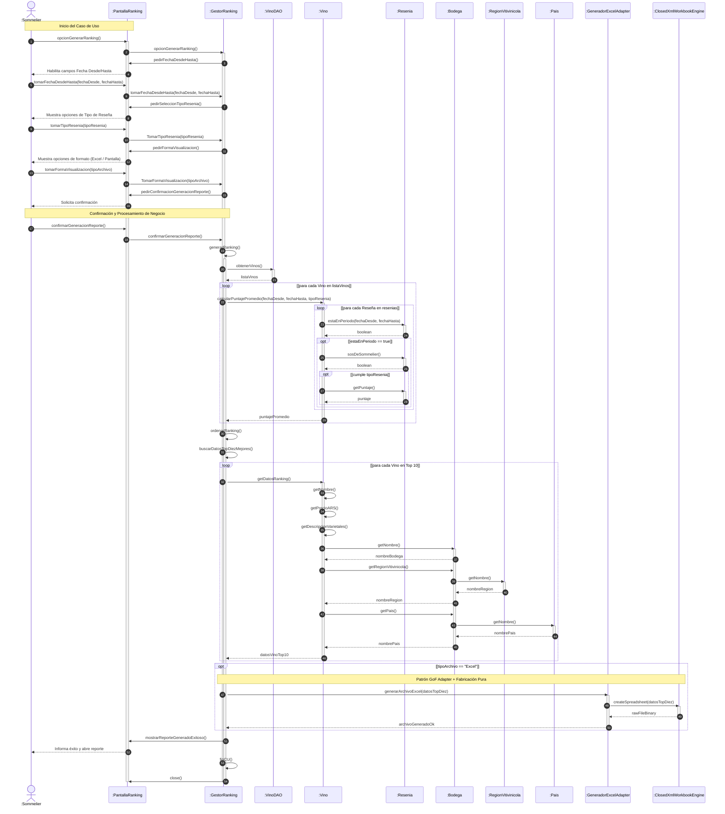

#### C. Diagrama de Secuencia en PlantUML

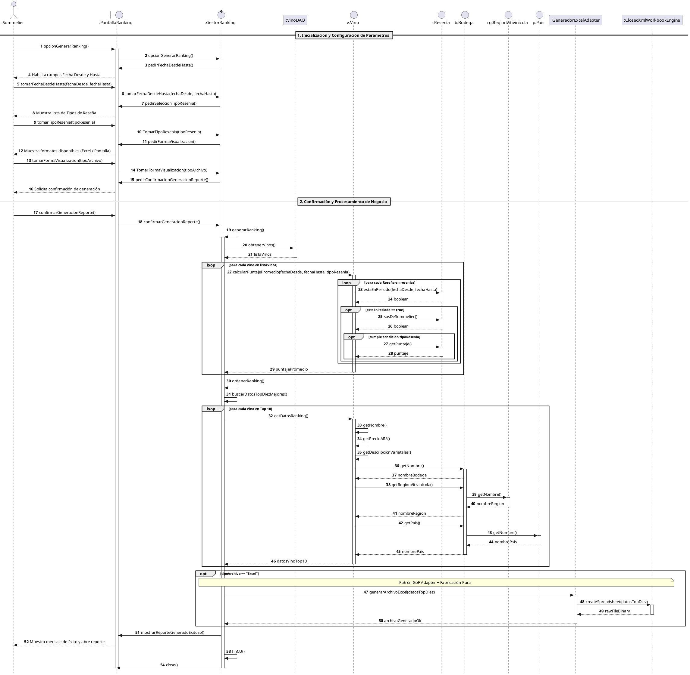

---

### CASO REAL 2: CU-02 Registrar Respuesta de Operador a Llamada (Proyecto IVR)

#### A. Especificación Sintética del CU
1. El **Operador** selecciona una llamada en espera en la pantalla del sistema de voz.
2. La **Pantalla** envía la selección al **GestorLlamada**.
3. El gestor recupera la llamada seleccionada y solicita sus datos (`Cliente`, `Subopción`, `Validaciones`).
4. La llamada calcula su duración y obtiene el estado actual navegando sus `CambiosEstado`.
5. El gestor solicita a la pantalla mostrar los datos de la llamada y el formulario de respuesta.
6. El operador ingresa la respuesta brindada al cliente y confirma.
7. El gestor le indica a la llamada finalizar la atención.
8. La llamada invoca el patrón **Creator** para instanciar un nuevo `CambioEstado` con estado *"Finalizada"* y fecha/hora actual, cerrando el estado anterior.
9. El gestor persiste la llamada actualizada a través del `LlamadaDAO`.
10. Se notifica al operador y finaliza el CU.

#### B. Diagrama de Secuencia en Mermaid

```mermaid
sequenceDiagram
    autonumber
    actor Operador as :Operador
    participant Pantalla as :PantallaAtencionLlamada
    participant Gestor as :GestorAtencionLlamada
    participant DAO as :LlamadaDAO
    participant Llamada as :Llamada
    participant CE_Ant as ceActual:CambioEstado
    participant CE_Nuevo as ceNuevo:CambioEstado
    participant Estado as :Estado
    participant Cliente as :Cliente

    Note over Operador, Pantalla: Selección de Llamada
    Operador ->> Pantalla: seleccionarLlamada(idLlamada)
    activate Pantalla
    Pantalla ->> Gestor: tomarSeleccionLlamada(idLlamada)
    activate Gestor

    Gestor ->> DAO: buscarLlamadaPorId(idLlamada)
    activate DAO
    DAO -->> Gestor: llamadaSeleccionada
    deactivate DAO

    Gestor ->> Llamada: getDatosLlamada()
    activate Llamada
    Llamada ->> Cliente: getNombreCompleto()
    activate Cliente
    Cliente -->> Llamada: nombreCliente
    deactivate Cliente
    
    Llamada ->> Llamada: getEstadoActual()
    loop [para cada CambioEstado en cambiosEstado]
        Llamada ->> CE_Ant: esEstadoActual()
        activate CE_Ant
        CE_Ant -->> Llamada: boolean
        deactivate CE_Ant
    end
    
    Llamada ->> CE_Ant: getNombreEstado()
    activate CE_Ant
    CE_Ant ->> Estado: getNombre()
    activate Estado
    Estado -->> CE_Ant: "Iniciada"
    deactivate Estado
    CE_Ant -->> Llamada: "Iniciada"
    deactivate CE_Ant

    Llamada -->> Gestor: datosLlamadaDTO
    deactivate Llamada

    Gestor ->> Pantalla: mostrarDatosLlamada(datosLlamadaDTO)
    Pantalla -->> Operador: Renderiza ficha de llamada y caja de respuesta

    Note over Operador, Gestor: Registro de Respuesta y Cambio de Estado
    Operador ->> Pantalla: tomarRespuestaOperador(descripcionRespuesta)
    Pantalla ->> Gestor: tomarRespuestaOperador(descripcionRespuesta)
    
    Operador ->> Pantalla: confirmarFinalizacionLlamada()
    Pantalla ->> Gestor: confirmarFinalizacionLlamada()

    Gestor ->> Llamada: registrarRespuesta(descripcionRespuesta)
    activate Llamada
    Llamada ->> Llamada: setDescripcionOperador(descripcionRespuesta)
    Llamada ->> DAO: buscarEstadoFinalizada()
    activate DAO
    DAO -->> Llamada: estadoFinalizada
    deactivate DAO

    Llamada ->> CE_Ant: setFechaHoraFin(ahora)
    activate CE_Ant
    deactivate CE_Ant

    Note over Llamada, CE_Nuevo: GRASP Creador (Llamada crea CambioEstado)
    create participant CE_Nuevo
    Llamada ->> CE_Nuevo: new(ahora, estadoFinalizada)
    Llamada ->> Llamada: agregarCambioEstado(ceNuevo)
    Llamada ->> Llamada: calcularDuracion()
    Llamada -->> Gestor: llamadaFinalizadaOk
    deactivate Llamada

    Gestor ->> DAO: actualizarLlamada(llamadaSeleccionada)
    activate DAO
    DAO -->> Gestor: ok
    deactivate DAO

    Gestor ->> Pantalla: mostrarConfirmacionFinalizacion()
    Pantalla -->> Operador: Muestra alerta de éxito y limpia pantalla
    Gestor ->> Gestor: finCU()
    Gestor ->> Pantalla: close()
    deactivate Gestor
    deactivate Pantalla
```

---

### CASO REAL 3: CU-03 Procesar Pago y Facturación Multicanal (Patrones GoF Strategy + State + Observer + Adapter)

#### A. Especificación Sintética del CU
1. El **Cajero / Cliente** selecciona *"Procesar Pago de Factura"* e ingresa el ID de factura y el método de cobro (*Tarjeta*, *MercadoPago*, *Efectivo*).
2. La **PantallaCobro** envía la solicitud al **GestorCobro**.
3. El gestor recupera la `Factura` a través de `FacturaDAO`.
4. La factura delega el cálculo de recargos/descuentos a una **Estrategia GoF** (`IEstrategiaDescuento`) resuelta polimórficamente.
5. El gestor procesa la transacción de cobro a través del **Adaptador GoF** (`IPasarelaPagoAdapter` que encapsula la API externa del banco).
6. Al autorizarse el cobro, la `Factura` delega su transición de estado a su objeto de **Estado GoF** (`actual:FacturaPendientePagoState`), quien crea la instancia `nueva:FacturaPagadaState` y ejecuta `factura.cambiarEstado(nueva)`.
7. El gestor solicita al **Adaptador GoF de AFIP** (`IAdaptadorAfipFiscal`) generar el CAE y número de comprobante fiscal ante el organismo tributario.
8. El gestor persiste la factura actualizada en `FacturaDAO`.
9. El gestor dispara el **Publicador de Eventos GoF (Observer)** (`DomainEventPublisher.publicar(PagoConfirmadoEvent)`), notificando en paralelo al `EmailNotifierObserver`, `AuditLogObserver` y `RealTimeUiObserver`.
10. Se informa éxito a la pantalla y finaliza el CU.

#### B. Diagrama de Secuencia en Mermaid

```mermaid
sequenceDiagram
    autonumber
    actor Cajero as :Cajero
    participant Pantalla as :PantallaCobro
    participant Gestor as :GestorCobro
    participant DAO as :FacturaDAO
    participant Factura as f:Factura
    participant Estrategia as est:IEstrategiaDescuento
    participant PasarelaAdapter as :MercadoPagoAdapter
    participant ApiExternaMP as :MercadoPagoSdk
    participant EstadoAnt as actual:FacturaPendienteState
    participant EstadoNuevo as nuevo:FacturaPagadaState
    participant AfipAdapter as :AfipFiscalAdapter
    participant Publisher as :DomainEventPublisher
    participant ObsEmail as :EmailNotifierObserver
    participant ObsAudit as :AuditLogObserver

    Note over Cajero, Pantalla: 1. Ingreso y Selección de Pago
    Cajero ->> Pantalla: ingresarDatosPago(facturaId, "MercadoPago")
    activate Pantalla
    Pantalla ->> Gestor: tomarDatosPago(facturaId, "MercadoPago")
    activate Gestor

    Gestor ->> DAO: buscarFacturaPorId(facturaId)
    activate DAO
    DAO -->> Gestor: f:Factura
    deactivate DAO

    Note over Gestor, Estrategia: 2. GoF Strategy: Cálculo de Descuento/Recargo
    Gestor ->> Factura: calcularMontoFinal("MercadoPago")
    activate Factura
    Factura ->> Estrategia: calcularMontoConDescuento(montoBase)
    activate Estrategia
    Estrategia -->> Factura: montoFinalConRecargo
    deactivate Estrategia
    Factura -->> Gestor: montoTotal
    deactivate Factura

    Gestor ->> Pantalla: pedirConfirmacionCobro(montoTotal)
    Pantalla -->> Cajero: Muestra resumen y pide confirmar

    Note over Cajero, Gestor: 3. Confirmación y Autorización Externa (GoF Adapter)
    Cajero ->> Pantalla: confirmarPago()
    Pantalla ->> Gestor: confirmarPago()

    Gestor ->> PasarelaAdapter: autorizarTransaccion(montoTotal, "MercadoPago")
    activate PasarelaAdapter
    PasarelaAdapter ->> ApiExternaMP: processPaymentApi(montoTotal)
    activate ApiExternaMP
    ApiExternaMP -->> PasarelaAdapter: { "status": "APPROVED", "txId": "MP-98432" }
    deactivate ApiExternaMP
    PasarelaAdapter -->> Gestor: transaccionAprobadaDTO
    deactivate PasarelaAdapter

    Note over Gestor, EstadoNuevo: 4. GoF State: Transición Polimórfica de Estado
    Gestor ->> Factura: registrarPago("MP-98432", ahora)
    activate Factura
    Factura ->> EstadoAnt: registrarPago(this, "MP-98432", ahora)
    activate EstadoAnt
    create participant EstadoNuevo
    EstadoAnt ->> EstadoNuevo: new("MP-98432", ahora)
    EstadoAnt ->> Factura: cambiarEstado(nuevo)
    activate Factura
    Factura -->> EstadoAnt: ok
    deactivate Factura
    EstadoAnt -->> Factura: estadoActualizadoOk
    deactivate EstadoAnt
    Factura -->> Gestor: facturaPagadaOk
    deactivate Factura

    Note over Gestor, AfipAdapter: 5. GoF Adapter: Facturación Fiscal Electrónica AFIP
    Gestor ->> AfipAdapter: emitirComprobanteFiscal(f)
    activate AfipAdapter
    AfipAdapter -->> Gestor: datosFiscalesCAE
    deactivate AfipAdapter

    Gestor ->> DAO: actualizarFactura(f)
    activate DAO
    DAO -->> Gestor: ok
    deactivate DAO

    Note over Gestor, ObsAudit: 6. GoF Observer: Notificación Desacoplada de Eventos
    create participant Evento as e:PagoConfirmadoEvent
    Gestor ->> Evento: new(facturaId, montoTotal, "MP-98432", ahora)
    Gestor ->> Publisher: publicar(e)
    activate Publisher

    loop [para cada IObservador in suscriptores]
        Publisher ->> ObsEmail: onEvent(e)
        activate ObsEmail
        ObsEmail -->> Publisher: ok
        deactivate ObsEmail

        Publisher ->> ObsAudit: onEvent(e)
        activate ObsAudit
        ObsAudit -->> Publisher: ok
        deactivate ObsAudit
    end
    Publisher -->> Gestor: notificacionesCompletadas
    deactivate Publisher

    Note over Gestor, Cajero: 7. Cierre de Caso de Uso
    Gestor ->> Pantalla: mostrarComprobanteExitoso(datosFiscalesCAE)
    Pantalla -->> Cajero: Muestra factura emitida y ticket
    Gestor ->> Gestor: finCU()
    Gestor ->> Pantalla: close()
    deactivate Gestor
    deactivate Pantalla
```

#### C. Diagrama de Secuencia en PlantUML

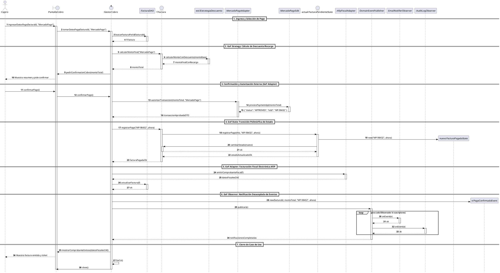

#### D. Tabla de Justificación GRASP + GoF Mensaje por Mensaje (CU-03)

| N° | Mensaje / Operación | Emisor | Receptor | Patrón GRASP / GoF | Justificación Teórica y Racional de Diseño |
| :---: | :--- | :--- | :--- | :--- | :--- |
| **1** | `ingresarDatosPago(id, medio)` | `:Cajero` | `:PantallaCobro` | **Boundary (GRASP)** | Captura de entrada del usuario en la capa de presentación. |
| **2** | `tomarDatosPago(id, medio)` | `:PantallaCobro` | `:GestorCobro` | **Controlador (GRASP)** | La pantalla delega el inicio y orquestación al gestor. |
| **3** | `buscarFacturaPorId(id)` | `:GestorCobro` | `:FacturaDAO` | **Fabricación Pura (GRASP)** | El acceso a datos se aísla en el componente de persistencia. |
| **4** | `calcularMontoFinal(medio)` | `:GestorCobro` | `f:Factura` | **Experto en Inf. (GRASP)** | `Factura` conoce su subtotal y delega el recargo específico. |
| **5** | `calcularMontoConDescuento(m)` | `f:Factura` | `est:IEstrategiaDescuento` | **Strategy (GoF) / Polimorfismo (GRASP)** | El cálculo de descuentos/recargos es polimórfico e intercambiable según el medio de pago. |
| **6** | `autorizarTransaccion(monto)` | `:GestorCobro` | `:MercadoPagoAdapter` | **Adapter (GoF) / Indirección (GRASP)** | Desacopla la lógica del sistema del SDK propietario de MercadoPago. |
| **7** | `processPaymentApi(monto)` | `:MercadoPagoAdapter` | `:MercadoPagoSdk` | **Adaptee (GoF)** | Invocación al servicio externo real de terceros. |
| **8** | `registrarPago(txId, ahora)` | `:GestorCobro` | `f:Factura` | **Experto en Inf. (GRASP)** | `Factura` gobierna sus atributos y su ciclo de vida. |
| **9** | `registrarPago(this, txId)` | `f:Factura` | `actual:FacturaPendienteState` | **State (GoF) / Variaciones Prot. (GRASP)** | El comportamiento y validación de cobro dependen del estado actual. |
| **10**| `new("MP-98432", ahora)` | `actual:FacturaPendienteState` | `nuevo:FacturaPagadaState` | **Creador (GRASP) / State (GoF)** | El estado actual transiciona creando la instancia del nuevo estado válido. |
| **11**| `cambiarEstado(nuevo)` | `actual:FacturaPendienteState` | `f:Factura` | **State (GoF)** | Se actualiza la referencia de estado en el contexto de la factura. |
| **12**| `emitirComprobanteFiscal(f)`| `:GestorCobro` | `:AfipFiscalAdapter` | **Adapter (GoF) / Fabricación Pura** | Aísla los WebServices SOAP/REST de la AFIP del dominio de la aplicación. |
| **13**| `new(...)` | `:GestorCobro` | `e:PagoConfirmadoEvent` | **Creador (GRASP)** | Creación del DTO inmutable de evento de dominio. |
| **14**| `publicar(e)` | `:GestorCobro` | `:DomainEventPublisher` | **Observer (GoF) / Bajo Acoplamiento** | El gestor notifica sin conocer a los suscriptores concretos. |
| **15**| `onEvent(e)` | `:DomainEventPublisher` | `IObservador` | **Observer (GoF) / Polimorfismo** | Ejecución desacoplada y concurrente de suscriptores (Email, Auditoría, UI). |
| **16**| `finCU()` | `:GestorCobro` | `:GestorCobro` | **Controlador (GRASP)** | Cierre formal y liberación de recursos del CU. |

---

## 9. Catálogo de Antipatrones en Diagramas de Secuencia (Qué Evitar)

1. 🚫 **El Gestor Dios (God Gestor)**:
   - *Error*: El gestor pide todos los getters (`getFecha()`, `getPuntaje()`, `getTipo()`) y realiza él mismo los `if`, las fórmulas matemáticas o los `switch` de tipo.
   - *Solución*: Aplicar **Experto en Información** y **Strategy GoF**. Enviar un mensaje con la orden de cálculo a la entidad o a la interfaz de estrategia polimórfica.

2. 🚫 **Switch Statements en Cascada en Secuencia**:
   - *Error*: Modelar fragmentos `alt` con 6 ramas (`alt [tipo == "A"] ... else [tipo == "B"] ...`) para ejecutar diferentes algoritmos de negocio en el gestor.
   - *Solución*: Reemplazar las ramas condicionales por la resolución polimórfica de una **Estrategia GoF** (`IEstrategia.calcular()`).

3. 🚫 **Acoplamiento Directo Pantalla - Entidad / Servicios**:
   - *Error*: La `Pantalla` envía mensajes directamente a `Factura`, `Vino` o `MercadoPagoSdk` sin pasar por el `Gestor`.
   - *Solución*: Todo evento de usuario va a la `Pantalla`, la pantalla lo traslada al `Gestor`, y el gestor se comunica con el modelo de dominio y adaptadores (**Indirección** y **Controlador**).

4. 🚫 **Trenes de Mensajes (Violación de Demeter)**:
   - *Error*: `gestor -> vino.getBodega().getRegion().getPais().getNombre()`.
   - *Solución*: Delegación paso a paso entre objetos vecinos inmediatos o métodos consolidados de extracción de datos.

5. 🚫 **Acoplamiento Rígido a SDKs y APIs de Terceros**:
   - *Error*: El Gestor o la Entidad invocan directamente métodos de librerías externas (`ClosedXML.save()`, `MercadoPagoSdk.charge()`).
   - *Solución*: Interponer un **Adaptador GoF** (`IPasarelaPagoAdapter`, `IReporteExportadorAdapter`) con interfaces puras del dominio (**Fabricación Pura** e **Indirección**).

6. 🚫 **Notificaciones en Cascada Sincrónicas Acopladas**:
   - *Error*: El Gestor invoca sucesivamente a `EmailService.enviar()`, `AuditLogger.log()`, `PushNotifier.enviar()`, rompiendo la cohesión.
   - *Solución*: Aplicar **Observer GoF** publicando un evento de dominio (`DomainEventPublisher.publicar(evento)`).

---

## 10. Checklist de Verificación de Calidad para el Diagrama de Secuencia (20 Puntos)

Antes de dar por aprobada una Realización de Caso de Uso en Diagrama de Secuencia, verifica cada uno de los siguientes 20 puntos:

- [ ] **1. Líneas de Vida y Roles**: Se identifican claramente los roles (`Actor`, `:Pantalla`, `:Gestor`, `:DAO`, `:Entidades`, `:Estrategias`, `:Adaptadores`, `:Observadores`).
- [ ] **2. Inicio del CU**: El actor interactúa únicamente con la `Pantalla` mediante `opcionX()`.
- [ ] **3. Delegación al Gestor**: La `Pantalla` delega de inmediato el inicio al `Gestor` (`gestor.opcionX()`).
- [ ] **4. Solicitud de Datos**: El `Gestor` solicita a la `Pantalla` habilitar o pedir los datos requeridos (`pedirX()`).
- [ ] **5. Toma de Datos**: La `Pantalla` transfiere los inputs del usuario al `Gestor` (`tomarX(...)`).
- [ ] **6. Fabricación Pura**: Las consultas a BD se canalizan a través de `DAOs` o Repositorios, nunca directamente por las entidades.
- [ ] **7. Experto en Información**: Los cálculos y filtros de negocio son ejecutados por las entidades poseedoras de los datos.
- [ ] **8. Estrategias GoF (Strategy)**: Los algoritmos variables se delegan polimórficamente a interfaces `IEstrategia`, evitando sentencias `switch` masivas.
- [ ] **9. Estados GoF (State)**: Los comportamientos y transiciones dependientes del ciclo de vida se delegan a objetos de estado polimórficos (`actual:EstadoX`).
- [ ] **10. Adaptadores GoF (Adapter)**: Las librerías de terceros y APIs externas (SDKs, pasarelas, AFIP, ClosedXML) están encapsuladas tras interfaces de adaptador.
- [ ] **11. Observadores GoF (Observer)**: Los efectos colaterales y notificaciones posteriores a una transacción se despachan mediante publicación de eventos de dominio desacoplados.
- [ ] **12. Fábricas GoF (Factory)**: La instanciación de familias o variantes de objetos complejos se aísla en fábricas especializadas.
- [ ] **13. Fragmentos Combinados**: Los bucles sobre colecciones usan `loop` y las bifurcaciones usan `alt`/`opt` con guardas claras (`[condición]`).
- [ ] **14. Creador (Creator)**: Las nuevas instancias (ej. `CambioEstado`, `DetalleFactura`, `DomainEvent`) son creadas por las clases que las contienen o agregan.
- [ ] **15. Bajo Acoplamiento**: La pantalla no conoce a las entidades de dominio, a los DAOs ni a los servicios técnicos externos.
- [ ] **16. Ley de Demeter**: No existen llamadas encadenadas que salten intermediarios.
- [ ] **17. Persistencia Transaccional**: Las modificaciones de estado se confirman y guardan en el DAO tras la confirmación del usuario.
- [ ] **18. Feedback al Usuario**: Se incluye el mensaje de éxito o presentación de resultados hacia la pantalla.
- [ ] **19. Fin del Caso de Uso**: Se modela explícitamente `gestor.finCU()` y el cierre/liberación de la pantalla (`pantalla.close()`).
- [ ] **20. Tabla Justificación GRASP + GoF**: Cada mensaje relevante cuenta con su patrón GRASP y/o GoF justificado teóricamente.
