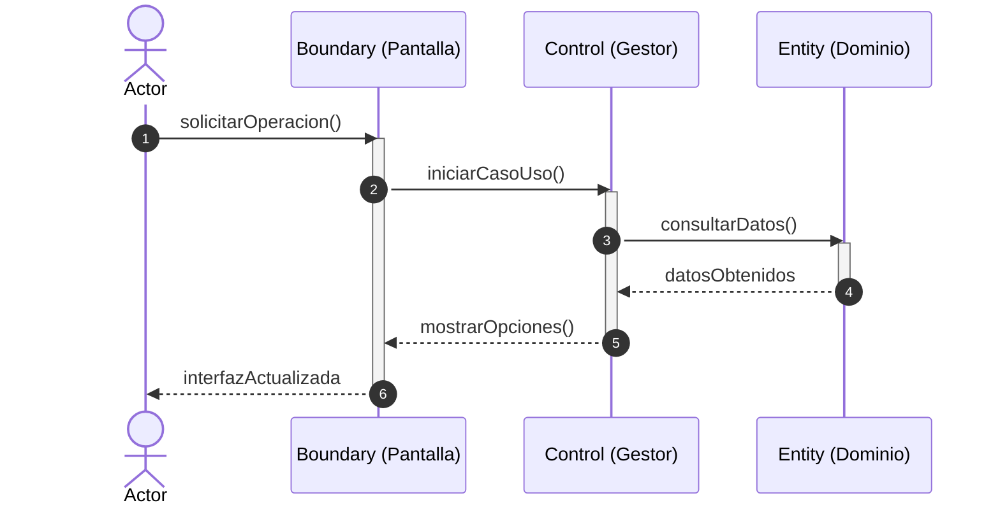

# Realización de Caso de Uso de Análisis (RCU Lógica BCE)

**Caso de Uso:** `CU-{{NUMERO}}` {{NOMBRE_DEL_CASO_USO}}  
**Modo:** `analysis-rcu` (Enfoque conceptual BCE y 5 GRASP básicos)  
**Actor Principal:** {{NOMBRE_ACTOR}}  
**Fecha:** {{FECHA}}  

---

## 1. Alcance, Precondiciones y Supuestos
- **Precondiciones:** {{Estado previo requerido del sistema}}.
- **Garantía de Éxito:** {{Resultado observable y persistido}}.
- **Supuestos de Análisis:** {{Decisiones lógicas asumidas ante omisiones del CU}}.

---

## 2. Participantes BCE y Asignación GRASP Básica
| Rol BCE | Nombre del Participante | Responsabilidad Lógica Asignada | Justificación GRASP (5 Básicos) |
|---|---|---|---|
| `Actor` | `{{Actor}}` | Dispara el flujo y provee datos de entrada | Agente iniciador externo |
| `Boundary` | `{{PantallaOInterfaz}}` | Captura eventos y muestra información | Separación de presentación |
| `Control` | `{{Gestor}}` | Coordina la ejecución y flujo del CU | **Controlador** de Caso de Uso |
| `Entity` | `{{EntidadExperta}}` | Conoce los datos propios y realiza cálculos | **Experto en Información** |
| `Entity` | `{{EntidadCreadora}}` | Instancia entidades transaccionales hijas | **Creador** |

---

## 3. Diagrama de Secuencia Lógico (Mermaid)

---

## 4. Matriz de Trazabilidad Lógica
| Paso CU | Mensaje Lógico | Emisor | Receptor | Justificación GRASP |
|---|---|---|---|---|
| 1 | `solicitarOperacion()` | Actor | Boundary | Captura de intención |
| 2 | `iniciarCasoUso()` | Boundary | Gestor | Delegación a Controlador |
| 3 | `consultarDatos()` | Gestor | Entidad | Experto en Información |
