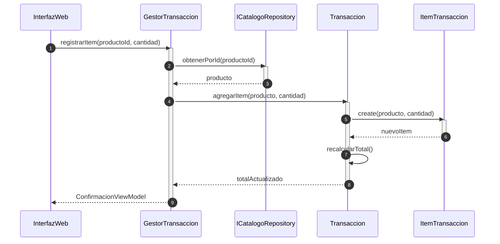

# Realización de Caso de Uso de Diseño (RCU Física DCD)

**Caso de Uso:** `CU-{{NUMERO}}` {{NOMBRE_DEL_CASO_USO}}  
**Modo:** `design-rcu` (Contratos físicos, visibilidad formal y patrones GRASP/GoF)  
**Contrato / DCD Asociado:** {{REFERENCIA_AL_DCD}}  
**Fecha:** {{FECHA}}  

---

## 1. Alineación Técnica con DCD
- **Clases Concretas Involucradas:** {{Lista de clases físicas del DCD}}.
- **Interfaces / Contratos:** {{Interfaces polimórficas o puertos}}.
- **Estrategia de Transacción:** {{Límites transaccionales y atomicidad}}.

---

## 2. Participantes Físicos y Mecanismo de Visibilidad
| Objeto Físico | Clase / Interfaz en DCD | Tipo de Visibilidad Justificada | Rol / Patrón Aplicado |
|---|---|---|---|
| `gestor` | `GestorTransaccion` | Instancia de servicio de aplicación | Controlador / Orquestador |
| `catalogo` | `ICatalogoRepository` | Atributo persistente / inyectado | Fabricación Pura / Puerto |
| `item` | `ItemTransaccion` | Creación local por el agregado | Creador / Agregado |

---

## 3. Diagrama de Secuencia Físico (Mermaid)

---

## 4. Matriz de Trazabilidad de Diseño
| Paso CU | Mensaje Físico con Firma Completa | Receptor | Visibilidad | Patrón Justificado |
|---|---|---|---|---|
| 2 | `obtenerPorId(id: UUID): Producto` | `ICatalogoRepository` | Atributo | Fabricación Pura |
| 3 | `agregarItem(p: Producto, c: int): void` | `Transaccion` | Parámetro | Experto / Creador |
| 4 | `create(p: Producto, c: int)` | `ItemTransaccion` | Creación | Creador |
