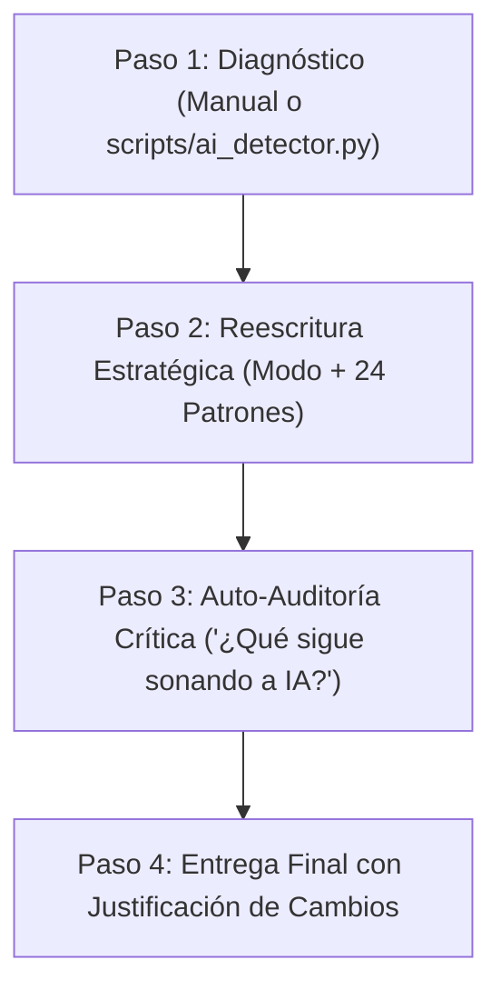
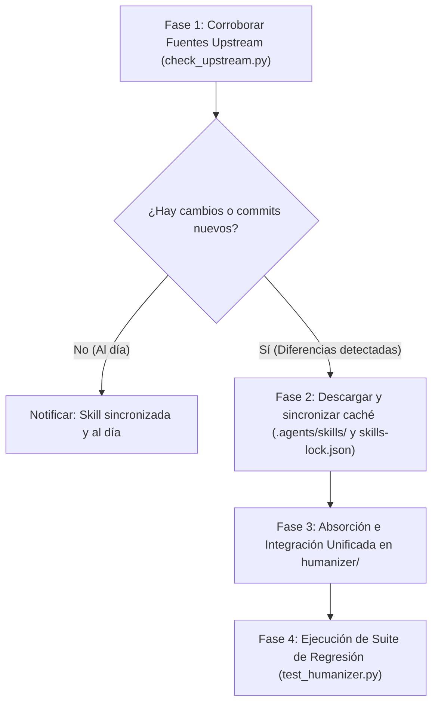

# Humanizer: Desintoxicación y Refinamiento de Salidas de IA

Esta skill proporciona el marco metodológico, reglas de estilo y herramientas analíticas para erradicar los marcadores estadísticos de texto generado por modelos de lenguaje grande (LLM), dotando a la escritura de voz humana viva, precisión contextual y cadencia natural.

> **Premisa Fundamental:**
> Evitar los patrones de IA es solo la mitad del trabajo. La redacción esterilizada, plana y desprovista de voz es tan delatadora como el propio contenido sintético. La escritura humana auténtica tiene pulso, posturas claras, variedad rítmica y especificidad empírica.

---

## Modos de Operación

Antes de transformar el texto, selecciona el modo acorde al destino del documento:

| Modo | Objetivo Principal | Estilo y Enfoque | Referencia Clave |
|---|---|---|---|
| **1. General / Conversacional** | Respuestas de chat, correos, posts, artículos divulgativos. | Introduce opiniones, admite incertidumbre, usa primera persona si cabe, varía ritmo y permite frescura expresiva. | [references/intensity-matrix.md](references/intensity-matrix.md) |
| **2. Documentación Técnica** | READMEs, guías de arquitectura, PRDs, contratos de API, notas de release. | Prioriza exactitud fáctica, verificación rigurosa, voz activa, verbos imperativos; suprime adjetivos promocionales (*seamless*, *robusto*). | [references/technical-documentation.md](references/technical-documentation.md) |
| **3. Académico / Científico** | Ensayos, abstracts, papers, revisiones de literatura. | Eleva la perplejidad y el *burstiness*, erradica el andamiaje abstracto (*en términos de*, *diversos aspectos*), cuida la precisión disciplinar y el *hedging*. | [references/academic-scholarly.md](references/academic-scholarly.md) |
| **4. Diagnóstico / Auditoría** | Análisis métrico previo sin reescritura obligatoria. | Evalúa varianza de oraciones, diversidad léxica (TTR) y densidad de clichés de IA mediante scripts automáticos. | [scripts/ai_detector.py](scripts/ai_detector.py) |

---

## Niveles de Intensidad

Puedes graduar la intervención según la sensibilidad del texto:
- `light`: Retoque cosmético (elimina clichés flagrantes como *delve*, *pivotal*, *testament*, y muletillas de chatbot; mantiene intacta la sintaxis general).
- `medium` (Predeterminado): Reestructuración balanceada (rompe oraciones monótonas, poda conectores mecánicos y andamiaje abstracto).
- `aggressive`: Reescritura profunda de autor (reordena argumentos, inyecta cadencia viva, opiniones fundamentadas y personalidad).

Consulta los criterios de selección en la [Matriz de Intensidad](references/intensity-matrix.md).

---

## Flujo de Trabajo en 4 Pasos



### Paso 1: Diagnóstico y Mapeo de Patrones
1. Identifica el modo (General, Técnico o Académico) y el nivel de intensidad requerido.
2. Si dispones del entorno, ejecuta opcionalmente el detector automático:
   ```bash
   python humanizer/scripts/ai_detector.py ruta/al/borrador.txt
   ```
3. Identifica cuáles de los **24 Patrones de IA** están presentes en el texto original.

### Paso 2: Reescritura Estratégica
Aplica las transformaciones asegurando:
- **Burstiness (Variación Rítmica)**: Combina oraciones breves y contundentes (5-10 palabras), oraciones estándar (12-20 palabras) y oraciones compuestas extensas (25-35 palabras).
- **Especificidad empírica**: Sustituye términos vagos (*"los expertos coinciden"*, *"diversos factores"*) por nombres, mecanismos, datos o fuentes concretas.
- **Verbos directos**: Reemplaza la evasión de cópula (*"sirve como"*, *"se erige como"*, *"cuenta con"*) por verbos simples (*"es"*, *"tiene"*, *"usa"*).
- **Eliminación de rellenos**: Poda muletillas iniciales de chatbot y conectores mecánicos (*"Moreover"*, *"Furthermore"*, *"Additionally"*, *"Cabe destacar que"*).

### Paso 3: Auto-Auditoría Crítica
Lee el borrador resultante y plantéate la pregunta de cierre:
> *"¿Qué detalle de este párrafo delata todavía que fue moldeado por un LLM?"*
- ¿El ritmo sigue sonando demasiado parejo o predecible?
- ¿El cierre recurre a una frase publicitaria o un eslogan vacío?
- ¿Se forzaron agrupaciones artificiales de tres adjetivos?
Ajusta el texto para disolver cualquier vestigio restante.

### Paso 4: Entrega y Justificación
Presenta el resultado utilizando la siguiente estructura de entrega:

```markdown
## Texto Humanizado
[Texto final pulido y con voz natural]

## Diagnóstico y Cambios Aplicados
- **Patrones de IA eliminados**: [Lista concreta, ej. inflación de trascendencia, conectores mecánicos, andamiaje abstracto]
- **Mejoras rítmicas**: [Varianza de oraciones y cadencia lograda]
- **Fidelidad fáctica**: [Confirmación de que los datos y argumentos de fondo se preservaron íntegros]
```

---

## Síntesis de los 24 Patrones de Escritura de IA

Para la explicación detallada, análisis etiológico y ejemplos comparativos completos, consulta la [Guía Canónica de los 24 Patrones](references/signs-of-ai-writing.md).

### A. Contenido e Inflación
1. **Inflación de Trascendencia**: Afirmar que hechos ordinarios son un "testimonio perdurable" o un "hito crucial".
2. **Mención Forzada de Notoriedad**: Listar medios o métricas de redes solo para inflar credibilidad superficial.
3. **Análisis Superficiales con Gerundios**: Cláusulas finales tipo *"destacando...", "fomentando...", "garantizando..."* que no explican mecánicas reales.
4. **Lenguaje Promocional**: Adjetivos hiperbólicos (*vibrante, rico tapiz, enclavado en, groundbreaking, nestled*).
5. **Atribuciones Difusas**: Apelar a autoridades invisibles (*"los expertos afirman"*, *"estudios demuestran"*).
6. **Secciones Predecibles de "Desafíos"**: La fórmula obligatoria de *"A pesar de los desafíos... el futuro es prometedor"*.

### B. Lenguaje y Dicción
7. **Vocabulario Típico de IA**: Términos sobreutilizados estadísticamente (*delve, tapestry, pivotal, intricate, foster, ahondar, orquestar*).
8. **Evasión de Cópula**: Reemplazar "es" o "tiene" por *"se erige como"*, *"sirve como"*, *"ostenta"*.
9. **Paralelismos Negativos**: Fórmulas retóricas vacías (*"No es solo X; es Y"*, *"No se trata meramente de..."*).
10. **Abuso de la Regla de Tres**: Forzar siempre tríos de conceptos, adjetivos o metas.
11. **Ciclado de Sinónimos**: Variar artificialmente el sustantivo principal por temor algorítmico a la repetición.
12. **Falsos Rangos**: Construcciones *"desde X hasta Y"* donde los extremos no comparten escala común.

### C. Estilo y Formato
13. **Saturación de Guiones Largos (—)**: Inserción compulsiva de incisos con em dash para fingir punch.
14. **Abuso de Negritas Mecánicas**: Resaltar arbitrariamente palabras clave dentro de cada oración.
15. **Listas con Encabezados en Negrita y Dos Puntos**: Convertir prosa fluida en listas de viñetas estructuradas como fichas técnicas.
16. **Mayúsculas Iniciales en Títulos**: Aplicar Title Case anglosajón a encabezados en español.
17. **Emojis Decorativos en Contexto Técnico**: Salpicar listas formales con cohetes, bombillas o lupas.
18. **Comillas Curvas Artificiales**: Mezclar comillas curvas de editor tipográfico con texto plano o código.

### D. Comunicación y Chatbot
19. **Residuos de Chatbot**: Saludos y despedidas enlatadas (*"¡Espero que esto te sea útil!"*, *"¡Por supuesto!"*).
20. **Descargos de Corte de Información**: Frases defensivas innecesarias sobre límites de conocimiento.
21. **Adulación y Complacencia**: Halagar la pregunta del usuario antes de contestar (*"¡Excelente punto! Tienes toda la razón..."*).

### E. Relleno y Evasivas
22. **Frases de Relleno Infladas**: *"Con el fin de lograr"* en vez de *"Para"*; *"Debido al hecho de que"* en vez de *"Porque"*.
23. **Cautela Excesiva (Over-Hedging)**: Acumulación de condicionales temerosos (*"Se podría potencialmente llegar a estimar que acaso..."*).
24. **Conclusiones Genéricas Optimistas**: Cierres triunfalistas vacíos sobre futuros brillantes y horizontes despejados.

---

## Herramientas y Scripts Ejecutables

La skill incluye utilidades escritas en Python estándar (sin dependencias externas) con preprocesamiento inteligente (limpieza de bloques de código Markdown, tablas, protección de abreviaturas/citas y calibración léxica bilingüe):

1. **`ai_detector.py`**:
   Analiza el texto o documento Markdown, detecta patrones de los 24 grupos con precisión de límites de palabra (`\b`), calcula la cadencia de oraciones (burstiness) y genera un informe formateado o JSON (0 a 100).
   ```bash
   # Análisis estándar
   python humanizer/scripts/ai_detector.py archivo.txt

   # Salida estructurada JSON
   python humanizer/scripts/ai_detector.py archivo.txt --json
   ```

2. **`text_analyzer.py`**:
   Calcula métricas cuantitativas sobre prosa pura (palabras, oraciones, distribución de longitud, Flesch Reading Ease bilingüe) y compara versiones antes y después:
   ```bash
   python humanizer/scripts/text_analyzer.py original.txt revisado.txt --compare
   ```

3. **`test_humanizer.py`**:
   Suite de regresión automatizada que valida casos borde (textos vacíos, citas con abreviaturas, falsos positivos de cópula, stripping de bloques de código y muestras reales):
   ```bash
   python humanizer/scripts/test_humanizer.py
   ```

4. **`check_upstream.py`**:
   Verifica el estado y detecta novedades en las 5 fuentes upstream configuradas en `skills-lock.json` (`zed-industries/zed`, `vercel/eve`, `humanizerai/agent-skills`, `momo2young/humanize-academic-writing`, `factory-ai/factory-plugins`). Compara hashes SHA-256 remotos/locales y commits de GitHub:
   ```bash
   # Comprobación remota estándar
   python humanizer/scripts/check_upstream.py

   # Verificación en modo offline (utiliza la caché local en .agents/skills/)
   python humanizer/scripts/check_upstream.py --offline

   # Sincronización automática de lockfile y caché local ante novedades detectadas
   python humanizer/scripts/check_upstream.py --update-lock --sync-cache
   ```

---

## Mantenimiento y Sincronización Upstream / Comando de Actualización

Cuando el usuario solicite explícitamente actualizar la skill (por ejemplo mediante `/learn actualiza /humanizer`, `/learn update /humanizer` o cualquier instrucción textual análoga que indique actualizar la skill):

### Protocolo Canónico de Actualización en 4 Fases:



1. **Fase 1: Corroboración de Fuentes Upstream**
   - Ejecutar el script auxiliar de verificación:
     ```bash
     python humanizer/scripts/check_upstream.py
     ```
   - Inspeccionar el estado de cada una de las 5 fuentes registradas en [`skills-lock.json`](file:///c:/Git/skills/skills-lock.json):
     - `zed-industries/zed` (`.factory/skills/humanizer/SKILL.md`)
     - `vercel/eve` (`.agents/skills/technical-writing/SKILL.md`)
     - `humanizerai/agent-skills` (`skills/humanize/SKILL.md`)
     - `momo2young/humanize-academic-writing` (`SKILL.md`)
     - `factory-ai/factory-plugins` (`plugins/droid-evolved/skills/human-writing/SKILL.md`)

2. **Fase 2: Descarga y Sincronización de Lockfile**
   - Si se detectan cambios o nuevos commits en una o más fuentes:
     ```bash
     python humanizer/scripts/check_upstream.py --update-lock --sync-cache
     ```
   - Esto actualiza los hashes en `skills-lock.json` y almacena la versión fresca en `.agents/skills/{nombre}/SKILL.md`.

3. **Fase 3: Integración y Armonización Unificada**
   - Identificar las novedades introducidas en los archivos fuente: nuevos patrones de detección, reglas de estilo disciplinar, checklists de revisión o herramientas analíticas.
   - Incorporar dichos cambios de manera consolidada en los módulos correspondientes de `humanizer/`:
     - Nuevos patrones o términos delatores -> [`references/signs-of-ai-writing.md`](references/signs-of-ai-writing.md) y [`scripts/ai_detector.py`](scripts/ai_detector.py).
     - Nuevas directrices de software o APIs -> [`references/technical-documentation.md`](references/technical-documentation.md).
     - Nuevos vocabularios disciplinares o métricas de burstiness -> [`references/academic-scholarly.md`](references/academic-scholarly.md) y [`scripts/text_analyzer.py`](scripts/text_analyzer.py).
     - Nuevas reglas de intensidad o umbrales -> [`references/intensity-matrix.md`](references/intensity-matrix.md).
   - **Regla de consistencia unificada**: Mantener siempre la arquitectura modular de `humanizer/`; jamás fragmentar nuevamente la skill ni crear duplicados divergentes.

4. **Fase 4: Verificación Automatizada de Cierre**
   - Ejecutar la suite de pruebas completa:
     ```bash
     python humanizer/scripts/test_humanizer.py
     ```
   - Validar que el 100% de las pruebas pasen satisfactoriamente antes de dar por cerrada la actualización.

---

## Documentación y Recursos Relacionados

- **[references/signs-of-ai-writing.md](references/signs-of-ai-writing.md)**: Análisis detallado de los 24 patrones con desencadenantes y reemplazos.
- **[references/technical-documentation.md](references/technical-documentation.md)**: Estándares de calidad fáctica y redacción técnica para software y APIs.
- **[references/academic-scholarly.md](references/academic-scholarly.md)**: Pautas de perplejidad, burstiness e integridad para escritura académica y científica.
- **[references/intensity-matrix.md](references/intensity-matrix.md)**: Matriz de selección de intensidad de reescritura (`light`, `medium`, `aggressive`).
- **[examples/before_after_catalog.md](examples/before_after_catalog.md)**: Casos de estudio transformados con análisis de cambios.

---

## Compuertas de Calidad de Cierre

Al finalizar una intervención de humanización, valida que el producto cumple con:

| Compuerta | Criterio de Aprobación |
|---|---|
| **Fidelidad Semántica** | La reescritura no mutila datos, hechos, requisitos, citas ni el significado central del autor. |
| **Cadencia Viva** | Las oraciones varían en longitud (ratio de varianza > 0.35); no hay monotonía métrica. |
| **Erradicación de Clichés** | Ausencia total de vocabulario delator (*delve*, *pivotal*, *testament*, *tapestry*, etc.). |
| **Precisión Fáctica** | En documentación técnica, no se inventaron parámetros, comandos ni garantías inexistentes. |
| **Tono Adecuado** | El registro se alinea con la audiencia sin caer en coloquialismo inapropiado ni en rigidez robótica. |
