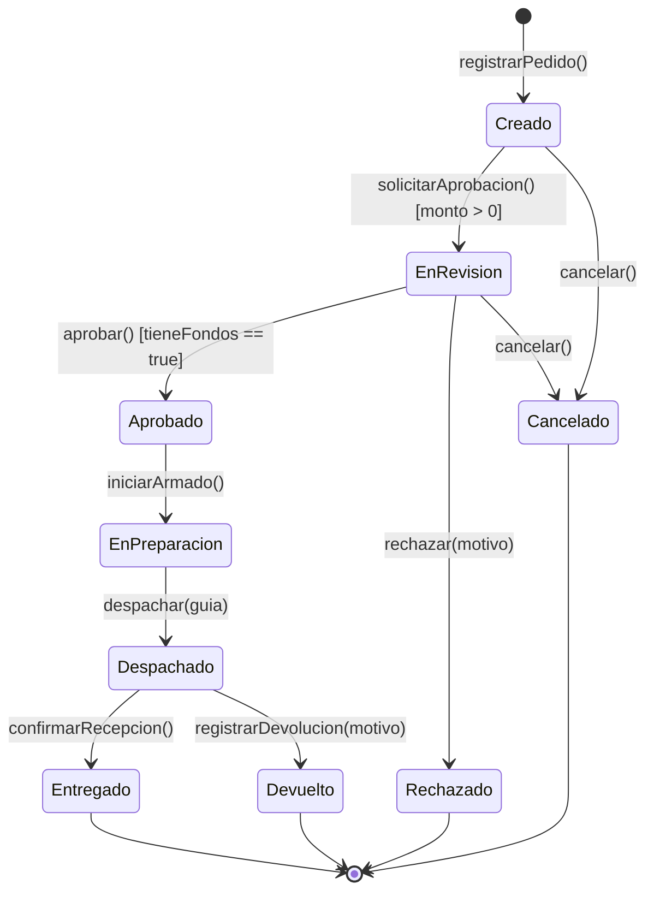

# Generador de Diagramas Mermaid y Síntesis de Estados (`mermaidDiagramGen`)

## Visión General
Esta skill capacita al agente para diseñar, estructurar, verificar y generar diagramas formales en **Mermaid.js** utilizando el catálogo de especificaciones oficiales alojado localmente en `references/`. Incluye capacidades avanzadas de **Síntesis Formal de Máquinas de Estados y Ciclo de Vida de Dominio (UML 2.5 / PUD / ASI)** y un linter pre-vuelo para prevenir errores sintácticos comunes de renderizado.

## Referencias Locales de Sintaxis
Los manuales y especificaciones detalladas de cada tipo de diagrama se encuentran en el directorio [references/](./references/):
- En caso de requerir detalles avanzados de sintaxis, parámetros de layout o directivas de configuración, el agente debe consultar directamente el archivo correspondiente en `references/` aplicando el principio de *Progressive Disclosure*.

---

## 1. Catálogo de Especificaciones de Diagramas

A continuación se indexan las 30 especificaciones de Mermaid disponibles en la skill, organizadas por dominio:

### 1.1. Arquitectura y Sistemas
- [c4.md](./references/c4.md): Modelo C4 para arquitectura de software (`C4Context`, `C4Container`, `C4Component`, `C4Deployment`).
- [architecture.md](./references/architecture.md): Diagramas de arquitectura cloud/infraestructura (servicios, grupos, conexiones, tuning de layout `fcose`).
- [block.md](./references/block.md): Diagramas de bloques posicionales (control preciso de columnas, anchos de bloque y bloques compuestos).
- [packet.md](./references/packet.md): Formato de paquetes binarios de red y distribución de bits/bytes.

### 1.2. Comportamiento, Procesos y Flujos
- [flowchart.md](./references/flowchart.md): Diagramas de flujo (`flowchart TB/LR`), subgrafos, estilos de enlace y nuevas formas v11.3+ (`@{ shape: ... }`).
- [sequenceDiagram.md](./references/sequenceDiagram.md): Diagramas de secuencia UML (mensajes síncronos/asíncronos, activaciones `+/-`, bloques `loop`, `alt`, `opt`, `par`, `critical`, `autonumber`).
- [zenuml.md](./references/zenuml.md): Sintaxis ZenUML para secuencias complejas expresadas como lógica procedimental.
- [stateDiagram.md](./references/stateDiagram.md): Máquinas de estados UML (`stateDiagram-v2`), estados compuestos, bifurcaciones/uniones (`fork`/`join`) y notas.
- [userJourney.md](./references/userJourney.md): Mapas de viaje de usuario (*User Journey*), etapas, actores y puntuación de experiencia.

### 1.3. Modelado de Datos y Estructura
- [classDiagram.md](./references/classDiagram.md): Diagramas de clases orientados a objetos (visibilidad `+`/`-`/`#`/`~`, tipos, métodos, genéricos `~T~`, relaciones de herencia, composición y agregación).
- [entityRelationshipDiagram.md](./references/entityRelationshipDiagram.md): Diagramas Entidad-Relación (`erDiagram`), entidades, atributos, claves primarias/foráneas (`PK`/`FK`) y cardinalidades.
- [requirementDiagram.md](./references/requirementDiagram.md): Diagramas de requisitos formales SysML (requisitos, elementos, relaciones `satisfies`, `verifies`, `derives`).
- [treeView.md](./references/treeView.md): Estructuras jerárquicas y vistas en árbol.

### 1.4. Gestión, Estrategia y Planificación
- [gantt.md](./references/gantt.md): Cronogramas de proyecto Gantt (secciones, tareas activas, críticas, completadas, hitos `milestone`).
- [gitgraph.md](./references/gitgraph.md): Flujos Git (`gitGraph`), ramas (`branch`), confirmaciones (`commit`), fusiones (`merge`) y `cherry-pick`.
- [kanban.md](./references/kanban.md): Tableros Kanban de seguimiento de tareas por columnas de estado.
- [timeline.md](./references/timeline.md): Líneas de tiempo cronológicas estructuradas por períodos y eventos.
- [mindmap.md](./references/mindmap.md): Mapas conceptuales jerárquicos con nodos de diversas formas e iconos.
- [wardley.md](./references/wardley.md): Mapas de Wardley (posicionamiento en cadena de valor vs. etapas de evolución).
- [cynefin.md](./references/cynefin.md): Matriz de marco Cynefin (sistemas claros, complicados, complejos y caóticos).
- [ishikawa.md](./references/ishikawa.md): Diagramas de espina de pescado (causa-efecto / 6M).

### 1.5. Análisis, Métricas y Cuadrantes
- [quadrantChart.md](./references/quadrantChart.md): Gráficos de cuadrantes 2x2 (matrices de priorización, análisis DAFO/SWOT).
- [xyChart.md](./references/xyChart.md): Gráficos estadísticos cartesianos XY (barras, líneas horizontales/verticales).
- [pie.md](./references/pie.md): Gráficos circulares de distribución proporcional.
- [radar.md](./references/radar.md): Gráficos de radar multivariables (evaluación de competencias/métricas).
- [sankey.md](./references/sankey.md): Diagramas de Sankey para balance y flujo de energía, costos o tráfico.
- [treemap.md](./references/treemap.md): Mapas de árbol de áreas proporcionales anidadas.
- [venn.md](./references/venn.md): Diagramas de conjuntos de Venn e intersecciones.
- [eventmodeling.md](./references/eventmodeling.md): Modelado de eventos en sistemas orientados a eventos (comandos, eventos, vistas de lectura).
- [examples.md](./references/examples.md): Colección de ejemplos y patrones de implementación rápida.

---

## 2. Síntesis Formal de Máquinas de Estados y Ciclo de Vida (UML 2.5)

### 2.1. Principio de Identidad de Ciclo de Vida
Cada entidad persistente y transaccional del dominio (ej. `Pedido`, `Factura`, `Turno`, `Contrato`, `Envio`, `Expediente`) posee **una única máquina de estados de comportamiento** que rige sus transiciones válidas:



### 2.2. Matriz de Transición de Estados (MTE)
Para cada modelo de estados sintetizado, generar siempre la matriz formal de verificación:

| Estado Actual | Evento Disparador (Trigger) | Condición de Guarda `[Guarda]` | Acción / Efecto Transaccional | Estado Siguiente |
| :--- | :--- | :--- | :--- | :--- |
| `INICIAL [*]` | `registrarPedido()` | Datos requeridos completos | Crear entidad en memoria | `Creado` |
| `Creado` | `solicitarAprobacion()` | `[monto > 0]` | Notificar al supervisor | `EnRevision` |
| `EnRevision` | `aprobar()` | `[tieneFondos == true]` | Reservar stock y generar orden | `Aprobado` |
| `EnRevision` | `rechazar()` | `[motivo != null]` | Enviar email de rechazo | `Rechazado` |
| `Aprobado` | `iniciarArmado()` | N/A | Asignar operador de depósito | `EnPreparacion` |

### 2.3. Linter Formal de Ciclo de Vida y Detección de Defectos
Antes de emitir el diagrama de estados, auditar:
1. **Estados Inalcanzables (Orphan States)**: Todo estado intermedio debe tener al menos una transición entrante alcanzable desde `[*]`.
2. **Deadlocks no intencionados**: Todo estado que no sea final `[*]` debe tener al menos una transición de salida válida.
3. **Determinismo**: No pueden existir dos transiciones salientes desde el mismo estado con el mismo evento a menos que las guardas sean mutuamente excluyentes (ej. `[x > 0]` y `[x <= 0]`).
4. **Sintaxis de Transición**: Usar siempre el formato estándar UML: `EventoDisparador [CondicionGuarda] / Accion()`.

---

## 3. Reglas Críticas de Sintaxis Mermaid (Prevención de Errores)

Al generar cualquier bloque Mermaid, aplicar estrictamente las siguientes reglas sintácticas para asegurar renderizado sin errores:

### 3.1. Nodos y Etiquetas con Caracteres Especiales
- **Delimitación Obligatoria con Comillas**: Si el texto de un nodo contiene paréntesis `()`, corchetes `[]`, llaves `{}`, barras `/` o comillas, **siempre** envolver el texto entre comillas dobles:
  ```mermaid
  %% INCORRECTO: A[Proceso (fase 1)] --> B{¿Es válido [S/N]?}
  %% CORRECTO:
  A["Proceso (fase 1)"] --> B{"¿Es válido [S/N]?"}
  ```
- **Markdown Strings (Mermaid v11+)**: Para dar formato con negrita o saltos de línea elegantes, usar la sintaxis de markdown string `["`texto con **negrita**`"]`:
  ```mermaid
  A["`**Paso Crítico**
  Línea secundaria explicativa`"]
  ```

### 3.2. Palabras Reservadas en Diagramas de Flujo (`flowchart`)
- **La trampa de la palabra `end`**: La palabra `end` en minúscula dentro de un nodo o subgrafo colapsa el parser de Mermaid. Usar siempre `End`, `END` o comillas dobles:
  ```mermaid
  %% INCORRECTO: A --> end
  %% CORRECTO:
  A --> End
  A --> idEnd["end"]
  ```
- **Evitar palabras clave como IDs de nodo**: No nombrar identificadores de nodo con `subgraph`, `graph`, `flowchart`, `style`, `classDef`, `click`.

### 3.3. Aristas y Conectores
- **La trampa de prefijos `o` y `x`**: Si la etiqueta o el nodo de destino inicia con `o` o `x`, un conector sin espacios pegado al texto puede interpretarse como punta especial (`---o` o `---x`). Dejar siempre espacio:
  ```mermaid
  %% INCORRECTO: A---orden
  %% CORRECTO:
  A --- orden
  A -->|orden| B
  ```

### 3.4. Diagramas de Secuencia (`sequenceDiagram`)
- **Dos puntos `:` en mensajes**: La sintaxis de secuencia usa `:` para separar el mensaje del receptor. Si el mensaje contiene dos puntos (ej. `HTTP 200: OK`), reemplazar por guión o codificar en entidad HTML:
  ```mermaid
  %% INCORRECTO: Backend-->>Frontend: HTTP 200: Respuesta Exitosa
  %% CORRECTO:
  Backend-->>Frontend: HTTP 200 - Respuesta Exitosa
  ```
- **Actores y Participantes**: Declarar participantes explícitamente al inicio si se requiere alias legible:
  ```mermaid
  sequenceDiagram
      autonumber
      participant C as Cliente Web
      participant A as API Gateway
      participant D as Base de Datos
      C->>+A: POST /auth/login
      A->>+D: findUserByEmail()
      D-->>-A: userRecord
      A-->>-C: 200 OK (JWT)
  ```

### 3.5. Subgrafos y Direccionalidad
- Especificar la dirección interna dentro de los subgrafos para mantener diagramas limpios y legibles:
  ```mermaid
  flowchart TB
      subgraph Frontend["Capa de Presentación"]
          direction LR
          UI1["Dashboard"] --> UI2["Formulario"]
      end
  ```

### 3.6. Directivas de Estilo y Tema
- Para garantizar legibilidad en entornos oscuros o claros, utilizar la directiva `%%{init: ...}%%` cuando sea necesario personalizar fuentes o temas:
  ```mermaid
  %%{init: {'theme': 'neutral', 'themeVariables': { 'fontSize': '14px' }}}%%
  ```

---

## 4. Checklist de Verificación Pre-Vuelo para el Agente

Antes de presentar un diagrama al usuario, verificar:

- [ ] **Tipo de Diagrama Adecuado**: ¿Se seleccionó el tipo idóneo del catálogo de 30 especificaciones según el problema?
- [ ] **Comillas en Etiquetas Complejas**: ¿Todos los nodos con caracteres de puntuación, paréntesis o corchetes están entre comillas dobles `["..."]`?
- [ ] **Ausencia de `end` en Minúscula**: ¿Se verificó que no exista la palabra `end` suelta en nodos de flowcharts?
- [ ] **Aristas Limpias**: ¿Las aristas tienen los espacios necesarios para evitar ambigüedades con terminadores especiales (`---o`, `---x`)?
- [ ] **Identificadores Únicos y Seguros**: ¿Los identificadores de nodos usan caracteres alfanuméricos simples (ej. `node1`, `srvAuth`, `gwCheck`) sin espacios ni caracteres especiales?
- [ ] **Secuencias con Autonumber**: ¿Los diagramas de secuencia incluyen `autonumber` y flechas tipadas correctas (`->>`, `-->>`, `-x`)?
- [ ] **Clases y ERD con Tipos y Relaciones**: ¿Los diagramas de clases tienen visibilidad y los ERD cardinalidades válidas (`||--o{`, etc.)?
- [ ] **Máquinas de Estados Deterministas**: ¿Si es un `stateDiagram-v2`, incluye inicio `[*]`, fin `[*]`, guardas `[condicion]` y matriz MTE asociada?
- [ ] **Compilabilidad Garantizada**: ¿El bloque abre con ````mermaid` y cierra limpiamente sin texto markdown interceptado?