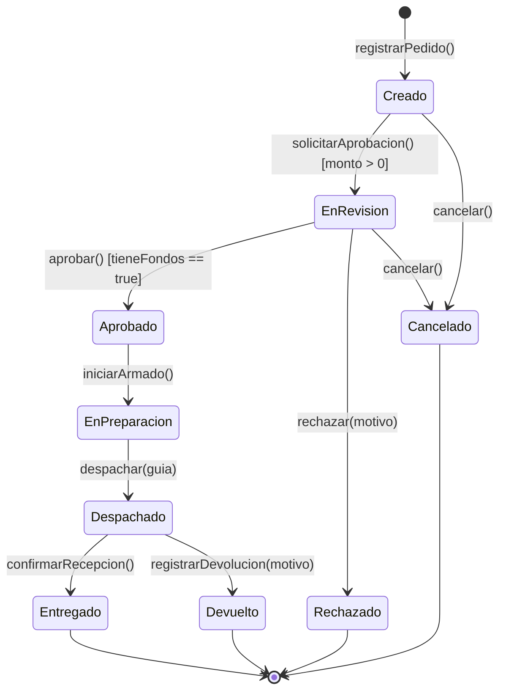

---
name: mermaidDiagramGen
description: >-
  Genera y valida diagramas Mermaid.js precisos y visualmente optimizados (flujos, secuencia, clases,
  ERD, GitGraph, Gantt, etc.) y sintetiza formalmente Máquinas de Estados UML 2.5 (stateDiagram-v2)
  con Matrices de Transición de Estados (MTE), análisis de ciclo de vida de entidades, detección de
  deadlocks, estados inalcanzables y condiciones de guarda.
---

# Generador de Diagramas Mermaid y Síntesis de Estados (`mermaidDiagramGen`)

## Visión General
Esta skill permite diseñar, estructurar, verificar y generar diagramas formales en **Mermaid.js** y **PlantUML** utilizando el catálogo de especificaciones locales en el directorio `Mermaid/`. Incluye capacidades avanzadas de **Síntesis de Máquinas de Estados y Ciclo de Vida de Dominio (UML 2.5 / PUD / ASI)**.

## Dependencias
- Directorio de especificaciones y manuales: `C:\Users\Diego\.gemini\config\skills\Mermaid` (contiene `flowchart.md`, `sequenceDiagram.md`, `classDiagram.md`, `stateDiagram.md`, `entityRelationshipDiagram.md`, etc.).

---

## 1. Guía de Selección de Diagramas

- **Diagramas de Flujo (`flowchart`)**: Procesos de negocio, árboles de decisión y arquitecturas.
- **Diagramas de Secuencia (`sequenceDiagram`)**: Interacciones temporales entre actores, sistemas y APIs.
- **Diagramas de Clases (`classDiagram`)**: Modelos de dominio orientados a objetos, atributos, métodos y multiplicidades.
- **Diagramas Entidad-Relación (`erDiagram`)**: Esquemas de bases de datos relacionales, claves PK/FK y cardinalidades.
- **Máquinas de Estados y Ciclo de Vida (`stateDiagram-v2`)**: Ciclo de vida dinámico de entidades transaccionales, eventos, guardas y matrices de transición.
- **Diagramas de Gantt (`gantt`)**: Cronogramas de proyecto y dependencias de tareas.
- **Git Graphs (`gitGraph`)**: Ramas, commits, merges y flujos de release.
- **Mapas Mentales (`mindmap`)**: Estructuración conceptual jerárquica.

---

## 2. Síntesis Formal de Máquinas de Estados y Ciclo de Vida (UML 2.5)

### 2.1. Principio de Identidad de Ciclo de Vida
Cada entidad persistente y transaccional (ej. `Pedido`, `Factura`, `Turno`, `Contrato`, `Envio`) posee **una única máquina de estados de comportamiento** que rige sus transiciones válidas:

### 2.2. Matriz de Transición de Estados (MTE)
Para cada modelo de estados sintetizado, generar la matriz formal de verificación:

| Estado Actual | Evento Disparador (Trigger) | Condición de Guarda `[Guarda]` | Acción / Efecto Transaccional | Estado Siguiente |
| :--- | :--- | :--- | :--- | :--- |
| `INICIAL [*]` | `registrarPedido()` | Datos requeridos completos | Crear entidad en memoria | `Creado` |
| `Creado` | `solicitarAprobacion()` | `[monto > 0]` | Notificar al supervisor | `EnRevision` |
| `EnRevision` | `aprobar()` | `[tieneFondos == true]` | Reservar stock y generar orden | `Aprobado` |
| `EnRevision` | `rechazar()` | `[motivo != null]` | Enviar email de rechazo | `Rechazado` |
| `Aprobado` | `iniciarArmado()` | N/A | Asignar operador de depósito | `EnPreparacion` |

### 2.3. Linter Formal de Ciclo de Vida y Detección de Defectos
Antes de emitir el diagrama de estados, verificar:
1. **Estados Inalcanzables (Orphan States)**: Todo estado intermedio debe tener al menos una transición entrante desde `[*]`.
2. **Deadlocks no intencionados**: Todo estado que no sea final `[*]` debe tener al menos una transición de salida válida.
3. **Determinismo**: No pueden existir dos transiciones salientes desde el mismo estado con el mismo evento a menos que las guardas sean mutuamente excluyentes (ej. `[x > 0]` y `[x <= 0]`).
4. **Sintaxis de Transición**: Usar siempre el formato estándar UML: `EventoDisparador [CondicionGuarda] / Accion()`.

---

## 3. Reglas Críticas de Sintaxis Mermaid

- **Flowcharts**:
  - Evitar la palabra reservada `end` en minúscula dentro de nodos (usar `End`, `"end"` o `(end)`).
  - Evitar que una etiqueta comience con `o` o `x` pegada a guiones (ej. usar `A --- ops` o `A --- Ops` en lugar de `A---ops`).
- **Secuencia**: Usar `autonumber` y flechas explícitas (`->>`, `-->>`, `-x`, `--)`).
- **Clases**: Declarar visibilidad (`+`, `-`, `#`, `~`), tipos en atributos/métodos y relaciones con cardinalidad (`"1" --> "*"`).
- **Estados**: Usar siempre `stateDiagram-v2`, `[*]` para inicio y fin, y transiciones con `:` para rotular.