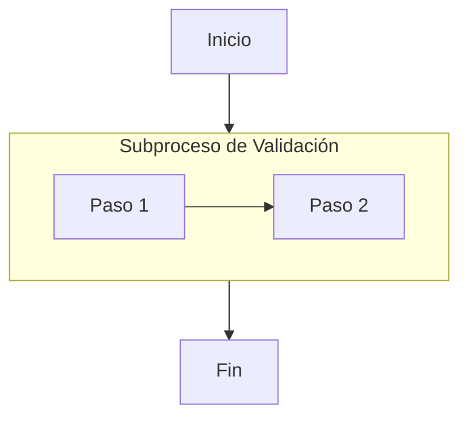

# Guía Rápida: Trampas de Sintaxis y Prevención de Errores en Mermaid

Esta guía documenta los errores más frecuentes que rompen el parser de Mermaid.js y cómo evitarlos en la primera generación.

---

## 1. Nodos con Caracteres Especiales (Comillas Obligatorias)

Si la etiqueta de un nodo contiene paréntesis, corchetes, llaves, comillas o saltos de línea, **debe encerrarse siempre entre comillas dobles**:

- ❌ **Incorrecto:** `A --> B[Proceso (fase 1)]`  *(falla en parser)*
- ✔️ **Correcto:** `A --> B["Proceso (fase 1)"]`
- ✔️ **Correcto (con formato markdown en Mermaid v11+):** `A --> B["`**Paso Crítico**\nLínea descriptiva`"]`

---

## 2. La Trampa de la Palabra Clave `end` y Palabras Reservadas

El token `end` cierra bloques como `subgraph`. Si se usa como identificador o texto suelto de un nodo, el parser aborta:

- ❌ **Incorrecto:** `A --> end`
- ✔️ **Correcto:** `A --> idFin["Fin del Proceso"]`
- ✔️ **Correcto:** `A --> idEnd["end"]`

> [!WARNING]
> Evitar como identificadores de nodo: `subgraph`, `graph`, `end`, `style`, `classDef`, `click`. Usar IDs alfanuméricos limpios como `node1`, `pasoA`, `fin`.

---

## 3. Ambigüedad en Aristas con Prefijos `o` y `x`

Mermaid interpreta `--o` y `--x` como conectores de círculo o cruz. Si una etiqueta comienza pegada con esas letras, el diagrama falla:

- ❌ **Incorrecto:** `A---orden`  *(Mermaid intenta parsear conector `---o` malformado)*
- ✔️ **Correcto:** `A --- orden`  *(con espacios alrededor)*
- ✔️ **Correcto:** `A -->|orden| B`  *(usando barras verticales para texto de arista)*

---

## 4. Dos Puntos en Diagramas de Secuencia

En diagramas de secuencia, los dos puntos `:` delimitan el texto del mensaje. Usar dos puntos internos en la misma línea puede romper el render:

- ❌ **Incorrecto:** `Servidor-->>Cliente: HTTP 200: OK`
- ✔️ **Correcto:** `Servidor-->>Cliente: HTTP 200 - OK`

---

## 5. Subgrafos y Direccionalidad

Para evitar diagramas espagueti cuando un proceso contiene subprocesos horizontales dentro de un flujo vertical general:

