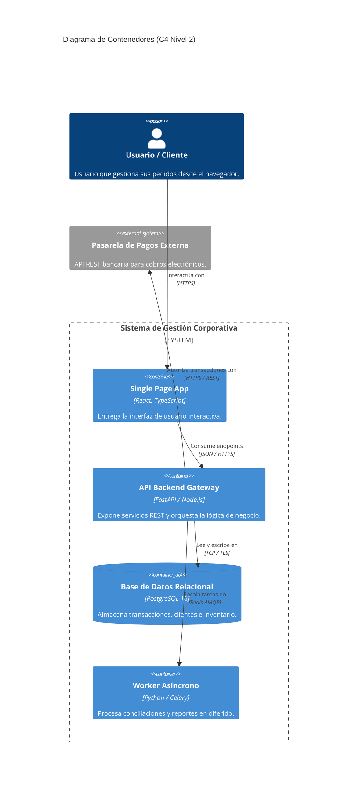

# Plantilla Canónica: C4 Container Diagram

```mermaid
C4Container
    title Diagrama de Contenedores (C4 Nivel 2)

    Person(usuario, "Usuario / Cliente", "Usuario que gestiona sus pedidos desde el navegador.")

    System_Boundary(c1, "Sistema de Gestión Corporativa") {
        Container(spa, "Single Page App", "React, TypeScript", "Entrega la interfaz de usuario interactiva.")
        Container(api, "API Backend Gateway", "FastAPI / Node.js", "Expone servicios REST y orquesta la lógica de negocio.")
        ContainerDb(db, "Base de Datos Relacional", "PostgreSQL 16", "Almacena transacciones, clientes e inventario.")
        Container(worker, "Worker Asíncrono", "Python / Celery", "Procesa conciliaciones y reportes en diferido.")
    }

    System_Ext(pasarela, "Pasarela de Pagos Externa", "API REST bancaria para cobros electrónicos.")

    Rel(usuario, spa, "Interactúa con", "HTTPS")
    Rel(spa, api, "Consume endpoints", "JSON / HTTPS")
    Rel(api, db, "Lee y escribe en", "TCP / TLS")
    Rel(api, worker, "Encola tareas en", "Redis AMQP")
    Rel(api, pasarela, "Autoriza transacciones con", "HTTPS / REST")
```
