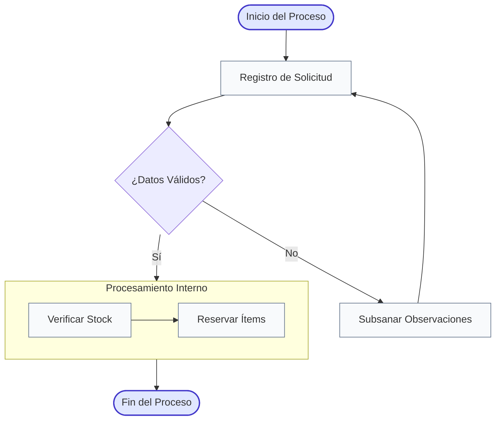

# Plantilla Canónica: Flowchart (Diagrama de Flujo)

```mermaid
flowchart TD
    Inicio(["Inicio del Proceso"]) --> Paso1["Registro de Solicitud"]
    Paso1 --> Decision{"¿Datos Válidos?"}

    Decision -->|Sí| Subproceso
    Decision -->|No| Corregir["Subsanar Observaciones"]
    Corregir --> Paso1

    subgraph Subproceso ["Procesamiento Interno"]
        direction LR
        TareaA["Verificar Stock"] --> TareaB["Reservar Ítems"]
    end

    Subproceso --> Fin(["Fin del Proceso"])

    classDef terminal fill:#e0e7ff,stroke:#4338ca,stroke-width:2px;
    classDef proceso fill:#f8fafc,stroke:#64748b,stroke-width:1px;
    class Inicio,Fin terminal;
    class Paso1,Corregir,TareaA,TareaB proceso;
```
