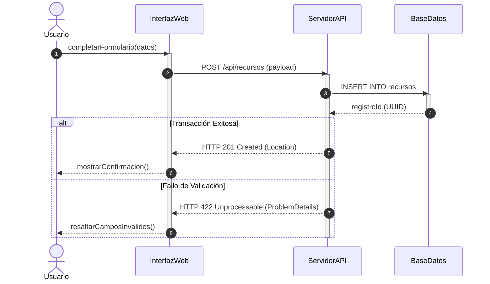

# Plantilla Canónica: Sequence Diagram (Diagrama de Secuencia)

```mermaid
sequenceDiagram
    autonumber
    actor U as Usuario
    participant UI as InterfazWeb
    participant S as ServidorAPI
    participant BD as BaseDatos

    U->>UI: completarFormulario(datos)
    activate UI
    UI->>S: POST /api/recursos (payload)
    activate S

    S->>BD: INSERT INTO recursos
    activate BD
    BD-->>S: registroId (UUID)
    deactivate BD

    alt Transacción Exitosa
        S-->>UI: HTTP 201 Created (Location)
        UI-->>U: mostrarConfirmacion()
    else Fallo de Validación
        S-->>UI: HTTP 422 Unprocessable (ProblemDetails)
        UI-->>U: resaltarCamposInvalidos()
    end

    deactivate S
    deactivate UI
```
