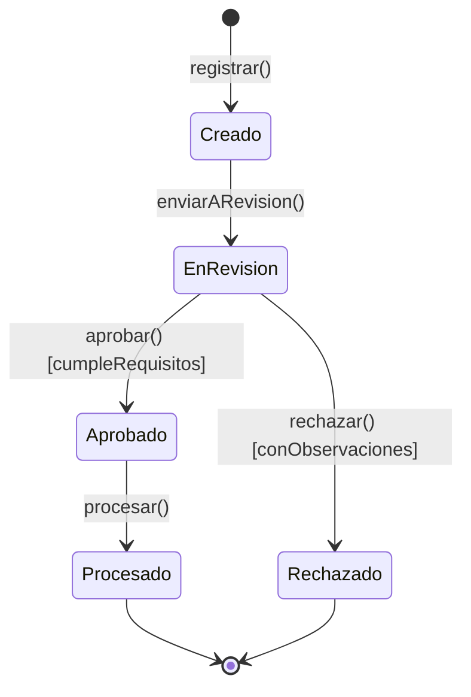

# Plantilla Canónica: State Diagram y Matriz de Transición (MTE)

## Diagrama de Estados (`stateDiagram-v2`)

---

## Matriz de Transición de Estados (MTE)

| Estado Origen | Evento Disparador | Condición de Guarda | Acción / Efecto Producido | Estado Destino | Evidencia / Cita |
|---|---|---|---|---|:---:|
| `[*]` | `registrar()` | Datos mínimos obligatorios | Se genera ID de seguimiento | `Creado` | Regla 1 |
| `Creado` | `enviarARevision()` | Ninguna | Se notifica al revisor | `EnRevision` | Regla 2 |
| `EnRevision` | `aprobar()` | `[score >= 70]` | Se emite certificado | `Aprobado` | Regla 3 |
| `EnRevision` | `rechazar()` | `[score < 70]` | Se registra motivo de rechazo | `Rechazado` | Regla 4 |
| `Aprobado` | `procesar()` | Ninguna | Se ejecuta la transferencia | `Procesado` | Regla 5 |
