---
name: microserviceDecomposer
description: >-
  Asiste en la descomposición de monolitos en microservicios mediante Domain-Driven Design (DDD),
  Bounded Contexts, evaluación de trade-offs de arquitectura y diagramas de contenedores C4.
---

# Microservice Boundary Decomposer: Guía y Metodología de Arquitectura

Esta skill proporciona las directrices teóricas, metodológicas y prácticas para guiar la transición arquitectónica desde sistemas monolíticos hacia arquitecturas basadas en microservicios, así como el diseño *greenfield* de sistemas distribuidos de alta complejidad. Fundamenta sus decisiones en el Diseño Guiado por el Dominio Estratégico (**Strategic Domain-Driven Design - DDD**), los patrones canónicos de Chris Richardson y Sam Newman, la evaluación formal de atributos de calidad (ISO 25010 / Richards & Ford) y el modelado visual estandarizado mediante el **Modelo C4 (Nivel 2: Contenedores)**.

---

## 1. Rol y Objetivos del Arquitecto Especialista

Como especialista en arquitectura de software y diseño de microservicios, tu labor no es subdividir sistemas de manera arbitraria o puramente técnica (como separar por capas CRUD), sino **establecer límites de servicios autónomos, altamente cohesivos y débilmente acoplados** alineados con el negocio.

### Objetivos Principales:
1. **Modelar el Negocio con Precisión**: Identificar subdominios y acotar responsabilidades operacionales y lingüísticas mediante *Bounded Contexts*.
2. **Garantizar la Autonomía de Despliegue y Datos**: Diseñar según el principio de *Database-per-Service* y consistencia eventual, evitando acoplamientos ocultos a nivel de datos.
3. **Seleccionar Estrategias de Integración Resilientes**: Definir contratos síncronos (REST, gRPC) y asíncronos (Event-Driven Architecture) gobernados por patrones de resiliencia y transaccionalidad distribuida (*Saga*, *Transactional Outbox*).
4. **Evaluar Trade-offs Rigurosamente**: Ponderar las ventajas de escalabilidad y agilidad contra la complejidad operacional, latencia de red y consistencia de datos antes de justificar la partición.
5. **Comunicar con Claridad Arquitectónica**: Producir vistas de funcionalidad (casos de uso arquitectónicamente significativos), diagramas C4 Nivel 2 en Mermaid y justificaciones técnicas fundamentadas.

---

## 2. Metodología de Partición de Servicios (Strategic DDD)

La descomposición exitosa parte de entender el problema del negocio antes de proponer la topología de servicios. Se aplican los dos patrones fundamentales de descomposición propuestos por Chris Richardson: **Decompose by Subdomain** (Diseño Guiado por el Dominio) y **Decompose by Business Capability** (Capacidades de Negocio).

```
+-------------------------------------------------------------------------------+
|                            DOMINIO DEL NEGOCIO                                |
+-------------------------------------------------------------------------------+
       |                                |                               |
       v                                v                               v
+------------------+          +--------------------+          +-----------------+
|   CORE DOMAIN    |          | SUPPORTING DOMAIN  |          | GENERIC DOMAIN  |
| (Diferenciador   |          | (Específico pero   |          | (Común a la     |
|  Competitivo)    |          |  no diferenciador) |          |  industria)     |
+------------------+          +--------------------+          +-----------------+
       |                                |                               |
       v                                v                               v
+------------------+          +--------------------+          +-----------------+
| Bounded Context  |          |  Bounded Context   |          | Bounded Context |
| (Modelo Propio + |          |  (Modelo Propio +  |          | (Modelo Propio +|
| Lenguaje Ubicuo) |          |  Lenguaje Ubicuo)  |          | Lenguaje Ubicuo)|
+------------------+          +--------------------+          +-----------------+
       |                                |                               |
       +--------------------------------+-------------------------------+
                                        |
                                        v
                       +---------------------------------+
                       |  MAPA DE CONTEXTOS (Context Map)|
                       |  - Anti-Corruption Layer (ACL)  |
                       |  - Customer / Supplier (U/D)    |
                       |  - Open Host Service (OHS)      |
                       +---------------------------------+
```

### 2.1. Taxonomía de Subdominios (DDD)

Todo sistema empresarial se compone de tres tipos de subdominios:

| Tipo de Subdominio | Definición y Propósito | Nivel de Inversión y Estrategia Técnica | Ejemplos Típicos |
| :--- | :--- | :--- | :--- |
| **Core Domain** *(Dominio Núcleo)* | Es la razón de ser de la organización, la ventaja competitiva clave y lo que la diferencia en el mercado. Alta complejidad y constante evolución. | **Máxima prioridad**. Desarrollo interno a medida (*custom code*), ingenieros senior, patrones de modelado ricos (DDD táctico, Event Sourcing). | Motor de asignación de misiones y amenazas, algoritmo de despacho logístico, sistema de scoring crediticio propietario. |
| **Supporting Subdomain** *(Soporte / Apoyo)* | Complementa al negocio y asiste al Core Domain. Es específico de la organización pero no genera una diferenciación competitiva directa. | **Prioridad media**. Desarrollo a medida simplificado o tercerizado, arquitectura orientada a servicios CRUD estructurados. | Administración del legajo y perfil de agentes/héroes, catálogo interno de equipamiento, gestión de reclamos internos. |
| **Generic Subdomain** *(Genérico)* | Funcionalidades comunes a cualquier empresa de la industria o mercado. No aportan ventaja competitiva individual. | **Mínima inversión en desarrollo propio**. Adoptar software empaquetado (COTS), servicios SaaS o librerías open-source consolidadas. | Autenticación y Gestión de Identidades (OAuth2/Keycloak/Auth0), Motor de Notificaciones por Email/SMS/Push, Facturación electrónica estándar. |

### 2.2. Bounded Contexts y Lenguaje Ubicuo

Un **Bounded Context** (Contexto Delimitado / Acotado) es el límite conceptual y explícito dentro del cual un modelo de dominio particular es aplicable y su **Lenguaje Ubicuo** (*Ubiquitous Language*) tiene un significado unívoco, libre de ambigüedad.

> [!IMPORTANT]
> **Polimorfismo de Entidades entre Bounded Contexts:** Una misma entidad de la realidad del negocio adquiere diferentes identidades, atributos y comportamientos según el contexto donde opera:
> - En el *Contexto de Operaciones/Misiones*: Un **Héroe** es un *RecursoOperativo* (disponibilidad, nivel de poder, radio de acción, dispositivo de rastreo).
> - En el *Contexto de Legajo/Administración*: Un **Héroe** es un *Empleado/Miembro* (datos filiatorios, país de origen, tutor legal, estado contractual).
> - En el *Contexto de Logística/Equipamiento*: Un **Héroe** es un *Custodio* (herramientas asignadas, vehículos asignados, estado de mantenimiento).
>
> Forzar un único modelo unificado para toda la empresa crea un **monolito conceptual** ingobernable. Cada microservicio debe implementar exclusivamente el modelo correspondiente a su Bounded Context.

### 2.3. Mapa de Contextos (Context Mapping)

El Context Map formaliza cómo interactúan los diferentes Bounded Contexts tanto a nivel de dependencias técnicas como de dinámicas organizacionales:

1. **Shared Kernel** *(Núcleo Compartido)*:
   - Dos contextos comparten un subconjunto común del modelo de dominio y base de código.
   - *Riesgo*: Alto acoplamiento. Cualquier cambio requiere coordinación y despliegue sincronizado entre ambos equipos. Usar con extrema precaución.
2. **Customer / Supplier (Upstream / Downstream - U/D)**:
   - El servicio proveedor (**Upstream - U**) abastece de datos o servicios al consumidor (**Downstream - D**). Las prioridades del Downstream influyen en el roadmap del Upstream.
3. **Conformist** *(Conformista)*:
   - El servicio Downstream adopta y se acopla directamente al modelo de datos del Upstream sin realizar transformaciones, aceptando la dependencia.
4. **Anti-Corruption Layer (ACL)** *(Capa Anticorrupción)*:
   - Una capa de traducción y adaptación colocada en el servicio Downstream que aísla su modelo de dominio limpio de modelos legacy o externos complejos. Traduce DTOs externos a entidades y Value Objects propios.
5. **Open Host Service (OHS) & Published Language (PL)**:
   - El servicio Upstream define un protocolo de acceso estandarizado y documentado (ej. API REST con OpenAPI / JSON Schema o gRPC con Protocol Buffers) para que múltiples clientes lo consuman sin alterar el modelo interno.
6. **Separate Ways** *(Caminos Separados)*:
   - Los equipos deciden explícitamente no integrarse debido a que el costo de coordinación supera los beneficios. Se duplica funcionalidad menor o se usan procesos manuales.

### 2.4. Criterios Heurísticos de Partición

Para validar si una frontera de microservicio está correctamente definida, el arquitecto debe evaluar los siguientes criterios:

```markdown
┌─────────────────────────────────────────────────────────────────────────────┐
│                       CRITERIOS DE PARTICIÓN DE SERVICIOS                   │
├─────────────────────────────────────────────────────────────────────────────┤
│ 1. Cohesión de Datos e Invariantes:                                        │
│    ¿Los datos deben mantenerse estrictamente consistentes en una misma      │
│    transacción ACID local? Si la respuesta es SÍ -> Mismo microservicio.   │
│                                                                             │
│ 2. Frecuencia y Ritmo de Cambio (Rate of Change):                           │
│    Separar módulos con despliegues diarios (ej. promociones, campañas) de   │
│    módulos con estabilidad de años (ej. motor contable, liquidaciones).     │
│                                                                             │
│ 3. Escalabilidad y Rendimiento Independiente:                              │
│    Aislar componentes con alta concurrencia de I/O o CPU (ej. ingesta de    │
│    telemetría GPS en tiempo real) de servicios transaccionales normales.    │
│                                                                             │
│ 4. Requerimientos de Seguridad y Cumplimiento:                              │
│    Aislar módulos con datos sensibles bajo normativas regulatorias          │
│    (PCI-DSS para pagos, HIPAA/GDPR para datos médicos) para reducir el      │
│    alcance de auditoría.                                                    │
│                                                                             │
│ 5. Límites de Equipo y Ley de Conway (Inverse Conway Maneuver):             │
│    Estructurar los servicios para que correspondan a equipos autónomos y    │
│    multifuncionales (Two-Pizza Teams) que posean el ciclo de vida completo. │
└─────────────────────────────────────────────────────────────────────────────┘
```

---

## 3. Estrategias de Persistencia y Datos Distribuidos

El desacoplamiento real de los microservicios radica en la gestión independiente de sus datos.

### 3.1. Patrón Database-per-Service (Persistencia Políglota)

Cada microservicio debe ser el **único dueño y custodio** de su almacenamiento de datos. Ningún otro servicio puede acceder directamente a las tablas o colecciones de otro servicio; todo acceso a datos externos debe realizarse exclusivamente a través de la API pública o eventos del servicio propietario.

```
       [ Servicio A ]                     [ Servicio B ]
             │                                   │
             ▼                                   ▼
    [( Base de Datos A )]               [( Base de Datos B )]
    (PostgreSQL Relacional)             (MongoDB Documental)
```

> [!CAUTION]
> **Antipatrón Shared Database (Base de Datos Compartida):** Permitir que múltiples microservicios lean y escriban sobre el mismo esquema de base de datos relacional recrea un monolito a nivel de datos (*Distributed Monolith*), destruye la independencia de despliegue y genera fallas catastróficas ante migraciones de esquema.

**Persistencia Políglota:** La partición permite elegir el motor de base de datos óptimo para la carga de trabajo específica de cada Bounded Context:
- **RDBMS (PostgreSQL, MySQL):** Consistencia ACID estricta, consultas transaccionales relacionales, integridad referencial (ej. Facturación, Contratos).
- **Documental (MongoDB, Couchbase):** Esquemas flexibles, documentos anidados jerárquicos (ej. Catálogo dinámico de reclamos, configuraciones de eventos).
- **Time-Series (TimescaleDB, InfluxDB):** Ingestión de telemetría de alta frecuencia y análisis temporal (ej. Coordenadas GPS de héroes/vehículos en misión).
- **Clave-Valor / In-Memory (Redis, Memcached):** Sesiones de usuario de baja latencia, tokens de autenticación, caché distribuido, contadores atómicos.
- **Búsqueda Texto Completo (Elasticsearch, OpenSearch):** Búsqueda facetada, indexación de reportes y logs forenses.

### 3.2. Consistencia Eventual vs Transacciones Distribuidas

En un sistema distribuido, las transacciones tradicionales basadas en **Two-Phase Commit (2PC / XA)** violan el Teorema CAP al priorizar consistencia a costa de disponibilidad y latencia, convirtiéndose en un cuello de botella y un punto único de fallo.

En su lugar, los microservicios adoptan el modelo **BASE** (*Basically Available, Soft state, Eventual consistency*) y garantizan la consistencia a través de la coordinación de transacciones locales mediante el **Patrón Saga**.

---

### 3.3. Patrón Saga

Una **Saga** es una secuencia de transacciones locales donde cada transacción actualiza la base de datos de un servicio específico y publica un mensaje o evento que dispara la siguiente transacción local en otro servicio. Si una transacción intermedia falla, la Saga ejecuta **Transacciones Compensatorias** (*Compensating Transactions*) para deshacer semánticamente los cambios previos.

```
Flujo Hacia Adelante (Happy Path):
[T1: Crear Pedido] ──> [T2: Reservar Stock] ──> [T3: Procesar Pago] ──> [T4: Despachar]

Flujo con Fallo en T3 (Compensación):
[T1: Crear Pedido] ──> [T2: Reservar Stock] ──> [T3: Pago RECHAZADO]
       │                        │
       ▼                        ▼
[C1: Cancelar Pedido] <── [C2: Liberar Stock] (Transacciones Compensatorias)
```

#### Modalidades de Implementación de Saga:

| Criterio | Saga por Coreografía (Choreography) | Saga por Orquestación (Orchestration) |
| :--- | :--- | :--- |
| **Mecanismo** | Descentralizado. Cada servicio publica y se suscribe a eventos de dominio de otros servicios. | Centralizado. Un componente orquestador (*Saga Orchestrator / State Machine*) envía comandos a los participantes y escucha respuestas. |
| **Ventajas** | - Simplicidad inicial.<br>- Desacoplamiento de un coordinador central.<br>- Ideal para flujos cortos (2 a 4 pasos). | - Control y visibilidad del estado global del flujo.<br>- Manejo sencillo de lógica de compensación y reintentos.<br>- Evita dependencias cíclicas de eventos entre servicios. |
| **Desventajas** | - Difícil de rastrear y entender a medida que crece.<br>- Riesgo de acoplamiento cíclico de eventos.<br>- Pruebas de integración más complejas. | - Riesgo de concentrar demasiada lógica de negocio en el orquestador (*Anemic Services*).<br>- Requiere infraestructura/framework de orquestación (ej. Temporal, Camunda, AWS Step Functions). |
| **Casos de Uso** | Procesos lineales simples (ej. Notificar registro de usuario). | Flujos transaccionales críticos de múltiples pasos con ramificaciones complejas (ej. Despacho de misiones críticas, checkout de compras). |

---

### 3.4. Transactional Outbox Pattern y CDC

El problema del **Dual-Write** ocurre cuando un servicio debe actualizar su base de datos local y enviar un mensaje al broker de mensajería (Kafka/RabbitMQ). Si la base de datos confirma pero la red falla antes de publicar el evento (o viceversa), el sistema queda en un estado permanentemente inconsistente.

**Solución con Transactional Outbox:**
1. Dentro de la **misma transacción ACID local**, el servicio guarda la entidad de negocio en su tabla principal y registra el evento en una tabla auxiliar `outbox`.
2. Un proceso desacoplado (**Message Relay**) lee los registros de la tabla `outbox` y los publica al broker de mensajería garantizando entrega *At-Least-Once*.
3. El Message Relay puede implementarse mediante **Change Data Capture (CDC)** (ej. Debezium leyendo el Write-Ahead Log / Binlog de la base de datos) o mediante un **Polling Publisher**.

```
+──────────────────────────────────────────+
│             MICROSERVICIO                │
│                                          │
│  [ Lógica de Negocio ]                   │
│         │                                │
│         │ 1. Transacción ACID Única      │
│         ▼                                │
│  +────────────────────────────────────+  │
│  │ BASE DE DATOS LOCAL                │  │
│  │  ┌───────────────┐┌──────────────┐ │  │
│  │  │ Tabla Negocio ││ Tabla Outbox │ │  │
│  │  └───────────────┘└──────────────┘ │  │
│  +────────────────────────────────────+  │
│                         │                │
+─────────────────────────┼────────────────+
                          │ 2. CDC / Debezium (Lee WAL)
                          ▼
            +───────────────────────────+
            │   BROKER DE MENSAJERÍA    │
            │  (Apache Kafka/RabbitMQ)  │
            +───────────────────────────+
                          │
                          ▼ 3. Consumer Idempotente
            +───────────────────────────+
            │   MICROSERVICIO DESTINO   │
            +───────────────────────────+
```

> [!TIP]
> **Idempotent Consumer:** Como la entrega es *At-Least-Once*, los consumidores de eventos deben ser idempotentes (mantener una tabla de `processed_messages` con el ID único del evento para descartar duplicados).

---

## 4. Comunicación e Integración de Servicios

### 4.1. Estilos de Comunicación

```markdown
┌─────────────────────────────────────────────────────────────────────────────┐
│                            ESTILOS DE COMUNICACIÓN                          │
├─────────────────────────────────────────────────────────────────────────────┤
│                                                                             │
│  SÍNCRONO (Request / Response)          ASÍNCRONO (Message / Event-Driven) │
│  - REST sobre HTTP/2 (JSON/OpenAPI)      - Apache Kafka / RabbitMQ (AMQP)   │
│  - gRPC sobre HTTP/2 (Protocol Buffers)  - Publish / Subscribe (Eventos)    │
│  - Bloqueante / Espera activa de rta     - Desacoplamiento temporal y de red│
│  - Apropiado para: Consultas simples     - Apropiado para: Notificaciones,  │
│    directas y validaciones en línea        transacciones Saga y telemetría  │
│                                                                             │
└─────────────────────────────────────────────────────────────────────────────┘
```

#### Patrones de Resiliencia Síncrona:
Cuando se usa comunicación síncrona, se deben implementar obligatoriamente los siguientes patrones para evitar fallas en cascada:
1. **Circuit Breaker** *(Interruptor de Circuito)*: Detecta fallos reiterados en el servicio destino y abre el circuito inmediatamente, retornando un error controlado o fallback sin saturar la red.
2. **Retry con Exponential Backoff y Jitter**: Reintentos automáticos espaciados exponencialmente con variación aleatoria (*jitter*) para no saturar al receptor recuperado.
3. **Timeout Estricto**: Toda llamada remota debe tener un límite de tiempo explícito (ej. 2.0 segundos) para liberar los hilos de ejecución.
4. **Bulkhead** *(Mamparo)*: Aislar grupos de conexiones e hilos por servicio remoto para evitar que la caída de un servicio agote los recursos de toda la aplicación.

---

### 4.2. API Gateway y Backends for Frontends (BFF)

Para evitar que los clientes frontend (Web, Mobile, Terceros) conozcan la topología interna de microservicios y realicen decenas de peticiones HTTP en cascada (*Chatty I/O*), se implementa el patrón **API Gateway** o **BFF**:

- **Enrutamiento Inverso y Agregación (API Composition):** Unifica múltiples llamadas a microservicios en una sola respuesta optimizada para el cliente.
- **Seguridad Perimetral (Edge Security):** Validación centralizada de tokens JWT/OAuth2, terminación TLS y *Token Relay* hacia los microservicios internos.
- **Rate Limiting y Throttling:** Protección contra ataques de denegación de servicio y control de cuotas por cliente.

```
                           +----------------------+
                           |  Clientes Frontend   |
                           +----------------------+
                                |            |
                  HTTPS / Web   |            | HTTPS / Mobile
                                v            v
                      +-------------+    +-------------+
                      |   BFF Web   |    | BFF Mobile  |
                      +-------------+    +-------------+
                             \                  /
                              \                /  gRPC / REST Interno
                               v              v
                       +-------------------------------+
                       |  Red Interna de Microservicios|
                       | [Svc A]   [Svc B]   [Svc C]   |
                       +-------------------------------+
```

---

## 5. Sintaxis y Plantilla para Diagramas C4 Nivel 2 (Contenedores) en Mermaid

El **Nivel 2 del Modelo C4 (Contenedores)** muestra la arquitectura de alto nivel del sistema, desglosando el límite del sistema en aplicaciones web/móviles, APIs, microservicios backend, brokers de mensajería y almacenes de datos.

### 5.1. Reglas de Modelado C4 en Mermaid
1. **Límite del Sistema (*System Boundary*)**: Debe agrupar todos los contenedores pertenecientes a la solución analizada.
2. **Tecnología Explícita**: Todo contenedor y base de datos debe declarar su tecnología concreta (ej. `Node.js / Express`, `Java / Spring Boot`, `PostgreSQL`, `Apache Kafka`).
3. **Relaciones Tipadas**: Cada conexión debe especificar la acción de negocio y el protocolo técnico empleado (ej. `[HTTPS/JSON]`, `[gRPC]`, `[JDBC]`, `[Kafka Event]`).

### 5.2. Plantilla Maestra Reutilizable C4 Nivel 2

A continuación se presenta la plantilla estándar lista para instanciar en especificaciones arquitectónicas:

```mermaid
C4Container
    title Diagrama de Contenedores C4 (Nivel 2) - [Nombre del Sistema]

    Person(actorUser, "Usuario Final / Operador", "Rol principal que interactúa con la plataforma")
    Person_Ext(actorAdmin, "Administrador / Auditor", "Usuario supervisor del sistema")

    System_Boundary(c1, "[Límite del Sistema - Nombre del Producto]") {
        Container(spaWeb, "Aplicación Web (SPA)", "React / TypeScript", "Interfaz de usuario para gestión administrativa y operativa")
        Container(appMobile, "Aplicación Móvil", "Flutter / Kotlin", "Cliente móvil para operadores en campo")

        Container(bffWeb, "BFF Web Gateway", "Node.js / Express", "Enrutamiento, autenticación perimetral y composición de APIs para Web")
        Container(bffMobile, "BFF Mobile Gateway", "Go / Gin", "Optimización de payloads y streaming para dispositivos móviles")

        Container(svcCore1, "Servicio Principal A (Core)", "Java / Spring Boot", "Gestiona la lógica central del negocio e invariantes transaccionales")
        ContainerDb(dbCore1, "BD Servicio A", "PostgreSQL", "Almacena transacciones y entidades centrales")

        Container(svcCore2, "Servicio de Ingesta / Telemetría", "Go / Rust", "Procesamiento de alta concurrencia y flujo continuo de datos")
        ContainerDb(dbCore2, "BD Telemetría", "TimescaleDB", "Series temporales de eventos y métricas de alta frecuencia")

        Container(svcSupporting, "Servicio de Soporte / Catálogo", "Python / FastAPI", "Administración de catálogos, perfiles y entidades de apoyo")
        ContainerDb(dbSupporting, "BD Soporte", "MongoDB", "Documentos y esquemas dinámicos de configuración")

        Container(eventBroker, "Broker de Eventos", "Apache Kafka", "Bus asíncrono para eventos de dominio, CDC y orquestación de Sagas")
    }

    System_Ext(extAuth, "Proveedor de Identidad (IdP)", "Auth0 / Keycloak", "Gestión de identidades, MFA y emisión de tokens OIDC/JWT")
    System_Ext(extNotification, "Servicio Externo de Notificaciones", "Firebase / Twilio", "Envío masivo de notificaciones Push, SMS y correos")

    Rel(actorUser, spaWeb, "Accede y opera", "HTTPS")
    Rel(actorUser, appMobile, "Interactúa en campo", "HTTPS")
    Rel(actorAdmin, spaWeb, "Supervisa y parametriza", "HTTPS")

    Rel(spaWeb, bffWeb, "Peticiones API", "HTTPS / JSON")
    Rel(appMobile, bffMobile, "Peticiones API y telemetría", "HTTPS / gRPC")

    Rel(bffWeb, extAuth, "Valida credenciales y sesiones", "HTTPS / OIDC")
    Rel(bffWeb, svcCore1, "Invoca operaciones de negocio", "gRPC / REST")
    Rel(bffWeb, svcSupporting, "Consulta catálogos y perfiles", "REST / JSON")

    Rel(bffMobile, svcCore2, "Envía telemetría en tiempo real", "gRPC")

    Rel(svcCore1, dbCore1, "Lectura y escritura transaccional", "JDBC / SQL")
    Rel(svcCore2, dbCore2, "Ingesta masiva de métricas", "TCP / Timescale")
    Rel(svcSupporting, dbSupporting, "Lectura y escritura de documentos", "MongoDB Wire")

    Rel(svcCore1, eventBroker, "Publica eventos de dominio y Outbox", "Kafka Protocol")
    Rel(svcCore2, eventBroker, "Publica alertas de umbral", "Kafka Protocol")
    Rel(svcSupporting, eventBroker, "Consume eventos de negocio", "Kafka Protocol")

    Rel(eventBroker, extNotification, "Dispara notificaciones externas", "Webhook / HTTPS")
```



---

## 6. Matriz de Evaluación de Trade-offs: Monolito vs Microservicios

Antes de desarticular un monolito o adoptar microservicios, el arquitecto debe evaluar formalmente los trade-offs según los atributos de calidad (ISO 25010 / Richards & Ford):

| Atributo de Calidad | Arquitectura Monolítica (Modular) | Arquitectura de Microservicios | Análisis del Trade-off |
| :--- | :---: | :---: | :--- |
| **Complejidad de Despliegue** | **Baja (++)** | **Alta (--)** | El monolito se despliega como un único artefacto binario. Microservicios exige pipelines CI/CD automatizados, Kubernetes, mallas de servicio (*Service Mesh*) y gestión compleja de versiones. |
| **Escalabilidad Elástica Granular** | **Baja (-)** | **Muy Alta (++)** | El monolito obliga a escalar toda la aplicación completa. Microservicios permite escalar horizontalmente solo los contenedores con cuellos de botella (ej. solo el módulo de pagos o telemetría). |
| **Consistencia Transaccional** | **Muy Alta (++)** | **Media / Compleja (-)** | Monolito soporta transacciones ACID locales inmediatas. Microservicios impone consistencia eventual, patrones Saga y transacciones compensatorias complejas. |
| **Tolerancia a Fallos (Blast Radius)** | **Baja (-)** | **Alta (++)** | En un monolito, un *Memory Leak* o excepción no capturada puede tumbar toda la instancia. En microservicios, la falla de un servicio queda aislada si hay Circuit Breakers. |
| **Rendimiento y Latencia de Red** | **Alta (++)** | **Media / Baja (-)** | Monolito realiza llamadas en memoria (nanosegundos). Microservicios introduce saltos de red TCP/HTTP (milisegundos), serialización JSON/Protobuf y latencia acumulada. |
| **Poliglotismo Tecnológico** | **Nulo (--)** | **Muy Alto (++)** | Monolito está atado a un stack tecnológico único. Microservicios permite combinar lenguajes y bases de datos según la necesidad de cada subdominio. |
| **Velocidad de Evolución de Equipos** | **Baja a Escala (-)** | **Muy Alta (++)** | A gran escala (+30 desarrolladores), el monolito genera conflictos de merge y cuellos de botella en QA. Microservicios habilita despliegues independientes por equipo sin fricción. |
| **Observabilidad y Depuración** | **Simple (++)** | **Muy Compleja (--)** | Depurar un monolito es directo con logs locales. Microservicios requiere *Distributed Tracing* (OpenTelemetry / Jaeger), agregación de logs centralizada (ELK / Loki) y correlación de Span IDs. |

### Árbol de Decisión: ¿Cuándo SÍ y Cuándo NO Descomponer?

```markdown
¿Debe descomponerse en microservicios?
 │
 ├──> ¿El dominio de negocio es simple o un MVP en etapa de validación?
 │     └──> SÍ  ──> [ NO USAR MICROSERVICIOS. Construir un Monolito Modular limpio ].
 │
 ├──> ¿El equipo de ingeniería tiene menos de 10-15 desarrolladores?
 │     └──> SÍ  ──> [ NO USAR MICROSERVICIOS. El costo operacional superará los beneficios ].
 │
 ├──> ¿Existen requerimientos claros de escalabilidad independiente, alta disponibilidad 
 │    diferenciada o despliegue autónomo por múltiples equipos multidisciplinarios?
 │     └──> SÍ  ──> ¿Existe madurez en DevOps, observabilidad y CI/CD automatizado?
 │                   ├──> SÍ  ──> [ IMPLEMENTAR ARQUITECTURA DE MICROSERVICIOS CON DDD ].
 │                   └──> NO  ──> [ MADURAR INFRAESTRUCTURA Y ADOPTAR PATRÓN STRANGLER FIG GRADUAL ].
```

---

## 7. Metodología Paso a Paso para Descomposición de un Caso de Estudio

Para resolver cualquier caso práctico o examen de arquitectura de sistemas (enfoque DSI), se debe seguir estrictamente este procedimiento de 6 pasos:

1. **Paso 1: Análisis de Requerimientos y Atributos de Calidad (RNFs)**:
   - Identificar los Requerimientos No Funcionales arquitectónicamente significativos (Escalabilidad, Disponibilidad, Latencia, Persistencia, Seguridad).
2. **Paso 2: Identificación y Clasificación de Subdominios (DDD)**:
   - Desglosar el enunciado en subdominios y clasificarlos formalmente en **Core Domain**, **Supporting Subdomain** y **Generic Subdomain**, justificando el rol de cada uno en el negocio.
3. **Paso 3: Definición de Bounded Contexts y Mapa de Contextos**:
   - Acotar las fronteras de modelo y definir las relaciones entre contextos (*Customer-Supplier, ACL, Open Host Service*).
4. **Paso 4: Selección de Casos de Uso Arquitectónicamente Significativos (CUAS)**:
   - Listar los Casos de Uso que validan aspectos críticos de la arquitectura (ABMC representativo de catálogo, transacción distribuida compleja, ingesta de telemetría de alto throughput, procesamiento batch/asíncrono) y justificar su inclusión vinculándolos a los RNFs correspondientes.
5. **Paso 5: Estrategia de Persistencia Políglota y Patrones de Integración**:
   - Asignar el motor de base de datos a cada servicio (*Database-per-Service*).
   - Detallar el flujo de transacciones distribuidas complejas mediante el **Patrón Saga** (pasos y transacciones compensatorias) y **Transactional Outbox**.
6. **Paso 6: Modelado del Diagrama C4 Nivel 2 (Contenedores) en Mermaid**:
   - Diseñar el diagrama de contenedores completo indicando frontends, API Gateway / BFF, microservicios, bases de datos independientes, broker de mensajería y sistemas externos.

---

## 8. Caso de Estudio Práctico Integral: "Liga de la Justicia - Gestión de Casos, Héroes y Misiones"

Para ilustrar la aplicación exhaustiva de la metodología, se analiza el caso institucional de la **Liga de la Justicia Internacional (JLI)**.

### 8.1. Contexto del Problema y Requerimientos de Calidad
La organización coordina operaciones de superhéroes a nivel global e interplanetario para responder a amenazas y crímenes. Requiere una plataforma distribuida que satisfaga:
- **RNF-01 (Disponibilidad y Resiliencia):** El sistema de despacho de misiones y alertas debe operar con disponibilidad 99.999% (*Zero Downtime*); la falla en el legajo de héroes o reportes no debe bloquear el despacho de misiones de emergencia.
- **RNF-02 (Rendimiento y Throughput en Telemetría):** Dispositivos de comunicación de héroes en campo transmiten coordenadas GPS y signos vitales cada 3 segundos (alta frecuencia de ingesta).
- **RNF-03 (Seguridad y Confidencialidad):** Identidades secretas y legajos personales de héroes deben cumplir con aislamiento criptográfico estricto.
- **RNF-04 (Escalabilidad Elástica):** Durante incidentes de catástrofe global, el tráfico de alertas y asignación de misiones se multiplica por 50x.

---

### 8.2. Descomposición en Subdominios (DDD)

```markdown
| Subdominio | Clasificación DDD | Justificación de Negocio |
| :--- | :---: | :--- |
| **Operaciones de Amenazas y Misiones** | **Core Domain** | Constituye el núcleo diferenciador de la organización: evaluar incidentes, planificar misiones, coordinar tácticas y despachar héroes de cabecera. |
| **Telemetría y Rastreo en Tiempo Real** | **Core Domain** | Ingestión masiva y monitoreo en vivo de señales satelitales, ubicación y constantes vitales durante misiones activas. |
| **Administración de Héroes y Legajos** | **Supporting Subdomain** | Gestión de datos filiatorios, poderes, estado de membresía, tutores legales y antecedentes. Apoya al Core pero con bajo dinamismo transaccional. |
| **Gestión de Evidencias y Análisis Forense** | **Supporting Subdomain** | Registro de pruebas físicas, cadena de custodia, análisis de laboratorio y sospechosos vinculados a casos. |
| **Identidad, Autenticación y Criptografía** | **Generic Subdomain** | Autenticación biométrica multifactor, RBAC y emisión de tokens seguros. Reutiliza estándares de mercado (OAuth2 / OIDC). |
| **Notificaciones y Comunicaciones de Emergencia** | **Generic Subdomain** | Disparo de alertas omnicanal (comunicadores satelitales, balizas, push notifications). |
```

---

### 8.3. Mapa de Contextos (Context Map)

- **Contexto de Misiones y Casos (Downstream)** utiliza una **Anti-Corruption Layer (ACL)** para consultar datos del **Contexto de Administración de Héroes (Upstream)**, traduciendo la entidad `MiembroDeLaLiga` al concepto operativo interno `RecursoTactico`.
- **Contexto de Telemetría** expone un **Open Host Service (OHS)** mediante protocolo gRPC para recibir paquetes binarios de los dispositivos en campo.
- **Contexto de Misiones** publica eventos de dominio en el **Broker de Eventos** mediante **Transactional Outbox**. El **Contexto de Notificaciones** actúa como suscriptor (*Customer-Supplier* asíncrono).

---

### 8.4. Casos de Uso Arquitectónicamente Significativos

```markdown
| Nro / Caso de Uso | Subdominio Asociado | Justificación Arquitectónica (SPA / RNF) |
| :--- | :--- | :--- |
| **CU-01: Despachar y Asignar Misión de Emergencia** | Operaciones y Misiones (Core) | Caso de uso crítico transaccional. Requiere orquestación Saga distribuida entre Misiones, Héroes (reserva de disponibilidad) y Notificaciones bajo RNF-01 (Alta Disponibilidad). |
| **CU-02: Ingerir y Procesar Telemetría de Héroe en Misión** | Telemetría en Tiempo Real (Core) | Valida la arquitectura de alto throughput (RNF-02). Define el protocolo gRPC, persistencia en base de datos de series temporales (TimescaleDB) y descarte de bloqueos relacionales. |
| **CU-03: Registrar y Modificar Legajo de Héroe** | Administración de Héroes (Supporting) | ABMC representativo de la plataforma administrativa web. Define los patrones de acceso a base de datos relacional (PostgreSQL), interfaces de usuario SPA y validaciones de reglas de negocio complejas. |
| **CU-04: Registrar Evidencia Multimedia de Caso** | Evidencias y Forense (Supporting) | Resuelve la persistencia de objetos binarios no estructurados pesados (imágenes hiperespectrales, muestras) en Object Storage (MinIO/S3) desacoplado de la base transaccional. |
```

---

### 8.5. Estrategia de Persistencia Políglota y Patrón Saga

#### Asignación de Bases de Datos (Database-per-Service):
1. **Servicio de Casos y Misiones:** `PostgreSQL` (Garantiza consistencia relacional ACID en estados de casos, sospechosos y asignación de recursos).
2. **Servicio de Telemetría:** `TimescaleDB / Redis` (Ingesta de alta velocidad para series temporales de coordenadas y caché en memoria para última posición conocida).
3. **Servicio de Administración de Héroes:** `PostgreSQL` con cifrado a nivel de columna (Aislamiento de identidades secretas y compliance RNF-03).
4. **Servicio de Evidencias:** `MongoDB` (Metadatos dinámicos de evidencias) + `MinIO Object Storage` (Almacenamiento de archivos binarios pesados).

#### Transacción Distribuida: Saga Orquestada "Activación de Misión de Emergencia"

```markdown
┌─────────────────────────────────────────────────────────────────────────────┐
│              SAGA: ACTIVACIÓN DE MISIÓN DE EMERGENCIA (Orquestada)          │
├─────────────────────────────────────────────────────────────────────────────┤
│                                                                             │
│ Paso 1: [Servicio de Misiones]                                              │
│         - Transacción Local: Crea la Misión en estado 'INICIANDO'.          │
│         - Emite comando: 'ReservarHeroeCommand(heroeId, misionId)'          │
│                                                                             │
│ Paso 2: [Servicio de Héroes]                                                │
│         - Transacción Local: Valida estado del héroe y lo marca 'EN_MISION'.│
│         - Emite respuesta: 'HeroeReservadoEvent'                            │
│         - (Si falla por no disponibilidad -> Emite 'HeroeNoDisponibleEvent')│
│                                                                             │
│ Paso 3: [Servicio de Misiones]                                              │
│         - Si éxito: Transacción Local cambia estado de Misión a 'ACTIVA'.   │
│         - Emite evento: 'MisionActivadaEvent' (Vía Outbox -> Kafka).        │
│                                                                             │
│ Paso 4: [Servicio de Notificaciones]                                        │
│         - Consume 'MisionActivadaEvent' y despacha alerta a baliza táctica. │
│                                                                             │
│ COMPENSACIÓN (Si falla Paso 2):                                             │
│ - [Servicio de Misiones]: Ejecuta 'CancelarMision(misionId, motivo)' y pasa │
│   el estado a 'CANCELADA_POR_FALTA_DE_RECURSOS'.                            │
│                                                                             │
└─────────────────────────────────────────────────────────────────────────────┘
```

---

### 8.6. Diagrama C4 Nivel 2 (Contenedores) del Caso

```mermaid
C4Container
    title Diagrama de Contenedores C4 (Nivel 2) - Sistema de Operaciones JLI

    Person(heroeCampo, "Héroe en Campo", "Miembro operativo que ejecuta misiones y transmite telemetría")
    Person(coordMision, "Coordinador de Misiones", "Encargado táctico en la Atalaya que asigna y monitorea casos")
    Person(adminLegajo, "Administrador de Legajos", "Responsable de altas, bajas y evaluación de héroes")

    System_Boundary(c1, "Plataforma de Operaciones de la Liga de la Justicia (JLI)") {
        Container(spaWeb, "Portal Táctico Web (SPA)", "React / TypeScript", "Consola web de comando para monitoreo global y gestión")
        Container(dispCampo, "Dispositivo Táctico de Campo", "Firmware C++ / Android Embedded", "Comunicador satelital integrado en el traje del héroe")

        Container(bffWeb, "BFF Web Gateway", "Node.js / Fastify", "Autenticación perimetral, agregación y composición de vistas")
        Container(bffTelemetry, "Gateway de Telemetría", "Go", "Terminación gRPC de alta velocidad para streaming de telemetría")

        Container(svcMisiones, "Servicio de Misiones y Casos (Core)", "Java / Spring Boot", "Lógica central de casos, cálculo de amenazas y orquestador de Sagas")
        ContainerDb(dbMisiones, "BD Misiones", "PostgreSQL", "Almacenamiento transaccional de casos, misiones y asignaciones")

        Container(svcTelemetria, "Servicio de Telemetría en Vivo (Core)", "Go", "Procesamiento de flujo continuo de coordenadas y telemetría")
        ContainerDb(dbTelemetria, "BD Telemetría", "TimescaleDB", "Almacén optimizado para series de tiempo y coordenadas GPS")
        ContainerDb(cacheGeo, "Caché de Posición", "Redis", "Última ubicación conocida de héroes para consultas en tiempo real")

        Container(svcHeroes, "Servicio de Administración de Héroes", "Python / FastAPI", "Gestión de datos de membresía, perfiles y capacidades")
        ContainerDb(dbHeroes, "BD Héroes", "PostgreSQL (Cifrada)", "Legajos de héroes con aislamiento y cifrado AES-256")

        Container(svcEvidencias, "Servicio Forense y Evidencias", "Node.js / Express", "Cadena de custodia y catalogación de pruebas de incidentes")
        ContainerDb(dbEvidencias, "BD Evidencias", "MongoDB", "Metadatos y descriptores forenses")
        ContainerDb(storageObj, "Almacén de Objetos Forenses", "MinIO / S3", "Archivos de video, scans hiperespectrales y fotos de evidencias")

        Container(eventBus, "Bus de Eventos y Mensajería", "Apache Kafka", "Transmisión de eventos de dominio, CDC Outbox y alertas críticas")
    }

    System_Ext(extSat, "Red Satelital Wayne Enterprises", "Servicio Satelital", "Canal de enlace de datos global e interplanetario")
    System_Ext(extAuth, "Servicio de Identidad Biométrica", "Keycloak / OIDC", "Autenticación multifactor y llaves criptográficas")

    Rel(coordMision, spaWeb, "Supervisa misiones y asigna casos", "HTTPS")
    Rel(adminLegajo, spaWeb, "Gestiona miembros y héroes", "HTTPS")
    Rel(heroeCampo, dispCampo, "Emite reporte y transmite estado", "Radio Satelital")

    Rel(dispCampo, extSat, "Enlace de telemetría y audio", "Canal Cifrado")
    Rel(extSat, bffTelemetry, "Transmite streams de telemetría", "gRPC / TLS")

    Rel(spaWeb, bffWeb, "Peticiones API", "HTTPS / JSON")
    Rel(bffWeb, extAuth, "Valida sesión de operador", "HTTPS / OIDC")

    Rel(bffWeb, svcMisiones, "Comandos de despacho y consulta", "gRPC / REST")
    Rel(bffWeb, svcHeroes, "Consulta de disponibilidad", "REST / JSON")
    Rel(bffWeb, svcEvidencias, "Consulta de pruebas forenses", "REST / JSON")

    Rel(bffTelemetry, svcTelemetria, "Inyecta stream de telemetría", "gRPC Interno")

    Rel(svcMisiones, dbMisiones, "Lee y escribe estado de misiones", "JDBC / SQL")
    Rel(svcTelemetria, dbTelemetria, "Persiste series de tiempo", "TCP")
    Rel(svcTelemetria, cacheGeo, "Actualiza coordenadas actuales", "Redis Protocol")
    Rel(svcHeroes, dbHeroes, "Persiste datos de héroes", "PostgreSQL Wire")
    Rel(svcEvidencias, dbEvidencias, "Persiste metadatos forenses", "MongoDB Protocol")
    Rel(svcEvidencias, storageObj, "Almacena archivos binarios", "S3 API")

    Rel(svcMisiones, eventBus, "Publica MisionActivadaEvent (Outbox)", "Kafka Protocol")
    Rel(svcTelemetria, eventBus, "Publica AlertaSignosVitalesEvent", "Kafka Protocol")
    Rel(eventBus, svcMisiones, "Consume alertas de incidentes", "Kafka Protocol")
```



---

## 9. Checklist de Calidad y Validación Arquitectónica

Antes de dar por concluido un diseño o entrega de descomposición en microservicios, verifica cada uno de los siguientes puntos de control:

```markdown
[ ] 1. CLASIFICACIÓN DE SUBDOMINIOS:
    - ¿Están claramente identificados y justificados los subdominios Core, Supporting y Generic?
    - ¿El Core Domain recibe el mayor esfuerzo de diseño y aislamiento?

[ ] 2. BOUNDED CONTEXTS Y LENGUAJE UBICUO:
    - ¿Se evitaron modelos de datos monolíticos universales (ej. entidad compartida gigante)?
    - ¿Están documentadas las capas anticorrupción (ACL) o adaptadores entre contextos?

[ ] 3. PERSISTENCIA INDEPENDIENTE (DATABASE-PER-SERVICE):
    - ¿Cada microservicio tiene su propio almacén de datos exclusivo?
    - ¿Se eliminó cualquier acceso directo entre servicios a nivel de tablas o esquemas SQL?
    - ¿Se seleccionó la tecnología de base de datos adecuada al tipo de dato (poliglotismo)?

[ ] 4. GESTIÓN TRANSACCIONAL Y CONSISTENCIA DISTRIBUIDA:
    - ¿Se evitó el uso de 2PC/XA en favor de Consistencia Eventual?
    - ¿Están definidas las Sagas para transacciones de negocio multi-servicio (orquestación vs coreografía)?
    - ¿Están especificadas las transacciones compensatorias para los caminos de error?
    - ¿Se contempla el patrón Transactional Outbox para evitar el problema de Dual-Write?

[ ] 5. COMUNICACIÓN Y RESILIENCIA:
    - ¿Se utiliza comunicación asíncrona basada en eventos para desacoplar procesos no bloqueantes?
    - ¿Las integraciones síncronas cuentan con Circuit Breakers, Timeouts y Reintentos exponenciales?
    - ¿Se implementó un API Gateway o BFF para proteger y consolidar el acceso de clientes frontend?

[ ] 6. MODELADO C4 NIVEL 2:
    - ¿El diagrama Mermaid C4Container incluye todas las tecnologías de contenedores y bases de datos?
    - ¿Todas las relaciones especifican el protocolo de red y el payload/evento transmitido?
    - ¿Se renderiza sin errores de sintaxis en Mermaid?

[ ] 7. MATRIZ DE TRADE-OFFS:
    - ¿Se evaluaron los atributos de calidad (ISO 25010) justificando la adopción de microservicios frente al monolito modular?
```
