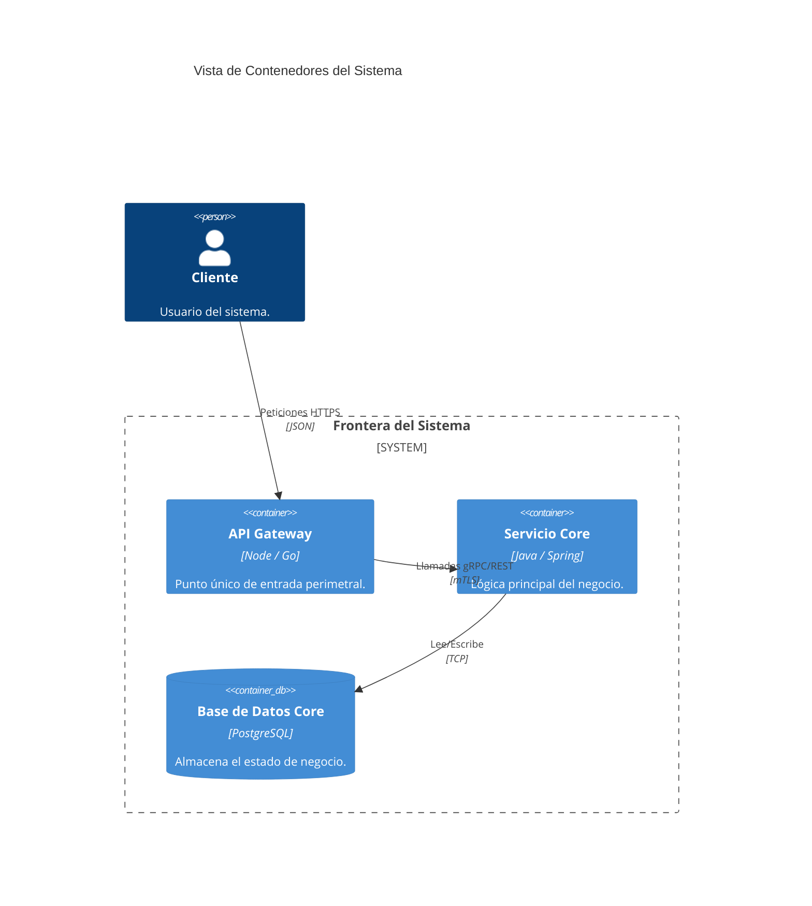

# Descomposición y vistas

## Hipótesis de límite

Para cada límite candidato registra:

| Campo | Contenido |
|---|---|
| Capacidad/subdominio | resultado de negocio y vocabulario |
| Responsabilidades | funcionalidades cohesivas incluidas |
| Exclusiones | qué pertenece a otro límite |
| Modelo/datos | conceptos y ownership, no tablas inventadas |
| Fuerza de separación | despliegue, escala, aislamiento, equipo o regulación |
| Acoplamientos | llamadas, eventos, transacciones y consultas cruzadas |
| Decisión | módulo, servicio, fusionar o TBD |

Un bounded context delimita la validez de un modelo y lenguaje. Puede implementarse en
uno o más módulos/servicios, y un servicio puede necesitar revisión si mezcla contextos.
Valida la decisión con la organización y las transacciones, no sólo con sustantivos del
dominio.

## Señales para mantener/fusionar

- no hay necesidad demostrable de despliegue independiente;
- una operación habitual exige muchas llamadas síncronas entre candidatos;
- invariantes fuertes atraviesan los límites propuestos;
- el mismo equipo cambia siempre ambos componentes en conjunto;
- los límites son CRUD técnicos sin lenguaje ni responsabilidad propios;
- la operación distribuida necesaria no puede sostenerse todavía.

## Vistas del perfil DSI

Produce sólo las exigidas por la consigna:

1. `Vista de funcionalidad`: casos de uso arquitectónicamente significativos elegidos,
   prioridad y justificación; muestra qué componentes/servicios colaboran.
2. `Vista de diseño global`: módulos/componentes principales, interfaces y dependencias.
3. `Vista de diseño detallado`: interior de los componentes relevantes y realización
   de los escenarios seleccionados.
4. `Vista de despliegue`: correspondencia de artefactos software con nodos/entornos
   conocidos; no inventes infraestructura.

No todos los sistemas requieren todas las vistas. Si una vista no aplica, explica la
razón en lugar de rellenarla.

Trazabilidad mínima:

| CU/RNF | Decisión o componente | Vista | Evidencia/estado |
|---|---|---|---|
| requisito | elemento afectado | funcional/global/detallada/despliegue | confirmado/propuesto/TBD |

## Perfil profesional

Puede añadir Context Map y C4 si mejoran la comunicación. En Context Map distingue
relaciones de colaboración/partnership, Customer–Supplier, Conformist, Shared Kernel,
Open Host Service/Published Language y Anti-Corruption Layer. Estas relaciones expresan
dependencia de modelos y organización; no determinan por sí mismas REST, eventos o un
rol publisher/subscriber.

Para migración, propone primero seams y módulos internos. Ordena extracciones por valor,
riesgo y reversibilidad; no asumas una reescritura total.

## Clasificación Canónica de Subdominios (DDD)

| Tipo de Subdominio | Definición de Negocio | Estrategia de Inversión Técnica |
|---|---|---|
| **Core Domain** | La razón de ser del negocio; genera diferenciación competitiva y margen. | Desarrollo a medida de máxima calidad; asignación de los mejores ingenieros. |
| **Supporting Subdomain** | Capacidad que complementa al Core pero no diferencia por sí sola. | Desarrollo a medida simple o adaptación de soluciones existentes. |
| **Generic Subdomain** | Capacidad estándar que toda empresa necesita (ej. autenticación, facturación, emailing). | Comprar COTS, integrar SaaS o usar librerías open-source consolidadas. |

---

## Sintaxis Canónica Mermaid C4Container (Nivel 2)

