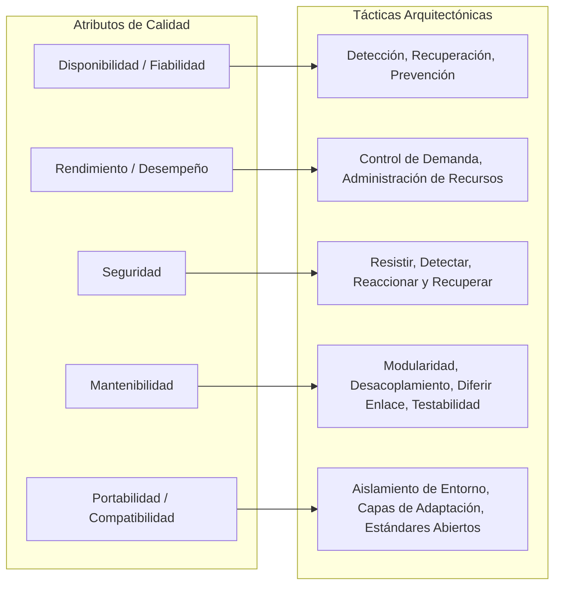
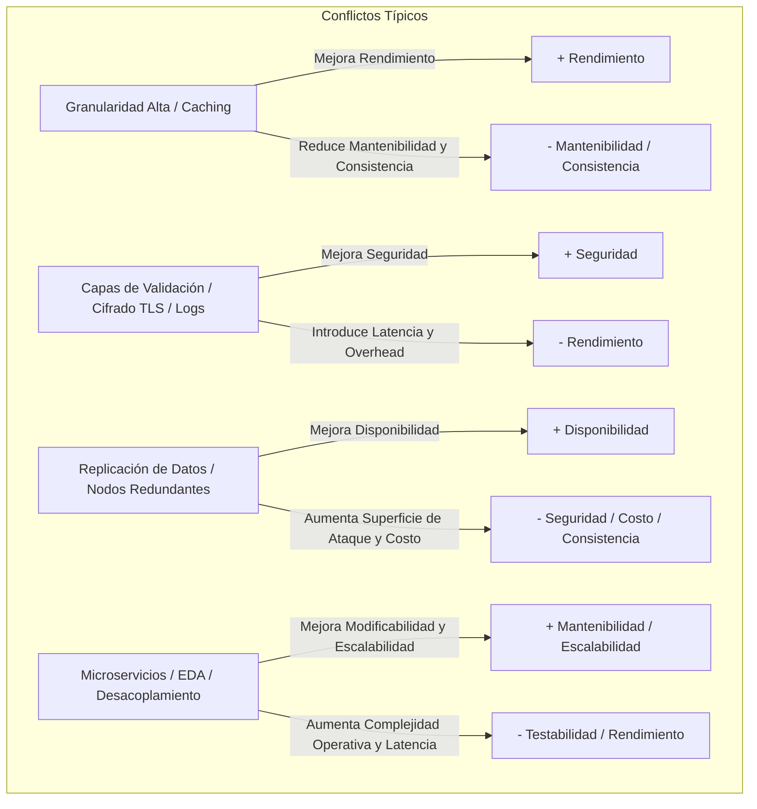
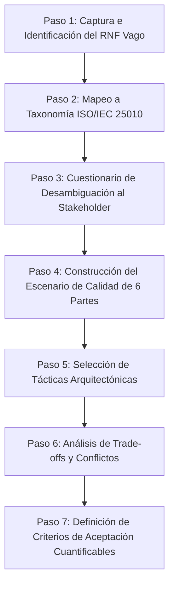
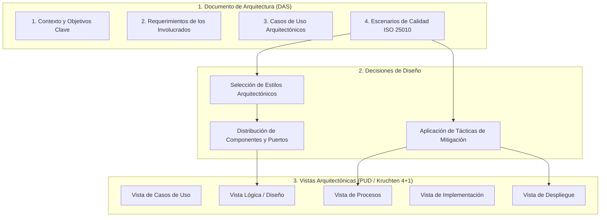

---
name: qualityScenarioSpecifier
description: >-
  Formaliza requerimientos no funcionales en Escenarios de Calidad estructurados y cuantificables
  bajo la norma ISO/IEC 25000 (SQuaRE), asociando tácticas arquitectónicas de diseño para su cumplimiento.
---

# Especialista en Requerimientos No Funcionales y Atributos de Calidad (ISO/IEC 25000 & Escenarios SEI)

Esta skill proporciona las directrices metodológicas, taxonómicas y técnicas para transformar requerimientos no funcionales vagos o ambiguos en **Escenarios de Calidad de 6 Partes** cuantificables, rigurosos y formalizados bajo la norma internacional **ISO/IEC 25000 (SQuaRE / ISO 25010)**, vinculándolos directamente con **Tácticas Arquitectónicas de Diseño** (Bass, Clements & Kazman; Richards & Ford) y documentándolos en el marco de la Cátedra de **Diseño de Sistemas de Información (DSI)**.

---

## 1. El Rol de los Atributos de Calidad en el Diseño Arquitectónico

En la arquitectura de software, las decisiones estructurales fundamentales no están guiadas primordialmente por los requerimientos funcionales (los cuales definen *qué* hace el sistema), sino por los **Atributos de Calidad o Requerimientos No Funcionales (RNF)** (que definen *cómo de bien* lo hace, bajo qué condiciones y con qué restricciones).

```
 +-------------------------------------------------------------------------------+
 |                        CICLO ARQUITECTÓNICO DE DSI                           |
 |                                                                               |
 |   [ Requerimientos del Negocio ]                                              |
 |                 │                                                             |
 |                 ▼                                                             |
 |   [ Requerimientos de Calidad / RNF ] ──► Clasificación ISO/IEC 25010         |
 |                 │                                                             |
 |                 ▼                                                             |
 |   [ Escenarios de Calidad (6 Partes) ] ──► Cuantificación Objetiva           |
 |                 │                                                             |
 |                 ▼                                                             |
 |   [ Selección de Tácticas Arquitectónicas ] ──► Patrones y Estilos (Hexagonal,|
 |                 │                                Layered, EDA, Microserv.)    |
 |                 ▼                                                             |
 |   [ Evaluación de Trade-offs / Conflictos ] ──► Validación de Arquitectura    |
 +-------------------------------------------------------------------------------+
```

### Principios Fundamentales
1. **Objetividad y Verificabilidad**: Un requerimiento de calidad solo es válido si puede medirse y verificarse empíricamente mediante pruebas de carga, pruebas de seguridad, pruebas de estrés o análisis de código. Se prohíben términos subjetivos ("rápido", "robusto", "seguro", "escalable", "intuitivo").
2. **Priorización de Drivers**: Los requerimientos arquitectónicos se priorizan en tres niveles:
   - **Alto**: Conducen directamente el diseño de la arquitectura y la selección del estilo base.
   - **Medio**: Necesarios a mediano plazo (soportados en releases posteriores).
   - **Bajo**: Lista de deseos (*wishlist*), deseables pero no moldean la arquitectura inicial.
3. **Inseparabilidad de Tácticas y Escenarios**: Cada escenario de calidad debe resolverse mediante una o más tácticas arquitectónicas de mitigación explícitamente justificadas.

---

## 2. Taxonomía Exhaustiva ISO/IEC 25000 (SQuaRE)

El estándar **ISO/IEC 25000 (Software product Quality Requirements and Evaluation - SQuaRE)** organiza la calidad en tres modelos complementarios:
1. **Calidad de Producto (ISO/IEC 25010:2011)**: Propiedades estáticas del software y dinámicas de los sistemas informáticos.
2. **Calidad en Uso (ISO/IEC 25010:2011)**: Impacto que el producto tiene sobre los usuarios en un contexto de uso real (Eficacia, Eficiencia, Satisfacción, Libertad de Riesgo, Cobertura de Contexto).
3. **Calidad de Datos (ISO/IEC 25012:2008)**: Exactitud, completitud, consistencia, credibilidad y actualidad de la información.

### Modelo Detallado de Calidad de Producto (ISO/IEC 25010)

A continuación se detalla la jerarquía completa de las **8 Características** y sus respectivas **Sub-características**, incluyendo su definición técnica y las métricas representativas en DSI:

```mermaid
graph TD
    CP[Calidad de Producto ISO 25010]
    
    CP --> AF[1. Adecuación Funcional]
    AF --> AF1[Completitud Funcional]
    AF --> AF2[Corrección Funcional]
    AF --> AF3[Pertinencia Funcional]

    CP --> ED[2. Eficiencia de Desempeño]
    ED --> ED1[Comportamiento Temporal]
    ED --> ED2[Utilización de Recursos]
    ED --> ED3[Capacidad]

    CP --> CO[3. Compatibilidad]
    CO --> CO1[Coexistencia]
    CO --> CO2[Interoperabilidad]

    CP --> US[4. Usabilidad]
    US --> US1[Reconocimiento de Corrección/Adecuación]
    US --> US2[Aprendizaje]
    US --> US3[Operabilidad]
    US --> US4[Protección frente a Errores de Usuario]
    US --> US5[Estética de la UI]
    US --> US6[Accesibilidad]

    CP --> FI[5. Confiabilidad / Fiabilidad]
    FI --> FI1[Madurez]
    FI --> FI2[Disponibilidad]
    FI --> FI3[Tolerancia a Fallos]
    FI --> FI4[Capacidad de Recuperación]

    CP --> SE[6. Seguridad]
    SE --> SE1[Confidencialidad]
    SE --> SE2[Integridad]
    SE --> SE3[No Repudio]
    SE --> SE4[Autenticidad]
    SE --> SE5[Responsabilidad / Trazabilidad]

    CP --> MA[7. Mantenibilidad]
    MA --> MA1[Modularidad]
    MA --> MA2[Reusabilidad]
    MA --> MA3[Analizabilidad]
    MA --> MA4[Capacidad de ser Modificado]
    MA --> MA5[Capacidad de ser Probado / Testabilidad]

    CP --> PO[8. Portabilidad]
    PO --> PO1[Adaptabilidad / Escalabilidad de Cap. Internas]
    PO --> PO2[Facilidad de Instalación]
    PO --> PO3[Capacidad de ser Reemplazado]
```



---

### Tabla Detallada de Características y Sub-características

| Característica | Sub-característica | Definición Formal (DSI / ISO 25010) | Métricas Típicas de Referencia |
| :--- | :--- | :--- | :--- |
| **1. Adecuación Funcional** | **Completitud Funcional** | Grado con el cual el conjunto de funciones cubre todas las tareas especificadas y objetivos de los usuarios. | % de funciones especificadas implementadas satisfactoriamente (100%). |
| | **Corrección Funcional** | Grado con el cual el producto provee los resultados correctos con el nivel de precisión matemática/lógica requerida. | Tasa de defectos de cálculo, margen de error < 0.001%. |
| | **Pertinencia Funcional** | Grado con el cual las funciones facilitan la realización de tareas específicas sin pasos superfluos. | Número de pasos para completar un objetivo, % de funciones utilizadas. |
| **2. Eficiencia de Desempeño** | **Comportamiento Temporal** | Grado en que los tiempos de respuesta, tiempos de procesamiento y tasas de rendimiento cumplen con los requerimientos. | Latencia (ms), tiempo de respuesta percentil 95/99 (p95, p99), Throughput (TPS / RPS). |
| | **Utilización de Recursos** | Grado en que las cantidades y tipos de recursos utilizados (CPU, RAM, disco, ancho de banda) cumplen con los límites establecidos. | % uso CPU (< 70%), consumo de memoria RAM (< 2 GB), I/O IOPS de disco, ancho de banda (Mbps). |
| | **Capacidad** | Grado en que los límites máximos de parámetros (usuarios concurrentes, transacciones, tamaño BD) cumplen con los requerimientos. | Usuarios concurrentes sostenidos (ej. 5.000), tamaño máximo de BD (TB), volumen de datos por lote. |
| **3. Compatibilidad** | **Coexistencia** | Grado en que el producto ejecuta sus funciones compartiendo el entorno y recursos con otros productos sin degradarlos. | Tasa de colisión de puertos/memoria, variación de CPU del software vecino (< 2%). |
| | **Interoperabilidad** | Grado en que dos o más productos o componentes pueden intercambiar información y utilizar esa información intercambiada. | % de mensajes parseados y procesados sin error entre sistemas (100%), adherencia a estándares (OpenAPI, JSON Schema, HL7, ISO 20022). |
| **4. Usabilidad** | **Reconocimiento de Adecuación** | Grado en que los usuarios reconocen si el producto es apropiado para sus necesidades a partir de la primera impresión y documentación. | Tiempo en identificar la función adecuada (< 10 seg), puntuación de idoneidad percibida. |
| | **Aprendizaje** | Grado en que el sistema permite a usuarios específicos alcanzar objetivos de aprendizaje de uso con efectividad y eficiencia. | Tiempo de entrenamiento necesario para operar el sistema sin asistencia (< 2 horas), tasa de éxito en primer uso (> 90%). |
| | **Operabilidad** | Atributos que hacen al sistema fácil de operar, controlar y navegar. | Número de clics por operación, tiempo de ejecución de tareas críticas, índice SUS (System Usability Scale > 80). |
| | **Protección frente a Errores** | Grado en que el sistema protege al usuario de cometer errores y mitiga sus consecuencias. | Tasa de errores operativos prevenidos por validación previa, presencia de confirmaciones críticas y capacidad de deshacer (*undo*). |
| | **Estética de la UI** | Grado en que la interfaz permite una interacción visualmente placentera, coherente y satisfactoria. | Puntuación en encuestas de satisfacción estética, cumplimiento de guía de estilos de diseño. |
| | **Accesibilidad** | Grado en que el sistema puede ser utilizado por personas con el rango más amplio de capacidades (físicas, visuales, auditivas). | Nivel de cumplimiento WCAG 2.1 (Nivel AA o AAA), soporte de lectores de pantalla. |
| **5. Confiabilidad / Fiabilidad** | **Madurez** | Grado en que el sistema cumple necesidades de confiabilidad durante la operación normal bajo condiciones normales. | Tasa de fallas por hora de operación, MTBF (*Mean Time Between Failures* > 720 horas). |
| | **Disponibilidad** | Grado en que el sistema está operativo y accesible cuando se requiere su uso (`MTBF / (MTBF + MTTR)`). | % Uptime anual/mensual (ej. 99.9% = "tres nueves", 99.99% = "cuatro nueves"), minutos máximos de caída no planificada/año. |
| | **Tolerancia a Fallos** | Grado en que el sistema opera según lo previsto a pesar de fallas en el software o el hardware. | % de operaciones completadas con éxito durante caída de un nodo (100% de transacciones de lectura servidas por réplica). |
| | **Capacidad de Recuperación** | Grado en que ante una interrupción o falla, el sistema restablece el estado deseado y recupera la información afectada. | MTTR (*Mean Time To Recovery* < 5 min), RPO (*Recovery Point Objective* = 0 min), RTO (*Recovery Time Objective* < 15 min). |
| **6. Seguridad** | **Confidencialidad** | Grado en que el sistema asegura que los datos son accesibles solo por aquellos autorizados a acceder. | Algoritmos de cifrado en tránsito (TLS 1.3) y reposo (AES-256), 0 fugas de datos en auditorías de penetración. |
| | **Integridad** | Grado en que el sistema previene el acceso no autorizado o la modificación no autorizada de datos y programas. | Detección de alteraciones mediante sumas de verificación/hashes (HMAC SHA-256), 0 corrupciones de datos no detectadas. |
| | **No Repudio** | Grado en que las acciones o eventos pueden ser probados fehacientemente de forma que no puedan ser negados luego. | Firma digital de transacciones (RSA/ECDSA), registros de firmas criptográficas en auditoría. |
| | **Autenticidad** | Grado en que puede establecerse y demostrarse inequívocamente la identidad de un usuario o recurso. | Uso de factores múltiples de autenticación (MFA, WebAuthn, JWT firmado con claves asimétricas RSA/Ed25519). |
| | **Responsabilidad / Trazabilidad** | Grado en que cada acción de una entidad puede rastrearse unívocamente hacia esa entidad específica (*Audit Trail*). | 100% de eventos críticos auditados con ID de usuario, timestamp UTC, IP origen y payload de cambio en log inmutable. |
| **7. Mantenibilidad** | **Modularidad** | Grado en que el sistema está compuesto por módulos discretos cuyo cambio en uno impacta de forma mínima en el resto. | Acoplamiento eferente/aferente bajo, índice de inestabilidad, cumplimiento de arquitectura en capas o hexagonal. |
| | **Reusabilidad** | Grado en que un activo (componente, librería, servicio) puede utilizarse en más de un sistema o construcción de otros activos. | % de código/servicios compartidos entre aplicaciones sin bifurcación de ramas. |
| | **Analizabilidad** | Grado de eficacia y eficiencia para evaluar el impacto de cambios, diagnosticar causas raíz de fallas o identificar partes a modificar. | Tiempo medio para localizar la causa raíz de un bug (*Mean Time To Identify* MTTI < 30 min), trazabilidad distribuida (OpenTelemetry / Jaeger). |
| | **Modificabilidad** | Grado en que el sistema puede ser modificado eficiente y eficazmente sin introducir nuevos defectos ni degradar la calidad. | Tiempo y costo de implementar un nuevo requerimiento/cambio (horas-persona < 8 hs), 0 regresiones detectadas. |
| | **Capacidad de ser Probado** | Eficacia y eficiencia con que se pueden establecer criterios de prueba y ejecutar tests automatizados para validar el sistema. | Cobertura de código por pruebas unitarias/integración (> 80%), tiempo total de ejecución del pipeline de CI/CD (< 10 min). |
| **8. Portabilidad** | **Adaptabilidad** | Grado en que el sistema puede ser adaptado a diferentes entornos operativos, hardware o evolución de capacidades internas (escalabilidad). | Facilidad de migración entre proveedores de nube (AWS a GCP), capacidad de escalar esquemas de BD sin rediseño estructural. |
| | **Facilidad de Instalación** | Grado de efectividad y eficiencia para instalar o desinstalar exitosamente el software en determinado entorno. | Tiempo de despliegue automatizado (*Zero-Downtime Deployment* < 5 min), infraestructura como código reproducible (IaC / Docker). |
| | **Capacidad de Reemplazo** | Grado en que el producto puede reemplazar a otro producto de software específico con el mismo propósito y entorno. | Compatibilidad 100% con APIs preexistentes, sin necesidad de reprogramar los clientes consumidores. |

---

## 3. Estructura Formal de Escenarios de Calidad de 6 Partes (Bass, Clements & Kazman)

Para que un requerimiento de calidad sea ejecutable y verificable en la arquitectura, debe especificarse como un **Escenario de Calidad de 6 Partes** (desarrollado originalmente por el Software Engineering Institute - SEI):

```
 +───────────────────────────────────────────────────────────────────────────+
 |                     PARTES DE UN ESCENARIO DE CALIDAD                     |
 |                                                                           |
 |   (1) Fuente del Estímulo ────► (2) Estímulo                              |
 |              │                                                            |
 |              ▼                                                            |
 |   (3) Entorno / Condición                                                 |
 |              │                                                            |
 |              ▼                                                            |
 |   (4) Artefacto Afectado  ────► (5) Respuesta del Sistema                 |
 |                                             │                             |
 |                                             ▼                             |
 |                                 (6) Medida de Respuesta                   |
 +───────────────────────────────────────────────────────────────────────────+
```

### Detalle de las 6 Partes

1. **Fuente del Estímulo (*Source of Stimulus*)**: La entidad (persona, atacante, sensor, sistema externo, proceso por lotes, desarrollador, infraestructura) que genera el evento o condición estimulante.
2. **Estímulo (*Stimulus*)**: El evento, petición, falla, ataque o solicitud de cambio que incide sobre el sistema.
3. **Entorno (*Environment*)**: El estado o condición operacional en que se encuentra el sistema en el momento en que ocurre el estímulo (ej. operación normal, sobrecarga pico, falla de conectividad, proceso de despliegue, modo recuperación).
4. **Artefacto Afectado (*Artifact*)**: La porción de la arquitectura que recibe el estímulo (ej. todo el sistema, API Gateway, base de datos relacional, microservicio de facturación, canal de eventos, interfaz de usuario).
5. **Respuesta del Sistema (*Response*)**: La actividad, comportamiento o acción medible que la arquitectura y sus componentes realizan para satisfacer el estímulo.
6. **Medida de Respuesta (*Response Measure*)**: La métrica cuantitativa y objetiva que determina si la respuesta fue exitosa o fallida (tiempo en milisegundos/segundos, percentiles de latencia, porcentaje de disponibilidad, MTBF, MTTR, costo en horas-persona, tasa de error).

---

### Plantilla Estándar para Especificación de Escenario

```markdown
### Escenario de Calidad: [ID-ESC-XX] - [Título Descriptivo Breve]

| Componente del Escenario | Especificación Formal |
| :--- | :--- |
| **Identificador** | `ESC-[ATRIBUTO]-[NRO]` (ej. `ESC-DISP-01`, `ESC-REND-02`, `ESC-SEG-01`) |
| **Atributo ISO 25010** | [Característica Principal] ──► **[Sub-característica Específica]** |
| **1. Fuente del Estímulo** | [¿Quién o qué origina el estímulo? Interno, Externo, Atacante, Cron, Hardware] |
| **2. Estímulo** | [¿Qué evento o solicitud ocurre? Transacción masiva, Falla de red, Intento de inyección SQL, Nuevo requerimiento] |
| **3. Entorno** | [¿Bajo qué condiciones operacionales? Operación normal, Modo pico de alta demanda, Caída parcial de nodo, Compilación] |
| **4. Artefacto** | [¿Qué parte del sistema recibe el estímulo? Toda la solución, Capa de Persistencia, API Gateway, Microservicio X] |
| **5. Respuesta del Sistema** | [¿Qué acciones realiza el sistema? Encolar, procesar asíncronamente, aislar falla, denegar y auditar, reintentar con backoff] |
| **6. Medida de Respuesta** | [Métrica cuantificable: Latencia p95 < 800 ms, Uptime 99.95%, MTTR < 3 min, 0 pérdida de transacciones confirmadas, Costo < 4 hs] |
| **Tácticas Arquitectónicas** | [Táctica 1, Táctica 2, Táctica 3 - Ver Catálogo de la Sección 4] |
| **Trade-offs / Conflictos** | [Impacto colateral en otros atributos: ej. Incrementa complejidad de despliegue y uso de memoria] |
```

---

## 4. Catálogo de Tácticas Arquitectónicas de Mitigación

Las tácticas son decisiones de diseño arquitectónico probadas que manipulan directamente las propiedades estructurales y dinámicas de un sistema para influir en una medida de respuesta de calidad.



---

### 4.1. Tácticas para Fiabilidad y Disponibilidad (*Availability / Reliability*)

El objetivo es asegurar que el sistema permanezca en servicio y maneje fallas de hardware, software y red con un MTTR mínimo y alta tolerancia.

#### A. Detección de Fallas (*Fault Detection*)
- **Ping / Echo**: Consulta periódica bidireccional entre nodos para determinar la vitalidad y latencia de conexión.
- **Heartbeat**: Emisión periódica unidireccional de un pulso de vida desde un componente monitoreado hacia un coordinador. Si expira el temporizador sin pulso, se asume falla del nodo.
- **Health Checks (Liveness & Readiness)**: Endpoints HTTP/TCP que validan el estado interno del componente y sus dependencias críticas (ej. base de datos, colas) antes de enrutar tráfico.
- **Timers / Timeouts**: Cancelación de una llamada sincrónica que excede un umbral predefinido para liberar hilos y evitar bloqueo en cascada.
- **Excepciones y Logging Estructurado**: Captura centralizada de excepciones para registrar anomalías con stacktrace y contexto de ejecución sin abortar el proceso global.

#### B. Recuperación de Fallas - Preparación y Reparación (*Fault Recovery - Preparation & Repair*)
- **Redundancia Activa (*Active Redundancy / Hot Standby*)**: Todas las réplicas procesan los eventos en paralelo. Si el nodo principal cae, cualquier réplica responde de inmediato en tiempo cero (0 ms) sin pérdida de estado.
- **Redundancia Pasiva (*Passive Redundancy / Warm Standby / Cold Standby*)**:
  - *Warm Standby*: La réplica secundaria recibe sincronizaciones periódicas del estado y toma el control tras un breve período de promoción.
  - *Cold Standby*: La réplica está apagada y se aprovisiona/levanta únicamente tras la detección del fallo del nodo principal.
- **Degradación Elegante (*Graceful Degradation / Fallback*)**: Ante la falla de un subsistema secundario (ej. motor de recomendaciones), el sistema desactiva dicha funcionalidad no crítica y continúa sirviendo las operaciones vitales (ej. catálogo y checkout).
- **Circuit Breaker**: Patrón de protección que abre el circuito tras detectar *N* fallos consecutivos en una dependencia remota, respondiendo inmediatamente con fallback para evitar saturar el sistema y permitiendo pruebas automáticas de recuperación (*half-open*).
- **Retry con Exponential Backoff y Jitter**: Reintento de llamadas fallidas con retardos progresivamente mayores y variabilidad aleatoria para no colapsar un servicio en recuperación.
- **Rollback y Checkpoint**: Puntos de control persistentes que permiten revertir el estado del sistema al último estado consistente conocido ante fallas transaccionales no recuperables.

#### C. Recuperación de Fallas - Reintroducción (*Fault Recovery - Reintroduction*)
- **Shadowing**: Ejecución de un nodo recuperado en modo pasivo hasta validar que su estado interno está 100% sincronizado con el nodo principal antes de reincorporarlo al balanceador de carga.
- **Resincronización de Estado (*State Resynchronization*)**: Rehidratación de estado a partir de un log de eventos (Event Sourcing / Change Data Capture) tras el reinicio del componente.

#### D. Prevención de Fallas (*Fault Prevention*)
- **Supervisor de Procesos (*Process Restart / Bulkhead*)**: Aislamiento de procesos en contenedores o pools de hilos independientes para que una falla en un hilo o proceso no propague la caída a todo el sistema.
- **Transacciones Atómicas y Sagás Distribuidas**: Garantía de atomicidad mediante transacciones ACID locales o coreografía/orquestación de transacciones compensatorias en arquitecturas de microservicios.

---

### 4.2. Tácticas para Rendimiento y Eficiencia de Desempeño (*Performance Efficiency*)

El objetivo es minimizar el tiempo de respuesta (latencia), maximizar el rendimiento de procesamiento (*throughput*) y optimizar el uso de recursos computacionales.

#### A. Control de la Demanda de Recursos (*Manage Resource Demand*)
- **Reducir Frecuencia de Eventos / Muestreo**: Ajustar el intervalo de sondeo (*polling*) o migrar a comunicación basada en eventos push (*WebSockets / Server-Sent Events*).
- **Rate Limiting / Throttling**: Limitar el número de peticiones admitidas por usuario/IP por unidad de tiempo (ej. algoritmo Token Bucket / Leaky Bucket) para proteger la capacidad del backend.
- **Colas con Prioridad (*Priority Queues*)**: Procesar primero las transacciones de negocio críticas (ej. pagos) antes que las tareas secundarias (ej. reportes analíticos).
- **Reducción de Overhead de Comunicación (Granularidad Gruesa)**: Reemplazar múltiples llamadas remotas de grano fino por una única llamada de grano grueso (*Batching*, endpoints de agregación tipo BFF o GraphQL), reduciendo la penalidad de latencia de red.

#### B. Administración de Recursos (*Manage Resources*)
- **Concurrencia y Procesamiento Asíncrono**: Desacoplamiento de tareas intensivas de CPU mediante hilos de trabajo en segundo plano (*Background Workers*, colas de mensajería AMQP/Kafka), liberando el hilo principal de la interfaz o API.
- **Caching Multinivel**:
  - *Caché en Cliente / Navegador*: Encabezados HTTP Cache-Control, ETag.
  - *Caché de Borde (Edge / CDN)*: Distribución geográfica de activos estáticos y respuestas cacheadas (Cloudflare, CloudFront).
  - *Caché de Aplicación / Distribuida*: Almacenamiento en memoria ultrarrápido (Redis, Memcached) para consultas frecuentes de base de datos.
- **Particionamiento de Datos (*Sharding / Horizontal Partitioning*)**: División de grandes tablas de base de datos en múltiples instancias físicas basadas en una clave de partición.
- **Balanceo de Carga (*Load Balancing*)**: Distribución equitativa de peticiones entre múltiples instancias de aplicación mediante algoritmos Round-Robin, Least Connections o IP-Hash.
- **Pooling de Conexiones e Hilos (*Connection & Thread Pooling*)**: Reutilización de conexiones a bases de datos y sockets TCP ya establecidos para evitar el alto costo de creación y destrucción continua de conexiones.

---

### 4.3. Tácticas para Seguridad (*Security*)

El objetivo es resistir, detectar y recuperarse de ataques contra la confidencialidad, integridad, autenticidad, no repudio y trazabilidad del sistema.

#### A. Resistir Ataques (*Resist Attacks*)
- **Autenticación Fuerte y Descentralizada**: Uso de tokens firmados asimétricamente (JWT / OAuth 2.0 / OpenID Connect) y mecanismos de múltiples factores (MFA).
- **Autorización Basada en Roles y Atributos (RBAC / ABAC)**: Verificación estricta de políticas de acceso en cada capa de servicio antes de ejecutar cualquier acción de dominio.
- **Cifrado Fuerte**:
  - *En Tránsito*: Protocolo TLS 1.3 forzado en todas las conexiones externas e internas (mTLS / Service Mesh).
  - *En Reposo*: Cifrado de bases de datos, backups y volúmenes de disco con algoritmos estándar como AES-256.
- **Validación y Sanitización de Entradas en Capas (*Defense in Depth*)**: Validación estricta de esquemas de datos tanto en la interfaz de usuario como obligatoriamente en el backend para neutralizar ataques de Inyección SQL (mediante consultas parametrizadas / ORM), XSS y CSRF.
- **Aislamiento en Zonas de Red (*DMZ / VPC / Zero Trust*)**: Ubicación de servidores de base de datos en subredes privadas sin acceso directo a Internet, exponiendo únicamente el API Gateway en la zona desmilitarizada.

#### B. Detectar Ataques (*Detect Attacks*)
- **Sistemas de Detección/Prevención de Intrusiones (IDS / IPS / WAF)**: Inspección de tráfico HTTP/HTTPS en tiempo real para bloquear firmas de ataques conocidos y anomalías de comportamiento.
- **Verificación de Integridad de Mensajes**: Uso de hashes criptográficos y firmas HMAC (ej. SHA-256) en webhooks y comunicaciones interbancarias para asegurar que los datos no fueron alterados en tránsito.

#### C. Reaccionar y Recuperarse de Ataques (*React & Recover*)
- **Revocación Inmediata de Tokens y Cierre Forzoso de Sesiones**: Lista negra (*Blacklist*) de tokens en caché distribuida (Redis) para invalidar accesos comprometidos en milisegundos.
- **Registro de Auditoría Inmutable (*Immutable Audit Trail*)**: Logs de eventos de seguridad enviados de forma append-only a almacenamiento centralizado seguro (ej. Elasticsearch / CloudWatch / WORM) para garantizar la trazabilidad y el no repudio.
- **Aislamiento de Cuentas Comprometidas**: Bloqueo temporal automático tras *N* intentos fallidos de autenticación (defensa contra ataques de fuerza bruta).

---

### 4.4. Tácticas para Mantenibilidad y Modificabilidad (*Maintainability / Modifiability*)

El objetivo es reducir el tiempo, costo y riesgo de realizar cambios correctivos, adaptativos, evolutivos y perfectivos en el software.

#### A. Reducir el Tamaño del Módulo y Aumentar la Cohesión
- **Particionamiento por Dominio (*Domain-Driven Design*)**: Agrupación de clases y componentes en torno a conceptos y límites del negocio (*Bounded Contexts*), evitando modelos de dominio anémicos o monolitos espagueti (*Big Ball of Mud*).
- **Principio de Responsabilidad Única (SRP)**: Cada clase, módulo o microservicio debe tener una única razón para cambiar.

#### B. Restringir Dependencias y Desacoplar Componentes
- **Inversión de Dependencias (DIP) y Arquitectura Hexagonal (Puertos y Adaptadores)**:
  - El núcleo de negocio (*Domain & Application Service*) define **Puertos** (interfaces) y no depende de frameworks, bases de datos ni protocolos de red.
  - Los detalles técnicos externos (Spring MVC, JDBC, RabbitMQ, REST Clients) se implementan en **Adaptadores** que se conectan a los puertos.
  - La dirección de la dependencia siempre apunta hacia adentro (hacia el dominio).
- **Uso de Intermediarios y Capas de Abstracción**: Introducción de adaptadores, mediadores (*Mediator Pattern* / Event Bus) o capas de servicio para aislar a los consumidores de cambios en proveedores externos o COTS.
- **Ocultamiento de Información / Encapsulamiento**: Exponer únicamente contratos públicos mínimos y ocultar estructuras de datos internas, evitando dependencias transitivas.

#### C. Diferir el Enlace (*Defer Binding Time*)
- **Inyección de Dependencias (DI / IoC Containers)**: Resolución de dependencias en tiempo de ejecución o inicialización, permitiendo reemplazar implementaciones sin recompilar.
- **Configuración Externa / Variables de Entorno (12-Factor App)**: Extracción de parámetros de base de datos, URLs de servicios y llaves a archivos `.env` o servidores de configuración (*Consul / Spring Cloud Config*).
- **Arquitectura de Microkernel / Plugins**: Sistema base extensible donde nuevas funcionalidades se agregan como complementos independientes.
- **Feature Flags / Toggles**: Habilitación o desactivación de funcionalidades en tiempo de ejecución mediante configuración sin requerir un nuevo despliegue.

#### D. Mejorar la Capacidad de Prueba (*Testability*)
- **Aislamiento de Interfaces para Test (Mocks / Stubs / Spies)**: Capacidad de sustituir componentes lentos o externos (pasarelas de pago, bases de datos) por dobles de prueba rápidos en tests unitarios.
- **Pipeline de Integración Continua (CI)**: Ejecución automatizada de suites de pruebas unitarias, de integración y de regresión en cada commit para validar la ausencia de efectos colaterales.

---

### 4.5. Tácticas para Portabilidad y Compatibilidad (*Portability / Compatibility*)

El objetivo es permitir que el software sea transferido entre diferentes entornos operativos, hardware o arquitecturas de nube, e interactúe fluidamente con otros sistemas.

- **Contenedorización (Docker / OCI)**: Empaquetamiento del software junto con todas sus dependencias, librerías y configuraciones en imágenes inmutables ejecutables en cualquier sistema operativo.
- **Capa de Abstracción de Base de Datos (Repository Pattern / ORM)**: Aislamiento del código de dominio respecto del dialecto SQL específico (PostgreSQL, Oracle, MySQL).
- **Uso de Estándares Abiertos de Comunicación**: Implementación de interfaces RESTful JSON, gRPC (Protobuf), OpenAPI/Swagger y GraphQL independientes del lenguaje de programación.
- **Pasarelas de Integración (API Gateway / ESB / Anti-Corruption Layer)**: Transformación de protocolos y esquemas entre sistemas heterogéneos o legados sin contaminar el dominio central.

---

## 5. Conflictos Arquitectónicos y Compensaciones (Trade-offs)

Ninguna decisión arquitectónica es gratuita; la optimización de un atributo de calidad usualmente impacta negativamente en otros. El arquitecto debe identificar y balancear estos compromisos:



### Las 8 Falacias de los Sistemas Distribuidos (L. Peter Deutsch)
Al diseñar tácticas arquitectónicas en sistemas distribuidos, nunca debe asumirse:
1. *La red es confiable* (las conexiones fallan ──► requiere Timeouts, Retries, Circuit Breaker).
2. *La latencia es cero* (las llamadas remotas son 1000x más lentas que en memoria ──► requiere Caching, Batching).
3. *El ancho de banda es infinito* (la transferencia cuesta tiempo y recursos ──► requiere compresión, DTOs ligeros).
4. *La red es segura* (cualquier segmento puede ser intervenido ──► requiere TLS forzado, Zero Trust).
5. *La topología nunca cambia* (los nodos se crean y destruyen dinámicamente ──► requiere Service Discovery, DNS dinámico).
6. *Hay un único administrador* (diferentes sistemas operan bajo distintas políticas ──► requiere gobernanza de APIs).
7. *El costo de transporte es cero* (serializar/deserializar tiene costo de CPU ──► requiere formatos eficientes como JSON/Protobuf).
8. *La red es homogénea* (conviven diferentes SO, versiones y protocolos ──► requiere estándares abiertos).

---

## 6. Procedimiento Metodológico Paso a Paso para Desambiguar Requerimientos Vagos

Cuando un cliente, stakeholder o enunciado de problema presente requerimientos vagos, el agente debe seguir rigurosamente el siguiente flujo de 7 pasos:



### Paso 1: Captura e Identificación del Requerimiento Vago
Detectar expresiones ambiguas comunes:
- *"El sistema debe responder rápido."*
- *"La base de datos debe ser segura y no caerse nunca."*
- *"Debe soportar muchos usuarios simultáneos sin colapsar."*
- *"Debe ser fácil de modificar si el negocio cambia."*
- *"La pantalla debe ser intuitiva y moderna."*

### Paso 2: Mapeo a la Taxonomía ISO/IEC 25010
Identificar la **Característica Principal** y la **Sub-característica Específica** que gobierna el requerimiento (ej. "responder rápido" ──► *Eficiencia de Desempeño* ──► *Comportamiento Temporal*).

### Paso 3: Cuestionario de Desambiguación Dirigido por Atributo
Formular las preguntas críticas para cuantificar los parámetros:
- **Para Rendimiento**: ¿Cuál es el volumen esperado de transacciones en horas normales y en picos? ¿Cuál es el tiempo máximo tolerable por el usuario en el percentil 95?
- **Para Disponibilidad**: ¿Cuál es la ventana de operación requerida (24/7, 8 a 20 hs)? ¿Cuánto tiempo máximo puede demorar la recuperación ante un desastre (RTO/MTTR)?
- **Para Seguridad**: ¿Qué nivel de confidencialidad tienen los datos almacenados (tarjetas, historias clínicas, datos personales)? ¿Qué marco normativo aplica (GDPR, PCI-DSS, LPDP)?
- **Para Mantenibilidad**: ¿Con qué frecuencia se espera agregar nuevas reglas de negocio o pasarelas externas? ¿Cuál es el esfuerzo máximo tolerable para integrar un nuevo módulo?

### Paso 4: Construcción del Escenario Formal de 6 Partes
Completar la matriz estandarizada:
1. Fuente del Estímulo
2. Estímulo
3. Entorno
4. Artefacto Afectado
5. Respuesta del Sistema
6. Medida de Respuesta (métrica objetiva: ms, %, MTBF, MTTR, horas-persona)

### Paso 5: Selección y Justificación de Tácticas Arquitectónicas
Asociar las tácticas arquitectónicas específicas de mitigación (ej. Caching Redis + Connection Pooling + Load Balancer).

### Paso 6: Análisis de Trade-offs y Efectos Colaterales
Evaluar qué otros atributos se ven comprometidos y planificar mitigaciones secundarias.

### Paso 7: Validación y Criterios de Aceptación Cuantificables
Definir la prueba concreta de validación (ej. prueba de carga JMeter/k6 simulando 2.000 usuarios con latencia p95 < 500 ms; escaneo de vulnerabilidades OWASP ZAP con 0 alertas críticas).

---

## 7. Catálogo de Ejemplos Exhaustivos Listos para Usar en DSI

A continuación se presentan 5 casos de estudio completos que modelan situaciones reales de ingeniería de software y evaluaciones de la cátedra de DSI.

---

### Ejemplo 1: Eficiencia de Desempeño / Comportamiento Temporal (Plataforma de E-Commerce)

#### 1. Requerimiento Inicial Vago
> *"El sistema debe procesar las compras del CyberMonday muy rápido y sin demoras en el checkout."*

#### 2. Clasificación ISO/IEC 25010
- **Característica**: Eficiencia de Desempeño
- **Sub-característica**: Comportamiento Temporal y Capacidad

#### 3. Escenario Formal de 6 Partes (`ESC-REND-01`)

| Componente | Detalle |
| :--- | :--- |
| **Identificador** | `ESC-REND-01` |
| **1. Fuente del Estímulo** | 10.000 usuarios concurrentes en la web y app móvil durante evento de alta demanda. |
| **2. Estímulo** | Envío de 1.500 solicitudes de checkout/pago por segundo de forma simultánea. |
| **3. Entorno** | Operación en modo pico de tráfico extremo (CyberMonday / BlackFriday). |
| **4. Artefacto** | Subsistema de Checkout, API Gateway y Base de Datos Transaccional. |
| **5. Respuesta del Sistema** | Encolar peticiones de pago en un broker de mensajes asíncrono, distribuir la carga entre réplicas del microservicio de órdenes y confirmar la recepción de la orden al cliente de forma inmediata con polling/webhook. |
| **6. Medida de Respuesta** | **Tiempo de respuesta de la API de checkout <= 400 ms (percentil 95)**, tiempo total de confirmación de pago <= 3 segundos, tasa de error HTTP 5xx <= 0.01%, 0 pérdida de pedidos. |

#### 4. Tácticas Arquitectónicas Aplicadas
1. **Control de demanda**: *Rate limiting* a nivel de API Gateway mediante algoritmo Token Bucket.
2. **Administración de recursos**: Procesamiento asíncrono de órdenes mediante cola de mensajería (RabbitMQ / Kafka) desacoplando la confirmación de la orden del procesamiento del cobro.
3. **Administración de recursos**: Caching de catálogo y stock preliminar en memoria distribuida (Redis) para reducir el 80% de lecturas a la base de datos relacional.
4. **Administración de recursos**: Balanceo de carga L7 con autoscaling horizontal de instancias en contenedores.

#### 5. Trade-offs y Mitigaciones
- *Conflicto*: La asincronía introduce consistencia eventual en el stock y mayor complejidad de depuración.
- *Mitigación*: Implementación de reserva temporal de stock con TTL de 10 minutos y transacciones compensatorias (Patrón Saga).

---

### Ejemplo 2: Disponibilidad y Tolerancia a Fallos (Sistema de Estacionamiento Medido Urbano tipo MovyPark)

#### 2.1. Requerimiento Inicial Vago
> *"La aplicación de estacionamiento medido debe funcionar siempre, incluso si se cae el servidor o falla la conexión de los inspectores en la calle."*

#### 2.2. Clasificación ISO/IEC 25010
- **Característica**: Confiabilidad / Fiabilidad
- **Sub-característica**: Disponibilidad, Tolerancia a Fallos y Capacidad de Recuperación

#### 2.3. Escenario Formal de 6 Partes (`ESC-DISP-01`)

| Componente | Detalle |
| :--- | :--- |
| **Identificador** | `ESC-DISP-01` |
| **1. Fuente del Estímulo** | Falla de hardware en el nodo primario de base de datos o corte de enlace de red con la pasarela de pagos. |
| **2. Estímulo** | Interrupción no programada del servicio de base de datos principal durante el horario bancario/comercial. |
| **3. Entorno** | Operación normal en horario pico de estacionamiento (Lunes a Viernes de 08:00 a 20:00 hs). |
| **4. Artefacto** | Servidor de Datos Central y Módulo de Validación de Infracciones. |
| **5. Respuesta del Sistema** | El sistema detecta la falla mediante health-checks, conmuta automáticamente el tráfico al nodo de base de datos secundario (failover), y las terminales móviles de los inspectores operan en modo desconectado guardando actas en almacenamiento local cifrado. |
| **6. Medida de Respuesta** | **Disponibilidad global >= 99.95% anual**, tiempo de conmutación de base de datos (**MTTR**) <= 30 segundos, **RPO = 0 minutos** (sin pérdida de transacciones de saldo), sincronización automática de actas locales en menos de 60 segundos tras restablecer la conexión. |

#### 2.4. Tácticas Arquitectónicas Aplicadas
1. **Detección de fallas**: *Heartbeat* y sondeo activo continuo del orquestador sobre la salud de los nodos.
2. **Recuperación de fallas**: *Redundancia Pasiva Caliente (Warm Standby)* con replicación síncrona en clúster de base de datos (PostgreSQL Multi-AZ con failover automático).
3. **Tolerancia a fallos**: *Almacenamiento Local Offline con Sincronización Diferida* en clientes móviles (SQLite cifrado + background sync).
4. **Prevención de fallas**: *Circuit Breaker* en el servicio de pago para evitar que las demoras de la pasarela externa agoten los hilos del servidor central.

---

### Ejemplo 3: Seguridad / Confidencialidad, Integridad y No Repudio (Sistema Financiero / Fintech)

#### 3.1. Requerimiento Inicial Vago
> *"El sistema debe ser ultra seguro, nadie debe poder transferir dinero ajeno ni hackear las cuentas ni borrar los comprobantes."*

#### 3.2. Clasificación ISO/IEC 25010
- **Característica**: Seguridad
- **Sub-característica**: Confidencialidad, Integridad, No Repudio, Autenticidad y Responsabilidad/Trazabilidad

#### 3.3. Escenario Formal de 6 Partes (`ESC-SEG-01`)

| Componente | Detalle |
| :--- | :--- |
| **Identificador** | `ESC-SEG-01` |
| **1. Fuente del Estímulo** | Atacante externo o usuario malintencionado autenticado que intenta manipular parámetros de transferencia (IDOR / Man-in-the-Middle) o repudiar una transacción de $500.000. |
| **2. Estímulo** | Envío de solicitud HTTP manipulada modificando la cuenta de débito de origen y alterando montos sin clave transaccional. |
| **3. Entorno** | Operación normal del sistema en producción conectado a Internet. |
| **4. Artefacto** | API Gateway, Servicio de Transferencias Bancarias y Módulo de Auditoría. |
| **5. Respuesta del Sistema** | Validar la firma digital del token JWT, verificar que la cuenta de origen pertenezca al sujeto autenticado (autorización ABAC), exigir token MFA de segundo factor para montos elevados, cifrar la transacción y generar un registro inmutable firmado criptográficamente en el log de auditoría. |
| **6. Medida de Respuesta** | **100% de transacciones no autorizadas bloqueadas**, **0% de transferencias ejecutables sin verificación estricta de titularidad**, generación de log de auditoría inmutable con sello de tiempo UTC en <= 100 ms, tiempo de revocación y bloqueo preventivo de cuenta <= 1 segundo tras 3 intentos fallidos de clave de transacción. |

#### 3.4. Tácticas Arquitectónicas Aplicadas
1. **Resistir ataques**: Autenticación multifactor obligatoria (MFA vía TOTP/FIDO2) + Autorización basada en atributos (ABAC).
2. **Resistir ataques**: Cifrado extremo a extremo (TLS 1.3 forzado con HSTS) y cifrado de datos sensibles en reposo mediante AES-256 con claves rotativas en HSM (*Hardware Security Module*).
3. **Resistir ataques**: Consultas SQL parametrizadas y validación estricta de esquemas DTO en backend.
4. **Detectar y registrar**: *Immutable Audit Trail* con encadenamiento de bloques hash (SHA-256) para garantizar el no repudio absoluto ante peritajes legales.

---

### Ejemplo 4: Mantenibilidad / Modificabilidad y Testabilidad (Arquitectura Hexagonal en Sistema de Facturación)

#### 4.1. Requerimiento Inicial Vago
> *"El módulo de facturación debe poder adaptarse fácilmente si la AFIP/ARCA cambia la normativa o si queremos cambiar de base de datos MySQL a PostgreSQL sin romper todo el sistema."*

#### 4.2. Clasificación ISO/IEC 25010
- **Característica**: Mantenibilidad
- **Sub-característica**: Modularidad, Modificabilidad, Capacidad de ser probado y Analizabilidad

#### 4.3. Escenario Formal de 6 Partes (`ESC-MANT-01`)

| Componente | Detalle |
| :--- | :--- |
| **Identificador** | `ESC-MANT-01` |
| **1. Fuente del Estímulo** | Equipo de desarrollo / Requerimiento regulatorio de la entidad tributaria (AFIP/ARCA) que impone nuevo formato de Web Service de Factura Electrónica. |
| **2. Estímulo** | Solicitud de cambio para integrar el nuevo proveedor de facturación electrónica y migrar el motor de persistencia a PostgreSQL. |
| **3. Entorno** | Fase de mantenimiento evolutivo del sistema en entorno de desarrollo y testing. |
| **4. Artefacto** | Capa de Adaptadores Externos (*Driven Side*) del Módulo de Facturación. |
| **5. Respuesta del Sistema** | El desarrollador crea una nueva implementación del puerto `FacturacionElectronicaPort` y del puerto `FacturaRepositoryPort` sin alterar ninguna clase del dominio ni de los casos de uso de la aplicación. |
| **6. Medida de Respuesta** | **Tiempo de desarrollo e integración del nuevo adaptador <= 16 horas-persona**, **0 líneas de código modificadas en la capa de dominio/casos de uso**, cobertura de pruebas unitarias sobre el nuevo adaptador >= 85%, tiempo de ejecución de la suite de pruebas automatizadas <= 3 minutos sin regresiones. |

#### 4.4. Tácticas Arquitectónicas Aplicadas
1. **Restringir dependencias**: *Arquitectura Hexagonal (Puertos y Adaptadores)*: Inversión de Dependencias (DIP) donde la lógica de negocio depende exclusivamente de interfaces de puertos abstractos.
2. **Diferir el enlace**: *Inyección de Dependencias (DI)* en tiempo de configuración para seleccionar el adaptador de AFIP activo mediante variables de entorno sin recompilar el núcleo.
3. **Reducir acoplamiento**: *Ocultamiento de información*: El dominio desconoce si la persistencia es relacional, NoSQL o en memoria.
4. **Testabilidad**: Pruebas unitarias del core ejecutadas con Mocks y Stubs en milisegundos sin requerir conexión a internet ni a bases de datos reales.

---

### Ejemplo 5: Usabilidad / Protección frente a Errores y Operabilidad (Sistema de Prescripción Médica)

#### 5.1. Requerimiento Inicial Vago
> *"El sistema de recetas médicas debe ser fácil de usar para los doctores y evitar que se equivoquen con las dosis o medicamentos contraindicados."*

#### 5.2. Clasificación ISO/IEC 25010
- **Característica**: Usabilidad
- **Sub-característica**: Protección frente a Errores de Usuario, Operabilidad y Aprendizaje

#### 5.3. Escenario Formal de 6 Partes (`ESC-USAB-01`)

| Componente | Detalle |
| :--- | :--- |
| **Identificador** | `ESC-USAB-01` |
| **1. Fuente del Estímulo** | Médico de guardia con alto nivel de fatiga durante turno nocturno en hospital. |
| **2. Estímulo** | Intento de prescribir un medicamento con dosis diez veces superior a la recomendada o con interacción alérgica registrada en la historia clínica del paciente. |
| **3. Entorno** | Operación normal en sala de emergencias con presión de tiempo. |
| **4. Artefacto** | Interfaz de Usuario de Prescripción Médica y Motor de Validación de Reglas Clínicas. |
| **5. Respuesta del Sistema** | El sistema detecta la incompatibilidad en tiempo real antes de confirmar, resalta visualmente el campo en rojo, bloquea la confirmación accidental y muestra una alerta modal clara con la explicación clínica del riesgo y la dosis sugerida, permitiendo cancelar o corregir con un solo clic. |
| **6. Medida de Respuesta** | **100% de recetas con contraindicaciones críticas alertadas antes de su emisión**, tiempo de emisión de una receta estándar <= 45 segundos para médicos con menos de 30 minutos de entrenamiento previo, **tasa de error de prescripción inadvertida = 0%**. |

#### 5.4. Tácticas Arquitectónicas Aplicadas
1. **Iniciativa del sistema**: Validación predictiva y proactiva en frontend en tiempo real combinada con validación asíncrona de reglas de negocio en backend.
2. **Iniciativa del usuario**: Capacidad de cancelación inmediata y flujo de confirmación explícita de dos pasos para acciones con riesgo clínico.
3. **Operabilidad**: Autocompletado asistido por vademécum inteligente que reduce los tecleos y previene errores tipográficos.

---

## 8. Integración con el Documento de Arquitectura de Software (DAS / SAD) en DSI

En el marco metodológico de la Cátedra de Diseño de Sistemas de Información (DSI - UTN FRC), los Escenarios de Calidad se integran formalmente en la sección de **Requerimientos de Arquitectura** y guían la selección de estilos, vistas y diagramas:



### Reglas de Trazabilidad en DSI:
1. Todo Escenario de Calidad de prioridad **Alta** debe tener una correspondencia unívoca en la **Vista Lógica** (componentes/puertos que aplican la táctica), en la **Vista de Procesos** (hilos, concurrencia, asincronía) o en la **Vista de Despliegue** (nodos redundantes, balanceadores, clusters).
2. Si un escenario de calidad introduce un conflicto (*trade-off*), el arquitecto debe documentar explícitamente la justificación del compromiso en la sección de **Consideraciones del Arquitecto** del DAS.
3. En las evaluaciones de DSI, un Escenario de Calidad se califica como **insuficiente** si la *Medida de Respuesta* contiene adjetivos no medibles (*"rápido", "seguro", "amigable"*) o si carece de alguna de las 6 partes formales del SEI.
