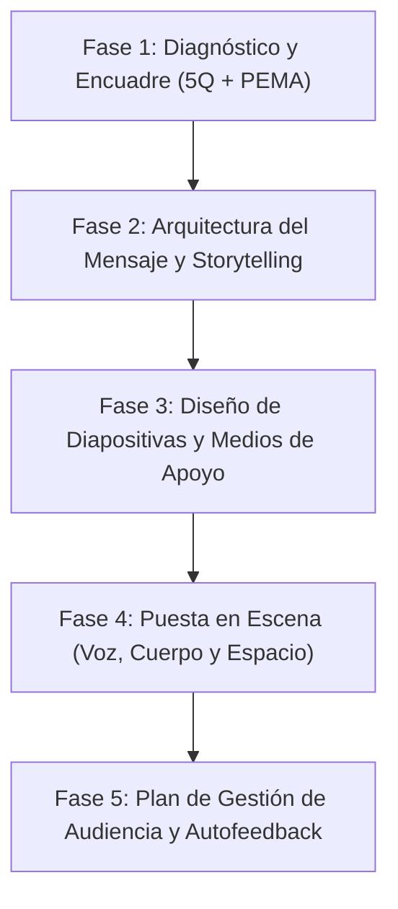

---
name: oratoriaPnl
description: >-
  Diseña, estructura, redacta guiones y prepara presentaciones orales de alto impacto
  utilizando las técnicas y principios de Programación Neurolingüística (PNL) del Manual
  de Oratoria con PNL 2025. Aplica el análisis de audiencia (5Q, VAK, metaprogramas),
  alineación de niveles lógicos, narrativa/storytelling, diseño de diapositivas y medios,
  modulación vocal, lenguaje corporal/anclaje espacial en escenario, gestión de público
  difícil y pautas de autofeedback. Usar siempre que el usuario solicite crear, mejorar,
  estructurar o ensayar una presentación, charla, pitch, capacitación o conferencia.
---

# Oratoria con PNL: Guía Operativa y Metodología de Presentación

Esta skill proporciona el marco metodológico completo, basado en la **Programación Neurolingüística (PNL)** y el *Manual Teórico Práctico de Oratoria con PNL (Lic. María Flores Arata / Accresio)*, para transformar cualquier idea en una presentación oral estructurada, persuasiva, memorable y centrada en la audiencia.

---

## Flujo de Trabajo Metodológico (5 Fases)

Cada vez que se solicite estructurar o preparar una presentación, se debe seguir este flujo riguroso:



---

### Fase 1: Diagnóstico y Encuadre (Las 5Q)

Antes de escribir una sola diapositiva o línea del guion, completar la matriz estratégica de las **5Q**:

1. **¿Quién? (Audiencia)**:
   - Identificar perfil demográfico, contexto, conocimientos previos y expectativas.
   - Completar la **Matriz Pensar-Sentir-Hacer**: ¿Qué piensan hoy? ¿Qué sienten (emociones/necesidades)? ¿Qué hacen y cómo aplicarán el contenido?
   - Mapear el canal sensorial predominante (**VAK**: Visual, Auditivo, Kinestésico) y Metaprogramas clave (*Self vs. Others*, *General vs. Específico*, *Hacia metas vs. Lejos de problemas*).
2. **¿Para qué? (Propósito y Objetivos)**:
   - **Propósito Principal**: Seleccionar uno dominante:
     * *Informar* (dimensión del *saber* / hechos y políticas).
     * *Persuadir* (dimensión del *querer* / creencias y valores).
     * *Desarrollar habilidades* (dimensión del *saber hacer* / práctica y vivencia).
     * *Entretener/Energizar* (dimensión del *ánimo* / humor y dinamismo).
   - **Objetivos PEMA**: Redactar en formato **PEMA**:
     * **P**ositivos (lo que lograrán, no lo que evitarán).
     * **E**specíficos (qué sabrán o harán con exactitud).
     * **M**esurables (comprobables en la conducta).
     * **A**breviados y **A**lcanzables (precisos y realistas en el tiempo asignado).
3. **¿Qué? (Contenido y Mensajes Clave)**:
   - Extraer máximo **3 ideas fuerza** principales.
   - Formular cada mensaje desglosado en: **Afirmación** (Hecho comprobable) $\rightarrow$ **Opinión/Juicio** (Interpretación del orador) $\rightarrow$ **Recomendación/Propuesta** (Acción a tomar).
4. **¿Dónde? (Entorno y Sala)**:
   - *Presencial*: Tipo de acomodo (Auditorio, Directorio, Mesas de trabajo, Mesa en U, Sillas en círculo/U).
   - *Virtual*: Configuración de audio, cámara frontal a la altura de los ojos, iluminación y plataforma (Zoom, Teams, Meet).
5. **¿Cómo? (Modalidad y Dinámica)**:
   - Expositiva, interactiva, conversacional, modular o bajo storytelling.

> [!TIP]
> Utiliza la [Plantilla de Diseño de Presentación](./resources/plantilla_diseno_presentacion.md) para estructurar esta fase con el usuario.

---

### Fase 2: Arquitectura del Discurso

Estructurar la presentación bajo la regla de oro de la PNL:

```text
1. INTRODUCCIÓN   --> "Diga lo que les va a decir" (Encuadre, autoridad, objetivos y gancho)
2. DESARROLLO     --> "Dígalo" (Embudo de lo general a lo particular, VAK y Storytelling)
3. CIERRE         --> "Diga lo que les dijo" (Recapitulación, conclusión, recomendación y CTA)
```

#### 1. Introducción (Impacto inicial)
- **Saludo y Bienvenida**: Calibrar con la mirada y sonrisa conectiva.
- **Quién soy (Autoridad humana)**: Quién sos, por qué estás ahí (anécdota o historia personal que genere empatía, evitando listados curriculares fríos).
- **Para qué estamos acá (Objetivos y Beneficios)**: Comunicar qué se van a llevar.
- **Qué y Cómo lo veremos (Temario y Encuadre)**: Duración, dinámicas, reglas de preguntas y recesos.
- *Regla PNL*: **Prohibido leer en la introducción**. Ensayar de memoria y con postura erguida.

#### 2. Desarrollo (Cuerpo del mensaje)
- **Estructura de Embudo**: Ir siempre de lo general a lo particular/específico.
- **Integración Multicanal VAK**: Incluir estímulos para los tres canales:
  * *Visual*: Gráficos, esquemas, metáforas visuales, apoyos claros.
  * *Auditivo*: Argumentos lógicos paso a paso, variaciones tonales, ritmo claro.
  * *Kinestésico*: Emociones, anécdotas vivenciales, participación activa, pausas activas.
- **Enriquecimiento con Predicados Sensoriales**: Utilizar palabras visuales (*ver, clarificar, foco*), auditivas (*resonar, escuchar, armonizar*) y kinestésicas (*sentir, conectar, firme, cálido*).
- **Storytelling PNL**: Estructurar anécdotas en 3 actos:
  1. *Plataforma* (Quién, Qué, Dónde - situación inicial).
  2. *Disparador / Conflicto* (Objetivo, Problema u Obstáculo a superar).
  3. *Desenlace* (Logro o aprendizaje transformador).

#### 3. Cierre (Memorabilidad e Impacto)
- **Recapitulación**: Síntesis de los hechos y conceptos clave.
- **Conclusión y Recomendación**: Juicio de valor y propuesta final del orador.
- **Espacio de Preguntas y Respuestas**: Conducido y acotado antes del remate.
- **Llamado a la Acción (CTA)**: Desafío o paso concreto que la audiencia debe dar.
- **Mensaje Final y Despedida**: Frase de alto impacto emocional; la última palabra la tiene siempre el orador.

---

### Fase 3: Diapositivas y Medios de Apoyo

Seguir las directrices de diseño visual del manual:
1. **Regla de 1 Idea por Diapositiva**: Evitar sobrecarga cognitiva.
2. **Máximo 6 Líneas de Texto**: Frases breves y orientadoras; nunca transcribir el discurso textual.
3. **Ritmo de Exposición**: Dedicar entre 3 y 5 minutos por diapositiva (no pasar diapositivas a gran velocidad sin explicarlas).
4. **Coherencia Estética**: Tipografía legible, contraste alto y recursos gráficos limpios.
5. **Uso de Pizarra / Rotafolio**: Escribir en imprenta grande, nunca dar la espalda al hablar y verbalizar lo que se escribe.

---

### Fase 4: Puesta en Escena (Voz, Cuerpo y Espacio)

#### 1. Trabajo Vocal (Los 5 Pilares)
- **Respiración**: Costodiafragmática abdominal (aire bajo).
- **Articulación y Vocalización**: Movimiento claro de la boca; realizar ejercicios de calentamiento y trabalenguas antes de hablar.
- **Prosodia Emocional**: Modular volumen (alto/medio/bajo), velocidad (lenta/media/rápida), tono (agudo/medio/grave) y pausas estratégicas (el silencio resalta la palabra clave).
- **Higiene Vocal**: Beber agua a temperatura ambiente; evitar carraspear, gritar o hablar sin aire.

#### 2. Lenguaje Corporal y Escenario
- **Postura Erguida de Poder**: Espalda recta, hombros atrás, mentón paralelo al suelo, pies firmes en el piso (anclaje físico).
- **Manos y Ademanes**: Posición de reposo en la boca del estómago / plexo; abrir las manos hacia el frente con naturalidad; evitar bolsillos o brazos cruzados.
- **Mirada y Sonrisa**: Contacto visual abarcativo para calibrar el estado de la sala; sonrisa genuina para inducir empatía y relajar el sistema nervioso.
- **Anclaje Espacial en Escenario**:
  * *Inicio y Cierre*: Ubicarse **Adelante y al Centro**.
  * *Desarrollo*: Desplazarse de forma lenta y con intención por los cuadrantes del escenario (para enfatizar puntos o cambiar de tema).

#### 3. Gestión del Miedo Escénico y Estado Interno
- **Autoanclaje de Recursos**: Activar ancla kinestésica/mental de confianza instalada previamente.
- **Fisiología y Respiración**: Respiración consciente diafragmática y risa para liberar endorfinas.
- **Visualización y Afirmación**: Proyectar mentalmente el éxito de la charla y repetir afirmaciones positivas en tiempo presente.

---

### Fase 5: Gestión de Audiencia, Contingencias y Autofeedback

#### 1. Manejo de Arquetipos de Audiencia
- **Influencer**: Reconocer su autoridad, convertirlo en aliado y marcar límites con el tiempo.
- **Entusiasta / Sabelotodo**: Agradecer su aporte, usar su conocimiento para sintetizar y cortar contacto visual sutilmente.
- **Curiosa**: Responder solo si aporta a la mayoría y hay tiempo; agrupar dudas al final de cada bloque.
- **La Contra / Opositor**: No debatir ni confrontar (*"Estamos de acuerdo en que no estamos de acuerdo"*); redirigir hacia soluciones positivas.
- **Conversadora**: Contacto visual fijo con pausa; si persiste, acercarse físicamente o consultar con amabilidad.
- **Pasiva / Desinteresada**: Mirada inclusiva sin exponerlo, preguntas con respuesta no verbal (levantar la mano).

#### 2. Plan B y Contingencias
- Llegar **1 hora antes** a la sala presencial.
- Disponer de copia de seguridad de la presentación en Pendrive, correo y nube.
- Llevar adaptadores, cables, zapatilla eléctrica, marcador propio y pasador de diapositivas.

#### 3. Autofeedback Post-Presentación (Modelo PNL)
- Completar la [Planilla de Autofeedback](./references/05_evaluacion_y_feedback.md) evaluando los 12 aspectos.
- Responder: *¿Qué hice bien? ¿Qué tendría que haber hecho mejor o distinto? ¿Cumplí el objetivo? ¿Cómo me sentí?*

---

## Módulos de Referencia Rápida

Consulta los documentos especializados en la carpeta `references/`:

| Módulo | Documento | Temas Principales |
| :--- | :--- | :--- |
| **Módulo 1** | [01_el_presentador_pnl.md](./references/01_el_presentador_pnl.md) | Niveles Lógicos de Dilts/Bateson, VAK, Predicados sensoriales, Posiciones perceptuales, Metaprogramas y Autoanclaje. |
| **Módulo 2** | [02_preparacion_y_diseno_5q.md](./references/02_preparacion_y_diseno_5q.md) | Metodología 5Q, Perfil de Audiencia, 4 Propósitos, Objetivos PEMA, Tipos de Mensajes, Storytelling, Distribución de Salas y Checklist. |
| **Módulo 3** | [03_estructura_y_gestion_audiencia.md](./references/03_estructura_y_gestion_audiencia.md) | Estructura Tripartita, Encuadre inicial, Protocolos para los 6 Arquetipos de Audiencia, Oratoria Online e Interacción Digital. |
| **Módulo 4** | [04_voz_cuerpo_y_miedo_escenico.md](./references/04_voz_cuerpo_y_miedo_escenico.md) | 5 Pilares Vocales, Prosodia, Higiene de la voz, Lenguaje Corporal, Cuadrantes de Escenario y Superación del Miedo Escénico. |
| **Módulo 5** | [05_evaluacion_y_feedback.md](./references/05_evaluacion_y_feedback.md) | Planilla de Autofeedback de 12 puntos, Modelo de Devolución Constructiva PNL y Encuestas de Satisfacción. |

---

## Plantillas y Recursos

| Recurso | Archivo | Utilidad |
| :--- | :--- | :--- |
| **Canvas de Diseño** | [plantilla_diseno_presentacion.md](./resources/plantilla_diseno_presentacion.md) | Ficha integral para diagnosticar audiencia, 5Q, VAK, propósitos y objetivos antes de armar la presentación. |
| **Guion de Oratoria** | [plantilla_guion_oratoria.md](./resources/plantilla_guion_oratoria.md) | Estructura temporal paso a paso con acotaciones visuales, vocales y corporales. |
