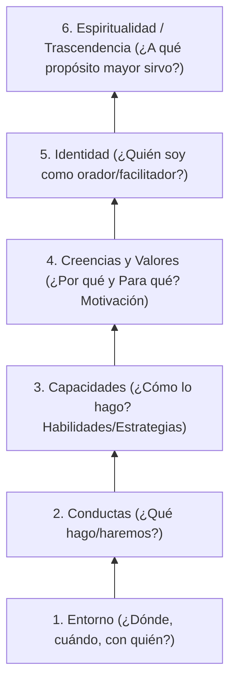

# Módulo 1: El Presentador y las Herramientas de PNL

La Programación Neurolingüística (PNL) fue desarrollada originalmente por Richard Bandler y John Grinder (década de 1970) como la *"ciencia de la excelencia"*, orientada a descubrir y modelar los patrones mentales, lingüísticos y conductuales de comunicadores extraordinarios.

---

## 1. Fundamentos: ¿Qué significa PNL en Oratoria?

- **Programación**: La manera en que organizamos nuestras ideas, recursos internos y secuencias de acción para producir resultados y comportamientos específicos.
- **Neuro**: Todo comportamiento proviene de procesos neurológicos originados en nuestros sentidos (Vista, Oído, Tacto, Olfato, Gusto). La información sensorial se procesa en el sistema nervioso dando forma a nuestros mapas mentales.
- **Lingüística**: Usamos el lenguaje verbal y no verbal para codificar, ordenar pensamientos y comunicarnos con el entorno y la audiencia.

---

## 2. Los Sistemas Representativos (VAK)

Los seres humanos filtramos, almacenamos y recuperamos la información a través de canales sensoriales preferentes. Un orador eficaz debe enriquecer su presentación para conectar simultáneamente con todos los perfiles de la audiencia:

| Sistema | Fisiología y Comportamiento | Necesidad en la Presentación | Recursos Clave a Utilizar |
| :--- | :--- | :--- | :--- |
| **Visual (V)** | Mirada hacia arriba, postura erguida, respiración alta y rápida, habla veloz. Piensan en imágenes. Se impacientan con rodeos. | Necesitan ver esquemas, rapidez conceptual, claridad y estructura visual. | Diapositivas limpias, gráficos, mapas conceptuales, videos, metáforas visuales, ademanes que dibujen formas en el aire. |
| **Auditivo (A)** | Mirada en la línea media (de lado a lado), hombros y cabeza equilibrados, respiración media, ritmo de habla pausado y armónico. Pensamiento secuencial y lógico. | Necesitan orden lógico, explicaciones paso a paso, debates y fundamentación sólida. | Claridad expositiva, modulación y variaciones de voz, música de fondo (para crear clima), silogismos, preguntas reflexivas. |
| **Kinestésico (K)** | Mirada hacia abajo a la derecha, hombros relajados, respiración baja/abdominal, voz más profunda y pausada. Conectados con emociones y sensaciones físicas. | Necesitan conectar emocionalmente, sentir cercanía, vivenciar la experiencia y moverse. | Anécdotas humanas, vulnerabilidad, dinámicas participativas, pausas activas, interacción física, objetos tangibles. |
| **Auditivo Digital (Ad)** | Diálogo interno constante, postura reflexiva, búsqueda de datos objetivos, procedimientos y métricas precisas. | Necesitan justificaciones racionales, fuentes oficiales y rigor metodológico. | Estadísticas verificables, citas de autores o estudios, diagramas de flujo y matrices de decisión. |

---

## 3. Predicados Sensoriales: El Vocabulario por Canal

Para asegurar que todo el auditorio procese la información en su canal preferente, el orador debe intercalar vocabulario con base sensorial:

| Canal | Verbos y Sustantivos | Frases y Expresiones Tipo |
| :--- | :--- | :--- |
| **Visual** | *Ver, mirar, enfocar, clarificar, ilustrar, perspectiva, imagen, brillo, panorama, horizonte, visualizar, oscuridad, reflejar.* | *"Como pueden ver con claridad..."*, *"Tengamos una visión panorámica..."*, *"Enfoquemos la atención en este punto..."* |
| **Auditivo** | *Escuchar, decir, resonar, ritmo, tono, armonía, sonar, discutir, acento, timbre, sordo, consonancia, declarar, vocalizar.* | *"Esto me suena muy coherente..."*, *"Hagamos una pausa para escuchar..."*, *"Este concepto resuena con fuerza..."* |
| **Kinestésico** | *Sentir, tocar, contacto, cálido, áspero, firme, pesado, presionar, captar, fluir, saborear, digerir, vibrar, apasionante.* | *"Sintamos el impacto de esta decisión..."*, *"Tomemos contacto directo con la realidad..."*, *"Es una base sólida y firme..."* |

---

## 4. Niveles Lógicos de la Mente (Bateson / Dilts)

Gregory Bateson y Robert Dilts determinaron que el aprendizaje, la comunicación y el cambio operan en jerarquías neurológicas naturales. Cada nivel superior organiza e influye en los niveles inferiores:

### Preguntas de Alineación para el Presentador:
1. **Entorno**: ¿Dónde, cuándo y con quién ejecuto mi rol de presentador?
2. **Conductas**: ¿Qué actividades, movimientos y discursos específicos realizo?
3. **Capacidades**: ¿Qué habilidades poseo y cuáles necesito desarrollar para sobresalir?
4. **Valores**: ¿Para qué quiero dar esta presentación? ¿Qué valor aporta a mi vida y a la de otros?
5. **Creencias**: ¿Por qué es fundamental compartir este mensaje? ¿Qué convicciones sostienen mi autoridad moral?
6. **Identidad**: ¿Quién soy en el escenario? (Un mentor, un facilitador, un líder de cambio).
7. **Espiritualidad / Propósito**: ¿Cómo impacta positivamente esta presentación en el mundo y en la comunidad?

---

## 5. Posiciones Perceptuales en la Comunicación

Para diseñar y exponer con empatía y congruencia, el orador debe rotar mentalmente entre las tres posiciones perceptuales:

1. **Primera Posición (1ª - Yo / Presentador)**:
   - Conectado con la propia experiencia, intenciones, emociones, congruencia corporal y convicción interna.
2. **Segunda Posición (2ª - La Audiencia / Tú)**:
   - Ponerse en los zapatos del público. ¿Qué están pensando? ¿Qué dudas o miedos tienen? ¿Cómo perciben mi ritmo y vocabulario?
3. **Tercera Posición (3ª - El Observador / Tercero Objetivo)**:
   - Mirar la escena desde afuera, como una cámara de cine desapegada emocionalmente. Permite calibrar la dinámica grupal, el manejo del tiempo, la iluminación, el uso del espacio y la interacción global.

---

## 6. Metaprogramas en la Audiencia

Los metaprogramas son filtros inconscientes que determinan a qué presta atención una persona y cómo toma decisiones:

- **Self (Uno mismo) vs. Others (Los demás)**:
  * *Self*: Se motivan por el beneficio personal directo (*"¿Cómo me beneficia a mí?"*).
  * *Others*: Se motivan por el impacto en su equipo, familia o sociedad (*"¿Cómo ayuda esto al grupo?"*).
- **General (Global) vs. Específico (Detalle)**:
  * En una presentación, **siempre iniciar por la visión general/estratégica** y descender progresivamente a los datos y detalles específicos.
- **Hacia (Acercarse a la meta) vs. Lejos de (Huir del dolor/problema)**:
  * Si la audiencia busca logros y crecimiento $\rightarrow$ enfatizar ganancias, oportunidades y visión positiva.
  * Si la audiencia busca seguridad y prevención $\rightarrow$ resaltar la reducción de riesgos, costos evitados y protección.

---

## 7. Técnica de Autoanclaje de Recursos para el Orador

El anclaje permite asociar un estímulo sensorial específico (un toque sutil, un gesto o una palabra) con un estado emocional de plenitud de recursos (confianza, serenidad, poder, concentración).

### Protocolo de Instalación:
1. **Identificar el recurso deseado**: (Ejemplo: *Seguridad y templanza*).
2. **Revivir la experiencia**: Recordar un momento del pasado donde se haya experimentado ese recurso con máxima intensidad.
3. **Asociación sensorial**: Cerrar los ojos y revivir qué se veía, qué se escuchaba y qué se sentía corporalmente.
4. **Disparo del ancla**: En el pico máximo de intensidad emocional, presionar firmemente la unión entre los dedos índice y pulgar (o un nudillo específico) durante 5 a 10 segundos.
5. **Estado interruptor (Break State)**: Abrir los ojos, moverse de lugar, sacudir el cuerpo o pensar en algo neutro (ej. número de teléfono).
6. **Prueba y Calibración**: Repetir el gesto físico y verificar si el estado de seguridad y confianza emerge espontáneamente.
7. **Apilamiento de anclas**: Repetir el proceso con otras memorias de triunfo o calma sobre el mismo punto físico para potenciar el ancla.
