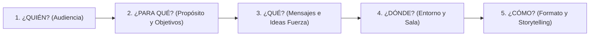

# Módulo 2: La Preparación y las 5Q del Diseño

Una presentación exitosa se define antes de subir al escenario. El proceso de preparación invisible es el que garantiza la solvencia, el manejo del tiempo y la conexión emocional con la audiencia.

---

## 1. La Metodología de las 5Q

Toda preparación estratégica responde a 5 preguntas esenciales:



---

## 2. Diagnóstico de la Audiencia: Matriz Pensar-Sentir-Hacer

Para diseñar a medida, colocarse en **segunda posición** (la perspectiva del participante) y responder:

| Dimensión | Preguntas de Diagnóstico | Aplicación en el Diseño |
| :--- | :--- | :--- |
| **PENSAR** | ¿Qué conocimientos previos tienen? ¿Qué prejuicios o expectativas traen? ¿Qué nivel técnico manejan? | Calibra la complejidad del vocabulario y evita asumir conceptos o subestimar su formación. |
| **SENTIR** | ¿Con qué estado de ánimo llegan (curiosidad, desconfianza, cansancio, estrés)? ¿Qué necesidades y dolores experimentan? | Define el tono inicial (empático, inspirador, enérgico) y el tipo de anécdotas para romper el hielo. |
| **HACER** | ¿A qué se dedican? ¿En qué momento y de qué manera aplicarán lo aprendido? | Asegura ejemplos prácticos y transferibilidad directa a su labor cotidiana. |
| **VAK & MP** | ¿Predomina el canal Visual, Auditivo o Kinestésico? ¿Se orientan a metas (Hacia) o a mitigar riesgos (Lejos de)? | Permite balancear diapositivas, argumentos lógicos y actividades vivenciales. |

---

## 3. El Para Qué: Propósitos y Objetivos PEMA

### 3.1. Los 4 Propósitos Cardinales
Aunque una presentación puede incluir momentos variados, **solo debe existir un propósito principal dominante**:

1. **Informar (Dimensión del *Saber*)**:
   - Transmitir hechos, datos no discutibles, reportes de gestión o políticas de la organización.
   - *Recursos clave*: Diapositivas claras, gráficos estadísticos, síntesis conceptual.
2. **Persuadir (Dimensión del *Querer*)**:
   - Convencer, vender una propuesta, predisponer al cambio cultural o modificar creencias y actitudes.
   - *Recursos clave*: Storytelling, casos de éxito, estructura Hecho-Opinión-Recomendación, metaprograma Hacia/Lejos de.
3. **Desarrollar Habilidades (Dimensión del *Saber Hacer*)**:
   - Capacitación y entrenamiento práctico donde los participantes deben ejercitar y ser evaluados.
   - *Recursos clave*: Dinámicas, role-playing, hojas de trabajo, feedback en vivo.
4. **Entretener / Energizar (Dimensión del *Ánimo*)**:
   - Recrear, elevar la energía de un grupo fatigado o dinamizar eventos (ej. *matasiestas*, dinámicas lúdicas).
   - *Recursos clave*: Humor, juegos, historias entretenidas, interacción corporal.

---

### 3.2. Redacción de Objetivos: La Fórmula PEMA

Los objetivos se redactan siempre desde la perspectiva del participante (*"Al finalizar, los participantes lograrán..."*) y deben cumplir con el criterio **PEMA**:

- **P - Positivos**: Formulados en positivo (lo que harán/lograrán en lugar de lo que evitarán).
- **E - Específicos**: Detallan exactamente qué sabrán, sentirán o aplicarán.
- **M - Mesurables**: Evaluables en el comportamiento o mediante una evidencia observable.
- **A - Abreviados y Alcanzables**: Redactados con pocas palabras directas y viables en el tiempo disponible.

---

## 4. El Qué: Tipos de Mensajes e Ideas Clave

Organizar el contenido seleccionando un **máximo de 3 ideas fuerza**. Cada idea debe articularse combinando tres tipos de mensajes:

```text
1. AFIRMACIÓN       --> Hecho objetivo comprobable ("En el último trimestre las ventas cayeron un 15%").
2. OPINIÓN / JUICIO --> Interpretación del orador ("Esto indica que nuestro canal tradicional está agotado").
3. RECOMENDACIÓN    --> Propuesta de acción concreta ("Debemos migrar el 40% del presupuesto al canal digital").
```

---

## 5. Storytelling con PNL: La Estructura Narrativa

Las historias y metáforas conectan con el hemisferio derecho y el sistema límbico, generando empatía y recuerdo a largo plazo.

### Estructura en 3 Actos:
1. **Introducción (La Plataforma / Situación Inicial)**:
   - *Quién*: Descripción del protagonista (recursos, personalidad, deseos).
   - *Qué*: Su comportamiento o rutina actual.
   - *Dónde*: El entorno y su contexto.
2. **Desarrollo (El Disparador y Conflicto)**:
   - Aparición de un **Objetivo ambicioso**, un **Problema inesperado** o un **Obstáculo crítico**.
   - Los intentos, desafíos y aprendizajes durante el proceso de superación.
3. **Desenlace (Resolución y Aprendizaje)**:
   - Cómo logra el objetivo o supera la dificultad.
   - Moraleja o anclaje conceptual transferible a la audiencia.

---

## 6. Medios de Apoyo y Diseño Visual

### 6.1. Reglas de Oro para Diapositivas (PowerPoint / Canva / Keynote)
- **1 sola idea por diapositiva**: Evitar saturación.
- **Máximo 6 líneas de texto**: Frases cortas y orientadoras, jamás párrafos completos para leer.
- **Tiempo de permanencia**: Dedicar entre 3 y 5 minutos por diapositiva (no pasar diapositivas vertiginosamente).
- **Consistencia estética**: Misma paleta de colores, tipografías legibles y fotos de alta resolución.
- **Uso de atajos del proyector**: Tecla `B` / `Blank` para oscurecer la pantalla cuando el foco deba volver al orador.

### 6.2. Pizarra y Rotafolio
- Escribir siempre en **letra de imprenta grande y legible** desde la última fila.
- Usar marcadores al agua para papel y específicos de borrado en seco para pizarra blanca.
- **No hablar de espaldas**: Escribir una frase corta de costado, girarse y explicar de frente mirando a la sala.
- Verbalizar en voz alta lo que se escribe para mantener el canal auditivo activo.

---

## 7. La Sala: Tipos de Distribución y Dinámica

| Tipo de Distribución | Características y Ventajas | Desventajas / Riesgos | Uso Recomendado |
| :--- | :--- | :--- | :--- |
| **Auditorio (Filas)** | Máxima capacidad en poco espacio; foco 100% en el orador. | Inhibe la interacción entre participantes y dinámicas de grupo. | Charlas magistrales, conferencias y presentaciones informativas. |
| **Sala Directorio (Mesa Ovalada)** | Fomenta el debate igualitario y el apoyo de documentos. | El orador no puede desplazarse; dificulta el contacto visual con las cabeceras. | Reuniones de directorio, comités ejecutivos y desayunos de trabajo. |
| **Mesas de Trabajo (Islas de 4 a 6)** | Ideal para combinar exposición con ejercicios en subgrupos; permite al orador circular. | Mayor probabilidad de distracciones y murmullos entre mesas. | Talleres formativos, workshops y capacitaciones extensas. |
| **Mesa en U** | Contacto visual pleno y apoyo de materiales; el orador camina dentro de la U. | Dificulta dinámicas corporales de pie si el espacio interior es reducido. | Cursos técnicos o comités con alta necesidad de tomar notas. |
| **Sillas en Círculo o en U (Sin mesas)** | Elimina barreras físicas; genera intimidad, cercanía y movilidad rápida. | Puede generar resistencia inicial en grupos tímidos; no apto para tomar apuntes. | Cursos de desarrollo personal, dinámicas vivenciales y role-playing. |

---

## 8. Checklists de Preparación y Plan B

### 8.1. Checklist Presencial (Llegada 1 hora antes)
- [ ] Computadora y cargador de corriente.
- [ ] Presentación guardada en 3 lugares: disco local, pendrive USB y nube.
- [ ] Pasador inalámbrico de diapositivas (con pilas de repuesto).
- [ ] Conectores y adaptadores de video (HDMI, VGA, USB-C).
- [ ] Zapatilla eléctrica y cables alargadores.
- [ ] Marcadores propios (pizarra blanca y rotafolio) + cinta de papel.
- [ ] Botella de agua a temperatura ambiente.
- [ ] Reloj visible para el orador (de muñeca o de mesa, evitando mirar el móvil).
- [ ] Materiales impresos (Handouts) organizados para repartir en su momento exacto.

### 8.2. Checklist Virtual (Presentaciones Online)
- [ ] **Audio**: Micrófono dedicado o auriculares; prueba previa de volumen y opción "compartir audio del sistema".
- [ ] **Cámara**: Elevada a la altura de los ojos; encuadre que muestre hombros y manos; luz frontal sin sombras ni contraluz.
- [ ] **Herramientas interactivas**: Enlaces listos de Mentimeter, Padlet, Kahoot, Canva o Miro.
- [ ] **Plan B**: Dispositivo secundario (móvil/tablet) listo con datos móviles por si falla el internet principal o la energía eléctrica.
