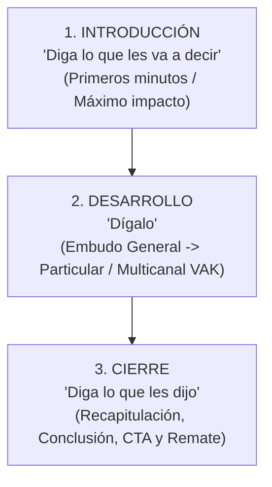
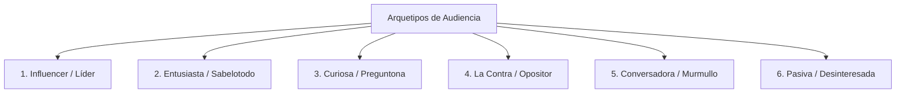

# Módulo 3: Estructura del Discurso y Gestión de Audiencia

Una presentación cautivante combina una arquitectura discursiva clara con la capacidad de calibrar y liderar el estado emocional y la dinámica grupal de la audiencia.

---

## 1. La Arquitectura Tripartita del Discurso

---

## 2. La Introducción: Primeros Minutos de Conexión

La introducción es la única oportunidad de causar una primera impresión imborrable, generar simpatía, validar la autoridad del orador y establecer el contrato implícito de trabajo con la audiencia.

### Estructura Paso a Paso:
1. **Saludo y Bienvenida**: Calibrar con la mirada a todo el salón y sonreír genuinamente.
2. **Quién soy (Autoridad Humana)**:
   - Presentarse desde la cercanía y la experiencia vivida, no desde un listado frío de títulos académicos.
   - Compartir qué te motivó a estar allí y qué experiencia personal respalda tu mensaje.
3. **Para qué estamos acá (Objetivos y Beneficios)**:
   - Declarar con claridad qué se llevarán los participantes y qué problema resolverán.
4. **Qué veremos (Temario y Hitos)**:
   - Panorama global (los 3 o 4 bloques principales del recorrido).
5. **El Encuadre (Reglas de Juego y Metodología)**:
   - Aclarar la dinámica de trabajo: cuándo habrá momentos de preguntas, duración estimada, uso de teléfonos y recesos.

> [!IMPORTANT]
> **Regla de oro PNL para la Introducción**: **Prohibido leer**. La introducción debe conocerse y ensayarse con total soltura para transmitir seguridad, mirar a los ojos a la sala e instalar un estado de recursos desde el segundo cero.

---

## 3. El Desarrollo: Conducción y Embudo Temático

El cuerpo de la presentación debe mantener viva la curva de atención mediante estímulos sensoriales continuos:

- **Estructura en Embudo**: Presentar primero el marco conceptual general y luego profundizar en los casos y datos específicos.
- **Transiciones Conscientes**: Enlazar cada bloque con preguntas puente o recapitulación breve antes de abrir el siguiente tema.
- **Variación de Estímulos (VAK)**:
  * Alternar momentos de escucha activa con apoyos visuales y actividades o reflexiones individuales/grupales.
  * Realizar pausas activas o cambios de postura si la sesión supera los 45 minutos.

---

## 4. El Cierre: Fijación y Llamado a la Acción

El cierre determina la huella emocional y el recuerdo a largo plazo con el que los participantes abandonarán la sala.

### Elementos del Cierre Estratégico:
1. **Recapitulación (Dominio Racional / Hechos)**:
   - Síntesis concisa de las afirmaciones clave expuestas a lo largo del desarrollo.
2. **Conclusión y Recomendación (Juicio del Orador)**:
   - La postura final y la propuesta transformadora sugerida.
3. **Espacio de Preguntas y Respuestas (Q&A)**:
   - Conducido de forma ágil y ordenada.
   - *Técnica clave*: **El Q&A nunca debe ser el cierre definitivo**. Tras la última pregunta, el orador retoma el control del escenario para emitir el mensaje final.
4. **Llamado a la Acción (CTA - Call to Action)**:
   - Una incitación clara a la acción, cambio de hábito, toma de decisión o implementación.
5. **Mensaje Final Inspirador y Despedida**:
   - Frase, metáfora o anécdota de alto impacto; agradecimiento formal y cierre contundente.

---

## 5. Gestión Táctica de Arquetipos de Audiencia

En toda audiencia pueden surgir comportamientos que amenacen el flujo, el tiempo o el clima de la actividad. La PNL propone gestionarlos con elegancia sin entrar en confrontación directa:

| Arquetipo | Comportamiento Típico | Estrategia de Gestión PNL |
| :--- | :--- | :--- |
| **1. El Influencer** | Líder natural u opinión de peso en el grupo; puede monopolizar o condicionar al resto. | Reconocer y respetar sus aportes desde el inicio. Convertirlo en aliado pidiéndole ejemplos puntuales, pero manteniendo firmemente el liderazgo y los límites de tiempo. |
| **2. El Entusiasta (Sabelotodo)** | Desea demostrar su conocimiento en cada punto; intervenciones largas que distraen. | Agradecer y validar su saber (*"Excelente aporte"*). Utilizar su capacidad para resumir conceptos difíciles para el resto, pero cortar el contacto visual sutilmente para dar la palabra a otros. |
| **3. La Curiosa** | Hace múltiples preguntas que insumen demasiado tiempo o desvían el foco central. | Agradecer la curiosidad. Responder únicamente si aporta al objetivo general y hay tiempo disponible. Si monopoliza: *"Aparte de Juan, ¿alguien más tiene preguntas?"* o postergar al final del bloque. |
| **4. La Contra (Opositor)** | Postura sistemática de queja, debate o preguntas capciosas para desestabilizar. | No caer en provocaciones ni debatir. Validar la discrepancia con elegancia: *"Estamos de acuerdo en que no estamos de acuerdo"* o *"Las opiniones son diversas y respetables"*. Reorientar hacia aspectos constructivos y ofrecer charlar en privado en el receso. |
| **5. La Conversadora** | Murmura o charla constantemente con la persona de al lado interrumpiendo el clima. | 1º Mirarla fijamente mientras se hace una pausa enfática. 2º Acercarse físicamente a su mesa/silla sin dejar de exponer. 3º Tocar sutilmente el hombro o preguntar respetuosamente si tiene una duda para compartir con todos. |
| **6. La Pasiva** | Aparente indiferencia, mirada perdida, uso del móvil o timidez extrema. | Mirada inclusiva y cálida sin exponerla públicamente. Hacer preguntas cerradas que requieran respuesta no verbal (asentir o levantar la mano). Proponer ejercicios en parejas o grupos reducidos para darle confort. |

---

## 6. Dinámica y Atención en Presentaciones Online

En entornos virtuales (Zoom, Teams, Meet), los participantes están rodeados de distractores digitales.

### Buenas Prácticas Online:
- **Duración Máxima**: Recomendable no exceder **2 horas continuas** de sesión.
- **Regla de los 5 a 10 Minutos**: Cambiar el foco de atención o la modalidad cada 5 a 10 minutos (alternar entre compartir pantalla, vista de galería, encuestas y chat).
- **Herramientas de Participación Activa**:
  * *Mentimeter / Kahoot*: Sondeos en tiempo real y nubes de palabras.
  * *Padlet / Miro / Mural*: Pizarras colaborativas para aportes grupales.
  * *Breakout Rooms*: Trabajo en grupos pequeños de 3 a 4 personas para asegurar interacción kinestésica y verbal.
- **Presencia Corporal en Cámara**: Mantener la cámara encendida con encuadre que permita ver los ademanes de las manos para comunicar dinamismo y cercanía.
