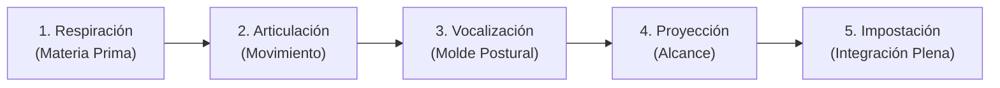
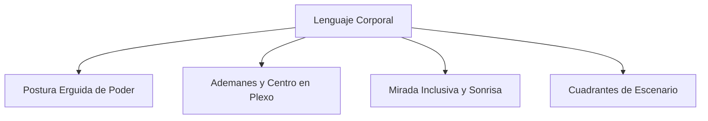

# Módulo 4: La Voz, el Cuerpo y la Gestión del Miedo Escénico

La congruencia entre lo que se dice (lenguaje verbal), cómo suena (prosodia vocal) y cómo se proyecta físicamente (lenguaje corporal) es lo que genera credibilidad y poder de persuasión en PNL.

---

## 1. El Manejo de la Voz: Los 5 Pilares Esenciales



1. **Respiración (Materia Prima)**: Respiración costodiafragmática abdominal (baja). Permite disponer de un flujo constante de aire sin sobrecargar las cuerdas vocales ni elevar los hombros.
2. **Articulación (El Movimiento)**: La movilidad y agilidad de labios, lengua y mandíbula para lograr una dicción fluida y nítida.
3. **Vocalización (La Postura Bucal)**: La apertura correcta de la cavidad bucal para moldear las vocales con claridad cristalina.
4. **Proyección (La Distancia)**: La colocación del sonido en los resonadores óseos faciales (máscara facial) para llenar el auditorio sin necesidad de gritar.
5. **Impostación (La Integración)**: El uso armónico y descansado del aparato fonador en su tono natural óptimo.

---

## 2. Prosodia y Color Emocional de la Voz

La prosodia es la música del discurso. Modificando estas cinco variables se transforma el significado y la emoción transmitida:

| Variable | Opciones | Efecto Comunicativo |
| :--- | :--- | :--- |
| **Volumen** | Alto / Medio / Bajo | El volumen bajo genera intimidad y suspenso; el volumen alto energiza y marca convicción. |
| **Velocidad / Ritmo** | Lenta / Media / Rápida | El ritmo rápido transmite dinamismo y entusiasmo; el ritmo lento asienta conceptos profundos y solemnidad. |
| **Tono** | Agudo / Medio / Grave | Los tonos graves transmiten autoridad, serenidad y seguridad; los agudos transmiten euforia o urgencia. |
| **Énfasis** | Palabra Clave | Seleccionar deliberadamente qué término resaltar en cada frase para dirigir el foco de atención. |
| **Pausas y Silencios** | Breve / Marcada / Dramática | El silencio antes de una idea genera expectativa; el silencio posterior permite la asimilación del concepto. |

---

## 3. Higiene y Cuidado de las Cuerdas Vocales

| ❌ Hábitos que Dañan la Voz | ✔️ Hábitos que Cuidan la Voz |
| :--- | :--- |
| Gritar o hablar forzando cuando se acaba el aire. | Beber abundante agua a temperatura ambiente. |
| Toser y carraspear repetidamente. | Respiración baja diafragmática. |
| Susurrar (genera alta fricción en cuerdas vocales). | Mantener postura corporal erguida y relajada. |
| Bebidas excesivamente frías o hirviendo. | Realizar ejercicios de estiramiento y calentamiento vocal. |
| Exceso de café, alcohol, tabaco o comidas muy picantes/grasas. | Guardar reposo vocal relativo antes de un evento extenso. |

---

## 4. Lenguaje Corporal y Fisiología

El cuerpo no miente: la postura influye directamente en el estado emocional interno (feedback biomecánico hacia el cerebro).



### 4.1. Postura de Poder y Anclaje Físico
- **Columna erguida**: Sensación de un hilo invisible tirando de la coronilla hacia arriba.
- **Hombros relajados hacia atrás** y mentón paralelo al suelo.
- **Pies firmemente apoyados** con la apertura del ancho de caderas (evitar cruzar piernas o balancearse).

### 4.2. Manos y Ademanes
- **Posición de Reposo**: Las manos descansan juntas a la altura de la boca del estómago / plexo solar. Desde ese centro parten los ademanes y regresan a él.
- **Manos Abiertas**: Palmas visibles hacia el frente transmiten honestidad y apertura; evitar bolsillos, brazos cruzados o esconder manos tras la espalda.

### 4.3. Rostro, Mirada y Sonrisa
- **Mirada Panorámica**: Recorrer en abanico a toda la sala haciendo contacto visual de 2 a 3 segundos con diferentes personas para incluirlas y calibrar su atención.
- **Sonrisa Genuina**: Relaja la musculatura facial, oxigena y estimula la liberación de endorfinas en el orador y en la audiencia.

---

## 5. Anclaje Espacial en el Escenario (Los Cuadrantes)

El escenario es un lienzo espacial que el orador utiliza para reforzar su discurso:

```text
               [ FONDO / PANTALLA ]
  -----------------------------------------------
  Atrás-Izquierda |  Atrás-Centro  | Atrás-Derecha
  -----------------------------------------------
  Adelante-Izq.   | Adelante-Centro| Adelante-Der.
  -----------------------------------------------
                  [ AUDIENCIA ]
```

- **Inicio (Introducción) y Remate (Cierre)**: Ubicarse siempre **Adelante y al Centro**, en máxima cercanía e impacto.
- **Desarrollo**: Desplazarse de forma lenta, deliberada y suave por los cuadrantes:
  * Desplazarse a un lateral para plantear un dilema o caso histórico.
  * Desplazarse al otro lateral para presentar la solución o visión de futuro.
  * Evitar el *"baile del péndulo"* (caminar de lado a lado sin sentido por ansiedad).

---

## 6. Manejo Integral del Miedo Escénico

El miedo escénico es una respuesta fisiológica natural ante situaciones fuera de la zona de confort. En PNL se reencuadra: **el miedo es señal de respeto al público y aporta energía y agilidad mental**.

### Protocolo Antes de la Presentación:
1. **Dominio del Tema**: Conocer a fondo la materia y preparar respuestas a posibles objeciones.
2. **Familiarización con la Sala**: Llegar 1 hora antes, caminar por el escenario y comprobar los apoyos técnicos.
3. **Recepción Empática**: Saludar a los asistentes conforme van llegando para romper la barrera de lo desconocido.
4. **Respiración Consciente**: Inhalar en 4 tiempos hacia el abdomen, retener 4 y exhalar suavemente en 4.
5. **Risa Diafragmática**: Reír o esbozar sonrisas amplias para desactivar el cortisol.
6. **Disparo de Autoanclaje**: Activar el ancla de recursos (confianza/calma) instalada previamente.
7. **Afirmación Positiva en Presente**: Repetir mentalmente la afirmación redactada (ej. *"Estoy sereno, disfruto compartir este conocimiento y conecto con mi público"*).
8. **Visualización Asociada**: Visualizar mentalmente el desarrollo fluido de la charla y el aplauso final.

### Durante la Presentación:
- Mantener postura erguida de poder y beber pequeños sorbos de agua templada.
- Mirar a personas que muestren rostros amables y receptivos para retroalimentar la confianza.
