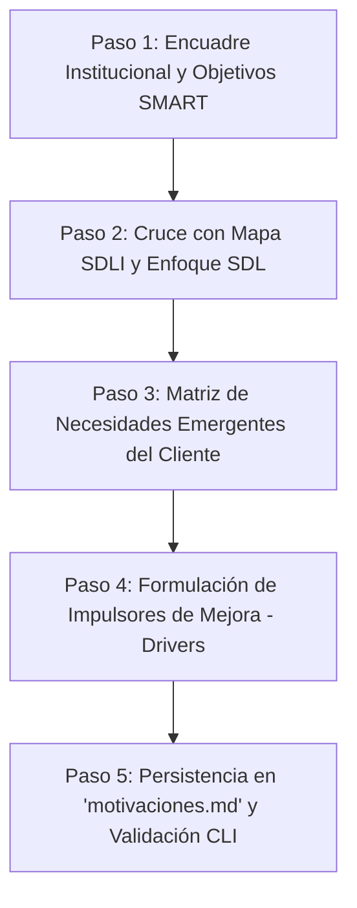

# organizationalMotivations

Habilidad atómica de agente para la construcción, auditoría y validación de la **Matriz de Motivaciones de la Organización e Impulsores de Mejora**, correspondiente a la **Etapa 1 (Situación Actual)** de la metodología de **Gestión y Mejora de Procesos (GMP)**, basada rigurosamente en la `PlanillaMATRICES-TPI 2026` (Matriz 3) y el **Mapa de Tendencias SDLI** (Sociedad de la Innovación).

---

## 1. Contrato Operativo Determinista

- **Entregable Canónico Obligatorio:** Toda invocación de esta skill debe generar y persistir el informe final en un archivo Markdown denominado exclusivamente:
  ```text
  motivaciones.md
  ```
- **Sin Dependencia de Hojas de Cálculo:** La skill produce tablas Markdown legibles y estructuradas con trazabilidad causal completa hacia la selección del proceso crítico y la matriz FODA.
- **Validación Automática:** Toda salida generada debe someterse a verificación mediante el script determinista:
  ```bash
  python "skills/organizationalMotivations/scripts/validate_motivations.py" motivaciones.md
  ```

---

## 2. Desencadenantes de Activación (Triggers)

Esta skill debe activarse cuando el usuario o el agente orquestador solicite:
- Construir o relevar la Matriz de Motivaciones de la Organización.
- Analizar el Mapa de Tendencias SDLI (Sociedad de la Innovación) aplicado a una empresa o sector.
- Evaluar el impacto de macrotendencias globales, de industria y de mercado bajo Lógica Dominante del Servicio (SDL).
- Identificar necesidades emergentes, hábitos cambiantes o puntos de fricción del cliente.
- Formular los impulsores y demandas de mejora (drivers) que justifican el rediseño de los procesos de negocio.
- Completar la Matriz 3 de la Etapa 1 del Trabajo Práctico Integrador (TPI).

---

## 3. Fundamentos Metodológicos y Taxonomía de Cátedra

### 3.1 Las 3 Dimensiones Analíticas Transversales
Toda tendencia debe situarse en una o más de las siguientes dimensiones:
1. **Sociedad - Cultura:** Transformación en valores éticos, comportamientos, demografía, expectativas comunitarias y hábitos cotidianos.
2. **Tecnología - Ciencia:** Automatización, inteligencia artificial, conectividad ubicua, plataformas abiertas y ciencia de datos.
3. **Economía - Mercado:** Nuevos modelos de negocio, dinámicas competitivas, regulaciones y Lógica Dominante del Servicio (SDL).

### 3.2 Los 10 Macro-Sectores del Mapa de Tendencias SDLI
1. **Conciencia Medio Ambiental:** Eco presión, empresas limpias, cadenas de valor sostenibles, movilidad consciente.
2. **Post Capitalismo:** Desposesión (acceso sobre propiedad), nuevos modelos socioeconómicos (circular, triple impacto), redes del futuro.
3. **Digitalización:** Transformación digital, nuevas profesiones digitales, soluciones abiertas/APIs, automatización y RPA.
4. **Vida Datificada:** Todo predictivo (machine learning), trazabilidad de datos/IoT, transhumanismo/wearables, bajo control (ciberseguridad, privacidad).
5. **Cultura de la Inmediatez:** Comercio ininterrumpido (24/7), vida retransmitida (tracking en vivo), última milla ágil.
6. **Nuevas Narrativas Digitales:** Realidades mezcladas (AR/VR/Digital Twins), relaciones virtuales, sociedad de la desconfianza (validación/autenticidad), experiencia de usuario (UX).
7. **DIY (Do It Yourself):** Autoliderazgo/autogestión, hiperpersonalización de la oferta, trabajo flexible y modular.
8. **Bienestar Integral:** Comunidad emocional, seguridad sanitaria/bioseguridad, valores KM0 (proximidad local), equilibrio personal-laboral.
9. **Inclusión:** Edad relativa (silver economy), represéntame (diversidad), identidades líquidas, democratización del acceso.
10. **Slow Life:** Desconexión digital consciente, menos es más (minimalismo operativo, desburocratización), intimidad renovada.

### 3.3 Lógica Dominante del Servicio (SDL - Vargo & Lusch)
- **El servicio es la base del intercambio:** Los bienes físicos son vehículos o artefactos para la prestación del servicio.
- **Co-creación de valor:** El valor no se "produce" de forma aislada en la fábrica para luego ser entregado; se co-crea activamente en el uso (*Value-in-Use*) entre la organización y el cliente.
- **Procesos como plataformas de servicio:** Los procesos deben diseñarse para maximizar la integración colaborativa de recursos del cliente.

---

## 4. Flujo de Ejecución Paso a Paso



### Paso 1: Encuadre Institucional y Estratégico
Relevar y formalizar:
- Nombre de la organización y sector.
- **Misión:** Foco en lo que la entidad hace **HOY**, concisa y con foco operativo interno.
- **Visión:** Proyección estratégica a mediano/largo plazo (dónde quiere estar).
- **Objetivos Estratégicos SMART:** Metas cuantificables con plazos concretos.
- Perfil del cliente primario y propuesta de valor actual.

### Paso 2: Cruce con Mapa de Tendencias SDLI y Lógica Dominante del Servicio (SDL)
- Seleccionar de 4 a 6 macro-sectores pertinentes al negocio de la organización.
- Asignar a cada tendencia un identificador secuencial `TND-01`, `TND-02`, etc.
- Especificar la sub-tendencia concreta y clasificarla en su dimensión (Sociedad-Cultura, Tecnología-Ciencia, Economía-Mercado).
- Detallar la manifestación empírica en el sector y explicar explícitamente cómo opera la **co-creación de valor** o servitización bajo SDL.
- Evaluar el nivel de impacto en la organización (Alto / Medio / Bajo).

### Paso 3: Matriz de Tendencias o Necesidades Emergentes del Cliente
- Identificar al menos 3 expectativas o nuevos hábitos de consumo del cliente (`CLI-01`, `CLI-02`, etc.).
- Contrastar la expectativa con la fricción o brecha actual del modelo operativo AS-IS (colas, demoras, soporte analógico, inflexibilidad).
- Definir la oportunidad concreta de co-creación de valor.

### Paso 4: Formulación de Impulsores y Demandas de Mejora (Drivers de Rediseño)
- Estructurar los impulsores causales (`DRV-01`, `DRV-02`, etc.) que fundamentan por qué la organización **debe rediseñar sus procesos**.
- Describir la justificación estratégica (riesgo de obsolescencia, pérdida de cuota de mercado, sobrecostos operativos).
- Mapear los procesos organizacionales que resultan directamente afectados.
- **Trazabilidad directa:** Establecer el vínculo que alimentará el **Factor 2 ("Tendencias del Entorno y Mercado / SDL")** en la Matriz de Selección Crítica (`seleccion_proceso.md`) y las **Oportunidades** en la Matriz FODA (`foda.md`).

### Paso 5: Persistencia en `motivaciones.md` y Validación Automática
- Escribir el entregable completo en el archivo `motivaciones.md` respetando la plantilla oficial (`templates/motivations_template.md`).
- Ejecutar el script validador:
  ```bash
  python "skills/organizationalMotivations/scripts/validate_motivations.py" motivaciones.md
  ```
- Corregir cualquier omisión de secciones, tablas o perspectiva SDL reportada por el script.

---

## 5. Estructura Canónica del Archivo `motivaciones.md`

El archivo generado debe respetar fielmente las siguientes 5 secciones:
1. `# Matriz de Motivaciones de la Organización e Impulsores de Mejora (GMP Etapa 1)`
2. `## 1. Identificación Institucional y Encuadre Estratégico` (Tabla resumen institucional).
3. `## 2. Matriz de Tendencias del Entorno (Mapa SDLI y Lógica Dominante del Servicio)` (Tabla con IDs `TND-XX`).
4. `## 3. Matriz de Tendencias o Necesidades Emergentes del Cliente` (Tabla con IDs `CLI-XX`).
5. `## 4. Impulsores y Demandas de Mejora (Drivers de Rediseño de Procesos)` (Tabla con IDs `DRV-XX` y trazabilidad).
6. `## 5. Síntesis y Conclusiones de Encuadre para el Rediseño` (Brecha competitiva y procesos priorizados).

---

## 6. Recursos y Referencias

- `references/sdli_trends_guide.md`: Catálogo completo y descriptivo de los 10 macro-sectores y sub-tendencias del mapa SDLI.
- `templates/motivations_template.md`: Plantilla Markdown estructurada lista para su uso.
- `examples/motivaciones_ejemplo.md`: Ejemplo canónico de cátedra validado (Universidad Privada).
- `scripts/validate_motivations.py`: Validador automático en Python.
