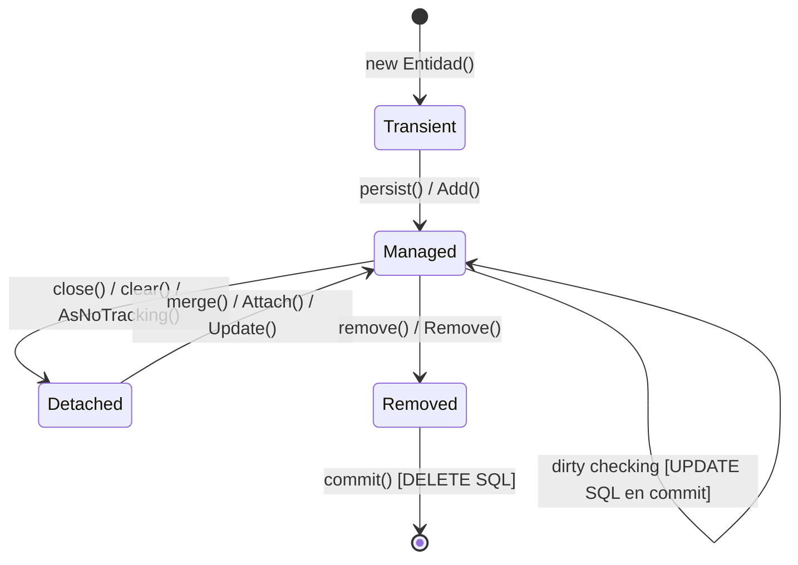
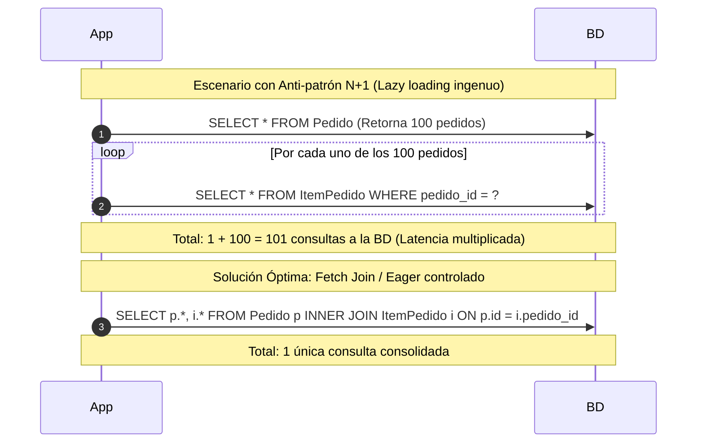
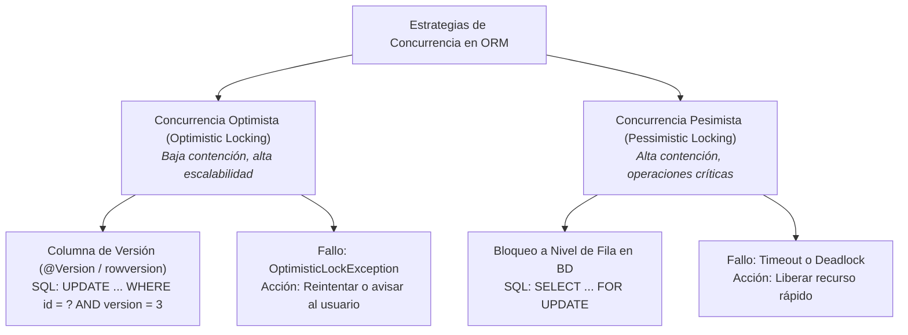

# ormMaster: Guía Maestra de Persistencia ORM, Ciclo de Vida y Rendimiento Transaccional

Esta skill define el estándar de ingeniería para diseñar, implementar, auditar y optimizar la persistencia orientada a objetos utilizando **Mapeadores Objeto-Relacionales modernos (ORMs)** como **JPA / Hibernate**, **Entity Framework Core (EF Core)**, **Prisma** y **SQLAlchemy**, erradicando cuellos de botella de rendimiento, inconsistencias transaccionales y problemas de concurrencia.

---

## 1. Fundamentos y Ciclo de Vida del Contexto de Persistencia

Los ORMs modernos no son simples ejecutores de SQL; implementan los patrones **Identity Map** y **Unit of Work** a través de un **Contexto de Persistencia** (`EntityManager` en JPA, `DbContext` en EF Core).



### 1.1. Estados del Ciclo de Vida de una Entidad

1. **Transient / New (Transitoria)**:
   - La instancia existe únicamente en la memoria RAM del proceso.
   - No posee representación en la base de datos ni identificador de clave primaria asignado (si es generado por secuencia/identidad).
2. **Managed / Attached (Gestionada / Vinculada)**:
   - La entidad está asociada activamente al contexto de persistencia actual.
   - Posee identidad en BD y participa en el **Identity Map** (garantía de que solo existe una única instancia en memoria para un mismo ID dentro de la transacción).
   - **Dirty Checking Automático**: Cualquier cambio en los atributos de una entidad gestionada es detectado automáticamente por el ORM al realizar `flush()` o `commit()`, emitiendo los `UPDATE` correspondientes **sin necesidad de llamar explícitamente a métodos de guardado**.
3. **Detached (Desvinculada)**:
   - La entidad posee clave primaria y existe en BD, pero el contexto de persistencia que la cargó fue cerrado o limpiado.
   - Si se accede a propiedades marcadas como *Lazy Loading*, se dispara una excepción catastrófica (`LazyInitializationException` en JPA/Hibernate o `ObjectDisposedException`).
4. **Removed / Deleted (Marcada para Borrado)**:
   - La entidad está programada para ser eliminada de la base de datos al sincronizar la transacción.

---

## 2. El Problema de las Consultas $N+1$ y Técnicas de Mitigación

El **problema $N+1$** es la patología de rendimiento más destructiva en aplicaciones con ORM. Ocurre cuando el sistema ejecuta 1 consulta para obtener $N$ registros padres y posteriormente ejecuta $N$ consultas individuales secundarias para obtener las entidades hijas asociadas.



### 2.1. Matriz de Mitigación de $N+1$

| Técnica | Mecanismo | Cuándo Utilizarla | Implementación Típica |
| :--- | :--- | :--- | :--- |
| **Fetch Join** | Fuerza un `JOIN` SQL en la misma consulta para materializar el grafo completo de objetos en memoria. | Casos de uso de negocio donde se requiere procesar el agregado completo con sus hijos. | **JPA**: `SELECT p FROM Pedido p JOIN FETCH p.items`<br>**EF Core**: `context.Pedidos.Include(p => p.Items)` |
| **Entity Graph / Named Entity Graph** | Define planes de carga dinámicos que se aplican condicionalmente a consultas de repositorio. | Mismo repositorio que necesita devolver grafos ligeros para listados y grafos profundos para edición. | **JPA**: `@EntityGraph(attributePaths = {"items", "cliente"})` |
| **Batch Fetching** | Carga las relaciones hijas utilizando cláusulas `WHERE id IN (?, ?, ...)` en lotes de tamaño configurable. | Escenarios donde no es viable hacer un JOIN cartesiano de múltiples colecciones simultáneas. | **Hibernate**: `@BatchSize(size = 25)`<br>**JPA**: `hibernate.default_batch_fetch_size=25` |
| **Proyecciones DTO de Solo Lectura** | Consulta directamente los campos necesarios saltándose el ciclo de vida del ORM (*Read-Only Projection*). | Endpoints de consulta, listados tabulares, reportes y APIs públicas (CQRS ligero). | **JPA**: `SELECT new PedidoListDto(p.id, p.total) FROM Pedido p`<br>**EF Core**: `query.AsNoTracking().Select(p => new PedidoDto { ... })` |

---

## 3. Demarcación Transaccional y Control de Concurrencia

### 3.1. Reglas de Demarcación Transaccional
1. **Límites en la Capa de Aplicación**: Las transacciones deben abrirse y cerrarse en los métodos de los **Casos de Uso / Servicios de Aplicación**, nunca en los controladores web ni en métodos individuales de entidades.
2. **Transacciones de Solo Lectura (*Read-Only Transactions*)**:
   - Declarar `@Transactional(readOnly = true)` en Spring o usar `.AsNoTracking()` en EF Core para consultas.
   - **Beneficio**: El ORM desactiva el snapshot de memoria para *Dirty Checking*, reduciendo drásticamente el consumo de CPU y memoria RAM.
3. **Rollback Determinístico ante Excepciones**:
   - En JPA/Spring, asegurar `rollbackFor = Exception.class` para que las excepciones comprobadas (*checked exceptions*) también reviertan la transacción.
   - En EF Core, envolver en bloques `using var tx = await context.Database.BeginTransactionAsync()` con `tx.CommitAsync()`.

---

### 3.2. Concurrencia Optimista vs. Pesimista



#### Código Canónico de Concurrencia Optimista:

```java
// JPA / Hibernate con @Version
@Entity
@Table(name = "pedidos")
public class Pedido {
    @Id
    @GeneratedValue(strategy = GenerationType.IDENTITY)
    private Long id;

    @Version
    @Column(name = "version")
    private Long version; // Control automático de concurrencia optimista

    private BigDecimal total;
    // ...
}
```

```csharp
// EF Core con [Timestamp] o IsRowVersion()
public class Pedido
{
    public Guid Id { get; set; }

    [Timestamp]
    public byte[] Version { get; set; } = []; // Concurrency token en SQL Server

    public decimal Total { get; set; }
}

// Configuración Fluent API alternativa:
modelBuilder.Entity<Pedido>()
    .Property(p => p.Version)
    .IsRowVersion();
```

---

## 4. Mapeo de Agregados DDD y Colecciones Seguras

### 4.1. Reglas de Mapeo para Evitar Corrupción del Dominio
1. **Colecciones Encapsuladas**:
   - En la entidad de dominio, declarar el campo interno como `List<T>` privado o protegido.
   - Exponer un getter que devuelva una vista de solo lectura (`Collections.unmodifiableList(items)` en Java o `IReadOnlyList<T>` / `AsReadOnly()` en C#).
   - Impedir que capas externas hagan `pedido.getItems().add(...)`. La mutación debe ocurrir mediante `pedido.agregarItem(...)`.
2. **Cascadas Estrictamente Delimitadas**:
   - Las operaciones en cascada (`CascadeType.ALL`, `orphanRemoval = true`) **SOLO deben configurarse hacia entidades que formen parte de la composición interna del agregado**.
   - **Prohibición**: Jamás configurar `CascadeType.ALL` o cascadas de borrado entre dos Raíces de Agregado independientes (ej. entre `Pedido` y `Cliente`). La relación entre agregados debe ser por ID o con asociaciones de solo lectura sin cascada.
3. **Equals y HashCode Basados en Identidad Estable**:
   - En JPA, no basar `equals` ni `hashCode` únicamente en el `@Id` si este es generado por secuencia o identidad autonumérica, porque antes del `persist()` el ID es `null`, rompiendo el comportamiento de colecciones `Set`.
   - Utilizar una clave de negocio única natural (*Business Key*) o comparar referencias / UUIDs asignados en el constructor.

---

## 5. Matriz de Anti-Patrones ORM y Soluciones

| Anti-Patrón ORM | Síntoma y Causa Raíz | Impacto en Producción | Solución Canónica |
| :--- | :--- | :--- | :--- |
| **Open Session in View (OSIV) Habilitado** | Mantener la sesión/conexión a BD abierta durante el renderizado de vistas o serialización JSON del controller. | Agotamiento del pool de conexiones de base de datos bajo carga media. | Deshabilitar OSIV (`spring.jpa.open-in-view=false`). Usar DTOs proyectados explícitamente en el servicio. |
| **Eager Loading por Defecto** | Anotar relaciones `@OneToMany` o `@ManyToMany` con `fetch = FetchType.EAGER`. | Cada consulta a una entidad dispara JOINs masivos innecesarios que traen miles de filas a memoria. | Configurar siempre `FetchType.LAZY` en colecciones y usar Fetch Joins explícitos solo cuando se necesiten. |
| **Mutación Bidireccional Asimétrica** | Añadir un elemento al lado hijo (`item.setPedido(pedido)`) sin sincronizar la colección del padre (`pedido.getItems().add(item)`). | El estado en memoria diverge del estado en base de datos; fallos en tests unitarios y cache L1. | Implementar métodos helper de sincronización en la entidad (ej. `pedido.agregarItem(item)` que asigne el puntero bidireccional). |
| **Calling Save on Managed Entities** | Invocar `repositorio.save(entidad)` en Spring Data dentro de un método `@Transactional` tras modificar atributos. | Redundancia innecesaria. El *Dirty Checking* del ORM ya sincroniza los cambios en el commit. | Modificar los métodos de negocio de la entidad; el ORM detectará las mutaciones y emitirá el `UPDATE` solo. |
| **Missing Foreign Key Indexes** | Tablas relacionales hijas sin índices explícitos sobre las columnas de clave foránea (`id_pedido`). | Bloqueos de tabla completa (*Table Locks*) en eliminaciones y scans secuenciales lentos en JOINs. | Declarar índices explícitos en BD: `@Table(indexes = @Index(columnList = "pedido_id"))` o DDL `CREATE INDEX`. |

---

## 6. Caso de Estudio Práctico: Optimización de Persistencia de Pedidos y Detalles

### 6.1. Implementación Optimizada en JPA / Spring Boot

```java
package com.backend.infraestructura.persistencia;

import jakarta.persistence.*;
import java.math.BigDecimal;
import java.time.Instant;
import java.util.*;

@Entity
@Table(name = "pedidos", indexes = {
    @Index(name = "idx_pedidos_cliente", columnList = "cliente_id"),
    @Index(name = "idx_pedidos_fecha", columnList = "fecha_creacion")
})
public class PedidoEntity {

    @Id
    @GeneratedValue(strategy = GenerationType.IDENTITY)
    private Long id;

    @Column(name = "cliente_id", nullable = false)
    private UUID clienteId;

    @Column(name = "fecha_creacion", nullable = false, updatable = false)
    private Instant fechaCreacion;

    @Version
    @Column(name = "version")
    private Long version; // Concurrencia optimista

    // Colección Lazy con Cascade y orphanRemoval hacia la composición interna
    @OneToMany(mappedBy = "pedido", cascade = CascadeType.ALL, orphanRemoval = true, fetch = FetchType.LAZY)
    private List<ItemPedidoEntity> items = new ArrayList<>();

    protected PedidoEntity() {} // Requerido por JPA

    public PedidoEntity(UUID clienteId) {
        this.clienteId = Objects.requireNonNull(clienteId);
        this.fechaCreacion = Instant.now();
    }

    public void agregarItem(String sku, String descripcion, int cantidad, BigDecimal precioUnitario) {
        ItemPedidoEntity item = new ItemPedidoEntity(this, sku, descripcion, cantidad, precioUnitario);
        this.items.add(item);
    }

    public List<ItemPedidoEntity> getItems() {
        return Collections.unmodifiableList(items); // Colección protegida
    }

    public Long getId() { return id; }
    public UUID getClienteId() { return clienteId; }
    public Long getVersion() { return version; }
}

@Entity
@Table(name = "items_pedido", indexes = {
    @Index(name = "idx_items_pedido_fk", columnList = "pedido_id")
})
class ItemPedidoEntity {

    @Id
    @GeneratedValue(strategy = GenerationType.IDENTITY)
    private Long id;

    @ManyToOne(fetch = FetchType.LAZY, optional = false)
    @JoinColumn(name = "pedido_id", nullable = false)
    private PedidoEntity pedido;

    @Column(nullable = false, length = 50)
    private String sku;

    @Column(nullable = false, length = 255)
    private String descripcion;

    @Column(nullable = false)
    private int cantidad;

    @Column(name = "precio_unitario", nullable = false, precision = 18, scale = 2)
    private BigDecimal precioUnitario;

    protected ItemPedidoEntity() {}

    ItemPedidoEntity(PedidoEntity pedido, String sku, String descripcion, int cantidad, BigDecimal precioUnitario) {
        this.pedido = Objects.requireNonNull(pedido);
        this.sku = Objects.requireNonNull(sku);
        this.descripcion = Objects.requireNonNull(descripcion);
        this.cantidad = cantidad;
        this.precioUnitario = Objects.requireNonNull(precioUnitario);
    }

    public Long getId() { return id; }
    public String getSku() { return sku; }
}
```

#### Repositorio Spring Data con Mitigación de $N+1$:

```java
package com.backend.infraestructura.persistencia;

import org.springframework.data.jpa.repository.JpaRepository;
import org.springframework.data.jpa.repository.Query;
import org.springframework.data.repository.query.Param;
import org.springframework.stereotype.Repository;
import java.util.Optional;

@Repository
public interface PedidoJpaRepository extends JpaRepository<PedidoEntity, Long> {

    // Fetch Join explícito para resolver el agregado completo en 1 sola consulta sin N+1
    @Query("SELECT p FROM PedidoEntity p JOIN FETCH p.items WHERE p.id = :id")
    Optional<PedidoEntity> findByIdWithItems(@Param("id") Long id);

    // Proyección DTO directa para listados rápidos de solo lectura
    @Query("SELECT new com.backend.aplicacion.PedidoResumenDto(p.id, p.clienteId, p.fechaCreacion, COUNT(i.id)) " +
           "FROM PedidoEntity p LEFT JOIN p.items i GROUP BY p.id, p.clienteId, p.fechaCreacion")
    List<PedidoResumenDto> findResumenesPedidos();
}
```

---

## 7. Verificación y Checklist de Calidad ORM

Antes de dar por validada una implementación de persistencia:
- [ ] ¿Están todas las relaciones `@OneToMany` / `@ManyToMany` configuradas como `LAZY`?
- [ ] ¿Se eliminaron todas las consultas en bucles (`for`/`foreach`) sustituyéndolas por Fetch Joins o proyecciones?
- [ ] ¿Está habilitado el control de concurrencia optimista (`@Version` / `[Timestamp]`) en las entidades transaccionales clave?
- [ ] ¿Están indexadas todas las columnas de Clave Foránea en la base de datos?
- [ ] ¿Está deshabilitado el anti-patrón Open Session In View (OSIV) en la configuración de la aplicación?
- [ ] ¿Se utilizan transacciones de solo lectura (`readOnly = true` / `.AsNoTracking()`) para operaciones de consulta?
