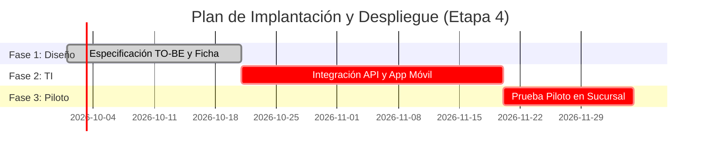

# processImprovementPlanner

Orquestador metodológico del ciclo de Gestión y Mejora de Procesos (GMP / ciclo PDCA de 4 etapas), compilador de informes técnicos maestros y generador de cronogramas y trazabilidad integral sin dependencia de Excel.

---

## 1. Propósito General

`processImprovementPlanner` articula el flujo de trabajo integral de reingeniería y optimización de procesos de negocio. Coordina la intervención sucesiva de las skills analíticas (`processWorkbench`, `processAuditor`, `bpmnExtractor`, `kpiDesigner`, `diagramStudio`), garantizando que los hallazgos de cada etapa se transformen en acciones de intervención viables y verificables.

Resuelve el problema del versionado y la complejidad de plantillas Excel propietarias al producir:
- **Informe Maestro Consolidado:** Un único archivo Markdown (`.md`) navegable y estandarizado con todas las secciones del proyecto.
- **Diagrama de Gantt en Mermaid:** Plan de implantación temporal con fases, tareas críticas, recursos y dependencias directamente interpretable por plataformas de código y documentación (GitHub, GitLab, Obsidian, Notion).
- **Matriz de Trazabilidad Integral ($E_1 \rightarrow E_2 \rightarrow E_3 \rightarrow E_4$):** Matriz que conecta los criterios estratégicos de selección inicial con los problemas detectados en la auditoría, las acciones del CAME, las modificaciones del proceso propuesto, los KPIs y las tareas del cronograma.

---

## 2. Arquitectura Interna

```
processImprovementPlanner/
├── SKILL.md                              # Contrato operativo para el agente orquestador
├── README.md                             # Guía metodológica para el analista y docente
├── templates/                            # Plantillas de entrega consolidada
│   ├── master_report_template.md         # Estructura del Informe Técnico Maestro (.md)
│   ├── gantt_template.mmd                # Cronograma temporal en sintaxis Mermaid Gantt
│   └── e1_e4_traceability_matrix.md      # Matriz de trazabilidad integral E1 a E4
└── references/                           # Manuales del ciclo PDCA y gestión del cambio
```

---

## 3. Prerequisitos de Entorno

- No requiere dependencias de software complejas ni licencias ofimáticas.
- Se recomienda un visor compatible con bloques Mermaid (ej. visualizador Markdown de VS Code, Obsidian o GitHub).

---

## 4. Ejemplos de Invocación y Uso

### Generación de Cronograma de Implantación (Gantt)


### Auditoría de la Cadena de Trazabilidad
```markdown
Comprobación de Trazabilidad:
- Entrada E1: Criterio C1 (Reducción de costos logísticos)
- Diagnóstico E2: Debilidad D2 (Demora de 48h por remito físico)
- Estrategia E3: Cruce DO (D2 + O1) ➔ Acción de Valor AV-01 (App chofer con remito digital)
- Filtro E3: APROBADA (Plazo 8 sem, bajo costo, API estándar)
- Proceso E4: Tarea de archivo manual reemplazada por evento digital en BPD TO-BE
- Medición E4: KPI-OPS-01 (Lead Time reducido de 48h a 4h)
- Despliegue E4: Tarea T-03 en cronograma Gantt
Resultado: CADENA COMPLETA Y CONFORME (Sin eslabones rotos).
```

---

## 5. Especificación de Artefactos de Entrada y Salida

### Entradas (Inputs)
- Artefactos producidos por las etapas anteriores:
  - Etapa 1: Encuadre y matriz de 5 criterios de `processWorkbench`.
  - Etapa 2: Diagnóstico forense de `processAuditor` y BPD AS-IS de `bpmnExtractor`.
  - Etapa 3: Cruces CAME y acciones EERR filtradas de `processWorkbench`.
  - Etapa 4: BPD TO-BE y comparativa de `bpmnExtractor`, catálogo de KPIs de `kpiDesigner`.

### Salidas (Outputs)
- **Informe Maestro (.md):** Documento final consolidado de cátedra o consultoría.
- **Gantt Mermaid:** Código ejecutable para visualización del plan de acción.
- **Matriz $E_1 \rightarrow E_4$:** Tabla de trazabilidad de punta a punta.
