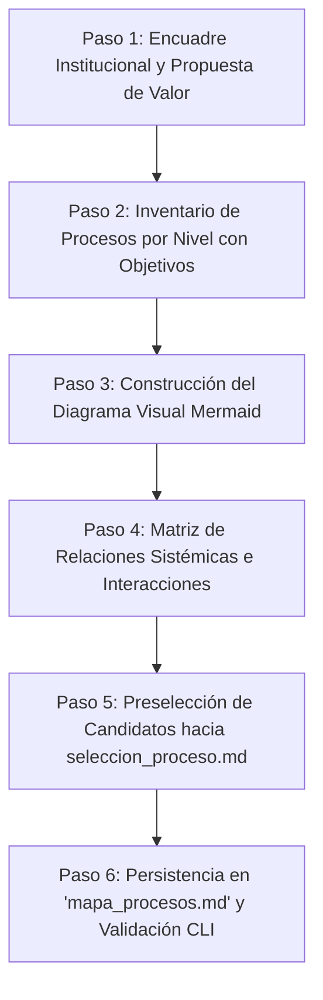

# processMap: Mapa de Procesos Institucional (GMP Etapa 1)

Habilidad atómica especialista para la construcción, auditoría y validación del **Mapa de Procesos Institucional**, correspondiente a la **Etapa 1 (Situación Actual y Encuadre)** de la metodología de **Gestión y Mejora de Procesos (GMP)**, fundamentada en la diapositiva oficial `SLI_U1_C03_Mapa_de_Procesos.pdf` y la Matriz 2 de `PlanillaMATRICES-TPI 2026 con ejemplo.xlsx`.

---

## 1. Contrato Operativo Determinista

- **Entregable Canónico Obligatorio:** Toda invocación de esta skill debe generar y persistir el entregable estructurado exclusivamente en el archivo:
  ```text
  mapa_procesos.md
  ```
- **Sin Dependencia de Excel:** Produce el inventario estructurado con sus objetivos específicos y el bloque de diagrama visual en Markdown puro.
- **Validación Automática:** Toda salida debe someterse a verificación mediante el script determinista:
  ```bash
  python "skills/processMap/scripts/validate_process_map.py" mapa_procesos.md
  ```

---

## 2. Desencadenantes de Activación (Triggers)

Esta skill debe activarse cuando el usuario o el agente orquestador solicite:
- Construir o diagramar el Mapa de Procesos de una organización o empresa.
- Clasificar los procesos de negocio en los 3 niveles canónicos (Estratégicos, Operativos/Misionales y de Soporte).
- Definir los objetivos específicos de cada proceso y alinearlos a la estrategia organizacional.
- Mapear el flujo de valor desde los requisitos del cliente hasta su satisfacción final.
- Resolver la Matriz 2 de la Etapa 1 del Trabajo Práctico Integrador (TPI).
- Identificar y listar los procesos candidatos para su pase a la matriz multicriterio de selección (`processCriticalSelector`).

---

## 3. Fundamentos de Cátedra (SLI_U1_C03)

### 3.1 Los 3 Niveles Canónicos de Procesos
1. **Procesos Estratégicos (Dirección y Gobierno):**
   - Definen la dirección de la organización, establecen objetivos y políticas, asignan recursos y toman decisiones de largo plazo (`SLI_U1_C03`, p. 3).
   - *Ejemplos:* Planificación estratégica institucional, Gestión de calidad e innovación, Alianzas y convenios, Acreditaciones externas.
   - *Identificador:* `PE-01`, `PE-02`, etc.
2. **Procesos Operativos, Clave o Misionales (Cadena de Valor Primaria):**
   - Intervienen directamente en la generación del producto o prestación del servicio. Crean valor percibible para el cliente y constituyen el núcleo del negocio (`SLI_U1_C03`, p. 4).
   - *Ejemplos:* Admisión/Enrolamiento, Gestión de la enseñanza-aprendizaje/Producción, Titulación/Despacho y entrega.
   - *Identificador:* `PO-01`, `PO-02`, etc.
3. **Procesos de Soporte o Apoyo (Habilitadores de Recursos):**
   - Apoyan y suministran los recursos necesarios para que los procesos operativos funcionen. No generan valor directo para el cliente externo pero son indispensables (`SLI_U1_C03`, p. 5).
   - *Ejemplos:* Gestión de recursos humanos, Gestión financiera/presupuestaria, Infraestructura y mantenimiento, Soporte TI y ciberseguridad.
   - *Identificador:* `PS-01`, `PS-02`, etc.

### 3.2 Fronteras del Mapa: Requisitos y Satisfacción
El mapa se delimita entre dos nodos externos fundamentales:
- **Entrada (a la izquierda):** Clientes / Mercado / Sociedad ➔ Requisitos, necesidades, expectativas y marco regulatorio.
- **Salida (a la derecha):** Clientes / Beneficiarios ➔ Satisfacción, valor co-creado, servicio entregado e impacto.

---

## 4. Flujo de Ejecución Paso a Paso



### Paso 1: Encuadre Institucional
Relevar nombre de la entidad, rubro, actividad principal, misión, visión y cliente primario (vinculado a `organizationAnalysis`).

### Paso 2: Inventario de Procesos y Formulación de Objetivos
- Identificar al menos 2 a 4 procesos en cada una de las 3 categorías canónicas.
- Formular para cada proceso su objetivo formal con verbo en infinitivo, estableciendo qué transforma y qué valor genera.
- Asignar roles responsables tentativos y principales salidas.

### Paso 3: Diagramación Visual en Mermaid
- Estructurar el diagrama horizontal (`flowchart LR` o `flowchart TB`) con 3 subgrafos (`ESTRATEGICOS`, `OPERATIVOS`, `SOPORTE`).
- Conectar los requisitos del cliente hacia los procesos operativos (`REQ ==> PO01`).
- Conectar los procesos operativos hacia la satisfacción del cliente (`PO_final ==> SAT`).
- Indicar flechas de directrices desde Estratégicos hacia Operativos y de recursos desde Soporte hacia Operativos.
- Aplicar estilos cromáticos diferenciados para cada nivel.

### Paso 4: Matriz de Relaciones Sistémicas
Tabular las interacciones clave de control (Estratégicos ➔ Operativos) y de habilitación (Soporte ➔ Operativos).

### Paso 5: Preselección de Procesos Candidatos
Seleccionar 3 o 4 procesos operativos para ser evaluados en la Matriz Multicriterio Ponderada de 5 Factores (`processCriticalSelector`).

### Paso 6: Persistencia y Validación
- Guardar el informe completo en `mapa_procesos.md` siguiendo la plantilla `templates/process_map_template.md`.
- Ejecutar el validador determinista:
  ```bash
  python "skills/processMap/scripts/validate_process_map.py" mapa_procesos.md
  ```

---

## 5. Estructura Canónica de `mapa_procesos.md`

El archivo debe contener exactamente las siguientes 5 secciones:
1. `# Mapa de Procesos Institucional (GMP Etapa 1)`
2. `## 1. Identificación y Encuadre Institucional`
3. `## 2. Diagrama Visual del Mapa de Procesos (3 Niveles de Cátedra)` (Bloque Mermaid)
4. `## 3. Inventario Estructurado de Procesos y Objetivos` (Tablas 3.1 `PE-XX`, 3.2 `PO-XX`, 3.3 `PS-XX`)
5. `## 4. Matriz de Relaciones Sistémicas e Interacciones`
6. `## 5. Insumos para la Selección del Proceso Crítico (Pase a seleccion_proceso.md)`

---

## 6. Recursos y Referencias

- `references/process_classification_guide.md`: Taxonomía y marco teórico completo de los 3 niveles.
- `templates/process_map_template.md`: Plantilla Markdown institucional lista para usar.
- `examples/mapa_procesos_ejemplo.md`: Caso canónico validado de cátedra (Universidad Privada).
- `scripts/validate_process_map.py`: Validador determinista en Python.
