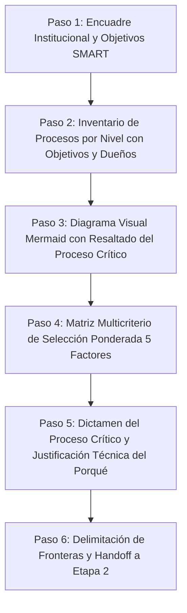

# processMap: Mapa de Procesos Institucional y Selección de Proceso Crítico (GMP Etapa 1)

Habilidad atómica especialista para la construcción, modelado, auditoría y validación del **Mapa de Procesos Institucional** y la **Selección Ponderada del Proceso Crítico**, correspondiente a la **Etapa 1 (Situación Actual y Encuadre)** de la metodología de **Gestión y Mejora de Procesos (GMP)**, fundamentada en `SLI_U1_C03_Mapa_de_Procesos.pdf`, `SLI_U2_C01_Seleccion_Proceso.pdf` y la Matriz 2 de `PlanillaMATRICES-TPI 2026 con ejemplo.xlsx`.

---

## 1. Contrato Operativo Determinista

- **Entregable Canónico Obligatorio:** Toda invocación de esta skill debe generar y persistir el entregable estructurado exclusivamente en el archivo:
  ```text
  mapa_procesos.md
  ```
  *(Nota de interoperabilidad: si el usuario o un orquestador solicita específicamente `seleccion_proceso.md`, la skill exporta también la sección multicriterio a dicho archivo).*
- **Sin Dependencia de Software Propietario ni Excel:** Produce el inventario institucional completo, el bloque visual Mermaid y la matriz multicriterio con justificación en Markdown puro.
- **Validación Automática:** Toda salida debe someterse a verificación determinista mediante:
  ```bash
  python "skills/processMap/scripts/validate_process_map.py" mapa_procesos.md
  ```

---

## 2. Desencadenantes de Activación (Triggers)

Esta skill debe activarse cuando el usuario o el agente orquestador solicite:
- Construir, diagramar o actualizar el Mapa de Procesos institucional de una organización.
- Clasificar los procesos de negocio en los 3 niveles canónicos de cátedra (Estratégicos, Operativos/Misionales y de Soporte).
- Evaluar, priorizar o seleccionar cuál es el **proceso crítico** a intervenir en la organización y explicar el **porqué de esa selección**.
- Aplicar la matriz multicriterio ponderada de los **5 factores de cátedra** para la toma de decisiones de procesos.
- Resolver la Matriz 2 de la Etapa 1 del Trabajo Práctico Integrador (TPI) de GMP.
- Invocar los comandos `/processMap`, `/mapaProcesos`, `/process-map` o los alias heredados `/processCriticalSelector`, `/process-critical-selector`, `/criticalSelector`.

---

## 3. Fundamentos Metodológicos de Cátedra

### 3.1 Los 3 Niveles Canónicos de Procesos (`SLI_U1_C03`)
1. **Procesos Estratégicos (PE - Dirección y Gobierno):**  
   Definen lineamientos, políticas institucionales, planificación de largo plazo, asignación de recursos y toma de decisiones corporativas (`SLI_U1_C03`, p. 3).  
   *Nomenclatura:* `PE-01`, `PE-02`, etc.
2. **Procesos Operativos / Clave / Misionales (PO - Cadena de Valor):**  
   Intervienen directamente en la generación del producto o servicio sustantivo. Crean valor percibible para el cliente externo y conforman el núcleo del negocio (`SLI_U1_C03`, p. 4).  
   *Nomenclatura:* `PO-01`, `PO-02`, etc.
3. **Procesos de Soporte o Apoyo (PS - Habilitadores de Recursos):**  
   Suministran los recursos (humanos, financieros, informáticos, físicos) indispensables para que los procesos operativos funcionen eficazmente (`SLI_U1_C03`, p. 5).  
   *Nomenclatura:* `PS-01`, `PS-02`, etc.

### 3.2 Fronteras del Mapa: Requisitos y Satisfacción
El mapa se delimita entre dos nodos externos fundamentales:
- **Entrada (a la izquierda):** Clientes / Mercado / Sociedad ➔ Requisitos, necesidades, marco regulatorio y expectativas.
- **Salida (a la derecha):** Clientes / Graduados / Beneficiarios ➔ Satisfacción, valor co-creado e impacto.

### 3.3 Los 5 Factores Normativos de Selección Crítica (`SLI_U2_C01`)
De los procesos mapeados (típicamente del nivel operativo), se evalúan los candidatos mediante la matriz multicriterio ponderada:

| Código | Factor de Cátedra | Peso Típico ($w_i$) | Criterio de Decisión en Cátedra |
|:---:|:---|:---:|:---|
| **$C_1$** | **Impacto en la Estrategia** | `0.25` (25%) | Capacidad del proceso para apalancar objetivos estratégicos, competitividad y eficiencia. |
| **$C_2$** | **Tendencias del Entorno / SDL** | `0.20` (20%) | Respuesta a digitalización, autoservicio, inmediatez y co-creación de valor (Lógica Dominante del Servicio). |
| **$C_3$** | **Problemas, Costos y Fricciones** | `0.25` (25%) | Volumen de mermas, demoras crónicas, horas hombre perdidas, cuellos de botella y costos de retrabajo. |
| **$C_4$** | **Cliente y Experiencia** | `0.20` (20%) | Sensibilidad del usuario ante el servicio, volumen de reclamos, caída de satisfacción o deserción. |
| **$C_5$** | **Producto / Servicio** | `0.10` (10%) | Relevancia en la entrega de la propuesta de valor sustantiva y el producto comercializado. |

### 3.4 Modelo Matemático y Desempate Objetivo
1. **Condición de Cierre:** $\sum_{i=1}^5 w_i = 1.00$ (100%).
2. **Escala Discreta:** Calificaciones $C_{i,p} \in \{1, 2, 3, 4, 5\}$.
3. **Puntaje Ponderado:** $S_p = \sum_{i=1}^5 w_i \times C_{i,p}$.
4. **Regla Jerárquica de Desempate:** Si $S_a = S_b$, se resuelve por:
   $$\text{Mayor } C_3 \longrightarrow \text{Mayor } C_1 \longrightarrow \text{Mayor } C_4 \longrightarrow \text{Mayor } C_5 \longrightarrow \text{Mayor } C_2$$

---

## 4. Flujo de Ejecución Paso a Paso



### Paso 1: Encuadre Institucional y Objetivos SMART
- Documentar nombre, actividad principal, misión actual, visión futura, cliente primario, propuesta de valor y 2-3 Objetivos Estratégicos SMART (`OE-1`, `OE-2`, etc.) provenientes de `cadena_valor_virtual.md`.

### Paso 2: Inventario de Procesos por Nivel con Objetivos y Dueños
- Clasificar los procesos de la organización en:
  - Estratégicos (`PE-01`, `PE-02`, etc.).
  - Operativos / Clave (`PO-01`, `PO-02`, etc.).
  - Soporte (`PS-01`, `PS-02`, etc.).
- Formular el objetivo de cada proceso con verbo en infinitivo y designar el rol o área responsable del proceso.

### Paso 3: Diagrama Visual Mermaid con Resaltado del Proceso Crítico
- Diseñar el diagrama `flowchart LR` con subgrafos (`ESTRATEGICOS`, `OPERATIVOS`, `SOPORTE`), flujos entre niveles y nodos externos de clientes (`REQ` a la izquierda, `SAT` a la derecha).
- Aplicar estilo visual de destaque al proceso crítico seleccionado:
  ```mermaid
  classDef critico fill:#ffe082,stroke:#d97706,stroke-width:3px,font-weight:bold;
  class PO02 critico;
  ```

### Paso 4: Matriz Multicriterio de Selección Ponderada (5 Factores)
- Listar los procesos operativos candidatos a rediseño (mínimo 2 o 3 procesos clave).
- Justificar el vector de ponderación $W$ ($\sum w_i = 1.00$).
- Asignar calificaciones [1..5] fundamentadas en el relevamiento del caso.
- Calcular determinísticamente $S_p = \sum w_i C_i$ y establecer el ranking.

### Paso 5: Dictamen del Proceso Crítico y Justificación del Porqué
- Declarar inequívocamente el ganador (proceso con mayor $S_p$ o desempate objetivo).
- Redactar la **Justificación Técnica Exhaustiva (El Porqué)** estructurada en los 5 factores:
  - **Sustento en C1:** Conexión causal con los OE institucionales.
  - **Sustento en C2:** Oportunidad de co-creación de valor y servitización bajo SDL.
  - **Sustento en C3:** Evidencias de cuellos de botella, costos de retrabajo, mermas y riesgos.
  - **Sustento en C4:** Dolores del cliente, quejas formales, tiempos de espera y momentos de la verdad.
  - **Sustento en C5:** Relevancia sobre el producto/servicio nuclear entregado.

### Paso 6: Delimitación de Fronteras y Handoff a Etapa 2
- Definir la frontera inicial (disparador exacto) y la frontera final (resultado entregado al cliente).
- Enlazar directamente a los entregables inmediatos de Etapa 2:
  - `sipocBuilder` ➔ `sipoc.md`
  - `bpmnExtractor` ➔ BPD AS-IS en BPMN 2.0
  - `processAuditor` ➔ Auditoría forense de los 4 ejes
  - `stakeholderMatrix` ➔ `stakeholders.md`
  - `fodaProcess` ➔ `foda.md`

---

## 5. Verificación Determinista

Antes de dar por concluido el artefacto, ejecutar:
```bash
python "skills/processMap/scripts/validate_process_map.py" mapa_procesos.md
```
El validador confirmará que:
1. Las 5 secciones requeridas estén presentes.
2. El diagrama Mermaid sea válido y resalte el proceso crítico.
3. Existan procesos en los 3 niveles con objetivos y dueños.
4. La suma de pesos sea exactamente 1.00 y las notas pertenezcan a [1..5].
5. El cálculo de $S_p$ coincida con la fórmula matemática.
6. El proceso crítico declarado coincida con el ganador matemático.
7. La justificación técnica posea un desarrollo sustantivo ($\ge 80$ palabras con sustento multifactorial).
