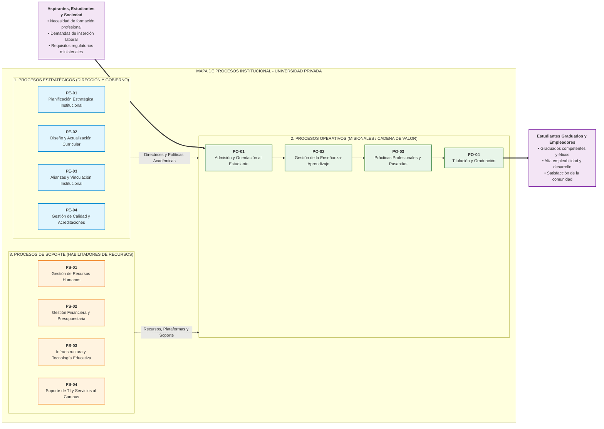

# Mapa de Procesos Institucional (GMP Etapa 1)

**Organización Bajo Estudio:** Universidad Privada de Nivel Superior (Caso Canónico de Cátedra - TPI 2026)  
**Rubro / Actividad:** Servicio Educativo Terciario y Universitario de Formación Profesional Integral  
**Fecha de Elaboración:** 2026-09-11  
**Versión:** 1.0  
**Documentos Fuente de Cátedra:** `PlanillaMATRICES-TPI 2026 con ejemplo.xlsx` (Hoja *'Etapa 1 Situación actual'*, Matriz 2: *MAPA DE PROCESOS*) y `SLI_U1_C03_Mapa_de_Procesos.pdf`.

---

## 1. Identificación y Encuadre Institucional

| Campo | Definición / Descripción |
|---|---|
| **Nombre de la Organización** | Universidad Privada de Nivel Superior |
| **Rubro y Actividad Principal** | Educación Superior Universitaria, Formación de Grado, Posgrado y Extensión Profesional |
| **Misión Institucional** | Brindar educación superior de excelencia académica formando profesionales éticos e innovadores mediante programas curriculares actualizados y acompañamiento académico continuo. |
| **Visión Estratégica** | Consolidarse como referente en educación superior flexible, digital e innovadora, liderando la co-creación de valor formativo y la empleabilidad de sus graduados. |
| **Cliente / Beneficiario Primario** | Estudiantes universitarios activos, aspirantes a carreras de grado/posgrado y empresas/organizaciones demandantes de graduados calificados. |
| **Propuesta de Valor Central** | Formación académica integral, acreditada oficialmente, combinando contenidos teóricos con prácticas profesionales tempranas y entornos digitales de aprendizaje. |

---

## 2. Diagrama Visual del Mapa de Procesos (3 Niveles de Cátedra)

---

## 3. Inventario Estructurado de Procesos y Objetivos

### 3.1 Procesos Estratégicos (Dirección y Gobierno)
Procesos que definen la dirección de la universidad, establecen objetivos y políticas, asignan presupuestos y toman decisiones de largo plazo (`SLI_U1_C03`, p. 3).

| ID | Nombre del Proceso | Objetivo del Proceso (Alineación Estratégica) | Dueño / Responsable | Salidas Principales |
|---|---|---|---|---|
| `PE-01` | **Planificación Estratégica Institucional** | Definir y alinear los objetivos institucionales de mediano y largo plazo con la misión, visión y entorno, asegurando la sostenibilidad y mejora continua. | Rectorado y Consejo Superior | Plan Estratégico Quinquenal, Cuadro de Mando Integral y Políticas Institucionales. |
| `PE-02` | **Diseño y Actualización Curricular** | Desarrollar y actualizar propuestas curriculares de alta calidad, pertinentes con las demandas del mercado laboral y los desafíos del desarrollo sostenible. | Secretaría Académica y Decanatos | Planes de Estudio aprobados, Diseños Curriculares por competencias y Guías Docentes. |
| `PE-03` | **Gestión de Alianzas y Vinculación Institucional** | Desarrollar redes estratégicas con instituciones, empresas y organismos para potenciar el impacto académico, científico y social de la universidad. | Dirección de Relaciones Institucionales | Convenios marco de cooperación, acuerdos de pasantías y proyectos de vinculación. |
| `PE-04` | **Gestión de Calidad y Acreditaciones** | Obtener y mantener reconocimientos y acreditaciones externas (CONEAU / Ministeriales) que validen la calidad institucional y de las carreras. | Dirección de Aseguramiento de Calidad | Informes de Autoevaluación, Dictámenes de acreditación y Planes de Mejora. |

### 3.2 Procesos Operativos, Clave o Misionales (Cadena de Valor Primaria)
Procesos que intervienen directamente en la formación del estudiante y la prestación del servicio educativo (`SLI_U1_C03`, p. 4).

| ID | Nombre del Proceso | Objetivo del Proceso (Creación de Valor) | Dueño / Responsable | Salidas Principales (Entregables) |
|---|---|---|---|---|
| `PO-01` | **Admisión y Orientación al Estudiante** | Asegurar un ingreso equitativo, transparente y eficiente, brindando orientación vocacional oportuna para una adecuada integración académica y social. | Dirección de Admisiones y Enrolamiento | Alumnos matriculados legalmente, legajos digitales habilitados y asignación de cohortes. |
| `PO-02` | **Gestión de la Enseñanza-Aprendizaje** | Garantizar procesos formativos innovadores, inclusivos y centrados en el estudiante, que promuevan el pensamiento crítico, la retención y el aprendizaje significativo. | Coordinadores de Carrera y Cuerpo Docente | Cursos dictados, actas de regularidad, calificaciones asentadas y competencias acreditadas. |
| `PO-03` | **Gestión de Prácticas Profesionales y Pasantías** | Facilitar experiencias formativas en entornos reales que potencien la empleabilidad y articulen la formación académica con el mundo del trabajo. | Secretaría de Extensión y Pasantías | Prácticas supervisadas aprobadas, informes de tutores de empresa y créditos validados. |
| `PO-04` | **Titulación y Graduación** | Gestionar de forma ágil, segura y legalizada la tramitación del diploma oficial y la graduación del egresado. | Secretaría General y Despacho de Títulos | Título profesional expedido, analítico final legalizado y registro ministerial. |

### 3.3 Procesos de Soporte o Apoyo (Habilitadores de Recursos)
Procesos que apoyan y suministran los recursos necesarios para que los procesos de enseñanza y admisión operen con eficacia (`SLI_U1_C03`, p. 5).

| ID | Nombre del Proceso | Objetivo del Proceso (Habilitador de Recursos) | Dueño / Responsable | Servicios / Recursos Suministrados |
|---|---|---|---|---|
| `PS-01` | **Gestión de Recursos Humanos (Docentes y Nodocentes)** | Atraer, desarrollar y retener talento humano comprometido con los valores institucionales y la excelencia educativa. | Dirección de Gestión Humana | Selección, contratación, plan de carrera docente, liquidación de haberes y clima laboral. |
| `PS-02` | **Gestión Financiera y Presupuestaria** | Administrar los recursos económicos de manera eficiente, transparente y alineada a las prioridades estratégicas institucionales. | Dirección de Finanzas y Cobranzas | Presupuestos operativos, gestión de aranceles, balance contable y auditorías de fondos. |
| `PS-03` | **Gestión de Infraestructura y Espacios Físicos** | Proveer y mantener espacios físicos, aulas, laboratorios y áreas comunes en óptimas condiciones de seguridad e higiene. | Intendencia y Mantenimiento | Aulas operativas, laboratorios equipados, protocolos de bioseguridad y servicios edilicios. |
| `PS-04` | **Soporte de TI y Tecnología Educativa** | Proveer, mantener y asegurar la disponibilidad continua de plataformas virtuales de aprendizaje, sistemas ERP y telecomunicaciones. | Dirección de Tecnologías de la Información (TI) | Campus Virtual 24/7 disponible, Sistema de Gestión Académica (ERP), conectividad y ciberseguridad. |

---

## 4. Matriz de Relaciones Sistémicas e Interacciones

| Desde Nivel / Proceso | Hacia Nivel / Proceso | Tipo de Relación / Interacción | Flujo de Información / Recurso Intercambiado |
|---|---|---|---|
| **Aspirantes / Sociedad** | **`PO-01` Admisión** | Requisito de Entrada | Solicitudes de inscripción, certificados secundarios y demandas de formación. |
| **`PE-01` / `PE-02` Estratégicos** | **`PO-01` a `PO-04` Operativos** | Control y Directrices | Planes de estudio, reglamentos académicos, cupos por comisión y estándares de calidad. |
| **`PS-04` TI / `PS-01` RRHH** | **`PO-02` Enseñanza-Aprendizaje** | Habilitación de Recursos | Docentes designados, aulas virtuales configuradas en el LMS y soporte a plataformas. |
| **`PO-04` Titulación** | **Graduados y Empleadores** | Salida de Valor | Profesionales idóneos con títulos habilitantes oficiales y perfil de competencias verificado. |

---

## 5. Insumos para la Selección del Proceso Crítico (Pase a `seleccion_proceso.md`)

De los 4 procesos operativos identificados en la cadena de valor institucional, se preseleccionan los siguientes candidatos para la Matriz Multicriterio de Decisión Ponderada de 5 Factores (`processCriticalSelector`):
1. **Candidato 1 (`PO-01`):** Admisión y Orientación al Estudiante (Presenta cuellos de botella iniciales de inscripción pero alcance acotado a aspirantes).
2. **Candidato 2 (`PO-02`):** Gestión de la Enseñanza-Aprendizaje y Trayectoria Formativa (Impacto transversal masivo, deserción del 30% en los primeros años, sobrecarga burocrática docente y demanda de virtualización).
3. **Candidato 3 (`PO-04`):** Titulación y Graduación (Demoras de hasta 12 meses en la expedición de títulos por visados manuales).

*Conclusión de Fase:* Los 3 candidatos se transfieren a la matriz multicriterio de cátedra en `seleccion_proceso.md`.
